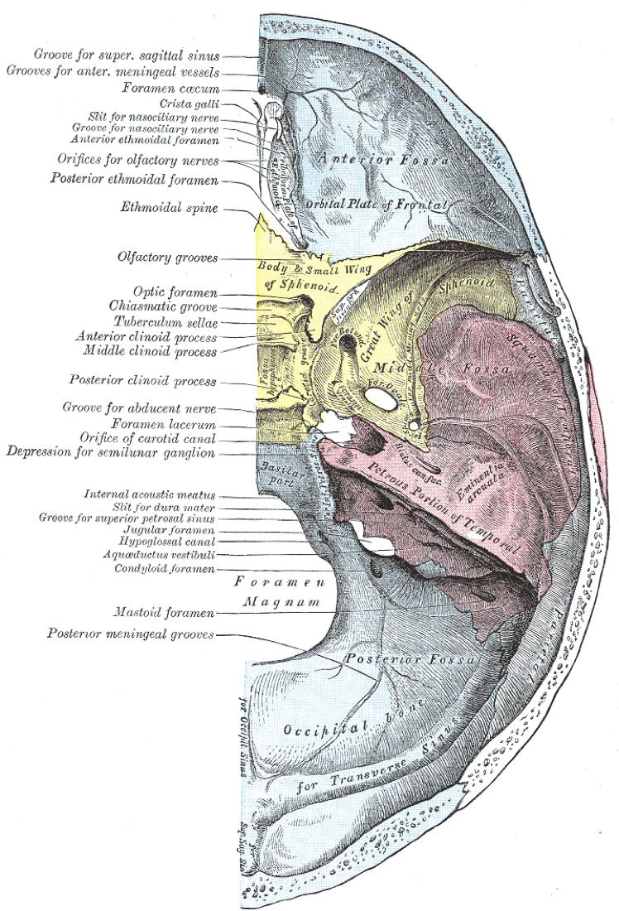

# Case Prep: Epidural Hematoma (EDH) Evacuation

---

## One-Liner
[Age]yo [M/F] with acute [left/right] [temporal/frontal/parietal/posterior fossa] epidural hematoma [___ mm max thickness, ___ mm midline shift] following [trauma mechanism] presenting with [GCS ___ / lucid interval / pupil changes] planned for emergent craniotomy for evacuation.

---

## Figures, Imaging & Video

**🎥 Operative videos:** [YouTube](https://www.youtube.com/results?search_query=extradural+haematoma+surgery) · [Neurosurgical Atlas](https://www.google.com/search?q=extradural+haematoma+site:neurosurgicalatlas.com) · [JNS Neurosurgical Focus: Video](https://www.google.com/search?q=extradural+haematoma+%22neurosurgical+focus%22+video)

**📑 Evidence & guidelines:** [PubMed reviews](https://pubmed.ncbi.nlm.nih.gov/?term=extradural+haematoma+review) · [Guidelines — CNS / AANS](https://www.google.com/search?q=extradural+haematoma+guidelines+CNS+OR+AANS) · [Google Scholar](https://scholar.google.com/scholar?q=extradural+haematoma)
> External sources — operative figures/atlases are copyrighted (linked, not copied). See [media-sources.md](../../resources/media-sources.md) for licensing.

**Operative technique & approach**
- [The Neurosurgical Atlas](https://www.neurosurgicalatlas.com) — search *"epidural hematoma"* (operative illustrations + HD video)
- [AANS Neurosurgeon](https://www.aansneurosurgeon.org) — trauma craniotomy technique articles

**Imaging**
- [Radiopaedia — epidural hematoma](https://radiopaedia.org/search?q=extradural%20haematoma&scope=all)

**Open-access figures**
- [PubMed Central](https://www.ncbi.nlm.nih.gov/pmc/?term=epidural+hematoma+craniotomy)

**Anatomy (public domain)**

*Gray's Anatomy plate 193 — public domain — via [Wikimedia Commons](https://commons.wikimedia.org/wiki/File:Gray193.png). Note the groove of the middle meningeal artery on the interior of the temporal bone.*

---

## History of Present Illness
- Chief complaint: Head trauma → altered mental status / headache / "lucid interval"
- Mechanism: Temporal bone impact (fall, assault, sports injury)
- **Classic presentation:** Initial LOC → lucid interval → rapid deterioration (not always present)
- GCS at scene → current:
- Pupil exam: Ipsilateral fixed dilated pupil = uncal herniation
- Seizure:
- Anticoagulation:

---

## Past Medical History
- Anticoagulant use (warfarin, DOACs — apixaban, rivarelbaan, dabigatran)
- Antiplatelet use (aspirin, clopidogrel, ticagrelor, prasugrel)
- Coagulopathy (hemophilia, liver disease, thrombocytopenia, DIC)
- Prior craniotomy or craniectomy
- VP shunt or other CNS hardware
- Seizure history
- Prior TBI
- Alcohol/substance use (fall risk, coagulopathy)
- Liver disease (synthetic coagulopathy)
- Allergies:
- Medications:

---

## Imaging Review
### CT Head
- **Location:** Temporal (most common) / frontal / parietal / posterior fossa
- **Shape:** Lenticular (biconvex) — classic EDH shape (does NOT cross suture lines)
- **Max thickness:** ___ mm (> 15 mm = surgical; some say > 30 mL volume)
- **Midline shift:** ___ mm (> 5 mm with symptoms = surgical)
- **Temporal bone fracture:** Crosses middle meningeal artery groove
- **Active bleeding (swirl sign):** Mixed density within clot = active bleeding = URGENT
- **Associated injuries:** Contusions, SAH, skull fractures
- **Posterior fossa EDH:** CRITICAL — smaller volume can cause brainstem compression rapidly; lower threshold for surgery

### CT Angiography (if concern for vascular injury)
- Middle meningeal artery pseudoaneurysm
- Dural venous sinus injury (vertex or posterior fossa EDH)
- Associated traumatic vascular injury (dissection, traumatic aneurysm)

### MRI (rarely obtained acutely — consider if subacute or diagnostic uncertainty)
- Better characterization of parenchymal injury
- Posterior fossa EDH evaluation when CT equivocal
- Diffusion-weighted imaging for associated ischemia

---

## Labs
- CBC (Hgb baseline, Plt > 100K — transfuse platelets if < 100K before surgery)
- Coagulation panel (PT/INR, PTT) — CRITICAL for reversal decisions
  - INR > 1.5 on warfarin: 4-factor PCC (KCentra) + vitamin K 10 mg IV
  - On dabigatran: idarucizumab (Praxbind) 5 g IV
  - On apixaban/rivarelbaan: andexanet alfa or 4-factor PCC
- Fibrinogen (> 200; cryoprecipitate if low)
- Type and crossmatch (2 units pRBC)
- BMP (Na, K, Cr — baseline before mannitol)
- Blood alcohol level and urine drug screen (trauma protocol)

---

## Neurological Examination
### Glasgow Coma Scale (GCS)
- **Eye opening (E):** Spontaneous (4) / To voice (3) / To pain (2) / None (1)
- **Verbal (V):** Oriented (5) / Confused (4) / Inappropriate words (3) / Incomprehensible (2) / None (1)
- **Motor (M):** Obeys (6) / Localizes (5) / Withdraws (4) / Flexion (3) / Extension (2) / None (1)
- **Total GCS:** ___ /15
- **Trend:** Improving / Stable / Declining (declining GCS is a surgical emergency)

### Pupillary Exam (CRITICAL for herniation assessment)
- Ipsilateral fixed dilated pupil = uncal herniation from temporal EDH (CN III compression)
- Bilateral fixed dilated pupils = advanced bilateral herniation / brainstem compression
- Document size (mm) and reactivity bilaterally
- **Pupil changes demand immediate action — do NOT delay for imaging if clinically obvious**

### Motor Exam
- Contralateral hemiparesis (corticospinal tract compression)
- Decerebrate or decorticate posturing (brainstem compression)
- Bilateral motor exam with lateralizing comparison

### Brainstem Reflexes (especially for posterior fossa EDH)
- Corneal reflex
- Gag reflex
- Oculocephalic reflex (doll's eyes — only if C-spine cleared)
- Spontaneous respiratory pattern (Cheyne-Stokes, ataxic = brainstem compromise)

---

## Surgical Planning

### Diagnosis & Indication
- Working diagnosis: Acute epidural hematoma
- Surgical indication:
  - Thickness > 15 mm
  - Midline shift > 5 mm
  - GCS < 9 or declining
  - Focal neurological deficit
  - Posterior fossa: Lower threshold — any EDH with mass effect or neurological symptoms
- Non-operative: Thickness < 15 mm, shift < 5 mm, GCS > 8, no focal deficit — serial CT q6-8h

### Timing: **EMERGENT — this is one of the most time-sensitive neurosurgical emergencies**
- Favorable outcome correlates directly with time to evacuation
- "A well-evacuated EDH should have an excellent outcome" — one of the most gratifying emergency operations

### Position
- **Patient position:** Supine
- **Head position:** Turned contralateral to the EDH; degree of rotation depends on location (temporal = 60-90 degrees, frontal = less rotation, parietal = moderate rotation)
- **Skull clamp:** Mayfield 3-pin fixation preferred; horseshoe headrest acceptable if speed critical or pediatric patient
- **Table:** Slight reverse Trendelenburg for venous drainage
- **Pressure points:** All padded; check that contralateral ear is not folded
- **Arms:** Tucked at sides

### Incision
- Large question-mark incision (same as trauma flap) — centered over the EDH
- For temporal EDH: extends from zygoma to above the parietal eminence
- Must allow for extension if additional pathology found

### Equipment & Instrumentation
- Craniotomy tray (standard)
- High-speed drill with diamond burr (for foramen spinosum)
- Craniotome (pneumatic or electric)
- Perforator drill bit
- Bipolar forceps
- Suction (Frazier tips, multiple sizes)
- Bone wax
- Hemostatic agents (Surgicel, Gelfoam, Floseal)
- Dural tacking sutures (4-0 Nurolon)
- Cottonoid patties
- Titanium plates and screws (for bone flap fixation)
- Subgaleal drain (Jackson-Pratt or Blake)
- Raney clips for scalp hemostasis

### Monitoring
- Arterial line (pre-induction — for BP monitoring and ABG access)
- Two large-bore peripheral IVs (trauma patient — volume resuscitation)
- Foley catheter (mannitol use, urine output monitoring)
- IONM generally NOT indicated (unlike vascular or tumor cases)
- Temperature monitoring (avoid hyperthermia)

### Anesthesia Considerations
- Rapid sequence induction (RSI) — assume full stomach (trauma)
- C-spine precautions until cleared (in-line stabilization during intubation)
- Cefazolin 2g IV (within 60 min of incision)
- Mannitol 1 g/kg IV available (or 23.4% hypertonic saline 30 mL)
- Levetiracetam 1000 mg IV (seizure prophylaxis)
- Avoid nitrous oxide (increases ICP)
- Mild hyperventilation target pCO2 30-35 mmHg (temporizing ICP measure only — do not sustain)
- Blood products in room (2 units pRBC, FFP available)
- Reversal agents if anticoagulated (PCC, idarucizumab, vitamin K — administer BEFORE incision)
- Target: SBP 100-140 intraop; avoid hypotension (secondary brain injury)

### Key Surgical Steps
1. **Rapid incision and craniotomy** — speed is critical; Raney clips for scalp hemostasis
2. **Burr hole placement** — initial burr hole over the thickest portion of the EDH; can partially decompress through burr hole if patient herniating while completing craniotomy
3. **Craniotomy centered over the EDH** — must be large enough to evacuate all clot and visualize edges; typically 8-12 cm trauma flap
4. **Evacuate clot** — suction and irrigation; clot is usually organized/solid; use cup forceps for large pieces, irrigation to flush residual
5. **Identify bleeding source:**
   - **Middle meningeal artery** (most common for temporal EDH) — coagulate with bipolar; if artery retracts into foramen spinosum, drill out foramen spinosum with diamond burr, pack with bone wax, and apply Surgicel/Gelfoam
   - **Dural venous sinus** (for posterior fossa or vertex EDH) — Surgicel/Gelfoam packing; do NOT attempt to coagulate the sinus directly
   - **Diploic veins** — bone wax on exposed diploic edges
   - **Dural surface bleeding** — bipolar, Surgicel
6. **Tacking sutures** — place circumferential 4-0 Nurolon dural tacking sutures to the inner table of the skull at the craniotomy edges and centrally through small drill holes; this eliminates the epidural dead space and prevents clot re-accumulation
7. **Inspect dura** — if dura is blue/tense, may have underlying SDH or contusion; decision to open dura:
   - Open if dura remains tense after EDH evacuation
   - Open if preoperative imaging shows concurrent SDH or parenchymal hemorrhage
   - If brain is swollen and herniating through the craniotomy, consider converting to decompressive craniectomy
8. **Replace bone flap** — EDH patients typically do NOT need craniectomy (brain is usually not swollen); secure with titanium plates and screws
9. **Place drain** — subgaleal Jackson-Pratt drain; exit through a separate stab incision
10. **Closure** — reapproximate galea with 3-0 Vicryl, skin with staples or running nylon

### Posterior Fossa EDH — Approach Differences
- **Position:** Prone or lateral (park-bench); Mayfield fixation
- **Incision:** Midline suboccipital or hockey-stick incision
- **Craniotomy:** Suboccipital craniotomy/craniectomy
- **Critical considerations:**
  - Smaller volume causes rapid brainstem compression — very low threshold for surgery
  - Must identify transverse sinus and sigmoid sinus (common bleeding sources)
  - Risk of venous air embolism (head above heart)
  - May need concurrent EVD if hydrocephalus present
  - Bone flap replacement vs. craniectomy — craniectomy more common in posterior fossa due to tight space

### Critical Anatomy
1. **Middle meningeal artery** — in the temporal bone groove; most common EDH source
2. **Foramen spinosum** — where MMA enters the middle cranial fossa; may need drilling for hemostasis
3. **Dural venous sinuses** — sagittal sinus, transverse sinus (vertex or posterior fossa EDH)
4. **Temporal lobe** — may be compressed but usually not contused
5. **Sigmoid sinus and transverse sinus** — at risk in posterior fossa EDH

### Potential Complications
1. **Rebleeding** — from middle meningeal artery if not adequately controlled; dural tacking prevents re-accumulation
2. **Missed SDH** — inspect dura after EDH evacuation; if dura is tense/blue, may need to open
3. **Seizure** — cortical irritation from bone fracture and hematoma; prophylaxis
4. **Delayed contralateral EDH** — rare but possible; post-op CT
5. **Brain swelling** — if brain herniates through craniotomy, consider decompressive craniectomy
6. **Infection** — compound skull fractures increase risk; ensure wound irrigation and antibiotics

---

## Operative Note Template

**Preoperative Diagnosis:** Acute [left/right] [temporal/frontal/parietal/posterior fossa] epidural hematoma

**Postoperative Diagnosis:** Same

**Procedure:** Emergent [left/right] [temporal/frontotemporal/frontoparietal] craniotomy for evacuation of epidural hematoma

**Surgeon:**
**Assistant:**
**Anesthesia:** General endotracheal anesthesia

**EBL:**
**Fluids:**
**Specimens:** None
**Drains:** [Subgaleal Jackson-Pratt drain / None]
**Complications:** None
**Implants:** [Titanium plates and screws for bone flap fixation]

**Indications:**
The patient is a [age]yo [M/F] who presented following [mechanism of injury] with [headache and declining mental status / GCS ___ / fixed dilated pupil]. CT head demonstrated an acute [left/right] [temporal] epidural hematoma measuring [___ mm] in maximum thickness with [___ mm] of midline shift [and an underlying temporal bone fracture crossing the middle meningeal artery groove]. Given the [clot thickness / midline shift / declining neurological status / pupillary changes], emergent surgical evacuation was indicated. The risks, benefits, and alternatives were discussed with [the patient / the patient's family / medical decision-maker], and consent was obtained. [Anticoagulation was reversed with ___ prior to surgery.]

**Description of Procedure:**
After informed consent was verified and the surgical site was confirmed, the patient was brought to the operating room and placed supine on the operating table. General endotracheal anesthesia was induced via rapid sequence induction. [C-spine precautions were maintained with in-line stabilization during intubation.] An arterial line, Foley catheter, and two large-bore peripheral IVs were placed. [Mannitol ___ g IV was administered.] Preoperative cefazolin [2g] and levetiracetam [1000 mg] were administered.

The patient was positioned supine with the head rotated [___] degrees to the [contralateral] side. The head was secured in a [Mayfield skull clamp / horseshoe headrest]. All pressure points were padded. A time-out was performed.

The [left/right] [temporal/frontotemporal] region was prepped and draped in the standard sterile fashion.

**Incision:** A curvilinear (question-mark) skin incision was made beginning at the zygomatic root, curving posterosuperiorly above the pinna, and extending superiorly to above the parietal eminence. Raney clips were applied for scalp hemostasis. The scalp and temporalis muscle were reflected as a myocutaneous flap, exposing the [temporal/frontotemporal] calvarium. [A linear temporal bone fracture was noted.]

**Craniotomy:** A burr hole was made over the [thickest portion of the hematoma], and epidural clot was immediately encountered, providing partial decompression. [Additional burr holes were placed at ___.] A craniotomy was performed with the craniotome, and the bone flap was elevated, exposing a large [organized/acute] epidural hematoma.

**Evacuation:** The epidural clot was systematically evacuated using suction, irrigation, and cup forceps. The clot was [dark, organized / mixed acute and subacute] and estimated at approximately [___ mL] in volume. The clot was evacuated circumferentially until all edges of the hematoma were visualized against normal dura.

**Hemostasis:** The bleeding source was identified as [the middle meningeal artery, which was coagulated with bipolar cautery / the middle meningeal artery, which had retracted into the foramen spinosum — the foramen was drilled out with a diamond burr and packed with bone wax and Surgicel / diploic bleeding from the fracture site, which was controlled with bone wax / dural surface bleeding, which was controlled with bipolar cautery and Surgicel]. Meticulous hemostasis was achieved throughout the epidural space.

**Tacking sutures:** Multiple 4-0 Nurolon dural tacking sutures were placed circumferentially at the craniotomy edges and centrally through small drill holes in the bone flap to eliminate the epidural dead space and prevent hematoma re-accumulation.

**Dural inspection:** The dura was inspected and found to be [slack and pulsatile, with normal-appearing underlying brain / tense and blue, suggestive of underlying subdural hematoma — the dura was opened and ___].

**Closure:** The bone flap was replaced and secured with [titanium plates and screws]. [A subgaleal Jackson-Pratt drain was placed and brought out through a separate stab incision.] The temporalis muscle and galea were reapproximated with 3-0 Vicryl interrupted sutures. The skin was closed with staples. A sterile head dressing was applied.

**Postoperative:** The patient was awakened from anesthesia, extubated [/ remained intubated due to ___], and found to be [following commands with improved neurological exam / GCS ___]. The patient was transferred to the neurosurgical ICU in stable condition.

---

## Postoperative Plan
- Neurosurgical ICU admission
- Neuro checks q1h x 24h (GCS, pupils, motor exam)
- HOB 30 degrees
- **BP target:** SBP 100-160; avoid hypotension (secondary brain injury) and severe hypertension (rebleeding risk)
- CT head at 6 hours and for any clinical change
- **Prognosis:** Excellent if evacuated promptly before permanent brainstem injury
- Seizure prophylaxis: levetiracetam 500 mg BID x 7 days
- DVT prophylaxis: SCDs immediately; pharmacologic (heparin SQ) starting POD1 after stable follow-up CT
- Pain management: acetaminophen scheduled, opioids PRN; avoid NSAIDs for first 48h
- **Anticoagulation reversal follow-up:** Recheck INR/coags 6h post-reversal; hold anticoagulation for minimum 7-14 days; multidisciplinary discussion (neurosurgery, cardiology/hematology) for resumption timing based on indication
- Drain management: Remove subgaleal drain when output < 30 mL/8h shift (typically POD1-2)
- **ICP monitoring indications:** Consider if GCS remains < 9 post-op, if brain was swollen intraoperatively, or if unable to follow neurological exam (intubated/sedated)
- **Follow-up imaging:** CT head before discharge; repeat CT at 4-6 weeks in clinic
- **Return to OR criteria:** New or expanding EDH > 15 mm, increasing midline shift > 5 mm, neurological decline, or wound complications
- **Discharge criteria:** Stable or improving neurological exam, stable CT, tolerating diet, adequate pain control, safe disposition plan; follow-up in clinic 2-4 weeks with CT
