# Case Prep: Cerebral Metastasis Resection

---

<!-- BEGIN CASE SNAPSHOT -->

## Case / Approach Snapshot

- **Anatomy at risk:** tumor compartment, arterial supply, venous drainage/sinuses, cranial nerves, white-matter tracts, pituitary/CSF pathways when relevant, and functional cortex.
- **Operative steps:** review imaging and goals, choose exposure, obtain brain relaxation, devascularize when possible, debulk internally, dissect capsule from critical structures, verify extent/safety, and reconstruct watertight closure; use the detailed operative sequence and approach notes below as the step-by-step source.
- **Rescue plans:** venous or arterial injury, swelling, seizure, cranial nerve or endocrine change, CSF leak, residual tumor left for safety, staged surgery, radiation, or adjuvant therapy.
- **Figures:** review [Figures, Imaging & Video](#figures-imaging--video) and the [Curated Image Set](#curated-image-set); embedded local figures should remain open-access, public-domain, or otherwise reusable with attribution.
- **Papers:** review [High-Yield Literature](#high-yield-literature) for seminal sources, modern reviews, and outcome data specific to this page.

<!-- END CASE SNAPSHOT -->

## One-Liner
[Age]yo [M/F] with [known/newly diagnosed] [primary] and a [size] cm [left/right] [location] brain metastasis presenting with [seizures / focal deficit / headache] planned for craniotomy for resection.

---

## Figures, Imaging & Video

**🎥 Operative video** — [search operative video on YouTube ▸](https://www.youtube.com/results?search_query=cerebral+metastasis+surgery) · [The Neurosurgical Atlas ▸](https://www.neurosurgicalatlas.com)

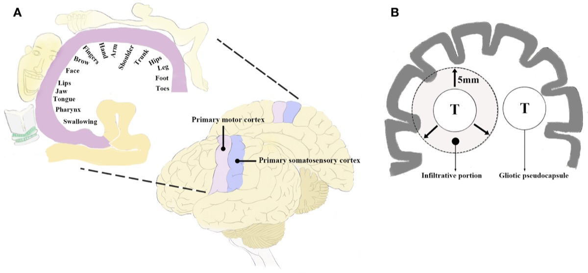

*Perirolandic functional anatomy and BM infiltration up to ~5 mm beyond the pseudocapsule. Source: Zuo et al., Front Oncol 2020;10:572644, Fig 1. CC BY 4.0.*

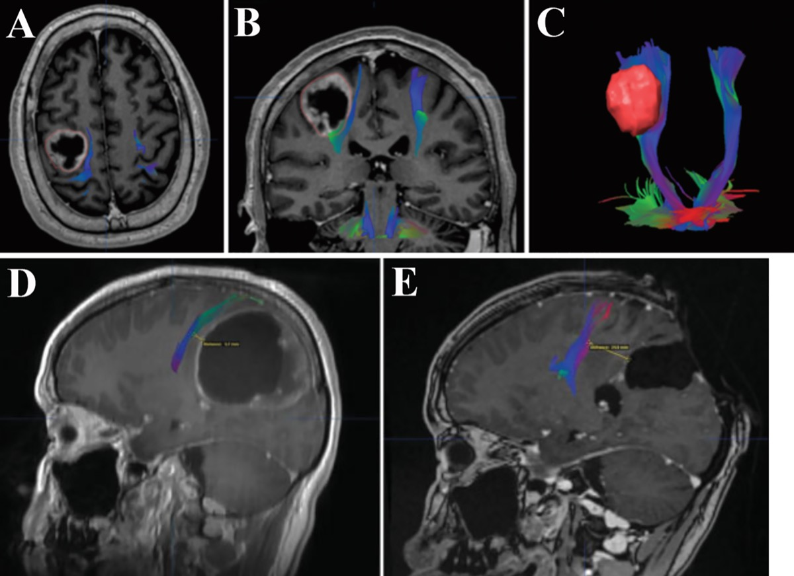

*DTI/MRI fusion showing CST proximity and displacement; postop MRI confirming total removal. Source: Zuo et al., Front Oncol 2020;10:572644, Fig 2. CC BY 4.0.*

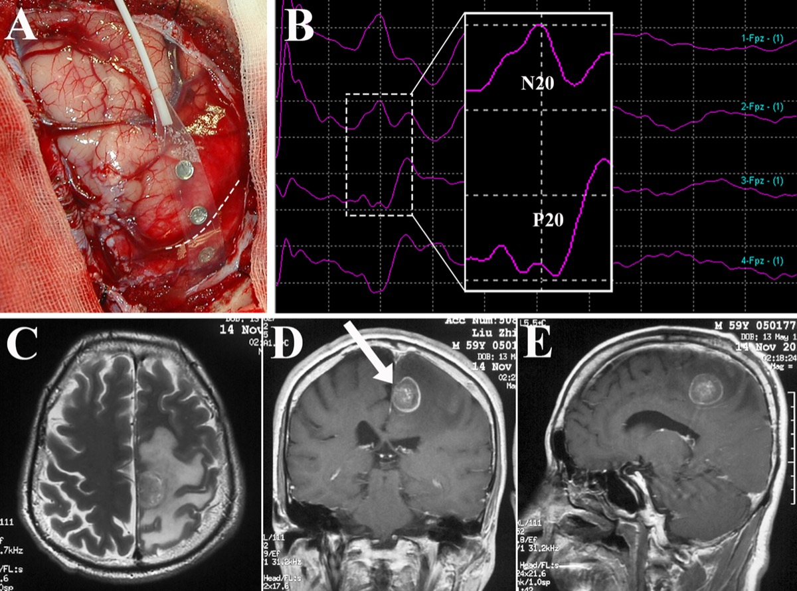

*Central-sulcus identification by SEP phase reversal and motor mapping prior to perirolandic metastasis removal. Source: Zuo et al., Front Oncol 2020;10:572644, Fig 3. CC BY 4.0.*

[Neurosurgical Atlas](https://www.neurosurgicalatlas.com) · [Radiopaedia](https://radiopaedia.org/search?q=cerebral%20metastasis&scope=all) · [PubMed Central](https://www.ncbi.nlm.nih.gov/pmc/?term=brain+metastasis+resection) — operative figures © linked; see [media-sources.md](../../resources/media-sources.md)

---

<!-- BEGIN CURATED LITERATURE -->

## High-Yield Literature

- **Cerebral Metastasis of Hepatoblastoma: A Review** — Rai P. Journal of pediatric hematology/oncology 2016. [PubMed](https://pubmed.ncbi.nlm.nih.gov/27111454/)
- **Cerebral Metastasis of Common Cancers** — Kros JM. Cancers 2020. [PubMed](https://pubmed.ncbi.nlm.nih.gov/33383615/)
- **Cerebral metastasis and other central nervous system complications of pleuropulmonary blastoma** — Priest JR. Pediatric blood & cancer 2007. [PubMed](https://pubmed.ncbi.nlm.nih.gov/16807914/)
- **Cerebral metastasis of cervical cancer, report of two cases and review of the literature** — Setoodeh R. International journal of clinical and experimental pathology 2012. [PubMed](https://pubmed.ncbi.nlm.nih.gov/22977669/)
- **Cerebral metastasis from osteosarcoma: "Bone" in the brain** — Kokkali S. Radiology case reports 2020. [PubMed](https://pubmed.ncbi.nlm.nih.gov/32322331/)
- **Single Cerebral Metastasis Mimicking Pyogenic Abscess in a Patient with Lung Adenocarcinoma** — Pérez-Riverola V. Radiology. Imaging cancer 2023. [PubMed](https://pubmed.ncbi.nlm.nih.gov/37026868/)
- **Cerebral metastasis from ovarian cancer treated with a multidisciplinary approach. Case report and review of literature** — Porzio G. European journal of gynaecological oncology 2003. [PubMed](https://pubmed.ncbi.nlm.nih.gov/14658605/)
- **Pleomorphic dermal sarcoma with cerebral metastasis** — Trennheuser L. Journal der Deutschen Dermatologischen Gesellschaft = Journal of the German Society of Dermatology : JDDG 2020. [PubMed](https://pubmed.ncbi.nlm.nih.gov/32558278/)
- **Multiple cerebral aneurysms and brain metastasis from primary cardiac myxosarcoma: a case report and literature review** — Lee TH. Chang Gung medical journal 2011. [PubMed](https://pubmed.ncbi.nlm.nih.gov/21733362/)
- **Ovarian Carcinoma Initially-presented as Cerebral Metastasis: Epidemiology, Pathology, and Outcomes** — Qudsieh S. Materia socio-medica 2025. [PubMed](https://pubmed.ncbi.nlm.nih.gov/41623537/)

<!-- END CURATED LITERATURE -->

---

<!-- BEGIN CURATED IMAGE SET -->

## Curated Image Set

Open-access figures are embedded from PubMed Central articles and kept unique to this guide.

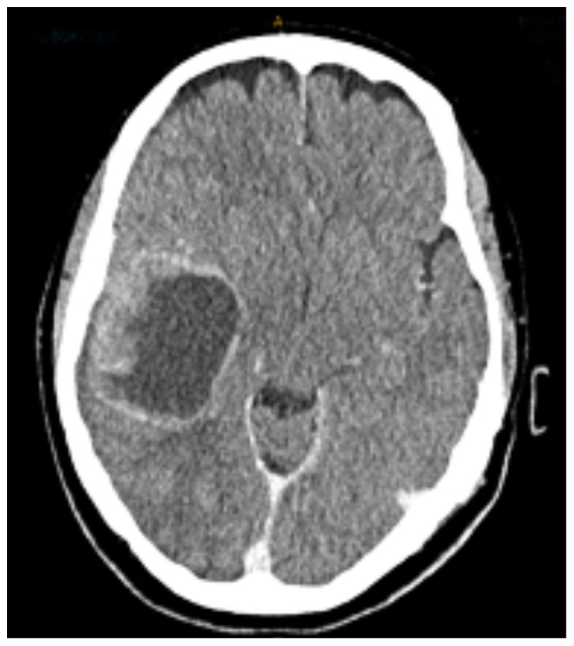
*Figure 1.. Post-contrast axial CT scan demonstrating large peripherally enhancing heterogenous solid-cystic tumour with localised mass effect. CT, computed tomography. Source: [Cerebral metastasis from anal squamous cell carcinoma: A case report and literature review](https://pmc.ncbi.nlm.nih.gov/articles/PMC12105449/) — Oncology Letters 2025; CC BY.*

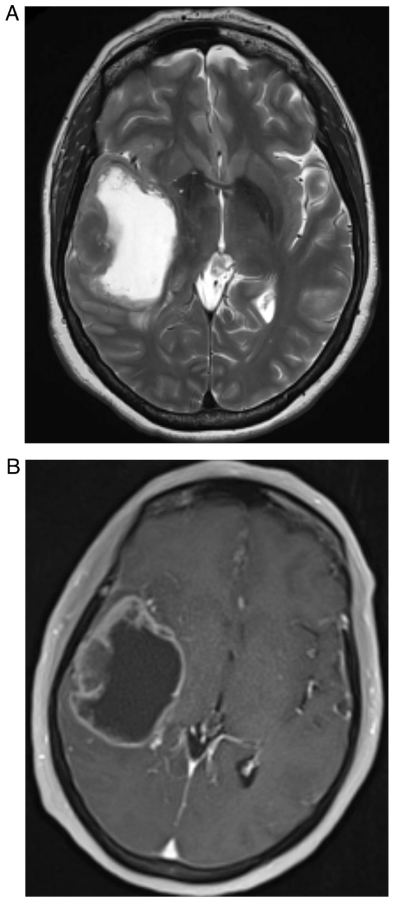
*Figure 2.. T1 and T2 MR images demonstrating the metastatic tumour. (A) T2 MRI sequence demonstrating high signal intensity within a cystic centre surrounded by thickened heterogenous rim of tumour... Source: [Cerebral metastasis from anal squamous cell carcinoma: A case report and literature review](https://pmc.ncbi.nlm.nih.gov/articles/PMC12105449/) — Oncology Letters 2025; CC BY.*

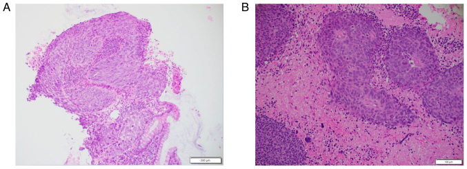
*Figure 3.. Representative haematoxylin and eosin-stained sections. Stained sections demonstrating squamous cell carcinoma in the (A) primary anal tumour (scale bar, 200 µm) and (B) metastatic brain... Source: [Cerebral metastasis from anal squamous cell carcinoma: A case report and literature review](https://pmc.ncbi.nlm.nih.gov/articles/PMC12105449/) — Oncology Letters 2025; CC BY.*

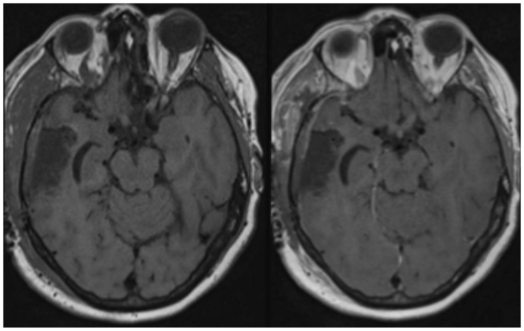
*Figure 4.. Day 1 post-operative axial pre- and post-contrast T1-weighted MRI showing no significant residual tumour post-craniotomy and resection. Source: [Cerebral metastasis from anal squamous cell carcinoma: A case report and literature review](https://pmc.ncbi.nlm.nih.gov/articles/PMC12105449/) — Oncology Letters 2025; CC BY.*

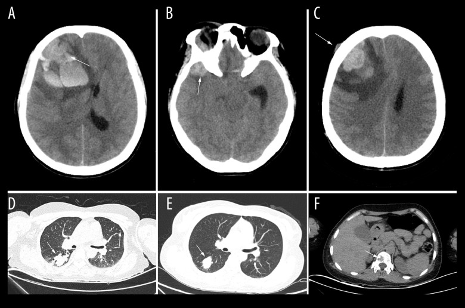
*Figure 1.. Preoperative head and lung computed tomography (CT) showed late cerebral metastasis of melanoma. (A) Right frontal melanoma brain metastasis with intracranial hemorrhage compressing the... Source: [A 41-Year-Old Woman with a Late Cerebral Metastasis 16 Years After an Initial Diagnosis of Cutaneous Melanoma](https://pmc.ncbi.nlm.nih.gov/articles/PMC8919240/) — The American Journal of Case Reports 2022; CC BY-NC-ND.*

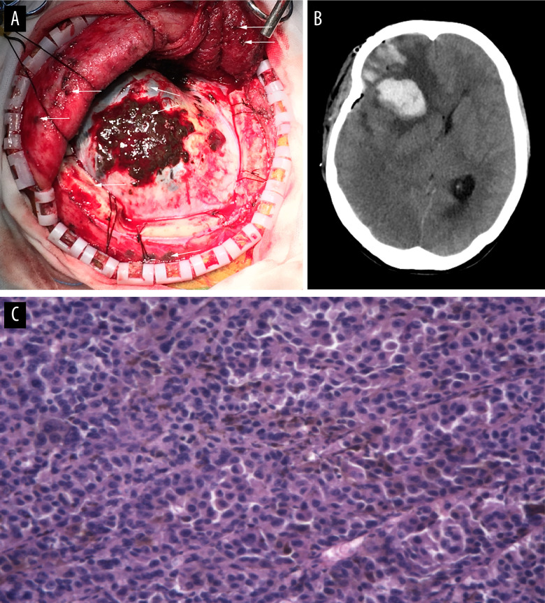
*Figure 2.. Late cerebral metastasis of melanoma presents widespread dissemination in dural matter and adjacent temporal bone, temporalis and hypodermis. (A) The extradural part grew infiltratively... Source: [A 41-Year-Old Woman with a Late Cerebral Metastasis 16 Years After an Initial Diagnosis of Cutaneous Melanoma](https://pmc.ncbi.nlm.nih.gov/articles/PMC8919240/) — The American Journal of Case Reports 2022; CC BY-NC-ND.*

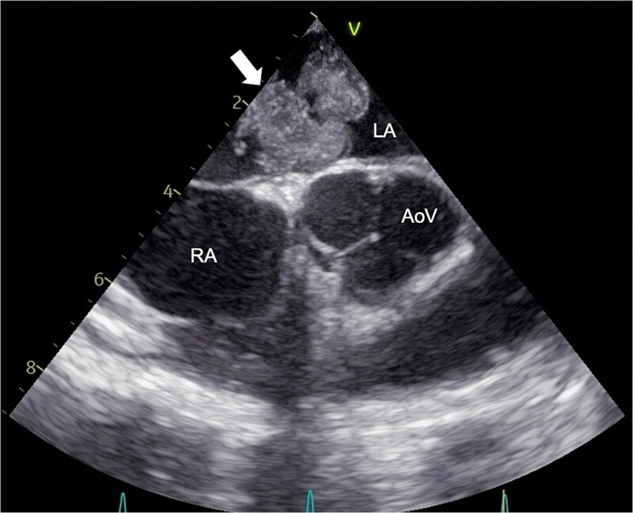
*Figure 1. Preoperative echocardiography. Transesophageal echocardiography showing a 40-mm pedunculated tumor (arrowed) attached to the LA side of the atrial septum. RA, right atrium; LA, left... Source: [Delayed cerebral metastasis after complete resection of left atrial cardiac myxoma: a case report](https://pmc.ncbi.nlm.nih.gov/articles/PMC13198785/) — Oxford Medical Case Reports 2026; CC BY.*

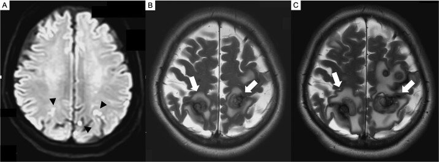
*Figure 2. Brain MRI. (A) Preoperative diffusion-weighted imaging (DWI) showing multiple acute cerebral infarcts (arrowed) in the parietal lobe. (B) MRI (T2-weighted imaging) at 7 months... Source: [Delayed cerebral metastasis after complete resection of left atrial cardiac myxoma: a case report](https://pmc.ncbi.nlm.nih.gov/articles/PMC13198785/) — Oxford Medical Case Reports 2026; CC BY.*

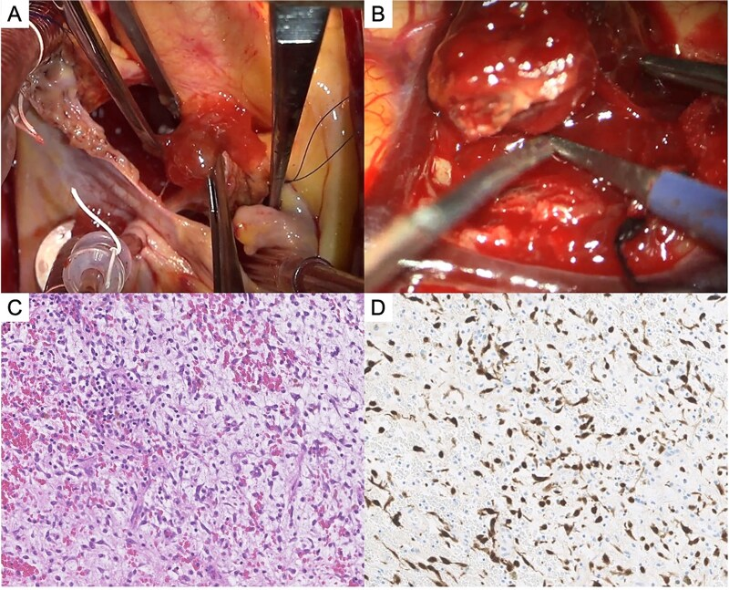
*Figure 3. Tumor findings. (A) Intraoperative photograph of left atrial myxoma. (B) Intraoperative photograph of resected frontal lobe metastatic lesion. (C) Histopathology of cerebral metastatic... Source: [Delayed cerebral metastasis after complete resection of left atrial cardiac myxoma: a case report](https://pmc.ncbi.nlm.nih.gov/articles/PMC13198785/) — Oxford Medical Case Reports 2026; CC BY.*

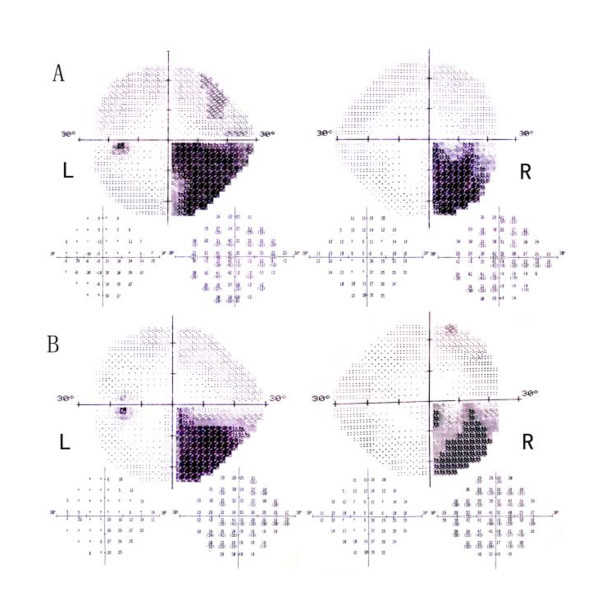
*Figure 1. A (L: left eye; R: right eye) Humphrey visual field demonstrating a congruous right homonymous inferior quadrantanopsia. B Repeat visual field test showed slight improvement. Source: [Homonymous Quadrantanopsia as the First Manifestation of Cerebral Metastasis of Invasive Mole: a case report](https://pmc.ncbi.nlm.nih.gov/articles/PMC3353198/) — Journal of Medical Case Reports 2012; CC BY.*

<!-- END CURATED IMAGE SET -->

---

## History of Present Illness
- Chief complaint: Seizure, focal deficit, headache, cognitive change
- Known primary (lung, breast, melanoma, renal, colorectal most common) vs metastasis as presentation
- Number of lesions (solitary vs oligometastatic vs multiple), systemic disease status, KPS
- Prior brain RT/SRS, prior craniotomy

---

## Imaging Review
### MRI (T1±Gad, T2, FLAIR, DWI, SWI)
- **Location, size, number** (full brain — surgical for symptomatic/large/dominant lesion)
- Classic: enhancing, gray-white junction, **disproportionate vasogenic edema**, often round/well-circumscribed
- Hemorrhagic mets (melanoma, renal, choriocarcinoma, thyroid) — SWI
- Eloquence, mass effect, herniation, midline shift
- DTI/fMRI if eloquent

### Staging
- CT chest/abdomen/pelvis, PET, primary workup if unknown (tissue diagnosis may be the goal)

---

## Labs
- CBC, BMP, Coags, Type and screen
- Hold anticoagulation; hemorrhagic mets considerations

---

## Neurological Examination
- Complete exam per location; document baseline; KPS

---

## Surgical Planning

### Case Logistics, OR Needs & Orders
- **Typical bed:** neuro ICU or step-down for first night after craniotomy; floor pathway only for small low-risk lesions with stable exam and minimal edema.
- **OR setup:** Mayfield, navigation with latest MRI/DTI/functional data, microscope/exoscope, ultrasound/5-ALA/fluorescence when used, CUSA, cortical/subcortical mapping tools for eloquent lesions, and specimens/pathology workflow ready.
- **Special needs:** arterial line for large/eloquent/vascular tumors, dexamethasone plan, seizure prophylaxis for cortical lesions or seizure history, mannitol/hypertonic availability, language/motor mapping plan, and blood available for meningioma/skull-base cases.
- **Immediate postop orders:** neuro checks with deficit-specific exam, MRI brain with contrast within 24-48h when resection assessment matters, CT for hemorrhage concern, dex taper, antiepileptic duration, DVT timing, pathology/molecular follow-up, and rehab consults as needed.

### Diagnosis & Indication
- Indication: Solitary/dominant symptomatic metastasis, accessible, good KPS/controlled systemic disease, need for tissue diagnosis, large lesion with mass effect; oligometastatic resectable disease
- Goals: Gross total **en bloc resection** (reduces local recurrence and leptomeningeal seeding vs piecemeal), relieve mass effect, tissue diagnosis
- Adjuvant: SRS to cavity (improves local control) ± SRS to other lesions; WBRT selectively

### Position & Approach
- Per lesion location, navigation-guided craniotomy, lesion at highest point; awake/mapping if eloquent

### Key Surgical Steps
1. Navigation-planned craniotomy centered over lesion
2. Corticotomy over/through sulcus near lesion (or directly if superficial), minimize normal cortex transgression
3. **Circumferential dissection** in the gliotic/peritumoral plane (mets are usually well-demarcated, non-infiltrative)
4. **En bloc removal** when feasible (supramarginal/circumferential technique reduces seeding/recurrence) — avoid piecemeal/internal debulking if possible (especially superficial)
5. For deep/large: may debulk to mobilize, then deliver capsule
6. Inspect cavity walls; consider resecting a margin of surrounding tissue if non-eloquent (improves local control)
7. Hemostasis (mets can be vascular/hemorrhagic), navigation/ultrasound to confirm gross total

### Critical Anatomy & Structures at Risk
1. Eloquent cortex / white matter tracts (location-dependent)
2. Draining veins, en passage vessels
3. Deep nuclei (deep mets)

### Equipment
- Microscope, navigation, ultrasound, CUSA (for debulking if needed)
- Bipolar, hemostatic agents, mapping (if eloquent)

### Monitoring
- SSEPs/MEPs/mapping if eloquent location

### Anesthesia
- Standard; dexamethasone (edema), levetiracetam, mannitol PRN

### Potential Complications
1. New neurological deficit (eloquent location)
2. Hemorrhage (vascular mets)
3. Leptomeningeal dissemination (reduced by en bloc)
4. Edema, seizures, infection

---

## Operative Note Template

**Preoperative Diagnosis:** [Solitary/dominant] [left/right] [location] brain metastasis [from known ___ primary] with [mass effect/edema/symptom]

**Postoperative Diagnosis:** Same

**Procedure:** [Left/Right] [location] craniotomy for microsurgical resection of brain metastasis [with neuronavigation] [with intraoperative mapping]

**Surgeon / Assistant:**
**Anesthesia:** General endotracheal [/ awake with mapping]
**EBL / Fluids:**
**Specimens:** Brain tumor (metastasis) for permanent pathology
**Implants:** None
**Monitoring:** [SSEP/MEP/mapping if eloquent — stable]
**Complications:** None

**Indications:** [Age]yo [M/F] with [known/newly diagnosed] [primary] and a [size] cm symptomatic [location] brain metastasis causing [deficit/seizure/mass effect]. Given the accessible location, [solitary/dominant] lesion, and [good KPS/controlled systemic disease / need for tissue diagnosis], surgical resection (with planned adjuvant SRS to the cavity) was recommended. Risks/benefits/alternatives discussed.

**Description of Procedure:** After consent and time-out, general anesthesia was induced and the head fixed in Mayfield. Neuronavigation was registered and the lesion projected; a [location] craniotomy was planned over the lesion. The patient was positioned with the lesion at the highest point. [Mapping was set up for the eloquent-adjacent location.]

The scalp was opened and a craniotomy turned over the navigated target; the dura was opened. The cortical surface was inspected and the lesion localized with navigation [and ultrasound]. A corticotomy was made [through a sulcus / over the superficial lesion], and the metastasis — which was [well-circumscribed] — was circumferentially dissected in the surrounding gliotic plane. The lesion was removed **en bloc** [/ debulked then delivered for the deep component] to minimize tumor spillage and seeding. The cavity walls were inspected [and a margin of non-eloquent peritumoral tissue resected to improve local control]. Meticulous hemostasis was obtained and gross-total resection confirmed by navigation/ultrasound.

The dura was closed, the bone flap replaced and fixed, and the scalp closed in layers. The patient was awakened neurologically [at baseline] and transferred to the [ICU/step-down] in stable condition.

---

## Postoperative Plan
- ICU/step-down, neuro checks q1h
- MRI with gad < 48h (EOR), CT if hemorrhage concern
- Dexamethasone taper, seizure prophylaxis per practice
- DVT prophylaxis
- **Adjuvant: SRS to resection cavity** (tumor board), systemic therapy coordination with oncology
- Pathology (confirm primary/molecular markers), restage, oncology follow-up
