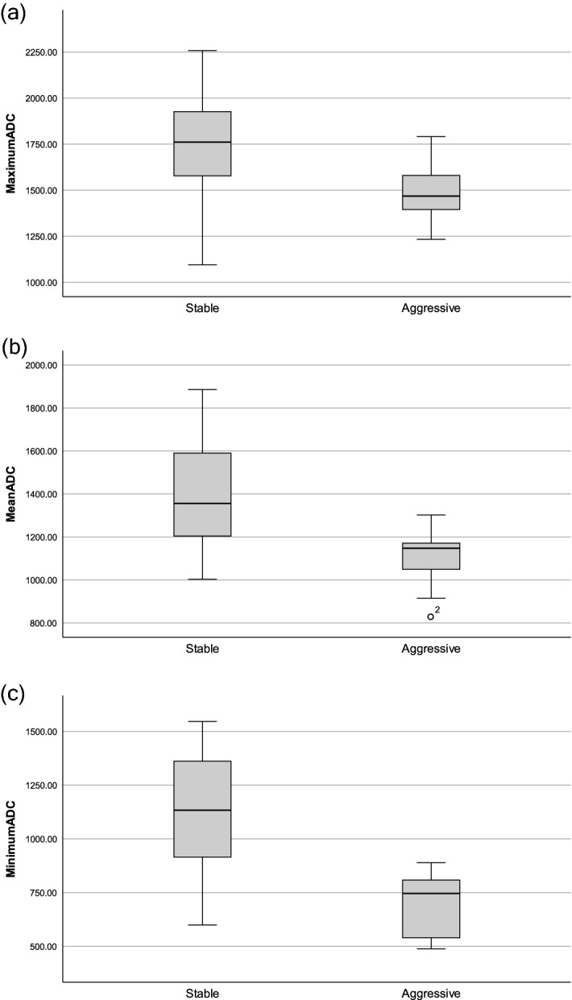
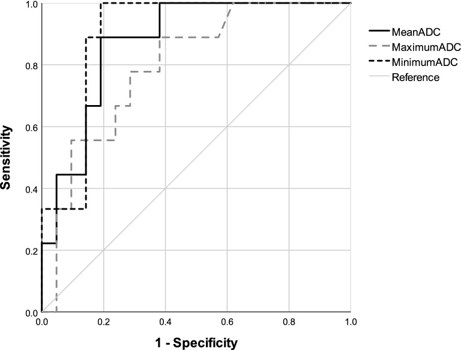
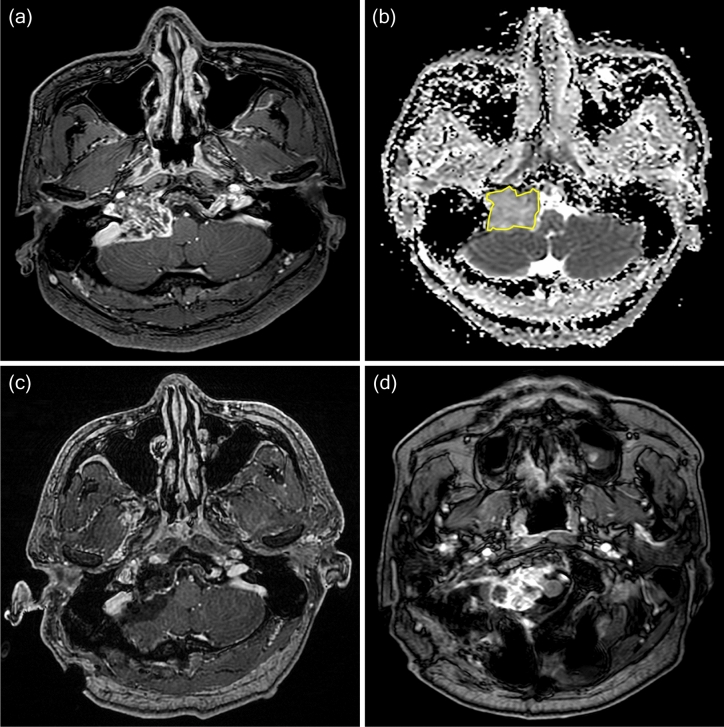
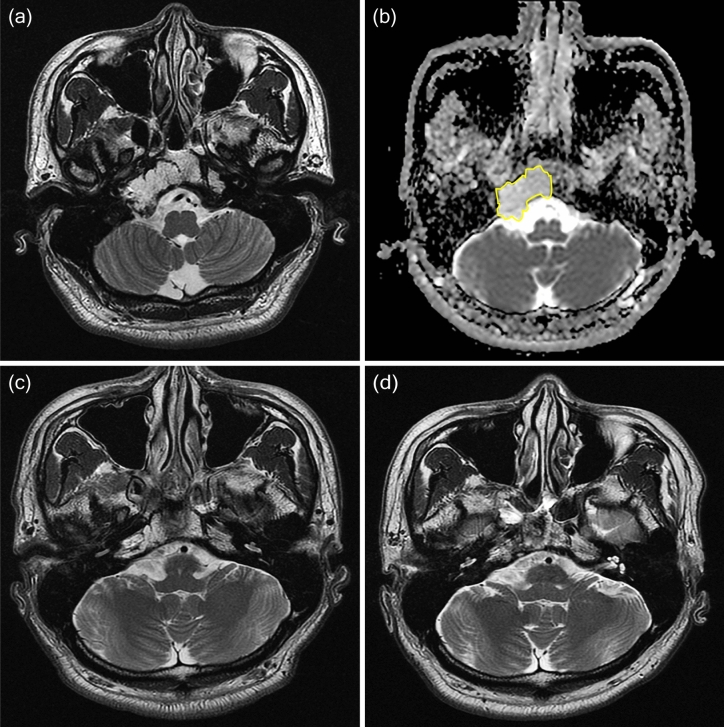
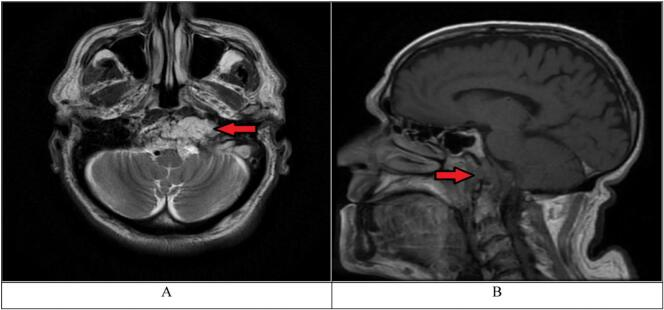
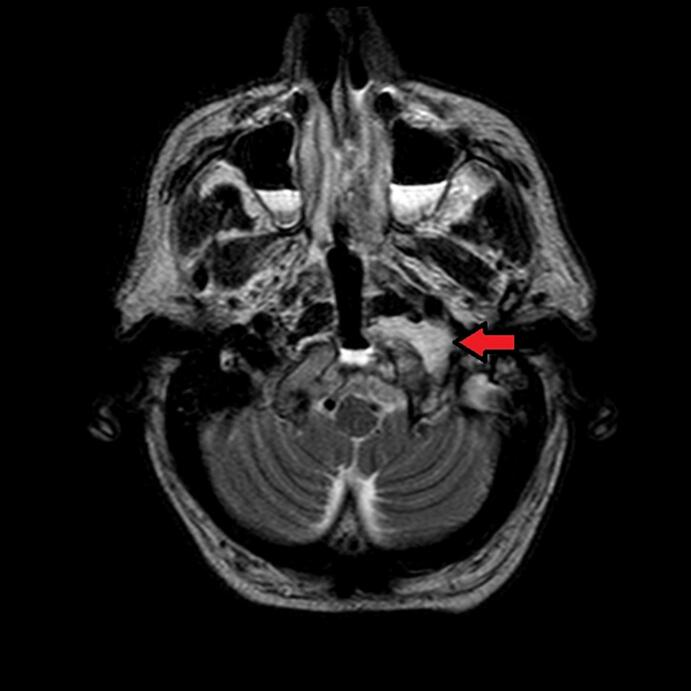
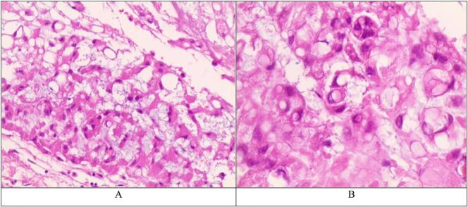
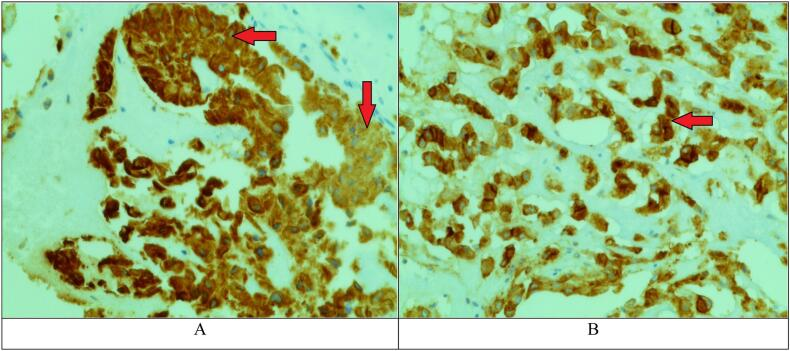
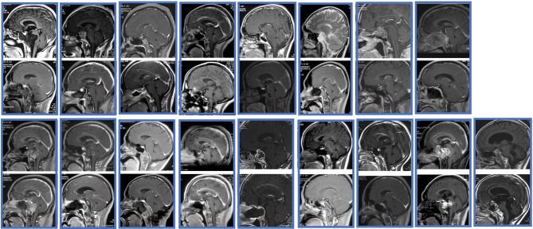

# Case Prep: Clival Chordoma Resection

<!-- BEGIN CASE SNAPSHOT -->

## Case / Approach Snapshot

- **Anatomy at risk:** tumor compartment, arterial supply, venous drainage/sinuses, cranial nerves, white-matter tracts, pituitary/CSF pathways when relevant, and functional cortex.
- **Operative steps:** review imaging and goals, choose exposure, obtain brain relaxation, devascularize when possible, debulk internally, dissect capsule from critical structures, verify extent/safety, and reconstruct watertight closure; use the detailed operative sequence and approach notes below as the step-by-step source.
- **Rescue plans:** venous or arterial injury, swelling, seizure, cranial nerve or endocrine change, CSF leak, residual tumor left for safety, staged surgery, radiation, or adjuvant therapy.
- **Figures:** review [Figures, Imaging & Video](#figures-imaging--video) and the [Curated Image Set](#curated-image-set); embedded local figures should remain open-access, public-domain, or otherwise reusable with attribution.
- **Papers:** review [High-Yield Literature](#high-yield-literature) for seminal sources, modern reviews, and outcome data specific to this page.

<!-- END CASE SNAPSHOT -->

## One-Liner
[Age]yo [M/F] with a clival chordoma presenting with [diplopia (CN VI) / headache / lower cranial neuropathy] planned for endoscopic endonasal [transclival] resection [± staged/combined approach].

---

## Figures, Imaging & Video

**🎥 Operative video** — [search operative video on YouTube ▸](https://www.youtube.com/results?search_query=clival+chordoma+surgery) · [The Neurosurgical Atlas ▸](https://www.neurosurgicalatlas.com)

**CNS Video Library**

<iframe src="https://www.youtube-nocookie.com/embed/B7lcL7uz938" title="CNS Neurosurgery 100: Surgical Anatomy of the Open and Endonasal Approaches to the Anterior Cranial" loading="lazy" allow="accelerometer; clipboard-write; encrypted-media; picture-in-picture; web-share" allowfullscreen></iframe>

> 🧭 **Operative approach:** [Endoscopic endonasal approach](../approaches/endoscopic-endonasal-approach.md) — detailed corridor setup, step-by-step technique & figures

[Neurosurgical Atlas](https://www.neurosurgicalatlas.com) · [Radiopaedia](https://radiopaedia.org/search?q=clival%20chordoma&scope=all) · [PubMed Central](https://www.ncbi.nlm.nih.gov/pmc/?term=clival+chordoma+endoscopic) — operative figures © linked; see [media-sources.md](../../resources/media-sources.md)

---

<!-- BEGIN CURATED LITERATURE -->

## High-Yield Literature

- **Clival Chordoma: Case Report and Review of Recent Developments in Surgical and Adjuvant Treatments** — Khawaja AM. Polish journal of radiology 2017. [PubMed](https://pubmed.ncbi.nlm.nih.gov/29662593/)
- **Proton beam therapy for clival chordoma: Optimising rare cancer treatments in Australia** — Mathew A. Journal of medical radiation sciences 2024. [PubMed](https://pubmed.ncbi.nlm.nih.gov/38501158/)
- **Clival Chordoma: Endoscopic Bilateral Transmaxillary Approach** — Youssef AS. Journal of neurological surgery. Part B, Skull base 2019. [PubMed](https://pubmed.ncbi.nlm.nih.gov/31750067/)
- **Cytodiagnosis of Clival Chordoma** — Giri R. Journal of cytology 2023. [PubMed](https://pubmed.ncbi.nlm.nih.gov/37745806/)
- **Clival chordoma** — Tarshis LM. The Journal of otolaryngology 1976. [PubMed](https://pubmed.ncbi.nlm.nih.gov/933253/)
- **Clival chordoma: a single-centre outcome analysis** — Jägersberg M. Acta neurochirurgica 2017. [PubMed](https://pubmed.ncbi.nlm.nih.gov/28478512/)
- **Clival chordoma with drop metastases** — Nor FEM. Journal of radiology case reports 2018. [PubMed](https://pubmed.ncbi.nlm.nih.gov/29875988/)
- **Surgical Outcomes of Clival Chordoma Through Endoscopic Endonasal Approach: A Single-Center Experience** — Chen G. Frontiers in endocrinology 2022. [PubMed](https://pubmed.ncbi.nlm.nih.gov/35464053/)
- **Fractionated Radiotherapy After Gross Total Resection of Clival Chordoma: A Systematic Review of Survival Outcomes** — Gendreau JL. Neurosurgery 2023. [PubMed](https://pubmed.ncbi.nlm.nih.gov/36826997/)
- **An unusual presentation of clival chordoma: a case report and review of the literature** — Andijani M. British journal of neurosurgery 2020. [PubMed](https://pubmed.ncbi.nlm.nih.gov/31226887/)

<!-- END CURATED LITERATURE -->

<!-- BEGIN CURATED IMAGE SET -->

## Curated Image Set

Open-access figures are embedded from PubMed Central articles and kept unique to this guide.

*Figure 1. Comparison of ADC values between stable and aggressive chordoma (10–6 mm2/s). There were significant differences between groups in (a) maximum ADC (P = 0.012), (b) mean ADC (P < 0.001),... Source: [Apparent diffusion coefficient as a prognostic factor in clival chordoma](https://pmc.ncbi.nlm.nih.gov/articles/PMC7804259/) — Scientific Reports 2021; CC BY.*

*Figure 2. ROC curves for ADC values differentiating aggressive chordoma from stable chordoma. Source: [Apparent diffusion coefficient as a prognostic factor in clival chordoma](https://pmc.ncbi.nlm.nih.gov/articles/PMC7804259/) — Scientific Reports 2021; CC BY.*

*Figure 4. A 37-year-old man was diagnosed with classic chordoma and placed in the aggressive group. (a) Preoperative contrast enhanced T1-weighted imaging showed a tumor compressing the brainstem.... Source: [Apparent diffusion coefficient as a prognostic factor in clival chordoma](https://pmc.ncbi.nlm.nih.gov/articles/PMC7804259/) — Scientific Reports 2021; CC BY.*

*Figure 5. A 36-year-old man diagnosed with classic chordoma and placed in the stable group. (a) Preoperative T2-weighted imaging showed a T2 high signal mass arising from the clivus. (b) The ROI... Source: [Apparent diffusion coefficient as a prognostic factor in clival chordoma](https://pmc.ncbi.nlm.nih.gov/articles/PMC7804259/) — Scientific Reports 2021; CC BY.*

*Fig. 1. A. T2-weighted MRI, axial view. The arrow shows hyperintense Clival lesion located 3 mm from the anterior end of the clivus, the mass can be seen compressing the left internal carotid... Source: [Clival chordoma presenting with isolated unilateral cranial nerve XII palsy: A case report](https://pmc.ncbi.nlm.nih.gov/articles/PMC10943967/) — International Journal of Surgery Case Reports 2024; CC BY.*

*Fig. 2. T2-weighted MRI, axial view. Signs of surgical intervention on the clivus are noted. The arrow shows residual tumor. (post-operative MRI). Source: [Clival chordoma presenting with isolated unilateral cranial nerve XII palsy: A case report](https://pmc.ncbi.nlm.nih.gov/articles/PMC10943967/) — International Journal of Surgery Case Reports 2024; CC BY.*

*Fig. 3. A. Chordoma (H&E 100×). Prominent myxoid background containing small columns or clusters of bubbly physalipharous cells. B. Chordoma (H&E 400×). Occasional cells with irregular or... Source: [Clival chordoma presenting with isolated unilateral cranial nerve XII palsy: A case report](https://pmc.ncbi.nlm.nih.gov/articles/PMC10943967/) — International Journal of Surgery Case Reports 2024; CC BY.*

*Fig. 4. A. Chordoma, Immunohistochemical staining. Arrows show positivity for cytokeratin (CK). B. Chordoma, Immunohistochemical staining. The arrow shows positivity for epithelial membrane... Source: [Clival chordoma presenting with isolated unilateral cranial nerve XII palsy: A case report](https://pmc.ncbi.nlm.nih.gov/articles/PMC10943967/) — International Journal of Surgery Case Reports 2024; CC BY.*

*Figure 1. The pre- and post- MRIs of all the patients. Source: [Surgical Outcomes of Clival Chordoma Through Endoscopic Endonasal Approach: A Single-Center Experience](https://pmc.ncbi.nlm.nih.gov/articles/PMC9019489/) — Frontiers in Endocrinology 2022; CC BY.*

<!-- END CURATED IMAGE SET -->

---

## History of Present Illness
- Chief complaint: Diplopia (CN VI palsy — abducens along clivus, classic), headache, lower CN dysfunction, brainstem compression
- Locally aggressive, midline, bone-destructive; arises from notochordal remnants
- Prior treatment/surgery/radiation (often recurrent/multiply-operated)

---

## Imaging Review
### MRI (T1±Gad, T2)
- Midline clival mass, T2 hyperintense, heterogeneous enhancement
- **Brainstem compression**, extent (upper/mid/lower clivus), lateral extension (petrous, cavernous, jugular foramen)
- **ICA (paraclival/cavernous) and basilar artery** relationship/encasement
- Dural breach, intradural extension

### CT / CTA
- **Bony destruction**, calcification, sequestered bone; ICA bony canal; craniocervical junction stability (lower clival/C1-2 → may need fusion)

---

## Labs
- CBC, BMP, Coags, Type and crossmatch

---

## Neurological Examination
- Full CN (VI especially, lower CNs), brainstem/long tracts, swallowing

---

## Surgical Planning

### Case Logistics, OR Needs & Orders
- **OR setup:** navigation, endoscope/microscope as approach requires, ENT co-surgeon for endonasal cases, Doppler, lumbar drain only when indicated, reconstruction materials, and visual/endocrine baseline available.
- **Special needs:** steroid strategy individualized (Cushing workup may require avoiding preop steroids), DI/sodium protocol, AM cortisol/endocrine labs, visual-check plan, arterial line for large/vascular cases, and CSF-leak/nasal precautions.
- **Immediate postop orders:** neuro and visual checks, strict I/O with sodium/urine specific gravity schedule when pituitary stalk risk exists, cortisol/endocrine replacement plan, nasal precautions, MRI/CT timing, steroid taper, and DVT prophylaxis timing.

### Diagnosis & Indication
- Indication: Maximal safe resection (extent of resection is the strongest prognostic factor) followed by high-dose **proton/photon radiation**
- **Endoscopic endonasal transclival** is workhorse for midline; lateral extension may need combined/transcranial or far-lateral
- Goals: Gross total/maximal resection while preserving neurovascular structures; en bloc when feasible (usually piecemeal due to location)

### Position
- Supine, slight extension, navigation (CT/MR + CTA fusion), possible lumbar drain
- ENT co-surgeon (endonasal)

### Key Surgical Steps (Endoscopic Endonasal Transclival)
1. Nasal phase, nasoseptal flap(s) harvested (reconstruction — may need bilateral/extended)
2. Wide sphenoidotomy, posterior septectomy
3. **Identify and skeletonize both paraclival/cavernous ICAs** (navigation + micro-Doppler) — define safe lateral corridor between carotids
4. Drill clival bone, remove tumor + involved bone (chordoma invades bone — must remove affected bone)
5. Work between the carotids; for intradural extension, open dura, debulk off brainstem/basilar
6. Preserve CN VI (Dorello canal), basilar perforators, brainstem
7. Maximal resection; accept residual on encased ICA/basilar/brainstem
8. **Robust multilayer skull base reconstruction** (fascia lata, fat, nasoseptal flap, sealant ± lumbar drain) — high CSF leak risk (clival/posterior fossa)

### Critical Anatomy & Structures at Risk
1. **Internal carotid arteries (paraclival/cavernous)** — define lateral limits; injury catastrophic
2. **Basilar artery and perforators**, brainstem (pons/medulla)
3. **CN VI (Dorello canal)**, lower cranial nerves (lateral/lower extension), CN III/IV
4. **Craniocervical junction stability** (lower clival/condylar resection)

### Equipment
- Endoscope + endonasal skull base set, navigation (CTA fusion), high-speed drill, micro-Doppler, ICG
- Nasoseptal flap, fascia lata/fat graft, sealant, lumbar drain
- CN stimulator

### Monitoring
- SSEPs, MEPs, CN EMG (VI, lower CNs), BAER

### Anesthesia
- Arterial line, crossmatched blood, **ICA injury contingency** (rapid transfusion, neuroIR on standby for sacrifice/embolization), long case

### Potential Complications
1. **ICA injury** — life-threatening; pack, balloon/embolize, angiography
2. **CSF leak** (high) — robust reconstruction
3. CN deficits (VI common), brainstem injury
4. Craniocervical instability (may need occipitocervical fusion)
5. Recurrence (high — adjuvant radiation essential), meningitis

---

## Operative Note Template
**Preoperative Diagnosis:** Clival chordoma [with brainstem compression / CN VI palsy]

**Postoperative Diagnosis:** Same

**Procedure:** Endoscopic endonasal transclival resection of clival chordoma with multilayer skull base reconstruction [nasoseptal flap]

**Surgeon / Assistant:** Neurosurgery + ENT skull base co-surgeon
**Anesthesia:** General endotracheal
**EBL / Fluids / Blood products:** [crossmatched; ICA-injury contingency ready]
**Adjuncts:** Neuronavigation with CTA fusion, micro-Doppler, ICG, high-speed drill, CN EMG (VI, lower CNs)/SSEP/MEP; lumbar drain
**Implants:** Fascia lata/fat graft, nasoseptal flap, sealant
**Complications:** None

**Indications:** [Age]yo [M/F] with a clival chordoma causing [diplopia (CN VI)/brainstem compression]. Maximal safe resection followed by proton/photon radiation was planned. Risks (ICA injury, CSF leak, CN deficits, CCJ instability) discussed; rapid-transfusion and neuro-IR contingency arranged.

**Description of Procedure:** After consent and time-out, general anesthesia was induced, navigation registered with CTA fusion, and a lumbar drain placed. With the ENT co-surgeon, a nasal phase with nasoseptal flap harvest, wide sphenoidotomy, and posterior septectomy was performed. **Both paraclival ICAs were identified and skeletonized with navigation and micro-Doppler, defining the safe intercarotid corridor.**

The clival bone and tumor were drilled and removed, including involved bone. Working between the carotids, [the dura was opened for the intradural component and tumor debulked off the brainstem and basilar artery], **preserving CN VI (Dorello canal), basilar perforators, and the brainstem**. Maximal resection was achieved; residual encasing the ICA/basilar/brainstem was left. A robust multilayer skull base reconstruction was performed with fascia lata, fat, the vascularized nasoseptal flap, and sealant.

The patient was transferred to the ICU with CSF-leak precautions and the lumbar drain in place.

---

## Postoperative Plan
- ICU, neuro checks q1h
- **CSF leak precautions**, lumbar drain management, DI/Na if sellar involvement
- CN VI and lower CN assessment, swallow eval
- MRI/CT postop (EOR), watch rhinorrhea/meningitis/pneumocephalus
- **Adjuvant proton/photon radiation** (essential), tumor board
- CCJ stability assessment; long-term surveillance MRI

<!-- BEGIN CHIEF LEVEL TAKEAWAYS -->

## Chief-Level Case Review

Use these as the senior-level mental model for **Clival Chordoma Resection**:

- **Decision point:** Decide the real endpoint before opening: cure, cytoreduction, diagnosis, decompression, separation from critical structures, or safe maximal resection.
- **Technical lever:** Map what must be left behind: perforators, cranial nerves, venous sinuses, eloquent cortex/tracts, hypothalamus/pituitary axis, and adherent capsule planes.
- **Bailout:** Sequence matters: devascularize early when safe, create CSF/working space, debulk before traction, and preserve the arachnoid plane unless oncologic goals justify violating it.
- **Postop watch:** The postop plan should match the risk structure: endocrine/vision/swallow/CN checks, steroid taper, seizure plan, MRI timing, CSF-leak watch, and adjuvant-treatment handoff.

<!-- END CHIEF LEVEL TAKEAWAYS -->

<!-- BEGIN COMMON PIMP QUESTIONS -->

## Common Pimp Questions

Use these to pressure-test preparation for **Clival Chordoma Resection**:

1. What is the surgical goal: gross-total, maximal safe, decompression, diagnosis, or cytoreduction?
2. What eloquent cortex, tract, cranial nerve, vessel, or sinus defines the stopping point?
3. What adjunct changes the case: navigation, mapping, 5-ALA, ultrasound, endoscope, ICG, or neuromonitoring?
4. What is the edema, steroid, seizure, DVT, and postop imaging plan?
5. What complication would you check for first in PACU based on this lesion location?

<!-- END COMMON PIMP QUESTIONS -->

<!-- BEGIN ATTENDING PREFERENCE VARIABLES -->

## Attending Preference Variables

Items that commonly vary by surgeon or institution:

- **Extent-of-resection goal and functional stopping points:** [attending-specific]
- **Mapping/monitoring, 5-ALA, ultrasound, ICG, endoscope, or tractography preferences:** [attending-specific]
- **Steroid, antiepileptic, mannitol/hypertonic saline, and antibiotic plan:** [attending-specific]
- **Postop MRI timing, ICU/floor threshold, and adjuvant-referral workflow:** [attending-specific]

<!-- END ATTENDING PREFERENCE VARIABLES -->
