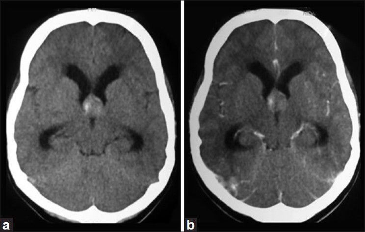
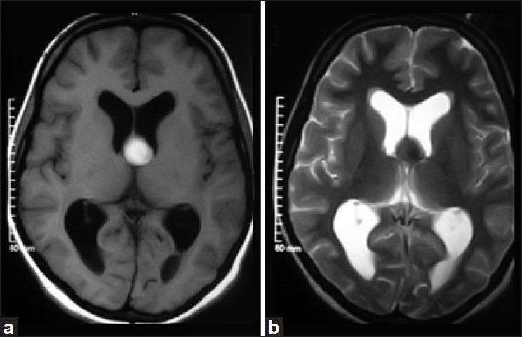
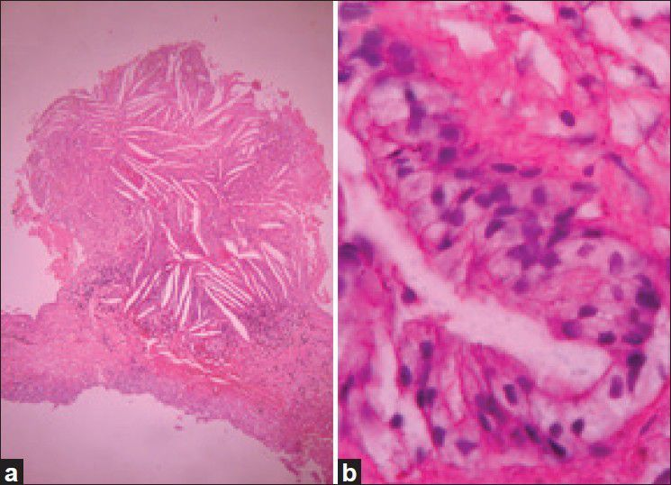
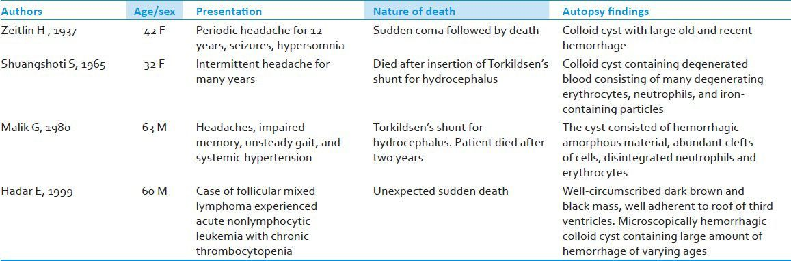
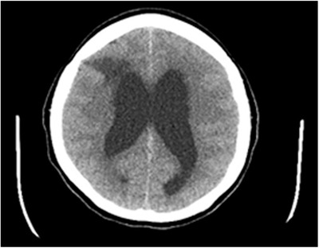
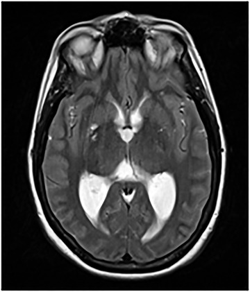
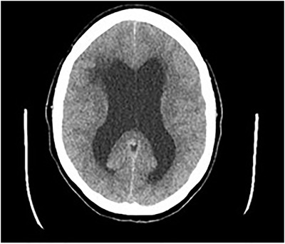
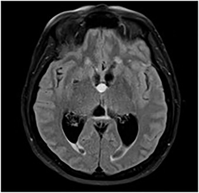
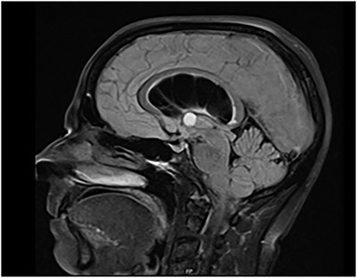
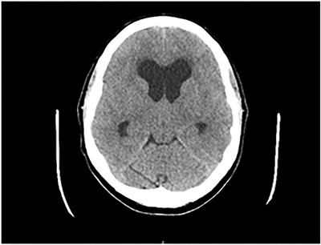

# Case Prep: Colloid Cyst Resection

---

<!-- BEGIN CASE SNAPSHOT -->

## Case / Approach Snapshot

- **Anatomy at risk:** tumor compartment, arterial supply, venous drainage/sinuses, cranial nerves, white-matter tracts, pituitary/CSF pathways when relevant, and functional cortex.
- **Operative steps:** review imaging and goals, choose exposure, obtain brain relaxation, devascularize when possible, debulk internally, dissect capsule from critical structures, verify extent/safety, and reconstruct watertight closure; use the detailed operative sequence and approach notes below as the step-by-step source.
- **Rescue plans:** venous or arterial injury, swelling, seizure, cranial nerve or endocrine change, CSF leak, residual tumor left for safety, staged surgery, radiation, or adjuvant therapy.
- **Figures:** review [Figures, Imaging & Video](#figures-imaging--video) and the [Curated Image Set](#curated-image-set); embedded local figures should remain open-access, public-domain, or otherwise reusable with attribution.
- **Papers:** review [High-Yield Literature](#high-yield-literature) for seminal sources, modern reviews, and outcome data specific to this page.

<!-- END CASE SNAPSHOT -->

## One-Liner
[Age]yo [M/F] with a [size] mm third ventricular colloid cyst [with/without hydrocephalus] presenting with [positional headaches / memory loss / incidental] planned for [endoscopic / transcallosal-transforaminal] resection.

---

## Figures, Imaging & Video

**🎥 Operative video** — [search operative video on YouTube ▸](https://www.youtube.com/results?search_query=colloid+cyst+surgery) · [The Neurosurgical Atlas ▸](https://www.neurosurgicalatlas.com)

> 🧭 **Operative approach:** [Anterior interhemispheric / transcallosal](../approaches/anterior-interhemispheric-approach.md) — detailed corridor setup, step-by-step technique & figures

> Operative figures/atlases are © (linked, not copied). See [media-sources.md](../../resources/media-sources.md).
- **Technique/approach:** [The Neurosurgical Atlas](https://www.neurosurgicalatlas.com) — search *"colloid cyst third ventricle"*
- **Imaging:** [Radiopaedia — colloid cyst](https://radiopaedia.org/search?q=colloid%20cyst&scope=all)
- **Open-access figures:** [PubMed Central](https://www.ncbi.nlm.nih.gov/pmc/?term=colloid+cyst+third+ventricle)

---

<!-- BEGIN CURATED LITERATURE -->

## High-Yield Literature

- **Giant Colloid Cyst** — Alkhaibary A. World neurosurgery 2022. [PubMed](https://pubmed.ncbi.nlm.nih.gov/35803569/)
- **Colloid Brain Cyst** — Tenny S. 2026. [PubMed](https://pubmed.ncbi.nlm.nih.gov/29262059/)
- **Colloid cyst headache** — Spears RC. Current pain and headache reports 2004. [PubMed](https://pubmed.ncbi.nlm.nih.gov/15228889/)
- **Infected colloid cyst** — Yilmaz A. Child's nervous system : ChNS : official journal of the International Society for Pediatric Neurosurgery 2017. [PubMed](https://pubmed.ncbi.nlm.nih.gov/28578512/)
- **Colloid cyst** — Fink S. Practical neurology 2015. [PubMed](https://pubmed.ncbi.nlm.nih.gov/26349833/)
- **Pituitary Colloid Cyst** — Guduk M. The Journal of craniofacial surgery 2017. [PubMed](https://pubmed.ncbi.nlm.nih.gov/27792102/)
- **Third Ventricular Colloid Cyst, New Surgical Classification** — Badran SA. World neurosurgery 2024. [PubMed](https://pubmed.ncbi.nlm.nih.gov/38599374/)
- **Endoscopic transventricular resection of a colloid cyst** — Lehmann S. Neurosurgical focus: Video 2023. [PubMed](https://pubmed.ncbi.nlm.nih.gov/37089750/)
- **Colloid cyst of the third ventricle** — Roberts A. Journal of the American College of Emergency Physicians open 2021. [PubMed](https://pubmed.ncbi.nlm.nih.gov/34409403/)
- **Colloid Cyst Causing Massive Headache Attacks** — Zaddach M. Neuropediatrics 2024. [PubMed](https://pubmed.ncbi.nlm.nih.gov/38316413/)

<!-- END CURATED LITERATURE -->

---

<!-- BEGIN CURATED IMAGE SET -->

## Curated Image Set

Open-access figures are embedded from PubMed Central articles and kept unique to this guide.

*Figure 1. CT brain (axial view). (a) Isodense lesion located at foramen of Monro with hyperdense areas suggestive of hemorrhage with foraminal obstruction. (b) No evidence of enhancement on contrast. Source: [Hemorrhagic colloid cyst: Case report and review of the literature](https://pmc.ncbi.nlm.nih.gov/articles/PMC3877504/) — Asian Journal of Neurosurgery 2013; CC BY-NC-SA.*

*Figure 2. MRI brain (axial view). (a) Homogenously hyperintense lesion at foramen of Monro in T1-weighted sequence. (b) Lesion appears uniformly hyperintense on T2-weighted sequence Source: [Hemorrhagic colloid cyst: Case report and review of the literature](https://pmc.ncbi.nlm.nih.gov/articles/PMC3877504/) — Asian Journal of Neurosurgery 2013; CC BY-NC-SA.*

*Figure 3. Photomicrograph. (a) Pseudostratified columnar epithelial cells with occasional ciliated and goblet cells with a thin capsule of fibrous connective tissue suggestive of colloid cyst... Source: [Hemorrhagic colloid cyst: Case report and review of the literature](https://pmc.ncbi.nlm.nih.gov/articles/PMC3877504/) — Asian Journal of Neurosurgery 2013; CC BY-NC-SA.*

*Figure 4. Source: [Hemorrhagic colloid cyst: Case report and review of the literature](https://pmc.ncbi.nlm.nih.gov/articles/PMC3877504/) — Asian J Neurosurg. 2013 Jul-Sep;8(3):162. doi: 10.4103/1793-5482.121689; CC BY-NC-SA.*

*FIGURE 2. Computed tomography brain scan of same 54‐year‐old female with lateral ventriculomegaly Source: [Colloid cyst of the third ventricle](https://pmc.ncbi.nlm.nih.gov/articles/PMC8360874/) — Journal of the American College of Emergency Physicians Open 2021; CC BY-NC-ND.*

*FIGURE 6. Magnetic resonance imaging brain scan of 54‐year‐old female showing an obstructive mass Source: [Colloid cyst of the third ventricle](https://pmc.ncbi.nlm.nih.gov/articles/PMC8360874/) — Journal of the American College of Emergency Physicians Open 2021; CC BY-NC-ND.*

*FIGURE 1. Computed tomography brain scan of 54‐year‐old female with lateral ventriculomegaly Source: [Colloid cyst of the third ventricle](https://pmc.ncbi.nlm.nih.gov/articles/PMC8360874/) — Journal of the American College of Emergency Physicians Open 2021; CC BY-NC-ND.*

*FIGURE 4. Magnetic resonance imaging brain scan of 54‐year‐old female showing an obstructive mass at the foramen of Monro Source: [Colloid cyst of the third ventricle](https://pmc.ncbi.nlm.nih.gov/articles/PMC8360874/) — Journal of the American College of Emergency Physicians Open 2021; CC BY-NC-ND.*

*FIGURE 5. Sagittal view of magnetic resonance imaging brain scan showing an obstructive mass and lateral ventriculomegaly Source: [Colloid cyst of the third ventricle](https://pmc.ncbi.nlm.nih.gov/articles/PMC8360874/) — Journal of the American College of Emergency Physicians Open 2021; CC BY-NC-ND.*

*FIGURE 3. Computed tomography brain scan of same 54‐year‐old female with lateral ventriculomegaly, not showing cystic mass Source: [Colloid cyst of the third ventricle](https://pmc.ncbi.nlm.nih.gov/articles/PMC8360874/) — Journal of the American College of Emergency Physicians Open 2021; CC BY-NC-ND.*

<!-- END CURATED IMAGE SET -->

---

## History of Present Illness
- Chief complaint: Intermittent positional headaches (ball-valve obstruction at foramen of Monro), memory issues, drop attacks
- **Risk of acute obstructive hydrocephalus and sudden death** with large cysts
- Incidental vs symptomatic; cyst size (> 10 mm and FLAIR hyperintensity = higher risk)

---

## Imaging Review
### MRI (T1, T2, FLAIR)
- Location: anterosuperior third ventricle at foramen of Monro
- Size, signal (T1 hyperintense often, FLAIR signal predicts viscosity/aspiration ease)
- **Hydrocephalus** — lateral ventricle size, both foramina
- Relationship to fornices, internal cerebral veins, septal/thalamostriate veins

### CT
- Hyperdense cyst (classic), ventricular size

---

## Labs
- CBC, BMP, Coags, Type and screen

---

## Neurological Examination
- Mental status/memory, papilledema, gait; signs of raised ICP

---

## Surgical Planning

### Case Logistics, OR Needs & Orders
- **Typical bed:** neuro ICU or step-down for first night after craniotomy; floor pathway only for small low-risk lesions with stable exam and minimal edema.
- **OR setup:** Mayfield, navigation with latest MRI/DTI/functional data, microscope/exoscope, ultrasound/5-ALA/fluorescence when used, CUSA, cortical/subcortical mapping tools for eloquent lesions, and specimens/pathology workflow ready.
- **Special needs:** arterial line for large/eloquent/vascular tumors, dexamethasone plan, seizure prophylaxis for cortical lesions or seizure history, mannitol/hypertonic availability, language/motor mapping plan, and blood available for meningioma/skull-base cases.
- **Immediate postop orders:** neuro checks with deficit-specific exam, MRI brain with contrast within 24-48h when resection assessment matters, CT for hemorrhage concern, dex taper, antiepileptic duration, DVT timing, pathology/molecular follow-up, and rehab consults as needed.

### Approach Selection
- **Endoscopic:** Minimally invasive, good for cysts with hydrocephalus (dilated ventricles ease access); can fenestrate/aspirate and resect; higher residual/recurrence than microsurgical
- **Microsurgical transcallosal-transforaminal (± transchoroidal):** Gold standard for complete resection; better for small ventricles, dense cysts; access via interhemispheric callosotomy and foramen of Monro
- **Transcortical-transventricular:** Alternative if marked ventriculomegaly

### Position
- Supine, head neutral/slightly flexed, Mayfield, navigation
- Endoscopic: right frontal (Kocher's point-based, planned trajectory to foramen of Monro)

### Key Surgical Steps (Endoscopic)
1. Right frontal burr hole, navigation-planned trajectory
2. Introduce endoscope into lateral ventricle (frontal horn)
3. Identify landmarks: foramen of Monro, choroid plexus, septal/thalamostriate veins, fornix
4. Identify cyst at foramen of Monro
5. Coagulate cyst wall, fenestrate, **aspirate colloid contents**
6. Coagulate and remove cyst wall (resect attachment to tela choroidea/velum interpositum)
7. Inspect for hemostasis; ensure CSF flow restored; consider septostomy/EVD
8. [Microsurgical: interhemispheric approach, callosotomy 1.5-2 cm, enter lateral ventricle, work through foramen of Monro, may split through choroidal fissure (transchoroidal) for exposure, remove cyst, protect fornix/veins]

### Critical Anatomy & Structures at Risk
1. **Fornix** (one or both columns at foramen of Monro) — injury → memory deficit (esp. bilateral)
2. **Internal cerebral veins, septal & thalamostriate veins** — venous infarction if injured
3. **Foramen of Monro / choroid plexus**
4. **Corpus callosum** (transcallosal — limit callosotomy to avoid disconnection)

### Equipment
- Neuroendoscope + endoscopic instruments (or microscope for transcallosal)
- Navigation, bipolar, aspiration, EVD kit
- Microsurgical instruments

### Monitoring
- Standard

### Anesthesia
- General; consider EVD; mannitol if raised ICP

### Potential Complications
1. **Memory deficit** (fornix injury) — esp. bilateral
2. Venous infarction (internal cerebral/septal veins)
3. Residual/recurrence (more with endoscopic)
4. Hydrocephalus persistence (may need shunt/EVD), intraventricular hemorrhage

---

## Operative Note Template
**Preoperative Diagnosis:** Third ventricular colloid cyst [with obstructive hydrocephalus]

**Postoperative Diagnosis:** Same

**Procedure:** [Endoscopic / transcallosal-transforaminal] resection of third ventricular colloid cyst

**Surgeon / Assistant:**
**Anesthesia:** General endotracheal
**EBL / Fluids:**
**Adjuncts:** Neuronavigation, [neuroendoscope / microscope], [EVD]
**Implants:** [± EVD]
**Complications:** None

**Indications:** [Age]yo [M/F] with a [size] mm third-ventricular colloid cyst [with hydrocephalus / positional headaches], carrying a risk of acute obstructive hydrocephalus. Risks/benefits/alternatives (including observation and shunting) discussed.

**Description of Procedure:** After consent and time-out, general anesthesia was induced, navigation registered, and a right frontal entry planned along a trajectory to the foramen of Monro. [Endoscopic: a right frontal burr hole was made and the endoscope introduced into the frontal horn.] [Transcallosal: a right frontal craniotomy and interhemispheric dissection were performed with a 1.5–2 cm callosotomy to enter the lateral ventricle.]

The foramen of Monro was identified along with the choroid plexus, septal and thalamostriate veins, and the fornix. The cyst was identified, its wall coagulated and fenestrated, and the colloid contents aspirated. The cyst wall was then coagulated and resected from its attachment, protecting the fornix and the internal cerebral/septal veins. CSF flow through the foramen of Monro was restored and hemostasis confirmed. [An EVD/septostomy was placed.]

Closure was performed in the standard fashion and the patient transferred to the [ICU/step-down] in stable condition.

---

## Postoperative Plan
- ICU/step-down, neuro checks q1h-q2h
- CT postop (hemorrhage, ventricle size); EVD management if placed
- **Memory assessment** (fornix)
- MRI postop (residual)
- Monitor for hydrocephalus; follow-up MRI for recurrence
