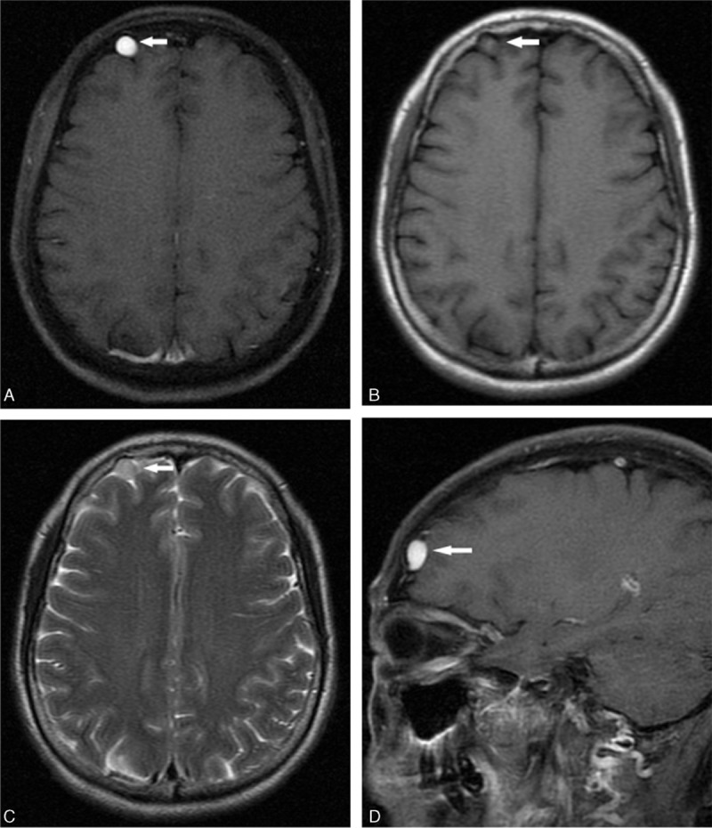
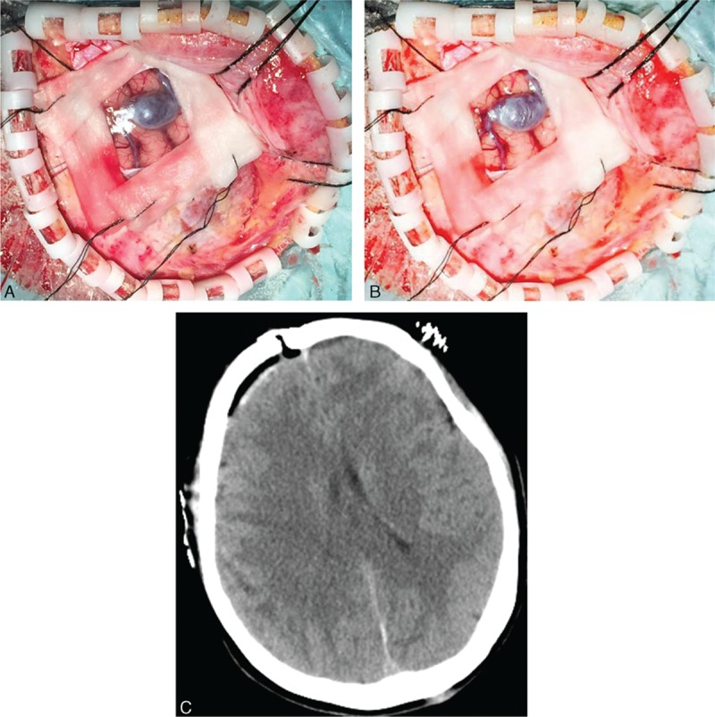
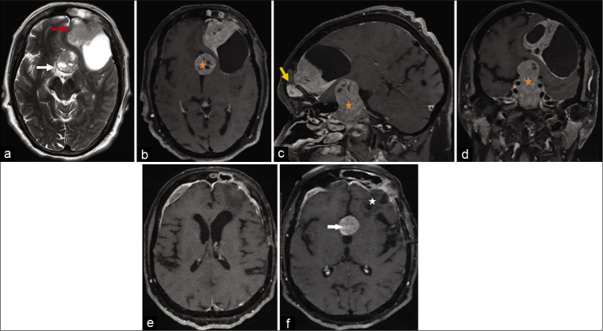
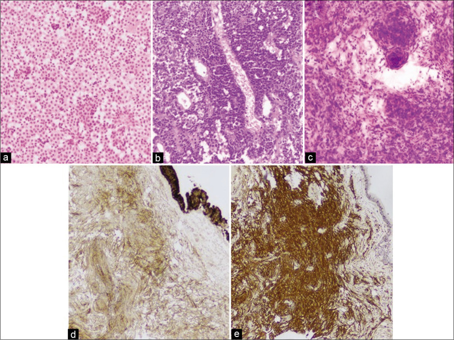
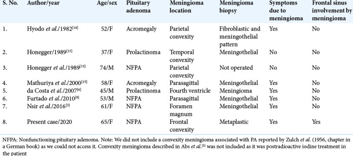
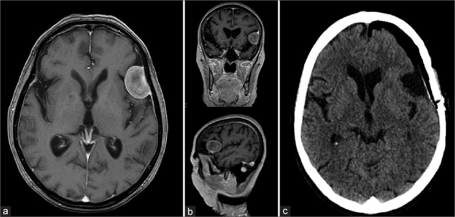
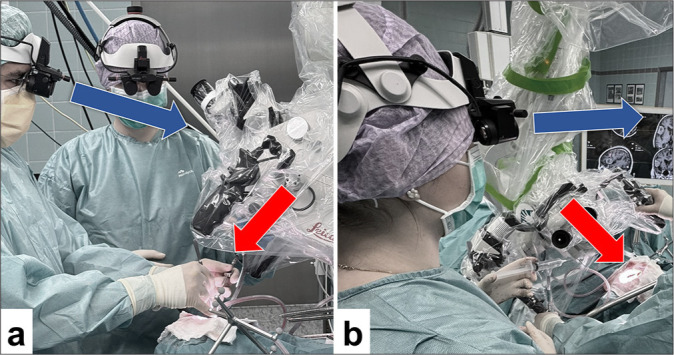
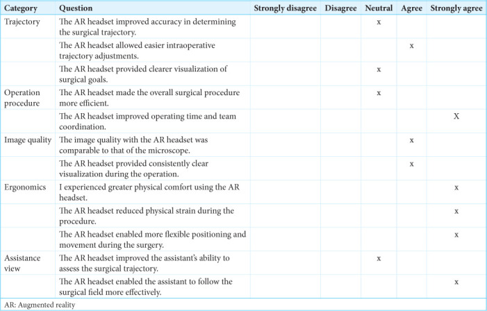

# Case Prep: Convexity Meningioma Resection

---

<!-- BEGIN CASE DOSSIER -->

## Case / Approach Dossier

- **Anatomy at risk:** tumor compartment, arterial supply, venous drainage/sinuses, cranial nerves, white-matter tracts, pituitary/CSF pathways when relevant, and functional cortex.
- **Operative steps:** review imaging and goals, choose exposure, obtain brain relaxation, devascularize when possible, debulk internally, dissect capsule from critical structures, verify extent/safety, and reconstruct watertight closure; use the detailed operative sequence and approach notes below as the step-by-step source.
- **Rescue plans:** venous or arterial injury, swelling, seizure, cranial nerve or endocrine change, CSF leak, residual tumor left for safety, staged surgery, radiation, or adjuvant therapy.
- **Figures:** review [Figures, Imaging & Video](#figures-imaging--video) and the [Curated Image Set](#curated-image-set); embedded local figures should remain open-access, public-domain, or otherwise reusable with attribution.
- **Papers:** review [High-Yield Literature](#high-yield-literature) for seminal sources, modern reviews, and outcome data specific to this page.
- **Textbook cross-checks:** use [Textbook Cross-Checks](#textbook-cross-checks) and the [Source Crosswalk](../../resources/source-crosswalk.md) to cite copyrighted textbooks/atlases while summarizing in original words.

<!-- END CASE DOSSIER -->

## One-Liner
[Age]yo [M/F] with a [size] cm left/right [frontal/parietal/temporal/occipital] convexity meningioma presenting with [headaches/seizures/focal deficit/incidental] planned for craniotomy for microsurgical resection.

---

## Figures, Imaging & Video

**🎥 Operative videos & resources**
- **Atlas / technique:** [The Neurosurgical Atlas](https://www.neurosurgicalatlas.com) — search *convexity meningioma* and review dural devascularization, circumferential dissection, cortical vein preservation, and Simpson-grade strategy
- **Video searches:** [convexity meningioma resection on YouTube](https://www.youtube.com/results?search_query=convexity+meningioma+resection+microsurgery) · [meningioma craniotomy operative video](https://www.youtube.com/results?search_query=meningioma+craniotomy+operative+video)
- **Imaging review:** [Radiopaedia — convexity meningioma](https://radiopaedia.org/search?q=convexity%20meningioma&scope=all) · [PubMed Central — convexity meningioma resection](https://www.ncbi.nlm.nih.gov/pmc/?term=convexity+meningioma+resection)

---

<!-- BEGIN TEXTBOOK CROSS-CHECKS -->

## Textbook Cross-Checks

- **Tumor and skull-base anatomy:** Youmans and Winn; Schmidek and Sweet; Rhoton Cranial Anatomy; Brain Anatomy and Neurosurgical Approaches — confirm compartment, dural/vascular supply, cranial nerves, venous sinuses, white-matter tracts, and safe surgical corridors.
- **Oncologic strategy:** CNS Radiation Oncology Principles and Practice; Youmans and Winn; Greenberg — summarize goals of resection, adjuvant-therapy context, surveillance, and when subtotal resection is safer.
- **Complication rescue:** Schmidek and Sweet; Greenberg — review edema, seizure, venous injury, endocrinopathy/CSF leak, neurologic deficit, and reconstruction issues.
- **Copyright-safe use:** cite these sources as private cross-checks, then write the guide content in original words; do not re-host textbook pages, figures, tables, or board-review card material. See [Source Crosswalk & Copyright-Safe Use](../../resources/source-crosswalk.md).

<!-- END TEXTBOOK CROSS-CHECKS -->

<!-- BEGIN CURATED LITERATURE -->

## High-Yield Literature

- **[Convexity Meningioma, Parasagittal Meningioma, Falx Meningioma]** — Matsuda M. No shinkei geka. Neurological surgery 2024. [PubMed](https://pubmed.ncbi.nlm.nih.gov/39034511/)
- **Convexity meningioma resection in the modern neurosurgical era** — Sarris C. Handbook of clinical neurology 2020. [PubMed](https://pubmed.ncbi.nlm.nih.gov/32586511/)
- **Convexity meningioma associated with noncontiguous dural arteriovenous fistula** — Manzo M. Surgical neurology international 2020. [PubMed](https://pubmed.ncbi.nlm.nih.gov/32494401/)
- **Atypical convexity meningioma presenting with photophobia and skull erosion** — Kuroda K. Radiology case reports 2023. [PubMed](https://pubmed.ncbi.nlm.nih.gov/36411850/)
- **Simultaneous Convexity Meningioma and Prolactinoma** — Figueroa-Angel V. Journal of neurosciences in rural practice 2017. [PubMed](https://pubmed.ncbi.nlm.nih.gov/29204043/)
- **Recurrent subcutaneous metastasis of a convexity meningioma: a case report and literature review** — Hachicha A. The International journal of neuroscience 2024. [PubMed](https://pubmed.ncbi.nlm.nih.gov/37929581/)
- **Convexity dural hemangioma: illustrative case** — Hayden EA. Journal of neurosurgery. Case lessons 2024. [PubMed](https://pubmed.ncbi.nlm.nih.gov/39556829/)
- **A convexity meningioma presenting with an acute subdural hematoma** — Itani M. Surgical neurology international 2020. [PubMed](https://pubmed.ncbi.nlm.nih.gov/33024601/)
- **[Convexity meningioma?]** — Blum U. Der Radiologe 1988. [PubMed](https://pubmed.ncbi.nlm.nih.gov/3375449/)
- **A Rare Case of Postoperative Symptomatic Cyst Formation After Resection of a Large Convexity Meningioma** — Fujimori T. World neurosurgery 2019. [PubMed](https://pubmed.ncbi.nlm.nih.gov/30974281/)

<!-- END CURATED LITERATURE -->

---

<!-- BEGIN CURATED IMAGE SET -->

## Curated Image Set

Open-access figures are embedded from PubMed Central articles and kept unique to this guide.

*Figure 1. Preoperative magnetic resonance images postcontrast images revealed a rounded lesion on the axial T1-weighted image (arrow, A) and the spindle-shaped on sagittal image (arrow, D), with... Source: [Extra-axial isolated cerebral varix misdiagnosed as convexity meningioma](https://pmc.ncbi.nlm.nih.gov/articles/PMC4937951/) — Medicine 2016; CC BY.*

*Figure 2. Intraoperative exposure of the isolate cerebral varix and postoperative CT image. A focal dilatation of the convexity vein was found. It has the filling stage (A) and the loose stage... Source: [Extra-axial isolated cerebral varix misdiagnosed as convexity meningioma](https://pmc.ncbi.nlm.nih.gov/articles/PMC4937951/) — Medicine 2016; CC BY.*

*Figure 1:. The axial T2 image (a) shows two discrete heterogeneous extra-axial lesions at suprasellar cistern (white arrow) and left frontal convexity (red arrow). The axial (b), sagittal, (c) and... Source: [Coexistent pituitary adenoma and frontal convexity meningioma with frontal sinus invasion: A rare association](https://pmc.ncbi.nlm.nih.gov/articles/PMC7538984/) — Surgical Neurology International 2020; CC BY-NC-SA.*

*Figure 2:. (a and b) Hematoxylin and eosin (H&E) staining, ×10, shows sheets of monomorphic cells with round nuclei, salt and pepper chromatin consistent with pituitary adenoma (c). H&E, ×10,... Source: [Coexistent pituitary adenoma and frontal convexity meningioma with frontal sinus invasion: A rare association](https://pmc.ncbi.nlm.nih.gov/articles/PMC7538984/) — Surgical Neurology International 2020; CC BY-NC-SA.*

*Figure 5. Source: [Coexistent pituitary adenoma and frontal convexity meningioma with frontal sinus invasion: A rare association](https://pmc.ncbi.nlm.nih.gov/articles/PMC7538984/) — Surg Neurol Int. 2020 Sep 5;11:270. doi: 10.25259/SNI_164_2020; CC BY-NC-SA.*

*Figure 6. Source: [Coexistent pituitary adenoma and frontal convexity meningioma with frontal sinus invasion: A rare association](https://pmc.ncbi.nlm.nih.gov/articles/PMC7538984/) — Surg Neurol Int. 2020 Sep 5;11:270. doi: 10.25259/SNI_164_2020; CC BY-NC-SA.*

*Figure 1:. (a) Magnetic resonance imaging (MRI) of the patient in T1 sequence with contrast, axial view. (b) MRI of the patient in T1 sequence with contrast, coronal and sagittal views. (c)... Source: [Application of a head-mounted augmented reality display for visualization in convexity meningioma resection: A technical note](https://pmc.ncbi.nlm.nih.gov/articles/PMC12482705/) — Surgical Neurology International 2025; CC BY-NC-SA.*

*Figure 2:. (a and b) An overview of the surgical setup, showcasing both the surgeon and the assistant in ergonomic positions while performing the procedure, highlighting the benefits of the MyVeo... Source: [Application of a head-mounted augmented reality display for visualization in convexity meningioma resection: A technical note](https://pmc.ncbi.nlm.nih.gov/articles/PMC12482705/) — Surgical Neurology International 2025; CC BY-NC-SA.*

*Figure 9. Source: [Application of a head-mounted augmented reality display for visualization in convexity meningioma resection: A technical note](https://pmc.ncbi.nlm.nih.gov/articles/PMC12482705/) — Surg Neurol Int. 2025 Aug 22;16:362. doi: 10.25259/SNI_362_2025; CC BY-NC-SA.*

*Figure 10. Source: [Application of a head-mounted augmented reality display for visualization in convexity meningioma resection: A technical note](https://pmc.ncbi.nlm.nih.gov/articles/PMC12482705/) — Surg Neurol Int. 2025 Aug 22;16:362. doi: 10.25259/SNI_362_2025; CC BY-NC-SA.*

<!-- END CURATED IMAGE SET -->

---

## History of Present Illness
- Chief complaint: Headaches / seizures / focal neurological deficit / incidental
- Duration of symptoms:
- Seizure history (type, frequency, medications):
- Progressive focal deficit:
- Cognitive changes:
- Growth rate (if serial imaging available):

---

## Past Medical History
- Seizure history and current AEDs
- Prior radiation therapy (radiation-induced meningioma?)
- NF2 (multiple meningiomas)
- Hormone use (progesterone receptor positive in many meningiomas)
- Anticoagulant/antiplatelet use
- Prior cranial surgery
- Allergies:
- Medications:

---

## Imaging Review
### CT Head
- Calcification pattern
- Hyperostosis of adjacent bone
- Bone erosion / invasion

### MRI Brain (T1, T1+Gad, T2, FLAIR)
- **Location:** Convexity — frontal / parietal / temporal / occipital
- **Size:** ___ x ___ x ___ cm
- **Enhancement:** Homogeneous / heterogeneous (heterogeneous suggests higher grade)
- **Dural tail:** Present / absent
- **Edema:** Peritumoral edema extent (correlates with brain invasion, higher grade)
- **Mass effect / midline shift:**
- **Relationship to:**
  - Motor cortex (precentral gyrus)
  - Sensory cortex (postcentral gyrus)
  - Language areas (dominant hemisphere)
  - Visual cortex (occipital)
  - Superior sagittal sinus
  - Cortical veins / bridging veins
- **Signal characteristics:**
  - T1: isointense to cortex
  - T2: iso to hyperintense
  - DWI: restricted diffusion suggests higher grade

### MRV (MR Venography)
- Relationship to superior sagittal sinus
- Patency of adjacent cortical veins and bridging veins
- Venous drainage pattern

### DTI Tractography (if near eloquent areas)
- Corticospinal tract relationship
- Arcuate fasciculus (dominant hemisphere)
- Optic radiations (temporal/occipital)

### Navigation
- Thin-cut MRI with gadolinium loaded to navigation
- Tumor margins mapped
- Eloquent structures identified
- Surface anatomy correlated with tumor location

---

## Labs
- CBC (Hgb, Plt)
- BMP
- Coagulation (PT/INR, PTT)
- Type and screen (crossmatch if large/vascular tumor)

---

## Neurological Examination
### Mental Status
- Orientation, attention, memory:
- Language (if dominant hemisphere):
- Neglect (if non-dominant parietal):

### Motor
- Contralateral strength (face, arm, leg):
- Drift:
- Tone:

### Sensory
- Contralateral sensation:
- Cortical sensory (two-point, graphesthesia, stereognosis):

### Visual Fields
- Confrontation fields (if temporal/parietal/occipital):

### Seizure Semiology
- Type and frequency if applicable:

---

## Surgical Planning

### Diagnosis & Indication
- Working diagnosis: Convexity meningioma (WHO grade I presumed)
- Surgical indication: Symptomatic / growing / large with mass effect
- Goals: Simpson grade I resection (tumor + dural attachment + involved bone) when safely achievable; Simpson II (tumor + coagulation of dural attachment) minimum
- Observation alternative: If small (< 3 cm), asymptomatic, elderly — serial imaging

### Position
- **Patient position:** Determined by tumor location
  - Frontal: Supine, head neutral or slight contralateral rotation
  - Parietal: Supine or lateral, head turned to bring tumor to highest point
  - Temporal: Supine, head rotated contralateral 60-90 degrees
  - Occipital: Prone, lateral, or Concorde
- **Head position:** Tumor should be at the apex (highest point) — gravity retracts brain away
- **Skull clamp:** Mayfield 3-pin fixation
  - Position pins away from the craniotomy site
  - Single pin contralateral, double pins ipsilateral and posterior
- **Table:** Slight reverse Trendelenburg
- **Arms:** Tucked at sides

### Incision
- **Type:** Curvilinear or horseshoe, centered over the tumor
- **Planning:** Use navigation to mark tumor margins on scalp, then plan incision 2-3 cm beyond margins
- **Key considerations:**
  - Base the flap toward the blood supply (STA branches)
  - Avoid crossing midline if not needed
  - Cosmesis (behind hairline when possible)

### Approach: Convexity Craniotomy
- **Craniotomy design:**
  - Extend 1-2 cm beyond tumor margins in all directions
  - If dural attachment at sinus margin — expose sinus edge for potential repair
- **Burr holes:** 3-4 around planned craniotomy perimeter
- **Bone flap:** Free bone flap, sized to expose tumor and surrounding normal dura
- **Key consideration:** If hyperostotic bone — may need to include in resection (Simpson I)

### Microsurgical Steps
1. **Craniotomy** — expose tumor and margin of normal dura circumferentially
2. **Dural opening** — circumferential, around the tumor's dural attachment
   - Option A: Open dura at tumor margin, devascularize the dural base early
   - Option B: Open dura away from tumor first, then approach tumor
3. **Devascularize dural base** — coagulate dural blood supply at the base early to reduce bleeding
4. **Circumferential dissection** — work around tumor periphery
   - Identify arachnoid plane between tumor capsule and brain
   - Follow the arachnoid plane with gentle dissection
   - Coagulate and divide pial feeding vessels ON the tumor side
5. **Internal debulking** — if large tumor, use CUSA or piecemeal removal to decompress internally, then continue capsule dissection
6. **Preserve cortical veins** — critical draining veins must be preserved even if adherent
7. **Identify and preserve functional cortex** — use navigation, mapping if near motor/language
8. **Complete circumferential dissection** — deliver tumor
9. **Inspect resection cavity** — hemostasis, confirm no residual
10. **Excise involved dura** — cut dura margin 1-2 cm beyond attachment (Simpson I)
11. **Drill involved bone** — if hyperostosis present (Simpson I)
12. **Dural reconstruction** — primary closure or dural graft/substitute

### Critical Anatomy & Structures at Risk
1. **Motor cortex** (precentral gyrus) — if frontal/parietal location
2. **Sensory cortex** (postcentral gyrus) — parietal location
3. **Language areas** — dominant hemisphere frontal (Broca) or temporal/parietal (Wernicke)
4. **Bridging veins / cortical draining veins** — sacrifice can cause venous infarction
5. **Superior sagittal sinus** — if tumor extends to parasagittal region
6. **Pericallosal / cortical arteries** — encased or displaced by tumor
7. **Optic radiations** — temporal/parietal/occipital location

### Equipment & Instrumentation
- Operating microscope
- Stereotactic navigation (MRI-based)
- CUSA (Cavitron ultrasonic aspirator) — for internal debulking
- High-speed drill — for hyperostotic bone
- Bipolar forceps
- Microsurgical instruments
- Hemostatic agents (Surgicel, Gelfoam, Floseal)
- Dural substitute (if Simpson I excision)
- Bone fixation (titanium plates/screws)
- Cranioplasty material (if bone involved and removed)
- Specimen containers (fresh and formalin)

### Monitoring
- SSEPs (if near sensory cortex)
- MEPs (if near motor cortex)
- Direct cortical stimulation (if near eloquent cortex)
- EMG — CN VII monitoring if temporal/frontal-lateral
- Language mapping (awake craniotomy if dominant hemisphere near language areas)

### Anesthesia Considerations
- Arterial line
- Two large-bore IVs
- Foley catheter
- Mannitol 1 g/kg (for brain relaxation if significant edema)
- Dexamethasone 10 mg IV (if not already on steroids)
- Cefazolin 2g IV
- Levetiracetam 1000 mg IV (if seizure history or frontal location)
- Type and crossmatch (large tumors can bleed significantly)
- Cell saver consideration (large vascular tumors)
- No paralytic (if motor monitoring)

### Potential Complications & Contingencies
1. **Significant bleeding from dural base** — control early with devascularization; bipolar, Surgicel
2. **Brain swelling** — mannitol, hyperventilation, ensure adequate venous drainage, consider additional CSF drainage
3. **Venous infarction** (from cortical vein sacrifice) — avoid sacrificing bridging veins; if unavoidable, leave small residual adherent to vein
4. **Motor/language deficit** — intraoperative monitoring, consider subtotal resection if eloquent cortex involved
5. **Sagittal sinus injury** — Gelfoam/Surgicel packing, avoid primary repair if partial; consider sinus reconstruction if complete occlusion needed

---

## Operative Note Template

**Preoperative Diagnosis:** Left/right [location] convexity meningioma

**Postoperative Diagnosis:** Same; WHO Grade [I/II/III] meningioma (pending final pathology)

**Procedure:** Left/right [location] craniotomy for resection of convexity meningioma

**Surgeon:**
**Assistant:**
**Anesthesia:** General endotracheal anesthesia

**EBL:**
**Fluids:**
**Specimens:** Meningioma (sent fresh and in formalin for permanent pathology, WHO grading)
**Drains:** [Subgaleal drain / None]
**Complications:** None
**Implants:** [Titanium plates/screws, dural substitute if used, cranioplasty if used]

**Indications:**
The patient is a [age]yo [M/F] with a [size] cm [location] convexity meningioma presenting with [symptoms]. MRI demonstrated a homogeneously enhancing extra-axial mass with a dural tail, peritumoral edema, and [mass effect]. After discussion of risks, benefits, and alternatives including observation [and radiation], the patient elected to proceed with surgical resection.

**Description of Procedure:**
[Standard opening — anesthesia, positioning, prep/drape, time-out]

The patient was positioned [position] with the head secured in a Mayfield skull clamp. [Pin placement details.] The tumor location was confirmed with stereotactic navigation and marked on the scalp. All pressure points were padded.

**Incision:** A [curvilinear/horseshoe] skin incision was made centered over the tumor with margins extending 2-3 cm beyond the tumor edges as confirmed by navigation. The scalp flap was reflected, exposing the calvarium.

**Craniotomy:** [Number] burr holes were placed circumferentially around the planned craniotomy. The craniotomy was performed with the craniotome, creating a bone flap extending at least 1-2 cm beyond the tumor margins. The bone flap was elevated. [Hyperostotic bone was noted overlying the tumor attachment.] Epidural hemostasis was obtained.

**Dural opening and tumor resection:** The dura was opened circumferentially around the tumor's dural attachment, beginning at the margins of normal dura. The dural blood supply to the tumor base was progressively coagulated and divided to devascularize the tumor early.

Under the operating microscope, the arachnoid plane between the tumor capsule and the underlying brain was identified. Circumferential dissection was performed along this plane, progressively mobilizing the tumor from the surrounding brain. Pial feeding vessels were coagulated and divided on the tumor side. [The CUSA was used for internal debulking to facilitate capsule dissection.] [Cortical draining veins were identified and carefully preserved.]

The tumor was delivered en bloc / in large fragments. The involved dura at the base was excised with a 1-2 cm margin [Simpson Grade I]. [The underlying hyperostotic bone was drilled/removed.] The resection cavity was inspected and confirmed free of residual tumor.

**Hemostasis:** Meticulous hemostasis was achieved with bipolar cautery, Surgicel, and Gelfoam. The cavity was irrigated with warm saline.

**Closure:** The dural defect was reconstructed with [primary closure of remaining dura supplemented by dural substitute / dural substitute graft]. Watertight closure was achieved. [DuraSeal was applied.] The bone flap was replaced and secured with titanium plates and screws. The galea was closed with 3-0 Vicryl. The skin was closed with staples. A sterile dressing was applied.

**Postoperative:** The patient was awakened from anesthesia, extubated, and found to be neurologically [intact / at baseline]. Neuromonitoring signals remained stable throughout. The patient was transferred to the neurosurgical ICU in stable condition.

---

## Postoperative Plan
- ICU x 24 hours, then step-down
- Neuro checks q1h x 24h
- HOB 30 degrees
- CT head within 6 hours
- MRI brain with gadolinium within 24-48 hours (extent of resection)
- DVT prophylaxis: SCDs immediately, heparin SQ starting POD1
- Dexamethasone taper over 5-7 days (or longer if significant edema)
- Seizure prophylaxis (levetiracetam x 7 days if no prior seizures; continue if seizure history)
- Pain management
- Diet: advance as tolerated
- Pathology follow-up: WHO grade, Ki-67, progesterone receptor status
- If WHO Grade II/III: discuss adjuvant radiation at tumor board
- Follow-up: Clinic 2-4 weeks, MRI at 3 months, then annually x 5+ years
- Simpson Grade I: ~9% recurrence at 10 years (Grade I meningioma)
- Simpson Grade II: ~19% recurrence at 10 years
