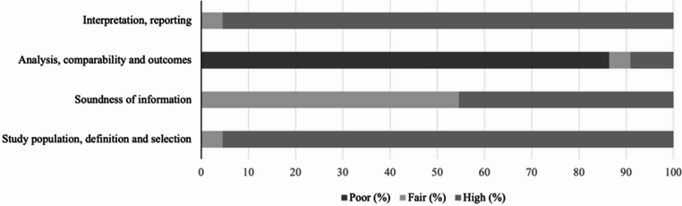
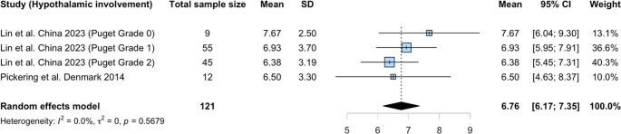
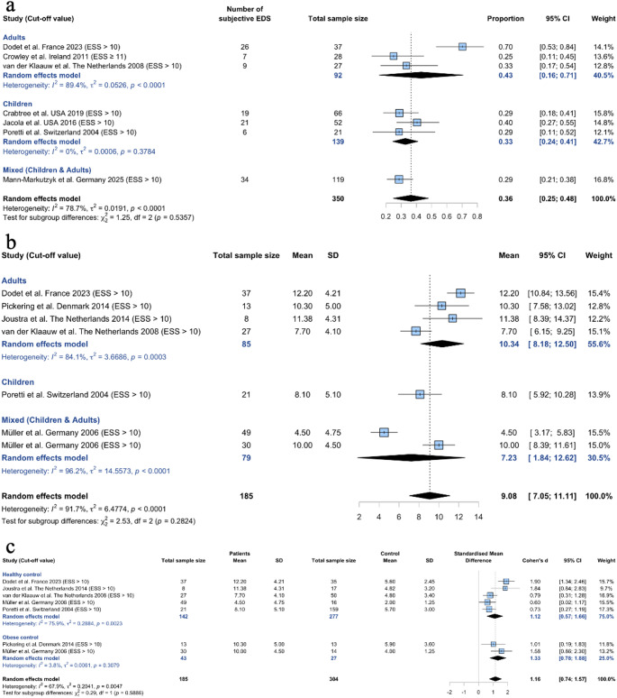
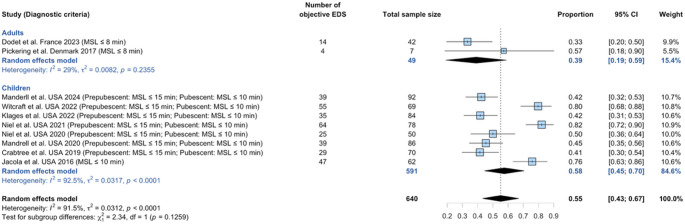
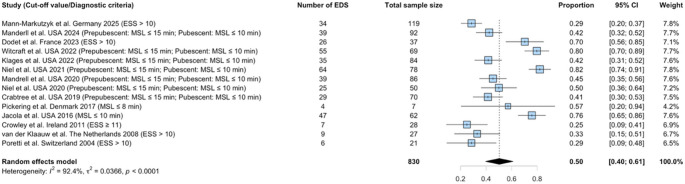
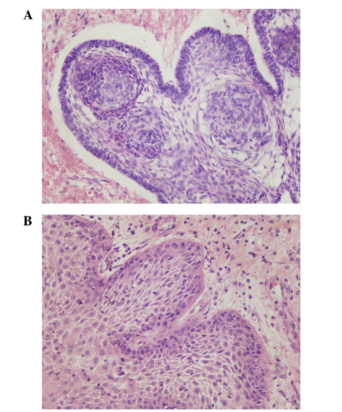
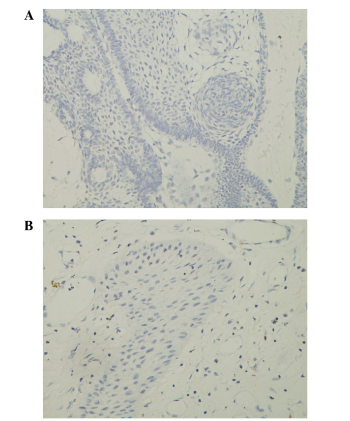
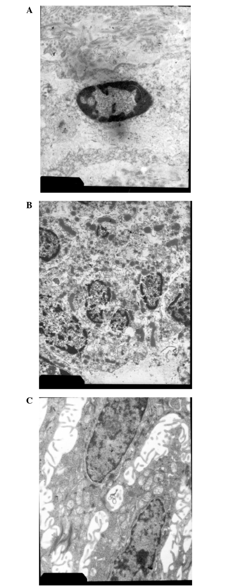
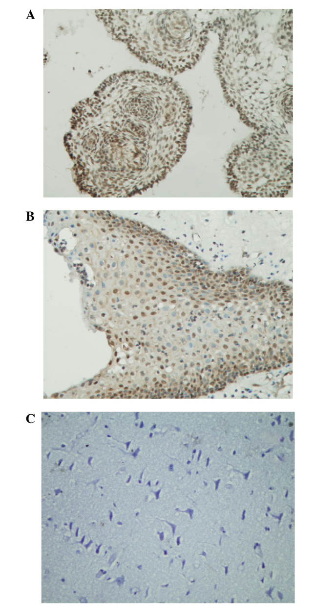
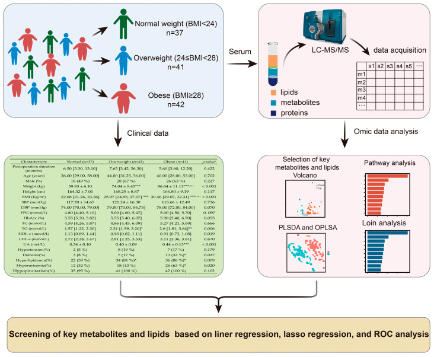

# Case Prep: Craniopharyngioma Resection

---

## One-Liner
[Age]yo [M/F] with a [adamantinomatous / papillary] craniopharyngioma ([sellar/suprasellar/third ventricular]) presenting with [visual loss / endocrinopathy / hydrocephalus] planned for [endoscopic endonasal / pterional / transcallosal] resection.

---

## Figures, Imaging & Video

**🎥 Operative video** — [search operative video on YouTube ▸](https://www.youtube.com/results?search_query=craniopharyngioma+surgery) · [The Neurosurgical Atlas ▸](https://www.neurosurgicalatlas.com)

> 🧭 **Operative approach:** [Supraorbital keyhole craniotomy](../approaches/supraorbital-keyhole-craniotomy.md) — detailed corridor setup, step-by-step technique & figures

> Operative figures/atlases are © (linked, not copied). See [media-sources.md](../../resources/media-sources.md).
- **Technique/approach:** [The Neurosurgical Atlas](https://www.neurosurgicalatlas.com) — search *"craniopharyngioma"*
- **Imaging:** [Radiopaedia — craniopharyngioma](https://radiopaedia.org/search?q=craniopharyngioma&scope=all)
- **Open-access figures:** [PubMed Central](https://www.ncbi.nlm.nih.gov/pmc/?term=craniopharyngioma+resection)

---

<!-- BEGIN TEXTBOOK CROSS-CHECKS -->

## Textbook Cross-Checks

- **Tumor and skull-base anatomy:** Youmans and Winn; Schmidek and Sweet; Rhoton Cranial Anatomy; Brain Anatomy and Neurosurgical Approaches — confirm compartment, dural/vascular supply, cranial nerves, venous sinuses, white-matter tracts, and safe surgical corridors.
- **Oncologic strategy:** CNS Radiation Oncology Principles and Practice; Youmans and Winn; Greenberg — summarize goals of resection, adjuvant-therapy context, surveillance, and when subtotal resection is safer.
- **Complication rescue:** Schmidek and Sweet; Greenberg — review edema, seizure, venous injury, endocrinopathy/CSF leak, neurologic deficit, and reconstruction issues.
- **Copyright-safe use:** cite these sources as private cross-checks, then write the guide content in original words; do not re-host textbook pages, figures, tables, or board-review card material. See [Source Crosswalk & Copyright-Safe Use](../../resources/source-crosswalk.md).

<!-- END TEXTBOOK CROSS-CHECKS -->

<!-- BEGIN CURATED LITERATURE -->

## High-Yield Literature

- **Craniopharyngioma surgery** — Honegger J. Pituitary 2008. [PubMed](https://pubmed.ncbi.nlm.nih.gov/18636330/)
- **Craniopharyngioma** — Boop FA. Journal of neurosurgery 2007. [PubMed](https://pubmed.ncbi.nlm.nih.gov/17233304/)
- **Precision Oncology for Papillary Craniopharyngioma** — Blakeley JO. The New England journal of medicine 2023. [PubMed](https://pubmed.ncbi.nlm.nih.gov/37437149/)
- **Pediatric craniopharyngioma** — Drapeau A. Child's nervous system : ChNS : official journal of the International Society for Pediatric Neurosurgery 2019. [PubMed](https://pubmed.ncbi.nlm.nih.gov/31385085/)
- **The craniopharyngioma** — Oskouian RJ. Frontiers of hormone research 2006. [PubMed](https://pubmed.ncbi.nlm.nih.gov/16474218/)
- **Craniopharyngioma** — Till K. Child's brain 1982. [PubMed](https://pubmed.ncbi.nlm.nih.gov/7049599/)
- **Advances in the management of craniopharyngioma in children and adults** — Jensterle M. Radiology and oncology 2019. [PubMed](https://pubmed.ncbi.nlm.nih.gov/31652121/)
- **[Craniopharyngioma]** — Yamada S. Nihon rinsho. Japanese journal of clinical medicine 2006. [PubMed](https://pubmed.ncbi.nlm.nih.gov/16776122/)
- **[Craniopharyngioma]** — Bingas B. Fortschritte der Neurologie, Psychiatrie, und ihrer Grenzgebiete 1968. [PubMed](https://pubmed.ncbi.nlm.nih.gov/4869338/)
- **[Craniopharyngioma]** — Maruno M. Nihon rinsho. Japanese journal of clinical medicine 2005. [PubMed](https://pubmed.ncbi.nlm.nih.gov/16201522/)

<!-- END CURATED LITERATURE -->

---

<!-- BEGIN CURATED IMAGE SET -->

## Curated Image Set

Open-access figures are embedded from PubMed Central articles and kept unique to this guide.

*Fig. 2. Sleep quality. Risk of study quality bias (%) was assessed by NIH quality assessment, which is applicable to different study designs and examines each study's internal validity by a set... Source: [Sleep disturbances in craniopharyngioma: a systematic review and meta-analysis](https://pmc.ncbi.nlm.nih.gov/articles/PMC12669364/) — Pituitary 2025; CC BY-NC-ND.*

*Fig. 3. Pooled mean of PSQI score in patients with craniopharyngioma Source: [Sleep disturbances in craniopharyngioma: a systematic review and meta-analysis](https://pmc.ncbi.nlm.nih.gov/articles/PMC12669364/) — Pituitary 2025; CC BY-NC-ND.*

*Fig. 4. a Proportion of subjective EDS in patients with craniopharyngioma by ESS. b Pooled mean of ESS score in patients with craniopharyngioma. c SMDcomparison of ESS score in patients with... Source: [Sleep disturbances in craniopharyngioma: a systematic review and meta-analysis](https://pmc.ncbi.nlm.nih.gov/articles/PMC12669364/) — Pituitary 2025; CC BY-NC-ND.*

*Fig. 5. Proportion of objective EDS in patients with craniopharyngioma by MSLT Source: [Sleep disturbances in craniopharyngioma: a systematic review and meta-analysis](https://pmc.ncbi.nlm.nih.gov/articles/PMC12669364/) — Pituitary 2025; CC BY-NC-ND.*

*Fig. 6. Proportion of EDS in patients with craniopharyngioma by ESS and MSLT Source: [Sleep disturbances in craniopharyngioma: a systematic review and meta-analysis](https://pmc.ncbi.nlm.nih.gov/articles/PMC12669364/) — Pituitary 2025; CC BY-NC-ND.*

*Figure 1. (A) Adamantinomatous and (B) squamous-papillary craniopharyngioma section images captured using light microscopy (stain, hematoxylin and eosin; magnification, ×400). Source: [Craniopharyngioma: Survivin expression and ultrastructure](https://pmc.ncbi.nlm.nih.gov/articles/PMC4246612/) — Oncology Letters 2015; CC BY.*

*Figure 2. Transferase dUTP nick end labeling-peroxidase staining of craniopharyngioma sections demonstrating cell apoptosis in (A) adamantinomatous and (B) squamous-papillary craniopharyngioma... Source: [Craniopharyngioma: Survivin expression and ultrastructure](https://pmc.ncbi.nlm.nih.gov/articles/PMC4246612/) — Oncology Letters 2015; CC BY.*

*Figure 3. Electron microscopy of various types of tumor cell, including (A) apoptotic, (B) necrotic and (C) craniopharyngioma tumor cells (magnification, ×10,000). Source: [Craniopharyngioma: Survivin expression and ultrastructure](https://pmc.ncbi.nlm.nih.gov/articles/PMC4246612/) — Oncology Letters 2015; CC BY.*

*Figure 4. Survivin expression levels in 50 craniopharyngioma samples, including (A) adamantinomatous and (B) squamous-papillary craniopharyngioma tissues, and (C) 10 healthy control samples... Source: [Craniopharyngioma: Survivin expression and ultrastructure](https://pmc.ncbi.nlm.nih.gov/articles/PMC4246612/) — Oncology Letters 2015; CC BY.*

*Figure 1. Outline of study workflows. p-value a refer to comparison among three group; * p < 0.05, ** p < 0.01, *** p < 0.001 vs. normal group with Bonferroni correction; ††† p < 0.001 vs.... Source: [Serum Metabolomic and Lipidomic Profiling Reveals the Signature for Postoperative Obesity among Adult-Onset Craniopharyngioma](https://pmc.ncbi.nlm.nih.gov/articles/PMC11205291/) — Metabolites 2024; CC BY.*

<!-- END CURATED IMAGE SET -->

---

## History of Present Illness
- Chief complaint: Visual decline, endocrine dysfunction (growth failure in children, hypogonadism/DI/hypopituitarism in adults), headache, hydrocephalus
- **Bimodal age:** children (adamantinomatous) and adults (papillary)
- Hypothalamic symptoms: obesity, temperature/sleep dysregulation, behavioral

---

## Imaging Review
### MRI (T1±Gad, T2, sella protocol)
- Location: sellar, suprasellar, retrochiasmatic, third ventricle
- **Cystic (machinery oil fluid) + solid + calcification** (adamantinomatous); papillary often solid
- Optic chiasm/nerve relationship (pre/post-fixed)
- **Hypothalamic involvement** (CRITICAL — predicts morbidity; Puget grade 0-2)
- ICA, ACA, stalk, third ventricle, hydrocephalus

### CT
- **Calcification** (adamantinomatous hallmark), sellar anatomy, sphenoid pneumatization (endonasal)

### Endocrine + Ophthalmology
- Full pituitary panel, AM cortisol, DI assessment (Na, urine osm), visual fields/acuity

---

## Labs
- CBC, BMP (Na baseline), Coags, full endocrine panel, **AM cortisol** (stress-dose if deficient), Type and screen

---

## Neurological Examination
- Vision, endocrine, hypothalamic function, cognition

---

## Surgical Planning

### Approach Selection
- **Endoscopic endonasal extended transsphenoidal:** Favored for midline retrochiasmatic/infrachiasmatic tumors — direct access, superior visual outcomes, but CSF leak risk; needs nasoseptal flap
- **Pterional/orbitozygomatic:** Lateral suprasellar extension, vessel encasement
- **Transcallosal/transcortical-transventricular:** Predominantly third-ventricular tumors
- **Goal debate:** Gross total resection (cure but hypothalamic morbidity risk) vs planned subtotal + radiation (function preservation) — especially if hypothalamic involvement

### Position
- Endonasal: supine, slight extension, navigation, possible lumbar drain
- Transcranial: per approach

### Key Surgical Steps (Endoscopic Endonasal Extended)
1. Nasal phase, nasoseptal flap, wide sphenoidotomy, posterior ethmoidectomy
2. Remove tuberculum/planum bone (transtuberculum-transplanum), expose suprasellar dura
3. Open dura above and below superior intercavernous sinus (ligate)
4. Identify chiasm, stalk, superior hypophyseal arteries, ICAs
5. **Cyst drainage**, debulk solid tumor, peel capsule off chiasm/hypothalamus/vessels
6. **Hypothalamic adherence — judgment point:** leave residual on hypothalamus rather than cause injury
7. Preserve stalk if possible (often sacrificed → panhypopituitarism/DI)
8. **Multilayer skull base reconstruction** (fascia/collagen inlay + nasoseptal flap + sealant) — high CSF leak risk

### Critical Anatomy & Structures at Risk
1. **Hypothalamus** — adherence; injury → obesity, memory, temperature, electrolyte, behavioral devastation
2. **Optic chiasm/nerves** and **superior hypophyseal arteries** (visual outcome)
3. **Pituitary stalk/gland** — endocrine outcome (DI nearly universal if sacrificed)
4. **ICA, ACA, perforators**
5. Third ventricle/foramen of Monro

### Equipment
- Endoscope/microscope, navigation, drill, CUSA, ICG
- Nasoseptal flap, fascia lata/fat graft, dural substitute, sealant, lumbar drain

### Monitoring
- SSEPs; VEPs (optional)

### Anesthesia
- Arterial line, Foley (strict I/O for DI), stress-dose steroids if adrenal insufficient, careful Na management

### Potential Complications
1. **Diabetes insipidus** (often permanent) + triphasic response
2. **Hypothalamic obesity/dysfunction**, panhypopituitarism
3. CSF leak (endonasal), visual change, vascular injury
4. Recurrence (high; long-term surveillance)

---

## Operative Note Template
**Preoperative Diagnosis:** [Adamantinomatous/papillary] craniopharyngioma ([sellar/suprasellar/third-ventricular]) with [visual loss/endocrinopathy/hydrocephalus]

**Postoperative Diagnosis:** Same

**Procedure:** [Endoscopic endonasal extended transsphenoidal / pterional] resection of craniopharyngioma [with nasoseptal flap reconstruction]

**Surgeon / Assistant:** [± ENT co-surgeon]
**Anesthesia:** General endotracheal
**EBL / Fluids:**
**Adjuncts:** Neuronavigation, endoscope/microscope, ICG, micro-Doppler; strict I/O (DI), lumbar drain
**Implants:** Fascia/fat graft, nasoseptal flap, dural sealant
**Complications:** None

**Indications:** [Age]yo [M/F] with a craniopharyngioma causing [progressive visual loss/endocrine dysfunction/hydrocephalus]. Approach chosen for [midline retrochiasmatic extent → endonasal / lateral or vascular extension → transcranial]. Risks (DI, hypopituitarism, hypothalamic injury, CSF leak, visual change) discussed; stress-dose steroids given.

**Description of Procedure:** After consent and time-out, general anesthesia was induced with a Foley for strict I/O and stress-dose steroids, and navigation registered. [Endonasal: a nasoseptal flap was raised, wide sphenoidotomy and posterior ethmoidectomy performed, and the tuberculum/planum removed to expose the suprasellar dura, which was opened after ligating the superior intercavernous sinus.] The chiasm, stalk, superior hypophyseal arteries, and ICAs were identified.

The cyst was drained and the solid tumor debulked; the capsule was carefully peeled off the optic apparatus, hypothalamus, and vessels, **preserving the superior hypophyseal artery branches to the chiasm**. Where tumor was densely adherent to the hypothalamus, residual was left rather than risk injury. [The stalk was preserved / sacrificed.] [Endonasal: a multilayer skull base reconstruction was performed with fascia/fat inlay, the vascularized nasoseptal flap, and sealant.]

Closure was completed and the patient transferred to the ICU with intensive DI/sodium monitoring.

---

## Postoperative Plan
- ICU, neuro checks q1h
- **Intensive DI/Na management** — strict I/O, q4-6h Na, DDAVP protocol, triphasic vigilance
- **AM cortisol / stress-dose steroids**, full endocrine replacement, endocrine consult
- CSF leak precautions, lumbar drain management
- MRI postop, ophthalmology, visual fields
- Residual → radiation/proton therapy planning; long-term surveillance
- Hypothalamic dysfunction monitoring (weight, behavior)
