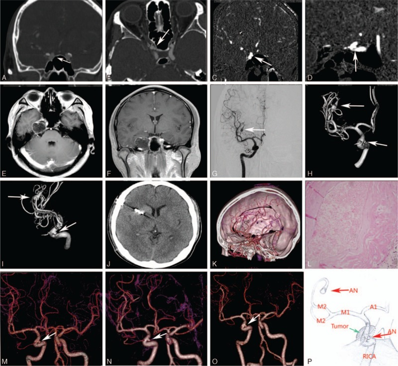
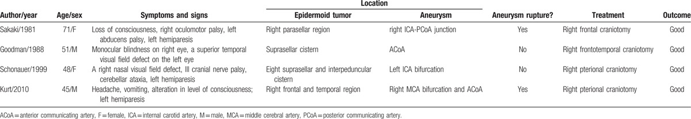
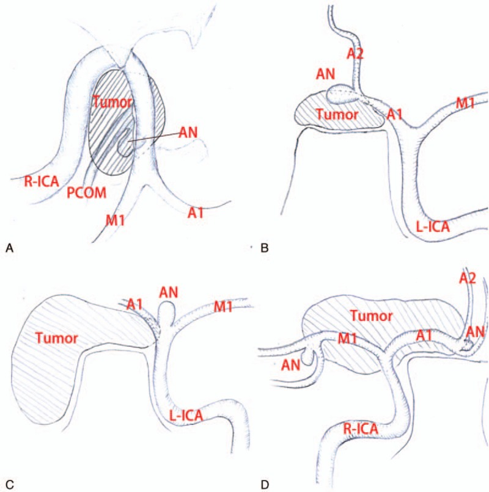
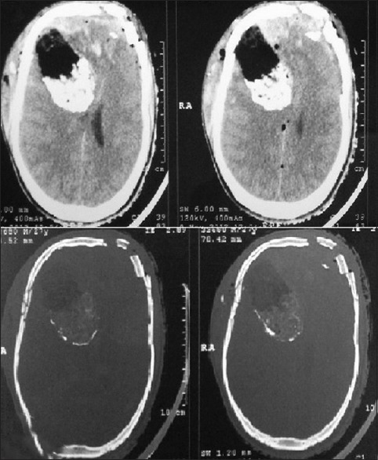
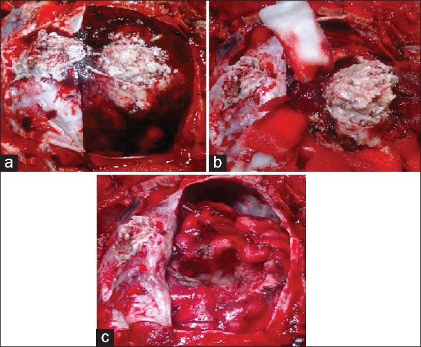
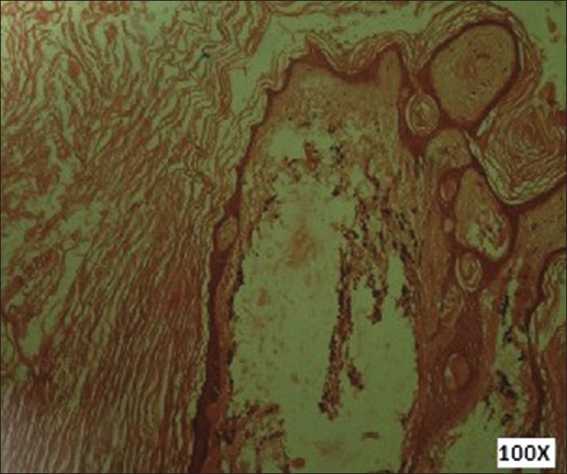
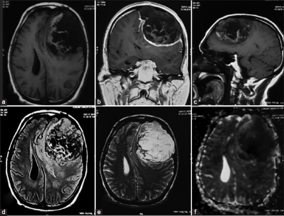
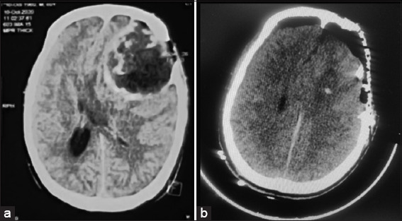
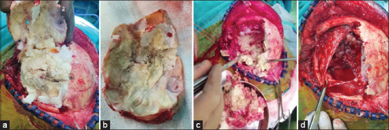
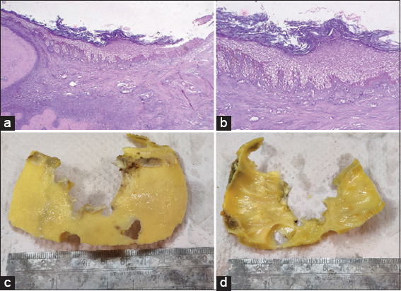

# Case Prep: Epidermoid Tumor Resection

<!-- BEGIN CASE SNAPSHOT -->

## Case / Approach Snapshot

- **Anatomy at risk:** tumor compartment, arterial supply, venous drainage/sinuses, cranial nerves, white-matter tracts, pituitary/CSF pathways when relevant, and functional cortex.
- **Operative steps:** review imaging and goals, choose exposure, obtain brain relaxation, devascularize when possible, debulk internally, dissect capsule from critical structures, verify extent/safety, and reconstruct watertight closure; use the detailed operative sequence and approach notes below as the step-by-step source.
- **Rescue plans:** venous or arterial injury, swelling, seizure, cranial nerve or endocrine change, CSF leak, residual tumor left for safety, staged surgery, radiation, or adjuvant therapy.
- **Figures:** review [Figures, Imaging & Video](#figures-imaging--video) and the [Curated Image Set](#curated-image-set); embedded local figures should remain open-access, public-domain, or otherwise reusable with attribution.
- **Papers:** review [High-Yield Literature](#high-yield-literature) for seminal sources, modern reviews, and outcome data specific to this page.

<!-- END CASE SNAPSHOT -->

## One-Liner
[Age]yo [M/F] with a [CPA / parasellar / fourth ventricular] epidermoid cyst presenting with [trigeminal neuralgia / hearing loss / headache / cranial neuropathy] planned for [retrosigmoid / appropriate] craniotomy for resection.

---

## Figures, Imaging & Video

**🎥 Operative video** — [search operative video on YouTube ▸](https://www.youtube.com/results?search_query=intracranial+epidermoid+cyst+surgery) · [The Neurosurgical Atlas ▸](https://www.neurosurgicalatlas.com)

> 🧭 **Operative approach:** [Retrosigmoid craniotomy](../approaches/retrosigmoid-craniotomy.md) — detailed corridor setup, step-by-step technique & figures

[Neurosurgical Atlas](https://www.neurosurgicalatlas.com) · [Radiopaedia](https://radiopaedia.org/search?q=intracranial%20epidermoid%20cyst&scope=all) · [PubMed Central](https://www.ncbi.nlm.nih.gov/pmc/?term=intracranial+epidermoid+cyst) — operative figures © linked; see [media-sources.md](../../resources/media-sources.md)

---

<!-- BEGIN CURATED LITERATURE -->

## High-Yield Literature

- **Spinal Epidermoid Tumor: A Case Report** — Yunga Tigre J. Cureus 2023. [PubMed](https://pubmed.ncbi.nlm.nih.gov/37090333/)
- **Thoracic Intradural-Extramedullary Epidermoid Tumor: The Relevance for Resection of Classic Subarachnoid Space Microsurgical Anatomy in Modern Spinal Surgery. Technical Note and Review of the Literature** — Barbagallo GMV. World neurosurgery 2017. [PubMed](https://pubmed.ncbi.nlm.nih.gov/28843754/)
- **Removal of a thoracic intramedullary epidermoid tumor in a child** — Costanzo MD. Neurosurgical focus: Video 2023. [PubMed](https://pubmed.ncbi.nlm.nih.gov/37859944/)
- **Microsurgical Resection of the Epidermoid Tumor in the Cerebellopontine Angle** — Pojskić M. Journal of neurological surgery. Part B, Skull base 2019. [PubMed](https://pubmed.ncbi.nlm.nih.gov/31143616/)
- **Optimal Surgical Resection of Intracranial Epidermoid Tumor: A Tailored Approach** — Javadi SA. Asian journal of neurosurgery 2021. [PubMed](https://pubmed.ncbi.nlm.nih.gov/34660352/)
- **Management of intracranial epidermoid tumor** — Joob B. Asian journal of neurosurgery 2017. [PubMed](https://pubmed.ncbi.nlm.nih.gov/28484571/)
- **Malignant squamous degeneration of a cerebellopontine angle epidermoid tumor. Case report** — Link MJ. Journal of neurosurgery 2002. [PubMed](https://pubmed.ncbi.nlm.nih.gov/12450053/)
- **Intraspinal epidermoid tumor of the cauda equina region: seven cases and a review of the literature** — Morita M. Journal of spinal disorders & techniques 2012. [PubMed](https://pubmed.ncbi.nlm.nih.gov/21602727/)
- **Intracerebral epidermoid tumor: a case report and review of the literature** — Iaconetta G. Surgical neurology 2001. [PubMed](https://pubmed.ncbi.nlm.nih.gov/11358593/)
- **Coexistence of intracranial epidermoid tumor and multiple cerebral aneurysms: A case report and literature review** — Yao PS. Medicine 2017. [PubMed](https://pubmed.ncbi.nlm.nih.gov/28151901/)

<!-- END CURATED LITERATURE -->

<!-- BEGIN CURATED IMAGE SET -->

## Curated Image Set

Open-access figures are embedded from PubMed Central articles and kept unique to this guide.

*Figure 1. Brain CT and MRI examinations showed a hypointense lesion in the right parasellar and petrous apex region (A–F). DSA and 3D-DSA images demonstrated an right saccular aneurysm (arrow)... Source: [Coexistence of intracranial epidermoid tumor and multiple cerebral aneurysms](https://pmc.ncbi.nlm.nih.gov/articles/PMC5293464/) — Medicine 2017; CC BY-ND.*

*Figure 2. Source: [Coexistence of intracranial epidermoid tumor and multiple cerebral aneurysms: A case report and literature review](https://pmc.ncbi.nlm.nih.gov/articles/PMC5293464/) — Medicine (Baltimore). 2017 Feb 3;96(5):e6012. doi: 10.1097/MD.0000000000006012; CC BY-ND.*

*Figure 2. (A) Illustration demonstrating the relative position between the epidermoid tumor and the aneurysm in CT image from the paper “Sakaki S, Matsuo Y, Kuwabara H, et al. Rupture of an... Source: [Coexistence of intracranial epidermoid tumor and multiple cerebral aneurysms](https://pmc.ncbi.nlm.nih.gov/articles/PMC5293464/) — Medicine 2017; CC BY-ND.*

*Figure 1. Noncontrast computed tomography head showing bifrontal comminuted depressed fracture with underlying extradural hematoma and subdural hematoma (L>R), multiple tiny contusions and... Source: [Incidental frontal lobe mixed density epidermoid tumor in a patient of head injury: A rare case report](https://pmc.ncbi.nlm.nih.gov/articles/PMC4558818/) — Asian Journal of Neurosurgery 2015; CC BY-NC-SA.*

*Figure 2. (a) Perioperative picture after durotomy showing right frontal epidermoid tumor which was adhered to overlying dura. (b) Tumor was dissected out of surrounding brain parenchyma. (c)... Source: [Incidental frontal lobe mixed density epidermoid tumor in a patient of head injury: A rare case report](https://pmc.ncbi.nlm.nih.gov/articles/PMC4558818/) — Asian Journal of Neurosurgery 2015; CC BY-NC-SA.*

*Figure 3. Photomicrograph showing epidermoid cyst lined by keratinized stratified squamous epithelium (H and E, ×100) Source: [Incidental frontal lobe mixed density epidermoid tumor in a patient of head injury: A rare case report](https://pmc.ncbi.nlm.nih.gov/articles/PMC4558818/) — Asian Journal of Neurosurgery 2015; CC BY-NC-SA.*

*Figure 1. Pre-operative magnetic resonance imaging Axial T1W image showing hypointense extra axial lesion with mass effect on the underlying parenchyma in the left frontal region (a). Coronal T1W... Source: [An atypical case of giant intradiploic epidermoid tumor](https://pmc.ncbi.nlm.nih.gov/articles/PMC9441647/) — International Journal of Health Sciences 2022; CC BY-NC-SA.*

*Figure 2. NCCT demonstrates a mixed density lesion in the left frontal region causing compression of the underlying parenchyma (a). Post-operative NCCT brain illustrated no residual tumor and... Source: [An atypical case of giant intradiploic epidermoid tumor](https://pmc.ncbi.nlm.nih.gov/articles/PMC9441647/) — International Journal of Health Sciences 2022; CC BY-NC-SA.*

*Figure 3. Intraoperative findings-epidermoid with thin capsule, invading the bone (a). Skull bone with areas of erosion (b). Pearly white epidermoid tumor being excised (c). Total excision of the... Source: [An atypical case of giant intradiploic epidermoid tumor](https://pmc.ncbi.nlm.nih.gov/articles/PMC9441647/) — International Journal of Health Sciences 2022; CC BY-NC-SA.*

*Figure 4. H and E section ×10 magnification (a) and ×40 magnification (b) showing epidermoid inclusion cyst lined by stratified squamous epithelium and cyst is filled with keratin flakes. (c and... Source: [An atypical case of giant intradiploic epidermoid tumor](https://pmc.ncbi.nlm.nih.gov/articles/PMC9441647/) — International Journal of Health Sciences 2022; CC BY-NC-SA.*

<!-- END CURATED IMAGE SET -->

---

## History of Present Illness
- Chief complaint: Insidious cranial neuropathy, trigeminal neuralgia (CPA), hearing loss, headache, ataxia
- Slow-growing, encases vessels/nerves, insinuates into cisterns ("pearly tumor")
- Aseptic/chemical meningitis risk from cyst contents

---

## Imaging Review
### MRI (T1, T2, FLAIR, **DWI**)
- **DWI restriction** — hallmark (distinguishes from arachnoid cyst, which does not restrict)
- FLAIR heterogeneous; T1 hypointense, T2 hyperintense, **non-enhancing** (CSF-like but DWI bright)
- Encasement of cranial nerves and vessels (basilar, ICA, perforators), extension along cisterns
- Insinuation into multiple compartments

### CT
- Low density (CSF-like), may have calcification

---

## Labs
- CBC, BMP, Coags, Type and screen

---

## Neurological Examination
- Full CN exam (V, VII, VIII commonly), cerebellar, gait

---

## Surgical Planning

### Case Logistics, OR Needs & Orders
- **OR setup:** Mayfield, navigation, microscope/endoscope, cranial nerve monitoring/BAER when relevant, EVD/CSF diversion plan, watertight closure and fat/fascia graft materials, and blood available for vascular tumors.
- **Special needs:** arterial line, Foley, dexamethasone for edema, antiemetic plan, lower-CN airway/swallow contingency, EVD/ETV plan for hydrocephalus, and audiology/facial-nerve baseline when relevant.
- **Immediate postop orders:** ICU neuro checks, CN/eye movement/facial/swallow/voice exams, HOB 30, CT for hemorrhage/hydrocephalus, MRI for EOR, CSF-leak/pseudomeningocele watch, dex taper, and early swallow/ENT consult when lower CN risk exists.

### Diagnosis & Indication
- Indication: Symptomatic mass effect/cranial neuropathy
- Goals: Maximal safe resection of cyst contents + capsule **where safely separable**; capsule densely adherent to nerves/vessels/brainstem is often **left behind** (subtotal) to avoid injury — accept slow recurrence over deficit

### Position & Approach
- Per location: CPA → retrosigmoid (lateral/park bench); also middle fossa, subtemporal, supracerebellar depending on extent
- Mayfield

### Key Surgical Steps
1. Craniotomy and dural opening per approach
2. Identify pearly, flaky cyst contents
3. **Internal decompression** — evacuate keratinaceous debris (gentle suction, dissectors)
4. Follow tumor through cisterns, debulking around encased nerves/vessels
5. **Capsule dissection** — peel from arachnoid plane where separable; **leave adherent capsule on nerves/vessels/brainstem**
6. **Copious irrigation** — remove all debris from cisterns/subarachnoid space (reduces chemical meningitis); consider hydrocortisone in irrigation
7. Avoid spilling contents widely; protect adjacent cisterns with cottonoids
8. Watertight closure

### Critical Anatomy & Structures at Risk
1. **Cranial nerves** (V, VII, VIII, lower CNs) — encased; preserve, leave adherent capsule
2. **Vessels** (basilar, AICA, PICA, ICA, perforators) — encased
3. **Brainstem** — adherent capsule
4. Subarachnoid spread of contents → chemical meningitis

### Equipment
- Microscope, navigation, micro-dissectors, CN stimulator
- Copious irrigation, hydrocortisone (irrigation), hemostatic agents, dural substitute

### Monitoring
- BAER, CN EMG (VII, V, lower CNs), SSEPs

### Anesthesia
- Standard posterior fossa; antiemetics; steroids (chemical meningitis prophylaxis)

### Potential Complications
1. **Aseptic (chemical) meningitis** — from spilled keratin debris; copious irrigation + steroids reduce risk
2. Cranial nerve deficit
3. Residual/recurrence (subtotal for safety) — slow; reoperate later if symptomatic
4. CSF leak, hydrocephalus

---

## Operative Note Template
**Preoperative Diagnosis:** [CPA / parasellar / fourth-ventricular] epidermoid cyst

**Postoperative Diagnosis:** Same

**Procedure:** [Left/Right retrosigmoid] craniotomy for resection of epidermoid cyst

**Surgeon / Assistant:**
**Anesthesia:** General endotracheal
**EBL / Fluids:**
**Adjuncts:** Microscope, neuronavigation, CN stimulator, BAER/CN EMG; copious irrigation [+ hydrocortisone]
**Implants:** Dural substitute, sealant
**Complications:** None

**Indications:** [Age]yo [M/F] with a [CPA] epidermoid cyst (DWI-restricting, non-enhancing) causing [trigeminal neuralgia/hearing loss/cranial neuropathy]. Risks discussed, including subtotal resection of adherent capsule and chemical meningitis.

**Description of Procedure:** After consent and time-out, general anesthesia was induced and neuromonitoring established. The head was fixed in Mayfield and the patient positioned [lateral/park bench]. A [retrosigmoid] craniotomy was performed and the dura opened with CSF egress.

Under the microscope, the characteristic pearly, flaky keratinaceous contents were identified and internally decompressed with gentle suction and dissectors, following the tumor through the cisterns around the encased cranial nerves and vessels. The capsule was dissected and removed where it separated cleanly in the arachnoid plane; **capsule densely adherent to cranial nerves, vessels, or brainstem was deliberately left in place** to avoid injury. The surrounding cisterns were protected with cottonoids and the field was irrigated copiously [with hydrocortisone-containing solution] to remove all debris and reduce the risk of chemical meningitis.

A watertight dural closure was performed [with fat graft for air cells], the bone replaced, and the wound closed in layers. The patient was transferred to the [ICU/step-down] in stable condition.

---

## Postoperative Plan
- ICU/step-down, neuro checks q1h, CN/posterior fossa precautions
- **Monitor for chemical meningitis** (fever, meningismus — LP if needed to exclude bacterial); steroids
- CT/MRI postop (DWI for residual)
- Antiemetics, DVT prophylaxis
- Long-term surveillance MRI (slow recurrence of residual)

<!-- BEGIN CHIEF LEVEL TAKEAWAYS -->

## Chief-Level Case Review

Use these as the senior-level mental model for **Epidermoid Tumor Resection**:

- **Decision point:** Decide the real endpoint before opening: cure, cytoreduction, diagnosis, decompression, separation from critical structures, or safe maximal resection.
- **Technical lever:** Map what must be left behind: perforators, cranial nerves, venous sinuses, eloquent cortex/tracts, hypothalamus/pituitary axis, and adherent capsule planes.
- **Bailout:** Sequence matters: devascularize early when safe, create CSF/working space, debulk before traction, and preserve the arachnoid plane unless oncologic goals justify violating it.
- **Postop watch:** The postop plan should match the risk structure: endocrine/vision/swallow/CN checks, steroid taper, seizure plan, MRI timing, CSF-leak watch, and adjuvant-treatment handoff.

<!-- END CHIEF LEVEL TAKEAWAYS -->

<!-- BEGIN COMMON PIMP QUESTIONS -->

## Common Pimp Questions

Use these to pressure-test preparation for **Epidermoid Tumor Resection**:

1. What is the surgical goal: gross-total, maximal safe, decompression, diagnosis, or cytoreduction?
2. What eloquent cortex, tract, cranial nerve, vessel, or sinus defines the stopping point?
3. What adjunct changes the case: navigation, mapping, 5-ALA, ultrasound, endoscope, ICG, or neuromonitoring?
4. What is the edema, steroid, seizure, DVT, and postop imaging plan?
5. What complication would you check for first in PACU based on this lesion location?

<!-- END COMMON PIMP QUESTIONS -->

<!-- BEGIN ATTENDING PREFERENCE VARIABLES -->

## Attending Preference Variables

Items that commonly vary by surgeon or institution:

- **Extent-of-resection goal and functional stopping points:** [attending-specific]
- **Mapping/monitoring, 5-ALA, ultrasound, ICG, endoscope, or tractography preferences:** [attending-specific]
- **Steroid, antiepileptic, mannitol/hypertonic saline, and antibiotic plan:** [attending-specific]
- **Postop MRI timing, ICU/floor threshold, and adjuvant-referral workflow:** [attending-specific]

<!-- END ATTENDING PREFERENCE VARIABLES -->
