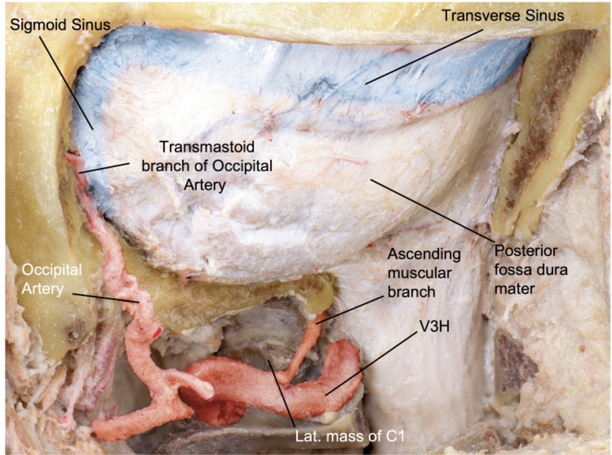

# Case Prep: Foramen Magnum Meningioma — Far Lateral Approach

---

## One-Liner
[Age]yo [M/F] with a [ventral/ventrolateral] foramen magnum meningioma planned for [left/right] far lateral (± transcondylar) approach for microsurgical resection.

---

## Figures, Imaging & Video
[Neurosurgical Atlas](https://www.neurosurgicalatlas.com) · [Radiopaedia](https://radiopaedia.org/search?q=foramen%20magnum%20meningioma&scope=all) · [PubMed Central](https://www.ncbi.nlm.nih.gov/pmc/?term=foramen+magnum+meningioma+far+lateral) — operative figures © linked; see [media-sources.md](../../resources/media-sources.md)

*Gray's Anatomy (1918), public domain — via Wikimedia Commons.*

*Payman A, et al. Cureus 2022;14(11):e31257 — CC BY 4.0.*

**▶ Full corridor technique:** see the [**Far-lateral (transcondylar) approach chapter**](../approaches/far-lateral-craniotomy.md) — positioning, suboccipital-triangle VA control, condyle/jugular-tubercle drilling limits, dural opening, and intradural lower-CN microsurgery, step by step.

---

## History of Present Illness
- Chief complaint: Insidious **suboccipital/cervical pain**, gait ataxia, lower extremity weakness, hand clumsiness/intrinsic atrophy (cruciate paralysis), lower cranial nerve symptoms (dysphagia, hoarseness), sensory changes, downbeat nystagmus
- Often **long delay** to diagnosis (mimics cervical myelopathy/degenerative disease)
- Ventral/ventrolateral location determines the far-lateral need

---

## Imaging Review
### MRI (T1±Gad, T2, CISS) + MRA/MRV
- Tumor location relative to brainstem/cord (ventral, ventrolateral), **dural base**, brainstem/cord compression and displacement
- **Vertebral artery (VA) relationship** — encasement, course (dural entry); **PICA origin**
- Lower cranial nerves, craniocervical junction
### CT / CTA
- **Condyle and bony anatomy** (extent of condylar drilling needed; condyle integrity → stability), VA bony course (foramen transversarium/sulcus arteriosus), jugular tubercle

---

## Labs
- [ ] CBC, BMP, Coags, type and crossmatch

---

## Neurological Examination
- Lower cranial nerves (IX-XII — swallow, palate, voice, tongue, SCM/trapezius), long tracts, cerebellar, gait, respiratory; document baseline

---

## Surgical Planning

### Approach Rationale
- **Far lateral** provides a lateral-to-ventral trajectory to the ventral foramen magnum/craniocervical junction, minimizing brainstem/cord retraction (the key advantage over a midline suboccipital approach for ventral lesions)
- **Transcondylar extension** (drilling part of the occipital condyle) increases ventral exposure — balance exposure vs craniocervical stability (excess condyle removal → instability → may need occipitocervical fusion)
- **▶ See the [far-lateral (transcondylar) approach chapter](../approaches/far-lateral-craniotomy.md)** for granular corridor technique — exact head positioning, VA identification in the suboccipital triangle, the retro-/trans-/supra-/paracondylar ladder, the hypoglossal-canal drilling limit, and lower-CN microsurgery

### Position
- **Park bench (lateral)** or modified prone/sitting; Mayfield; head flexed, rotated, and laterally flexed to open the craniovertebral angle; mastoid up; IONM baseline

### Key Surgical Steps
1. Curvilinear/hockey-stick or inverted-U suboccipital incision; expose suboccipital region, C1 (and C2 as needed), and the **suboccipital triangle**
2. **Identify and protect the vertebral artery** in the suboccipital triangle (V3 segment, in the sulcus arteriosus on C1) — control before bony work
3. **Lateral suboccipital craniotomy/craniectomy** + **C1 hemilaminectomy** (± C2); remove the posterolateral foramen magnum rim
4. **Transcondylar drilling** (as needed) — drill the posteromedial occipital condyle and jugular tubercle to gain ventral access (preserve enough condyle for stability when possible); may need to mobilize the VA
5. Open dura (curvilinear, based on the VA dural entry — protect VA), tack up
6. **Identify lower cranial nerves (IX-XII), VA, PICA, brainstem/cord** before tumor work
7. **Devascularize the dural base**, internal debulking (CUSA), then dissect the capsule off the brainstem/cord in the arachnoid plane; **preserve perforators, VA, PICA, and lower CNs**
8. Accept residual on the brainstem/VA if no safe plane (function over completeness)
9. Resect/coagulate involved dura; **watertight dural closure** (graft + sealant), fat graft for air cells
10. ± **Occipitocervical fusion** if condylar resection destabilized the CCJ
11. Closure

### Critical Anatomy & Structures at Risk
1. **Vertebral artery (V3/V4) and PICA** — identify/protect early; injury catastrophic
2. **Lower cranial nerves (IX, X, XI, XII)** — swallowing, airway, voice
3. **Brainstem (medulla) / cervicomedullary junction and perforators** — pial invasion
4. **Occipital condyle / CCJ stability** (transcondylar — fusion if over-resected)
5. Dura (CSF leak — high in posterior fossa/CCJ)

### Equipment
- [ ] Microscope, navigation, **high-speed drill (condyle/tubercle)**, CUSA, ICG
- [ ] CN stimulator, fat graft, dural substitute, sealant, occipitocervical fixation set (standby)

### Monitoring
- [ ] **SSEPs, MEPs, lower CN EMG (IX-XII), BAER**

### Anesthesia
- [ ] Arterial line, crossmatched blood, MAP support, VAE precautions (if sitting), antiemetics; **lower CN at risk → airway/aspiration planning**

### Potential Complications
1. **Lower cranial nerve deficits** (dysphagia/aspiration, hoarseness, tongue) — swallow eval before PO
2. **VA/PICA injury**, brainstem injury, perforator stroke
3. **CSF leak/pseudomeningocele**, craniocervical instability (transcondylar), hydrocephalus
4. Subtotal resection/recurrence (accept for function)

---

## Operative Note Template
**Preoperative Diagnosis:** [Ventral/ventrolateral] foramen magnum meningioma with [cervicomedullary compression]

**Postoperative Diagnosis:** Same

**Procedure:** [Left/Right] far lateral (transcondylar) approach for resection of foramen magnum meningioma [± occipitocervical fusion]

**Surgeon / Assistant:**
**Anesthesia:** General endotracheal
**EBL / Fluids / Blood products:** [crossmatched]
**Adjuncts:** Neuronavigation, high-speed drill, CUSA, ICG, CN stimulator; SSEP/MEP/lower-CN EMG/BAER
**Implants:** Dural substitute, fat graft, sealant; [occipitocervical fixation if performed]
**Complications:** None

**Indications:** [Age]yo [M/F] with a ventral/ventrolateral foramen magnum meningioma causing [myelopathy/lower cranial neuropathy]. A far-lateral approach was chosen to reach the ventral lesion without cord/brainstem retraction. Risks (lower CN deficits, VA/PICA injury, CSF leak, CCJ instability) discussed.

**Description of Procedure:** After consent and time-out, general anesthesia was induced and neuromonitoring established. The head was fixed in Mayfield and the patient positioned [park-bench]. A [hockey-stick] suboccipital incision was made, and **the vertebral artery (V3) was identified and protected in the suboccipital triangle before bony work**. A lateral suboccipital craniotomy with C1 hemilaminectomy was performed, and the posteromedial occipital condyle [and jugular tubercle] drilled as needed for ventral access while preserving condylar stability.

The dura was opened along the VA entry and tacked up. The lower cranial nerves, VA, PICA, and brainstem were identified. The dural base was devascularized, the tumor internally debulked (CUSA), and the capsule dissected off the brainstem/cord in the arachnoid plane, **preserving perforators, the VA, PICA, and the lower cranial nerves**; adherent residual was left where no safe plane existed. The involved dura was addressed and a watertight closure performed with a graft, fat for air cells, and sealant. [Occipitocervical fusion was performed for condylar instability.]

The patient was transferred to the ICU with lower-CN/posterior-fossa precautions.

---

## Postoperative Plan
- [ ] ICU, neuro checks q1h, **lower CN/posterior fossa precautions** (airway, swallow, respiratory)
- [ ] **Swallow evaluation before PO** (CN IX/X), aspiration precautions; voice assessment
- [ ] CT 6h, MRI postop; CSF leak/pseudomeningocele watch
- [ ] Antiemetics, DVT prophylaxis; assess CCJ stability (if transcondylar)
- [ ] Residual → radiosurgery/surveillance; rehab; follow-up
