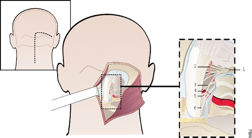
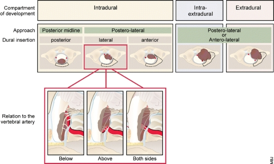
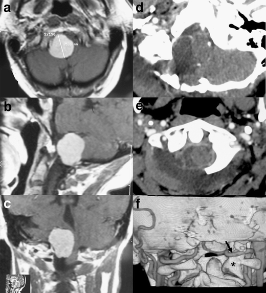
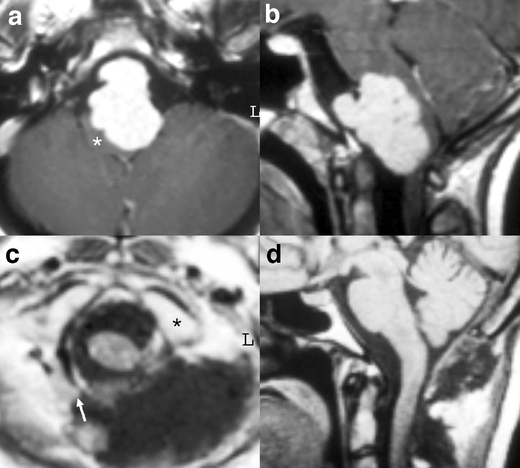
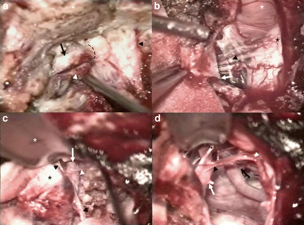
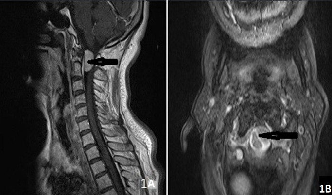
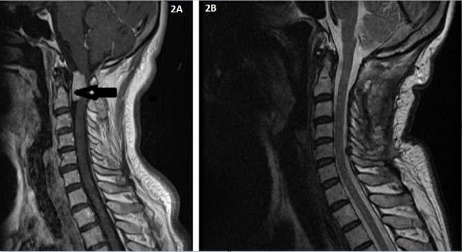
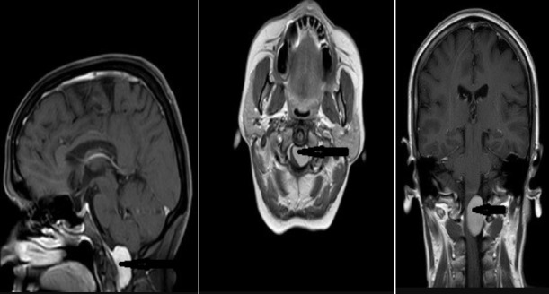
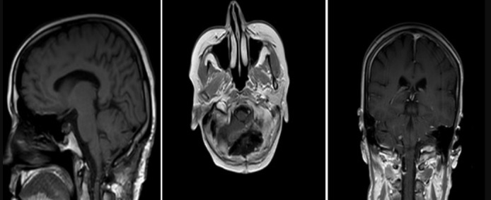
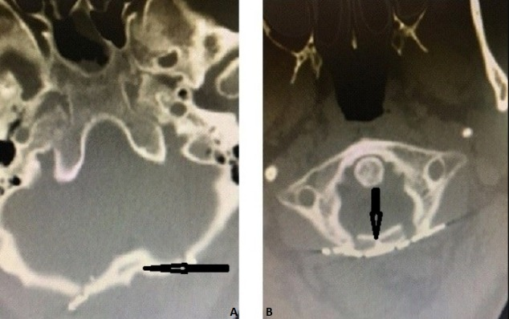

# Case Prep: Foramen Magnum Meningioma — Far Lateral Approach

---

<!-- BEGIN CASE SNAPSHOT -->

## Case / Approach Snapshot

- **Anatomy at risk:** tumor compartment, arterial supply, venous drainage/sinuses, cranial nerves, white-matter tracts, pituitary/CSF pathways when relevant, and functional cortex.
- **Operative steps:** review imaging and goals, choose exposure, obtain brain relaxation, devascularize when possible, debulk internally, dissect capsule from critical structures, verify extent/safety, and reconstruct watertight closure; use the detailed operative sequence and approach notes below as the step-by-step source.
- **Rescue plans:** venous or arterial injury, swelling, seizure, cranial nerve or endocrine change, CSF leak, residual tumor left for safety, staged surgery, radiation, or adjuvant therapy.
- **Figures:** review [Figures, Imaging & Video](#figures-imaging--video) and the [Curated Image Set](#curated-image-set); embedded local figures should remain open-access, public-domain, or otherwise reusable with attribution.
- **Papers:** review [High-Yield Literature](#high-yield-literature) for seminal sources, modern reviews, and outcome data specific to this page.

<!-- END CASE SNAPSHOT -->

## One-Liner
[Age]yo [M/F] with a [ventral/ventrolateral] foramen magnum meningioma planned for [left/right] far lateral (± transcondylar) approach for microsurgical resection.

---

## Figures, Imaging & Video

**🎥 Operative video** — [search operative video on YouTube ▸](https://www.youtube.com/results?search_query=foramen+magnum+meningioma+surgery) · [The Neurosurgical Atlas ▸](https://www.neurosurgicalatlas.com)

> 🧭 **Operative approach:** [Far-lateral (transcondylar) craniotomy](../approaches/far-lateral-craniotomy.md) — detailed corridor setup, step-by-step technique & figures

[Neurosurgical Atlas](https://www.neurosurgicalatlas.com) · [Radiopaedia](https://radiopaedia.org/search?q=foramen%20magnum%20meningioma&scope=all) · [PubMed Central](https://www.ncbi.nlm.nih.gov/pmc/?term=foramen+magnum+meningioma+far+lateral) — operative figures © linked; see [media-sources.md](../../resources/media-sources.md)

**▶ Full corridor technique:** see the [**Far-lateral (transcondylar) approach chapter**](../approaches/far-lateral-craniotomy.md) — positioning, suboccipital-triangle VA control, condyle/jugular-tubercle drilling limits, dural opening, and intradural lower-CN microsurgery, step by step.

---

<!-- BEGIN CURATED LITERATURE -->

## High-Yield Literature

- **The far-lateral approach for foramen magnum meningiomas** — Flores BC. Neurosurgical focus 2013. [PubMed](https://pubmed.ncbi.nlm.nih.gov/24289120/)
- **Far Lateral Approach for Resection of a Foramen Magnum Meningioma: 3-Dimensional Surgical Video** — Campero A. Operative neurosurgery (Hagerstown, Md.) 2020. [PubMed](https://pubmed.ncbi.nlm.nih.gov/31173144/)
- **Far Lateral Transcondylar Transtubercular Approach for Microsurgical Resection of Foramen Magnum Meningioma: Operative Video and Technical Nuances** — Liu JK. Journal of neurological surgery. Part B, Skull base 2021. [PubMed](https://pubmed.ncbi.nlm.nih.gov/33717806/)
- **Surgical corridors to foramen magnum meningiomas: a mini-review** — Baldoncini M. Frontiers in neurology 2023. [PubMed](https://pubmed.ncbi.nlm.nih.gov/37528861/)
- **Key Aspects in Foramen Magnum Meningiomas: From Old Neuroanatomical Conceptions to Current Far Lateral Neurosurgical Intervention** — Leon-Ariza DS. World neurosurgery 2017. [PubMed](https://pubmed.ncbi.nlm.nih.gov/28712910/)
- **Extreme Lateral Approach to the Craniocervical Junction, Operative Technique and Approach Essentials: 2-Dimensional Operative Video** — Ber R. Operative neurosurgery (Hagerstown, Md.) 2023. [PubMed](https://pubmed.ncbi.nlm.nih.gov/37387583/)
- **The Vagoaccessory Triangle (VAT): The Arena of ELITE** — Liyadipita NM. Asian journal of neurosurgery 2025. [PubMed](https://pubmed.ncbi.nlm.nih.gov/40485798/)
- **Foramen Magnum Meningioma: Far Lateral Approach** — Vasquez C. Journal of neurological surgery. Part B, Skull base 2019. [PubMed](https://pubmed.ncbi.nlm.nih.gov/31750063/)
- **Far Lateral Craniotomy for Resection of Foramen Magnum Meningioma** — Wicks RT. Journal of neurological surgery. Part B, Skull base 2019. [PubMed](https://pubmed.ncbi.nlm.nih.gov/31750060/)
- **Foramen magnum meningiomas** — Bir SC. Handbook of clinical neurology 2020. [PubMed](https://pubmed.ncbi.nlm.nih.gov/32586488/)

<!-- END CURATED LITERATURE -->

---

<!-- BEGIN CURATED IMAGE SET -->

## Curated Image Set

Open-access figures are embedded from PubMed Central articles and kept unique to this guide.

*Fig. 1. Illustration of the foramen magnum anatomy through a postero-lateral approach. The skin incision (dotted line) extends on the midline just upper to the occipital protuberance and curves... Source: [Foramen magnum meningiomas: detailed surgical approaches and technical aspects at Lariboisière Hospital and review of the literature](https://pmc.ncbi.nlm.nih.gov/articles/PMC2077911/) — Neurosurgical Review 2007; open access.*

*Fig. 2. Classification of foramen magnum meningiomas. Foramen magnum meningiomas are classified according to their compartment of development, their dural insertion, and their relation to the... Source: [Foramen magnum meningiomas: detailed surgical approaches and technical aspects at Lariboisière Hospital and review of the literature](https://pmc.ncbi.nlm.nih.gov/articles/PMC2077911/) — Neurosurgical Review 2007; open access.*

*Fig. 3. a–c Preoperative MRI. A large lateral foramen magnum meningioma displaces the neuraxis. d, e Postoperative CT scan. The meningioma has been completely resected. The spinal cord has... Source: [Foramen magnum meningiomas: detailed surgical approaches and technical aspects at Lariboisière Hospital and review of the literature](https://pmc.ncbi.nlm.nih.gov/articles/PMC2077911/) — Neurosurgical Review 2007; open access.*

*Fig. 4. a, b Preoperative MRI. A large anterior foramen magnum meningioma severely compresses the neuraxis, which is reduced to a crescent (star). c, d Postoperative MR images confirm the... Source: [Foramen magnum meningiomas: detailed surgical approaches and technical aspects at Lariboisière Hospital and review of the literature](https://pmc.ncbi.nlm.nih.gov/articles/PMC2077911/) — Neurosurgical Review 2007; open access.*

*Fig. 5. Surgical steps during a postero-lateral approach. a The left vertebral artery V3 segment (black arrow) has been elevated from the lateral part of the C1 posterior arch (white arrowhead).... Source: [Foramen magnum meningiomas: detailed surgical approaches and technical aspects at Lariboisière Hospital and review of the literature](https://pmc.ncbi.nlm.nih.gov/articles/PMC2077911/) — Neurosurgical Review 2007; open access.*

*Figure 1. 62 years old female patient (A) pre-operative sagittal MRI, (B) pre-operative axial MRI. Black arrow indicates tumor Source: [Our surgical experience in foramen magnum meningiomas: clinical series of 11 cases](https://pmc.ncbi.nlm.nih.gov/articles/PMC6850739/) — The Pan African Medical Journal 2019; CC BY.*

*Figure 2. 68 years old female patient (A) pre-operative sagittal MRI, (B) post-operative sagittal MRI. Black arrow indicates tumor Source: [Our surgical experience in foramen magnum meningiomas: clinical series of 11 cases](https://pmc.ncbi.nlm.nih.gov/articles/PMC6850739/) — The Pan African Medical Journal 2019; CC BY.*

*Figure 3. 54 years old female patient pre-op MRI images and back arrow indicates tumor Source: [Our surgical experience in foramen magnum meningiomas: clinical series of 11 cases](https://pmc.ncbi.nlm.nih.gov/articles/PMC6850739/) — The Pan African Medical Journal 2019; CC BY.*

*Figure 4. 54 years old female patient post-op MRI images Source: [Our surgical experience in foramen magnum meningiomas: clinical series of 11 cases](https://pmc.ncbi.nlm.nih.gov/articles/PMC6850739/) — The Pan African Medical Journal 2019; CC BY.*

*Figure 5. Postoperative cervical axial ct ((A) postoperative the patient's bone removed by suboccipital craniotomy was repositioned with mini-plate and mini-screw and (B) C1 laminoplasty. Black... Source: [Our surgical experience in foramen magnum meningiomas: clinical series of 11 cases](https://pmc.ncbi.nlm.nih.gov/articles/PMC6850739/) — The Pan African Medical Journal 2019; CC BY.*

<!-- END CURATED IMAGE SET -->

---

## History of Present Illness
- Chief complaint: Insidious **suboccipital/cervical pain**, gait ataxia, lower extremity weakness, hand clumsiness/intrinsic atrophy (cruciate paralysis), lower cranial nerve symptoms (dysphagia, hoarseness), sensory changes, downbeat nystagmus
- Often **long delay** to diagnosis (mimics cervical myelopathy/degenerative disease)
- Ventral/ventrolateral location determines the far-lateral need

---

## Imaging Review
### MRI (T1±Gad, T2, CISS) + MRA/MRV
- Tumor location relative to brainstem/cord (ventral, ventrolateral), **dural base**, brainstem/cord compression and displacement
- **Vertebral artery (VA) relationship** — encasement, course (dural entry); **PICA origin**
- Lower cranial nerves, craniocervical junction
### CT / CTA
- **Condyle and bony anatomy** (extent of condylar drilling needed; condyle integrity → stability), VA bony course (foramen transversarium/sulcus arteriosus), jugular tubercle

---

## Labs
- CBC, BMP, Coags, type and crossmatch

---

## Neurological Examination
- Lower cranial nerves (IX-XII — swallow, palate, voice, tongue, SCM/trapezius), long tracts, cerebellar, gait, respiratory; document baseline

---

## Surgical Planning

### Approach Rationale
- **Far lateral** provides a lateral-to-ventral trajectory to the ventral foramen magnum/craniocervical junction, minimizing brainstem/cord retraction (the key advantage over a midline suboccipital approach for ventral lesions)
- **Transcondylar extension** (drilling part of the occipital condyle) increases ventral exposure — balance exposure vs craniocervical stability (excess condyle removal → instability → may need occipitocervical fusion)
- **▶ See the [far-lateral (transcondylar) approach chapter](../approaches/far-lateral-craniotomy.md)** for granular corridor technique — exact head positioning, VA identification in the suboccipital triangle, the retro-/trans-/supra-/paracondylar ladder, the hypoglossal-canal drilling limit, and lower-CN microsurgery

### Position
- **Park bench (lateral)** or modified prone/sitting; Mayfield; head flexed, rotated, and laterally flexed to open the craniovertebral angle; mastoid up; IONM baseline

### Key Surgical Steps
1. Curvilinear/hockey-stick or inverted-U suboccipital incision; expose suboccipital region, C1 (and C2 as needed), and the **suboccipital triangle**
2. **Identify and protect the vertebral artery** in the suboccipital triangle (V3 segment, in the sulcus arteriosus on C1) — control before bony work
3. **Lateral suboccipital craniotomy/craniectomy** + **C1 hemilaminectomy** (± C2); remove the posterolateral foramen magnum rim
4. **Transcondylar drilling** (as needed) — drill the posteromedial occipital condyle and jugular tubercle to gain ventral access (preserve enough condyle for stability when possible); may need to mobilize the VA
5. Open dura (curvilinear, based on the VA dural entry — protect VA), tack up
6. **Identify lower cranial nerves (IX-XII), VA, PICA, brainstem/cord** before tumor work
7. **Devascularize the dural base**, internal debulking (CUSA), then dissect the capsule off the brainstem/cord in the arachnoid plane; **preserve perforators, VA, PICA, and lower CNs**
8. Accept residual on the brainstem/VA if no safe plane (function over completeness)
9. Resect/coagulate involved dura; **watertight dural closure** (graft + sealant), fat graft for air cells
10. ± **Occipitocervical fusion** if condylar resection destabilized the CCJ
11. Closure

### Critical Anatomy & Structures at Risk
1. **Vertebral artery (V3/V4) and PICA** — identify/protect early; injury catastrophic
2. **Lower cranial nerves (IX, X, XI, XII)** — swallowing, airway, voice
3. **Brainstem (medulla) / cervicomedullary junction and perforators** — pial invasion
4. **Occipital condyle / CCJ stability** (transcondylar — fusion if over-resected)
5. Dura (CSF leak — high in posterior fossa/CCJ)

### Equipment
- Microscope, navigation, **high-speed drill (condyle/tubercle)**, CUSA, ICG
- CN stimulator, fat graft, dural substitute, sealant, occipitocervical fixation set (standby)

### Monitoring
- **SSEPs, MEPs, lower CN EMG (IX-XII), BAER**

### Anesthesia
- Arterial line, crossmatched blood, MAP support, VAE precautions (if sitting), antiemetics; **lower CN at risk → airway/aspiration planning**

### Potential Complications
1. **Lower cranial nerve deficits** (dysphagia/aspiration, hoarseness, tongue) — swallow eval before PO
2. **VA/PICA injury**, brainstem injury, perforator stroke
3. **CSF leak/pseudomeningocele**, craniocervical instability (transcondylar), hydrocephalus
4. Subtotal resection/recurrence (accept for function)

---

## Operative Note Template
**Preoperative Diagnosis:** [Ventral/ventrolateral] foramen magnum meningioma with [cervicomedullary compression]

**Postoperative Diagnosis:** Same

**Procedure:** [Left/Right] far lateral (transcondylar) approach for resection of foramen magnum meningioma [± occipitocervical fusion]

**Surgeon / Assistant:**
**Anesthesia:** General endotracheal
**EBL / Fluids / Blood products:** [crossmatched]
**Adjuncts:** Neuronavigation, high-speed drill, CUSA, ICG, CN stimulator; SSEP/MEP/lower-CN EMG/BAER
**Implants:** Dural substitute, fat graft, sealant; [occipitocervical fixation if performed]
**Complications:** None

**Indications:** [Age]yo [M/F] with a ventral/ventrolateral foramen magnum meningioma causing [myelopathy/lower cranial neuropathy]. A far-lateral approach was chosen to reach the ventral lesion without cord/brainstem retraction. Risks (lower CN deficits, VA/PICA injury, CSF leak, CCJ instability) discussed.

**Description of Procedure:** After consent and time-out, general anesthesia was induced and neuromonitoring established. The head was fixed in Mayfield and the patient positioned [park-bench]. A [hockey-stick] suboccipital incision was made, and **the vertebral artery (V3) was identified and protected in the suboccipital triangle before bony work**. A lateral suboccipital craniotomy with C1 hemilaminectomy was performed, and the posteromedial occipital condyle [and jugular tubercle] drilled as needed for ventral access while preserving condylar stability.

The dura was opened along the VA entry and tacked up. The lower cranial nerves, VA, PICA, and brainstem were identified. The dural base was devascularized, the tumor internally debulked (CUSA), and the capsule dissected off the brainstem/cord in the arachnoid plane, **preserving perforators, the VA, PICA, and the lower cranial nerves**; adherent residual was left where no safe plane existed. The involved dura was addressed and a watertight closure performed with a graft, fat for air cells, and sealant. [Occipitocervical fusion was performed for condylar instability.]

The patient was transferred to the ICU with lower-CN/posterior-fossa precautions.

---

## Postoperative Plan
- ICU, neuro checks q1h, **lower CN/posterior fossa precautions** (airway, swallow, respiratory)
- **Swallow evaluation before PO** (CN IX/X), aspiration precautions; voice assessment
- CT 6h, MRI postop; CSF leak/pseudomeningocele watch
- Antiemetics, DVT prophylaxis; assess CCJ stability (if transcondylar)
- Residual → radiosurgery/surveillance; rehab; follow-up
