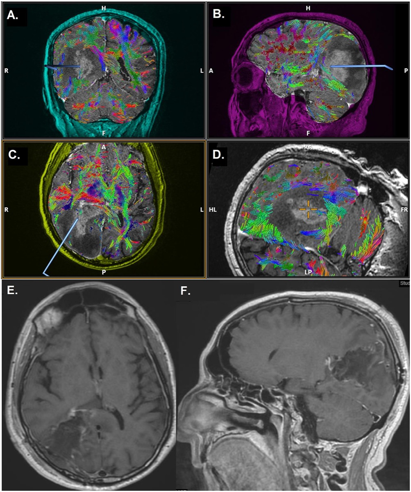
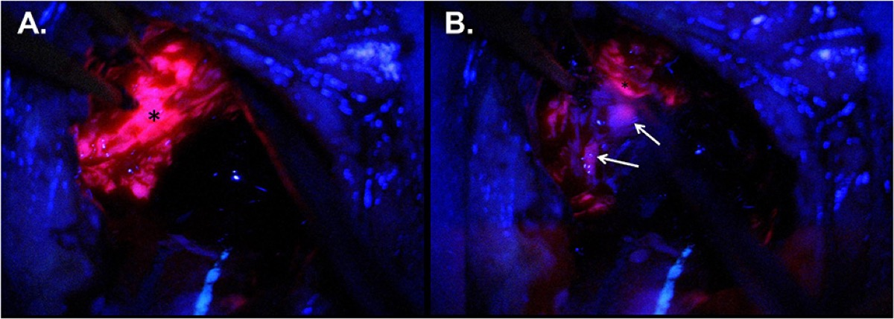

# Case Prep: Glioma Resection (Supratentorial)

---

## One-Liner
[Age]yo [M/F] with a [size] cm [left/right] [frontal/temporal/parietal/insular] [WHO grade II/III/IV] glioma presenting with [seizures/focal deficit/headaches/cognitive changes] planned for [awake/asleep] craniotomy for maximal safe resection.

---

## Figures, Imaging & Video

**🎥 Operative videos & resources**
- **Atlas / approach:** [Pterional craniotomy chapter](https://www.neurosurgicalatlas.com/volumes/cranial-approaches/pterional-craniotomy) for frontal/temporal/insular corridors; use approach-specific pages for midline, posterior fossa, or awake mapping cases
- **Video searches:** [glioma resection awake mapping on YouTube](https://www.youtube.com/results?search_query=glioma+resection+awake+mapping+operative+video) · [5-ALA glioma resection](https://www.youtube.com/results?search_query=5-ALA+glioma+resection+operative+video)
- **Open-access figures:** [PubMed Central — glioma resection awake mapping](https://www.ncbi.nlm.nih.gov/pmc/?term=glioma+resection+awake+mapping) · [Radiopaedia — high-grade glioma](https://radiopaedia.org/search?q=high%20grade%20glioma&scope=all)

**📑 Key evidence — landmark trials & guidelines**

- **Stupp protocol** — radiotherapy plus temozolomide for glioblastoma. [PubMed](https://pubmed.ncbi.nlm.nih.gov/?term=Stupp+radiotherapy+temozolomide+glioblastoma+2005)
- **5-ALA fluorescence** — randomized evidence for fluorescence-guided malignant glioma resection. [PubMed](https://pubmed.ncbi.nlm.nih.gov/?term=5-ALA+fluorescence+guided+surgery+malignant+glioma+randomized+trial)
- **EANO diffuse glioma guideline** — integrated molecular diagnosis and management. [PubMed](https://pubmed.ncbi.nlm.nih.gov/?term=EANO+guideline+diffuse+glioma+adult+2021)

> 🧭 **Operative approach:** [Pterional craniotomy](../approaches/pterional-craniotomy.md) — detailed corridor setup, step-by-step technique & figures

*Gray's Anatomy (1918), public domain — via Wikimedia Commons.*

*Preoperative MRI + DTI and postoperative gross-total-resection MRI. Source: Maragkos et al., Front Neurol 2021;12:644804, Fig 1. CC BY 4.0.*

*Intraoperative 5-ALA fluorescence guiding resection of tumor bulk and infiltrative margin. Source: Maragkos et al., Front Neurol 2021;12:644804, Fig 2. CC BY 4.0.*

---

## History of Present Illness
- Chief complaint: Seizures / progressive neurological deficit / headaches / cognitive changes / incidental
- Duration:
- Seizure type and frequency:
- Current AEDs and control:
- Functional status (KPS):
- Handedness (determines language dominance):
- Any prior biopsy or treatment:

---

## Past Medical History
- Prior brain tumor / prior resection
- Prior radiation
- Prior chemotherapy (temozolomide)
- Seizure medications
- Steroid use (current dexamethasone dose)
- Li-Fraumeni, NF1, NF2, tuberous sclerosis (predisposition syndromes)
- Allergies:
- Medications:

---

## Imaging Review
### MRI Brain (T1, T1+Gad, T2, FLAIR, DWI, ADC, SWI, perfusion)
- **Location:** [Lobe] — relationship to eloquent cortex
- **Size:** ___ x ___ x ___ cm
- **Enhancement:** (Grade IV: ring-enhancing with central necrosis; Grade II/III: non-enhancing or patchy)
- **FLAIR extent:** Infiltrative margin (FLAIR abnormality > enhancement = infiltrative glioma)
- **Necrosis / hemorrhage:** SWI for blood products
- **Edema / mass effect:**
- **Midline shift:**
- **Multifocal / crossing midline (butterfly glioma):**
- **Perfusion:** Elevated rCBV correlates with higher grade
- **Spectroscopy (MRS):** Elevated choline, decreased NAA
- **Differential:**
  - Grade IV (GBM): Ring enhancement, necrosis, restricted diffusion rim
  - Grade III (Anaplastic astrocytoma/oligodendroglioma): Patchy enhancement
  - Grade II (Low-grade glioma): Non-enhancing, T2/FLAIR bright, cortex-based

### fMRI (Functional MRI)
- **Motor mapping:** Hand, foot, tongue activation relative to tumor
- **Language mapping:** Broca and Wernicke activation (if dominant hemisphere)
- **Distance from tumor to activation:** < 1 cm = high risk

### DTI Tractography
- **Corticospinal tract:** Displaced / infiltrated / disrupted
- **Arcuate fasciculus:** (Language — dominant hemisphere)
- **Inferior frontal-occipital fasciculus (IFOF):** (Semantic processing)
- **Superior longitudinal fasciculus (SLF):**
- **Optic radiations:**
- **Relationship to tumor:** Displaced (resectable) vs infiltrated (partially resectable) vs disrupted (not recoverable)

### Navigation
- Thin-cut MRI with gadolinium loaded
- FLAIR sequence loaded (for non-enhancing tumor margin)
- DTI tractography overlaid
- fMRI data integrated

---

## Labs
- CBC
- BMP
- Coagulation
- Type and screen
- Dexamethasone level (if on steroids)

---

## Neurological Examination
### Mental Status
- KPS score:
- Language: Fluency, comprehension, repetition, naming, reading, writing
- Neglect (non-dominant parietal):
- Memory:
- Executive function:

### Motor
- Full motor exam including fine motor:
- Drift:

### Sensory
- Including cortical sensory modalities:

### Visual Fields
- Formal perimetry if occipital/temporal/parietal tumor:

### Baseline Documentation
- **CRITICAL:** Document every deficit carefully — this is the baseline against which postoperative function will be measured

---

## Surgical Planning

### Diagnosis & Indication
- Working diagnosis: [Suspected WHO Grade ___] glioma
- Surgical indication: Maximal safe resection improves overall survival (even for Grade IV GBM); tissue diagnosis needed for molecular profiling (IDH, 1p/19q, MGMT, TERT, ATRX)
- Goals: **Maximal safe resection** — remove as much enhancing (GBM) or FLAIR-abnormal (low-grade) tumor as safely possible while preserving neurological function
- EOR targets: For GBM: > 95% enhancing tumor; For LGG: maximum FLAIR resection

### Awake vs Asleep Decision
- **Awake craniotomy indications:**
  - Tumor in/near dominant hemisphere language areas
  - Tumor in/near motor cortex (supplementary motor area, primary motor)
  - Insular glioma
  - Any tumor where subcortical mapping will define resection margins
- **Asleep with monitoring:**
  - Non-dominant hemisphere, non-eloquent location
  - MEP/SSEP monitoring sufficient
  - Patient unable to cooperate with awake surgery

### Position
- **Patient position:** Based on tumor location:
  - Frontal: Supine, head rotated contralateral 20-40 degrees
  - Temporal: Supine, head rotated contralateral 60-90 degrees
  - Parietal: Supine or lateral, vertex turned toward floor
  - Occipital: Prone, lateral, or Concorde
  - Insular: Supine, head rotated 60-80 degrees contralateral (sylvian fissure approach)
- **Head position:** Tumor at highest point for gravity retraction
- **Skull clamp:** Mayfield 3-pin
- **Awake craniotomy:** Comfortable semi-reclined, face visible to neuropsych team

### Incision
- **Centered over tumor** using navigation-guided marking
- **For awake:** Include enough exposure for cortical and subcortical mapping
- **Type:** Curvilinear, extending 2-3 cm beyond tumor margins

### Approach
- **Direct convexity craniotomy** over the tumor
- **For insular tumors:** Pterional or extended sylvian approach — split sylvian fissure widely
- **Craniotomy size:** Generous — must see normal brain margin around tumor, and expose cortical mapping sites

### Key Surgical Steps
1. **Craniotomy** — navigation-confirmed over tumor with surrounding normal cortex exposed
2. **Dural opening** — curvilinear, reflect toward tumor
3. **Cortical mapping** (if awake):
   - Map motor cortex (direct cortical stimulation, 1-4 mA bipolar probe)
   - Map language sites (counting, naming, reading — watch for speech arrest, paraphasias)
   - Mark positive sites with sterile tags
4. **Identify tumor on cortical surface** — color change, consistency, navigation confirmation
5. **Corticotomy** — enter through non-eloquent cortex, through a sulcus when possible (transsulcal approach)
6. **Subcortical resection:**
   - Use CUSA and bipolar for tumor removal
   - Stay in the tumor — identify tumor-brain interface by color, consistency, and navigation
   - **5-ALA fluorescence:** Tumor glows pink/red under blue-violet light (for high-grade gliomas)
   - Ultrasound to confirm tumor boundaries and depth
7. **Subcortical mapping** (if awake):
   - Stimulate white matter tracts during resection
   - Motor response = near corticospinal tract (STOP)
   - Speech error = near arcuate fasciculus or IFOF (STOP)
   - Mapping defines the functional boundary of resection
8. **Progressive circumferential resection** — work around the tumor, deepening progressively
9. **Assess extent of resection:**
   - Navigation (note brain shift limitation)
   - Intraoperative ultrasound
   - 5-ALA fluorescence (any residual fluorescence?)
   - Intraoperative MRI (if available) — gold standard for EOR assessment
10. **Final hemostasis** — bipolar, Surgicel, Gelfoam
11. **Send specimens:** Multiple samples from different tumor regions; mark enhancing rim vs core vs margin

### Critical Anatomy & Structures at Risk
1. **Corticospinal tract** — mapped by MEPs and subcortical stimulation; DTI shows displacement
2. **Language networks** — Broca area, Wernicke area, arcuate fasciculus, IFOF, SLF
3. **Supplementary motor area (SMA)** — medial frontal; resection causes transient contralateral akinesia that typically recovers
4. **Pericallosal arteries** — medial tumors; branches supply motor cortex
5. **Middle cerebral artery branches** — lateral/insular tumors
6. **Lenticulostriate arteries** — deep/insular tumors; supply internal capsule
7. **Optic radiations** — temporal/parietal/occipital tumors (Meyer's loop in temporal lobe)
8. **Basal ganglia / internal capsule** — deep margin of many tumors

### Equipment & Instrumentation
- Operating microscope
- Stereotactic navigation (MRI + fMRI + DTI overlays)
- CUSA (Cavitron Ultrasonic Aspirator) — primary debulking tool
- Intraoperative ultrasound
- **5-ALA (Gleolan)** — patient takes 20 mg/kg PO 2-4 hours pre-op (for Grade III/IV); blue-violet light filter on microscope
- Bipolar (multiple tip sizes)
- Microsurgical instruments
- Cortical/subcortical stimulator (bipolar probe, 60 Hz, 1-4 mA)
- Mapping tags (sterile numbered markers)
- Hemostatic agents
- Specimen containers (labeled by tumor region)
- [Intraoperative MRI if available]

### Monitoring
- **Asleep:**
  - SSEPs (median + tibial)
  - MEPs (transcranial)
  - Phase reversal (to localize central sulcus)
  - ECoG (if seizure concern)
- **Awake:**
  - Direct cortical stimulation (Penfield technique or high-frequency stimulation)
  - Subcortical stimulation (during resection)
  - Continuous speech/motor testing by neuropsych/speech pathology team
  - ECoG (to detect afterdischarges from stimulation)

### Anesthesia Considerations
- **Asleep:**
  - Arterial line
  - Foley
  - Mannitol available
  - Dexamethasone 10 mg (typically already on steroids)
  - Levetiracetam 1000 mg IV
  - Cefazolin 2g
  - No paralytic (if MEP monitoring)
  - 5-ALA: Cover patient from direct light exposure; photosensitivity precautions x 24h post-op

- **Awake (asleep-awake-asleep or monitored anesthesia care):**
  - Propofol/remifentanil infusion for asleep phases
  - Scalp block (regional anesthesia of supraorbital, auriculotemporal, greater/lesser occipital nerves)
  - Dexmedetomidine during awake phase (light sedation without respiratory depression)
  - Anti-emetics (ondansetron — vomiting during awake surgery is dangerous)
  - Seizure protocol: cold saline irrigation if stimulation-induced seizure; low-dose propofol bolus if needed
  - Comfortable positioning is critical — padded, semi-reclined, face visible
  - Foley (patient will be awake for extended period)

### Potential Complications & Contingencies
1. **New neurological deficit** — if monitoring changes, stop resection at that boundary; SMA syndrome is typically transient
2. **Intraoperative seizure (awake)** — cold saline irrigation on cortex, propofol 20-50 mg IV; consider converting to asleep
3. **Hemorrhage** — meticulous bipolar hemostasis; consider that GBM neovasculature is fragile
4. **Brain swelling** — mannitol, hyperventilation, ensure venous drainage, additional CSF drainage
5. **Incomplete resection** — document planned residual if near eloquent structures; adjuvant therapy
6. **5-ALA false positive** — reactive gliosis and radiation changes can fluoresce; correlate with navigation

---

## Operative Note Template

**Preoperative Diagnosis:** [Left/Right] [location] glioma (suspected WHO Grade ___)

**Postoperative Diagnosis:** Same (pending final pathology and molecular profiling)

**Procedure:** [Left/Right] [location] craniotomy for [awake/asleep] maximal safe resection of glioma [with cortical/subcortical mapping] [with 5-ALA fluorescence guidance] [with intraoperative MRI]

[Include details specific to glioma surgery: 5-ALA findings, mapping results, functional boundaries identified, extent of resection assessment method, specimen labeling]

---

## Postoperative Plan
- ICU x 24 hours
- Neuro checks q1h x 24h — **compare to preoperative baseline**
- HOB 30 degrees
- **MRI brain with gadolinium within 24-48 hours** (MUST be within 48h before postoperative enhancement confounds interpretation)
- CT head immediately post-op (if any concern for hemorrhage)
- Dexamethasone taper (maintain therapeutic dose until edema stabilizes, then taper over 1-2 weeks)
- Continue AEDs (levetiracetam)
- DVT prophylaxis: SCDs, heparin SQ POD1
- 5-ALA precautions: Avoid direct sunlight/bright light x 24 hours (photosensitivity)
- Pain management: Acetaminophen-based
- Pathology and molecular markers:
  - WHO grade
  - IDH1/2 mutation status
  - 1p/19q codeletion (oligodendroglioma)
  - MGMT promoter methylation
  - TERT promoter mutation
  - ATRX loss
  - Ki-67 proliferative index
  - CDKN2A/B homozygous deletion (Grade 4 astrocytoma)
- Tumor board discussion with neuro-oncology, radiation oncology
- Adjuvant therapy:
  - GBM: Concurrent temozolomide + radiation (Stupp protocol) → adjuvant TMZ
  - Grade III: Radiation +/- chemotherapy depending on molecular profile
  - Grade II (IDH-mutant): Consider observation if GTR; RT + chemotherapy if subtotal or progressive
- Follow-up: Clinic 2 weeks; serial MRI q3-4 months
