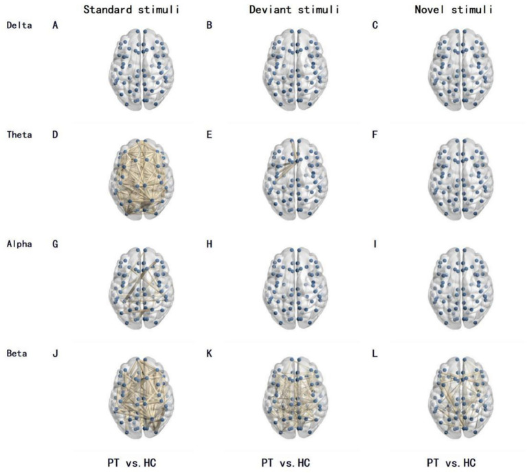
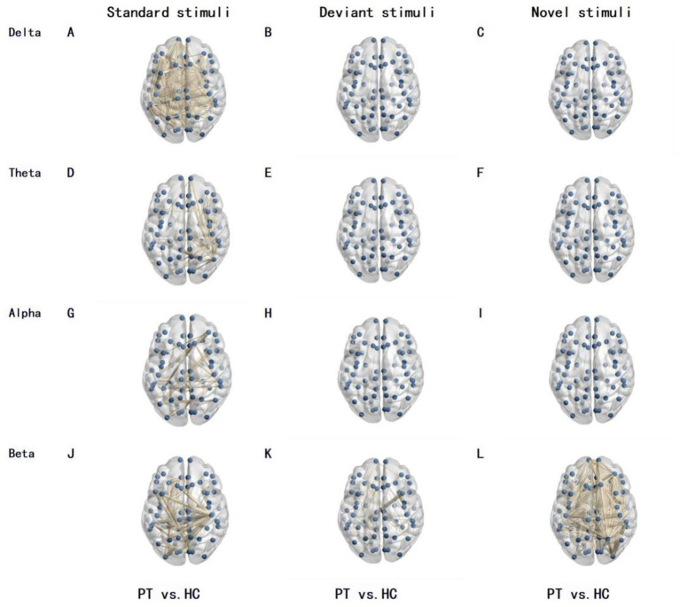
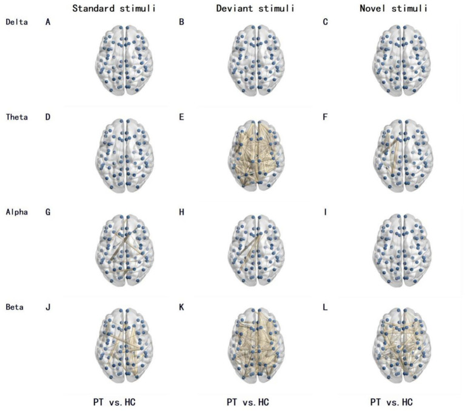
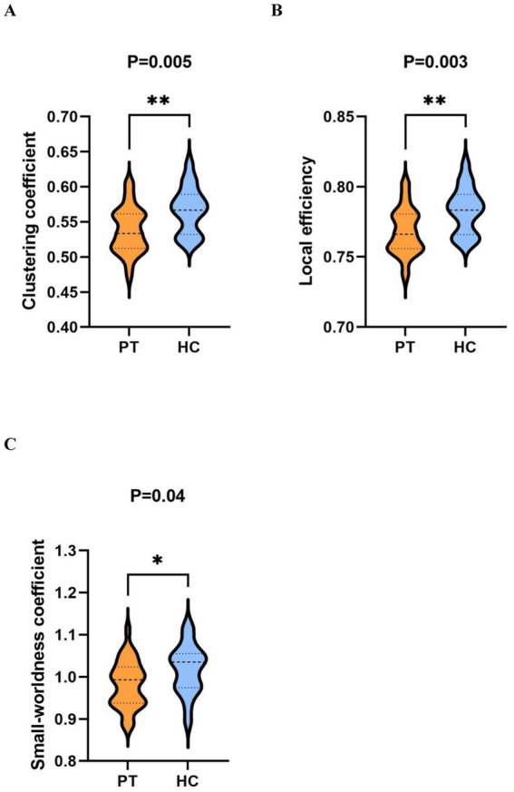
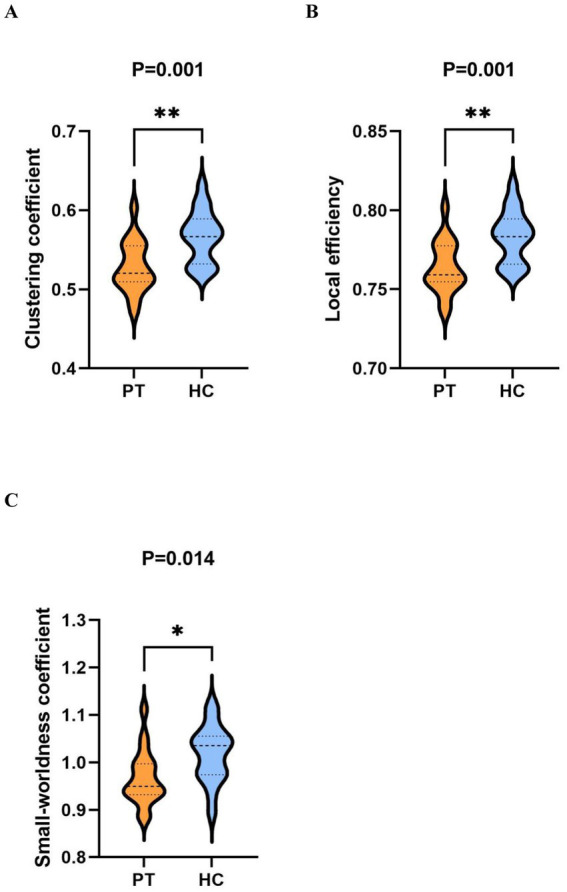
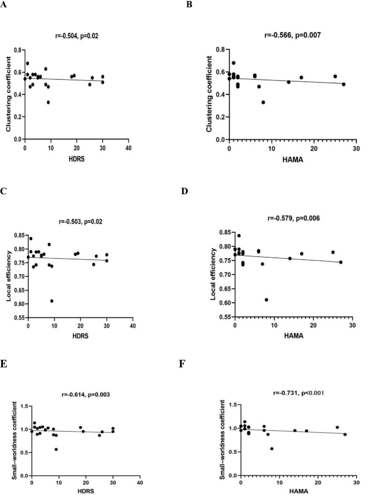
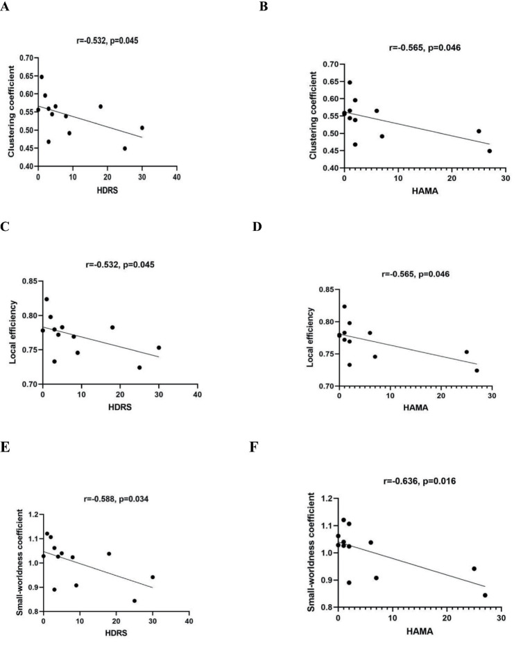
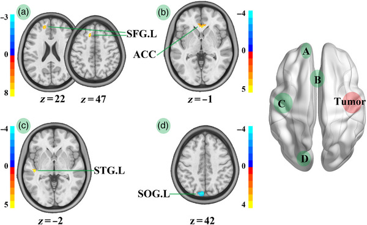
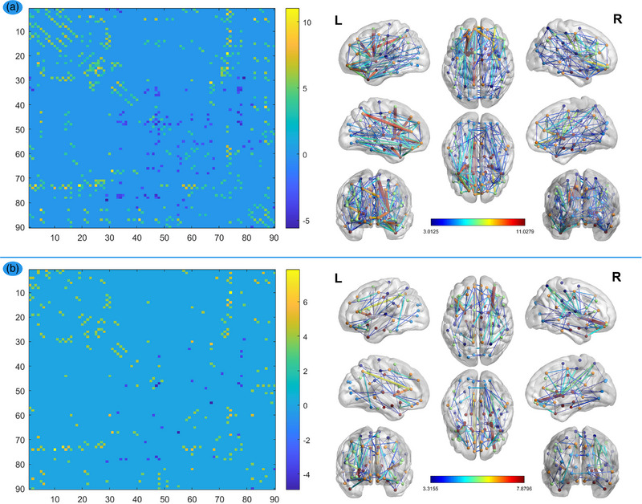
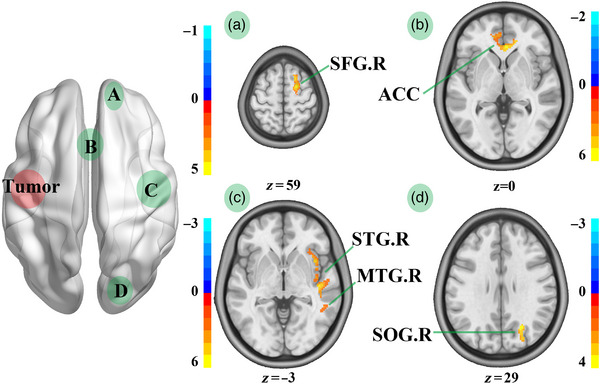

# Case Prep: Insular Glioma Resection

<!-- BEGIN CASE SNAPSHOT -->

## Case / Approach Snapshot

- **Anatomy at risk:** tumor compartment, arterial supply, venous drainage/sinuses, cranial nerves, white-matter tracts, pituitary/CSF pathways when relevant, and functional cortex.
- **Operative steps:** review imaging and goals, choose exposure, obtain brain relaxation, devascularize when possible, debulk internally, dissect capsule from critical structures, verify extent/safety, and reconstruct watertight closure; use the detailed operative sequence and approach notes below as the step-by-step source.
- **Rescue plans:** venous or arterial injury, swelling, seizure, cranial nerve or endocrine change, CSF leak, residual tumor left for safety, staged surgery, radiation, or adjuvant therapy.
- **Figures:** review [Figures, Imaging & Video](#figures-imaging--video) and the [Curated Image Set](#curated-image-set); embedded local figures should remain open-access, public-domain, or otherwise reusable with attribution.
- **Papers:** review [High-Yield Literature](#high-yield-literature) for seminal sources, modern reviews, and outcome data specific to this page.

<!-- END CASE SNAPSHOT -->

## One-Liner
[Age]yo [M/F] with a [left/right] insular glioma (Berger-Sanai zone [I-IV]) presenting with [seizures / speech or motor symptoms] planned for [awake] transsylvian/transcortical craniotomy for maximal safe resection.

---

## Figures, Imaging & Video

**🎥 Operative video** — [search operative video on YouTube ▸](https://www.youtube.com/results?search_query=insular+glioma+surgery) · [The Neurosurgical Atlas ▸](https://www.neurosurgicalatlas.com)

> 🧭 **Operative approach:** [Pterional craniotomy](../approaches/pterional-craniotomy.md) — detailed corridor setup, step-by-step technique & figures

[Neurosurgical Atlas](https://www.neurosurgicalatlas.com) · [Radiopaedia](https://radiopaedia.org/search?q=insular%20glioma&scope=all) · [PubMed Central](https://www.ncbi.nlm.nih.gov/pmc/?term=insular+glioma+resection) — operative figures © linked; see [media-sources.md](../../resources/media-sources.md)

---

<!-- BEGIN CURATED LITERATURE -->

## High-Yield Literature

- **Surgical strategy for insular glioma** — Przybylowski CJ. Journal of neuro-oncology 2021. [PubMed](https://pubmed.ncbi.nlm.nih.gov/33611715/)
- **Insular glioma surgery: an evolution of thought and practice** — Hervey-Jumper SL. Journal of neurosurgery 2019. [PubMed](https://pubmed.ncbi.nlm.nih.gov/30611160/)
- **What is the cognitive footprint of insular glioma?** — Nichols NM. Frontiers in human neuroscience 2024. [PubMed](https://pubmed.ncbi.nlm.nih.gov/38859993/)
- **Transsylvian Insular Glioma Surgery** — Pitskhelauri D. World neurosurgery 2024. [PubMed](https://pubmed.ncbi.nlm.nih.gov/39059724/)
- **Preservation of the Lenticulostriate Arteries During Insular Glioma Resection** — Ghali MGZ. Asian journal of neurosurgery 2020. [PubMed](https://pubmed.ncbi.nlm.nih.gov/32181167/)
- **Seizure outcome after resection of insular glioma: a systematic review, meta-analysis, and institutional experience** — Zhang JJY. Journal of neurosurgery 2023. [PubMed](https://pubmed.ncbi.nlm.nih.gov/36242570/)
- **The transfrontal isthmus approach for insular glioma surgery** — Sun GC. Journal of neurosurgery 2023. [PubMed](https://pubmed.ncbi.nlm.nih.gov/36681987/)
- **Pseudo-insular glioma syndrome: illustrative cases** — Haddad AF. Journal of neurosurgery. Case lessons 2021. [PubMed](https://pubmed.ncbi.nlm.nih.gov/35854917/)
- **Resection of Insular Glioma Through the Transfrontal Limiting Sulcus Approach** — Sun GC. Operative neurosurgery (Hagerstown, Md.) 2022. [PubMed](https://pubmed.ncbi.nlm.nih.gov/35867080/)
- **Updated incidence of neurological deficits following insular glioma resection: A systematic review and meta-analysis** — Lu VM. Clinical neurology and neurosurgery 2019. [PubMed](https://pubmed.ncbi.nlm.nih.gov/30580067/)

<!-- END CURATED LITERATURE -->

<!-- BEGIN CURATED IMAGE SET -->

## Curated Image Set

Open-access figures are embedded from PubMed Central articles and kept unique to this guide.

*Figure 1. Differences in brain network functional connectivity between PT and the HC under different frequency bands and stimulation types. The lines in the figure represent functional connections... Source: [Insular glioma and emotional states affect the whole brain network: a task-state electroencephalography study](https://pmc.ncbi.nlm.nih.gov/articles/PMC13132771/) — Frontiers in Neurology 2026; CC BY.*

*Figure 2. Differences in brain network functional connectivity between left insular glioma patients and the HC under different frequency bands and stimulation types. The lines in the figure... Source: [Insular glioma and emotional states affect the whole brain network: a task-state electroencephalography study](https://pmc.ncbi.nlm.nih.gov/articles/PMC13132771/) — Frontiers in Neurology 2026; CC BY.*

*Figure 3. Differences in brain network functional connectivity between right insular glioma patients and the HC under different frequency bands and stimulation types. The lines in the figure... Source: [Insular glioma and emotional states affect the whole brain network: a task-state electroencephalography study](https://pmc.ncbi.nlm.nih.gov/articles/PMC13132771/) — Frontiers in Neurology 2026; CC BY.*

*Figure 4. Comparison of graph theory indicators within the beta band under novel stimuli between PT and HC. (A–C) are violin plots comparing the clustering coefficient, local efficiency, and... Source: [Insular glioma and emotional states affect the whole brain network: a task-state electroencephalography study](https://pmc.ncbi.nlm.nih.gov/articles/PMC13132771/) — Frontiers in Neurology 2026; CC BY.*

*Figure 5. Comparison of graph theory indicators within the beta band under novel stimuli between the right insular glioma patients group and HC. (A–C) are violin plots comparing the clustering... Source: [Insular glioma and emotional states affect the whole brain network: a task-state electroencephalography study](https://pmc.ncbi.nlm.nih.gov/articles/PMC13132771/) — Frontiers in Neurology 2026; CC BY.*

*Figure 6. The correlation between HDRS and HAMA scores and network measures in the beta band of whole insular glioma patients. (A,B) represent the correlation between clustering coefficients and... Source: [Insular glioma and emotional states affect the whole brain network: a task-state electroencephalography study](https://pmc.ncbi.nlm.nih.gov/articles/PMC13132771/) — Frontiers in Neurology 2026; CC BY.*

*Figure 7. The relationships between HDRS and HAMA scores and network measures in the beta band of right insular glioma patients. (A,B) Represent the correlation between clustering coefficients and... Source: [Insular glioma and emotional states affect the whole brain network: a task-state electroencephalography study](https://pmc.ncbi.nlm.nih.gov/articles/PMC13132771/) — Frontiers in Neurology 2026; CC BY.*

*FIGURE 6. FA map comparison between HCs and patients with right insula glioma. STG.L, left superior temporal gyrus; SFG.L, left superior frontal gyrus; SOG.L, left superior occipital gyrus; RIGs,... Source: [Structural alterations of the salience network in patients with insular glioma](https://pmc.ncbi.nlm.nih.gov/articles/PMC10175985/) — Brain and Behavior 2023; CC BY.*

*FIGURE 1. FA network comparisons between HCs and patients. The left column: the dots on these coordinates represent 90 brain regions in the automated anatomical labeling (AAL) template. The dots... Source: [Structural alterations of the salience network in patients with insular glioma](https://pmc.ncbi.nlm.nih.gov/articles/PMC10175985/) — Brain and Behavior 2023; CC BY.*

*FIGURE 5. FA map comparison between HCs and patients with left insula glioma. STG.R, right superior temporal gyrus; MTG.R, right middle temporal gyrus; ACC, anterior cingulate; SFG.R, right... Source: [Structural alterations of the salience network in patients with insular glioma](https://pmc.ncbi.nlm.nih.gov/articles/PMC10175985/) — Brain and Behavior 2023; CC BY.*

<!-- END CURATED IMAGE SET -->

---

## History of Present Illness
- Chief complaint: Seizures (most common), speech disturbance, subtle motor/sensory symptoms
- Often low-grade glioma in young patients; seizure control and EOR drive prognosis
- Handedness/language dominance

---

## Imaging Review
### MRI (T1±Gad, T2, FLAIR) + DTI + fMRI
- **Berger-Sanai classification** (4 zones by Sylvian/Foramen of Monro lines)
- **Lenticulostriate arteries** — medial border (DO NOT cross medial to LSAs → internal capsule infarct)
- MCA (M1, M2 candelabra) coursing over insula
- Relationship to corticospinal tract, arcuate fasciculus, IFOF (DTI)
- Putamen/internal capsule (medial limit)

### Navigation
- MRI + DTI + fMRI loaded; LSAs and MCA branches mapped

---

## Labs
- CBC, BMP, Coags, Type and screen

---

## Neurological Examination
- Language (dominant), motor, baseline cognition; document for awake mapping

---

## Surgical Planning

### Case Logistics, OR Needs & Orders
- **OR setup:** Mayfield, navigation with latest MRI/DTI/functional data, microscope/exoscope, ultrasound/5-ALA/fluorescence when used, CUSA, cortical/subcortical mapping tools for eloquent lesions, and specimens/pathology workflow ready.
- **Special needs:** arterial line for large/eloquent/vascular tumors, dexamethasone plan, seizure prophylaxis for cortical lesions or seizure history, mannitol/hypertonic availability, language/motor mapping plan, and blood available for meningioma/skull-base cases.
- **Immediate postop orders:** neuro checks with deficit-specific exam, MRI brain with contrast within 24-48h when resection assessment matters, CT for hemorrhage concern, dex taper, antiepileptic duration, DVT timing, pathology/molecular follow-up, and rehab consults as needed.

### Diagnosis & Indication
- Indication: Maximal safe resection improves seizure control and survival (LGG and HGG)
- **Awake mapping** strongly recommended (dominant especially) — cortical + subcortical mapping defines functional limits

### Position
- Supine, head rotated 60-80 degrees contralateral, Mayfield; comfortable for awake

### Approach: Transsylvian and/or Transcortical (transopercular)
### Key Surgical Steps
1. Pterional-type craniotomy exposing Sylvian fissure and fronto-temporal opercula
2. Cortical mapping (awake): language (frontal/temporal operculum), motor
3. **Transsylvian:** split Sylvian fissure, work between M2 branches to reach insula (good for smaller, purely insular tumors); **Transcortical:** open windows through non-eloquent operculum (often better exposure for large tumors)
4. Protect **MCA/M2 branches and lenticulostriate arteries** — LSAs mark the deep medial limit
5. Resect tumor in subpial fashion, preserving the MCA branches coursing over/through
6. **Subcortical mapping** continuously — stop at corticospinal tract (motor) and language tracts (IFOF, arcuate)
7. **Medial limit = lenticulostriate arteries / putamen** — do not go medial (internal capsule)
8. Assess EOR (navigation/ultrasound/5-ALA for HGG)

### Critical Anatomy & Structures at Risk
1. **Lenticulostriate arteries** — medial border; injury → internal capsule infarct (dense hemiplegia)
2. **MCA M2/M3 branches** — course over insula; preserve (en passage to cortex)
3. **Corticospinal tract** (posterior limb internal capsule), **IFOF, arcuate fasciculus**
4. Eloquent opercula (Broca, primary motor/sensory face)

### Equipment
- Microscope, navigation, DTI/fMRI, CUSA, ultrasound, 5-ALA (HGG)
- Cortical/subcortical stimulator, mapping setup, micro-Doppler

### Monitoring
- Awake mapping (language/motor); or asleep MEP/SSEP + subcortical mapping; ECoG

### Anesthesia
- Awake protocol (scalp block, dexmedetomidine, asleep-awake-asleep), antiemetics, seizure management (cold saline), arterial line, Foley

### Potential Complications
1. **Hemiparesis** — LSA injury or corticospinal tract (often transient if tract preserved; permanent if LSA infarct)
2. Language deficit (dominant), supplementary motor area-type syndrome
3. MCA branch injury → stroke
4. Seizures during mapping

---

## Operative Note Template
**Preoperative Diagnosis:** [Left/Right] insular glioma (Berger-Sanai zone [__])

**Postoperative Diagnosis:** Same (pending pathology/molecular)

**Procedure:** [Left/Right] [awake] craniotomy for transsylvian/transcortical resection of insular glioma

**Surgeon / Assistant:**
**Anesthesia:** [Awake (asleep-awake-asleep) with scalp block / general]
**EBL / Fluids:**
**Adjuncts:** Neuronavigation with DTI/fMRI, cortical/subcortical stimulator, micro-Doppler, ultrasound, [5-ALA for HGG], CUSA
**Monitoring:** Cortical & subcortical mapping (language/motor) [/ MEP-SSEP]
**Complications:** None

**Indications:** [Age]yo [M/F] with an insular glioma (Berger-Sanai zone [__]); maximal safe resection was planned with [awake] mapping to define functional limits. Risks (hemiparesis from lenticulostriate injury, language/motor deficit, MCA injury) discussed.

**Description of Procedure:** After consent and time-out, [the awake protocol with scalp block was established]. A pterional-type craniotomy exposed the Sylvian fissure and fronto-temporal opercula, and the dura was opened. Cortical mapping identified [language/motor] sites. The insula was accessed [by splitting the Sylvian fissure between M2 branches / through non-eloquent opercular windows], protecting the **MCA/M2 branches coursing over the insula**.

The tumor was resected subpially, preserving the traversing MCA branches, with **continuous subcortical mapping** halting resection at the corticospinal tract and language tracts (IFOF/arcuate). The **lenticulostriate arteries marked the deep medial limit**, beyond which dissection did not proceed (internal capsule). Extent of resection was assessed with navigation/ultrasound [and 5-ALA fluorescence].

Hemostasis was obtained, the dura closed, the bone replaced, and the scalp closed. The patient was [neurologically at baseline] and transferred to the ICU.

---

## Postoperative Plan
- ICU, neuro checks q1h (motor especially — LSA territory)
- MRI < 48h (EOR), watch for stroke (DWI)
- Steroid taper, AEDs, DVT prophylaxis
- Pathology/molecular; tumor board for adjuvant therapy; rehab if deficit

<!-- BEGIN CHIEF LEVEL TAKEAWAYS -->

## Chief-Level Case Review

Use these as the senior-level mental model for **Insular Glioma Resection**:

- **Decision point:** Decide the real endpoint before opening: cure, cytoreduction, diagnosis, decompression, separation from critical structures, or safe maximal resection.
- **Technical lever:** Map what must be left behind: perforators, cranial nerves, venous sinuses, eloquent cortex/tracts, hypothalamus/pituitary axis, and adherent capsule planes.
- **Bailout:** Sequence matters: devascularize early when safe, create CSF/working space, debulk before traction, and preserve the arachnoid plane unless oncologic goals justify violating it.
- **Postop watch:** The postop plan should match the risk structure: endocrine/vision/swallow/CN checks, steroid taper, seizure plan, MRI timing, CSF-leak watch, and adjuvant-treatment handoff.

<!-- END CHIEF LEVEL TAKEAWAYS -->

<!-- BEGIN COMMON PIMP QUESTIONS -->

## Common Pimp Questions

Use these to pressure-test preparation for **Insular Glioma Resection**:

1. What is the surgical goal: gross-total, maximal safe, decompression, diagnosis, or cytoreduction?
2. What eloquent cortex, tract, cranial nerve, vessel, or sinus defines the stopping point?
3. What adjunct changes the case: navigation, mapping, 5-ALA, ultrasound, endoscope, ICG, or neuromonitoring?
4. What is the edema, steroid, seizure, DVT, and postop imaging plan?
5. What complication would you check for first in PACU based on this lesion location?

<!-- END COMMON PIMP QUESTIONS -->

<!-- BEGIN ATTENDING PREFERENCE VARIABLES -->

## Attending Preference Variables

Items that commonly vary by surgeon or institution:

- **Extent-of-resection goal and functional stopping points:** [attending-specific]
- **Mapping/monitoring, 5-ALA, ultrasound, ICG, endoscope, or tractography preferences:** [attending-specific]
- **Steroid, antiepileptic, mannitol/hypertonic saline, and antibiotic plan:** [attending-specific]
- **Postop MRI timing, ICU/floor threshold, and adjuvant-referral workflow:** [attending-specific]

<!-- END ATTENDING PREFERENCE VARIABLES -->
