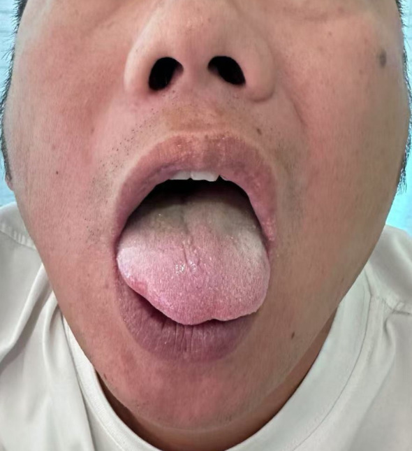
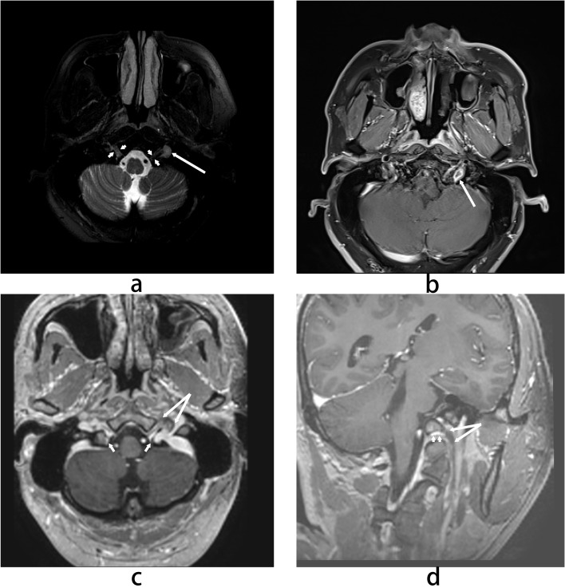
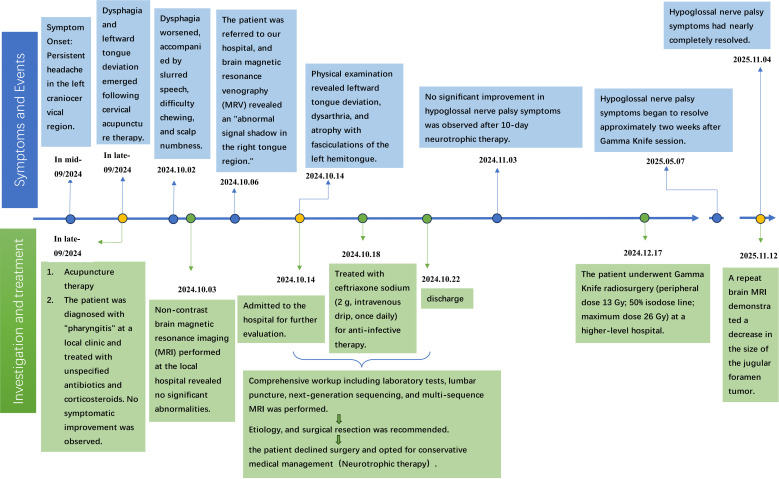
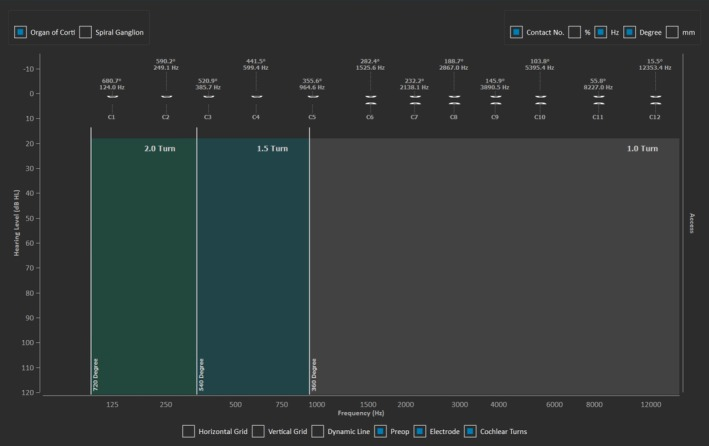
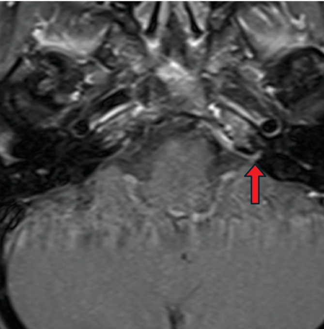
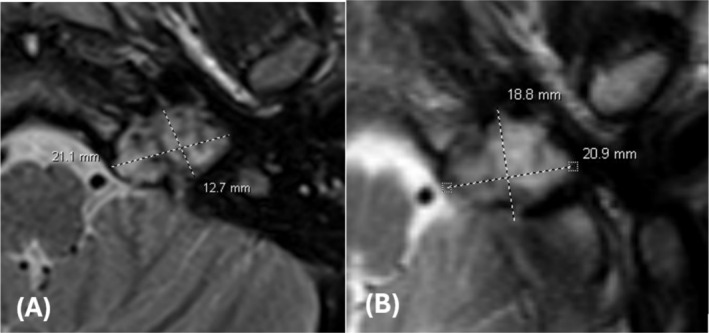
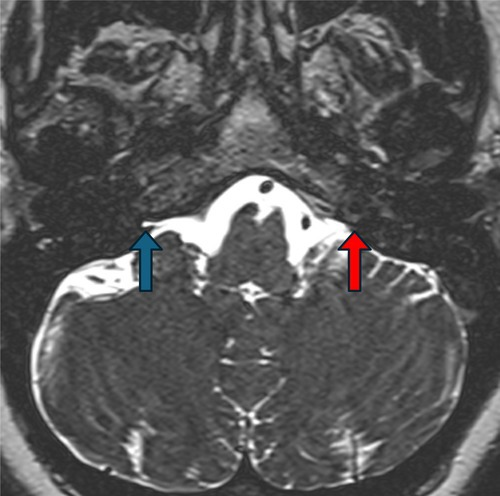
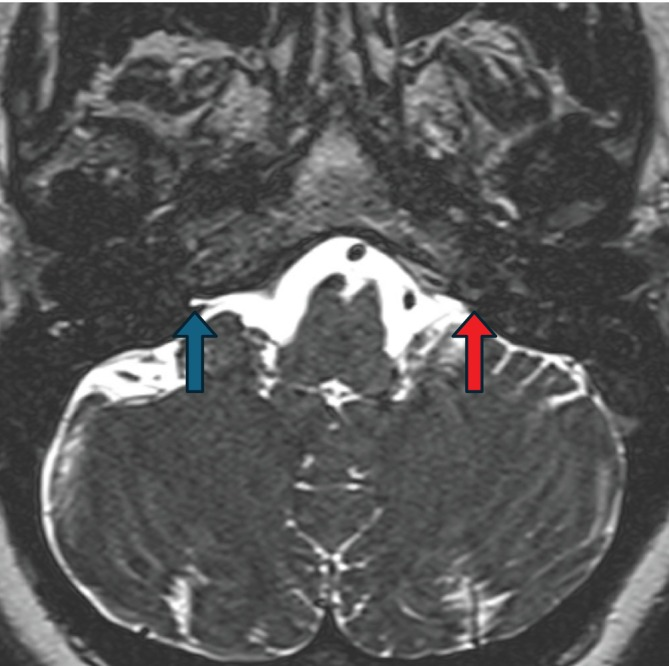
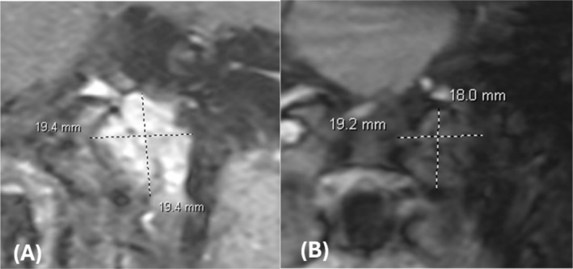
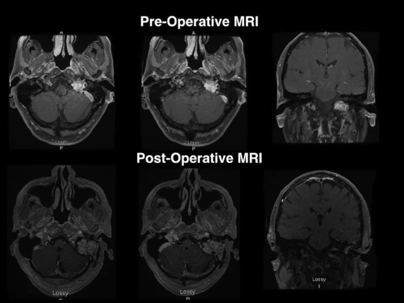

# Case Prep: Jugular Foramen Tumor (Glomus Jugulare / Schwannoma / Meningioma)

---

<!-- BEGIN CASE DOSSIER -->

## Case / Approach Dossier

- **Anatomy at risk:** tumor compartment, arterial supply, venous drainage/sinuses, cranial nerves, white-matter tracts, pituitary/CSF pathways when relevant, and functional cortex.
- **Operative steps:** review imaging and goals, choose exposure, obtain brain relaxation, devascularize when possible, debulk internally, dissect capsule from critical structures, verify extent/safety, and reconstruct watertight closure; use the detailed operative sequence and approach notes below as the step-by-step source.
- **Rescue plans:** venous or arterial injury, swelling, seizure, cranial nerve or endocrine change, CSF leak, residual tumor left for safety, staged surgery, radiation, or adjuvant therapy.
- **Figures:** review [Figures, Imaging & Video](#figures-imaging--video) and the [Curated Image Set](#curated-image-set); embedded local figures should remain open-access, public-domain, or otherwise reusable with attribution.
- **Papers:** review [High-Yield Literature](#high-yield-literature) for seminal sources, modern reviews, and outcome data specific to this page.
- **Textbook cross-checks:** use [Textbook Cross-Checks](#textbook-cross-checks) and the [Source Crosswalk](../../resources/source-crosswalk.md) to cite copyrighted textbooks/atlases while summarizing in original words.

<!-- END CASE DOSSIER -->

## One-Liner
[Age]yo [M/F] with a [left/right] jugular foramen tumor ([glomus jugulare/paraganglioma / schwannoma / meningioma]) presenting with [pulsatile tinnitus / hearing loss / lower cranial neuropathy] planned for [far lateral / combined transtemporal-transjugular (infratemporal fossa) ] resection [± preoperative embolization].

---

## Figures, Imaging & Video

**🎥 Operative video** — [search operative video on YouTube ▸](https://www.youtube.com/results?search_query=glomus+jugulare+surgery) · [The Neurosurgical Atlas ▸](https://www.neurosurgicalatlas.com)

> 🧭 **Operative approach:** [Far-lateral (transcondylar) craniotomy](../approaches/far-lateral-craniotomy.md) — detailed corridor setup, step-by-step technique & figures

[Neurosurgical Atlas](https://www.neurosurgicalatlas.com) · [Radiopaedia](https://radiopaedia.org/search?q=glomus%20jugulare&scope=all) · [PubMed Central](https://www.ncbi.nlm.nih.gov/pmc/?term=jugular+foramen+tumor+glomus) — operative figures © linked; see [media-sources.md](../../resources/media-sources.md)

---

<!-- BEGIN TEXTBOOK CROSS-CHECKS -->

## Textbook Cross-Checks

- **Tumor and skull-base anatomy:** Youmans and Winn; Schmidek and Sweet; Rhoton Cranial Anatomy; Brain Anatomy and Neurosurgical Approaches — confirm compartment, dural/vascular supply, cranial nerves, venous sinuses, white-matter tracts, and safe surgical corridors.
- **Oncologic strategy:** CNS Radiation Oncology Principles and Practice; Youmans and Winn; Greenberg — summarize goals of resection, adjuvant-therapy context, surveillance, and when subtotal resection is safer.
- **Complication rescue:** Schmidek and Sweet; Greenberg — review edema, seizure, venous injury, endocrinopathy/CSF leak, neurologic deficit, and reconstruction issues.
- **Copyright-safe use:** cite these sources as private cross-checks, then write the guide content in original words; do not re-host textbook pages, figures, tables, or board-review card material. See [Source Crosswalk & Copyright-Safe Use](../../resources/source-crosswalk.md).

<!-- END TEXTBOOK CROSS-CHECKS -->

<!-- BEGIN CURATED LITERATURE -->

## High-Yield Literature

- **Transtemporal Suprajugular Approach with Neck Dissection for Jugular Foramen Tumor Resection: Operative Video** — Sarris CE. Journal of neurological surgery. Part B, Skull base 2021. [PubMed](https://pubmed.ncbi.nlm.nih.gov/33717821/)
- **Jugular foramen tumor causing isolated hypoglossal nerve palsy: a case report** — Wen Z. Frontiers in oncology 2026. [PubMed](https://pubmed.ncbi.nlm.nih.gov/41669104/)
- **Giant jugular foramen tumor** — Lai WS. Ear, nose, & throat journal 2013. [PubMed](https://pubmed.ncbi.nlm.nih.gov/23599097/)
- **Peripheral primitive neuroectodermal tumor of the jugular foramen: case report** — Yamazaki T. Neurosurgery 2002. [PubMed](https://pubmed.ncbi.nlm.nih.gov/12383375/)
- **Endoluminal Sigmoid Sinus Occlusion During Jugular Foramen Tumor Surgery: Novel Technique, Operative Nuances, and Clinical Experience With 33 Patients** — Castillo AL. Operative neurosurgery (Hagerstown, Md.) 2024. [PubMed](https://pubmed.ncbi.nlm.nih.gov/38752769/)
- **Surgical Management of Jugular Foramen Schwannomas** — Aftahy AK. Cancers 2021. [PubMed](https://pubmed.ncbi.nlm.nih.gov/34439372/)
- **Cochlear Implantation for Sensorineural Hearing Loss Related to Cochlear Aqueduct Obstruction by a Jugular Foramen Tumor** — Ewer N. Laryngoscope investigative otolaryngology 2025. [PubMed](https://pubmed.ncbi.nlm.nih.gov/40881053/)
- **Plasmacytoma presenting as jugular foramen tumor in a young woman with multiple myeloma** — How J. American journal of hematology 2019. [PubMed](https://pubmed.ncbi.nlm.nih.gov/30916796/)
- **Anaplastic Hemangiopericytoma of the Jugular Foramen: Case Report and Systematic Review** — Li D. World neurosurgery 2021. [PubMed](https://pubmed.ncbi.nlm.nih.gov/34182175/)
- **[An anatomical and technical note for neurosurgery of the jugular foramen tumor [author's transl)]** — Hakuba A. No shinkei geka. Neurological surgery 1982. [PubMed](https://pubmed.ncbi.nlm.nih.gov/6285215/)

<!-- END CURATED LITERATURE -->

---

<!-- BEGIN CURATED IMAGE SET -->

## Curated Image Set

Open-access figures are embedded from PubMed Central articles and kept unique to this guide.

*Figure 1. Clinical photograph of the tongue showing leftward deviation upon protrusion, presenting as asymmetry. Source: [Jugular foramen tumor causing isolated hypoglossal nerve palsy: a case report](https://pmc.ncbi.nlm.nih.gov/articles/PMC12883803/) — Frontiers in Oncology 2026; CC BY.*

*Figure 2. MRI findings. (a) Axial T2-weighted image shows a hyperintense nodule (long arrow) adjacent to the hypoglossal nerve (short arrow). (b) Axial contrast-enhanced T1-weighted image... Source: [Jugular foramen tumor causing isolated hypoglossal nerve palsy: a case report](https://pmc.ncbi.nlm.nih.gov/articles/PMC12883803/) — Frontiers in Oncology 2026; CC BY.*

*Figure 3. Clinical timeline summarizing key events and interventions. Source: [Jugular foramen tumor causing isolated hypoglossal nerve palsy: a case report](https://pmc.ncbi.nlm.nih.gov/articles/PMC12883803/) — Frontiers in Oncology 2026; CC BY.*

*FIGURE 3. Electrode location by frequency place for anatomy based fitting. Source: [Cochlear Implantation for Sensorineural Hearing Loss Related to Cochlear Aqueduct Obstruction by a Jugular Foramen Tumor](https://pmc.ncbi.nlm.nih.gov/articles/PMC12381779/) — Laryngoscope Investigative Otolaryngology 2025; CC BY-NC-ND.*

*FIGURE 2. Axial contrast‐enhanced T1 MRI. Red arrow: Presence of enhancement of left cochlear aqueduct and adjacent dura consistent with tumor involvement. Source: [Cochlear Implantation for Sensorineural Hearing Loss Related to Cochlear Aqueduct Obstruction by a Jugular Foramen Tumor](https://pmc.ncbi.nlm.nih.gov/articles/PMC12381779/) — Laryngoscope Investigative Otolaryngology 2025; CC BY-NC-ND.*

*FIGURE 4. T2 axial MRI images of jugular foramen tumor (A) pre‐SRS (3.0 mm slice thickness) and (B) 3 months post‐SRS (5.0 mm slice thickness) revealing changes in tumor size. Source: [Cochlear Implantation for Sensorineural Hearing Loss Related to Cochlear Aqueduct Obstruction by a Jugular Foramen Tumor](https://pmc.ncbi.nlm.nih.gov/articles/PMC12381779/) — Laryngoscope Investigative Otolaryngology 2025; CC BY-NC-ND.*

*Figure 7. Source: [Cochlear Implantation for Sensorineural Hearing Loss Related to Cochlear Aqueduct Obstruction by a Jugular Foramen Tumor](https://pmc.ncbi.nlm.nih.gov/articles/PMC12381779/) — Laryngoscope Investig Otolaryngol. 2025 Aug 27;10(4):e70171. doi: 10.1002/lio2.70171; CC BY-NC-ND.*

*FIGURE 1. Axial heavily T2 weighted MRI. Blue arrow: Presence of fluid signal in cochlear aqueduct on non‐tumor size, indicating no occlusion. Red arrow: Absence of fluid signal in cochlear... Source: [Cochlear Implantation for Sensorineural Hearing Loss Related to Cochlear Aqueduct Obstruction by a Jugular Foramen Tumor](https://pmc.ncbi.nlm.nih.gov/articles/PMC12381779/) — Laryngoscope Investigative Otolaryngology 2025; CC BY-NC-ND.*

*FIGURE 5. T1 post‐contrast FLASH coronal MRI images of jugular foramen tumor (A) pre‐SRS (3.0 mm slice thickness) and (B) 3 months post‐SRS (5.0 mm slice thickness) revealing changes in tumor size. Source: [Cochlear Implantation for Sensorineural Hearing Loss Related to Cochlear Aqueduct Obstruction by a Jugular Foramen Tumor](https://pmc.ncbi.nlm.nih.gov/articles/PMC12381779/) — Laryngoscope Investigative Otolaryngology 2025; CC BY-NC-ND.*

*Fig. 1. Pre and postoperative images. Source: [Gross Total Resection of a Jugular Foramen Thyroid Medullary Metastasis via a Transjugular Transsigmoid Approach](https://pmc.ncbi.nlm.nih.gov/articles/PMC6240456/) — Journal of Neurological Surgery. Part B, Skull Base 2018; CC BY-NC-ND.*

<!-- END CURATED IMAGE SET -->

---

## History of Present Illness
- Chief complaint: **Pulsatile tinnitus, conductive hearing loss** (glomus — vascular middle ear mass), **lower cranial neuropathy (IX, X, XI — dysphagia, hoarseness, aspiration)**, CN XII, facial weakness, ataxia
- **Glomus jugulare (paraganglioma):** highly vascular, may be **catecholamine-secreting** (screen!), part of paraganglioma syndromes (SDH mutations — screen/genetics, multicentricity)
- Jugular foramen schwannoma (CN IX-XI), meningioma
- Symptom duration, prior treatment

---

## Past Medical History
- **Catecholamine screening (glomus)** — plasma/urine metanephrines (rule out secretory tumor — anesthetic crisis risk), **SDHx genetic testing/family history** (paraganglioma syndromes, pheochromocytoma)
- Cardiac (if secretory), prior treatment/radiation
- Standard PMH

---

## Imaging Review
### MRI (T1±Gad, T2) + MRA/MRV
- Tumor extent (jugular foramen, into middle ear/neck/posterior fossa), **"salt-and-pepper" flow voids (glomus)**, brainstem/cerebellar relationship
- **Sigmoid/jugular venous system** (dominant side? occlusion?), **dural venous sinuses**
### CT temporal bone
- **Bony erosion** (glomus — "moth-eaten" jugular foramen; vs smooth enlargement in schwannoma), jugular bulb, carotid canal, ossicles, mastoid
### Angiography + Embolization
- **Preoperative embolization** (glomus — highly vascular; reduces blood loss), feeders (ascending pharyngeal, etc.), **ICA involvement, venous anatomy, balloon test occlusion** if ICA sacrifice possible
### Audiology
- Baseline audiogram

---

## Labs
- CBC, BMP, Coags, **type and crossmatch**, **metanephrines (glomus)**

---

## Neurological Examination
- **Lower cranial nerves (IX-XII), VII, VIII**, cerebellar, gait; **baseline swallow/voice** (critical for counseling/aspiration risk)

---

## Surgical Planning

### Diagnosis & Indication / Strategy
- Indication: Symptomatic/growing tumor; **management individualized** — surgery (cure but CN morbidity), **radiosurgery** (growth control with lower CN morbidity — increasingly favored for glomus, esp. with intact CN function), or combined; observation for small/asymptomatic elderly
- **Glomus: preoperative embolization** + alpha-blockade if secretory
- Multidisciplinary (neurotology/skull base + neurosurgery ± head and neck/vascular)

### Position
- Lateral/park bench or supine head-turned; Mayfield; neck prepped (proximal vascular control); IONM (lower CNs, VII, VIII)

### Key Surgical Steps (Combined transtemporal-transjugular / infratemporal fossa)
1. Postauricular incision, **expose the neck** for proximal ICA/IJV and lower CN control
2. **Mastoidectomy**, skeletonize the sigmoid sinus, jugular bulb, facial nerve (± anterior transposition of CN VII for infratemporal fossa type A), fallopian canal
3. Control the **sigmoid sinus and internal jugular vein** (ligate/pack the sigmoid-jugular system — only if contralateral venous drainage adequate)
4. Expose and resect tumor from the jugular foramen; **preserve lower cranial nerves (IX, X, XI)** where possible — dissect off the pars nervosa
5. Manage **ICA** (petrous/cervical — skeletonize/protect; embolization/BTO planning if involved)
6. Far lateral/posterior fossa extension for intradural/brainstem component
7. Resect dural attachment (meningioma); accept residual on CNs/ICA if adherent
8. **Watertight closure + fat/flap obliteration** of the defect/eustachian tube (CSF leak prevention)

### Critical Anatomy & Structures at Risk
1. **Lower cranial nerves (IX, X, XI, XII)** — dysphagia/aspiration, hoarseness, shoulder; often the dominant morbidity
2. **Internal carotid artery** (petrous/cervical), **jugular bulb / sigmoid sinus / IJV** (venous drainage — ensure contralateral patency before sacrifice)
3. **Facial nerve (VII)** (transposition risk), **CN VIII** (hearing)
4. Brainstem/cerebellum, dura (CSF leak)

### Equipment
- Microscope, **drill (mastoid/skull base)**, navigation, CUSA, ICG, micro-Doppler
- **CN monitoring (VII, VIII, IX-XII)**, fat graft/flap, dural substitute, sealant
- Preop embolization, vascular control/repair capability; neurotology collaboration

### Monitoring
- **Lower CN EMG (IX-XII), VII EMG, BAER, SSEP/MEP**

### Anesthesia
- Arterial line, **crossmatched blood (vascular)**, **alpha-blockade/avoid catecholamine surge if secretory glomus** (pheo-like precautions), VAE precautions, airway/aspiration planning, long case

### Potential Complications
1. **Lower cranial nerve palsies** (dysphagia/aspiration — may need tracheostomy/PEG/vocal cord medialization), CN VII/VIII deficits
2. **Major hemorrhage** (glomus — embolization helps), **ICA injury**, venous infarction (if dominant sinus sacrificed)
3. **CSF leak**, hypertensive crisis (secretory), stroke
4. Subtotal/recurrence (consider adjuvant radiosurgery)

---

## Operative Note Template
**Preoperative Diagnosis:** [Left/Right] jugular foramen tumor ([glomus jugulare / schwannoma / meningioma]) with [pulsatile tinnitus / lower cranial neuropathy]

**Postoperative Diagnosis:** Same

**Procedure:** [Left/Right] [combined transtemporal-transjugular (infratemporal fossa) / far lateral] resection of jugular foramen tumor [following preoperative embolization]

**Surgeon / Assistant:** Neurosurgery + neurotology/skull base co-surgeon
**Anesthesia:** General endotracheal [alpha-blockade if secretory glomus]
**EBL / Fluids / Blood products:** [crossmatched]
**Adjuncts:** Neuronavigation, high-speed drill, ICG, micro-Doppler; CN EMG (VII, IX-XII)/BAER/SSEP/MEP
**Implants:** Fat graft/flap, dural substitute, sealant
**Complications:** None

**Indications:** [Age]yo [M/F] with a jugular foramen [glomus jugulare] causing [pulsatile tinnitus/lower cranial neuropathy]; metanephrines were [negative]. Preoperative embolization was performed for this vascular tumor. Risks (lower CN palsies/aspiration, ICA injury, venous infarction, CSF leak) discussed.

**Description of Procedure:** After consent and time-out, general anesthesia was induced [with alpha-blockade precautions for the secretory tumor], and neuromonitoring established. With the neurotology co-surgeon, a postauricular incision was made and **the neck dissected for proximal ICA/IJV and lower cranial nerve control**. A mastoidectomy was performed, skeletonizing the sigmoid sinus, jugular bulb, and facial nerve [with anterior transposition of CN VII].

The sigmoid sinus and internal jugular vein were controlled and the venous system addressed (confirming adequate contralateral drainage before sacrifice). The tumor was resected from the jugular foramen, **preserving the lower cranial nerves (IX-XII) off the pars nervosa** where possible and protecting/skeletonizing the ICA; [the far-lateral extension addressed the intradural/brainstem component]. Residual adherent to the CNs/ICA was left. The defect was obliterated with fat/flap and a watertight closure performed with sealant to prevent CSF leak.

The patient was transferred to the ICU with lower-CN precautions and swallow assessment planned before PO intake.

---

## Postoperative Plan
- ICU, neuro checks, **lower CN assessment — swallow eval before PO, voice, aspiration precautions** (often need speech/swallow therapy; consider early ENT for vocal cord)
- CT/MRI postop, audiogram, CSF leak watch
- **Secretory glomus:** hemodynamic monitoring, continue alpha-blockade taper
- **Genetics referral (SDHx)**, screen for multicentric paraganglioma/pheochromocytoma
- Residual → radiosurgery/surveillance; rehab (swallow, shoulder); long-term follow-up
