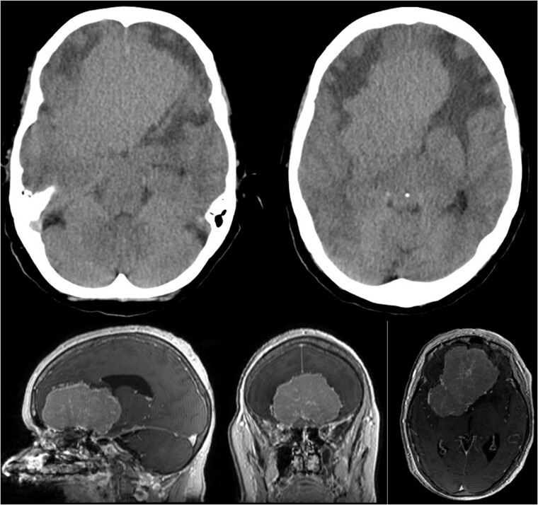
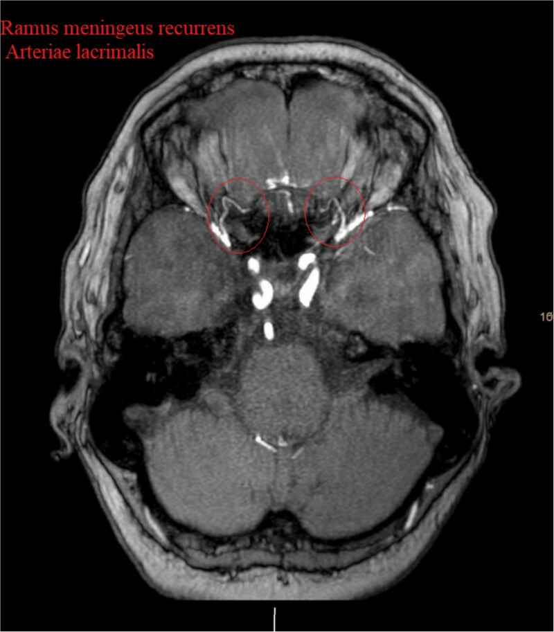
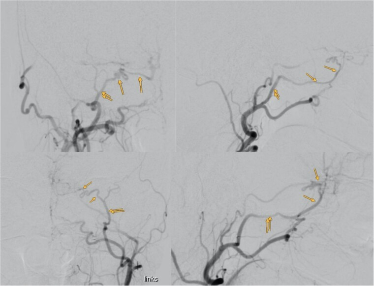
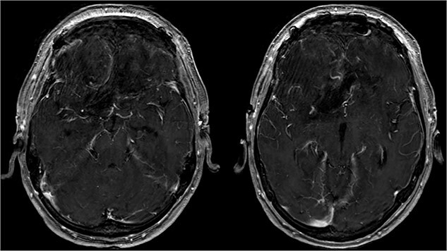
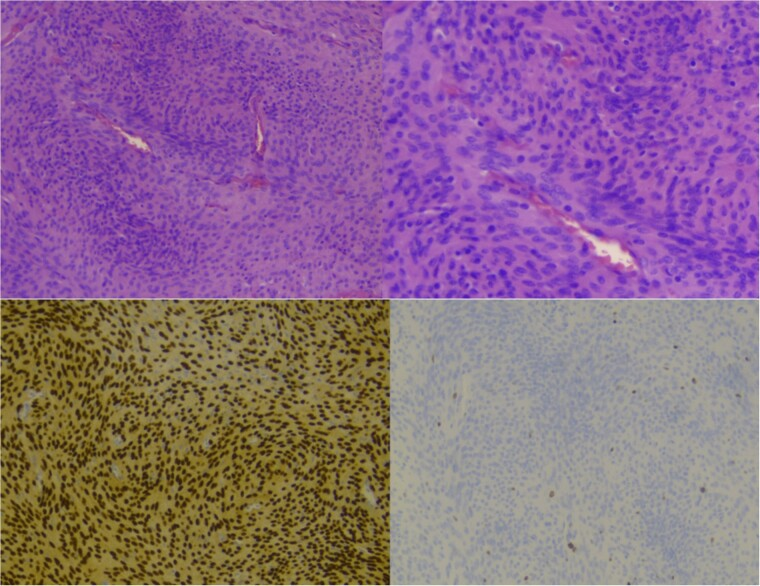
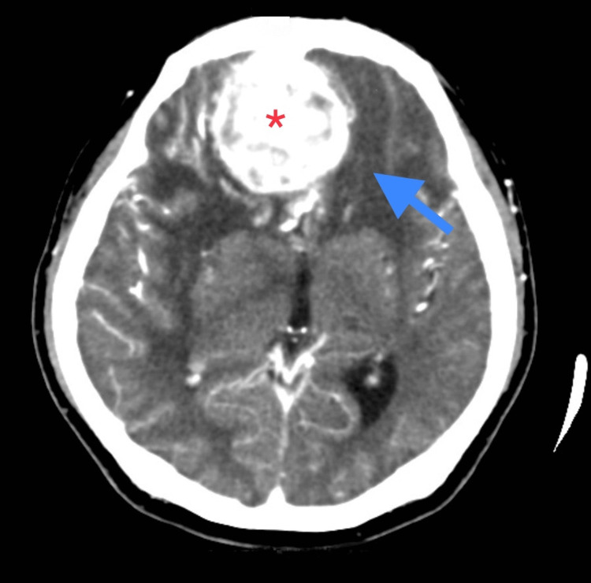
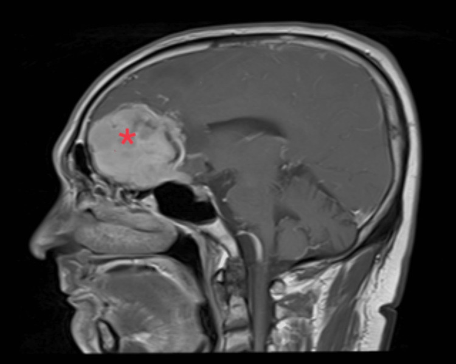
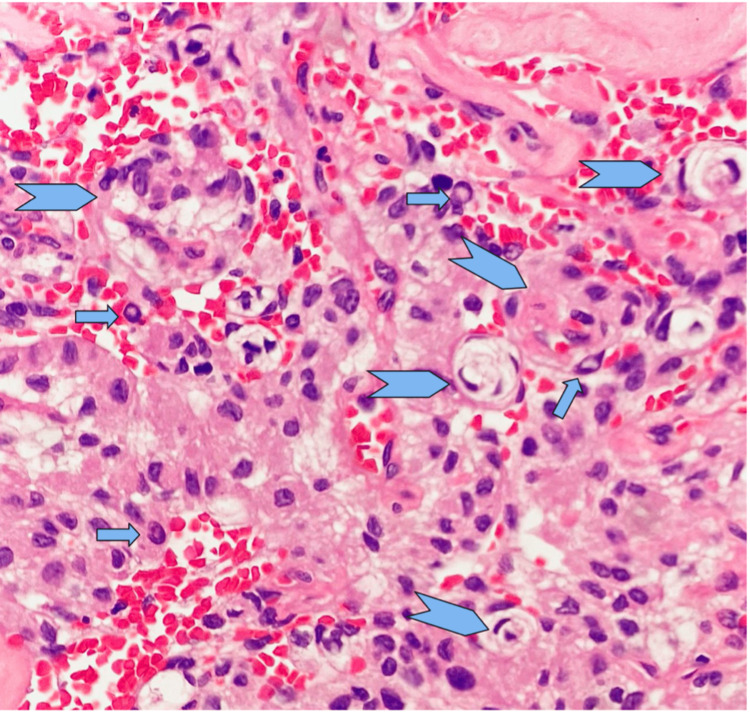
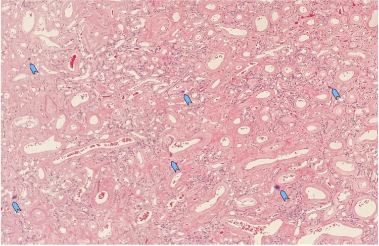
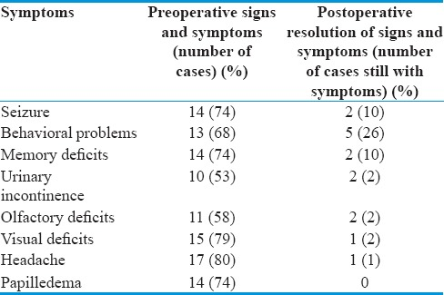

# Case Prep: Olfactory Groove Meningioma Resection

<!-- BEGIN CASE SNAPSHOT -->

## Case / Approach Snapshot

- **Anatomy at risk:** tumor compartment, arterial supply, venous drainage/sinuses, cranial nerves, white-matter tracts, pituitary/CSF pathways when relevant, and functional cortex.
- **Operative steps:** review imaging and goals, choose exposure, obtain brain relaxation, devascularize when possible, debulk internally, dissect capsule from critical structures, verify extent/safety, and reconstruct watertight closure; use the detailed operative sequence and approach notes below as the step-by-step source.
- **Rescue plans:** venous or arterial injury, swelling, seizure, cranial nerve or endocrine change, CSF leak, residual tumor left for safety, staged surgery, radiation, or adjuvant therapy.
- **Figures:** review [Figures, Imaging & Video](#figures-imaging--video) and the [Curated Image Set](#curated-image-set); embedded local figures should remain open-access, public-domain, or otherwise reusable with attribution.
- **Papers:** review [High-Yield Literature](#high-yield-literature) for seminal sources, modern reviews, and outcome data specific to this page.

<!-- END CASE SNAPSHOT -->

## One-Liner
[Age]yo [M/F] with a [size] cm olfactory groove meningioma presenting with [anosmia / personality change / visual decline / headache] planned for [bifrontal / pterional / supraorbital / endoscopic endonasal] approach for resection.

---

## Figures, Imaging & Video

**🎥 Operative video** — [search operative video on YouTube ▸](https://www.youtube.com/results?search_query=olfactory+groove+meningioma+surgery) · [The Neurosurgical Atlas ▸](https://www.neurosurgicalatlas.com)

> 🧭 **Operative approach:** [Bifrontal craniotomy](../approaches/bifrontal-craniotomy.md) — detailed corridor setup, step-by-step technique & figures

> Operative figures/atlases are © (linked, not copied). See [media-sources.md](../../resources/media-sources.md).
- **Technique/approach:** [The Neurosurgical Atlas](https://www.neurosurgicalatlas.com) — search *"olfactory groove meningioma"*
- **Imaging:** [Radiopaedia — olfactory groove meningioma](https://radiopaedia.org/search?q=olfactory%20groove%20meningioma&scope=all)
- **Open-access figures:** [PubMed Central](https://www.ncbi.nlm.nih.gov/pmc/?term=olfactory+groove+meningioma)

---

<!-- BEGIN CURATED LITERATURE -->

## High-Yield Literature

- **Olfactory groove meningioma** — Adappa ND. Otolaryngologic clinics of North America 2011. [PubMed](https://pubmed.ncbi.nlm.nih.gov/21819883/)
- **Olfactory groove and tuberculum sellae meningioma resection by endoscopic endonasal approach versus transcranial approach: A systematic review and meta-analysis of comparative studies** — Lu VM. Clinical neurology and neurosurgery 2018. [PubMed](https://pubmed.ncbi.nlm.nih.gov/30193170/)
- **Smell Outcomes in Olfactory Groove Meningioma Resection Through Unilateral versus Bilateral Transcranial Approaches: A Systematic Review and Meta-analysis** — Bamimore MA. World neurosurgery 2022. [PubMed](https://pubmed.ncbi.nlm.nih.gov/35033688/)
- **Exoscopic resection of giant olfactory groove meningioma** — Calvanese F. Neurosurgical focus: Video 2024. [PubMed](https://pubmed.ncbi.nlm.nih.gov/38283807/)
- **Transorbital Approach for Olfactory Groove Meningioma** — Noiphithak R. World neurosurgery 2022. [PubMed](https://pubmed.ncbi.nlm.nih.gov/35338020/)
- **Taste dysfunction after endoscopic endonasal resection of olfactory groove meningioma: Case series and review of the literature** — Fecker AL. American journal of otolaryngology 2024. [PubMed](https://pubmed.ncbi.nlm.nih.gov/38678798/)
- **Nuances of Olfactory Groove Meningioma Surgery: 2-Dimensional Operative Video** — Mooney MA. Operative neurosurgery (Hagerstown, Md.) 2021. [PubMed](https://pubmed.ncbi.nlm.nih.gov/34195839/)
- **Endoscopic Endonasal Resection-Olfactory Groove Meningioma: 2-Dimensional Operative Video** — Champagne PO. Operative neurosurgery (Hagerstown, Md.) 2020. [PubMed](https://pubmed.ncbi.nlm.nih.gov/32542385/)
- **Prognostic factors for olfactory groove meningioma with nasal cavity extension** — Zhang J. Oncotarget 2018. [PubMed](https://pubmed.ncbi.nlm.nih.gov/29435128/)
- **Olfactory groove meningioma presenting solely with visual impairment: illustrative case** — Abu Saadeh O. Journal of neurosurgery. Case lessons 2025. [PubMed](https://pubmed.ncbi.nlm.nih.gov/41569773/)

<!-- END CURATED LITERATURE -->

<!-- BEGIN CURATED IMAGE SET -->

## Curated Image Set

Open-access figures are embedded from PubMed Central articles and kept unique to this guide.

*Figure 1. Showing the CT imaging with a hypodense fronto-basal lesion with finger-shaped perifocal edema and the T1-weighted MRI image with homogenous contrast-enhancing frontobasal lesion... Source: [Bilateral cranioorbital foramina (Hyrtl foramina): crucial anatomical findings in the management of giant olfactory groove meningioma - a case report and literature review](https://pmc.ncbi.nlm.nih.gov/articles/PMC11344595/) — Journal of Surgical Case Reports 2024; CC BY.*

*Figure 2. Show the MRA with the bilateral anastomotic branch of the lacrimal artery with the middle meningeal artery. Source: [Bilateral cranioorbital foramina (Hyrtl foramina): crucial anatomical findings in the management of giant olfactory groove meningioma - a case report and literature review](https://pmc.ncbi.nlm.nih.gov/articles/PMC11344595/) — Journal of Surgical Case Reports 2024; CC BY.*

*Figure 3. Showing the digital subtraction angiography of the left external carotid artery in four perspectives: posteroanterior view (upper left), lateral view (upper right), posteroanterior view... Source: [Bilateral cranioorbital foramina (Hyrtl foramina): crucial anatomical findings in the management of giant olfactory groove meningioma - a case report and literature review](https://pmc.ncbi.nlm.nih.gov/articles/PMC11344595/) — Journal of Surgical Case Reports 2024; CC BY.*

*Figure 4. Showing the postoperative T1-weighted MRI with no residual tumor tissue. Source: [Bilateral cranioorbital foramina (Hyrtl foramina): crucial anatomical findings in the management of giant olfactory groove meningioma - a case report and literature review](https://pmc.ncbi.nlm.nih.gov/articles/PMC11344595/) — Journal of Surgical Case Reports 2024; CC BY.*

*Figure 5. Showing staining with hematoxylin and eosin, low power lens (upper left), high power lens (upper right) and moleculopathological analysis with ki67 (lower left), progesteron receptor... Source: [Bilateral cranioorbital foramina (Hyrtl foramina): crucial anatomical findings in the management of giant olfactory groove meningioma - a case report and literature review](https://pmc.ncbi.nlm.nih.gov/articles/PMC11344595/) — Journal of Surgical Case Reports 2024; CC BY.*

*Figure 1. CECT Brain (axial view) showing bi-frontal extra-axial space-occupying lesion (red asterisk) measuring 4.8 x 5.0 x 4.8 cm with skull base erosion. There is a presence of perilesional... Source: [Visual Loss As Primary Manifestation of Olfactory Groove Meningioma](https://pmc.ncbi.nlm.nih.gov/articles/PMC10186566/) — Cureus 2023; CC BY.*

*Figure 2. MRI (sagittal view) showing the anterior skull base meningioma (red asterisk) causing mass effect (right more than left), left midline shift, and contralateral early hydrocephalus. Source: [Visual Loss As Primary Manifestation of Olfactory Groove Meningioma](https://pmc.ncbi.nlm.nih.gov/articles/PMC10186566/) — Cureus 2023; CC BY.*

*Figure 3. A generally uniform oval nucleus with a central clearing (arrow) and an indistinct cytoplasmic border. In areas, vague whorls of tumour cells are also present (arrow head). Source: [Visual Loss As Primary Manifestation of Olfactory Groove Meningioma](https://pmc.ncbi.nlm.nih.gov/articles/PMC10186566/) — Cureus 2023; CC BY.*

*Figure 4. The vascular channels are variable in size with a thickened hyalinised wall. There are several foci of tiny psammoma bodies noted (arrow head) Source: [Visual Loss As Primary Manifestation of Olfactory Groove Meningioma](https://pmc.ncbi.nlm.nih.gov/articles/PMC10186566/) — Cureus 2023; CC BY.*

*Figure 10. Source: [Modern Microsurgical Resection of Olfactory Groove Meningiomas by Classical Bicoronal Subfrontal Approach without Orbital Osteotomies](https://pmc.ncbi.nlm.nih.gov/articles/PMC5898089/) — Asian J Neurosurg. 2018 Apr-Jun;13(2):258–63. doi: 10.4103/ajns.AJNS_66_16; CC BY-NC-SA.*

<!-- END CURATED IMAGE SET -->

---

## History of Present Illness
- Chief complaint: Anosmia (often unnoticed), personality/cognitive change (frontal), visual decline (posterior extension to optic apparatus), headache
- **Foster Kennedy syndrome** (classic): ipsilateral optic atrophy + contralateral papilledema + anosmia
- Often large at presentation (frontal lobes silent)

---

## Imaging Review
### MRI (T1+Gad, T2, FLAIR)
- Midline anterior skull base mass, bilateral often
- Size, posterior extension to planum/tuberculum/optic apparatus
- **Anterior cerebral artery (ACA/A2) relationship** — vessels often draped over posterior tumor
- Peritumoral edema, brain invasion, vascular supply (ethmoidal/ophthalmic branches)
- Sinus/cribriform invasion (transcranial vs endonasal planning)

### CT
- Hyperostosis, cribriform plate erosion, ethmoid/sinus extension

### Ophthalmology
- Acuity, fields, fundoscopy

---

## Labs
- CBC, BMP, Coags, Type and crossmatch

---

## Neurological Examination
- Smell (each nostril), vision, frontal/cognitive/behavioral assessment

---

## Surgical Planning

### Case Logistics, OR Needs & Orders
- **OR setup:** Mayfield, navigation with latest MRI/DTI/functional data, microscope/exoscope, ultrasound/5-ALA/fluorescence when used, CUSA, cortical/subcortical mapping tools for eloquent lesions, and specimens/pathology workflow ready.
- **Special needs:** arterial line for large/eloquent/vascular tumors, dexamethasone plan, seizure prophylaxis for cortical lesions or seizure history, mannitol/hypertonic availability, language/motor mapping plan, and blood available for meningioma/skull-base cases.
- **Immediate postop orders:** neuro checks with deficit-specific exam, MRI brain with contrast within 24-48h when resection assessment matters, CT for hemorrhage concern, dex taper, antiepileptic duration, DVT timing, pathology/molecular follow-up, and rehab consults as needed.

### Approach Selection
- **Bifrontal:** Wide exposure for large tumors, bilateral; access to cribriform; allows skull base repair
- **Pterional / unilateral subfrontal:** Lateral-to-medial, early ACA/optic control, less brain retraction (good for small-moderate)
- **Supraorbital (eyebrow) keyhole:** Small-moderate tumors, minimally invasive
- **Endoscopic endonasal:** Selected tumors (devascularizes base early, no brain retraction) but anosmia guaranteed, CSF leak/reconstruction challenge; limited for large lateral extension

### Position
- Bifrontal/supraorbital: supine, neutral, slight extension (frontal lobes fall back), Mayfield
- Pterional: rotated 20-30 degrees contralateral

### Key Surgical Steps (Bifrontal example)
1. Bicoronal incision, pericranial flap harvested (for skull base repair)
2. Bifrontal craniotomy (low to floor of anterior fossa); may ligate/divide anterior SSS and falx
3. **Early devascularization** of tumor base along cribriform/planum (ethmoidal feeders)
4. Open dura, internal debulking (CUSA)
5. Circumferential dissection; **identify and protect ACA/A2 complex** posteriorly (draped over tumor)
6. Protect optic nerves/chiasm at posterior margin
7. Resect hyperostotic cribriform bone, dura (Simpson I)
8. **Anterior skull base reconstruction** — vascularized pericranial flap; multilayer repair to prevent CSF leak
9. Hemostasis, closure

### Critical Anatomy & Structures at Risk
1. **ACA / A2 / frontopolar arteries** — posterior tumor surface; injury → frontal infarct
2. **Optic nerves / chiasm** — posterior extension
3. **Frontal lobes** — minimize retraction (cognitive/personality)
4. **Anterior skull base / cribriform** — CSF leak source; needs robust repair
5. **Superior sagittal sinus (anterior)** — may ligate anterior third

### Equipment
- Microscope (± endoscope), navigation, CUSA, high-speed drill
- Pericranial flap for reconstruction, dural substitute, sealant
- Lumbar drain (optional), ICG

### Monitoring
- SSEPs; VEPs (optional)

### Anesthesia
- Arterial line, crossmatched blood, mannitol, dexamethasone, lumbar drain optional

### Potential Complications
1. **CSF rhinorrhea** (cribriform defect) — robust vascularized repair
2. ACA injury → frontal infarct
3. Visual decline
4. Frontal lobe/cognitive dysfunction (retraction)
5. Anosmia (expected), meningitis

---

## Operative Note Template
**Preoperative Diagnosis:** Olfactory groove meningioma [with anosmia / visual decline / frontal dysfunction]

**Postoperative Diagnosis:** Same

**Procedure:** [Bifrontal] craniotomy for resection of olfactory groove meningioma with anterior skull base reconstruction

**Surgeon / Assistant:**
**Anesthesia:** General endotracheal
**EBL / Fluids / Blood products:** [crossmatched]
**Adjuncts:** Neuronavigation, CUSA, high-speed drill, ICG; [lumbar drain]
**Implants:** Vascularized pericranial flap, dural substitute, sealant
**Complications:** None

**Indications:** [Age]yo [M/F] with a large olfactory groove meningioma causing [cognitive change/visual decline/anosmia]. A bifrontal approach was chosen for this large midline tumor with skull base reconstruction. Risks (CSF rhinorrhea, ACA injury, frontal/cognitive dysfunction, visual change) discussed.

**Description of Procedure:** After consent and time-out, general anesthesia was induced and navigation registered. A bicoronal incision was made and **a vascularized pericranial flap harvested for skull base repair**. A bifrontal craniotomy was performed low to the anterior fossa floor [with anterior SSS/falx division], and the dura opened.

The tumor base along the cribriform/planum was devascularized early (ethmoidal feeders). The tumor was internally debulked (CUSA) and dissected circumferentially, **identifying and protecting the ACA/A2 complex draped over the posterior tumor** and the optic nerves/chiasm posteriorly. Hyperostotic cribriform bone and involved dura were resected (Simpson I). **A multilayer anterior skull base reconstruction was performed with the vascularized pericranial flap** and sealant to prevent CSF leak.

Hemostasis was obtained, the bone flap replaced, and the wound closed in layers. The patient was transferred to the ICU with CSF-leak precautions.

---

## Postoperative Plan
- ICU, neuro checks q1h
- **CSF leak precautions** (HOB, no straining/nose blowing); lumbar drain if placed
- CT/MRI postop, watch for rhinorrhea, pneumocephalus
- Steroid taper, seizure prophylaxis, DVT prophylaxis
- Ophthalmology follow-up; cognitive assessment

<!-- BEGIN COMMON PIMP QUESTIONS -->

## Common Pimp Questions

Use these to pressure-test preparation for **Olfactory Groove Meningioma Resection**:

1. What is the surgical goal: gross-total, maximal safe, decompression, diagnosis, or cytoreduction?
2. What eloquent cortex, tract, cranial nerve, vessel, or sinus defines the stopping point?
3. What adjunct changes the case: navigation, mapping, 5-ALA, ultrasound, endoscope, ICG, or neuromonitoring?
4. What is the edema, steroid, seizure, DVT, and postop imaging plan?
5. What complication would you check for first in PACU based on this lesion location?

<!-- END COMMON PIMP QUESTIONS -->

<!-- BEGIN ATTENDING PREFERENCE VARIABLES -->

## Attending Preference Variables

Items that commonly vary by surgeon or institution:

- **Extent-of-resection goal and functional stopping points:** [attending-specific]
- **Mapping/monitoring, 5-ALA, ultrasound, ICG, endoscope, or tractography preferences:** [attending-specific]
- **Steroid, antiepileptic, mannitol/hypertonic saline, and antibiotic plan:** [attending-specific]
- **Postop MRI timing, ICU/floor threshold, and adjuvant-referral workflow:** [attending-specific]

<!-- END ATTENDING PREFERENCE VARIABLES -->
