# Case Prep: Parasagittal / Falx Meningioma Resection

---

<!-- BEGIN CASE SNAPSHOT -->

## Case / Approach Snapshot

- **Anatomy at risk:** tumor compartment, arterial supply, venous drainage/sinuses, cranial nerves, white-matter tracts, pituitary/CSF pathways when relevant, and functional cortex.
- **Operative steps:** review imaging and goals, choose exposure, obtain brain relaxation, devascularize when possible, debulk internally, dissect capsule from critical structures, verify extent/safety, and reconstruct watertight closure; use the detailed operative sequence and approach notes below as the step-by-step source.
- **Rescue plans:** venous or arterial injury, swelling, seizure, cranial nerve or endocrine change, CSF leak, residual tumor left for safety, staged surgery, radiation, or adjuvant therapy.
- **Figures:** review [Figures, Imaging & Video](#figures-imaging--video) and the [Curated Image Set](#curated-image-set); embedded local figures should remain open-access, public-domain, or otherwise reusable with attribution.
- **Papers:** review [High-Yield Literature](#high-yield-literature) for seminal sources, modern reviews, and outcome data specific to this page.

<!-- END CASE SNAPSHOT -->

## One-Liner
[Age]yo [M/F] with a [anterior/middle/posterior third] [left/right] parasagittal/falcine meningioma [with/without superior sagittal sinus involvement] presenting with [seizures / contralateral leg weakness / headache] planned for craniotomy for resection.

---

## Figures, Imaging & Video

**🎥 Operative video** — [search operative video on YouTube ▸](https://www.youtube.com/results?search_query=parasagittal+meningioma+surgery) · [The Neurosurgical Atlas ▸](https://www.neurosurgicalatlas.com)

> 🧭 **Operative approach:** [Anterior interhemispheric approach](../approaches/anterior-interhemispheric-approach.md) — detailed corridor setup, step-by-step technique & figures

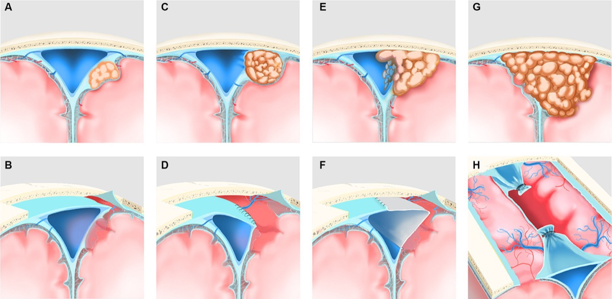

*Sinus-invasion classification and surgical strategy. Source: Duan et al., Front Neurol 2024;15:1364917, Fig 1. CC BY 4.0.*

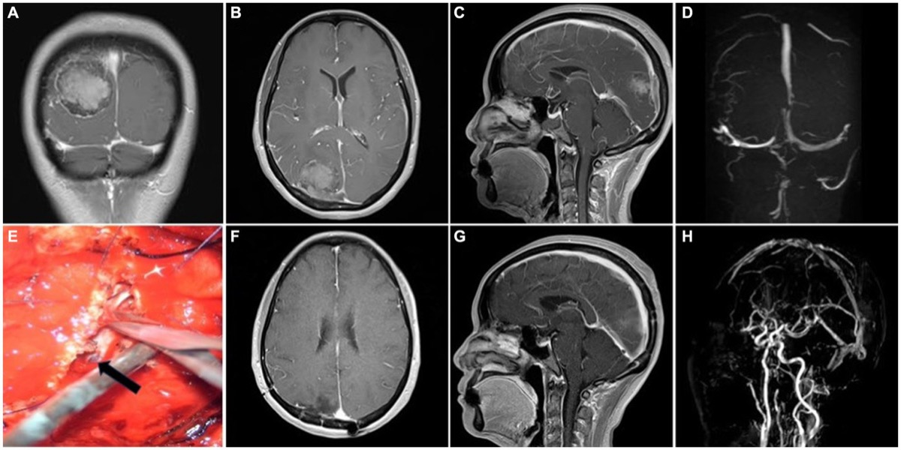

*Preop MRI/MRV → intraoperative sinus repair → postop MRI/MRV. Source: Duan et al., Front Neurol 2024;15:1364917, Fig 3. CC BY 4.0.*

[Neurosurgical Atlas](https://www.neurosurgicalatlas.com) · [Radiopaedia](https://radiopaedia.org/search?q=parasagittal%20meningioma&scope=all) · [PubMed Central](https://www.ncbi.nlm.nih.gov/pmc/?term=parasagittal+meningioma) — operative figures © linked; see [media-sources.md](../../resources/media-sources.md)

---

<!-- BEGIN CURATED LITERATURE -->

## High-Yield Literature

- **Purely endoscopic removal of a parasagittal/falx meningioma** — Spektor S. Acta neurochirurgica 2016. [PubMed](https://pubmed.ncbi.nlm.nih.gov/26746827/)
- **Preoperative antiepileptic drug prophylaxis for early postoperative seizures in supratentorial meningioma: a single-center experience** — Cai Q. Journal of neuro-oncology 2022. [PubMed](https://pubmed.ncbi.nlm.nih.gov/35434765/)
- **[Convexity Meningioma, Parasagittal Meningioma, Falx Meningioma]** — Matsuda M. No shinkei geka. Neurological surgery 2024. [PubMed](https://pubmed.ncbi.nlm.nih.gov/39034511/)
- **Resection of falx and parasagittal meningioma: complication avoidance** — Magill ST. Journal of neuro-oncology 2016. [PubMed](https://pubmed.ncbi.nlm.nih.gov/27778211/)
- **Falcine meningiomas** — Casali C. Handbook of clinical neurology 2020. [PubMed](https://pubmed.ncbi.nlm.nih.gov/32586481/)
- **Parasagittal Meningiomas: Prognostic Factors for Recurrence** — Antunes A. Advances and technical standards in neurosurgery 2023. [PubMed](https://pubmed.ncbi.nlm.nih.gov/37770688/)
- **Challenging Resection of Bilateral Parasagittal and Falcine Meningioma Involving Both Anterior Third and Middle Third of the Superior Sagittal Sinus: A Case Report and Literature Review** — Alzughaibi RA. Cureus 2024. [PubMed](https://pubmed.ncbi.nlm.nih.gov/39156289/)
- **Xanthomatous meningioma: a case report with review of the literature** — Ishida M. International journal of clinical and experimental pathology 2013. [PubMed](https://pubmed.ncbi.nlm.nih.gov/24133605/)
- **[Systematic review of complications for proper informed consent (7) surgery for convexity/parasagittal/falx meningiomas]** — Ochi T. No shinkei geka. Neurological surgery 2013. [PubMed](https://pubmed.ncbi.nlm.nih.gov/23542799/)
- **Meningiomas of the rolandic region: risk factors for motor deficit and role of intra-operative monitoring** — Maiuri F. Acta neurochirurgica 2023. [PubMed](https://pubmed.ncbi.nlm.nih.gov/37277557/)

<!-- END CURATED LITERATURE -->

---

<!-- BEGIN CURATED IMAGE SET -->

## Curated Image Set

Open-access figures are embedded from PubMed Central articles and kept unique to this guide.

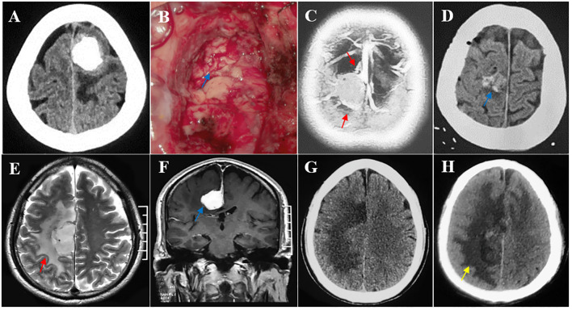
*Figure 4. Multiple risk factors leading to postoperative motor decline after parasagittal/falx meningioma resection in the middle third SSS. (A, B) The tumor invading the pia mater was completely... Source: [Risk factors for motor decline following parasagittal and falx meningioma resection in the middle third](https://pmc.ncbi.nlm.nih.gov/articles/PMC11832386/) — Frontiers in Oncology 2025; CC BY.*

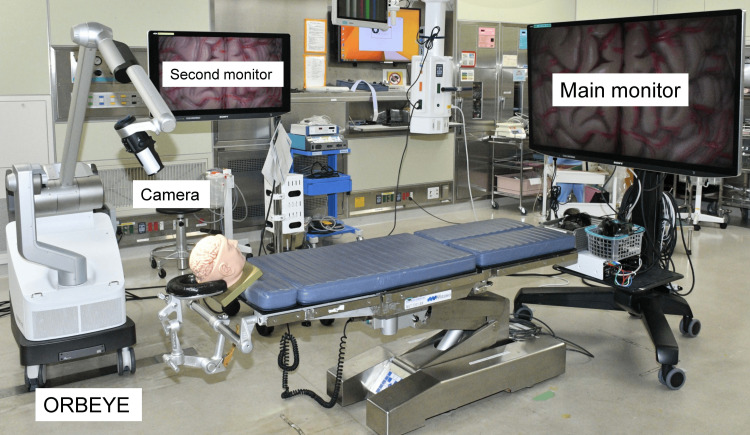
*Figure 1. Operating room setup for the 4K three-dimensional exoscope system.A main large monitor for the primary surgeon is placed at the foot of the operating table. Source: [Microsurgical Resection of Meningiomas Using a 4K Three-Dimensional Exoscope: A Descriptive Observational Study](https://pmc.ncbi.nlm.nih.gov/articles/PMC11694846/) — Cureus 2024; CC BY.*

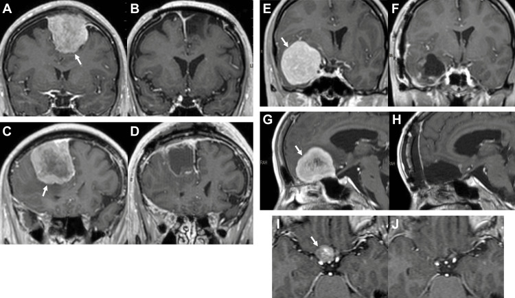
*Figure 2. Representative magnetic resonance images (gadolinium-enhanced T1-weighted images).(A)-(B) Before and after surgery of case 2 in the presence of a left convexity-parasagittal meningioma... Source: [Microsurgical Resection of Meningiomas Using a 4K Three-Dimensional Exoscope: A Descriptive Observational Study](https://pmc.ncbi.nlm.nih.gov/articles/PMC11694846/) — Cureus 2024; CC BY.*

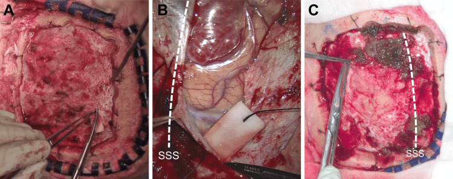
*Figure 3. View of the dural incision for meningioma resections.(A) A macroscopic view of the dural incision to resect a right parietal convexity meningioma in a sample case. This photo was taken... Source: [Microsurgical Resection of Meningiomas Using a 4K Three-Dimensional Exoscope: A Descriptive Observational Study](https://pmc.ncbi.nlm.nih.gov/articles/PMC11694846/) — Cureus 2024; CC BY.*

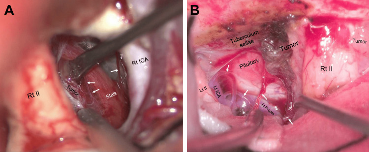
*Figure 4. Visibility of deeply located fine structures during tuberculum sellae meningioma resections.(A) A view of the deep structures during surgery in an exemplar case of a tuberculum sellae... Source: [Microsurgical Resection of Meningiomas Using a 4K Three-Dimensional Exoscope: A Descriptive Observational Study](https://pmc.ncbi.nlm.nih.gov/articles/PMC11694846/) — Cureus 2024; CC BY.*

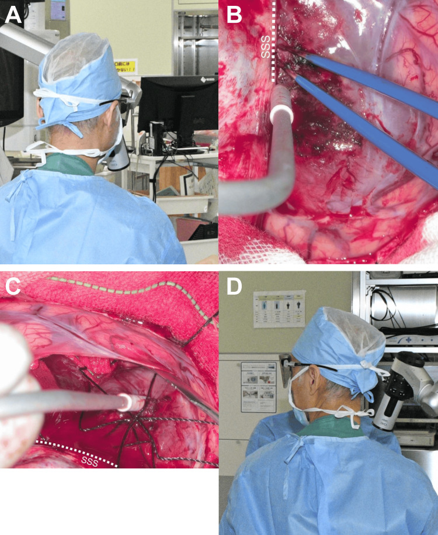
*Figure 5. Surgeon’s head orientation during the surgery using a 4K 3D exoscope for case 3 in the presence of a right frontal parasagittal-falx meningioma.(A)-(B) During the tumor detachment from... Source: [Microsurgical Resection of Meningiomas Using a 4K Three-Dimensional Exoscope: A Descriptive Observational Study](https://pmc.ncbi.nlm.nih.gov/articles/PMC11694846/) — Cureus 2024; CC BY.*

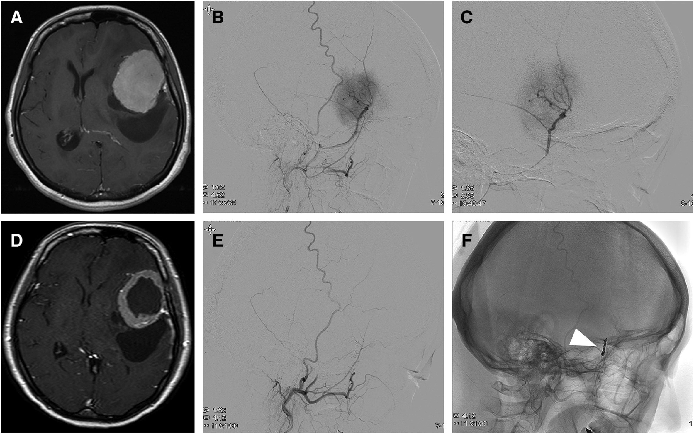
*Fig. 1. A 41-year-old woman with sphenoid ridge meningioma: (A) Pre-embolization gadolinium enhanced T1-weighted image. (B) Lateral view of left external carotid artery angiography. The sole... Source: [Clinicopathologic Factors Associated with Tumor Necrosis after Preoperative Embolization of Meningiomas](https://pmc.ncbi.nlm.nih.gov/articles/PMC10370582/) — Journal of Neuroendovascular Therapy 2021; CC BY-NC-ND.*

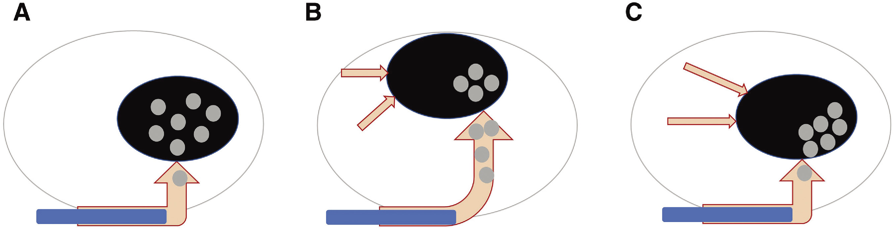
*Fig. 2. Illustrative meningioma model: (A) Convexity meningioma with simple feeder artery. Microsphere penetration throughout the entire tumor is easily achieved. (B) Parasagittal/falx... Source: [Clinicopathologic Factors Associated with Tumor Necrosis after Preoperative Embolization of Meningiomas](https://pmc.ncbi.nlm.nih.gov/articles/PMC10370582/) — Journal of Neuroendovascular Therapy 2021; CC BY-NC-ND.*

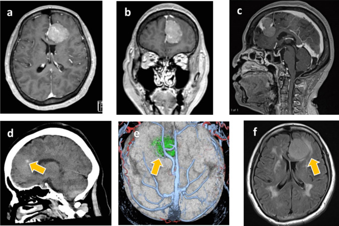
*Fig. 1. Contrast-enhanced MRI axial (a), coronal (b), and sagittal (c) images showed a homogeneous enhanced lesion with a maximum diameter of 35 mm attached at anterior part of the ipsilateral... Source: [Endoscopic-assisted contralateral interhemispheric transfalcine keyhole approach for falcine meningioma: How I do it](https://pmc.ncbi.nlm.nih.gov/articles/PMC11933132/) — Acta Neurochirurgica 2025; CC BY-NC-ND.*

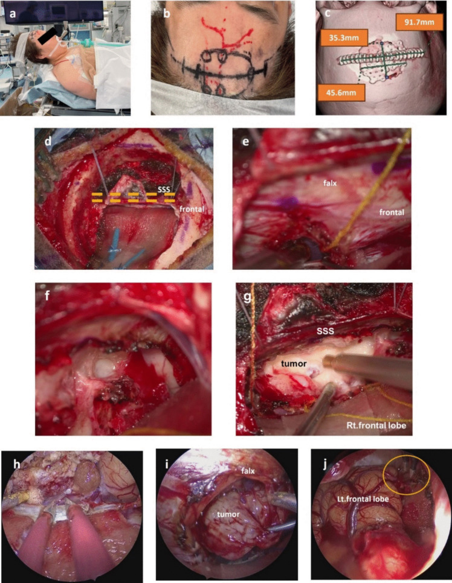
*Fig. 2. The patient was placed in the supine position with the head slightly vertexed up (a), a linear skin incision of about 9 cm was designed (b), and a small craniotomy of about 4 × 3 cm was... Source: [Endoscopic-assisted contralateral interhemispheric transfalcine keyhole approach for falcine meningioma: How I do it](https://pmc.ncbi.nlm.nih.gov/articles/PMC11933132/) — Acta Neurochirurgica 2025; CC BY-NC-ND.*

<!-- END CURATED IMAGE SET -->

---

## History of Present Illness
- Chief complaint: Seizures / contralateral leg weakness (parasagittal motor strip) / headache / cognitive change
- Middle-third tumors → contralateral lower extremity weakness (leg motor cortex is parasagittal)
- Seizure history:

---

## Imaging Review
### MRI (T1+Gad, T2, FLAIR) + MRV
- Location along sagittal sinus: anterior third (anterior to coronal suture), middle third (coronal to lambdoid — motor/sensory), posterior third
- Falcine (arises from falx, may be bilateral) vs parasagittal (involves sinus wall)
- **Sinus involvement (Sindou classification):** degree of SSS wall/lumen invasion — determines whether sinus can be resected/reconstructed
- **MRV:** SSS patency, cortical draining veins, collateral veins (critical — occluded sinus may have vital collaterals)
- Peritumoral edema, brain invasion
- Relationship to motor cortex, central veins

### Navigation
- MRI + MRV loaded; sinus, veins, motor strip mapped

---

## Labs
- CBC, BMP, Coags, **Type and crossmatch (vascular tumors)**

---

## Neurological Examination
- Contralateral leg strength (middle third), full motor/sensory exam, seizures, cognition

---

## Surgical Planning

### Diagnosis & Indication
- Indication: Symptomatic, growing, or large; goal is maximal safe resection
- **Sinus strategy:** If SSS patent and invaded — leave residual on sinus (Simpson II-III) + observe/radiosurgery, OR resect/reconstruct sinus (higher risk). If sinus occluded — may resect involved segment (collaterals carry flow). NEVER occlude a patent posterior two-thirds SSS (venous infarction)

### Position
- Supine (anterior/middle) or prone/lateral (posterior third); head neutral, slightly elevated
- Body positioned to keep surgical site up; reverse Trendelenburg for venous drainage
- Mayfield

### Approach
- Craniotomy crossing midline to expose the SSS and tumor; pre-plan for sinus bleeding
- Bilateral exposure if falcine/bilateral

### Key Surgical Steps
1. Craniotomy exposing the sinus edge (control sinus bleeding with Gelfoam/Surgicel/suture)
2. **Preserve cortical bridging veins** entering the SSS — sacrificing a major vein near motor cortex → venous infarct/weakness
3. Open dura, devascularize tumor from falx/sinus base early
4. Internal debulking (CUSA)
5. Circumferential dissection in arachnoid plane, preserve pial vessels and veins
6. Resect falx attachment; address sinus per strategy (coagulate Simpson II, resect/reconstruct, or leave residual)
7. If sinus reconstruction: primary repair, patch graft, or venous bypass (rarely)
8. Hemostasis, dural reconstruction

### Critical Anatomy & Structures at Risk
1. **Superior sagittal sinus** — torrential bleeding; venous infarction if occluded when patent
2. **Cortical bridging/draining veins** — especially Rolandic veins near motor cortex
3. **Motor cortex (leg area, parasagittal)** — middle third tumors
4. **Pericallosal/callosomarginal arteries** (deep falcine extension)

### Equipment
- Microscope, navigation, CUSA
- Hemostatic agents, Gelfoam, Surgicel, Floseal
- Dural substitute, vascular suture (sinus repair), patch material
- Cell saver

### Monitoring
- SSEPs, MEPs (motor strip), phase reversal for central sulcus localization

### Anesthesia
- Arterial line, crossmatched blood, site up for venous drainage, **VAE precautions** (sinus exposure — precordial Doppler), avoid air embolism

### Potential Complications
1. **Venous infarction** (vein/sinus sacrifice) → leg weakness, hemorrhagic infarct
2. **Air embolism** (open sinus, head up)
3. Major hemorrhage from sinus
4. Motor deficit
5. Residual tumor on sinus (recurrence)

---

## Operative Note Template
**Preoperative Diagnosis:** [Anterior/middle/posterior third] [left/right] parasagittal/falcine meningioma [with superior sagittal sinus involvement]

**Postoperative Diagnosis:** Same

**Procedure:** [Left/Right] [location] parasagittal craniotomy for resection of parasagittal/falcine meningioma [with sinus management]

**Surgeon / Assistant:**
**Anesthesia:** General endotracheal
**EBL / Fluids / Blood products:** [crossmatched; cell saver]
**Adjuncts:** Neuronavigation; SSEP/MEP with phase-reversal for central sulcus; VAE precautions (precordial Doppler)
**Implants:** Dural substitute [± sinus patch/repair]
**Complications:** None

**Indications:** [Age]yo [M/F] with a [middle-third] parasagittal/falcine meningioma [invading the SSS — Sindou grade __] presenting with [contralateral leg weakness/seizures]. The MRV showed [a patent / occluded] sinus with [draining veins]. Risks/benefits/alternatives discussed.

**Description of Procedure:** After consent and time-out, general anesthesia was induced with the surgical site uppermost and in reverse Trendelenburg (to optimize venous drainage and reduce air-embolism risk), and neuromonitoring established. The head was fixed in Mayfield and a craniotomy planned crossing the midline to expose the sinus edge.

The bone flap was elevated carefully over the SSS (epidural hemostatic agents ready for sinus bleeding) and the dura opened, preserving the cortical bridging/Rolandic veins. The tumor base along the falx/sinus was devascularized early, and the tumor was internally debulked (CUSA) and dissected circumferentially in the arachnoid plane, preserving pial vessels and the central veins. The falcine attachment was resected. The sinus was managed by [coagulating involved outer wall (Simpson II) / leaving residual on the patent sinus / resecting and reconstructing the occluded segment]. Motor mapping remained stable.

Hemostasis was obtained, the dura reconstructed, the bone flap replaced, and the scalp closed in layers. The patient was transferred to the ICU [moving the contralateral leg at baseline].

---

## Postoperative Plan
- ICU, neuro checks q1h (**leg strength** for middle third)
- CT head, MRI with gad 24-48h (EOR)
- Monitor for venous infarct (delayed swelling/seizure/weakness days 1-3)
- Seizure prophylaxis, dexamethasone taper, DVT prophylaxis
- If residual on sinus: tumor board, radiosurgery, surveillance MRI
