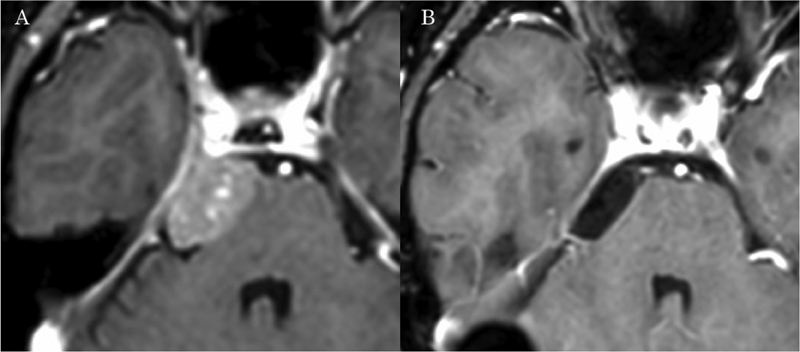
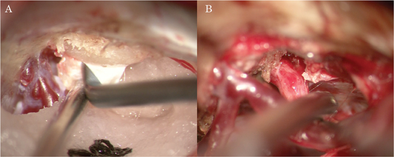
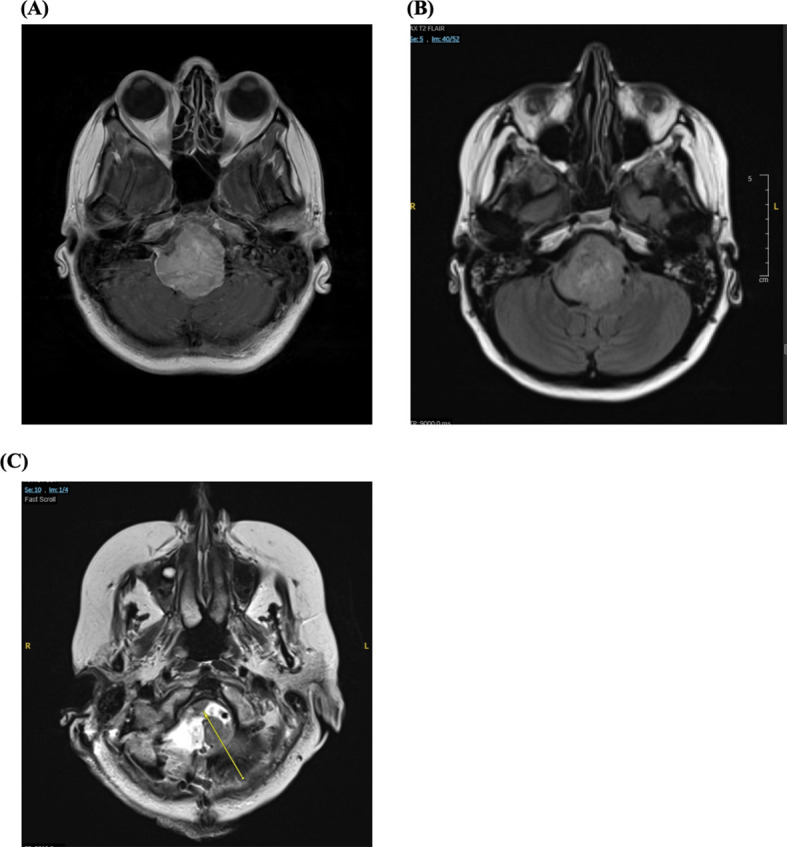
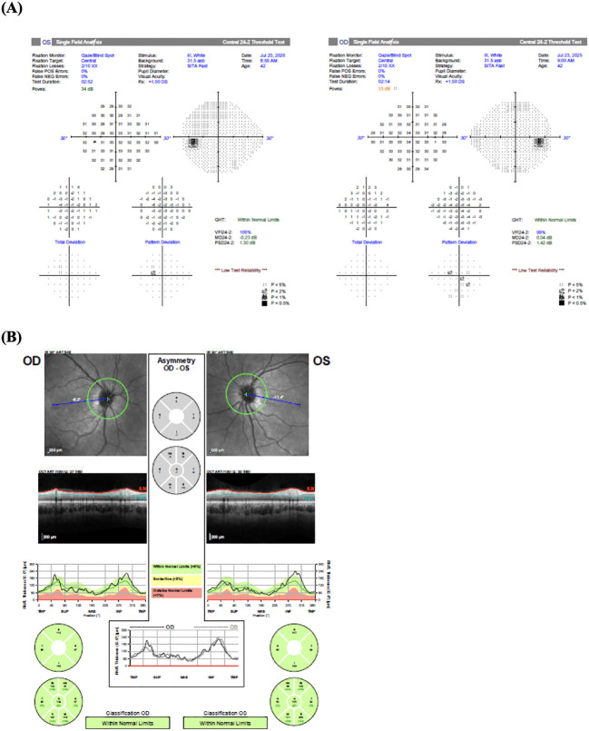
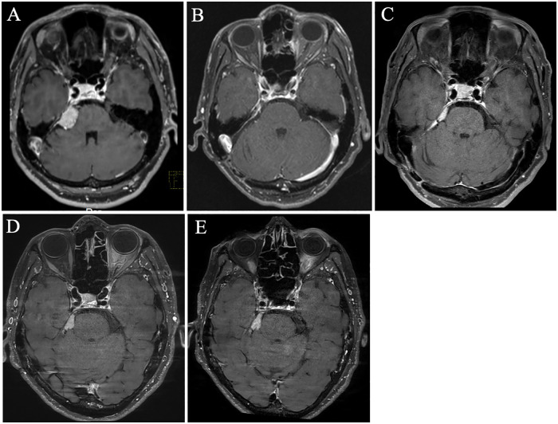
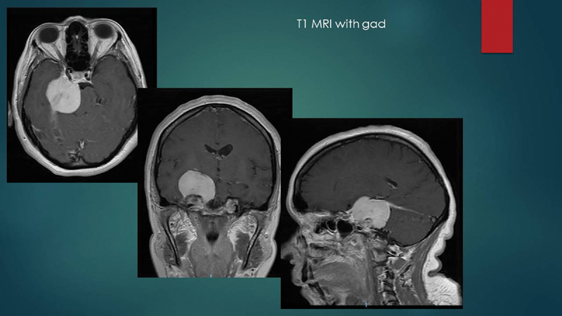
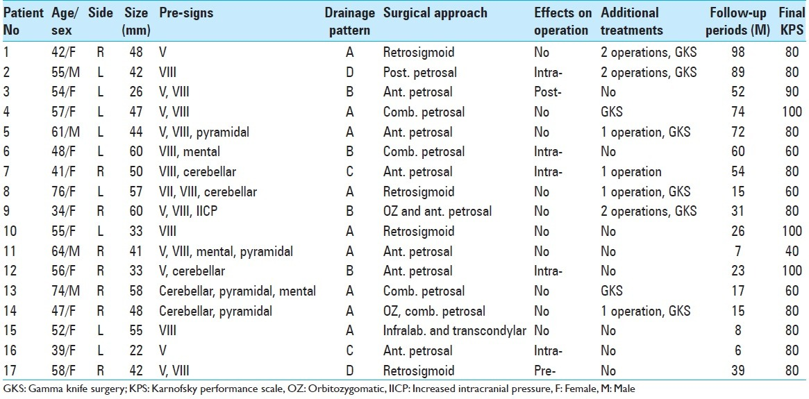
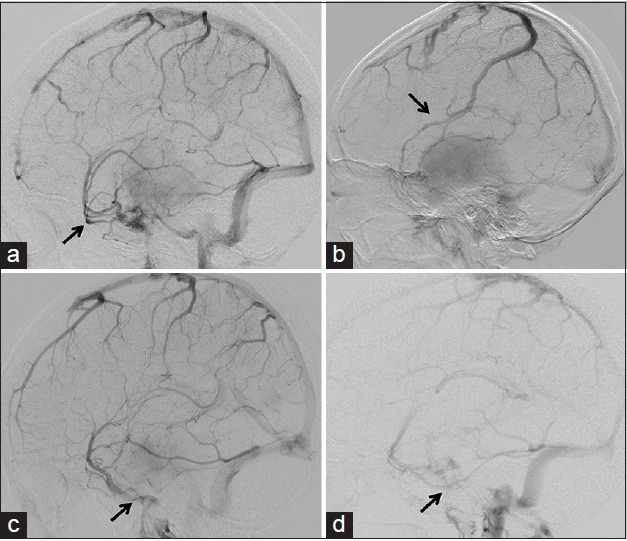
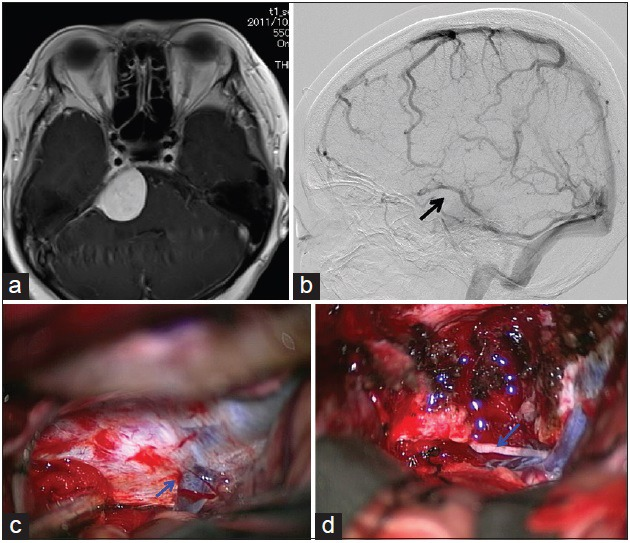
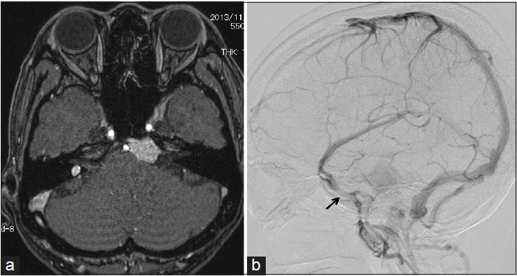

# Case Prep: Petroclival Meningioma Resection

<!-- BEGIN CASE SNAPSHOT -->

## Case / Approach Snapshot

- **Anatomy at risk:** tumor compartment, arterial supply, venous drainage/sinuses, cranial nerves, white-matter tracts, pituitary/CSF pathways when relevant, and functional cortex.
- **Operative steps:** review imaging and goals, choose exposure, obtain brain relaxation, devascularize when possible, debulk internally, dissect capsule from critical structures, verify extent/safety, and reconstruct watertight closure; use the detailed operative sequence and approach notes below as the step-by-step source.
- **Rescue plans:** venous or arterial injury, swelling, seizure, cranial nerve or endocrine change, CSF leak, residual tumor left for safety, staged surgery, radiation, or adjuvant therapy.
- **Figures:** review [Figures, Imaging & Video](#figures-imaging--video) and the [Curated Image Set](#curated-image-set); embedded local figures should remain open-access, public-domain, or otherwise reusable with attribution.
- **Papers:** review [High-Yield Literature](#high-yield-literature) for seminal sources, modern reviews, and outcome data specific to this page.

<!-- END CASE SNAPSHOT -->

## One-Liner
[Age]yo [M/F] with a [size] cm [left/right] petroclival meningioma presenting with [gait ataxia / CN deficits (V, VII, VIII) / headache] planned for [retrosigmoid / anterior petrosectomy (Kawase) / posterior petrosectomy / combined] approach for resection.

---

## Figures, Imaging & Video

**🎥 Operative video** — [search operative video on YouTube ▸](https://www.youtube.com/results?search_query=petroclival+meningioma+surgery) · [The Neurosurgical Atlas ▸](https://www.neurosurgicalatlas.com)

> 🧭 **Operative approach:** [Presigmoid / petrosal approaches](../approaches/presigmoid-petrosal-approach.md) — detailed corridor setup, step-by-step technique & figures

> Operative figures/atlases are © (linked, not copied). See [media-sources.md](../../resources/media-sources.md).
- **Technique/approach:** [The Neurosurgical Atlas](https://www.neurosurgicalatlas.com) — search *"petroclival meningioma"*
- **Imaging:** [Radiopaedia — petroclival meningioma](https://radiopaedia.org/search?q=petroclival%20meningioma&scope=all)
- **Open-access figures:** [PubMed Central](https://www.ncbi.nlm.nih.gov/pmc/?term=petroclival+meningioma)

---

<!-- BEGIN CURATED LITERATURE -->

## High-Yield Literature

- **[Petroclival meningioma]** — Ohata K. No shinkei geka. Neurological surgery 2002. [PubMed](https://pubmed.ncbi.nlm.nih.gov/12428349/)
- **Endoscopic endonasal transclival petroclival meningioma resection** — Magill ST. Neurosurgical focus: Video 2022. [PubMed](https://pubmed.ncbi.nlm.nih.gov/36285000/)
- **Spontaneous regression of a petroclival meningioma: illustrative case** — Noda R. Journal of neurosurgery. Case lessons 2024. [PubMed](https://pubmed.ncbi.nlm.nih.gov/39378522/)
- **The role of stereotactic radiosurgery in the management of petroclival meningioma: a systematic review** — Wijaya JH. Journal of neuro-oncology 2022. [PubMed](https://pubmed.ncbi.nlm.nih.gov/35717468/)
- **Staged Approach for Petroclival Meningioma Resection** — Klironomos G. Journal of neurological surgery. Part B, Skull base 2019. [PubMed](https://pubmed.ncbi.nlm.nih.gov/31143605/)
- **Endoscopic Far-Lateral Supracerebellar Infratentorial Approach for Petroclival Region Meningioma: Surgical Technique and Clinical Experience** — Xie T. Operative neurosurgery (Hagerstown, Md.) 2022. [PubMed](https://pubmed.ncbi.nlm.nih.gov/35315837/)
- **Approach selection for resection of petroclival meningioma** — Jackson C. Neurosurgical focus: Video 2022. [PubMed](https://pubmed.ncbi.nlm.nih.gov/36284998/)
- **Intracranial necrotising sarcoid granulomatosis mimicking petroclival meningioma** — Valappil A. BMJ case reports 2022. [PubMed](https://pubmed.ncbi.nlm.nih.gov/35580943/)
- **Anterior transpetrosal (Kawase) approach for petroclival meningioma with trigeminal neuralgia: case report and literature review** — Dzhindzhikhadze RS. Zhurnal voprosy neirokhirurgii imeni N. N. Burdenko 2023. [PubMed](https://pubmed.ncbi.nlm.nih.gov/37325832/)
- **Retrosigmoid Intradural Suprameatal Approach for Petroclival Meningioma** — Ishi Y. Journal of neurological surgery. Part B, Skull base 2019. [PubMed](https://pubmed.ncbi.nlm.nih.gov/31143599/)

<!-- END CURATED LITERATURE -->

<!-- BEGIN CURATED IMAGE SET -->

## Curated Image Set

Open-access figures are embedded from PubMed Central articles and kept unique to this guide.

*Fig. 1. Pre- and postoperative imaging. (A) Preoperative gadolinium-enhanced T1-weighted imaging (Gd-T1-WI) of magnetic resonance imaging (MRI) presenting with right petroclival meningioma. (B)... Source: [Retrosigmoid Intradural Suprameatal Approach for Petroclival Meningioma](https://pmc.ncbi.nlm.nih.gov/articles/PMC6534698/) — Journal of Neurological Surgery. Part B, Skull Base 2019; CC BY-NC-ND.*

*Fig. 2. Intraoperative view. (A) Exposure of the suprameatal tubercle after lateral suboccipital craniotomy. (B) The operative field after tumor removal, presenting a favorable view around the... Source: [Retrosigmoid Intradural Suprameatal Approach for Petroclival Meningioma](https://pmc.ncbi.nlm.nih.gov/articles/PMC6534698/) — Journal of Neurological Surgery. Part B, Skull Base 2019; CC BY-NC-ND.*

*Figure 1. Axial magnetic resonance images (MRI) demonstrating a large right petroclival meningioma obstructing cerebrospinal fluid (CSF) flow through the fourth ventricle. (A) T1-weighted... Source: [Case Report: Neuro-ophthalmic manifestations of petroclival meningioma](https://pmc.ncbi.nlm.nih.gov/articles/PMC13233223/) — Frontiers in Ophthalmology 2026; CC BY.*

*Figure 2. (A) Humphrey visual field testing demonstrated minimal deviations. (B) Optical coherence tomography showed no evidence of papilledema. Source: [Case Report: Neuro-ophthalmic manifestations of petroclival meningioma](https://pmc.ncbi.nlm.nih.gov/articles/PMC13233223/) — Frontiers in Ophthalmology 2026; CC BY.*

*Figure 1. (A) Gadolinum-enhanced T1-weighted magnetic resonance imaging (MRI) at initial presentation shows a right petroclival meningioma. (B) Postoperative MRI demonstrates no residual tumor in... Source: [Case Report: Intravenous fosphenytoin successfully treated acute exacerbation of secondary trigeminal neuralgia due to petroclival meningioma](https://pmc.ncbi.nlm.nih.gov/articles/PMC13144101/) — Frontiers in Pain Research 2026; CC BY.*

*Fig. 1. MRI T1 + gad demonstrates a sizable petroclival meningioma. MRI, magnetic resonance imaging. Source: [Staged Approach for Petroclival Meningioma Resection](https://pmc.ncbi.nlm.nih.gov/articles/PMC6534681/) — Journal of Neurological Surgery. Part B, Skull Base 2019; CC BY-NC-ND.*

*Figure 7. Source: [Drainage patterns of the superficial middle cerebral vein: Effects on perioperative managements of petroclival meningioma](https://pmc.ncbi.nlm.nih.gov/articles/PMC4538574/) — Surg Neurol Int. 2015 Aug 7;6:130. doi: 10.4103/2152-7806.162483; CC BY-NC-SA.*

*Figure 1. Examples of the four types of superficial middle cerebral vein drainage patterns. (a) Carotid angiogram in venous phase showing the superficial middle cerebral vein draining into the... Source: [Drainage patterns of the superficial middle cerebral vein: Effects on perioperative managements of petroclival meningioma](https://pmc.ncbi.nlm.nih.gov/articles/PMC4538574/) — Surgical Neurology International 2015; CC BY-NC-SA.*

*Figure 2. Example of a case in which the superficial middle cerebral vein was absent. (a) T1-weighted magnetic resonance imaging with contrast medium showing a right petroclival meningioma... Source: [Drainage patterns of the superficial middle cerebral vein: Effects on perioperative managements of petroclival meningioma](https://pmc.ncbi.nlm.nih.gov/articles/PMC4538574/) — Surgical Neurology International 2015; CC BY-NC-SA.*

*Figure 3. Example of a superficial middle cerebral vein connecting to the sphenobasal vein. (a) T1-weighted magnetic resonance imaging with contrast medium showing a left petrocalival meningioma... Source: [Drainage patterns of the superficial middle cerebral vein: Effects on perioperative managements of petroclival meningioma](https://pmc.ncbi.nlm.nih.gov/articles/PMC4538574/) — Surgical Neurology International 2015; CC BY-NC-SA.*

<!-- END CURATED IMAGE SET -->

---

## History of Present Illness
- Chief complaint: Ataxia, trigeminal symptoms, hearing loss, diplopia, facial numbness, headache
- Insidious onset, large at presentation
- CN deficits map to tumor extent (V at petrous apex, VII/VIII at IAC, VI Dorello canal, lower CN at jugular foramen)

---

## Imaging Review
### MRI (T1+Gad, T2, CISS) + MRA/MRV
- Origin medial to CN V at petroclival junction (upper clivus, petrous apex)
- **Brainstem compression/displacement**, pial invasion, T2 cleft (arachnoid plane present?)
- **Basilar artery and branches** encasement
- CN involvement, cavernous sinus/Meckel cave extension
- Venous anatomy (petrosal vein, sinuses)

### CT / CTA
- Petrous bone pneumatization, bony anatomy for petrosectomy, jugular bulb position, sigmoid/transverse sinus dominance

### Audiology
- Baseline audiogram (approach selection, BAER)

---

## Labs
- CBC, BMP, Coags, Type and crossmatch

---

## Neurological Examination
- Full CN exam (II-XII), cerebellar, long tracts, gait

---

## Surgical Planning

### Case Logistics, OR Needs & Orders
- **OR setup:** navigation, endoscope/microscope as approach requires, ENT co-surgeon for endonasal cases, Doppler, lumbar drain only when indicated, reconstruction materials, and visual/endocrine baseline available.
- **Special needs:** steroid strategy individualized (Cushing workup may require avoiding preop steroids), DI/sodium protocol, AM cortisol/endocrine labs, visual-check plan, arterial line for large/vascular cases, and CSF-leak/nasal precautions.
- **Immediate postop orders:** neuro and visual checks, strict I/O with sodium/urine specific gravity schedule when pituitary stalk risk exists, cortisol/endocrine replacement plan, nasal precautions, MRI/CT timing, steroid taper, and DVT prophylaxis timing.

### Approach Selection (complex, often staged/combined)
- **Retrosigmoid:** Workhorse; good for tumors with significant posterior fossa/CPA component; familiar, lower morbidity
- **Anterior petrosectomy (Kawase):** Upper clivus/petrous apex tumors; drills Kawase triangle for petroclival access, preserves hearing
- **Posterior petrosectomy (presigmoid: retrolabyrinthine/translabyrinthine/transcochlear):** Wide petroclival exposure; hearing trade-offs
- **Combined petrosal / staged:** Giant tumors
- Realistic goal often **subtotal resection** + radiosurgery (function preservation prioritized over completeness)

### Position
- Lateral/park bench or supine with head turned; Mayfield; mastoid up

### Key Surgical Steps (Retrosigmoid example)
1. Retrosigmoid craniotomy, expose transverse-sigmoid junction
2. Open dura, drain CSF (cisterna magna), relax cerebellum
3. Identify CN VII/VIII, V, lower CNs; tumor medial to CN V
4. Internal debulking (CUSA/ultrasonic aspirator)
5. Dissect capsule off brainstem in arachnoid plane (T2 cleft); **preserve perforators to brainstem and basilar branches**
6. Dissect off CNs (stimulate VII)
7. Drill petrous apex (Kawase) if anterior extension needs exposure
8. Accept residual on brainstem/basilar/cavernous sinus if no plane → radiosurgery
9. Watertight dural closure, fat graft for air cells, prevent CSF leak

### Critical Anatomy & Structures at Risk
1. **Brainstem and perforators** — pial invasion; perforator injury devastating
2. **Basilar artery and branches (AICA, SCA)** — encasement
3. **Cranial nerves III-XII** (especially V, VI/Dorello, VII, VIII, lower CNs)
4. **Venous sinuses, petrosal vein, jugular bulb**
5. **Labyrinth/cochlea** (hearing, during petrosectomy)

### Equipment
- Microscope, navigation, high-speed drill (petrosectomy), CUSA, ICG
- CN stimulator, fat graft, dural substitute, sealant

### Monitoring
- SSEPs, MEPs, BAER, CN EMG (V, VII, VI, lower CNs)

### Anesthesia
- Arterial line, crossmatched blood, long case, VAE precautions (if semi-sitting), antiemetics

### Potential Complications
1. CN deficits (often multiple) — facial, hearing, swallowing, diplopia
2. Brainstem injury, perforator stroke
3. CSF leak, venous infarction
4. Subtotal resection/recurrence (accept for function)

---

## Operative Note Template
**Preoperative Diagnosis:** [Left/Right] petroclival meningioma with [brainstem compression / CN deficits]

**Postoperative Diagnosis:** Same

**Procedure:** [Left/Right] [retrosigmoid / anterior petrosectomy (Kawase)] approach for resection of petroclival meningioma

**Surgeon / Assistant:**
**Anesthesia:** General endotracheal
**EBL / Fluids / Blood products:** [crossmatched]
**Adjuncts:** Neuronavigation, high-speed drill, CUSA, ICG, CN stimulator; SSEP/MEP/BAER/CN EMG
**Implants:** Dural substitute, fat graft, sealant
**Complications:** None

**Indications:** [Age]yo [M/F] with a petroclival meningioma causing [ataxia/trigeminal symptoms/hearing loss]. Maximal safe resection was planned with function prioritized over completeness; residual to be followed/radiosurgery. Risks (multiple CN deficits, brainstem/perforator injury, CSF leak) discussed.

**Description of Procedure:** After consent and time-out, general anesthesia was induced and neuromonitoring established. The head was fixed and the patient positioned [lateral/park-bench]. A [retrosigmoid craniotomy / anterior petrosectomy with Kawase triangle drilling] was performed and the dura opened with CSF egress to relax the cerebellum.

The cranial nerves (V, VII/VIII, lower CNs) were identified; the tumor lay medial to CN V. The tumor was internally debulked (CUSA) and the capsule dissected off the brainstem in the arachnoid plane (T2 cleft), **preserving brainstem perforators and the basilar/AICA/SCA branches** and dissecting off the cranial nerves with stimulation. Residual densely adherent to the brainstem, basilar, or cavernous sinus was deliberately left for radiosurgery. A watertight dural closure was performed with a fat graft for the drilled air cells and sealant to prevent CSF leak.

The patient was transferred to the ICU with posterior-fossa/CN precautions.

---

## Postoperative Plan
- ICU, neuro checks q1h, **posterior fossa & CN precautions**
- CN assessment (facial HB grade, swallow eval before PO, eye care if VII palsy)
- CT 6h, MRI postop; audiogram
- Antiemetics, steroid taper, DVT prophylaxis
- Residual → radiosurgery, surveillance MRI

<!-- BEGIN CHIEF LEVEL TAKEAWAYS -->

## Chief-Level Case Review

Use these as the senior-level mental model for **Petroclival Meningioma Resection**:

- **Decision point:** Decide the real endpoint before opening: cure, cytoreduction, diagnosis, decompression, separation from critical structures, or safe maximal resection.
- **Technical lever:** Map what must be left behind: perforators, cranial nerves, venous sinuses, eloquent cortex/tracts, hypothalamus/pituitary axis, and adherent capsule planes.
- **Bailout:** Sequence matters: devascularize early when safe, create CSF/working space, debulk before traction, and preserve the arachnoid plane unless oncologic goals justify violating it.
- **Postop watch:** The postop plan should match the risk structure: endocrine/vision/swallow/CN checks, steroid taper, seizure plan, MRI timing, CSF-leak watch, and adjuvant-treatment handoff.

<!-- END CHIEF LEVEL TAKEAWAYS -->

<!-- BEGIN COMMON PIMP QUESTIONS -->

## Common Pimp Questions

Use these to pressure-test preparation for **Petroclival Meningioma Resection**:

1. What is the surgical goal: gross-total, maximal safe, decompression, diagnosis, or cytoreduction?
2. What eloquent cortex, tract, cranial nerve, vessel, or sinus defines the stopping point?
3. What adjunct changes the case: navigation, mapping, 5-ALA, ultrasound, endoscope, ICG, or neuromonitoring?
4. What is the edema, steroid, seizure, DVT, and postop imaging plan?
5. What complication would you check for first in PACU based on this lesion location?

<!-- END COMMON PIMP QUESTIONS -->

<!-- BEGIN ATTENDING PREFERENCE VARIABLES -->

## Attending Preference Variables

Items that commonly vary by surgeon or institution:

- **Extent-of-resection goal and functional stopping points:** [attending-specific]
- **Mapping/monitoring, 5-ALA, ultrasound, ICG, endoscope, or tractography preferences:** [attending-specific]
- **Steroid, antiepileptic, mannitol/hypertonic saline, and antibiotic plan:** [attending-specific]
- **Postop MRI timing, ICU/floor threshold, and adjuvant-referral workflow:** [attending-specific]

<!-- END ATTENDING PREFERENCE VARIABLES -->
