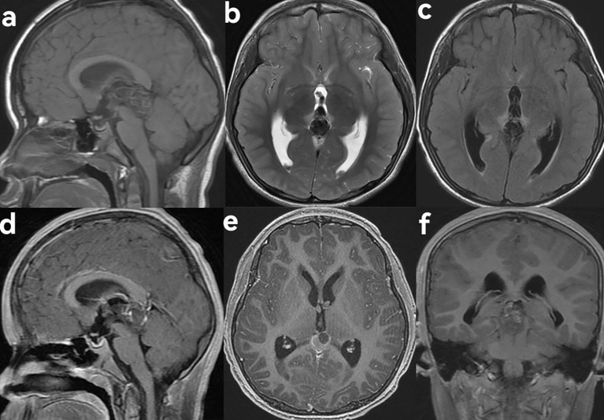
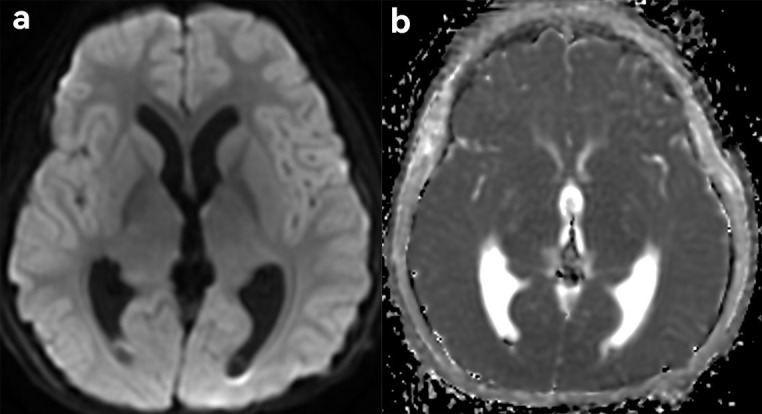
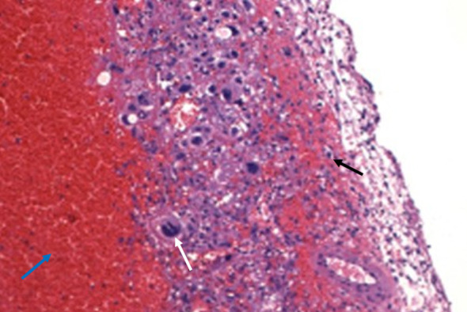
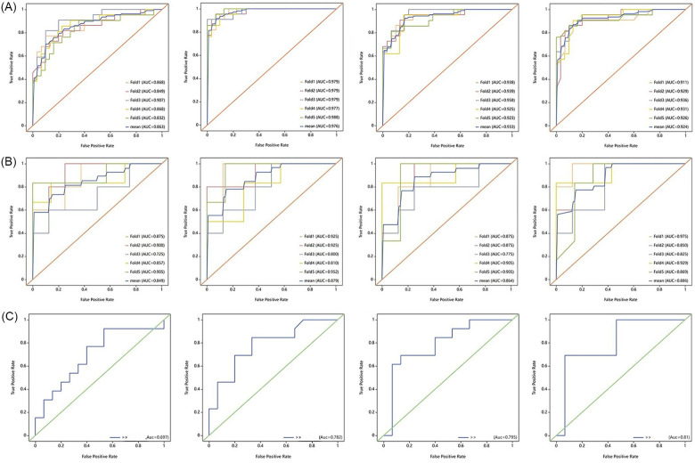
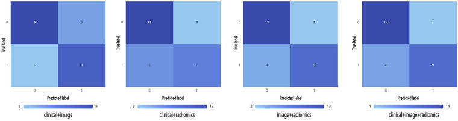
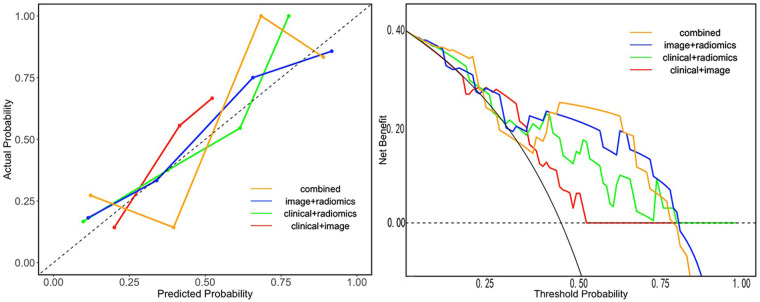
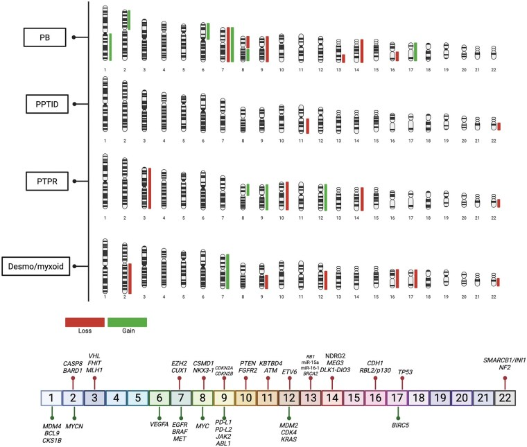
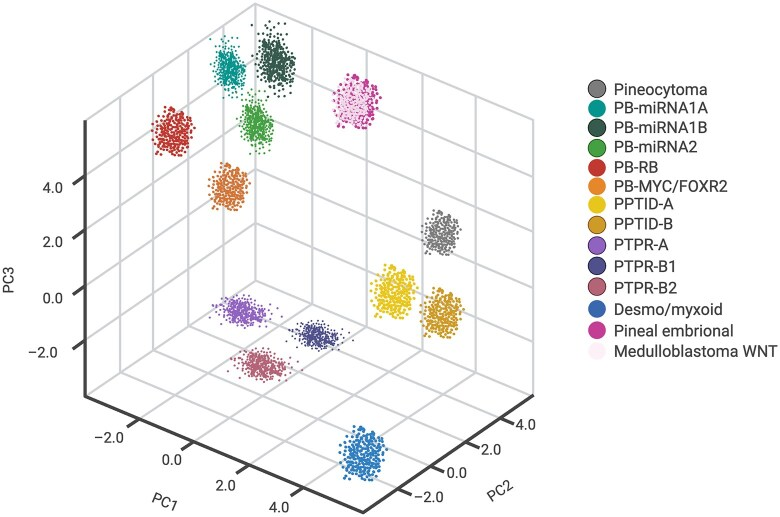
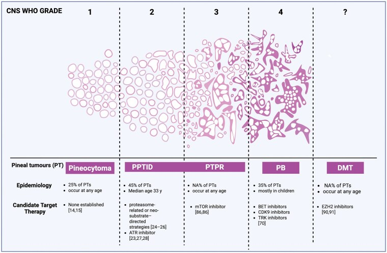
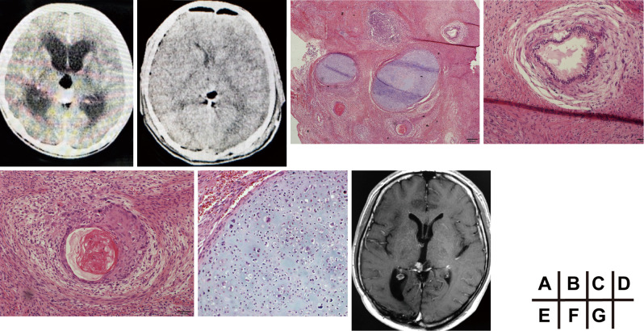

# Case Prep: Pineal Region Tumor Resection

---

<!-- BEGIN CASE SNAPSHOT -->

## Case / Approach Snapshot

- **Anatomy at risk:** tumor compartment, arterial supply, venous drainage/sinuses, cranial nerves, white-matter tracts, pituitary/CSF pathways when relevant, and functional cortex.
- **Operative steps:** review imaging and goals, choose exposure, obtain brain relaxation, devascularize when possible, debulk internally, dissect capsule from critical structures, verify extent/safety, and reconstruct watertight closure; use the detailed operative sequence and approach notes below as the step-by-step source.
- **Rescue plans:** venous or arterial injury, swelling, seizure, cranial nerve or endocrine change, CSF leak, residual tumor left for safety, staged surgery, radiation, or adjuvant therapy.
- **Figures:** review [Figures, Imaging & Video](#figures-imaging--video) and the [Curated Image Set](#curated-image-set); embedded local figures should remain open-access, public-domain, or otherwise reusable with attribution.
- **Papers:** review [High-Yield Literature](#high-yield-literature) for seminal sources, modern reviews, and outcome data specific to this page.
- **Textbook cross-checks:** use [Textbook Cross-Checks](#textbook-cross-checks) and the [Source Crosswalk](../../resources/source-crosswalk.md) to cite copyrighted textbooks/atlases while summarizing in original words.

<!-- END CASE SNAPSHOT -->

## One-Liner
[Age]yo [M/F] with a pineal region tumor presenting with [Parinaud syndrome / hydrocephalus / headache] planned for [supracerebellar infratentorial / occipital transtentorial] approach for resection [after CSF diversion and tumor marker workup].

---

## Figures, Imaging & Video

**🎥 Operative video** — [search operative video on YouTube ▸](https://www.youtube.com/results?search_query=pineal+region+tumour+surgery) · [The Neurosurgical Atlas ▸](https://www.neurosurgicalatlas.com)

> 🧭 **Operative approach:** [Supracerebellar-infratentorial approach](../approaches/supracerebellar-infratentorial-approach.md) — detailed corridor setup, step-by-step technique & figures

[Neurosurgical Atlas](https://www.neurosurgicalatlas.com) · [Radiopaedia](https://radiopaedia.org/search?q=pineal%20region%20tumour&scope=all) · [PubMed Central](https://www.ncbi.nlm.nih.gov/pmc/?term=pineal+region+tumor) — operative figures © linked; see [media-sources.md](../../resources/media-sources.md)

---

<!-- BEGIN TEXTBOOK CROSS-CHECKS -->

## Textbook Cross-Checks

- **Tumor and skull-base anatomy:** Youmans and Winn; Schmidek and Sweet; Rhoton Cranial Anatomy; Brain Anatomy and Neurosurgical Approaches — confirm compartment, dural/vascular supply, cranial nerves, venous sinuses, white-matter tracts, and safe surgical corridors.
- **Oncologic strategy:** CNS Radiation Oncology Principles and Practice; Youmans and Winn; Greenberg — summarize goals of resection, adjuvant-therapy context, surveillance, and when subtotal resection is safer.
- **Complication rescue:** Schmidek and Sweet; Greenberg — review edema, seizure, venous injury, endocrinopathy/CSF leak, neurologic deficit, and reconstruction issues.
- **Copyright-safe use:** cite these sources as private cross-checks, then write the guide content in original words; do not re-host textbook pages, figures, tables, or board-review card material. See [Source Crosswalk & Copyright-Safe Use](../../resources/source-crosswalk.md).

<!-- END TEXTBOOK CROSS-CHECKS -->

<!-- BEGIN CURATED LITERATURE -->

## High-Yield Literature

- **History of the pineal region tumor** — Mottolese C. Neuro-Chirurgie 2015. [PubMed](https://pubmed.ncbi.nlm.nih.gov/25016433/)
- **Pineal region tumor: surgical anatomy and approach** — Yamamoto I. Journal of neuro-oncology 2001. [PubMed](https://pubmed.ncbi.nlm.nih.gov/11767292/)
- **Desmoplastic myxoid tumor of the pineal region, SMARCB1 mutant: illustrative case** — Zhou C. Journal of neurosurgery. Case lessons 2024. [PubMed](https://pubmed.ncbi.nlm.nih.gov/39586083/)
- **Papillary tumor of the pineal region in pediatric populations: An additional case and systematic review of a rare tumor entity** — Mathkour M. Clinical neurology and neurosurgery 2021. [PubMed](https://pubmed.ncbi.nlm.nih.gov/33360024/)
- **Neurosurgical application of pineal region tumor resection with 3D 4K exoscopy via infratentorial approach: a retrospective cohort study** — Hua W. International journal of surgery (London, England) 2023. [PubMed](https://pubmed.ncbi.nlm.nih.gov/37755386/)
- **Surgical corridor formation by minimally invasive lateral occipital infracortical supra-/transtentorial (OICST) approach in pineal region tumor surgery: A review of 11 cases** — Staribacher D. Clinical neurology and neurosurgery 2024. [PubMed](https://pubmed.ncbi.nlm.nih.gov/38091704/)
- **Interhemispheric transcallosal intervenous approach to a pineal region tumor** — Donoho DA. Neurosurgical focus: Video 2021. [PubMed](https://pubmed.ncbi.nlm.nih.gov/36284903/)
- **Intraoperative Imprint Cytology of SMARCB1-Mutant Desmoplastic Myxoid Tumor of the Pineal Region: A Case Report with Cytologic Differential Diagnosis and Literature Review** — Kinoshita Y. Annals of clinical and laboratory science 2026. [PubMed](https://pubmed.ncbi.nlm.nih.gov/42259547/)
- **Microsurgical Management of Pineal Region Tumors** — Ji X. World neurosurgery 2024. [PubMed](https://pubmed.ncbi.nlm.nih.gov/39032641/)
- **Pure endoscopic resection of pineal region tumors through supracerebellar infratentorial approach with 'head-up' park-bench position** — Hua W. Neurological research 2023. [PubMed](https://pubmed.ncbi.nlm.nih.gov/36509700/)

<!-- END CURATED LITERATURE -->

---

<!-- BEGIN CURATED IMAGE SET -->

## Curated Image Set

Open-access figures are embedded from PubMed Central articles and kept unique to this guide.

*Figure 2. MRI findings of pineal region choriocarcinoma in a 9-year-old male patient presenting with dizziness and headache. (a) Sagittal T1WI showed a slightly hyperintense mass in the pineal... Source: [Case Report: Primary choriocarcinoma of the pineal region](https://pmc.ncbi.nlm.nih.gov/articles/PMC13259689/) — Frontiers in Oncology 2026; CC BY.*

*Figure 3. Diffusion-weighted imaging features (DWI). (a) On DWI, the solid component of the lesion appeared hypointense. (b) On apparent diffusion coefficient (ADC) mapping, the solid component... Source: [Case Report: Primary choriocarcinoma of the pineal region](https://pmc.ncbi.nlm.nih.gov/articles/PMC13259689/) — Frontiers in Oncology 2026; CC BY.*

*Figure 4. Pathological findings. Hemorrhage (blue arrow) and necrosis were observed within the lesion, with visible syncytiotrophoblasts (white arrow) and cytotrophoblasts (black arrow) showing... Source: [Case Report: Primary choriocarcinoma of the pineal region](https://pmc.ncbi.nlm.nih.gov/articles/PMC13259689/) — Frontiers in Oncology 2026; CC BY.*

*Figure 2. The ROC of the four combined models. (A) Performance of ROC curves for clinical + imaging semantic model, clinical + radiomics model, imaging semantic + radiomics model, and clinical +... Source: [Machine learning based on radiomics for discriminating sellar region langerhans cell histiocytosis from germ cell tumors](https://pmc.ncbi.nlm.nih.gov/articles/PMC13153032/) — Frontiers in Pediatrics 2026; CC BY.*

*Figure 3. Confusion matrix of the four combined models. Source: [Machine learning based on radiomics for discriminating sellar region langerhans cell histiocytosis from germ cell tumors](https://pmc.ncbi.nlm.nih.gov/articles/PMC13153032/) — Frontiers in Pediatrics 2026; CC BY.*

*Figure 4. The decision curves and calibration curves of the four combined models. Source: [Machine learning based on radiomics for discriminating sellar region langerhans cell histiocytosis from germ cell tumors](https://pmc.ncbi.nlm.nih.gov/articles/PMC13153032/) — Frontiers in Pediatrics 2026; CC BY.*

*Figure 1.. Cytogenetic landscape of pineal parenchymal tumors. Representative chromosomal ideograms illustrating recurrent copy-number alterations (CNAs) across major pineal tumor subtypes,... Source: [Genetic landscape and molecular targets in pediatric pineal tumors](https://pmc.ncbi.nlm.nih.gov/articles/PMC13124280/) — Neuro-Oncology Advances 2026; CC BY.*

*Figure 2.. Schematic overview of epigenetic clustering of pineal parenchymal tumors and related embryonal entities. This figure provides an illustrative summary of DNA methylation-based... Source: [Genetic landscape and molecular targets in pediatric pineal tumors](https://pmc.ncbi.nlm.nih.gov/articles/PMC13124280/) — Neuro-Oncology Advances 2026; CC BY.*

*Figure 3.. Spectrum of pineal region tumors across WHO grades, epidemiological features, and candidate targeted therapies. Schematic overview of pineal parenchymal tumor entities according to CNS... Source: [Genetic landscape and molecular targets in pediatric pineal tumors](https://pmc.ncbi.nlm.nih.gov/articles/PMC13124280/) — Neuro-Oncology Advances 2026; CC BY.*

*Figure 1. Preoperative imaging and initial histopathology.(A) Axial non-contrast CT showing a pineal region mass with acute obstructive hydrocephalus.(B) Postoperative non-contrast CT showing the... Source: [An Ultra-late Recurrence with Adenoid Cystic Carcinoma-like Malignant Transformation of a Pineal Immature Teratoma after 35 Years: A Case Report](https://pmc.ncbi.nlm.nih.gov/articles/PMC13102526/) — NMC Case Report Journal 2026; CC BY-NC-ND.*

<!-- END CURATED IMAGE SET -->

---

## History of Present Illness
- Chief complaint: Headache, **Parinaud syndrome** (upgaze palsy, convergence-retraction nystagmus, light-near dissociation), hydrocephalus symptoms
- **Tumor markers and hydrocephalus management precede resection**
- Differential: germ cell tumors (germinoma — radiosensitive; teratoma), pineal parenchymal (pineocytoma/pineoblastoma), gliomas, meningioma

---

## Imaging Review
### MRI (T1±Gad, T2) + full neuraxis (germ cell/pineoblastoma — drop mets)
- Pineal region mass, **aqueduct compression/hydrocephalus**
- Relationship to deep venous system (internal cerebral veins, vein of Galen, basal veins, precentral cerebellar vein)
- Tentorial incisura, midbrain tectum, splenium

### Workup — CRITICAL BEFORE SURGERY
- **Serum + CSF tumor markers: AFP, beta-hCG** (elevated → non-germinomatous germ cell tumor → chemo/RT, may avoid resection; pure germinoma → biopsy + RT/chemo)
- CSF cytology
- If markers diagnostic → may treat without resection

---

## Labs
- CBC, BMP, Coags, **AFP, beta-hCG (serum)**, Type and crossmatch

---

## Neurological Examination
- Eye movements (upgaze, convergence, pupils), papilledema, ataxia, mental status

---

## Surgical Planning

### Hydrocephalus & Diagnosis First
- **ETV** (treats hydrocephalus + allows endoscopic biopsy + CSF markers/cytology) OR EVD
- Tissue diagnosis guides whether resection needed (germinoma → RT, not resection)

### Approach Selection
- **Supracerebellar infratentorial (Krause):** Midline, below deep veins, natural corridor above cerebellum under tentorium — workhorse for pineal tumors below the venous complex; sitting/Concorde/prone
- **Occipital transtentorial (Poppen):** For tumors extending supratentorially or above/lateral to venous complex; lateral to deep veins
- Paramedian supracerebellar variant to avoid midline bridging veins

### Position
- Supracerebellar: **sitting** (gravity drops cerebellum — ideal) or Concorde/prone; Mayfield, neck flexed
- Occipital transtentorial: lateral or prone, occipital lobe retracted (gravity)

### Key Surgical Steps (Supracerebellar Infratentorial)
1. Midline suboccipital craniotomy above to expose transverse sinus/torcula
2. Open dura, **divide bridging veins** from cerebellum to tentorium (paramedian variant preserves midline vermian veins)
3. Let cerebellum fall away (gravity), develop supracerebellar corridor under tentorium
4. Open arachnoid of quadrigeminal cistern; identify precentral cerebellar vein (may coagulate), vein of Galen complex above
5. **Stay below the deep venous system**
6. Debulk tumor (CUSA), dissect off tectum/midbrain, internal cerebral veins, vein of Galen
7. Preserve deep veins; accept residual if adherent to veins/midbrain
8. Hemostasis, watertight closure

### Critical Anatomy & Structures at Risk
1. **Deep venous system** — internal cerebral veins, vein of Galen, basal vein of Rosenthal, precentral cerebellar vein — injury catastrophic (venous infarction/hemorrhage)
2. **Midbrain tectum (quadrigeminal plate)** — Parinaud, oculomotor
3. **Cerebellum, vermis**

### Equipment
- Microscope, navigation, CUSA, ICG
- Endoscope (ETV/biopsy), EVD kit
- Hemostatic agents, dural substitute

### Monitoring
- SSEPs, MEPs; precordial Doppler (sitting — VAE)

### Anesthesia
- Arterial line, **VAE precautions (sitting)** — central line, Doppler, end-tidal CO2; crossmatched blood; antiemetics

### Potential Complications
1. **Venous infarction/hemorrhage** (deep veins) — major mortality source
2. Worsened Parinaud/oculomotor, ataxia
3. VAE (sitting), hydrocephalus, hemorrhage into residual
4. Pineal apoplexy

---

## Operative Note Template
**Preoperative Diagnosis:** Pineal region tumor with [Parinaud syndrome / obstructive hydrocephalus]

**Postoperative Diagnosis:** Same (pending pathology)

**Procedure:** [Supracerebellar infratentorial / occipital transtentorial] approach for resection of pineal region tumor [following ETV/EVD]

**Surgeon / Assistant:**
**Anesthesia:** General endotracheal
**EBL / Fluids:**
**Adjuncts:** Neuronavigation, CUSA, ICG, SSEP/MEP; [VAE precautions if sitting]
**Implants:** Dural substitute; [EVD]
**Complications:** None

**Indications:** [Age]yo [M/F] with a pineal region tumor and [hydrocephalus]. Serum/CSF tumor markers (AFP, beta-hCG) were [non-diagnostic, warranting resection] and hydrocephalus was managed with [ETV/EVD]. Risks (deep venous injury, Parinaud worsening, VAE) discussed.

**Description of Procedure:** After consent and time-out, general anesthesia was induced [with VAE precautions for the sitting position], and neuromonitoring established. [A prior ETV/EVD had been performed for CSF diversion and markers.] The patient was positioned [sitting/Concorde/prone] in Mayfield, and a midline suboccipital craniotomy performed exposing the transverse sinus/torcula.

The dura was opened and, via the supracerebellar infratentorial corridor, bridging veins from the cerebellum to the tentorium were divided as the cerebellum fell away, developing the corridor **below the deep venous system**. The quadrigeminal cistern arachnoid was opened, and the tumor debulked (CUSA) and dissected off the tectum, **preserving the internal cerebral veins, vein of Galen, and basal veins**; residual adherent to the deep veins/midbrain was left. [Occipital transtentorial: the occipital lobe was retracted with gravity and the tentorium divided to access supratentorial extension lateral to the deep veins.]

Hemostasis was obtained, a watertight closure performed, and the patient transferred to the ICU.

---

## Postoperative Plan
- ICU, neuro checks q1h, eye movement exam
- CT 6h (hemorrhage), MRI postop; EVD/ETV management
- VAE monitoring if sitting used
- Pathology → tumor board: germinoma (RT/chemo), NGGCT (chemo+RT), pineal parenchymal/glioma per grade; neuraxis staging
- Antiemetics, steroid taper, DVT prophylaxis
