# Case Prep: Pituitary Adenoma — Endoscopic Endonasal Transsphenoidal Approach

---

## One-Liner
[Age]yo [M/F] with a [size] cm [functioning/non-functioning] pituitary [micro/macro]adenoma presenting with [visual loss/headaches/endocrinopathy/apoplexy] planned for endoscopic endonasal transsphenoidal resection.

---

## Figures, Imaging & Video

**🎥 Operative videos & resources**
- **Atlas / approach:** [Endoscopic endonasal approach chapter](https://www.neurosurgicalatlas.com/volumes/cranial-base-surgery/endoscopic-endonasal-approach) — nasal phase, sphenoidotomy, sellar opening, tumor removal, and reconstruction
- **Video searches:** [endoscopic transsphenoidal pituitary adenoma on YouTube](https://www.youtube.com/results?search_query=endoscopic+transsphenoidal+pituitary+adenoma+surgery) · [pituitary adenoma endonasal resection operative video](https://www.youtube.com/results?search_query=pituitary+adenoma+endonasal+resection+operative+video)
- **Imaging/endocrine review:** [Radiopaedia — pituitary adenoma](https://radiopaedia.org/search?q=pituitary%20adenoma&scope=all) · [PubMed Central — endoscopic transsphenoidal pituitary adenoma](https://www.ncbi.nlm.nih.gov/pmc/?term=endoscopic+transsphenoidal+pituitary+adenoma)

> 🧭 **Operative approach:** [Endoscopic endonasal approach](../approaches/endoscopic-endonasal-approach.md) — detailed corridor setup, step-by-step technique & figures

> Copyrighted operative figures/videos are linked, not copied. Embedded figures below are public-domain or CC-BY; see [media-sources.md](../../resources/media-sources.md) and [CREDITS.md](../../figures/CREDITS.md).

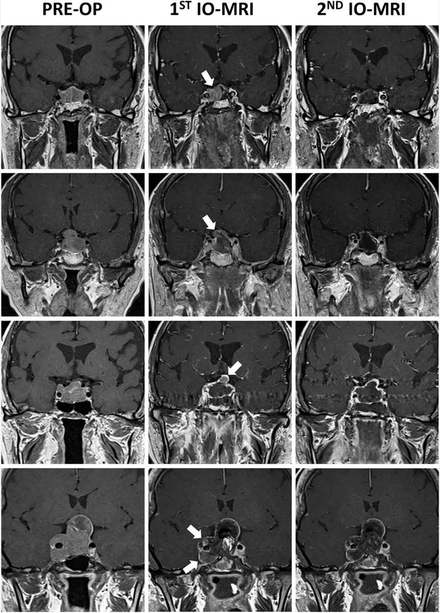

*Macroadenoma with cavernous-sinus / suprasellar extension; intraoperative MRI detecting residual tumor (arrows). Source: Celtikci et al., Front Oncol 2021;11:733838, Fig 1. CC BY 4.0.*

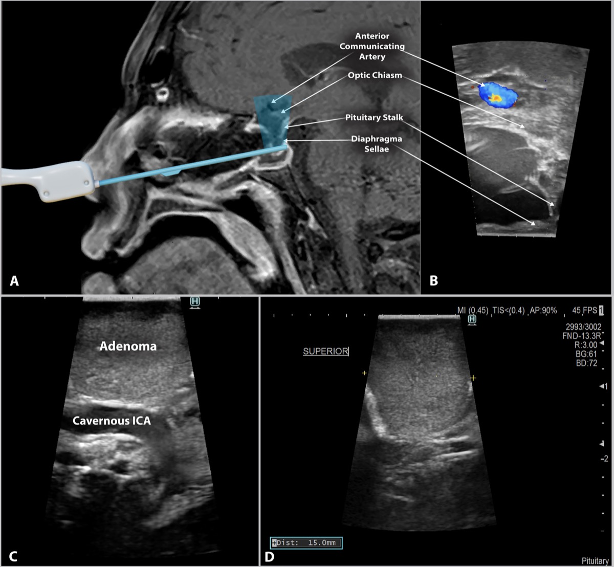

*Intraoperative ultrasound during endonasal resection localizing the cavernous ICA and tumor margin. Source: Baker et al., Front Oncol 2022;12:1043697, Fig 1. CC BY 4.0.*

---

<!-- BEGIN TEXTBOOK CROSS-CHECKS -->

## Textbook Cross-Checks

- **Tumor and skull-base anatomy:** Youmans and Winn; Schmidek and Sweet; Rhoton Cranial Anatomy; Brain Anatomy and Neurosurgical Approaches — confirm compartment, dural/vascular supply, cranial nerves, venous sinuses, white-matter tracts, and safe surgical corridors.
- **Oncologic strategy:** CNS Radiation Oncology Principles and Practice; Youmans and Winn; Greenberg — summarize goals of resection, adjuvant-therapy context, surveillance, and when subtotal resection is safer.
- **Complication rescue:** Schmidek and Sweet; Greenberg — review edema, seizure, venous injury, endocrinopathy/CSF leak, neurologic deficit, and reconstruction issues.
- **Copyright-safe use:** cite these sources as private cross-checks, then write the guide content in original words; do not re-host textbook pages, figures, tables, or board-review card material. See [Source Crosswalk & Copyright-Safe Use](../../resources/source-crosswalk.md).

<!-- END TEXTBOOK CROSS-CHECKS -->

<!-- BEGIN CURATED LITERATURE -->

## High-Yield Literature

- **Comparison of endoscopic and endoscope-assisted microscopic transsphenoidal surgery for pituitary adenoma resection: a prospective randomized study** — Eördögh M. Frontiers in endocrinology 2025. [PubMed](https://pubmed.ncbi.nlm.nih.gov/40766292/)
- **Giant Pituitary Adenoma - Special Considerations** — Tang OY. Otolaryngologic clinics of North America 2022. [PubMed](https://pubmed.ncbi.nlm.nih.gov/35365313/)
- **Endoscopic endonasal surgery for pituitary adenomas** — Cappabianca P. World neurosurgery 2014. [PubMed](https://pubmed.ncbi.nlm.nih.gov/25496632/)
- **Surgical Anatomy Applied to the Resection of Craniopharyngiomas: Anatomic Compartments and Surgical Classifications** — Almeida JP. World neurosurgery 2020. [PubMed](https://pubmed.ncbi.nlm.nih.gov/32987617/)
- **Endoscopic endonasal transsphenoidal approach: outcome analysis of 100 consecutive procedures** — Cappabianca P. Minimally invasive neurosurgery : MIN 2002. [PubMed](https://pubmed.ncbi.nlm.nih.gov/12494353/)
- **Endoscopic endonasal transsphenoidal removal of recurrent and regrowing pituitary adenomas: experience on a 59-patient series** — Cavallo LM. World neurosurgery 2013. [PubMed](https://pubmed.ncbi.nlm.nih.gov/23046913/)
- **Surgical complications associated with the endoscopic endonasal transsphenoidal approach for pituitary adenomas** — Cappabianca P. Journal of neurosurgery 2002. [PubMed](https://pubmed.ncbi.nlm.nih.gov/12186456/)
- **Endoscopic endonasal pituitary surgery: surgical and outcome analysis of 50 cases** — Charalampaki P. Journal of clinical neuroscience : official journal of the Neurosurgical Society of Australasia 2007. [PubMed](https://pubmed.ncbi.nlm.nih.gov/17386368/)
- **Surgical Nuances of Endoscopic Endonasal Resection of Craniopharyngiomas: 2-Dimensional Operative Video** — Almeida JP. Operative neurosurgery (Hagerstown, Md.) 2020. [PubMed](https://pubmed.ncbi.nlm.nih.gov/31828350/)
- **Endoscopic anatomy of sphenoid sinus for pituitary surgery** — Unlu A. Clinical anatomy (New York, N.Y.) 2008. [PubMed](https://pubmed.ncbi.nlm.nih.gov/18816443/)

<!-- END CURATED LITERATURE -->

---

<!-- BEGIN CURATED IMAGE SET -->

## Curated Image Set

Open-access figures are embedded from PubMed Central articles and kept unique to this guide.

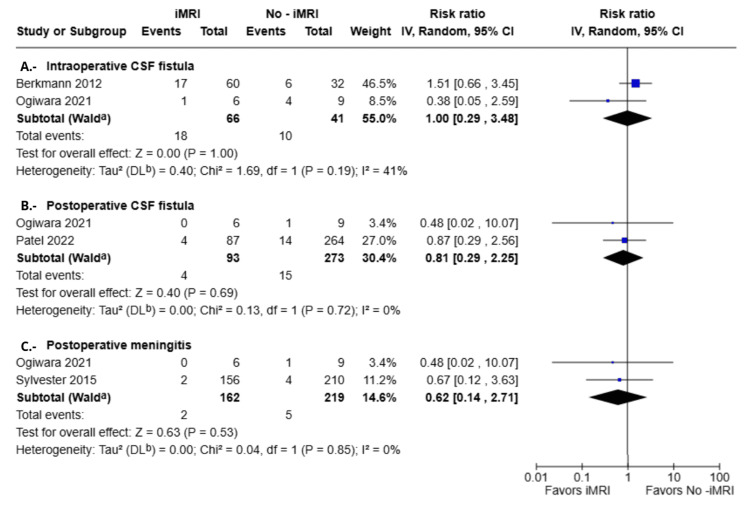
*Figure 5. Forest plots of surgical complications comparing iMRI and non-iMRI groupsBerkmann et al., 2012 [21], Ogiwara et al., 2021 [19], Patel et al., 2022 [18], Sylvester et al., 2015 [20]Forest... Source: [Impact of Intraoperative MRI on Outcomes in Pituitary Adenoma Surgery: A Systematic Review and Meta-Analysis](https://pmc.ncbi.nlm.nih.gov/articles/PMC13061346/) — Cureus 2026; CC BY.*

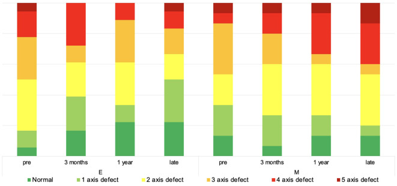
*Figure 1. Anterior pituitary lobe function over time. The diagram depicts the non-continuous development of anterior pituitary lobe function over time. Source: [Comparison of endoscopic and endoscope-assisted microscopic transsphenoidal surgery for pituitary adenoma resection: a prospective randomized study](https://pmc.ncbi.nlm.nih.gov/articles/PMC12322937/) — Frontiers in Endocrinology 2025; CC BY.*

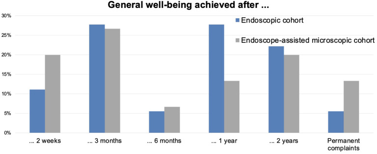
*Figure 2. Achievement of overall well-being over time. The diagram depicts the non-continuous time point when symptom-free well-being was achieved. The values are in %. Source: [Comparison of endoscopic and endoscope-assisted microscopic transsphenoidal surgery for pituitary adenoma resection: a prospective randomized study](https://pmc.ncbi.nlm.nih.gov/articles/PMC12322937/) — Frontiers in Endocrinology 2025; CC BY.*

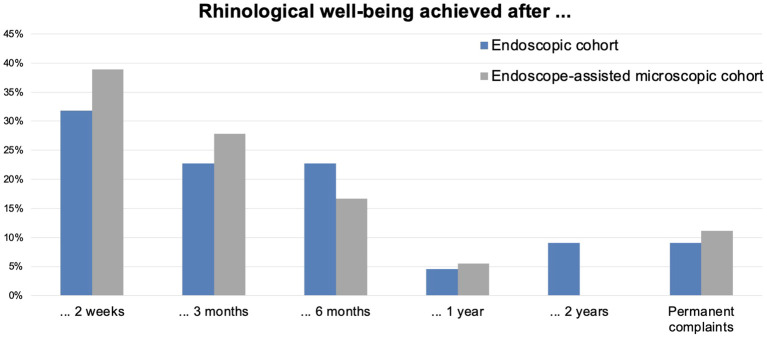
*Figure 3. Achievement of rhinological well-being over time. The diagram depicts the non-continuous time point when symptom-free well-being was achieved. The values are in %. Source: [Comparison of endoscopic and endoscope-assisted microscopic transsphenoidal surgery for pituitary adenoma resection: a prospective randomized study](https://pmc.ncbi.nlm.nih.gov/articles/PMC12322937/) — Frontiers in Endocrinology 2025; CC BY.*

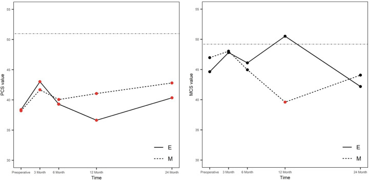
*Figure 4. Mental and physical scores of SF-36 over time. E, endoscopic group; M, microsurgical group; MCS, mental component summary score; PCS, physical component summary score; continuous line,... Source: [Comparison of endoscopic and endoscope-assisted microscopic transsphenoidal surgery for pituitary adenoma resection: a prospective randomized study](https://pmc.ncbi.nlm.nih.gov/articles/PMC12322937/) — Frontiers in Endocrinology 2025; CC BY.*

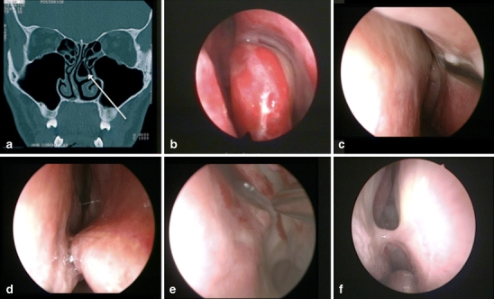
*Fig. 1. Examples of endonasal anatomical variations that required surgical correction. a Coronal CT-scan with a left bullous middle turbinate, b left endonasal bullous middle turbinate, c left... Source: [Variations of endonasal anatomy: relevance for the endoscopic endonasal transsphenoidal approach](https://pmc.ncbi.nlm.nih.gov/articles/PMC2872017/) — Acta Neurochirurgica 2010; CC BY-NC.*

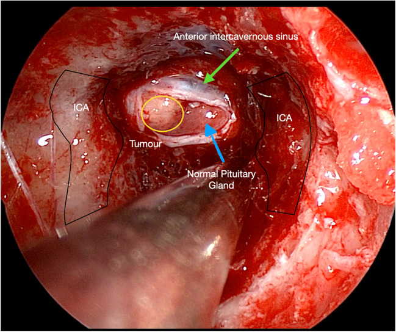
*Fig. 1. An endoscopic view showing essential intra-sphenoidal anatomy. Internal Carotid arteries (ICA), a right-sided pituitary microadenoma (yellow) Source: [HOW I DO IT: Cushing’s disease—selective adenomectomy via an endoscopic transsphenoidal approach](https://pmc.ncbi.nlm.nih.gov/articles/PMC11156730/) — Acta Neurochirurgica 2024; CC BY.*

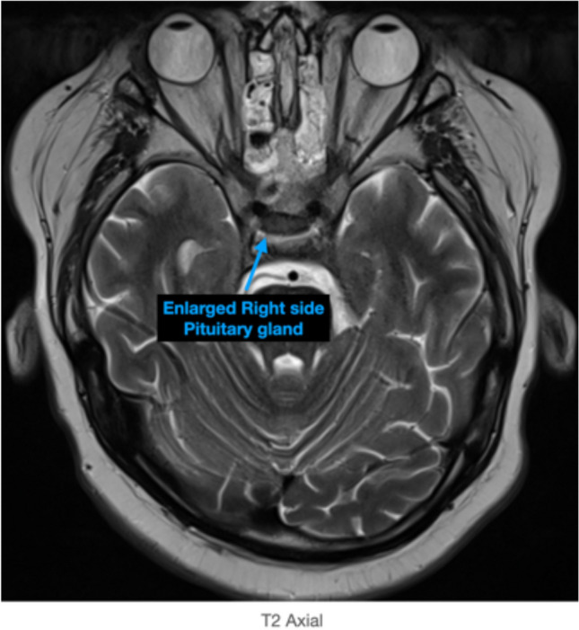
*Fig. 2. Axial MRI T2 demonstrates a right-sided pituitary gland enlargement correlating to the pituitary microadenoma Source: [HOW I DO IT: Cushing’s disease—selective adenomectomy via an endoscopic transsphenoidal approach](https://pmc.ncbi.nlm.nih.gov/articles/PMC11156730/) — Acta Neurochirurgica 2024; CC BY.*

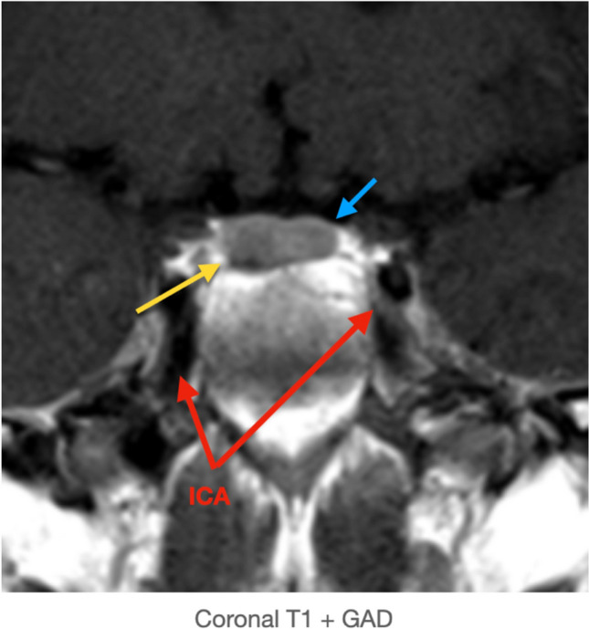
*Fig. 3. Coronal T1 + GAD demonstrating the disproportionately enlarged right pituitary gland - microadenoma (yellow arrow), normal pituitary gland (blue arrow), and the internal carotid arteries... Source: [HOW I DO IT: Cushing’s disease—selective adenomectomy via an endoscopic transsphenoidal approach](https://pmc.ncbi.nlm.nih.gov/articles/PMC11156730/) — Acta Neurochirurgica 2024; CC BY.*

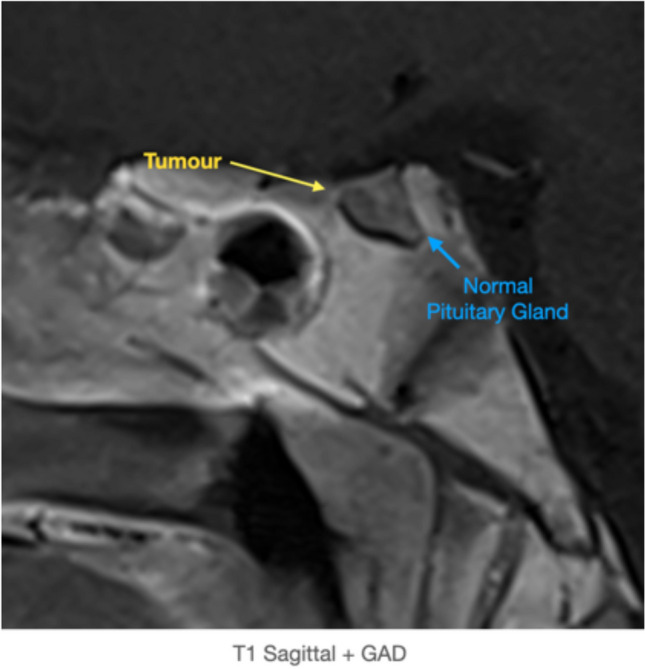
*Fig. 4. T1 Sagittal + GAD demonstrating the pituitary microadenoma (yellow arrow) and normal pituitary gland (blue arrow). The conchal sphenoidal sinus can be appreciated Source: [HOW I DO IT: Cushing’s disease—selective adenomectomy via an endoscopic transsphenoidal approach](https://pmc.ncbi.nlm.nih.gov/articles/PMC11156730/) — Acta Neurochirurgica 2024; CC BY.*

<!-- END CURATED IMAGE SET -->

---

## History of Present Illness
- Chief complaint: Visual field deficit / headaches / endocrinopathy / pituitary apoplexy
- Duration of symptoms:
- Visual changes (bitemporal hemianopsia, decreased acuity):
- Headache pattern:
- Endocrine symptoms:
  - Acromegaly: enlarged hands/feet, coarsened features, sweating, joint pain
  - Cushing disease: weight gain, striae, moon facies, easy bruising, proximal weakness
  - Prolactinoma: amenorrhea/galactorrhea (F), decreased libido/gynecomastia (M)
  - TSH-secreting: hyperthyroidism symptoms
  - Hypopituitarism: fatigue, cold intolerance, decreased libido, adrenal insufficiency
- Apoplexy symptoms: sudden headache, visual loss, altered mental status, CN palsies

---

## Past Medical History
- Prior transsphenoidal surgery
- Prior radiation (conventional, SRS)
- Diabetes mellitus (acromegaly)
- Hypertension (Cushing)
- Osteoporosis (Cushing, hypopituitarism)
- Adrenal insufficiency (on replacement)
- Hypothyroidism (on replacement)
- Obstructive sleep apnea (acromegaly)
- Cardiac disease (acromegaly)
- MEN1 syndrome
- Allergies:
- Medications (including hormone replacements):

---

## Imaging Review
### MRI Sella (Thin-cut, T1, T1+Gad, T2, Coronal and Sagittal)
- **Tumor size:** ___ x ___ x ___ mm (micro < 10mm, macro >= 10mm, giant >= 40mm)
- **Enhancement pattern:** Homogeneous / heterogeneous / cystic / hemorrhagic
- **Sellar expansion:** Floor eroded / intact
- **Suprasellar extension:**
  - Chiasm compressed / elevated / displaced: [anterior / posterior / lateral]
  - Distance from tumor to chiasm
  - Chiasm position: prefixed / normal / postfixed
- **Cavernous sinus invasion:**
  - Knosp grade: 0 / 1 / 2 / 3A / 3B / 4
  - ICA encasement percentage
  - Medial wall displacement vs invasion
- **Infrasellar extension:** Into sphenoid sinus / clivus
- **Lateral extension:** Into temporal fossa
- **Stalk position:** Midline / displaced
- **Normal pituitary gland:** Identified / compressed (location: superior / lateral)
- **Signal characteristics:**
  - Hemorrhage (apoplexy): T1 bright
  - Cystic components: T2 bright
  - Consistency: firm (T2 dark) vs soft (T2 bright)

### CT Sella / Sinuses
- Sphenoid sinus pneumatization: conchal / presellar / sellar (sellar = favorable)
- Septations within sphenoid sinus (may be off-midline, insert on carotid prominences)
- Sellar floor thickness
- Carotid canal bony coverage
- Nasal anatomy: septal deviation, turbinate hypertrophy

### CTA (if large or vascular tumor)
- ICA course and relationship to tumor
- Cavernous ICA prominence

### Navigation
- Thin-cut MRI sella loaded
- Thin-cut CT sinuses fused (for bony anatomy)
- ICA trajectories noted
- Sphenoid sinus septation mapped

---

## Labs — Endocrine Workup
- **Prolactin** (rule out prolactinoma — medical management first if prolactin > 200)
- **IGF-1** (screen for GH excess)
- **GH** (random and OGTT suppression if IGF-1 elevated)
- **AM cortisol** + **ACTH** (Cushing disease or adrenal insufficiency)
- **24-hour urine free cortisol** (if Cushing suspected)
- **Low-dose dexamethasone suppression test** (if Cushing suspected)
- **TSH, free T4** (TSH-secreting adenoma or central hypothyroidism)
- **LH, FSH, estradiol/testosterone** (hypogonadism)
- **Alpha subunit** (gonadotroph adenoma)
- **BMP** (Na — risk of DI/SIADH; glucose — acromegaly)
- **CBC, coagulation**
- **Type and screen**

### Pre-op Endocrine Considerations
- **Prolactinoma (PRL > 200):** Trial of cabergoline first; surgery if refractory, intolerant, or CSF leak
- **Cushing disease:** Stress-dose steroids NOT given pre-op (need post-op cortisol nadir for remission); may need post-op replacement
- **Acromegaly:** Somatostatin analog pre-treatment may soften tumor
- **Adrenal insufficiency:** Stress-dose hydrocortisone 100 mg IV at induction

---

## Neurological Examination
### Visual
- **Visual acuity:** Each eye (Snellen)
- **Visual fields:** Formal perimetry (Humphrey/Goldmann) — look for bitemporal hemianopsia
- **Fundoscopy:** Optic disc pallor (chronic compression)
- **Color vision:** Ishihara plates (sensitive early indicator)
- **Pupillary exam:** RAPD

### Cranial Nerves
- CN III, IV, VI: EOM — especially if cavernous sinus invasion
- CN V1, V2: Facial sensation (cavernous sinus)

### Endocrine Exam
- Acromegalic features (hands, feet, jaw, tongue)
- Cushingoid features (moon facies, striae, buffalo hump, bruising)
- Thyroid exam
- Galactorrhea

---

## Surgical Planning

### Diagnosis & Indication
- Working diagnosis: [Functioning/Non-functioning] pituitary [micro/macro]adenoma
- Surgical indication:
  - Non-functioning: visual field deficit, progressive growth, mass effect
  - GH-secreting: biochemical cure (acromegaly)
  - ACTH-secreting: biochemical cure (Cushing disease)
  - Prolactinoma: medication intolerance/failure, CSF leak from medical therapy, apoplexy
  - TSH-secreting: biochemical cure
- Goals: Gross total resection with decompression of optic apparatus and endocrine remission (if functioning)

### Position
- **Patient position:** Supine
- **Head position:** Slight extension (10-15 degrees) to align nasal corridor with sphenoid sinus. Head in [Mayfield skull clamp / horseshoe headrest]
- **Navigation:** Electromagnetic or optical navigation registered
- **Patient rotation:** Turn bed 180 degrees from anesthesia (or side approach depending on OR setup)
- **ENT co-surgeon:** For nasal approach and closure (nasoseptal flap)

### Approach: Endoscopic Endonasal Transsphenoidal
- **Nasal phase:**
  1. Topical decongestion (oxymetazoline or cocaine pledgets)
  2. Identify middle turbinate bilaterally
  3. Out-fracture or partially resect middle turbinate (right side typically)
  4. Posterior septectomy — create a common corridor
  5. Identify sphenoid ostia bilaterally (landmark: superior turbinate)
  6. Wide sphenoidotomy — connect both ostia
  7. Harvest nasoseptal flap (Hadad-Bassagasteguy flap) early — based on posterior septal artery (branch of sphenopalatine artery)

- **Sphenoid phase:**
  1. Remove sphenoid septations (note relationship to carotid prominences)
  2. Identify key landmarks:
     - Sellar floor (center)
     - Carotid prominences (lateral)
     - Opticocarotid recess (superolateral)
     - Clival recess (inferior)
     - Planum sphenoidale (superior)
  3. Open sellar floor with drill/Kerrison rongeurs
  4. Lateral limits: medial wall of cavernous sinus / carotid prominences
  5. Superior limit: tuberculum sellae (for suprasellar extension)

- **Sellar phase:**
  1. Open dura in cruciate fashion (identify normal vs tumor dura color)
  2. Use ring curettes, suction, and angled endoscopes to remove tumor
  3. Technique: systematic removal — inferior, lateral, then superior
  4. Identify normal gland (usually compressed superolaterally or posteriorly) — preserve
  5. Suprasellar component: wait for descent after inferior debulking; may need angled endoscope (30/45 degrees)
  6. If Knosp 3-4: medial cavernous sinus wall may need to be opened — risk to ICA
  7. Confirm extent of resection with angled endoscopes and navigation

- **Closure:**
  1. Hemostasis with Surgicel, Gelfoam
  2. **Intrasellar:** Gelfoam or fat graft (abdominal)
  3. **CSF leak repair (if intraoperative CSF leak):**
     - Inlay graft (collagen matrix or fascia lata) + overlay graft
     - Nasoseptal flap coverage
     - Fibrin glue
     - +/- Lumbar drain
  4. **No CSF leak:** Gelfoam packing, may not need nasoseptal flap
  5. Nasal packing (Merocel or NasoPore, remove POD 3-5)

### Critical Anatomy & Structures at Risk
1. **Internal carotid arteries** — bilateral, lateral to sella in cavernous sinus; carotid prominences in sphenoid sinus
2. **Optic chiasm** — superior to tumor; decompression is the goal
3. **Optic nerves** — in optic canals, superolateral
4. **Normal pituitary gland** — compressed by tumor; must identify and preserve
5. **Pituitary stalk** — connects hypothalamus to gland; injury causes DI
6. **Cavernous sinus contents** — CN III, IV, V1, V2, VI
7. **Sphenopalatine artery / posterior septal artery** — blood supply to nasoseptal flap; preserve pedicle
8. **Diaphragma sellae** — may descend into sella intraoperatively (marks complete suprasellar decompression)
9. **Arachnoid membrane** — intact arachnoid = no CSF leak; if violated, must repair

### Equipment & Instrumentation
- 0-degree and 30-degree rigid endoscopes (4mm)
- Endoscope holder/arm
- High-definition camera and monitor
- Navigation system (electromagnetic preferred for endonasal)
- High-speed drill (diamond burr for sellar floor)
- Kerrison rongeurs (various angles)
- Ring curettes (various sizes and angles)
- Micro-Doppler (to confirm ICA location)
- Endonasal instrument set (suction, dissectors, scissors)
- Hemostatic agents (Surgicel, Gelfoam, Floseal, fibrin glue)
- Closure materials: collagen matrix (DuraGen/DuraMatrix), fascia lata, abdominal fat
- Nasoseptal flap instruments
- Nasal packing (Merocel / NasoPore)
- Specimen containers

### Monitoring
- Standard ASA monitors
- Visual evoked potentials (VEPs) — if significant chiasmal compression (not universally used)
- No IONM typically required for standard transsphenoidal

### Anesthesia Considerations
- Arterial line (not always needed for straightforward cases)
- Two large-bore IVs
- Foley catheter (for DI monitoring — strict I&Os)
- No Foley suction (risk of mucosal injury to urethra from DI-related polyuria)
- Throat pack (prevents blood swallowing)
- Dexamethasone 10 mg IV (if not Cushing disease)
- **Cushing disease: Do NOT give steroids pre-op** (need post-op cortisol nadir)
- **Adrenal insufficiency: Stress-dose hydrocortisone 100 mg IV at induction**
- Cefazolin 2g IV
- Topical vasoconstrictors for nasal mucosa (oxymetazoline)
- Avoid excessive fluid administration (if concern for DI)

### Potential Complications & Contingencies
1. **CSF leak** — most common complication; nasoseptal flap closure, possible lumbar drain
2. **Diabetes insipidus (DI)** — from stalk/posterior pituitary injury; monitor UOP, Na q4-6h; treat with DDAVP if UOP > 300 mL/hr with rising Na
3. **SIADH** — delayed (typically days 5-10); monitor Na closely after discharge
4. **Hypopituitarism** — new anterior pituitary deficits; check AM cortisol POD1
5. **ICA injury** — catastrophic; pack and emergent angiography/endovascular treatment
6. **Visual worsening** — from hematoma in sella or aggressive packing; emergent CT/MRI and return to OR
7. **Meningitis** — monitor for fever, stiff neck; CSF leak is a risk factor
8. **Epistaxis** — usually from sphenopalatine artery branch; may need repacking or embolization
9. **Incomplete resection** — if cavernous sinus invasion (Knosp 3-4); plan for adjuvant SRS

---

## Operative Note Template

**Preoperative Diagnosis:** [Non-functioning / GH-secreting / ACTH-secreting / prolactin-secreting] pituitary macroadenoma with [chiasmal compression / cavernous sinus invasion (Knosp ___)]

**Postoperative Diagnosis:** Same (pending final pathology and immunohistochemistry)

**Procedure:** Endoscopic endonasal transsphenoidal resection of pituitary adenoma

**Surgeon:**
**Co-surgeon (ENT):**
**Assistant:**
**Anesthesia:** General endotracheal anesthesia

**EBL:**
**Fluids:**
**Specimens:** Pituitary adenoma (sent for permanent pathology, immunohistochemistry, Ki-67)
**Drains:** [None / Lumbar drain]
**Complications:** None
**Implants:** None

**Indications:**
The patient is a [age]yo [M/F] with a [size] cm [type] pituitary macroadenoma. Preoperative MRI demonstrated [findings including suprasellar extension, chiasmal compression, cavernous sinus involvement]. The patient presented with [visual field deficit / endocrinopathy / mass effect]. Formal visual field testing showed [findings]. Endocrine workup demonstrated [findings]. After discussion of risks, benefits, and alternatives, the patient elected to proceed with endoscopic endonasal transsphenoidal resection.

**Description of Procedure:**
[Standard opening — anesthesia, positioning]

The patient was positioned supine with the head slightly extended in a [Mayfield clamp / horseshoe headrest]. [Electromagnetic navigation was registered and accuracy confirmed.] [A lumbar drain was placed.] The nose was prepared with oxymetazoline-soaked pledgets bilaterally. A time-out was performed.

**Nasal phase:** The endoscope was introduced into the [right] nasal cavity. The middle turbinate was identified and out-fractured laterally. A nasoseptal flap was harvested on the [right] side, based on the posterior septal artery, and stored in the nasopharynx. A posterior septectomy was performed to create a binostril corridor. The bilateral sphenoid ostia were identified at the level of the superior turbinates. A wide sphenoidotomy was performed, removing the rostrum of the sphenoid and connecting both ostia.

**Sphenoid phase:** The sphenoid sinus was entered and the septations were removed. The key landmarks were identified: sellar floor centrally, bilateral carotid prominences laterally, opticocarotid recesses superolaterally, and the clivus inferiorly. [Navigation confirmed anatomy.] The sellar floor was opened with a [high-speed drill / Kerrison rongeurs] and the opening was enlarged laterally to the medial edges of the cavernous sinuses and superiorly to the tuberculum sellae.

**Sellar phase:** The sellar dura was coagulated and opened in a cruciate fashion. [The tumor was immediately encountered and was noted to be soft/firm, gray/white/hemorrhagic.] Tumor removal was performed systematically using ring curettes, suction, and angled endoscopes. The inferior and lateral components were removed first, followed by the superior component. [With 30-degree endoscope visualization, the suprasellar component was observed to descend into the sella and was progressively removed.] The normal pituitary gland was identified [superiorly/posteriorly/laterally] and carefully preserved. [The diaphragma sellae was observed to descend into the sella, indicating complete suprasellar decompression.]

[For Knosp 3-4: The medial wall of the cavernous sinus was opened and tumor within the cavernous sinus was debulked. The ICA was identified with micro-Doppler and direct visualization, and all manipulation was kept medial to the artery.]

**Intraoperative assessment:** [An intraoperative CSF leak was / was not identified. Navigation confirmed extent of resection.]

**Closure:** Hemostasis was achieved with [Surgicel/Floseal]. The sella was packed with [Gelfoam / abdominal fat graft]. [An inlay collagen matrix graft was placed, followed by the nasoseptal flap to cover the entire bony defect. Fibrin glue was applied. / No CSF leak was noted, and the sella was packed with Gelfoam.] [Nasal packing was placed bilaterally.] A throat pack was removed. [The lumbar drain was clamped.]

**Postoperative:** The patient was awakened from anesthesia, extubated, and found to be neurologically intact. The patient was transferred to the neurosurgical ICU for monitoring.

---

## Postoperative Plan
- ICU monitoring x 24 hours (or step-down)
- Neuro checks q1h x 12h, then q2h
- Strict I&Os: Urine output q1h (DI monitoring)
- Serum Na q6h x 48 hours, then BID until discharge
- **DI protocol:** If UOP > 300 mL/hr x 2 consecutive hours with rising Na > 145 → DDAVP 1 mcg IV; hold if Na < 135
- **AM cortisol POD1** (6 AM): If < 2 → adrenal insufficiency, start hydrocortisone; if 2-10 → borderline, may need replacement; if > 10 → reassuring
- MRI sella within 24-48 hours (extent of resection)
- Visual fields: Formal perimetry at 4-6 weeks
- **Cushing disease:** Serial cortisol q6h (looking for nadir < 2-5 for remission); do NOT give steroids until cortisol confirmed low or patient symptomatic
- **Acromegaly:** IGF-1 and GH at 6-12 weeks post-op
- Activity: No nose blowing, no straining, no heavy lifting x 6 weeks
- Nasal care: Saline irrigations starting after packing removal (POD 3-5)
- Sinus precautions: No bending, no valsalva
- CSF leak precautions: If repair performed, HOB 30 degrees, stool softeners
- DVT prophylaxis: SCDs, heparin SQ POD1
- Discharge: POD 2-3 typically (if no DI, no CSF leak, Na stable)
- Follow-up: ENT debridement 1-2 weeks; Neurosurgery clinic 2-4 weeks; Endocrine 4-6 weeks
- Long-term: Annual MRI sella; endocrine labs; visual fields as needed
- **Delayed hyponatremia warning:** Educate patient to check Na at day 7-10 or return for symptoms (nausea, headache, confusion)
