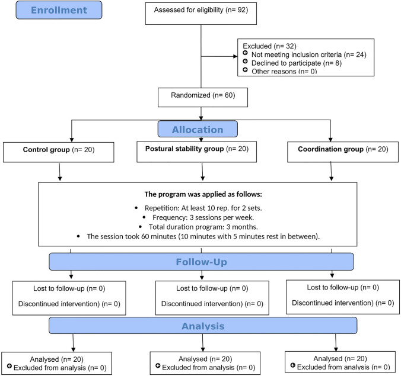
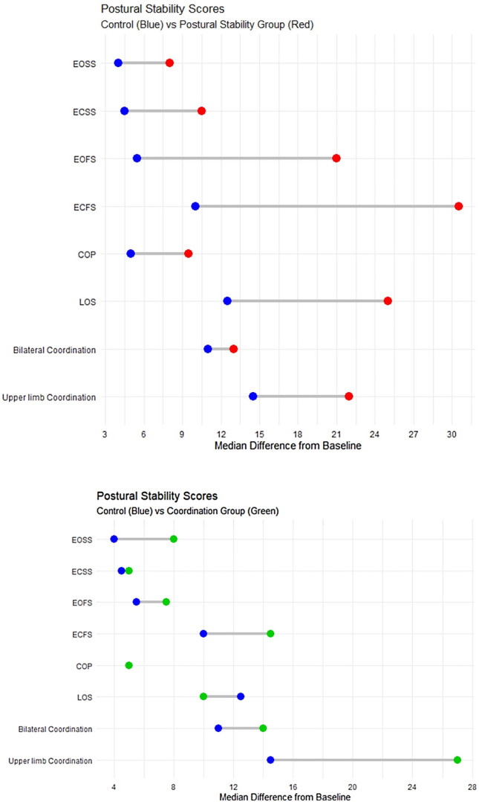
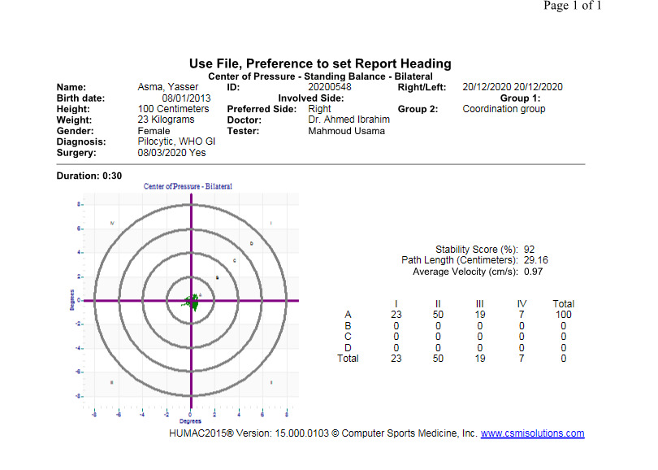
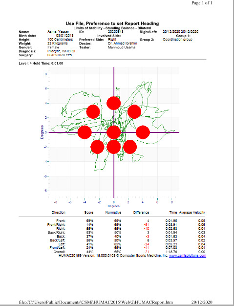
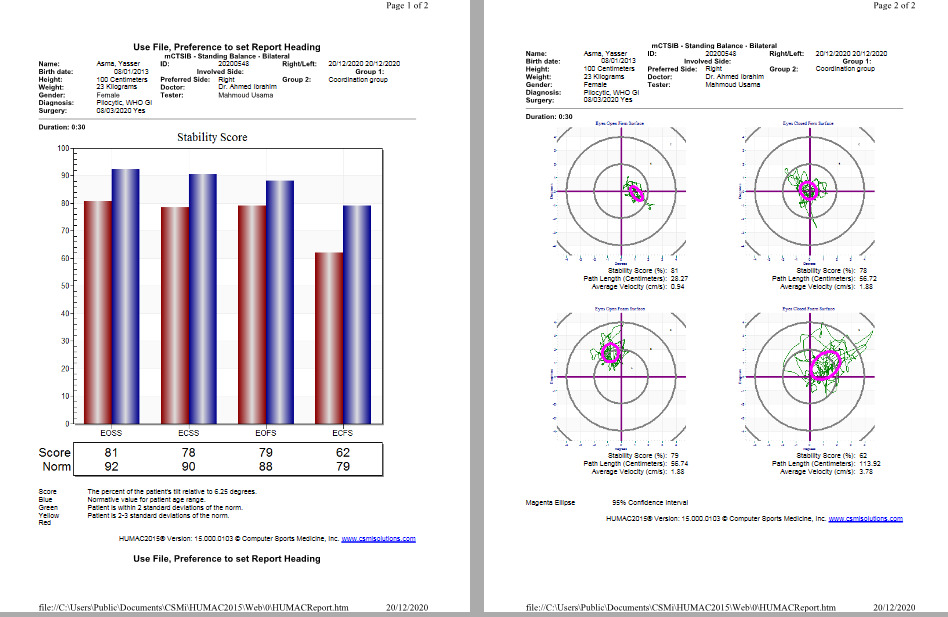
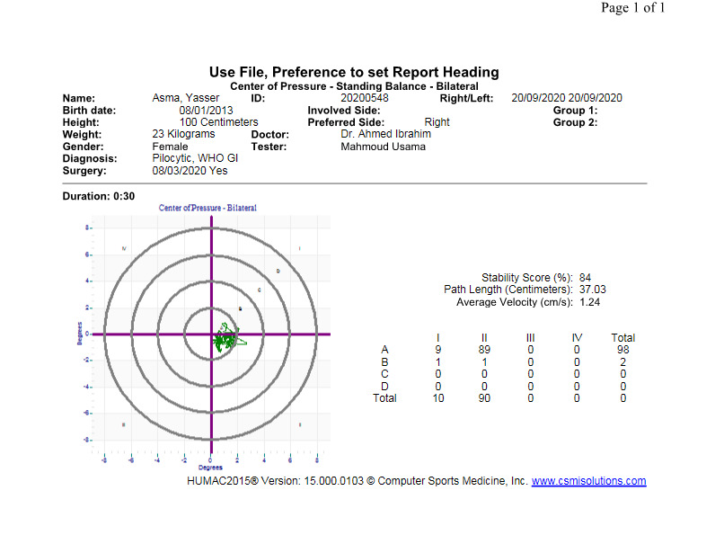
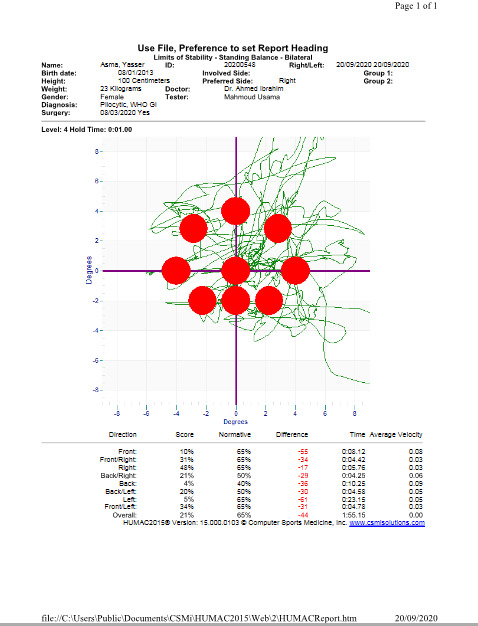
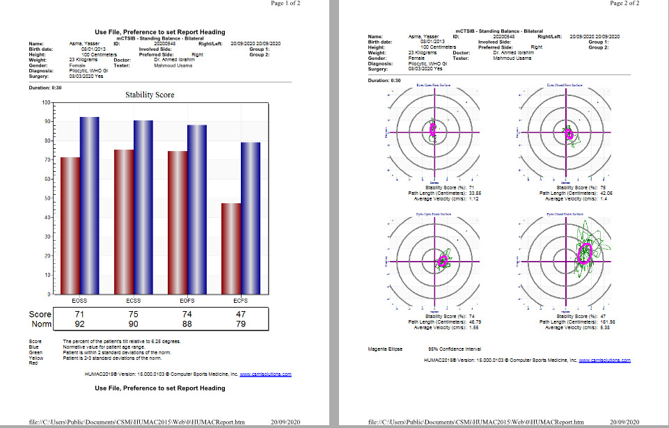
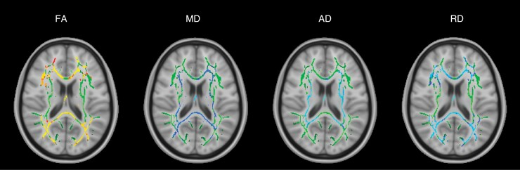
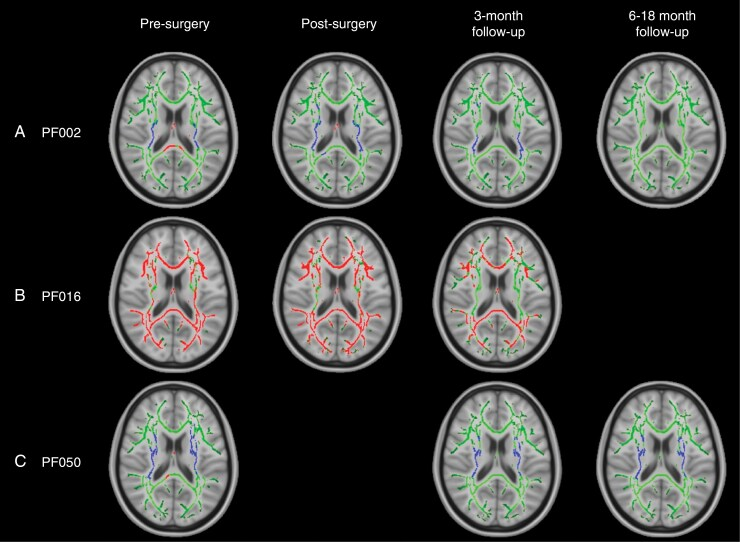

# Case Prep: Posterior Fossa Tumor Resection (Cerebellar — Metastasis / Hemangioblastoma / Medulloblastoma / Ependymoma)

<!-- BEGIN CASE SNAPSHOT -->

## Case / Approach Snapshot

- **Anatomy at risk:** tumor compartment, arterial supply, venous drainage/sinuses, cranial nerves, white-matter tracts, pituitary/CSF pathways when relevant, and functional cortex.
- **Operative steps:** review imaging and goals, choose exposure, obtain brain relaxation, devascularize when possible, debulk internally, dissect capsule from critical structures, verify extent/safety, and reconstruct watertight closure; use the detailed operative sequence and approach notes below as the step-by-step source.
- **Rescue plans:** venous or arterial injury, swelling, seizure, cranial nerve or endocrine change, CSF leak, residual tumor left for safety, staged surgery, radiation, or adjuvant therapy.
- **Figures:** review [Figures, Imaging & Video](#figures-imaging--video) and the [Curated Image Set](#curated-image-set); embedded local figures should remain open-access, public-domain, or otherwise reusable with attribution.
- **Papers:** review [High-Yield Literature](#high-yield-literature) for seminal sources, modern reviews, and outcome data specific to this page.

<!-- END CASE SNAPSHOT -->

## One-Liner
[Age]yo [M/F] with a [left/right/midline/vermian/4th ventricular] posterior fossa [metastasis / hemangioblastoma / medulloblastoma / ependymoma] [with hydrocephalus] presenting with [headache / ataxia / nausea/vomiting] planned for suboccipital craniotomy for resection.

---

## Figures, Imaging & Video

**🎥 Operative video** — [search operative video on YouTube ▸](https://www.youtube.com/results?search_query=posterior+fossa+tumour+surgery) · [The Neurosurgical Atlas ▸](https://www.neurosurgicalatlas.com)

> 🧭 **Operative approach:** [Telovelar approach](../approaches/telovelar-approach.md) — detailed corridor setup, step-by-step technique & figures

[Neurosurgical Atlas](https://www.neurosurgicalatlas.com) · [Radiopaedia](https://radiopaedia.org/search?q=posterior%20fossa%20tumour&scope=all) · [PubMed Central](https://www.ncbi.nlm.nih.gov/pmc/?term=posterior+fossa+tumor+telovelar) — operative figures © linked; see [media-sources.md](../../resources/media-sources.md)

---

<!-- BEGIN CURATED LITERATURE -->

## High-Yield Literature

- **Posterior Fossa Tumor Rehabilitation: An Up-to-Date Overview** — Chieffo DPR. Children (Basel, Switzerland) 2022. [PubMed](https://pubmed.ncbi.nlm.nih.gov/35740841/)
- **Posterior Fossa Tumors** — Brandão LA. Neuroimaging clinics of North America 2017. [PubMed](https://pubmed.ncbi.nlm.nih.gov/27889018/)
- **Prevalence of dysphagia following posterior fossa tumor resection: a systematic review and meta‑analysis** — Duan Y. BMC cancer 2024. [PubMed](https://pubmed.ncbi.nlm.nih.gov/39060966/)
- **Intraoperative neurophysiology in posterior fossa tumor surgery in children** — Sala F. Child's nervous system : ChNS : official journal of the International Society for Pediatric Neurosurgery 2015. [PubMed](https://pubmed.ncbi.nlm.nih.gov/26351231/)
- **Cerebellar liponeurocytoma: Rare posterior fossa tumor** — Chaouche I. Radiology case reports 2024. [PubMed](https://pubmed.ncbi.nlm.nih.gov/38841602/)
- **Posterior fossa tumors in children: Radiological tips & tricks in the age of genomic tumor classification and advance MR technology** — Kerleroux B. Journal of neuroradiology = Journal de neuroradiologie 2020. [PubMed](https://pubmed.ncbi.nlm.nih.gov/31541639/)
- **A review of long-term deficits in memory systems following radiotherapy for pediatric posterior fossa tumor** — Baudou E. Radiotherapy and oncology : journal of the European Society for Therapeutic Radiology and Oncology 2022. [PubMed](https://pubmed.ncbi.nlm.nih.gov/35640769/)
- **Craniotomy versus craniectomy in posterior fossa tumor surgery: A systematic review and Meta-Analysis** — Correa EM. Neurosurgical review 2025. [PubMed](https://pubmed.ncbi.nlm.nih.gov/41407970/)
- **Postoperative facial palsy after pediatric posterior fossa tumor resection** — Chu JK. Journal of neurosurgery. Pediatrics 2021. [PubMed](https://pubmed.ncbi.nlm.nih.gov/33711807/)
- **Cerebellar Mutism Syndrome After Posterior Fossa Tumor Surgery in Children-A Retrospective Single-Center Study** — Schmidt S. World neurosurgery 2023. [PubMed](https://pubmed.ncbi.nlm.nih.gov/36871657/)

<!-- END CURATED LITERATURE -->

<!-- BEGIN CURATED IMAGE SET -->

## Curated Image Set

Open-access figures are embedded from PubMed Central articles and kept unique to this guide.

*Fig. 1. Flow diagram illustrating participants entered the study Source: [Impact of physical activity on postural stability and coordination in children with posterior fossa tumor: randomized control phase III trial](https://pmc.ncbi.nlm.nih.gov/articles/PMC10356666/) — Journal of Cancer Research and Clinical Oncology 2022; CC BY.*

*Fig. 2. Postural stability and coordination scores Source: [Impact of physical activity on postural stability and coordination in children with posterior fossa tumor: randomized control phase III trial](https://pmc.ncbi.nlm.nih.gov/articles/PMC10356666/) — Journal of Cancer Research and Clinical Oncology 2022; CC BY.*

*Figure 3. Source: [Impact of physical activity on postural stability and coordination in children with posterior fossa tumor: randomized control phase III trial](https://pmc.ncbi.nlm.nih.gov/articles/PMC10356666/) — J Cancer Res Clin Oncol. 2022 Dec 16;149(9):5637–44. doi: 10.1007/s00432-022-04490-4; CC BY.*

*Figure 4. Source: [Impact of physical activity on postural stability and coordination in children with posterior fossa tumor: randomized control phase III trial](https://pmc.ncbi.nlm.nih.gov/articles/PMC10356666/) — J Cancer Res Clin Oncol. 2022 Dec 16;149(9):5637–44. doi: 10.1007/s00432-022-04490-4; CC BY.*

*Figure 5. Source: [Impact of physical activity on postural stability and coordination in children with posterior fossa tumor: randomized control phase III trial](https://pmc.ncbi.nlm.nih.gov/articles/PMC10356666/) — J Cancer Res Clin Oncol. 2022 Dec 16;149(9):5637–44. doi: 10.1007/s00432-022-04490-4; CC BY.*

*Figure 6. Source: [Impact of physical activity on postural stability and coordination in children with posterior fossa tumor: randomized control phase III trial](https://pmc.ncbi.nlm.nih.gov/articles/PMC10356666/) — J Cancer Res Clin Oncol. 2022 Dec 16;149(9):5637–44. doi: 10.1007/s00432-022-04490-4; CC BY.*

*Figure 7. Source: [Impact of physical activity on postural stability and coordination in children with posterior fossa tumor: randomized control phase III trial](https://pmc.ncbi.nlm.nih.gov/articles/PMC10356666/) — J Cancer Res Clin Oncol. 2022 Dec 16;149(9):5637–44. doi: 10.1007/s00432-022-04490-4; CC BY.*

*Figure 8. Source: [Impact of physical activity on postural stability and coordination in children with posterior fossa tumor: randomized control phase III trial](https://pmc.ncbi.nlm.nih.gov/articles/PMC10356666/) — J Cancer Res Clin Oncol. 2022 Dec 16;149(9):5637–44. doi: 10.1007/s00432-022-04490-4; CC BY.*

*Figure 1.. TBSS results for the group of all 8 posterior fossa tumor patients at the presurgical time point. Green denotes the white matter skeleton where voxels are not significantly different... Source: [Evidence of supratentorial white matter injury prior to treatment in children with posterior fossa tumors using diffusion MRI](https://pmc.ncbi.nlm.nih.gov/articles/PMC12080551/) — Neuro-Oncology Advances 2025; CC BY.*

*Figure 2.. TBSS results for individual patients with widespread, significant changes in FA, including pilocytic astrocytoma patients PF002 (A) and PF016 (B) and medulloblastoma patient PF050 (C).... Source: [Evidence of supratentorial white matter injury prior to treatment in children with posterior fossa tumors using diffusion MRI](https://pmc.ncbi.nlm.nih.gov/articles/PMC12080551/) — Neuro-Oncology Advances 2025; CC BY.*

<!-- END CURATED IMAGE SET -->

---

## History of Present Illness
- Chief complaint: Headache (often morning, raised ICP), nausea/vomiting, ataxia, dysmetria, gait instability
- **Hydrocephalus** from 4th ventricle/aqueduct obstruction — may need preop CSF diversion
- Tumor type clues: hemangioblastoma (cyst + mural nodule, VHL, polycythemia), metastasis (known primary), medulloblastoma/ependymoma (children, 4th ventricle)

---

## Imaging Review
### MRI (T1±Gad, T2, FLAIR, DWI) + spine (if medullo/ependymoma — drop mets)
- Location: hemispheric, vermian, 4th ventricular, CPA
- Enhancement, cyst + nodule (hemangioblastoma), restricted diffusion (medulloblastoma)
- **4th ventricle/brainstem relationship**, extension through foramina (Luschka/Magendie)
- **Hydrocephalus**, tonsillar herniation
- Vascular flow voids (hemangioblastoma — consider angiography/embolization)

### CT
- Hydrocephalus, calcification, acute bleed

### Workup
- VHL evaluation (hemangioblastoma), primary search (metastasis), neuraxis MRI (embryonal/ependymal)

---

## Labs
- CBC (polycythemia in hemangioblastoma), BMP, Coags, Type and crossmatch

---

## Neurological Examination
- Cerebellar (appendicular + truncal), CN exam, gait, papilledema, lower CN function (4th ventricle floor)

---

## Surgical Planning

### Case Logistics, OR Needs & Orders
- **OR setup:** Mayfield, navigation, microscope/endoscope, cranial nerve monitoring/BAER when relevant, EVD/CSF diversion plan, watertight closure and fat/fascia graft materials, and blood available for vascular tumors.
- **Special needs:** arterial line, Foley, dexamethasone for edema, antiemetic plan, lower-CN airway/swallow contingency, EVD/ETV plan for hydrocephalus, and audiology/facial-nerve baseline when relevant.
- **Immediate postop orders:** ICU neuro checks, CN/eye movement/facial/swallow/voice exams, HOB 30, CT for hemorrhage/hydrocephalus, MRI for EOR, CSF-leak/pseudomeningocele watch, dex taper, and early swallow/ENT consult when lower CN risk exists.

### Hydrocephalus Management
- Preop EVD or intraop ventriculostomy if significant hydrocephalus; some place EVD at start of case; ETV alternative; avoid rapid overdrainage (upward herniation risk)

### Position
- **Prone** (most common) or **Concorde/sitting** (sitting: gravity retraction, less bleeding pooling, but VAE risk); Mayfield, neck flexed (2 fingerbreadths chin-to-sternum), shoulders taped down

### Approach: Midline (or paramedian) Suboccipital Craniotomy ± C1 laminectomy
### Key Surgical Steps
1. Midline incision inion to C2, avascular midline raphe
2. Suboccipital craniotomy; C1 laminectomy if tonsillar/4th ventricular extension
3. Open dura (Y-shaped), watch for occipital sinus bleeding
4. **Telovelar approach** to 4th ventricle (through cerebellomedullary fissure — avoids vermian split) for 4th ventricular tumors
5. Tumor resection:
   - **Metastasis:** circumferential, en bloc when possible (less seeding)
   - **Hemangioblastoma:** do NOT enter the vascular nodule — circumferential dissection, coagulate feeders, remove nodule en bloc (drain cyst, resect nodule); AVM-like bleeding if entered
   - **Medulloblastoma/ependymoma:** internal debulking, dissect off 4th ventricle floor (do not pursue tumor adherent to floor — brainstem injury), preserve PICA
6. Restore CSF pathways
7. Watertight dural closure (CSF leak/pseudomeningocele common in posterior fossa)

### Critical Anatomy & Structures at Risk
1. **Brainstem / floor of 4th ventricle** — CN nuclei (facial colliculus, hypoglossal/vagal trigones); injury → CN palsies, cardiorespiratory instability
2. **PICA and branches**
3. **Cerebellar peduncles** (ataxia, mutism)
4. **Vermis** (truncal ataxia; posterior fossa/cerebellar mutism syndrome in children)
5. Occipital sinus, transverse/sigmoid sinuses, torcula

### Equipment
- Microscope, navigation, CUSA, ICG (hemangioblastoma)
- EVD kit, bipolar, hemostatic agents, dural substitute
- Preop embolization (vascular hemangioblastoma)

### Monitoring
- SSEPs, MEPs, CN EMG (VII, IX-XII), BAER; precordial Doppler if sitting

### Anesthesia
- Arterial line, crossmatched blood, **VAE precautions if sitting** (Doppler, central line, end-tidal CO2), antiemetics, mannitol

### Potential Complications
1. **Posterior fossa syndrome / cerebellar mutism** (children, vermian/dentate)
2. CN deficits, swallowing/airway compromise (4th ventricle floor)
3. Hydrocephalus persistence → shunt
4. CSF leak/pseudomeningocele
5. Hemorrhage (hemangioblastoma), VAE (sitting), aseptic meningitis

---

## Operative Note Template
**Preoperative Diagnosis:** [Midline/hemispheric/4th-ventricular] posterior fossa [metastasis / hemangioblastoma / medulloblastoma / ependymoma] [with obstructive hydrocephalus]

**Postoperative Diagnosis:** Same

**Procedure:** Suboccipital craniotomy [with C1 laminectomy] for resection of posterior fossa tumor [with EVD placement]

**Surgeon / Assistant:**
**Anesthesia:** General endotracheal
**EBL / Fluids / Blood products:** [crossmatched]
**Adjuncts:** Neuronavigation, CUSA, ICG (hemangioblastoma), SSEP/MEP/CN EMG/BAER, [VAE precautions if sitting]
**Implants:** Dural substitute; [EVD]
**Complications:** None

**Indications:** [Age]yo [M/F] with a [location] posterior fossa tumor and [obstructive hydrocephalus]. [Preoperative embolization was performed for the vascular hemangioblastoma.] Risks/benefits/alternatives discussed.

**Description of Procedure:** After consent and time-out, general anesthesia was induced and the patient positioned prone (Concorde) [/ sitting with VAE precautions] in Mayfield with the neck flexed. [An EVD was placed for hydrocephalus.] A midline suboccipital incision was made, the avascular raphe followed, and a suboccipital craniotomy performed [with C1 laminectomy for 4th-ventricular/tonsillar extension]; the occipital sinus was controlled.

The dura was opened and CSF released for relaxation. [The 4th ventricle was accessed via a telovelar approach through the cerebellomedullary fissure, avoiding a vermian split.] The tumor was resected [tumor-specific: cyst drained and mural nodule removed en bloc for pilocytic; vascular nodule circumferentially devascularized and removed en bloc without entering it for hemangioblastoma; internally debulked and dissected off the 4th-ventricle floor without pursuing adherent tumor for medulloblastoma/ependymoma]. The PICA, brainstem, and floor of the 4th ventricle were preserved and CSF pathways restored.

A watertight dural closure was performed (to prevent pseudomeningocele/CSF leak), the bone flap replaced, and the wound closed in layers. The patient was transferred to the ICU in stable condition.

---

## Postoperative Plan
- ICU, neuro checks q1h, **posterior fossa precautions** (consciousness, breathing, CN, swallowing)
- Swallow eval before PO, eye/airway protection
- CT 6h, MRI postop (EOR); EVD/hydrocephalus management
- Antiemetics, steroid taper, DVT prophylaxis
- Pathology-specific: tumor board; medulloblastoma → craniospinal RT + chemo, neuraxis staging; metastasis → SRS/WBRT; hemangioblastoma → VHL workup

<!-- BEGIN COMMON PIMP QUESTIONS -->

## Common Pimp Questions

Use these to pressure-test preparation for **Posterior Fossa Tumor Resection (Cerebellar — Metastasis / Hemangioblastoma / Medulloblastoma / Ependymoma)**:

1. What is the surgical goal: gross-total, maximal safe, decompression, diagnosis, or cytoreduction?
2. What eloquent cortex, tract, cranial nerve, vessel, or sinus defines the stopping point?
3. What adjunct changes the case: navigation, mapping, 5-ALA, ultrasound, endoscope, ICG, or neuromonitoring?
4. What is the edema, steroid, seizure, DVT, and postop imaging plan?
5. What complication would you check for first in PACU based on this lesion location?

<!-- END COMMON PIMP QUESTIONS -->

<!-- BEGIN ATTENDING PREFERENCE VARIABLES -->

## Attending Preference Variables

Items that commonly vary by surgeon or institution:

- **Extent-of-resection goal and functional stopping points:** [attending-specific]
- **Mapping/monitoring, 5-ALA, ultrasound, ICG, endoscope, or tractography preferences:** [attending-specific]
- **Steroid, antiepileptic, mannitol/hypertonic saline, and antibiotic plan:** [attending-specific]
- **Postop MRI timing, ICU/floor threshold, and adjuvant-referral workflow:** [attending-specific]

<!-- END ATTENDING PREFERENCE VARIABLES -->
