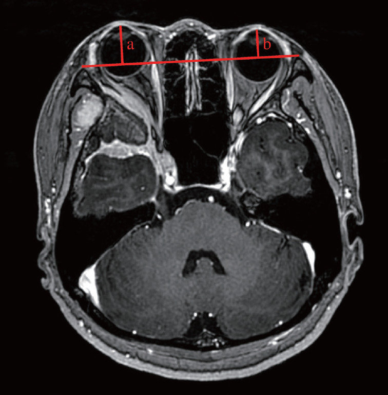
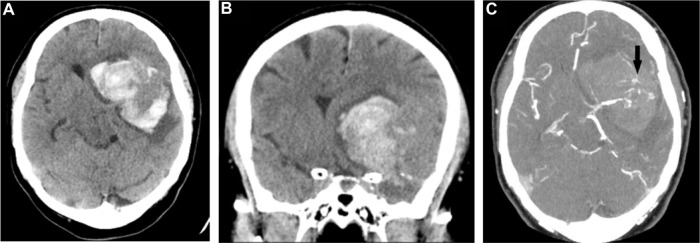
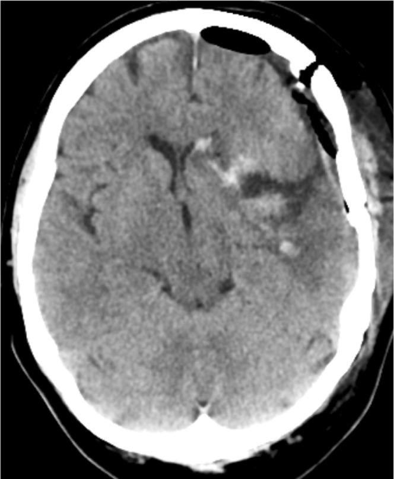
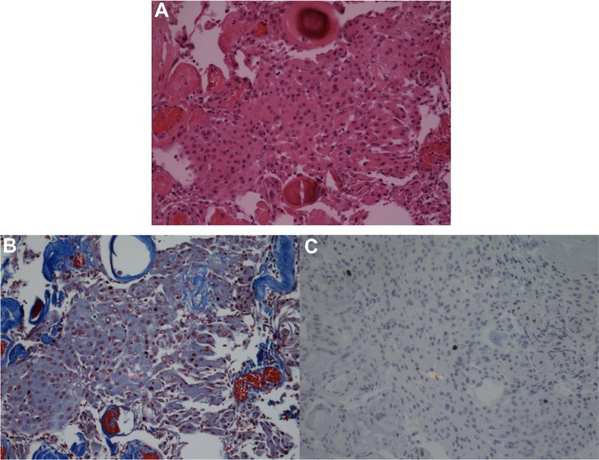
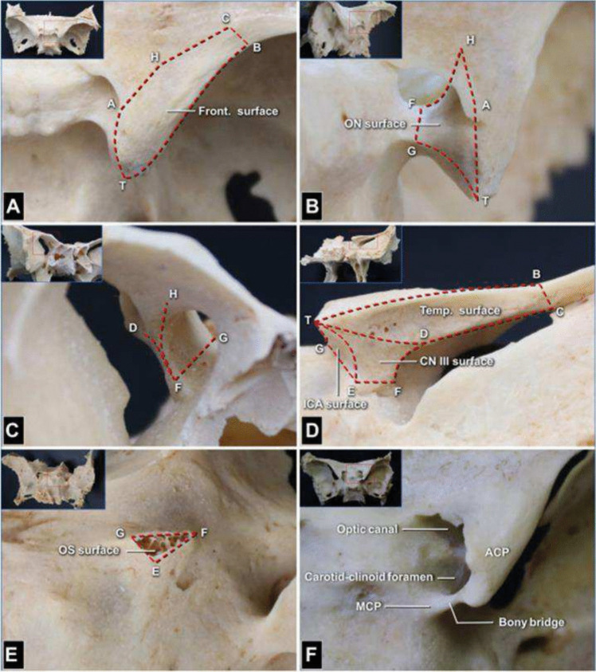
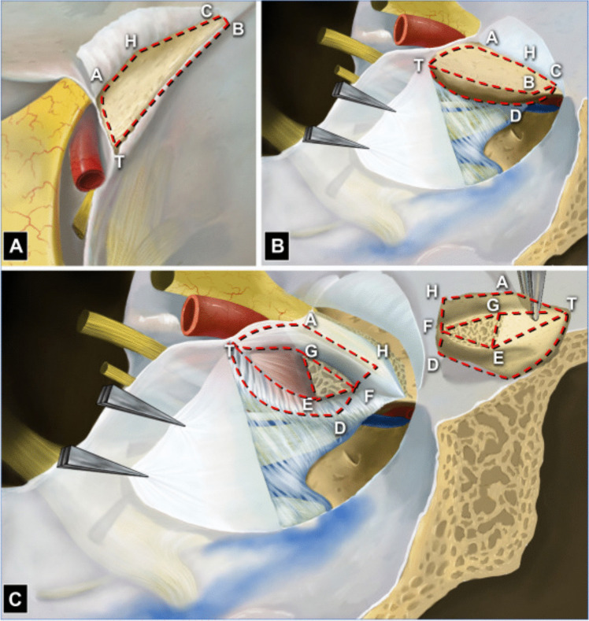
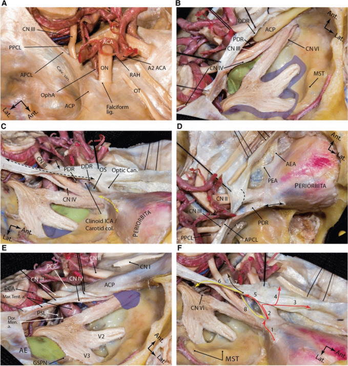
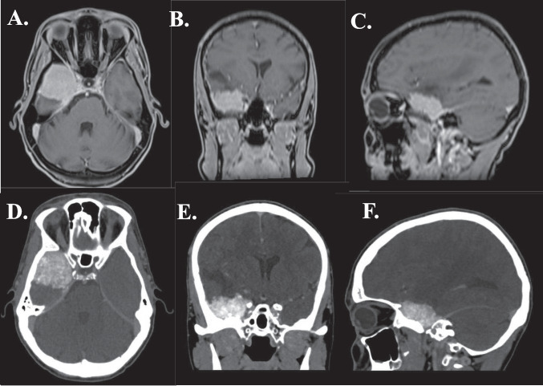
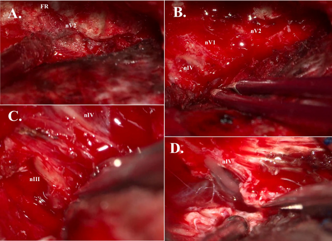
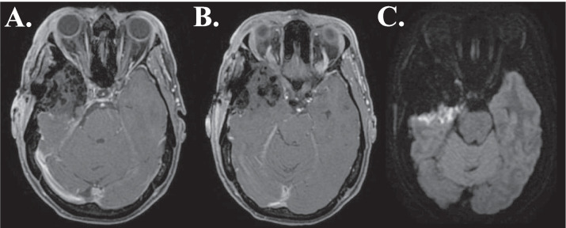

# Case Prep: Sphenoid Wing Meningioma Resection

---

<!-- BEGIN CASE SNAPSHOT -->

## Case / Approach Snapshot

- **Anatomy at risk:** tumor compartment, arterial supply, venous drainage/sinuses, cranial nerves, white-matter tracts, pituitary/CSF pathways when relevant, and functional cortex.
- **Operative steps:** review imaging and goals, choose exposure, obtain brain relaxation, devascularize when possible, debulk internally, dissect capsule from critical structures, verify extent/safety, and reconstruct watertight closure; use the detailed operative sequence and approach notes below as the step-by-step source.
- **Rescue plans:** venous or arterial injury, swelling, seizure, cranial nerve or endocrine change, CSF leak, residual tumor left for safety, staged surgery, radiation, or adjuvant therapy.
- **Figures:** review [Figures, Imaging & Video](#figures-imaging--video) and the [Curated Image Set](#curated-image-set); embedded local figures should remain open-access, public-domain, or otherwise reusable with attribution.
- **Papers:** review [High-Yield Literature](#high-yield-literature) for seminal sources, modern reviews, and outcome data specific to this page.

<!-- END CASE SNAPSHOT -->

## One-Liner
[Age]yo [M/F] with a [left/right] [lateral / middle / medial (clinoidal)] sphenoid wing meningioma presenting with [proptosis / visual loss / seizures / headache] planned for pterional (± orbitozygomatic) craniotomy for resection.

---

## Figures, Imaging & Video

**🎥 Operative video** — [search operative video on YouTube ▸](https://www.youtube.com/results?search_query=sphenoid+wing+meningioma+surgery) · [The Neurosurgical Atlas ▸](https://www.neurosurgicalatlas.com)

> 🧭 **Operative approach:** [Pterional craniotomy](../approaches/pterional-craniotomy.md) — detailed corridor setup, step-by-step technique & figures

> Operative figures/atlases are © (linked, not copied). See [media-sources.md](../../resources/media-sources.md).
- **Technique/approach:** [The Neurosurgical Atlas](https://www.neurosurgicalatlas.com) — search *"sphenoid wing meningioma"*
- **Imaging:** [Radiopaedia — sphenoid wing meningioma](https://radiopaedia.org/search?q=sphenoid%20wing%20meningioma&scope=all)
- **Open-access figures:** [PubMed Central](https://www.ncbi.nlm.nih.gov/pmc/?term=sphenoid+wing+meningioma)

---

<!-- BEGIN CURATED LITERATURE -->

## High-Yield Literature

- **Transorbital Debulking of Sphenoid Wing Meningioma** — Smith CS. The Journal of craniofacial surgery 2022. [PubMed](https://pubmed.ncbi.nlm.nih.gov/34608004/)
- **Sphenoid Wing Meningioma Presenting as Sudden Sensorineural Hearing Loss: A Case Report and Literature Review** — Toro ED. Ear, nose, & throat journal 2021. [PubMed](https://pubmed.ncbi.nlm.nih.gov/32050788/)
- **Surgical Outcomes of Sphenoid Wing Meningioma with Periorbital Invasion** — Park GO. Journal of Korean Neurosurgical Society 2022. [PubMed](https://pubmed.ncbi.nlm.nih.gov/35236015/)
- **Endoscopic transorbital transpalpebral approach for a sphenoid wing meningioma** — Magnani M. Neurosurgical focus: Video 2025. [PubMed](https://pubmed.ncbi.nlm.nih.gov/40364962/)
- **Laser ablation of a sphenoid wing meningioma: A case report and review of the literature** — Haskell-Mendoza AP. Surgical neurology international 2023. [PubMed](https://pubmed.ncbi.nlm.nih.gov/37151451/)
- **Prostate carcinoma mimicking a sphenoid wing meningioma** — Bradley LH. International journal of surgery case reports 2015. [PubMed](https://pubmed.ncbi.nlm.nih.gov/26318129/)
- **STA-MCA bypass following sphenoid wing meningioma resection: A case report** — Nguyen AD. International journal of surgery case reports 2019. [PubMed](https://pubmed.ncbi.nlm.nih.gov/31136872/)
- **Sphenoid wing meningioma and glioblastoma multiforme in collision - case report and review of the literature** — Mitsos AP. Neurologia i neurochirurgia polska 2009. [PubMed](https://pubmed.ncbi.nlm.nih.gov/20054751/)
- **En-plaque sphenoid wing grade II meningioma: Case report and review of literature** — Muhsen BA. Annals of medicine and surgery (2012) 2022. [PubMed](https://pubmed.ncbi.nlm.nih.gov/35145681/)
- **Hemiparkinsonism caused by a lateral sphenoid wing meningioma, with tractography analysis: illustrative case** — Saemann A. Journal of neurosurgery. Case lessons 2023. [PubMed](https://pubmed.ncbi.nlm.nih.gov/36748751/)

<!-- END CURATED LITERATURE -->

---

<!-- BEGIN CURATED IMAGE SET -->

## Curated Image Set

Open-access figures are embedded from PubMed Central articles and kept unique to this guide.

*Fig. 1.. Definition of exophthalmos index (EI). EI=a/b. The length of perpendicular line from the base line connecting the bilateral zygomatic bones to the most anterior point of the orbital... Source: [Surgical Outcomes of Sphenoid Wing Meningioma with Periorbital Invasion](https://pmc.ncbi.nlm.nih.gov/articles/PMC9082120/) — Journal of Korean Neurosurgical Society 2022; CC BY-NC.*

*Figure 1. Preoperative CT scan showing the extent of the hemorrhage in the (A) axial and (B) coronal plane as well as (C) marked vasculature in the lateral part of the hematoma (black arrow),... Source: [Benign Sphenoid Wing Meningioma Presenting with an Acute Intracerebral Hemorrhage – A Case Report](https://pmc.ncbi.nlm.nih.gov/articles/PMC4841328/) — Journal of Central Nervous System Disease 2016; open access.*

*Figure 2. CT control one day after surgery. Source: [Benign Sphenoid Wing Meningioma Presenting with an Acute Intracerebral Hemorrhage – A Case Report](https://pmc.ncbi.nlm.nih.gov/articles/PMC4841328/) — Journal of Central Nervous System Disease 2016; open access.*

*Figure 3. Histopathological findings supporting the diagnosis of meningothelial meningioma (WHO grade I) in the (A) hematoxylin/eosin, (B) trichrome (connective tissue), and (C) Ki67... Source: [Benign Sphenoid Wing Meningioma Presenting with an Acute Intracerebral Hemorrhage – A Case Report](https://pmc.ncbi.nlm.nih.gov/articles/PMC4841328/) — Journal of Central Nervous System Disease 2016; open access.*

*Fig. 1. Dry skull specimens showing 9 key anatomic landmarks and the 6 surfaces on the anterior clinoid process (ACP; right side). The 9 anatomical landmarks are as follows: T, ACP tip; A,... Source: [How I do it: Simpson grade I resection in a medial and inner ridge sphenoid wing meningioma](https://pmc.ncbi.nlm.nih.gov/articles/PMC12310780/) — Acta Neurochirurgica 2025; CC BY.*

*Fig. 2. Schematic drawing of 6 surfaces and adjacent structures of the anterior clinoid process (ACP; right side). A From the superior view, the right ACP and adjacent structures are observed.... Source: [How I do it: Simpson grade I resection in a medial and inner ridge sphenoid wing meningioma](https://pmc.ncbi.nlm.nih.gov/articles/PMC12310780/) — Acta Neurochirurgica 2025; CC BY.*

*Fig. 3. Dural anatomy of the middle fossa. A exposure of the middle fossa dura and its relationship with the dura and anatomic structures of the central skull base. B The meningeal and endosteal... Source: [How I do it: Simpson grade I resection in a medial and inner ridge sphenoid wing meningioma](https://pmc.ncbi.nlm.nih.gov/articles/PMC12310780/) — Acta Neurochirurgica 2025; CC BY.*

*Fig. 4. ABC: MRI scan (T1W sequence) of patient with medial sphenoid wing meningioma with optic nerve involvement. DEF: CT scan of patient with medial sphenoid wing meningioma, compressing the... Source: [How I do it: Simpson grade I resection in a medial and inner ridge sphenoid wing meningioma](https://pmc.ncbi.nlm.nih.gov/articles/PMC12310780/) — Acta Neurochirurgica 2025; CC BY.*

*Fig. 5. A: Extradural unroofing of foramen rotundum (FR), exposing maxillary nerve (nV2). B: Extradural view of trochlear nerve (nIV), ophthalmic nerve (nV1), and maxillary nerve (nV2). C:... Source: [How I do it: Simpson grade I resection in a medial and inner ridge sphenoid wing meningioma](https://pmc.ncbi.nlm.nih.gov/articles/PMC12310780/) — Acta Neurochirurgica 2025; CC BY.*

*Fig. 6. AB: Postoperative (< 48 h) MRI scan (T1W sequence) of patient with medial sphenoid wing meningioma, showing postoperative changes and Simpson grade I resection. C: Postoperative (< 48 h)... Source: [How I do it: Simpson grade I resection in a medial and inner ridge sphenoid wing meningioma](https://pmc.ncbi.nlm.nih.gov/articles/PMC12310780/) — Acta Neurochirurgica 2025; CC BY.*

<!-- END CURATED IMAGE SET -->

---

## History of Present Illness
- Chief complaint: Proptosis, visual decline, diplopia, seizures, headache
- **Subtypes:**
  - Lateral (pterional): most favorable; presents with mass effect/seizures
  - Middle: intermediate
  - Medial (clinoidal): encases ICA, optic nerve, cavernous sinus — most challenging
  - **Spheno-orbital (en plaque):** hyperostosis + orbital invasion → proptosis, visual loss
- Visual symptoms (optic nerve compression):

---

## Imaging Review
### MRI (T1+Gad, T2) + MRA/CTA
- Location and extent along sphenoid wing
- **ICA encasement** (medial/clinoidal) — degree, narrowing
- **Optic nerve/canal involvement** — optic canal extension
- **Cavernous sinus invasion** — CN III/IV/V1/V2/VI
- Orbital invasion, hyperostosis (spheno-orbital)
- Peritumoral edema, brain invasion, vascular supply

### CT
- **Hyperostosis** of sphenoid wing/orbit (spheno-orbital — must drill involved bone)
- Bony anatomy, optic canal, superior orbital fissure

### Ophthalmology
- Visual acuity, fields, optic nerve function

---

## Labs
- CBC, BMP, Coags, Type and crossmatch

---

## Neurological Examination
- Visual acuity/fields, EOM, proptosis (exophthalmometry), CN V sensation, seizures

---

## Surgical Planning

### Case Logistics, OR Needs & Orders
- **Typical bed:** neuro ICU or step-down for first night after craniotomy; floor pathway only for small low-risk lesions with stable exam and minimal edema.
- **OR setup:** Mayfield, navigation with latest MRI/DTI/functional data, microscope/exoscope, ultrasound/5-ALA/fluorescence when used, CUSA, cortical/subcortical mapping tools for eloquent lesions, and specimens/pathology workflow ready.
- **Special needs:** arterial line for large/eloquent/vascular tumors, dexamethasone plan, seizure prophylaxis for cortical lesions or seizure history, mannitol/hypertonic availability, language/motor mapping plan, and blood available for meningioma/skull-base cases.
- **Immediate postop orders:** neuro checks with deficit-specific exam, MRI brain with contrast within 24-48h when resection assessment matters, CT for hemorrhage concern, dex taper, antiepileptic duration, DVT timing, pathology/molecular follow-up, and rehab consults as needed.

### Diagnosis & Indication
- Indication: Visual decline, growth, symptomatic mass effect, proptosis
- Goals: Decompress optic nerve/orbit, maximal safe resection; medial/cavernous portions may be left (Simpson II-IV) to preserve CN/ICA → radiosurgery for residual
- **Spheno-orbital:** Drill hyperostotic bone, decompress optic canal and superior orbital fissure, resect involved dura/orbit; reconstruct orbital wall

### Position
- Supine, head rotated 20-30 degrees contralateral, extended, vertex down, Mayfield
- Orbitozygomatic extension for medial/orbital tumors

### Approach: Pterional ± Orbitozygomatic
### Key Surgical Steps
1. Pterional (± OZ) craniotomy
2. **Extensive drilling of the sphenoid wing** — the key step; flatten the wing to skull base, drill hyperostotic bone
3. **Optic canal decompression** (unroof optic canal) if optic nerve involved
4. Decompress superior orbital fissure; orbital wall removal for orbital tumor
5. Open dura, devascularize tumor base (dural blood supply from middle meningeal/sphenoidal branches)
6. Internal debulking (CUSA)
7. Circumferential dissection; preserve MCA branches, ICA, optic nerve
8. **Medial/clinoidal:** anterior clinoidectomy, careful dissection off ICA and optic nerve; leave residual on cavernous sinus/ICA if adherent
9. Resect involved dura; orbital reconstruction (titanium mesh/graft) for spheno-orbital
10. Hemostasis, dural reconstruction

### Critical Anatomy & Structures at Risk
1. **Internal carotid artery** — encased in medial/clinoidal tumors
2. **Optic nerve / chiasm** — compression, canal involvement
3. **MCA and branches** — in sylvian fissure, may be encased
4. **Cavernous sinus CNs (III, IV, V1, V2, VI)**
5. **Superior orbital fissure / orbital apex contents**

### Equipment
- Microscope, navigation, **high-speed drill (extensive bone work)**, CUSA
- Micro-Doppler, ICG (ICA), aneurysm clips available
- Orbital reconstruction material (titanium mesh), dural substitute

### Monitoring
- SSEPs, MEPs; VEPs (optional); CN EMG (III, IV, VI) if cavernous sinus

### Anesthesia
- Arterial line, crossmatched blood, dexamethasone, mannitol

### Potential Complications
1. **Visual loss** (optic nerve manipulation/devascularization)
2. ICA injury (medial tumors)
3. CN palsies (cavernous sinus)
4. Residual tumor → recurrence/radiosurgery
5. CSF leak, pulsatile enophthalmos (over-resected orbital wall), persistent proptosis

---

## Operative Note Template
**Preoperative Diagnosis:** [Left/Right] [lateral/middle/medial-clinoidal/spheno-orbital] sphenoid wing meningioma with [proptosis/visual loss/seizures]

**Postoperative Diagnosis:** Same

**Procedure:** [Left/Right] pterional [orbitozygomatic] craniotomy for resection of sphenoid wing meningioma [with optic canal decompression / orbital reconstruction]

**Surgeon / Assistant:**
**Anesthesia:** General endotracheal
**EBL / Fluids / Blood products:** [crossmatched]
**Adjuncts:** Neuronavigation, high-speed drill, CUSA, micro-Doppler, ICG; SSEP/MEP [± CN EMG]
**Implants:** Dural substitute [; titanium mesh for orbital reconstruction]
**Complications:** None

**Indications:** [Age]yo [M/F] with a [medial/spheno-orbital] sphenoid wing meningioma causing [visual decline/proptosis/seizures]; imaging showed [ICA encasement/optic canal extension/hyperostosis]. Risks (visual loss, ICA injury, CN palsy, residual on cavernous sinus) discussed.

**Description of Procedure:** After consent and time-out, general anesthesia was induced, neuromonitoring established, and navigation registered. The head was rotated ~20–30° contralateral and a [pterional/orbitozygomatic] craniotomy performed. **The sphenoid wing was extensively drilled flat to the skull base, removing hyperostotic bone**; [the optic canal was unroofed to decompress the optic nerve, and involved orbital wall removed for the spheno-orbital component].

The dura was opened, the tumor base devascularized, and the tumor internally debulked (CUSA) and dissected circumferentially, preserving the MCA branches, ICA, and optic nerve. [For the medial/clinoidal component, an anterior clinoidectomy was performed and the tumor carefully dissected off the ICA and optic nerve; residual densely adherent to the cavernous sinus/ICA was left.] Involved dura was resected and [the orbital wall reconstructed with titanium mesh].

Hemostasis was obtained, the dura reconstructed, the bone flap/orbital segment replaced, and the wound closed in layers. The patient was transferred to the ICU with serial visual checks.

---

## Postoperative Plan
- ICU, neuro checks q1h, **visual checks** (acuity/fields)
- CT/MRI postop, ophthalmology follow-up
- Seizure prophylaxis, steroid taper, DVT prophylaxis
- Residual → tumor board, radiosurgery, surveillance MRI
