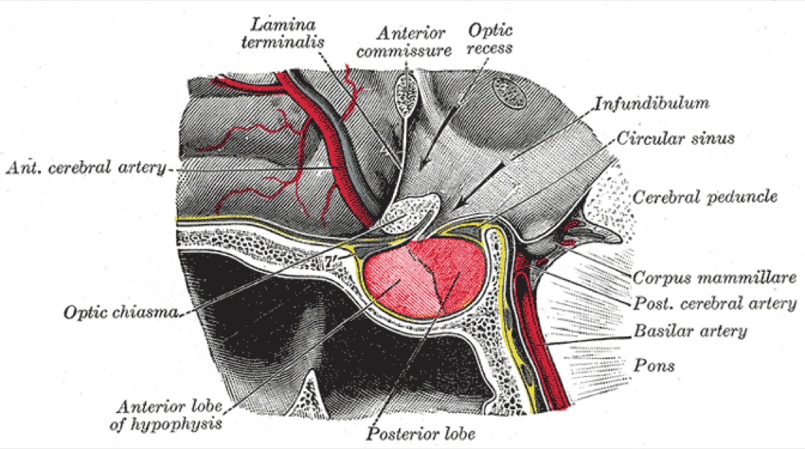

# Case Prep: Tuberculum Sellae Meningioma Resection

---

## One-Liner
[Age]yo [M/F] with a tuberculum sellae meningioma presenting with [progressive visual loss / bitemporal or junctional field defect] planned for [pterional / supraorbital / endoscopic endonasal] approach for resection.

---

## Figures, Imaging & Video

> 🧭 **Operative approach:** [Supraorbital keyhole craniotomy](../approaches/supraorbital-keyhole-craniotomy.md) — detailed corridor setup, step-by-step technique & figures

> Operative figures/atlases are © (linked, not copied). See [media-sources.md](../../resources/media-sources.md).
- **Technique/approach:** [The Neurosurgical Atlas](https://www.neurosurgicalatlas.com) — search *"tuberculum sellae meningioma"*
- **Imaging:** [Radiopaedia — tuberculum sellae meningioma](https://radiopaedia.org/search?q=tuberculum%20sellae%20meningioma&scope=all)
- **Open-access figures:** [PubMed Central](https://www.ncbi.nlm.nih.gov/pmc/?term=tuberculum+sellae+meningioma)

*Gray's Anatomy (1918) — public domain — via Wikimedia Commons.*

---

## History of Present Illness
- Chief complaint: **Progressive asymmetric visual loss** (chiasmal compression) — the hallmark
- Classic: junctional scotoma or bitemporal field defect
- Headache, endocrine usually intact (vs pituitary)

---

## Imaging Review
### MRI (T1+Gad, thin-cut sella, T2) + MRA
- Tumor centered on tuberculum sellae, suprasellar
- **Optic nerve/chiasm displacement** (usually superior/posterior) — chiasm prefixed?
- **Optic canal extension** (common — must decompress)
- **ICA and branches** relationship; ACA complex superiorly
- Pituitary stalk/gland (usually separate, displaced inferiorly)
- Vascular supply

### CT
- Hyperostosis of tuberculum/planum, optic canal anatomy, sphenoid pneumatization (for endonasal)

### Ophthalmology
- [ ] Formal fields, acuity, OCT/RNFL

---

## Labs
- [ ] CBC, BMP, Coags, Type and screen; pituitary panel (baseline)

---

## Neurological Examination
- Detailed visual assessment, EOM, endocrine review

---

## Surgical Planning

### Approach Selection
- **Pterional/supraorbital (transcranial):** Lateral view, early ICA/optic control, good for lateral extension or vessel encasement
- **Endoscopic endonasal:** Direct inferior-to-superior access, early devascularization, decompresses optic canals medially, no brain/optic nerve retraction — favored for midline tumors without significant lateral/vascular encasement; requires skull base reconstruction
- Side (transcranial): side of worse vision or larger tumor extension

### Position
- Pterional: supine, rotated 20-30 degrees contralateral, extended, Mayfield
- Endonasal: supine, slight extension, navigation

### Key Surgical Steps (Transcranial)
1. Pterional/supraorbital craniotomy, drill sphenoid wing
2. Open sylvian/basal cisterns, drain CSF
3. Identify ipsilateral optic nerve, ICA, chiasm
4. **Unroof optic canal** to decompress and free the optic nerve (improves visual outcome)
5. Devascularize tumor base at tuberculum/planum
6. Internal debulking; dissect tumor off optic apparatus (preserve pial vessels/superior hypophyseal arteries to chiasm)
7. Protect ACA complex superiorly, ICA laterally, stalk inferiorly
8. Resect base dura/bone (Simpson I if safe)
9. Reconstruction, closure

### Critical Anatomy & Structures at Risk
1. **Optic nerves / chiasm** — primary structure; preserve **superior hypophyseal artery** branches to chiasm (visual outcome)
2. **ICA and branches**
3. **ACA / A1 complex** (superior)
4. **Pituitary stalk and gland**
5. Optic canal (decompress)

### Equipment
- [ ] Microscope (± endoscope), navigation, high-speed drill (optic canal), CUSA, ICG
- [ ] Skull base reconstruction (nasoseptal flap if endonasal; graft/sealant)

### Monitoring
- [ ] SSEPs; VEPs (optional)

### Anesthesia
- [ ] Arterial line, mannitol, dexamethasone, lumbar drain (endonasal)

### Potential Complications
1. **Visual worsening** — devascularization of chiasm (superior hypophyseal artery injury)
2. ICA injury, CSF leak (esp. endonasal), hypopituitarism/DI
3. Residual in optic canal → recurrence

---

## Operative Note Template
**Preoperative Diagnosis:** Tuberculum sellae meningioma with progressive [asymmetric] visual loss

**Postoperative Diagnosis:** Same

**Procedure:** [Pterional / endoscopic endonasal extended transtuberculum] approach for resection of tuberculum sellae meningioma [with optic canal decompression]

**Surgeon / Assistant:** [± ENT co-surgeon if endonasal]
**Anesthesia:** General endotracheal
**EBL / Fluids:**
**Adjuncts:** Neuronavigation, high-speed drill (optic canal), microscope/endoscope, ICG; [lumbar drain if endonasal]
**Implants:** Dural substitute [/ nasoseptal flap, fascia/fat, sealant if endonasal]
**Complications:** None

**Indications:** [Age]yo [M/F] with a tuberculum sellae meningioma causing progressive visual decline (chiasmal compression, [junctional/bitemporal] field defect). Approach selected for [midline without vascular encasement → endonasal / lateral extension/vessel encasement → pterional]. Risks (visual worsening, ICA injury, CSF leak, endocrine) discussed.

**Description of Procedure:** After consent and time-out, general anesthesia was induced and navigation registered. [Pterional: the head was rotated ~20–30° contralateral, a pterional craniotomy performed, the sphenoid wing drilled, and the basal cisterns opened with CSF egress to relax the brain. The ipsilateral optic nerve, ICA, and chiasm were identified.] The involved optic canal was unroofed to decompress and free the optic nerve.

The tumor base at the tuberculum/planum was devascularized, the tumor internally debulked, and the capsule dissected off the optic apparatus and chiasm, **preserving the superior hypophyseal artery branches supplying the chiasm**; the ACA complex, ICA, and stalk were protected. The involved dura/bone was addressed (Simpson [I/II]) and the skull base reconstructed [multilayer with nasoseptal flap if endonasal].

Closure was completed and the patient transferred to the ICU with serial visual checks.

---

## Postoperative Plan
- [ ] ICU, neuro checks q1h, **visual checks**
- [ ] Endonasal: DI/Na monitoring, CSF leak precautions, AM cortisol
- [ ] MRI postop, ophthalmology and endocrine follow-up
- [ ] Steroid taper, DVT prophylaxis
