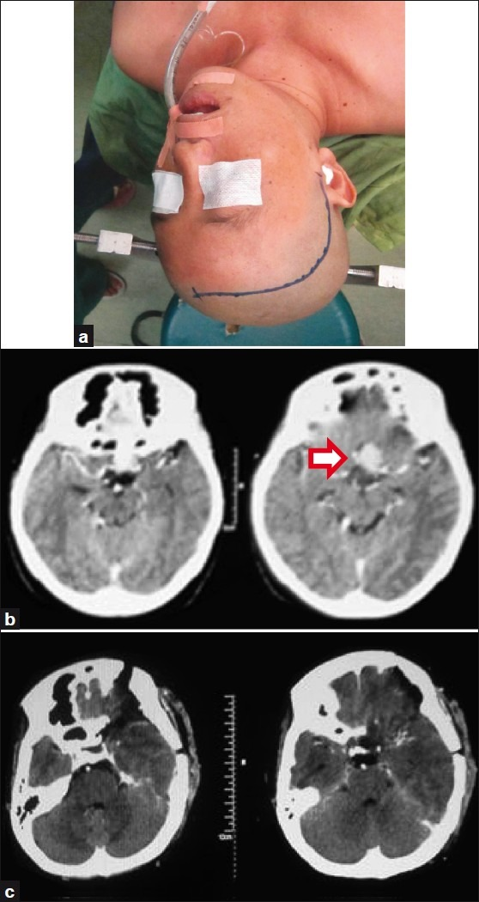
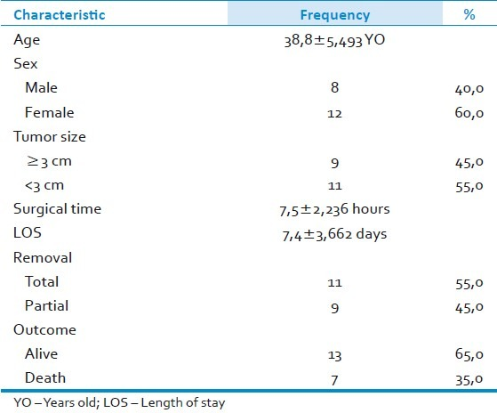
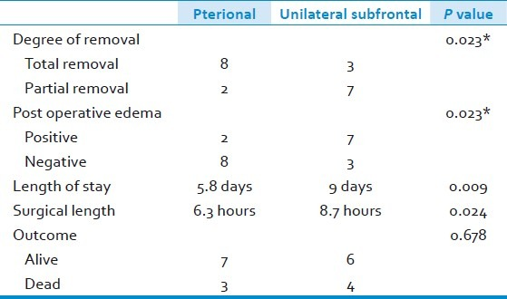
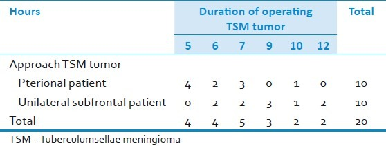
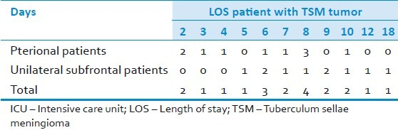
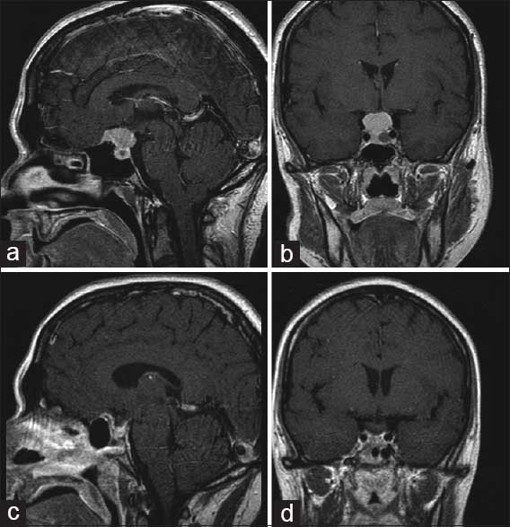
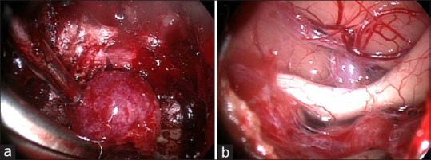
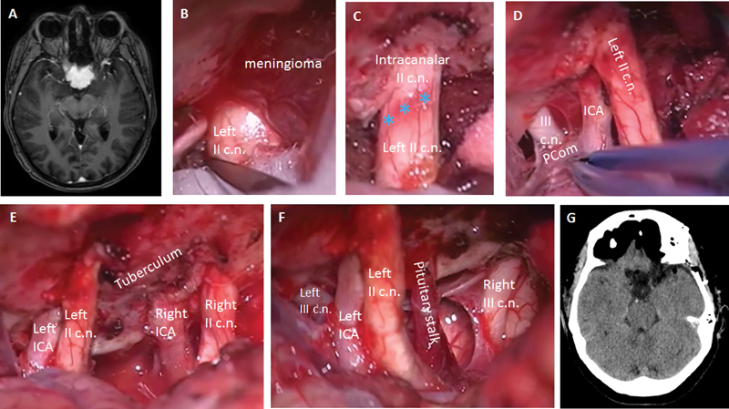
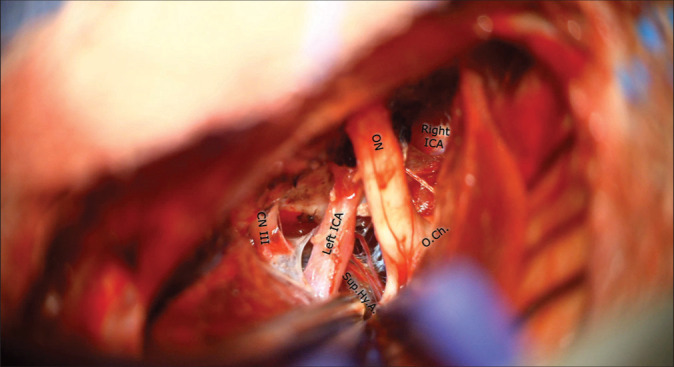

# Case Prep: Tuberculum Sellae Meningioma Resection

---

<!-- BEGIN CASE DOSSIER -->

## Case / Approach Dossier

- **Anatomy at risk:** tumor compartment, arterial supply, venous drainage/sinuses, cranial nerves, white-matter tracts, pituitary/CSF pathways when relevant, and functional cortex.
- **Operative steps:** review imaging and goals, choose exposure, obtain brain relaxation, devascularize when possible, debulk internally, dissect capsule from critical structures, verify extent/safety, and reconstruct watertight closure; use the detailed operative sequence and approach notes below as the step-by-step source.
- **Rescue plans:** venous or arterial injury, swelling, seizure, cranial nerve or endocrine change, CSF leak, residual tumor left for safety, staged surgery, radiation, or adjuvant therapy.
- **Figures:** review [Figures, Imaging & Video](#figures-imaging--video) and the [Curated Image Set](#curated-image-set); embedded local figures should remain open-access, public-domain, or otherwise reusable with attribution.
- **Papers:** review [High-Yield Literature](#high-yield-literature) for seminal sources, modern reviews, and outcome data specific to this page.
- **Textbook cross-checks:** use [Textbook Cross-Checks](#textbook-cross-checks) and the [Source Crosswalk](../../resources/source-crosswalk.md) to cite copyrighted textbooks/atlases while summarizing in original words.

<!-- END CASE DOSSIER -->

## One-Liner
[Age]yo [M/F] with a tuberculum sellae meningioma presenting with [progressive visual loss / bitemporal or junctional field defect] planned for [pterional / supraorbital / endoscopic endonasal] approach for resection.

---

## Figures, Imaging & Video

**🎥 Operative video** — [search operative video on YouTube ▸](https://www.youtube.com/results?search_query=tuberculum+sellae+meningioma+surgery) · [The Neurosurgical Atlas ▸](https://www.neurosurgicalatlas.com)

> 🧭 **Operative approach:** [Supraorbital keyhole craniotomy](../approaches/supraorbital-keyhole-craniotomy.md) — detailed corridor setup, step-by-step technique & figures

> Operative figures/atlases are © (linked, not copied). See [media-sources.md](../../resources/media-sources.md).
- **Technique/approach:** [The Neurosurgical Atlas](https://www.neurosurgicalatlas.com) — search *"tuberculum sellae meningioma"*
- **Imaging:** [Radiopaedia — tuberculum sellae meningioma](https://radiopaedia.org/search?q=tuberculum%20sellae%20meningioma&scope=all)
- **Open-access figures:** [PubMed Central](https://www.ncbi.nlm.nih.gov/pmc/?term=tuberculum+sellae+meningioma)

---

<!-- BEGIN TEXTBOOK CROSS-CHECKS -->

## Textbook Cross-Checks

- **Tumor and skull-base anatomy:** Youmans and Winn; Schmidek and Sweet; Rhoton Cranial Anatomy; Brain Anatomy and Neurosurgical Approaches — confirm compartment, dural/vascular supply, cranial nerves, venous sinuses, white-matter tracts, and safe surgical corridors.
- **Oncologic strategy:** CNS Radiation Oncology Principles and Practice; Youmans and Winn; Greenberg — summarize goals of resection, adjuvant-therapy context, surveillance, and when subtotal resection is safer.
- **Complication rescue:** Schmidek and Sweet; Greenberg — review edema, seizure, venous injury, endocrinopathy/CSF leak, neurologic deficit, and reconstruction issues.
- **Copyright-safe use:** cite these sources as private cross-checks, then write the guide content in original words; do not re-host textbook pages, figures, tables, or board-review card material. See [Source Crosswalk & Copyright-Safe Use](../../resources/source-crosswalk.md).

<!-- END TEXTBOOK CROSS-CHECKS -->

<!-- BEGIN CURATED LITERATURE -->

## High-Yield Literature

- **International Tuberculum Sellae Meningioma Study: Surgical Outcomes and Management Trends** — Magill ST. Neurosurgery 2023. [PubMed](https://pubmed.ncbi.nlm.nih.gov/37389475/)
- **Tuberculum Sellae Meningioma: Report of Two Cases and Literature Review of Limits of the Transcranial and Endonasal Endoscopic Approaches** — Silvestri M. Acta neurochirurgica. Supplement 2023. [PubMed](https://pubmed.ncbi.nlm.nih.gov/38153452/)
- **International Tuberculum Sellae Meningioma Study: Preoperative Grading Scale to Predict Outcomes and Propensity-Matched Outcomes by Endonasal Versus Transcranial Approach** — Magill ST. Neurosurgery 2023. [PubMed](https://pubmed.ncbi.nlm.nih.gov/37418417/)
- **Surgical Management of Tuberculum Sellae Meningioma: Our Experience and Review of the Literature** — Sankhla SK. Neurology India 2021. [PubMed](https://pubmed.ncbi.nlm.nih.gov/34979648/)
- **Olfactory groove and tuberculum sellae meningioma resection by endoscopic endonasal approach versus transcranial approach: A systematic review and meta-analysis of comparative studies** — Lu VM. Clinical neurology and neurosurgery 2018. [PubMed](https://pubmed.ncbi.nlm.nih.gov/30193170/)
- **Surgical management of tuberculum sellae meningioma: Transcranial approach or endoscopic endonasal approach?** — Qian K. Frontiers in surgery 2022. [PubMed](https://pubmed.ncbi.nlm.nih.gov/36117830/)
- **Contralateral supraorbital eyebrow approach for tuberculum sellae meningioma** — Das KK. Acta neurochirurgica 2023. [PubMed](https://pubmed.ncbi.nlm.nih.gov/37452902/)
- **Tuberculum sellae meningioma surgery: visual outcomes and surgical aspects of contralateral approach** — Voznyak O. Neurosurgical review 2021. [PubMed](https://pubmed.ncbi.nlm.nih.gov/32180047/)
- **Contralateral subfrontal approach for tuberculum sellae meningioma: techniques and clinical outcomes** — Kim YJ. Journal of neurosurgery 2023. [PubMed](https://pubmed.ncbi.nlm.nih.gov/35901684/)
- **Microsurgical Resection of Tuberculum Sellae Meningioma through Pterional Approach with Extradural Optic Canal Unroofing** — Matsuo S. Journal of neurological surgery. Part B, Skull base 2022. [PubMed](https://pubmed.ncbi.nlm.nih.gov/36068909/)

<!-- END CURATED LITERATURE -->

---

<!-- BEGIN CURATED IMAGE SET -->

## Curated Image Set

Open-access figures are embedded from PubMed Central articles and kept unique to this guide.

*Figure 1. Pterional approach marking (a) A representative head CT scan before; (b) and after pterional approach surgery; (c) Red arrow: Tuberculum sellae meningioma Source: [Pterional approach versus unilateral frontal approach on tuberculum sellae meningioma: Single centre experiences](https://pmc.ncbi.nlm.nih.gov/articles/PMC3358953/) — Asian Journal of Neurosurgery 2012; CC BY-NC-SA.*

*Figure 2. Source: [Pterional approach versus unilateral frontal approach on tuberculum sellae meningioma: Single centre experiences](https://pmc.ncbi.nlm.nih.gov/articles/PMC3358953/) — Asian J Neurosurg. 2012 Jan-Mar;7(1):21–4. doi: 10.4103/1793-5482.95691; CC BY-NC-SA.*

*Figure 3. Source: [Pterional approach versus unilateral frontal approach on tuberculum sellae meningioma: Single centre experiences](https://pmc.ncbi.nlm.nih.gov/articles/PMC3358953/) — Asian J Neurosurg. 2012 Jan-Mar;7(1):21–4. doi: 10.4103/1793-5482.95691; CC BY-NC-SA.*

*Figure 4. Source: [Pterional approach versus unilateral frontal approach on tuberculum sellae meningioma: Single centre experiences](https://pmc.ncbi.nlm.nih.gov/articles/PMC3358953/) — Asian J Neurosurg. 2012 Jan-Mar;7(1):21–4. doi: 10.4103/1793-5482.95691; CC BY-NC-SA.*

*Figure 5. Source: [Pterional approach versus unilateral frontal approach on tuberculum sellae meningioma: Single centre experiences](https://pmc.ncbi.nlm.nih.gov/articles/PMC3358953/) — Asian J Neurosurg. 2012 Jan-Mar;7(1):21–4. doi: 10.4103/1793-5482.95691; CC BY-NC-SA.*

*Figure 1. Magnetic resonance images: T1 weighted contrast-enhanced sagittal (a) and coronal (b) preoperative images showing coexistent macroadenoma and tuberculum sellae meningioma. Postoperative... Source: [Endoscopic endonasal transsphenoidal approach for resection of a coexistent pituitary macroadenoma and a tuberculum sellae meningioma](https://pmc.ncbi.nlm.nih.gov/articles/PMC4323972/) — Asian Journal of Neurosurgery 2014; CC BY-NC-SA.*

*Figure 2. (a) The intraoperative endoscopic view (screenshot) of the endonasal transsphenoidal approach to the planum sphenoidale and tuberculum sellae and identification of the meningioma. (b)... Source: [Endoscopic endonasal transsphenoidal approach for resection of a coexistent pituitary macroadenoma and a tuberculum sellae meningioma](https://pmc.ncbi.nlm.nih.gov/articles/PMC4323972/) — Asian Journal of Neurosurgery 2014; CC BY-NC-SA.*

*Fig. 1. ( A ) Preoperative MRI shows a contrast-enhanced tuberculum sellae lesion, suspicious of meningioma. ( B ) The left optic nerve (II c.n.) is evidenced through a left pterional approach.... Source: [Tuberculum Sellae Meningioma Resection: Technical Nuances on the Frontopterional Approach](https://pmc.ncbi.nlm.nih.gov/articles/PMC5797317/) — Journal of Neurological Surgery. Part B, Skull Base 2018; CC BY-NC-ND.*

*Figure. Figure 1 Source: [Keyhole supraorbital eyebrow approach for the resection of a tuberculum sellae meningioma with intraoperative endoscopic assistance](https://pmc.ncbi.nlm.nih.gov/articles/PMC8986636/) — Surgical Neurology International 2022; CC BY-NC-SA.*

*Figure 10. Source: [Keyhole supraorbital eyebrow approach for the resection of a tuberculum sellae meningioma with intraoperative endoscopic assistance](https://pmc.ncbi.nlm.nih.gov/articles/PMC8986636/) — Surg Neurol Int. 2022 Mar 18;13:93. doi: 10.25259/SNI_1173_2021; CC BY-NC-SA.*

<!-- END CURATED IMAGE SET -->

---

## History of Present Illness
- Chief complaint: **Progressive asymmetric visual loss** (chiasmal compression) — the hallmark
- Classic: junctional scotoma or bitemporal field defect
- Headache, endocrine usually intact (vs pituitary)

---

## Imaging Review
### MRI (T1+Gad, thin-cut sella, T2) + MRA
- Tumor centered on tuberculum sellae, suprasellar
- **Optic nerve/chiasm displacement** (usually superior/posterior) — chiasm prefixed?
- **Optic canal extension** (common — must decompress)
- **ICA and branches** relationship; ACA complex superiorly
- Pituitary stalk/gland (usually separate, displaced inferiorly)
- Vascular supply

### CT
- Hyperostosis of tuberculum/planum, optic canal anatomy, sphenoid pneumatization (for endonasal)

### Ophthalmology
- Formal fields, acuity, OCT/RNFL

---

## Labs
- CBC, BMP, Coags, Type and screen; pituitary panel (baseline)

---

## Neurological Examination
- Detailed visual assessment, EOM, endocrine review

---

## Surgical Planning

### Approach Selection
- **Pterional/supraorbital (transcranial):** Lateral view, early ICA/optic control, good for lateral extension or vessel encasement
- **Endoscopic endonasal:** Direct inferior-to-superior access, early devascularization, decompresses optic canals medially, no brain/optic nerve retraction — favored for midline tumors without significant lateral/vascular encasement; requires skull base reconstruction
- Side (transcranial): side of worse vision or larger tumor extension

### Position
- Pterional: supine, rotated 20-30 degrees contralateral, extended, Mayfield
- Endonasal: supine, slight extension, navigation

### Key Surgical Steps (Transcranial)
1. Pterional/supraorbital craniotomy, drill sphenoid wing
2. Open sylvian/basal cisterns, drain CSF
3. Identify ipsilateral optic nerve, ICA, chiasm
4. **Unroof optic canal** to decompress and free the optic nerve (improves visual outcome)
5. Devascularize tumor base at tuberculum/planum
6. Internal debulking; dissect tumor off optic apparatus (preserve pial vessels/superior hypophyseal arteries to chiasm)
7. Protect ACA complex superiorly, ICA laterally, stalk inferiorly
8. Resect base dura/bone (Simpson I if safe)
9. Reconstruction, closure

### Critical Anatomy & Structures at Risk
1. **Optic nerves / chiasm** — primary structure; preserve **superior hypophyseal artery** branches to chiasm (visual outcome)
2. **ICA and branches**
3. **ACA / A1 complex** (superior)
4. **Pituitary stalk and gland**
5. Optic canal (decompress)

### Equipment
- Microscope (± endoscope), navigation, high-speed drill (optic canal), CUSA, ICG
- Skull base reconstruction (nasoseptal flap if endonasal; graft/sealant)

### Monitoring
- SSEPs; VEPs (optional)

### Anesthesia
- Arterial line, mannitol, dexamethasone, lumbar drain (endonasal)

### Potential Complications
1. **Visual worsening** — devascularization of chiasm (superior hypophyseal artery injury)
2. ICA injury, CSF leak (esp. endonasal), hypopituitarism/DI
3. Residual in optic canal → recurrence

---

## Operative Note Template
**Preoperative Diagnosis:** Tuberculum sellae meningioma with progressive [asymmetric] visual loss

**Postoperative Diagnosis:** Same

**Procedure:** [Pterional / endoscopic endonasal extended transtuberculum] approach for resection of tuberculum sellae meningioma [with optic canal decompression]

**Surgeon / Assistant:** [± ENT co-surgeon if endonasal]
**Anesthesia:** General endotracheal
**EBL / Fluids:**
**Adjuncts:** Neuronavigation, high-speed drill (optic canal), microscope/endoscope, ICG; [lumbar drain if endonasal]
**Implants:** Dural substitute [/ nasoseptal flap, fascia/fat, sealant if endonasal]
**Complications:** None

**Indications:** [Age]yo [M/F] with a tuberculum sellae meningioma causing progressive visual decline (chiasmal compression, [junctional/bitemporal] field defect). Approach selected for [midline without vascular encasement → endonasal / lateral extension/vessel encasement → pterional]. Risks (visual worsening, ICA injury, CSF leak, endocrine) discussed.

**Description of Procedure:** After consent and time-out, general anesthesia was induced and navigation registered. [Pterional: the head was rotated ~20–30° contralateral, a pterional craniotomy performed, the sphenoid wing drilled, and the basal cisterns opened with CSF egress to relax the brain. The ipsilateral optic nerve, ICA, and chiasm were identified.] The involved optic canal was unroofed to decompress and free the optic nerve.

The tumor base at the tuberculum/planum was devascularized, the tumor internally debulked, and the capsule dissected off the optic apparatus and chiasm, **preserving the superior hypophyseal artery branches supplying the chiasm**; the ACA complex, ICA, and stalk were protected. The involved dura/bone was addressed (Simpson [I/II]) and the skull base reconstructed [multilayer with nasoseptal flap if endonasal].

Closure was completed and the patient transferred to the ICU with serial visual checks.

---

## Postoperative Plan
- ICU, neuro checks q1h, **visual checks**
- Endonasal: DI/Na monitoring, CSF leak precautions, AM cortisol
- MRI postop, ophthalmology and endocrine follow-up
- Steroid taper, DVT prophylaxis
