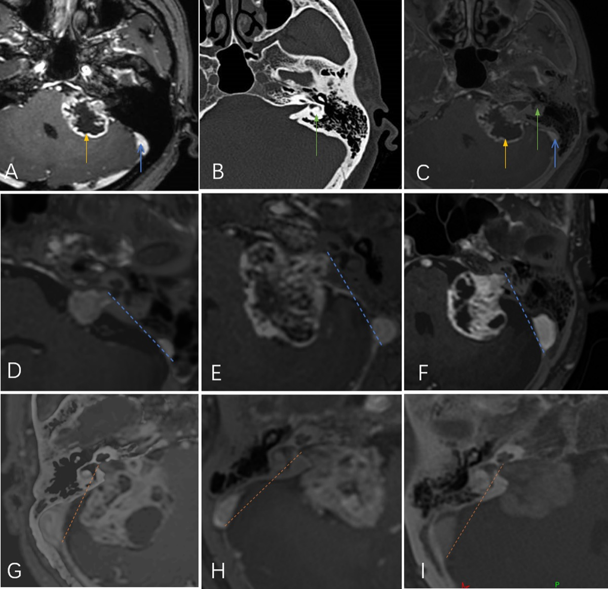
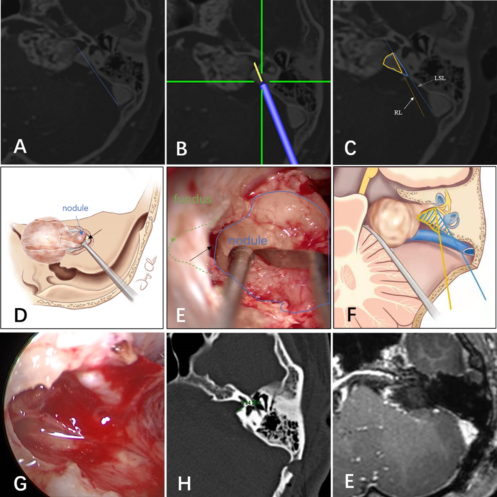
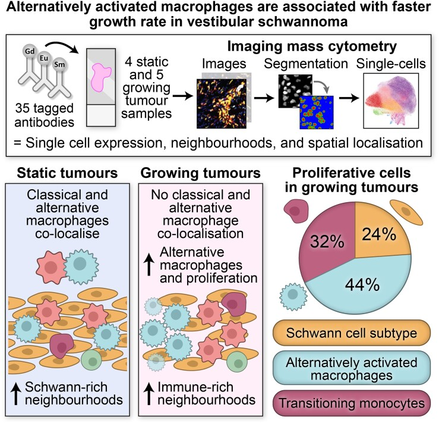
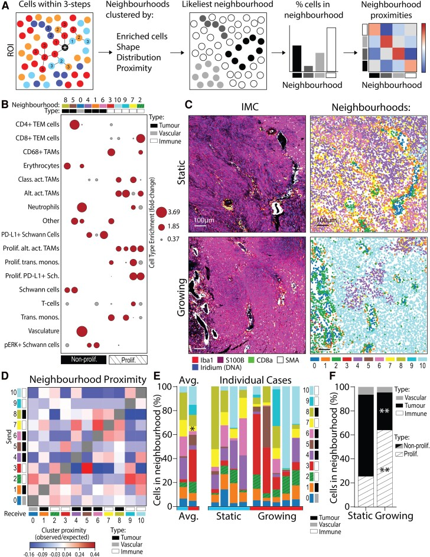
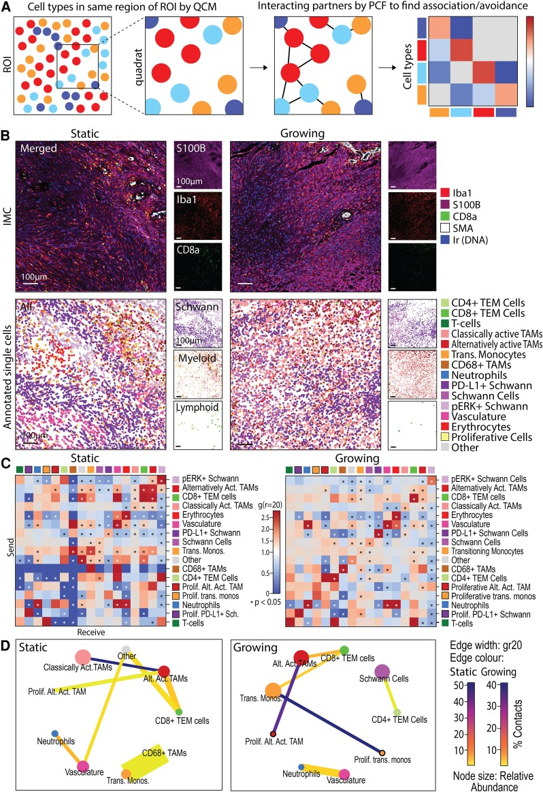
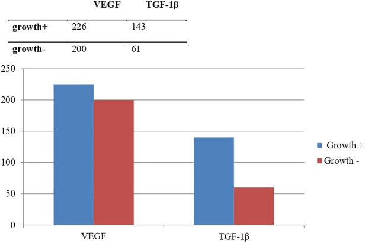
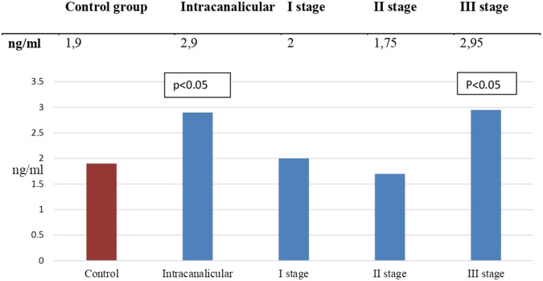
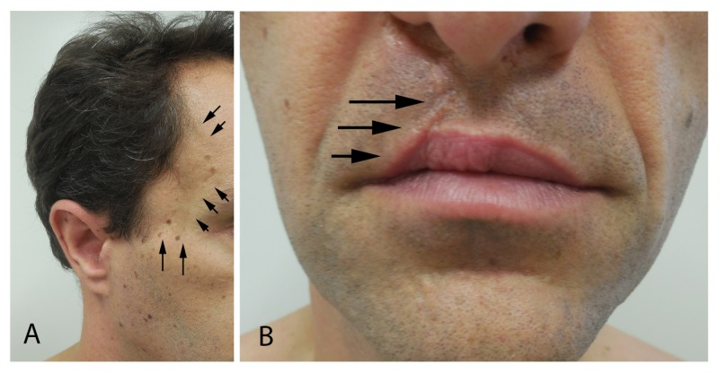
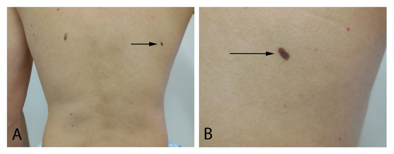
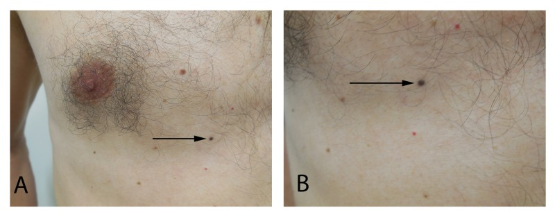

# Case Prep: Vestibular Schwannoma (Acoustic Neuroma) Resection

---

<!-- BEGIN CASE SNAPSHOT -->

## Case / Approach Snapshot

- **Anatomy at risk:** tumor compartment, arterial supply, venous drainage/sinuses, cranial nerves, white-matter tracts, pituitary/CSF pathways when relevant, and functional cortex.
- **Operative steps:** review imaging and goals, choose exposure, obtain brain relaxation, devascularize when possible, debulk internally, dissect capsule from critical structures, verify extent/safety, and reconstruct watertight closure; use the detailed operative sequence and approach notes below as the step-by-step source.
- **Rescue plans:** venous or arterial injury, swelling, seizure, cranial nerve or endocrine change, CSF leak, residual tumor left for safety, staged surgery, radiation, or adjuvant therapy.
- **Figures:** review [Figures, Imaging & Video](#figures-imaging--video) and the [Curated Image Set](#curated-image-set); embedded local figures should remain open-access, public-domain, or otherwise reusable with attribution.
- **Papers:** review [High-Yield Literature](#high-yield-literature) for seminal sources, modern reviews, and outcome data specific to this page.

<!-- END CASE SNAPSHOT -->

## One-Liner
[Age]yo [M/F] with a [size] cm [left/right] vestibular schwannoma (Koos grade [I-IV]) presenting with [hearing loss/tinnitus/facial numbness/imbalance] planned for [retrosigmoid/translabyrinthine/middle fossa] craniotomy for [gross total/near total/subtotal] resection.

---

## Figures, Imaging & Video

**🎥 Operative video** — *Extended Retrosigmoid Craniotomy for Vestibular Schwannoma* · Barrow Neurological Institute

<iframe src="https://www.youtube-nocookie.com/embed/zxYYb4ES5G4" title="Extended Retrosigmoid Craniotomy for Vestibular Schwannoma" loading="lazy" allow="accelerometer; clipboard-write; encrypted-media; picture-in-picture; web-share" allowfullscreen></iframe>

More operative video: [YouTube ▸](https://www.youtube.com/results?search_query=vestibular+schwannoma+retrosigmoid+resection) · [Neurosurgical Atlas ▸](https://www.neurosurgicalatlas.com)

> 🧭 **Operative approach:** [Retrosigmoid craniotomy](../approaches/retrosigmoid-craniotomy.md) — detailed corridor setup, step-by-step technique & figures

[Neurosurgical Atlas](https://www.neurosurgicalatlas.com) · [Radiopaedia](https://radiopaedia.org/search?q=vestibular%20schwannoma&scope=all) · [PubMed Central](https://www.ncbi.nlm.nih.gov/pmc/?term=vestibular+schwannoma+resection) — operative figures © linked; see [media-sources.md](../../resources/media-sources.md)

*MRI/CT fusion: tumor (yellow), sigmoid sinus (blue), labyrinth (green); lateral vs medial type relative to the lateral safe line. Source: Jia et al., Front Surg 2022;9:889402, Fig 1. CC BY 4.0.*

*Microscopic view of the intrameatal tumor (blue) / IAC fundus (green) interface, with postop imaging confirming complete resection and intact labyrinth. Source: Jia et al., Front Surg 2022;9:889402, Fig 3. CC BY 4.0.*

---

<!-- BEGIN CURATED LITERATURE -->

## High-Yield Literature

- **EANO guideline on the diagnosis and treatment of vestibular schwannoma** — Goldbrunner R. Neuro-oncology 2020. [PubMed](https://pubmed.ncbi.nlm.nih.gov/31504802/)
- **Vestibular schwannoma microsurgical technique** — Rutherford SA. Handbook of clinical neurology 2025. [PubMed](https://pubmed.ncbi.nlm.nih.gov/41052842/)
- **Hearing Rehabilitation in Vestibular Schwannoma** — Mankekar G. Audiology research 2023. [PubMed](https://pubmed.ncbi.nlm.nih.gov/37218842/)
- **Genomics of vestibular schwannoma** — Smith MJ. Handbook of clinical neurology 2025. [PubMed](https://pubmed.ncbi.nlm.nih.gov/41052866/)
- **The inflammatory microenvironment in vestibular schwannoma** — Hannan CJ. Neuro-oncology advances 2020. [PubMed](https://pubmed.ncbi.nlm.nih.gov/32642684/)
- **Retrosigmoid approach to vestibular schwannoma** — Shapey J. Handbook of clinical neurology 2025. [PubMed](https://pubmed.ncbi.nlm.nih.gov/41052837/)
- **Hearing Aid in Vestibular-Schwannoma-Related Hearing Loss: A Review** — Di Pasquale Fiasca VM. Audiology research 2023. [PubMed](https://pubmed.ncbi.nlm.nih.gov/37622930/)
- **History of vestibular schwannoma management** — Ramsden R. Handbook of clinical neurology 2025. [PubMed](https://pubmed.ncbi.nlm.nih.gov/41052831/)
- **Management of Complications in Vestibular Schwannoma Surgery** — Kutz JW Jr. Otolaryngologic clinics of North America 2023. [PubMed](https://pubmed.ncbi.nlm.nih.gov/36964095/)
- **Vestibular schwannoma unveiled by pregnancy: A case report and literature review** — Kadir V. European journal of obstetrics, gynecology, and reproductive biology 2024. [PubMed](https://pubmed.ncbi.nlm.nih.gov/38852318/)

<!-- END CURATED LITERATURE -->

---

<!-- BEGIN CURATED IMAGE SET -->

## Curated Image Set

Open-access figures are embedded from PubMed Central articles and kept unique to this guide.

*Graphical Abstract. Source: [Alternatively activated macrophages are associated with faster growth rate in vestibular schwannoma](https://pmc.ncbi.nlm.nih.gov/articles/PMC11604085/) — Brain Communications 2024; CC BY.*

*Figure 3. Growing VS have more cells residing in proliferative, immune-enriched neighbourhoods. (A) Schematic detailing how the cells within a three-step connection from the target cell define a... Source: [Alternatively activated macrophages are associated with faster growth rate in vestibular schwannoma](https://pmc.ncbi.nlm.nih.gov/articles/PMC11604085/) — Brain Communications 2024; CC BY.*

*Figure 4. Classically activated TAMs associate with alternatively activated TAMs in static but not growing VS. (A) Schematic detailing how significant positive and negative cell–cell spatial... Source: [Alternatively activated macrophages are associated with faster growth rate in vestibular schwannoma](https://pmc.ncbi.nlm.nih.gov/articles/PMC11604085/) — Brain Communications 2024; CC BY.*

*Figure 4. Source: [Sudden Sensorineural Hearing Loss and Facial Palsy in Patients with Vestibular Schwannoma Based on the Population Data of Korea](https://pmc.ncbi.nlm.nih.gov/articles/PMC10765230/) — J Int Adv Otol. 2023 Nov 1;19(6):468–71. doi: 10.5152/iao.2023.231121; CC BY-NC.*

*Figure 5. Source: [Immunological Analysis of Vestibular Schwannoma Patients](https://pmc.ncbi.nlm.nih.gov/articles/PMC9984973/) — J Int Adv Otol. 2023 Jan 1;19(1):1–4. doi: 10.5152/iao.2023.22581; CC BY-NC.*

*Figure 1.. Level of growth factors in the tumor growth group vs. the no tumor growth group. Source: [Immunological Analysis of Vestibular Schwannoma Patients](https://pmc.ncbi.nlm.nih.gov/articles/PMC9984973/) — The Journal of International Advanced Otology 2023; CC BY-NC.*

*Figure 2.. Concentration of carcinoembryonic antigen in patients with different stages of vestibular schwannoma in comparison to the control group. Source: [Immunological Analysis of Vestibular Schwannoma Patients](https://pmc.ncbi.nlm.nih.gov/articles/PMC9984973/) — The Journal of International Advanced Otology 2023; CC BY-NC.*

*Figure 1. Juvenile nasopharyngeal angiofibroma and cleft lip and cleft palate.A 38-year-old man has atrophy of the right temporal area (arrows) resulting from the surgical treatment of his... Source: [A Man with Juvenile Nasopharyngeal Angiofibroma, Vestibular Schwannoma, Cleft Lip and Cleft Palate, and Various Nevi: Case Report and Review](https://pmc.ncbi.nlm.nih.gov/articles/PMC6417465/) — Cureus 2018; CC BY.*

*Figure 2. Compound dysplastic nevus with mild atypia on the right mid-back.Distant (A) and closer (B) views of an oval dark brown patch (arrow) on the right mid-back. Microscopic examination of... Source: [A Man with Juvenile Nasopharyngeal Angiofibroma, Vestibular Schwannoma, Cleft Lip and Cleft Palate, and Various Nevi: Case Report and Review](https://pmc.ncbi.nlm.nih.gov/articles/PMC6417465/) — Cureus 2018; CC BY.*

*Figure 3. Combined (blue and intradermal) nevus of the right mid-chest.Distant (A) and closer (B) views of a small black macule (arrow) on the right mid-chest. Microscopic examination of the shave... Source: [A Man with Juvenile Nasopharyngeal Angiofibroma, Vestibular Schwannoma, Cleft Lip and Cleft Palate, and Various Nevi: Case Report and Review](https://pmc.ncbi.nlm.nih.gov/articles/PMC6417465/) — Cureus 2018; CC BY.*

<!-- END CURATED IMAGE SET -->

---

## History of Present Illness
- Chief complaint: Unilateral sensorineural hearing loss / tinnitus / imbalance / facial numbness
- Duration and progression:
- Hearing: Unilateral progressive sensorineural hearing loss; sudden hearing loss in some
- Tinnitus: Unilateral
- Vestibular: Imbalance (rarely vertigo — slow-growing tumor allows compensation)
- Facial sensation: Numbness (CN V compression — large tumors)
- Facial weakness: Rare at presentation unless very large
- Headache: Suggests hydrocephalus (large tumors with brainstem compression)
- NF2: Bilateral vestibular schwannomas = NF2 (different management)

---

## Past Medical History
- **NF2 (neurofibromatosis type 2)** — bilateral VS; hearing preservation paramount
- Prior hearing loss (baseline hearing status critical for approach selection)
- Prior radiation (gamma knife, proton beam)
- Prior surgery
- Allergies:
- Medications:

---

## Imaging Review
### MRI Brain/IAC (Thin-cut T1+Gad, T2, CISS/FIESTA)
- **Size:** ___ x ___ x ___ cm (largest CPA component)
- **Koos classification:**
  - Grade I: Intracanalicular only
  - Grade II: Extends into CPA, < 2 cm
  - Grade III: Fills CPA but no brainstem contact, 2-3 cm
  - Grade IV: Brainstem compression, > 3 cm
- **IAC involvement:** Fundus extension, canal widening
- **Brainstem compression:** Degree of displacement, 4th ventricle compression
- **Hydrocephalus:** Present/absent
- **Cerebellopontine angle:** Tumor filling, cistern obliteration
- **Cranial nerves:**
  - CN VII (facial nerve): Often displaced anteroinferiorly by tumor
  - CN V: Contact or compression (large tumors)
  - CN VIII: Origin nerve (superior vs inferior vestibular)
- **Cystic component:** Cystic tumors can be more adherent to facial nerve
- **Enhancement:** Homogeneous (typical) vs heterogeneous

### CT Temporal Bone
- IAC widening
- Posterior fossa bony anatomy
- Vestibular aqueduct
- Cochlear apparatus (hearing preservation planning)

### Audiometry
- **Pure tone audiogram:** SRT, speech discrimination score (SDS)
- **Serviceable hearing:** AAO-HNS Class A or B (SDS >= 50%, PTA <= 50 dB)
- **Non-serviceable hearing:** Class C or D
- **ABR (auditory brainstem response):** Wave V latency
- **Word recognition score (WRS):** Critical for approach selection

---

## Labs
- CBC, BMP, Coags
- Type and crossmatch
- Genetic testing for NF2 if bilateral or young

---

## Neurological Examination
### Cranial Nerves (Detailed)
- **CN V:** Facial sensation (V1, V2, V3), corneal reflex, masseter
- **CN VII:** House-Brackmann grade at baseline (I = normal, VI = total paralysis)
- **CN VIII:**
  - Hearing: Weber (lateralizes to GOOD ear), Rinne (positive both sides if sensorineural)
  - Vestibular: Romberg, head thrust test, nystagmus
- **CN IX-XII:** Lower cranial nerves (large tumors)

### Cerebellar
- Gait, tandem walking, coordination

---

## Surgical Planning

### Case Logistics, OR Needs & Orders
- **Typical bed:** neuro ICU for posterior fossa/skull base/pineal cases because hydrocephalus, airway, lower-CN, and hemorrhage changes can be abrupt.
- **OR setup:** Mayfield, navigation, microscope/endoscope, cranial nerve monitoring/BAER when relevant, EVD/CSF diversion plan, watertight closure and fat/fascia graft materials, and blood available for vascular tumors.
- **Special needs:** arterial line, Foley, dexamethasone for edema, antiemetic plan, lower-CN airway/swallow contingency, EVD/ETV plan for hydrocephalus, and audiology/facial-nerve baseline when relevant.
- **Immediate postop orders:** ICU neuro checks, CN/eye movement/facial/swallow/voice exams, HOB 30, CT for hemorrhage/hydrocephalus, MRI for EOR, CSF-leak/pseudomeningocele watch, dex taper, and early swallow/ENT consult when lower CN risk exists.

### Approach Selection — CRITICAL DECISION

| Approach | Hearing Preservation | Facial Nerve View | Best For |
|----------|---------------------|-------------------|----------|
| **Retrosigmoid** | Possible | Good (posterior view) | Medium tumors, hearing preservation attempt |
| **Translabyrinthine** | No (destroys labyrinth) | Excellent (early ID) | Large tumors, non-serviceable hearing |
| **Middle Fossa** | Best chance | Adequate | Small intracanalicular, serviceable hearing |

- **Middle fossa:** Koos I, serviceable hearing, tumor < 1.5 cm
- **Retrosigmoid:** Koos II-III, serviceable hearing, tumor with CPA component
- **Translabyrinthine:** Koos III-IV, non-serviceable hearing, large tumors (best facial nerve outcome for large tumors)

### Position
**Retrosigmoid:**
- Lateral/park bench (ipsilateral side up) or supine with head turned
- Head flexed, vertex tilted down, mastoid highest point
- Mayfield skull clamp

**Translabyrinthine:**
- Supine, head turned contralateral, ipsilateral ear up
- Mayfield clamp
- Shoulder roll

**Middle Fossa:**
- Supine, head turned 90 degrees, ipsilateral ear up
- Mayfield clamp

### Key Surgical Steps (Retrosigmoid Approach)
1. **Retrosigmoid craniotomy** — expose sigmoid and transverse sinus junction
2. **Dural opening** — based on sinuses
3. **CSF drainage** — cerebellomedullary cistern for relaxation
4. **Cerebellar retraction** — minimal, gravity-assisted
5. **Identify tumor in CPA** — debulk the center (CUSA) to reduce tumor volume
6. **Identify CN VII** — CRITICAL
   - Typically displaced ANTEROINFERIORLY
   - Use facial nerve EMG stimulator to locate nerve on tumor capsule
   - CN VII course: brainstem → across CPA → tumor capsule (often splayed) → IAC → fundus
7. **Progressive tumor removal:**
   - Internal debulking first
   - Then capsule dissection from medial to lateral
   - Identify and preserve the arachnoid plane between tumor and brainstem/cerebellum
   - Identify CN VII on tumor capsule — dissect tumor OFF the nerve, NOT nerve off tumor
8. **Drill posterior wall of IAC** — to access intracanalicular component
   - Identify transverse crest (Bill's bar) — CN VII is ANTERIOR to Bill's bar
   - Leave a bone shell over the posterior semicircular canal (if hearing preservation)
9. **Remove intracanalicular tumor** — work lateral to medial
10. **Final facial nerve confirmation** — stimulate along entire course
11. **Hearing preservation:** If attempting, monitor BAER continuously; preserve cochlear nerve
12. **Hemostasis:** Pack IAC with fat graft + bone wax (prevent CSF leak)
13. **Dural closure:** Watertight with graft if needed

### Critical Anatomy & Structures at Risk
1. **Facial nerve (CN VII)** — the priority structure; displaced by tumor but usually anatomically continuous. Stimulate frequently to map location
2. **Cochlear nerve (CN VIII cochlear division)** — if hearing preservation attempted; runs with CN VII
3. **AICA** — may be displaced or encased; gives off labyrinthine artery
4. **Labyrinthine artery** — end artery to inner ear; injury → total hearing loss
5. **Trigeminal nerve (CN V)** — compressed superiorly by large tumors
6. **Lower cranial nerves (IX, X, XI)** — at risk with large tumors extending to jugular foramen
7. **Brainstem** — medially; avoid any traction or thermal injury
8. **Petrosal vein** — may need sacrifice for exposure; risk of venous infarction
9. **Cerebellum** — avoid retraction injury

### Equipment
- Operating microscope
- Facial nerve stimulator (monopolar and bipolar probes) — ESSENTIAL
- CUSA for tumor debulking
- High-speed drill (diamond burr for IAC drilling)
- Microsurgical instruments (micro scissors, dissectors, hooks)
- Bipolar (fine tip, low setting near facial nerve)
- Hemostatic agents
- Abdominal fat graft (for IAC packing and dead space)
- Bone wax
- Dural substitute

### Monitoring
- **Continuous facial EMG (CN VII)** — CRITICAL; detects mechanical irritation
- **Facial nerve stimulator** — direct stimulation to locate nerve on tumor
- **BAER** — hearing preservation monitoring
- SSEPs
- Optional: CN V, CN IX/X/XI EMG (large tumors)

### Anesthesia Considerations
- Arterial line
- Foley
- **NO long-acting paralytic after intubation** — facial EMG monitoring requires no paralysis
- Short-acting paralytic for intubation only, then allow to wear off
- Cefazolin 2g IV
- Dexamethasone 10 mg IV
- Mannitol 0.5-1 g/kg
- Antiemetics (ondansetron — posterior fossa high nausea risk)

### Potential Complications & Contingencies
1. **Facial nerve palsy** — most feared; intraoperative stimulation guides preservation; if nerve anatomically intact, may still have temporary palsy (neuropraxia) → House-Brackmann grading post-op; eye care essential
2. **Hearing loss** — labyrinthine artery injury, cochlear nerve stretch; BAER monitoring; accept loss if necessary for facial nerve preservation
3. **CSF leak** — watertight closure, fat graft in IAC; if post-op leak → lumbar drain or wound revision
4. **Meningitis** — from CSF leak pathway; monitor for fever/meningismus
5. **Cerebellar hematoma/edema** — minimize retraction
6. **Residual/recurrent tumor** — planned subtotal resection if facial nerve at risk → radiosurgery for residual
7. **Lower cranial nerve palsy** — swallowing difficulty, voice hoarseness; speech/swallow eval

---

## Operative Note Template

[Include: approach, tumor size, facial nerve location on tumor, stimulation thresholds throughout case, facial nerve anatomic preservation, extent of resection, IAC drilling, BAER monitoring results, fat graft placement, closure]

---

## Postoperative Plan
- ICU x 24-48 hours (posterior fossa)
- Neuro checks q1h — **posterior fossa precautions**
- **Facial nerve assessment:** House-Brackmann grade hourly initially
  - If HB > III: Ophthalmology consult for eye care (corneal exposure)
  - Eye lubrication (artificial tears q1h, ointment at night)
  - Moisture chamber at night
  - Gold weight consideration if persistent palsy
- CT head 6 hours post-op
- Audiogram before discharge (if hearing preservation attempted)
- HOB 30 degrees
- Dexamethasone taper
- Anti-emetics PRN
- DVT prophylaxis
- CSF leak monitoring: Watch incision and nose (rhinorrhea if via IAC/mastoid)
- MRI with gadolinium at 3-6 months (extent of resection)
- If subtotal resection: Plan for surveillance MRI and possible Gamma Knife for residual
- Follow-up: 2-4 weeks clinic; serial MRI; audiometry annually
- NF2 patients: Genetics, screening for other tumors (meningiomas, spinal tumors)
