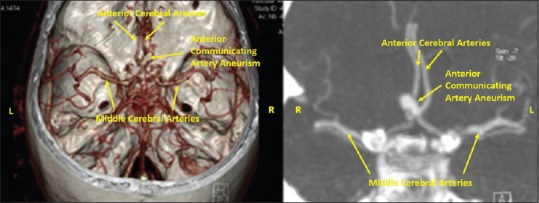
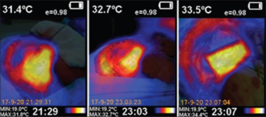
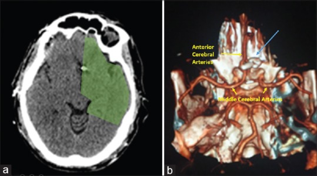
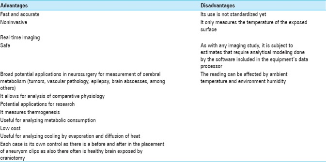
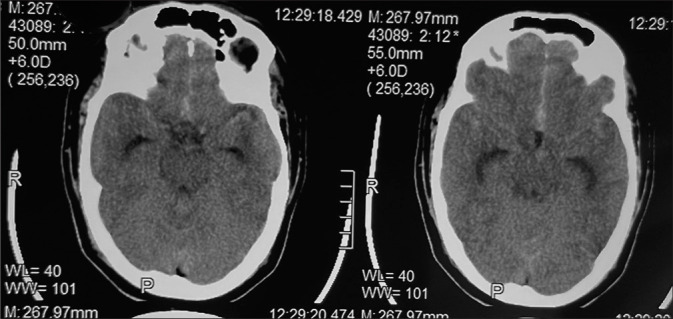
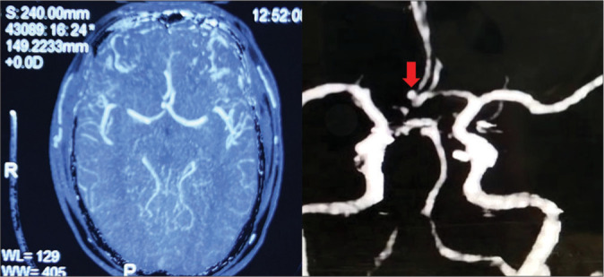
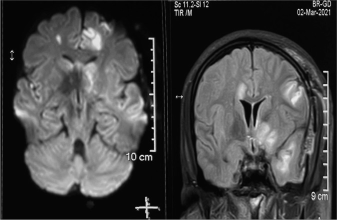
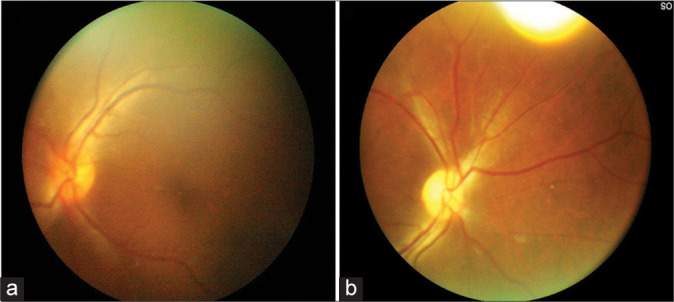
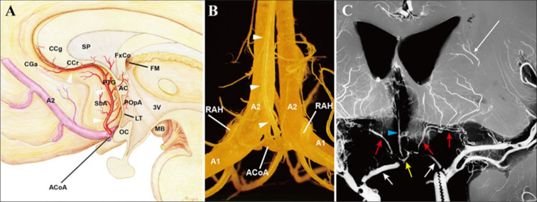

# Case Prep: Anterior Communicating Artery (AComA) Aneurysm Clipping

---

<!-- BEGIN CASE SNAPSHOT -->

## Case / Approach Snapshot

- **Anatomy at risk:** parent vessels, perforators, branch ostia, collateral circulation, venous drainage, cranial nerves, cisterns, and eloquent territories threatened by temporary occlusion or retraction.
- **Operative steps:** plan proximal and distal control, expose the corridor, obtain cerebrospinal fluid/brain relaxation, identify parent vessels before the lesion, treat the lesion/device target, and confirm flow and hemostasis before closure; use the detailed operative sequence and approach notes below as the step-by-step source.
- **Rescue plans:** intraoperative rupture, thromboembolism, branch or perforator compromise, vasospasm, inadequate proximal control, bypass or reconstructive options, anticoagulation/reversal, and postoperative surveillance.
- **Figures:** review [Figures, Imaging & Video](#figures-imaging--video) and the [Curated Image Set](#curated-image-set); embedded local figures should remain open-access, public-domain, or otherwise reusable with attribution.
- **Papers:** review [High-Yield Literature](#high-yield-literature) for seminal sources, modern reviews, and outcome data specific to this page.

<!-- END CASE SNAPSHOT -->

## One-Liner
[Age]yo [M/F] with [ruptured/unruptured] anterior communicating artery aneurysm presenting with [SAH/incidental finding] planned for [right/left] pterional craniotomy for microsurgical clipping.

---

## Figures, Imaging & Video

**🎥 Operative videos & resources**
- **Atlas / approach:** [Pterional craniotomy chapter](https://www.neurosurgicalatlas.com/volumes/cranial-approaches/pterional-craniotomy) · [Supraorbital eyebrow AComA case](https://www.neurosurgicalatlas.com/cases/supraorbital-eye-brow-craniotomy-for-an-a-comm-aneurysm)
- **Video searches:** [AComA aneurysm clipping on YouTube](https://www.youtube.com/results?search_query=anterior+communicating+artery+aneurysm+clipping) · [AComA aneurysm surgery on Neurosurgical Atlas](https://www.neurosurgicalatlas.com)
- **Angio anatomy:** [neuroangio.org](https://neuroangio.org) — ACA / AComA complex, perforators, cross-filling, projection patterns

> 🧭 **Operative approach:** [Pterional craniotomy](../approaches/pterional-craniotomy.md) — detailed corridor setup, step-by-step technique & figures

> Copyrighted operative figures/videos are linked, not copied. Embedded figures below are public-domain or CC-BY; see [media-sources.md](../../resources/media-sources.md) and [CREDITS.md](../../figures/CREDITS.md).

*Poblete T et al., Microsurgical Anatomy of the Anterior Circulation, Brain Sci 2021;11(4):519 — CC BY 4.0.*

---

<!-- BEGIN COMMON PIMP QUESTIONS -->

## Common Pimp Questions

Use these to pressure-test preparation for **Anterior Communicating Artery (AComA) Aneurysm Clipping**:

1. What is the proximal-control plan before the lesion is manipulated?
2. Which branch, perforator, or venous structure is most likely to be injured in this exposure?
3. What are the intraoperative rupture steps, including temporary clip, suction, BP, and backup clip strategy?
4. What confirms treatment success: ICG, Doppler, puncture/deflation, DSA, or postoperative CTA?
5. What postoperative BP, vasospasm, antiplatelet, or anticoagulation issue changes the orders tonight?

<!-- END COMMON PIMP QUESTIONS -->

<!-- BEGIN ATTENDING PREFERENCE VARIABLES -->

## Attending Preference Variables

Items that commonly vary by surgeon or institution:

- **Preferred approach side, sylvian split style, and cisternal-opening sequence:** [attending-specific]
- **Temporary clip threshold, burst-suppression preference, and BP during occlusion:** [attending-specific]
- **Clip manufacturer/shape sequence and whether Doppler, ICG, puncture, or intraop DSA is routine:** [attending-specific]
- **Antiplatelet/anticoagulation reversal and restart timing:** [attending-specific]

<!-- END ATTENDING PREFERENCE VARIABLES -->

<!-- BEGIN CURATED LITERATURE -->

## High-Yield Literature

- **Anterior Communicating Artery Aneurysm Clipping: Experience at a Tertiary Care Center with Respect to Intraoperative Rupture** — Singh RC. Asian journal of neurosurgery 2020. [PubMed](https://pubmed.ncbi.nlm.nih.gov/33708665/)
- **Utility of evoked potentials during anterior cerebral artery and anterior communicating artery aneurysm clipping** — Rabai F. Clinical neurophysiology practice 2022. [PubMed](https://pubmed.ncbi.nlm.nih.gov/35935596/)
- **Contralateral Vasospasm in an Uncomplicated Elective Anterior Communicating Artery Aneurysm Clipping** — Knight JA 2nd. World neurosurgery 2020. [PubMed](https://pubmed.ncbi.nlm.nih.gov/32145422/)
- **Clinical use of 3D printed models for anterior communicating artery aneurysm clipping: a prospective cohort study** — Feng C. Frontiers in surgery 2025. [PubMed](https://pubmed.ncbi.nlm.nih.gov/41415533/)
- **Paradoxical giftedness and memory decline after anterior communicating artery aneurysm clipping: A high-resolution MRI case report** — Mugikura S. Journal of clinical imaging science 2025. [PubMed](https://pubmed.ncbi.nlm.nih.gov/41625553/)
- **Posterior ischemic optic neuropathy with acute monocular vision loss following clipping of anterior communicating artery aneurysm. A case report and review of literature** — Sharma AK. Surgical neurology international 2021. [PubMed](https://pubmed.ncbi.nlm.nih.gov/34621586/)
- **Different Sides of Craniotomy for Anteriorly Superiorly Projecting Anterior Communicating Artery Aneurysm Clipping: Outcome and Long-Term Cognitive Function: A Single-Center Retrospective Study** — Chen J. World neurosurgery 2025. [PubMed](https://pubmed.ncbi.nlm.nih.gov/39863015/)
- **Letter to the Editor Regarding "Contralateral Vasospasm in an Uncomplicated Elective Anterior Communicating Artery Aneurysm Clipping"** — Marrone S. World neurosurgery 2024. [PubMed](https://pubmed.ncbi.nlm.nih.gov/39623626/)
- **Infrared thermography brain mapping surveillance in vascular neurosurgery for anterior communicating artery aneurysm clipping** — de Font-Réaulx Rojas E. Surgical neurology international 2018. [PubMed](https://pubmed.ncbi.nlm.nih.gov/30294492/)
- **Anterior communicating artery aneurysm clipping using standard small fronto-pterional approach, clipping with 3 Lazic clips** — Reinert M. Neurosurgical focus 2015. [PubMed](https://pubmed.ncbi.nlm.nih.gov/25554847/)

<!-- END CURATED LITERATURE -->

---

<!-- BEGIN CURATED IMAGE SET -->

## Curated Image Set

Open-access figures are embedded from PubMed Central articles and kept unique to this guide.

*Figure 1. Unruptured incidental anterior communicating artery aneurysm of 8 × 5 mm Source: [Infrared thermography brain mapping surveillance in vascular neurosurgery for anterior communicating artery aneurysm clipping](https://pmc.ncbi.nlm.nih.gov/articles/PMC6169343/) — Surgical Neurology International 2018; CC BY-NC-SA.*

*Figure 2. Image of the basal cortical metabolism measured by infrared thermography mapping (left). The temperature of the frontal lobe cortex is 31.4°C. Image of the second infrared thermography... Source: [Infrared thermography brain mapping surveillance in vascular neurosurgery for anterior communicating artery aneurysm clipping](https://pmc.ncbi.nlm.nih.gov/articles/PMC6169343/) — Surgical Neurology International 2018; CC BY-NC-SA.*

*Figure 3. Postoperative computed tomography and angio-CT. No evidence of ischemia in the A1 or anterior communicating artery territory. Adequate clip placement in the neck of the aneurysm with... Source: [Infrared thermography brain mapping surveillance in vascular neurosurgery for anterior communicating artery aneurysm clipping](https://pmc.ncbi.nlm.nih.gov/articles/PMC6169343/) — Surgical Neurology International 2018; CC BY-NC-SA.*

*Figure 4. Source: [Infrared thermography brain mapping surveillance in vascular neurosurgery for anterior communicating artery aneurysm clipping](https://pmc.ncbi.nlm.nih.gov/articles/PMC6169343/) — Surg Neurol Int. 2018 Sep 20;9:188. doi: 10.4103/sni.sni_58_18; CC BY-NC-SA.*

*Figure 1:. NCCT brain showing SAH in the interhemispheric fissure and bilateral sylvian fissure. Source: [Posterior ischemic optic neuropathy with acute monocular vision loss following clipping of anterior communicating artery aneurysm. A case report and review of literature](https://pmc.ncbi.nlm.nih.gov/articles/PMC8492431/) — Surgical Neurology International 2021; CC BY-NC-SA.*

*Figure 2:. Preoperative CT angiography was showing an anterior communicating artery aneurysm. Source: [Posterior ischemic optic neuropathy with acute monocular vision loss following clipping of anterior communicating artery aneurysm. A case report and review of literature](https://pmc.ncbi.nlm.nih.gov/articles/PMC8492431/) — Surgical Neurology International 2021; CC BY-NC-SA.*

*Figure 3:. MRI brain showing multiple focal infarcts. Source: [Posterior ischemic optic neuropathy with acute monocular vision loss following clipping of anterior communicating artery aneurysm. A case report and review of literature](https://pmc.ncbi.nlm.nih.gov/articles/PMC8492431/) — Surgical Neurology International 2021; CC BY-NC-SA.*

*Figure 4:. (a) Fundus on postoperative day 3: Normal vessels, disc margins (b) well-defined disc with attenuation of blood vessels fundus picture on 15th postoperative day. Source: [Posterior ischemic optic neuropathy with acute monocular vision loss following clipping of anterior communicating artery aneurysm. A case report and review of literature](https://pmc.ncbi.nlm.nih.gov/articles/PMC8492431/) — Surgical Neurology International 2021; CC BY-NC-SA.*

*Figure 9. Source: [Posterior ischemic optic neuropathy with acute monocular vision loss following clipping of anterior communicating artery aneurysm. A case report and review of literature](https://pmc.ncbi.nlm.nih.gov/articles/PMC8492431/) — Surg Neurol Int. 2021 Sep 20;12:471. doi: 10.25259/SNI_551_2021; CC BY-NC-SA.*

*Figure 1:. Anatomy of the subcallosal and recurrent arteries of Heubner. (A) A schematic illustration, viewed sagittally, demonstrates the course and territory of the subcallosal artery.... Source: [Paradoxical giftedness and memory decline after anterior communicating artery aneurysm clipping: A high-resolution MRI case report](https://pmc.ncbi.nlm.nih.gov/articles/PMC12860287/) — Journal of Clinical Imaging Science 2025; CC BY-NC-SA.*

<!-- END CURATED IMAGE SET -->

---

## History of Present Illness
- Chief complaint: Thunderclap headache / loss of consciousness / incidental
- Hunt-Hess grade (if SAH): I-V
- Fisher grade (if SAH): 1-4
- Aneurysm size: ___ mm
- Dome projection: superior / anterior / posterior / inferior
- Prior SAH episodes:

---

## Past Medical History
- Hypertension
- Smoking
- Family history of aneurysms
- Anticoagulation
- Allergies:
- Medications:

---

## Imaging Review
### CTA / DSA
- **Aneurysm location:** AComA
- **Dome projection:** (critical for surgical planning)
  - Superior: most common; projects toward interhemispheric fissure
  - Anterior: projects toward planum sphenoidale
  - Posterior: projects toward hypothalamus/lamina terminalis (highest risk at surgery)
  - Inferior: toward chiasm
- **Size and neck width:**
- **A1 dominance:** Left dominant / Right dominant / Codominant
  - **Approach side:** Typically from the side of the dominant A1 (better angle to see AComA complex)
  - If codominant: approach from right (non-dominant hemisphere) unless other factors
- **A1 segments:** Length, course, perforators
- **A2 segments:** Origin, course, relationship to dome
- **AComA anatomy:** Length, caliber, perforators (hypothalamic perforators from superior/posterior surface)
- **Recurrent artery of Heubner:** Origin from A1-A2 junction or proximal A2; courses back along A1
- **Frontopolar and orbitofrontal arteries:**
- **Gyrus rectus:** Size and relationship to aneurysm
- **Cross-filling:** Competency of AComA (compression studies)

### CT Head
- SAH pattern (interhemispheric blood suggests AComA)
- Frontal lobe hematoma (common with AComA rupture)
- Hydrocephalus (common with AComA SAH)

### Navigation
- CTA loaded
- A1-AComA-A2 complex mapped

---

## Labs
- CBC, BMP, Coags
- Type and crossmatch (2 units)
- Na (hyponatremia common with AComA SAH — cerebral salt wasting)

---

## Neurological Examination
- GCS:
- Abulia / personality changes (frontal lobe, bilateral ACA territory):
- Memory (anterior communicating perforators supply memory circuits):
- Lower extremity weakness (ACA territory):
- Language (if left-sided approach):
- Visual fields (chiasm proximity):

---

## Surgical Planning

### Case Logistics, OR Needs & Orders
- **Typical bed:** neuro ICU after aneurysm clipping or cavernoma surgery, especially ruptured aneurysm, vasospasm risk, or brainstem/deep lesion.
- **OR setup:** microscope, clip tray with temporary/permanent clips, ICG/Doppler, vascular instruments, blood available, DSA/CTA images displayed, and bypass/parent-vessel rescue plan for complex aneurysms.
- **Special needs:** arterial line, BP target before and after occlusion, nimodipine/EVD/SAH pathway if ruptured, seizure prophylaxis by lesion/location, dexamethasone only when edema risk warrants, and neuromonitoring for deep/eloquent corridors.
- **Immediate postop orders:** ICU neuro checks, SBP parameters, CTA/DSA or CT timing, EVD/vasospasm surveillance for SAH, antiepileptic plan, DVT timing, and focused motor/language/cranial-nerve exams.

### Approach Selection
- **Side of approach:** Typically from the side of the DOMINANT A1
  - Dominant A1 = more direct view of AComA complex
  - Follow the dominant A1 to the AComA
  - Non-dominant A1: may be hypoplastic, harder to follow
- **Alternative:** Right pterional (if non-dominant hemisphere, codominant A1s)
- **Interhemispheric approach:** Rarely — for superiorly projecting aneurysms with bilateral A1 access

### Position
- **Patient position:** Supine
- **Head position:** Rotated 20-30 degrees contralateral (LESS rotation than MCA — need to see across midline). Extended to drop the frontal lobe from the anterior skull base. Vertex tilted down.
- **Skull clamp:** Mayfield
  - Single pin: Contralateral frontal
  - Double pins: Ipsilateral retroauricular
- **Table:** Reverse Trendelenburg

### Incision
- **Type:** Curvilinear pterional incision (same as MCA)
- **Key:** May need slightly more medial/frontal exposure than MCA

### Approach: Pterional Craniotomy (with Anterior Interhemispheric Corridor)
- **Craniotomy:** Standard pterional — flush sphenoid wing, low frontal exposure
- **Key difference from MCA:** Need medial frontal exposure along the skull base to the planum sphenoidale
- **Gyrus rectus resection:** Often needed (1-1.5 cm subpial resection) to visualize the AComA complex deep in the interhemispheric fissure

### Microsurgical Steps
1. **Pterional craniotomy** — flush sphenoid wing
2. **Dural opening** — curvilinear based on sphenoid ridge
3. **Sylvian fissure split** — proximal split to identify the ipsilateral ICA and A1 origin
4. **CSF drainage** — open carotid and chiasmatic cisterns; drain CSF from lamina terminalis cistern
5. **Identify ipsilateral A1** at ICA bifurcation
6. **Follow A1 medially** toward the AComA
7. **Identify ipsilateral optic nerve** — A1 runs over the optic nerve/chiasm
8. **Identify recurrent artery of Heubner** — courses back from A1-A2 junction along A1
9. **Gyrus rectus resection** — subpial resection of 1-1.5 cm to expose AComA complex
10. **Identify AComA, contralateral A1, and both A2 segments**
11. **Identify hypothalamic perforators** — arise from POSTERIOR/SUPERIOR surface of AComA; MUST preserve
12. **Proximal control** — temporary clip on ipsilateral A1 (and contralateral A1 if cross-filling)
13. **Dissect aneurysm neck** — direction depends on dome projection:
    - **Superior projection:** dome in interhemispheric fissure; dissect neck from below
    - **Anterior projection:** dome against planum; visible early (careful not to rupture during approach)
    - **Posterior projection:** dome toward hypothalamus; HIGHEST RISK — dissect dome LAST, work around neck
    - **Inferior projection:** dome toward chiasm; early identification needed
14. **Clip application:**
    - Clip parallel to AComA axis
    - Preserve A1, A2, AComA, Heubner, and perforators
    - Fenestrated clip may be needed if A2 incorporated
15. **Confirmation:** Micro-Doppler, ICG — all parent vessels and perforators patent

### Critical Anatomy & Structures at Risk
1. **Hypothalamic perforators** — from posterior/superior AComA surface → supply hypothalamus and memory circuits. Injury → memory deficit, DI, hypothalamic dysfunction
2. **Recurrent artery of Heubner** — supplies head of caudate and anterior limb of internal capsule. Injury → contralateral face/arm weakness and dysarthria
3. **Contralateral A1 and A2** — must be preserved for bilateral ACA territory perfusion
4. **Optic chiasm/nerves** — lie beneath the A1 segments
5. **Frontopolar and orbitofrontal arteries** — early A2 branches
6. **Lamina terminalis** — thin membrane forming anterior wall of third ventricle
7. **Gyrus rectus** — partial resection acceptable; bilateral resection → abulia

### Equipment
- Operating microscope
- Navigation (CTA)
- Micro-Doppler
- ICG videoangiography
- Aneurysm clips (including fenestrated for A2 preservation)
- Temporary clips (for ipsilateral A1, contralateral A1 if needed)
- High-speed drill
- Microsurgical instruments

### Monitoring
- SSEPs
- MEPs (bilateral — ACA supplies leg motor cortex)
- EEG

### Anesthesia Considerations
- Same as MCA aneurysm protocol
- Special attention to Na monitoring (cerebral salt wasting more common with AComA)
- Burst suppression available for temporary clipping

### Potential Complications & Contingencies
1. **Hypothalamic perforator injury** → memory deficit (particularly with posterior-projecting dome)
2. **Heubner artery injury** → contralateral face/arm weakness, dysarthria
3. **Bilateral ACA infarction** → abulia, akinetic mutism, bilateral leg weakness
4. **Intraoperative rupture** → proximal A1 temporary clip; may need contralateral A1 clip
5. **Vasospasm** (ruptured cases)
6. **DI / hypothalamic dysfunction** (from perforator injury)

---

## Operative Note Template

**Preoperative Diagnosis:** [Ruptured/Unruptured] anterior communicating artery aneurysm

**Postoperative Diagnosis:** Same

**Procedure:** [Right/Left] pterional craniotomy for microsurgical clipping of AComA aneurysm

[Follow MCA aneurysm template with specific modifications:]
- Describe dominant A1 identification and follow to AComA
- Describe gyrus rectus resection extent
- Describe AComA complex anatomy (A1s, A2s, AComA, perforators, Heubner)
- Describe dome projection and dissection strategy
- Describe clip placement relative to AComA axis
- Describe ICG/Doppler confirmation of all vessels including contralateral A1/A2

---

## Postoperative Plan
- Same as MCA aneurysm post-op plan
- **Na monitoring q4-6h** (cerebral salt wasting is more common with AComA)
- **Memory assessment** — formal neuropsych testing if concern for perforator injury
- **DI monitoring** — strict I&Os, UOP hourly (hypothalamic perforators at risk)
- If ruptured: EVD management if placed; hydrocephalus monitoring
- Behavioral assessment: abulia, personality changes (frontal lobe injury)
