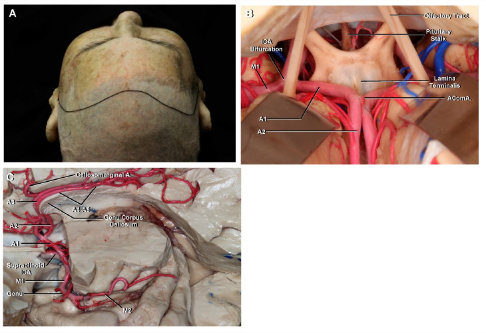
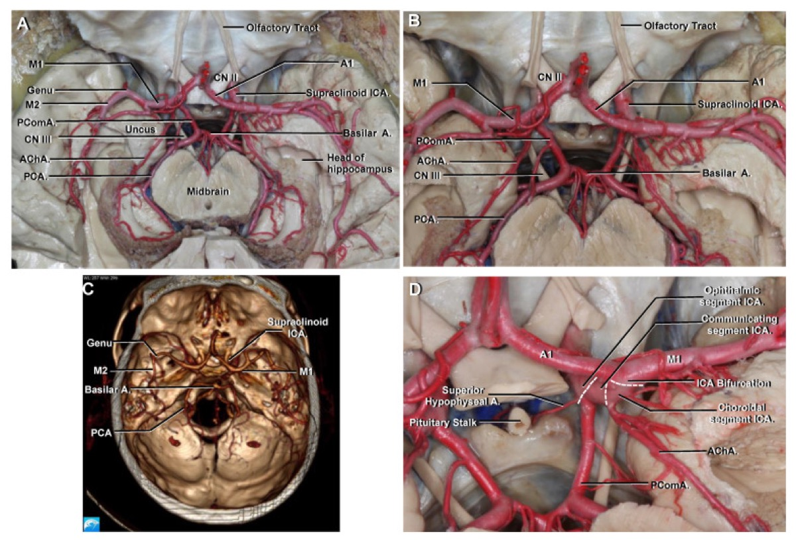

# Case Prep: Anterior Communicating Artery (AComA) Aneurysm Clipping

---

## One-Liner
[Age]yo [M/F] with [ruptured/unruptured] anterior communicating artery aneurysm presenting with [SAH/incidental finding] planned for [right/left] pterional craniotomy for microsurgical clipping.

---

## Figures, Imaging & Video

> 🧭 **Operative approach:** [Pterional craniotomy](../approaches/pterional-craniotomy.md) — detailed corridor setup, step-by-step technique & figures

> External sources — operative figures/atlases are copyrighted (linked, not copied). See [media-sources.md](../../resources/media-sources.md) for licensing.

**Operative technique & approach**
- [The Neurosurgical Atlas](https://www.neurosurgicalatlas.com) — search *"anterior communicating artery aneurysm"* (operative illustrations + HD video)
- [neuroangio.org](https://neuroangio.org) — anterior cerebral / AComA complex anatomy

**Imaging**
- [Radiopaedia — AComA aneurysm](https://radiopaedia.org/search?q=anterior%20communicating%20artery%20aneurysm&scope=all)

**Open-access figures**
- [PubMed Central](https://www.ncbi.nlm.nih.gov/pmc/?term=anterior+communicating+artery+aneurysm)

**Anatomy (public domain)**

*Sobotta 1909 — public domain — via [Wikimedia Commons](https://commons.wikimedia.org/wiki/File:Sobo_1909_3_548.png).*

*Poblete T et al., Microsurgical Anatomy of the Anterior Circulation, Brain Sci 2021;11(4):519 — CC BY 4.0.*

*Poblete T et al., Microsurgical Anatomy of the Anterior Circulation, Brain Sci 2021;11(4):519 — CC BY 4.0.*

---

## History of Present Illness
- Chief complaint: Thunderclap headache / loss of consciousness / incidental
- Hunt-Hess grade (if SAH): I-V
- Fisher grade (if SAH): 1-4
- Aneurysm size: ___ mm
- Dome projection: superior / anterior / posterior / inferior
- Prior SAH episodes:

---

## Past Medical History
- Hypertension
- Smoking
- Family history of aneurysms
- Anticoagulation
- Allergies:
- Medications:

---

## Imaging Review
### CTA / DSA
- **Aneurysm location:** AComA
- **Dome projection:** (critical for surgical planning)
  - Superior: most common; projects toward interhemispheric fissure
  - Anterior: projects toward planum sphenoidale
  - Posterior: projects toward hypothalamus/lamina terminalis (highest risk at surgery)
  - Inferior: toward chiasm
- **Size and neck width:**
- **A1 dominance:** Left dominant / Right dominant / Codominant
  - **Approach side:** Typically from the side of the dominant A1 (better angle to see AComA complex)
  - If codominant: approach from right (non-dominant hemisphere) unless other factors
- **A1 segments:** Length, course, perforators
- **A2 segments:** Origin, course, relationship to dome
- **AComA anatomy:** Length, caliber, perforators (hypothalamic perforators from superior/posterior surface)
- **Recurrent artery of Heubner:** Origin from A1-A2 junction or proximal A2; courses back along A1
- **Frontopolar and orbitofrontal arteries:**
- **Gyrus rectus:** Size and relationship to aneurysm
- **Cross-filling:** Competency of AComA (compression studies)

### CT Head
- SAH pattern (interhemispheric blood suggests AComA)
- Frontal lobe hematoma (common with AComA rupture)
- Hydrocephalus (common with AComA SAH)

### Navigation
- CTA loaded
- A1-AComA-A2 complex mapped

---

## Labs
- CBC, BMP, Coags
- Type and crossmatch (2 units)
- Na (hyponatremia common with AComA SAH — cerebral salt wasting)

---

## Neurological Examination
- GCS:
- Abulia / personality changes (frontal lobe, bilateral ACA territory):
- Memory (anterior communicating perforators supply memory circuits):
- Lower extremity weakness (ACA territory):
- Language (if left-sided approach):
- Visual fields (chiasm proximity):

---

## Surgical Planning

### Approach Selection
- **Side of approach:** Typically from the side of the DOMINANT A1
  - Dominant A1 = more direct view of AComA complex
  - Follow the dominant A1 to the AComA
  - Non-dominant A1: may be hypoplastic, harder to follow
- **Alternative:** Right pterional (if non-dominant hemisphere, codominant A1s)
- **Interhemispheric approach:** Rarely — for superiorly projecting aneurysms with bilateral A1 access

### Position
- **Patient position:** Supine
- **Head position:** Rotated 20-30 degrees contralateral (LESS rotation than MCA — need to see across midline). Extended to drop the frontal lobe from the anterior skull base. Vertex tilted down.
- **Skull clamp:** Mayfield
  - Single pin: Contralateral frontal
  - Double pins: Ipsilateral retroauricular
- **Table:** Reverse Trendelenburg

### Incision
- **Type:** Curvilinear pterional incision (same as MCA)
- **Key:** May need slightly more medial/frontal exposure than MCA

### Approach: Pterional Craniotomy (with Anterior Interhemispheric Corridor)
- **Craniotomy:** Standard pterional — flush sphenoid wing, low frontal exposure
- **Key difference from MCA:** Need medial frontal exposure along the skull base to the planum sphenoidale
- **Gyrus rectus resection:** Often needed (1-1.5 cm subpial resection) to visualize the AComA complex deep in the interhemispheric fissure

### Microsurgical Steps
1. **Pterional craniotomy** — flush sphenoid wing
2. **Dural opening** — curvilinear based on sphenoid ridge
3. **Sylvian fissure split** — proximal split to identify the ipsilateral ICA and A1 origin
4. **CSF drainage** — open carotid and chiasmatic cisterns; drain CSF from lamina terminalis cistern
5. **Identify ipsilateral A1** at ICA bifurcation
6. **Follow A1 medially** toward the AComA
7. **Identify ipsilateral optic nerve** — A1 runs over the optic nerve/chiasm
8. **Identify recurrent artery of Heubner** — courses back from A1-A2 junction along A1
9. **Gyrus rectus resection** — subpial resection of 1-1.5 cm to expose AComA complex
10. **Identify AComA, contralateral A1, and both A2 segments**
11. **Identify hypothalamic perforators** — arise from POSTERIOR/SUPERIOR surface of AComA; MUST preserve
12. **Proximal control** — temporary clip on ipsilateral A1 (and contralateral A1 if cross-filling)
13. **Dissect aneurysm neck** — direction depends on dome projection:
    - **Superior projection:** dome in interhemispheric fissure; dissect neck from below
    - **Anterior projection:** dome against planum; visible early (careful not to rupture during approach)
    - **Posterior projection:** dome toward hypothalamus; HIGHEST RISK — dissect dome LAST, work around neck
    - **Inferior projection:** dome toward chiasm; early identification needed
14. **Clip application:**
    - Clip parallel to AComA axis
    - Preserve A1, A2, AComA, Heubner, and perforators
    - Fenestrated clip may be needed if A2 incorporated
15. **Confirmation:** Micro-Doppler, ICG — all parent vessels and perforators patent

### Critical Anatomy & Structures at Risk
1. **Hypothalamic perforators** — from posterior/superior AComA surface → supply hypothalamus and memory circuits. Injury → memory deficit, DI, hypothalamic dysfunction
2. **Recurrent artery of Heubner** — supplies head of caudate and anterior limb of internal capsule. Injury → contralateral face/arm weakness and dysarthria
3. **Contralateral A1 and A2** — must be preserved for bilateral ACA territory perfusion
4. **Optic chiasm/nerves** — lie beneath the A1 segments
5. **Frontopolar and orbitofrontal arteries** — early A2 branches
6. **Lamina terminalis** — thin membrane forming anterior wall of third ventricle
7. **Gyrus rectus** — partial resection acceptable; bilateral resection → abulia

### Equipment
- Operating microscope
- Navigation (CTA)
- Micro-Doppler
- ICG videoangiography
- Aneurysm clips (including fenestrated for A2 preservation)
- Temporary clips (for ipsilateral A1, contralateral A1 if needed)
- High-speed drill
- Microsurgical instruments

### Monitoring
- SSEPs
- MEPs (bilateral — ACA supplies leg motor cortex)
- EEG

### Anesthesia Considerations
- Same as MCA aneurysm protocol
- Special attention to Na monitoring (cerebral salt wasting more common with AComA)
- Burst suppression available for temporary clipping

### Potential Complications & Contingencies
1. **Hypothalamic perforator injury** → memory deficit (particularly with posterior-projecting dome)
2. **Heubner artery injury** → contralateral face/arm weakness, dysarthria
3. **Bilateral ACA infarction** → abulia, akinetic mutism, bilateral leg weakness
4. **Intraoperative rupture** → proximal A1 temporary clip; may need contralateral A1 clip
5. **Vasospasm** (ruptured cases)
6. **DI / hypothalamic dysfunction** (from perforator injury)

---

## Operative Note Template

**Preoperative Diagnosis:** [Ruptured/Unruptured] anterior communicating artery aneurysm

**Postoperative Diagnosis:** Same

**Procedure:** [Right/Left] pterional craniotomy for microsurgical clipping of AComA aneurysm

[Follow MCA aneurysm template with specific modifications:]
- Describe dominant A1 identification and follow to AComA
- Describe gyrus rectus resection extent
- Describe AComA complex anatomy (A1s, A2s, AComA, perforators, Heubner)
- Describe dome projection and dissection strategy
- Describe clip placement relative to AComA axis
- Describe ICG/Doppler confirmation of all vessels including contralateral A1/A2

---

## Postoperative Plan
- Same as MCA aneurysm post-op plan
- **Na monitoring q4-6h** (cerebral salt wasting is more common with AComA)
- **Memory assessment** — formal neuropsych testing if concern for perforator injury
- **DI monitoring** — strict I&Os, UOP hourly (hypothalamic perforators at risk)
- If ruptured: EVD management if placed; hydrocephalus monitoring
- Behavioral assessment: abulia, personality changes (frontal lobe injury)
