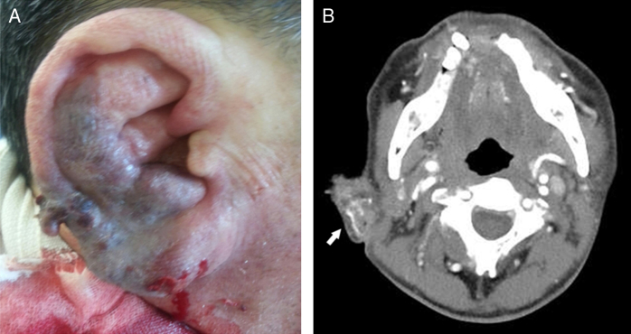
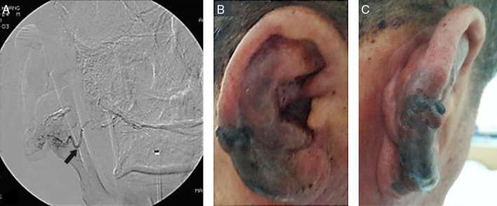
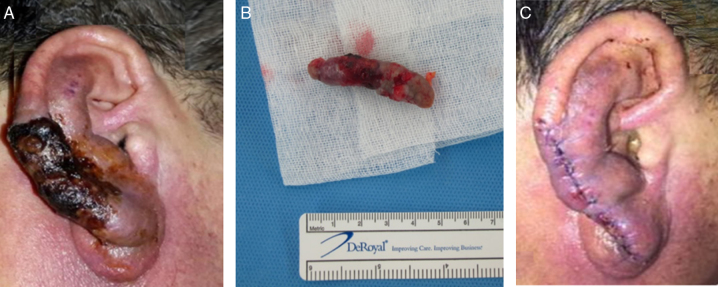
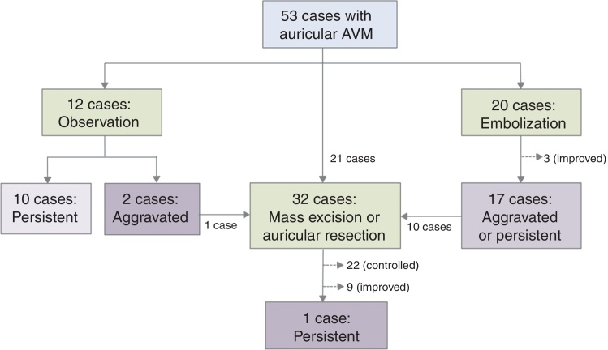
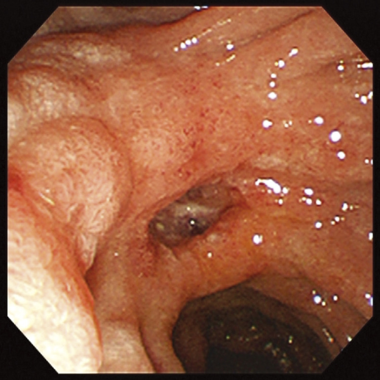
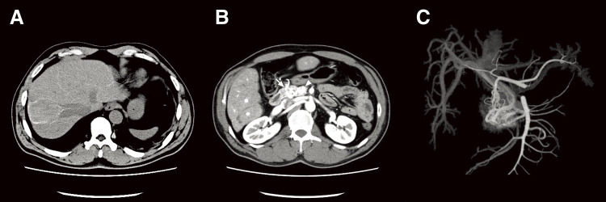
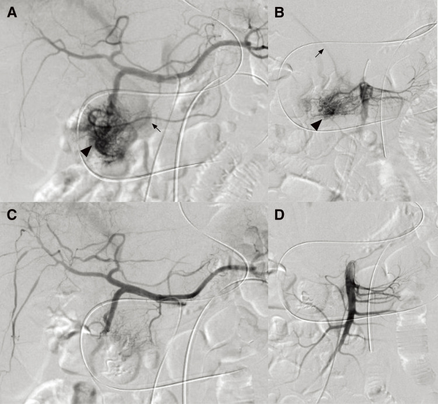
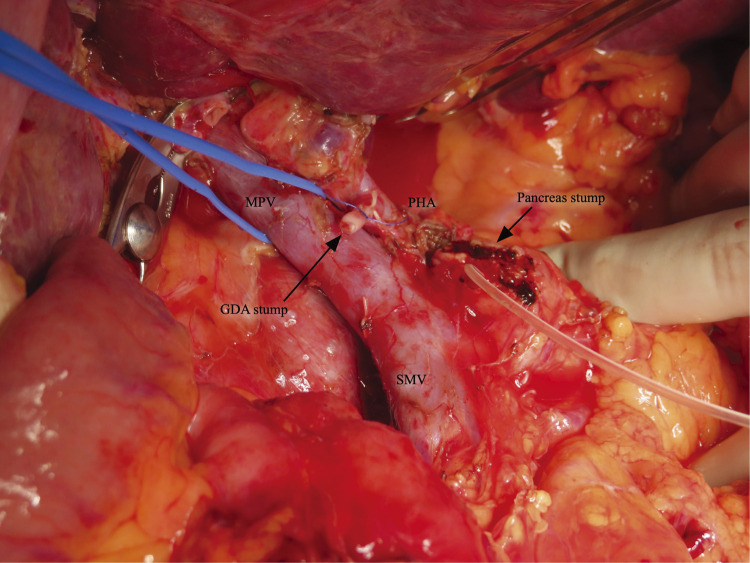
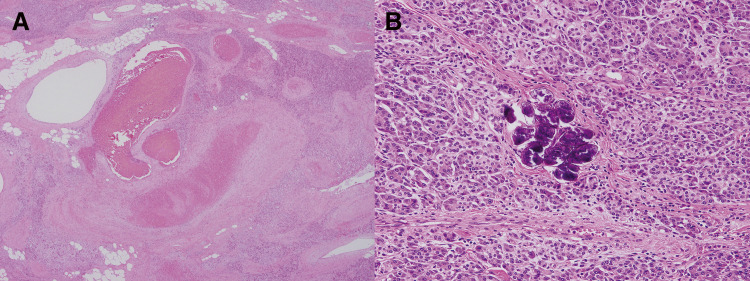
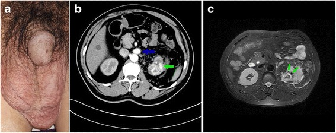

# Case Prep: Arteriovenous Malformation (AVM) Resection

---

<!-- BEGIN CASE SNAPSHOT -->

## Case / Approach Snapshot

- **Anatomy at risk:** parent vessels, perforators, branch ostia, collateral circulation, venous drainage, cranial nerves, cisterns, and eloquent territories threatened by temporary occlusion or retraction.
- **Operative steps:** plan proximal and distal control, expose the corridor, obtain cerebrospinal fluid/brain relaxation, identify parent vessels before the lesion, treat the lesion/device target, and confirm flow and hemostasis before closure; use the detailed operative sequence and approach notes below as the step-by-step source.
- **Rescue plans:** intraoperative rupture, thromboembolism, branch or perforator compromise, vasospasm, inadequate proximal control, bypass or reconstructive options, anticoagulation/reversal, and postoperative surveillance.
- **Figures:** review [Figures, Imaging & Video](#figures-imaging--video) and the [Curated Image Set](#curated-image-set); embedded local figures should remain open-access, public-domain, or otherwise reusable with attribution.
- **Papers:** review [High-Yield Literature](#high-yield-literature) for seminal sources, modern reviews, and outcome data specific to this page.
- **Textbook cross-checks:** use [Textbook Cross-Checks](#textbook-cross-checks) and the [Source Crosswalk](../../resources/source-crosswalk.md) to cite copyrighted textbooks/atlases while summarizing in original words.

<!-- END CASE SNAPSHOT -->

## One-Liner
[Age]yo [M/F] with a [left/right] [location] AVM (Spetzler-Martin grade [I-V]) presenting with [hemorrhage / seizures / headache / incidental] planned for craniotomy for microsurgical resection [± preoperative embolization].

---

## Figures, Imaging & Video

**🎥 Operative videos & resources**
- **Atlas / technique:** [The Neurosurgical Atlas](https://www.neurosurgicalatlas.com) — search *brain AVM resection* and review circumferential dissection, feeder control, and draining-vein preservation
- **Video searches:** [brain AVM resection on YouTube](https://www.youtube.com/results?search_query=brain+AVM+resection+microsurgery) · [Spetzler-Martin AVM surgery](https://www.youtube.com/results?search_query=Spetzler+Martin+AVM+resection)
- **Angio anatomy:** [neuroangio.org](https://neuroangio.org) — feeders, nidus, early draining veins, associated aneurysms, and embolization strategy

> 🧭 **Operative approach:** [Pterional craniotomy](../approaches/pterional-craniotomy.md) — detailed corridor setup, step-by-step technique & figures

> Copyrighted operative figures/videos are linked, not copied. Embedded figures below are public-domain or CC-BY; see [media-sources.md](../../resources/media-sources.md) and [CREDITS.md](../../figures/CREDITS.md).

---

<!-- BEGIN TEXTBOOK CROSS-CHECKS -->

## Textbook Cross-Checks

- **Vascular anatomy:** Rhoton Cranial Anatomy; Decision Making in Neurovascular Disease; Practical Neuroangiography — confirm parent-vessel anatomy, perforators, venous drainage, collateral pathways, and endovascular access/rescue options.
- **Operative/endovascular strategy:** Youmans and Winn; Schmidek and Sweet; Greenberg — summarize proximal control, exposure/device strategy, temporary-control options, and bailout plans in your own words.
- **Complication rescue:** Greenberg; Decision Making in Neurovascular Disease — review ischemia, hemorrhage, thromboembolism, rupture, vasospasm, and postoperative surveillance algorithms.
- **Copyright-safe use:** cite these sources as private cross-checks, then write the guide content in original words; do not re-host textbook pages, figures, tables, or board-review card material. See [Source Crosswalk & Copyright-Safe Use](../../resources/source-crosswalk.md).

<!-- END TEXTBOOK CROSS-CHECKS -->

<!-- BEGIN CURATED LITERATURE -->

## High-Yield Literature

- **Hepatic arteriovenous malformation** — Shionoya K. Clinical case reports 2023. [PubMed](https://pubmed.ncbi.nlm.nih.gov/37012913/)
- **Brain arteriovenous malformation with transdural blood supply: Current status** — Piao J. Experimental and therapeutic medicine 2019. [PubMed](https://pubmed.ncbi.nlm.nih.gov/31555346/)
- **Uterine arteriovenous malformation - diagnosis and management** — Szpera-Goździewicz A. Ginekologia polska 2018. [PubMed](https://pubmed.ncbi.nlm.nih.gov/30084480/)
- **Capillary Malformation-Arteriovenous Malformation Syndrome** — Alluhaibi R. Cureus 2021. [PubMed](https://pubmed.ncbi.nlm.nih.gov/33437561/)
- **Advanced brain arteriovenous malformation embolization techniques** — Saatci I. Journal of neurointerventional surgery 2025. [PubMed](https://pubmed.ncbi.nlm.nih.gov/39715669/)
- **Intermixed arteriovenous malformation and hemangioblastoma: case report and literature review** — Healy V. CNS oncology 2020. [PubMed](https://pubmed.ncbi.nlm.nih.gov/33244995/)
- **Transvenous arteriovenous malformation embolization** — Brahimaj BC. Journal of neurointerventional surgery 2020. [PubMed](https://pubmed.ncbi.nlm.nih.gov/31862831/)
- **Thrombosed Arteriovenous Malformation of Umbilical Cord** — Damiani GR. Journal of obstetrics and gynaecology of India 2023. [PubMed](https://pubmed.ncbi.nlm.nih.gov/37324371/)
- **A giant pelvic arteriovenous malformation** — Izumi T. IJU case reports 2024. [PubMed](https://pubmed.ncbi.nlm.nih.gov/39224686/)
- **Arteriovenous Malformation of the Cervical Cord Region** — Tanitame K. Internal medicine (Tokyo, Japan) 2020. [PubMed](https://pubmed.ncbi.nlm.nih.gov/32727991/)

<!-- END CURATED LITERATURE -->

---

<!-- BEGIN CURATED IMAGE SET -->

## Curated Image Set

Open-access figures are embedded from PubMed Central articles and kept unique to this guide.

*Figure 1. Gross findings and temporal bone computed tomographic angiography findings on the ear of a 60 year-old man, as recorded in the emergency room: (A) the patient presented with a swollen... Source: [Arteriovenous malformation of the external ear: a clinical assessment with a scoping review of the literature☆](https://pmc.ncbi.nlm.nih.gov/articles/PMC9449233/) — Brazilian Journal of Otorhinolaryngology 2017; CC BY.*

*Figure 2. Preoperative therapeutic embolization using transfemoral cerebral angiography and gross ear findings 3 days after embolization: (A) transfemoral cerebral angiography revealed large... Source: [Arteriovenous malformation of the external ear: a clinical assessment with a scoping review of the literature☆](https://pmc.ncbi.nlm.nih.gov/articles/PMC9449233/) — Brazilian Journal of Otorhinolaryngology 2017; CC BY.*

*Figure 3. Gross ear findings at 2 weeks after embolization and total excision of the arteriovenous malformation. (A) Two weeks after transarterial embolization, the boundary of the necrotic skin... Source: [Arteriovenous malformation of the external ear: a clinical assessment with a scoping review of the literature☆](https://pmc.ncbi.nlm.nih.gov/articles/PMC9449233/) — Brazilian Journal of Otorhinolaryngology 2017; CC BY.*

*Figure 4. Flow chart of the treatment of 53 patients with auricular arteriovenous malformations. Source: [Arteriovenous malformation of the external ear: a clinical assessment with a scoping review of the literature☆](https://pmc.ncbi.nlm.nih.gov/articles/PMC9449233/) — Brazilian Journal of Otorhinolaryngology 2017; CC BY.*

*Fig. 1. Findings of upper gastrointestinal endoscopy. Upper gastrointestinal endoscopy revealed a large ulcer at the duodenal bulb. Source: [Efficacy of Arterial Embolization prior to Pancreaticoduodenectomy for Pancreatic Arteriovenous Malformation: A Case Report](https://pmc.ncbi.nlm.nih.gov/articles/PMC11925642/) — Surgical Case Reports 2025; CC BY.*

*Fig. 2. Findings of computed tomography (CT). (A) Non-enhanced CT showed the presence of intrahepatic reticulated calcification, indicating the presence of Schistosomiasis japonica. (B)... Source: [Efficacy of Arterial Embolization prior to Pancreaticoduodenectomy for Pancreatic Arteriovenous Malformation: A Case Report](https://pmc.ncbi.nlm.nih.gov/articles/PMC11925642/) — Surgical Case Reports 2025; CC BY.*

*Fig. 3. Findings of angiography. (A) Angiography of the celiac axis showed a markedly proliferative vascular network at the pancreatic head (arrowhead) via the gastroduodenal artery and early... Source: [Efficacy of Arterial Embolization prior to Pancreaticoduodenectomy for Pancreatic Arteriovenous Malformation: A Case Report](https://pmc.ncbi.nlm.nih.gov/articles/PMC11925642/) — Surgical Case Reports 2025; CC BY.*

*Fig. 4. Intraoperative findings. The intraoperative findings did not demonstrate the impact of arterial embolization on the pancreatic parenchyma.GDA, gastroduodenal artery; MPV, main portal... Source: [Efficacy of Arterial Embolization prior to Pancreaticoduodenectomy for Pancreatic Arteriovenous Malformation: A Case Report](https://pmc.ncbi.nlm.nih.gov/articles/PMC11925642/) — Surgical Case Reports 2025; CC BY.*

*Fig. 5. Pathological findings of resected specimens (hematoxylin and eosin staining). (A) Dilated vessels of unequal size were found in the pancreatic parenchyma, consistent with the finding of... Source: [Efficacy of Arterial Embolization prior to Pancreaticoduodenectomy for Pancreatic Arteriovenous Malformation: A Case Report](https://pmc.ncbi.nlm.nih.gov/articles/PMC11925642/) — Surgical Case Reports 2025; CC BY.*

*Fig. 1. a Physical examination showed grade 3 left varicocele. b Computed tomography showed early enhanced dilated renal vein (blue arrow) and irregular lesion in the upper pole of left kidney,... Source: [Varicocele due to renal arteriovenous malformation mimicking a renal tumor: a case report](https://pmc.ncbi.nlm.nih.gov/articles/PMC5755272/) — Journal of Medical Case Reports 2018; CC BY.*

<!-- END CURATED IMAGE SET -->

---

## History of Present Illness
- Chief complaint: Intracranial hemorrhage / seizures / progressive deficit / headache / incidental
- Prior hemorrhage (annual rupture risk ~2-4%, higher if prior bleed, deep location, deep venous drainage, associated aneurysm):
- Seizure history:
- Prior embolization / radiosurgery:

---

## Imaging Review
### MRI/MRA
- Nidus location, size, eloquence of adjacent brain
- Flow voids, prior hemorrhage (hemosiderin)

### DSA (gold standard)
- **Spetzler-Martin grade:**
  - Size: < 3 cm (1), 3-6 cm (2), > 6 cm (3)
  - Eloquence: non-eloquent (0), eloquent (1)
  - Venous drainage: superficial only (0), any deep (1)
  - **Total = 1-5**
- **Supplementary Lawton-Young grade** (age, bleeding, compactness) — refines risk
- Feeding arteries (which territories)
- Nidus compactness (compact vs diffuse)
- Venous drainage (superficial/deep, number of draining veins)
- Associated aneurysms (flow-related — may bleed)
- Flow characteristics (high vs low flow)

### Navigation / Functional
- DSA/MRA/CTA fused to navigation
- fMRI / DTI if eloquent location

---

## Labs
- CBC, BMP, Coags, **Type and crossmatch (4 units — AVMs bleed)**

---

## Neurological Examination
- Complete exam focused on AVM location/eloquence; document baseline deficits

---

## Surgical Planning

### Diagnosis & Indication
- Working diagnosis: [Location] AVM, SM grade [__]
- Indication: Ruptured AVM, low-grade (SM I-II) AVMs, refractory seizures; SM III individualized; SM IV-V usually NOT resected (high risk) unless ruptured/progressive
- Goals: Complete nidus resection (partial resection does NOT reduce hemorrhage risk and may increase it)
- **Multimodal:** Preoperative embolization (reduce flow, target deep feeders), radiosurgery (small/deep), or surgery

### Preoperative Embolization
- Staged embolization days before surgery to reduce nidus flow and target surgically inaccessible deep feeders
- Reduces intraoperative blood loss

### Position
- Based on AVM location — lesion at highest point; Mayfield
- Large craniotomy (wider than the nidus — need to see all feeders and draining veins)

### Microsurgical Principles (Spetzler/Lawton)
1. **Wide craniotomy** — expose nidus plus margin
2. **Identify the draining vein(s) — PRESERVE until the end** (premature venous occlusion → nidus engorgement and rupture)
3. **Circumferential dissection** around the nidus
4. **Feeding artery control first** — coagulate/clip arterial feeders progressively, working around the nidus
5. **Stay on the nidus** — dissect in the gliotic plane immediately around the nidus (avoid entering nidus → bleeding; avoid straying into normal brain → deficit)
6. **Deep feeders last** — these are thin-walled, fragile, hard to coagulate ("AVM feeders from hell"); may need clips, careful bipolar, hemostatic agents
7. **Take the draining vein LAST** — only after all arterial supply controlled; vein should become dark/less pulsatile when arterial feeders are eliminated
8. **Deliver nidus**
9. **Meticulous hemostasis** — inspect resection bed; "normal perfusion pressure breakthrough" risk
10. **ICG / intraoperative angiography** — confirm no residual nidus

### Critical Anatomy & Structures at Risk
1. **Draining vein(s)** — preserve until arterial supply controlled
2. **Deep perforating feeders** — fragile, dangerous bleeding source
3. **Eloquent cortex / white matter tracts** — depending on location
4. **En passage vessels** — arteries that supply both nidus and normal brain (preserve the normal branch)

### Equipment
- Microscope, navigation, ICG, intraoperative angiography capability
- AVM micro-clips (mini/micro aneurysm clips for feeders)
- Bipolar (multiple), hemostatic agents (Surgicel, Floseal)
- CUSA, cottonoids
- Cell saver

### Monitoring
- SSEPs, MEPs (if eloquent), EEG

### Anesthesia
- Arterial line, central line, 2 large-bore IVs
- 4 units crossmatched, massive transfusion protocol available
- Controlled hypotension during resection (reduce bleeding)
- Post-resection: avoid hypertension (NPPB risk)

### Potential Complications
1. **Hemorrhage** — major risk; preserve draining vein until end
2. **Normal perfusion pressure breakthrough (NPPB)** — post-resection hyperemia/edema/hemorrhage in surrounding brain; strict BP control
3. **Residual nidus** — intraoperative angiography to confirm complete resection
4. **Neurological deficit** — eloquent location, perforator injury
5. **Seizures**

---

## Operative Note Template

**Preoperative Diagnosis:** [Left/Right] [location] arteriovenous malformation, Spetzler-Martin grade [__] [ruptured/unruptured]

**Postoperative Diagnosis:** Same

**Procedure:** [Left/Right] [location] craniotomy for microsurgical resection of AVM [following preoperative embolization]

**Surgeon / Assistant:**
**Anesthesia:** General endotracheal
**EBL / Fluids / Blood products:** [4 units crossmatched, cell saver]
**Adjuncts:** Neuronavigation, ICG videoangiography, intraoperative/postoperative DSA
**Monitoring:** SSEP / MEP [/ mapping if eloquent] — stable
**Complications:** None

**Indications:** [Age]yo [M/F] with a [ruptured/symptomatic] [location] AVM (SM grade [__]). After [staged preoperative embolization and] discussion of risks/benefits/alternatives (including radiosurgery and observation), microsurgical resection was undertaken.

**Description of Procedure:** After consent and time-out, general anesthesia was induced with arterial/central access, crossmatched blood and cell saver available, and neuromonitoring established. The head was fixed in Mayfield and positioned with the lesion uppermost. A wide [location] craniotomy was performed — larger than the nidus to expose all feeders and draining veins — and the dura opened.

Under the microscope, the nidus and its major draining vein(s) were identified; the **draining vein was preserved and protected throughout**. Circumferential dissection was carried out in the gliotic plane immediately around the nidus, progressively coagulating and dividing arterial feeders while staying on the nidus and sparing en-passage vessels. The deep, thin-walled feeders were controlled with micro-clips and careful bipolar. Only after all arterial supply was eliminated — confirmed by the draining vein becoming dark and less pulsatile — was the **draining vein coagulated and divided last**, and the nidus delivered en bloc.

The resection bed was inspected and meticulous hemostasis obtained under controlled normotension. **Intraoperative angiography (ICG ± catheter DSA) confirmed no residual nidus or early venous filling.** The dura was closed, the bone flap replaced, and the scalp closed in layers. Strict blood-pressure control was maintained to prevent normal-perfusion-pressure breakthrough. The patient was transferred to the NSICU in stable condition.

---

## Postoperative Plan
- NSICU, neuro checks q1h
- **Strict BP control** (e.g., SBP < 120-140) to prevent NPPB hemorrhage x 24-48h
- Postop DSA within 24-48h (confirm complete resection — residual nidus needs re-resection)
- Seizure prophylaxis
- CT head, monitor for hemorrhage/edema
- Follow-up DSA, clinic
