# Case Prep: Basilar Apex (Tip) Aneurysm

---

<!-- BEGIN CASE SNAPSHOT -->

## Case / Approach Snapshot

- **Anatomy at risk:** parent vessels, perforators, branch ostia, collateral circulation, venous drainage, cranial nerves, cisterns, and eloquent territories threatened by temporary occlusion or retraction.
- **Operative steps:** plan proximal and distal control, expose the corridor, obtain cerebrospinal fluid/brain relaxation, identify parent vessels before the lesion, treat the lesion/device target, and confirm flow and hemostasis before closure; use the detailed operative sequence and approach notes below as the step-by-step source.
- **Rescue plans:** intraoperative rupture, thromboembolism, branch or perforator compromise, vasospasm, inadequate proximal control, bypass or reconstructive options, anticoagulation/reversal, and postoperative surveillance.
- **Figures:** review [Figures, Imaging & Video](#figures-imaging--video) and the [Curated Image Set](#curated-image-set); embedded local figures should remain open-access, public-domain, or otherwise reusable with attribution.
- **Papers:** review [High-Yield Literature](#high-yield-literature) for seminal sources, modern reviews, and outcome data specific to this page.

<!-- END CASE SNAPSHOT -->

## One-Liner
[Age]yo [M/F] with [ruptured/unruptured] basilar apex aneurysm presenting with [SAH / incidental] planned for [orbitozygomatic / pterional-transsylvian / subtemporal] craniotomy for clipping — OR endovascular coiling (often first-line).

---

## Figures, Imaging & Video

**🎥 Operative video** — [search operative video on YouTube ▸](https://www.youtube.com/results?search_query=basilar+tip+aneurysm+surgery) · [The Neurosurgical Atlas ▸](https://www.neurosurgicalatlas.com)

> 🧭 **Operative approach:** [Orbitozygomatic craniotomy](../approaches/orbitozygomatic-craniotomy.md) — detailed corridor setup, step-by-step technique & figures

> External sources — operative figures/atlases are copyrighted (linked, not copied). See [media-sources.md](../../resources/media-sources.md).

**Operative technique & approach**
- [The Neurosurgical Atlas](https://www.neurosurgicalatlas.com) — search *"basilar apex aneurysm"* (illustrations + HD video)
- [neuroangio.org](https://neuroangio.org) — posterior circulation / basilar apex anatomy

**Imaging**
- [Radiopaedia — basilar tip aneurysm](https://radiopaedia.org/search?q=basilar%20tip%20aneurysm&scope=all)

**Open-access figures**
- [PubMed Central](https://www.ncbi.nlm.nih.gov/pmc/?term=basilar+apex+aneurysm)

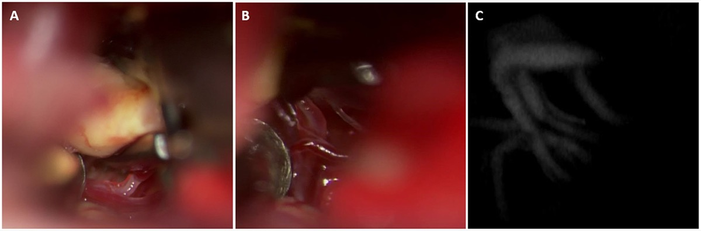

*Basilar-tip clipping: P1/basilar-apex perforators dissected off the dome; post-clip ICG videoangiography confirms perforator preservation. Source: Norat et al., Front Surg 2019;6:34, Fig 3. CC BY 4.0.*

---

<!-- BEGIN COMMON PIMP QUESTIONS -->

## Common Pimp Questions

Use these to pressure-test preparation for **Basilar Apex (Tip) Aneurysm**:

1. What is the proximal-control plan before the lesion is manipulated?
2. Which branch, perforator, or venous structure is most likely to be injured in this exposure?
3. What are the intraoperative rupture steps, including temporary clip, suction, BP, and backup clip strategy?
4. What confirms treatment success: ICG, Doppler, puncture/deflation, DSA, or postoperative CTA?
5. What postoperative BP, vasospasm, antiplatelet, or anticoagulation issue changes the orders tonight?

<!-- END COMMON PIMP QUESTIONS -->

<!-- BEGIN ATTENDING PREFERENCE VARIABLES -->

## Attending Preference Variables

Items that commonly vary by surgeon or institution:

- **Preferred approach side, sylvian split style, and cisternal-opening sequence:** [attending-specific]
- **Temporary clip threshold, burst-suppression preference, and BP during occlusion:** [attending-specific]
- **Clip manufacturer/shape sequence and whether Doppler, ICG, puncture, or intraop DSA is routine:** [attending-specific]
- **Antiplatelet/anticoagulation reversal and restart timing:** [attending-specific]

<!-- END ATTENDING PREFERENCE VARIABLES -->

<!-- BEGIN CURATED LITERATURE -->

## High-Yield Literature

- **Basilar apex aneurysm systematic review: Microsurgical versus endovascular treatment** — Medani K. Neuro-Chirurgie 2022. [PubMed](https://pubmed.ncbi.nlm.nih.gov/35965246/)
- **Basilar Apex Aneurysm: Case Series, Systematic Review, and Meta-analysis** — Dandurand C. World neurosurgery 2020. [PubMed](https://pubmed.ncbi.nlm.nih.gov/32084621/)
- **Microsurgical Technique for Basilar Apex Aneurysm Clipping: Two-Dimensional Video** — Lopez-Gonzalez MA. World neurosurgery 2019. [PubMed](https://pubmed.ncbi.nlm.nih.gov/30862602/)
- **Does embryologic basilar fusion type impact basilar apex aneurysm treatment outcomes?** — Hubbard Z. Journal of clinical neuroscience : official journal of the Neurosurgical Society of Australasia 2025. [PubMed](https://pubmed.ncbi.nlm.nih.gov/41014892/)
- **Thrombosed basilar apex aneurysm presenting as a third ventricular mass and hydrocephalus** — Liu JK. Acta neurochirurgica 2005. [PubMed](https://pubmed.ncbi.nlm.nih.gov/15662571/)
- **Microsurgical Clipping of a Ruptured Basilar Apex Aneurysm: 3-Dimensional Operative Video** — Cheng CY. Operative neurosurgery (Hagerstown, Md.) 2019. [PubMed](https://pubmed.ncbi.nlm.nih.gov/30407554/)
- **Pretemporal Transcavernous Approach to Basilar Apex Aneurysm: 2-Dimensional Operative Video** — Dey S. Operative neurosurgery (Hagerstown, Md.) 2023. [PubMed](https://pubmed.ncbi.nlm.nih.gov/36701550/)
- **Endovascular treatment of bilateral carotid artery occlusion with concurrent basilar apex aneurysm: a case report and literature review** — Xu K. International journal of medical sciences 2011. [PubMed](https://pubmed.ncbi.nlm.nih.gov/21487570/)
- **Woven EndoBridge embolization in the retreatment of basilar apex aneurysm** — Lee JE. Neurosurgical focus: Video 2022. [PubMed](https://pubmed.ncbi.nlm.nih.gov/36425269/)
- **Transpalpebral approach for microsurgical clipping of an unruptured basilar apex aneurysm: case report and literature review** — Dzhindzhikhadze RS. British journal of neurosurgery 2023. [PubMed](https://pubmed.ncbi.nlm.nih.gov/33252271/)

<!-- END CURATED LITERATURE -->

---

<!-- BEGIN CURATED IMAGE SET -->

## Curated Image Set

Open-access figures are embedded from PubMed Central articles and kept unique to this guide.

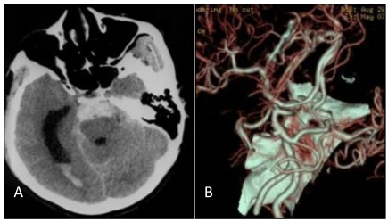
*Figure 1. A: Head CT scan shows that the hemorrhage was localized on the pontine cistern and interpeduncular cistern, extending to the right of the ambient cistern, into the posterior horn of the... Source: [Endovascular Treatment of Bilateral Carotid Artery Occlusion with Concurrent Basilar Apex Aneurysm: A Case Report and Literature Review](https://pmc.ncbi.nlm.nih.gov/articles/PMC3074092/) — International Journal of Medical Sciences 2011; CC BY-NC-ND.*

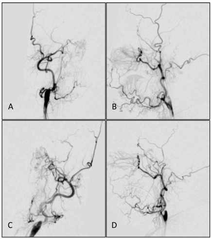
*Figure 2. Common carotid artery DS angiographs: occlusion at the beginning of internal carotid artery, with the remaining external carotid artery. No formation of anatomosis between the external... Source: [Endovascular Treatment of Bilateral Carotid Artery Occlusion with Concurrent Basilar Apex Aneurysm: A Case Report and Literature Review](https://pmc.ncbi.nlm.nih.gov/articles/PMC3074092/) — International Journal of Medical Sciences 2011; CC BY-NC-ND.*

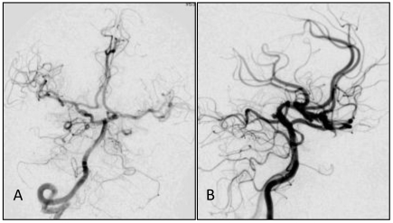
*Figure 3. A,B: Angiograph of the vertebral artery showing developed posterior circulation with blood supply through the bilateral posterior communicating artery. No delay was observed in the... Source: [Endovascular Treatment of Bilateral Carotid Artery Occlusion with Concurrent Basilar Apex Aneurysm: A Case Report and Literature Review](https://pmc.ncbi.nlm.nih.gov/articles/PMC3074092/) — International Journal of Medical Sciences 2011; CC BY-NC-ND.*

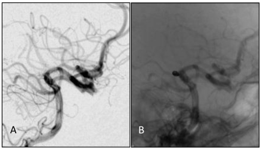
*Figure 4. A, B: DS angiographs taken after the aneurysm coil embolization. The aneurysm with dense embolization is not seen. Source: [Endovascular Treatment of Bilateral Carotid Artery Occlusion with Concurrent Basilar Apex Aneurysm: A Case Report and Literature Review](https://pmc.ncbi.nlm.nih.gov/articles/PMC3074092/) — International Journal of Medical Sciences 2011; CC BY-NC-ND.*

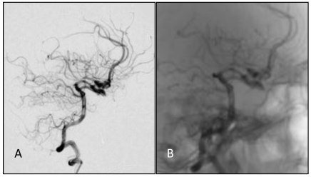
*Figure 5. A,B: One year after embolizing the aneurysm with the endovascular approach, embolization was still in good condition, without recanalization. Source: [Endovascular Treatment of Bilateral Carotid Artery Occlusion with Concurrent Basilar Apex Aneurysm: A Case Report and Literature Review](https://pmc.ncbi.nlm.nih.gov/articles/PMC3074092/) — International Journal of Medical Sciences 2011; CC BY-NC-ND.*

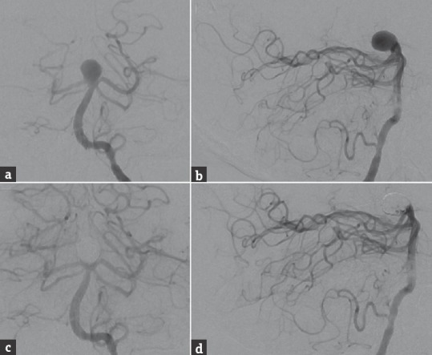
*Figure 1. Preoperative cerebral angiography, (a) anterior-posterior and (b) lateral views of a left vertebral artery injection, shows a large, 11-mm wide-necked basilar bifurcation aneurysm with a... Source: [Double-barrel Y-configuration Stenting for Flow Diversion of a Giant Recurrent Basilar Apex Aneurysm with the Pipeline Flex Embolization Device](https://pmc.ncbi.nlm.nih.gov/articles/PMC5244076/) — Journal of Neurosciences in Rural Practice 2016; CC BY-NC-SA.*

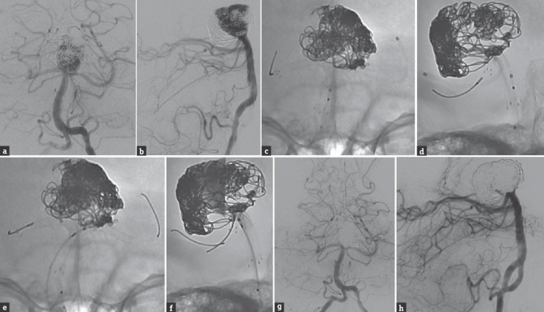
*Figure 2. Cerebral angiography, (a) anterior-posterior and (b) lateral views of a left vertebral artery injection, shows significant recurrence of the previously stent-coiled and twice recoiled... Source: [Double-barrel Y-configuration Stenting for Flow Diversion of a Giant Recurrent Basilar Apex Aneurysm with the Pipeline Flex Embolization Device](https://pmc.ncbi.nlm.nih.gov/articles/PMC5244076/) — Journal of Neurosciences in Rural Practice 2016; CC BY-NC-SA.*

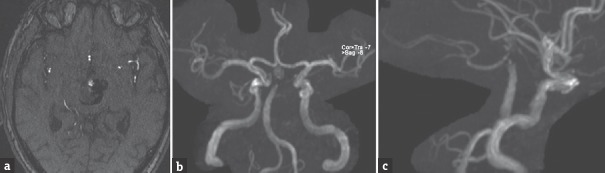
*Figure 3. Follow-up magnetic resonance angiography 10 months after the flow diversion procedure, (a) axial time-of-flight and three-dimensional reconstruction, (b) anterior-posterior and (c)... Source: [Double-barrel Y-configuration Stenting for Flow Diversion of a Giant Recurrent Basilar Apex Aneurysm with the Pipeline Flex Embolization Device](https://pmc.ncbi.nlm.nih.gov/articles/PMC5244076/) — Journal of Neurosciences in Rural Practice 2016; CC BY-NC-SA.*

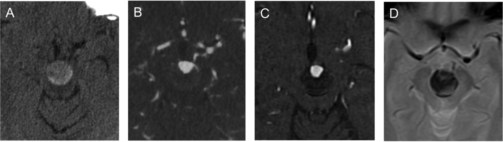
*Fig. 1.. (A) Axial unenhanced CT demonstrates basilar apex aneurysm measuring 20 mm in width in the interpeduncular fossa. (B) Axial CTA shows aneurysmal lumen measuring 12 mm in width at its... Source: [Intrasaccular flow disruption (WEB) of a large wide-necked basilar apex aneurysm using PulseRider-assistance](https://pmc.ncbi.nlm.nih.gov/articles/PMC8018600/) — Interdisciplinary neurosurgery : Advanced techniques and case management 2020; CC BY.*

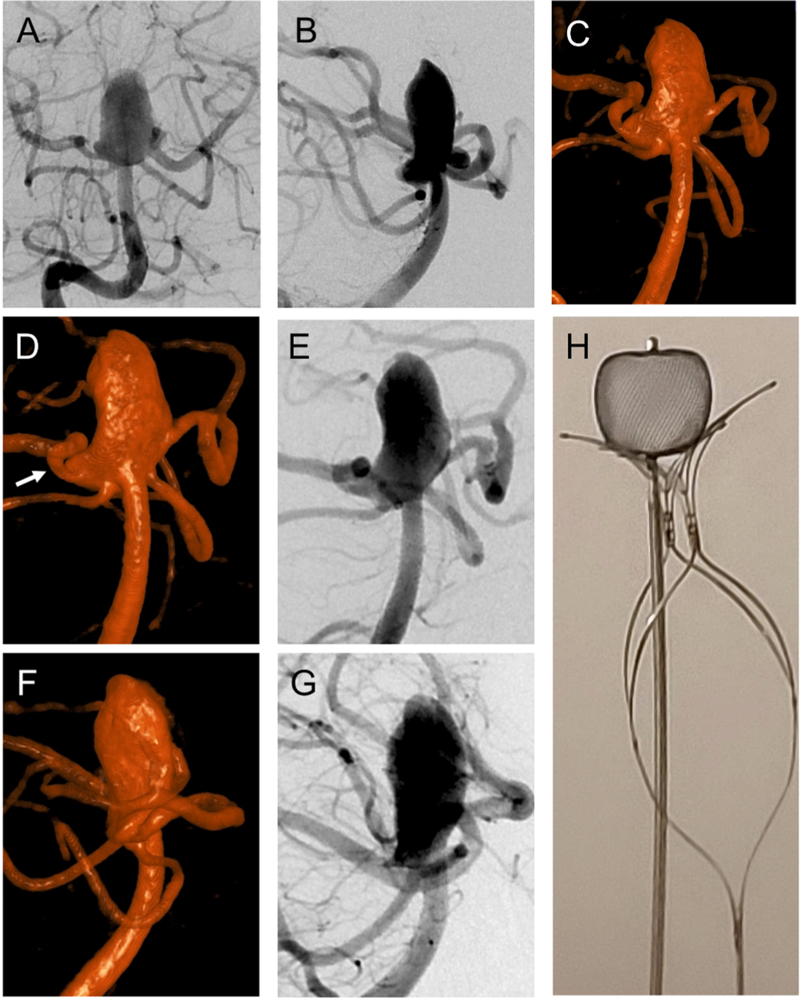
*Fig. 2.. (A) Right vertebral arteriogram in frontal projection shows wide-necked, large basilar apex aneurysm incorporating both PCA origins. (B) Lateral projection of right vertebral arteriogram... Source: [Intrasaccular flow disruption (WEB) of a large wide-necked basilar apex aneurysm using PulseRider-assistance](https://pmc.ncbi.nlm.nih.gov/articles/PMC8018600/) — Interdisciplinary neurosurgery : Advanced techniques and case management 2020; CC BY.*

<!-- END CURATED IMAGE SET -->

---

## History of Present Illness
- Chief complaint: Thunderclap headache / incidental
- Hunt-Hess / Fisher / WFNS grade:
- Aneurysm size, neck, projection (superior, anterior, posterior):
- **Endovascular is often preferred** for basilar tip aneurysms (deep location, surgical difficulty); document why surgery chosen (wide neck, branch incorporation, failed coiling, young patient)

---

## Imaging Review
### CTA / DSA
- **Basilar apex anatomy:** Height of basilar bifurcation relative to posterior clinoid/dorsum sellae
  - High-riding (above posterior clinoid): favors transsylvian
  - Low-lying (below posterior clinoid): may need posterior clinoidectomy or subtemporal
- **P1 segments (bilateral):** Origin relative to neck
- **Superior cerebellar arteries (SCA):** Origin just below P1
- **Thalamoperforators:** Arise from P1 and basilar apex posteriorly — CRITICAL, supply midbrain/thalamus
- **PComAs:** Fetal configuration?
- Projection of dome

### Navigation
- CTA loaded; bifurcation height and perforators noted

---

## Labs
- CBC, BMP, Coags, Type and crossmatch (2 units)

---

## Neurological Examination
- GCS, CN exam (CN III especially), motor, brainstem signs

---

## Surgical Planning

### Case Logistics, OR Needs & Orders
- **Typical bed:** neuro ICU after aneurysm clipping or cavernoma surgery, especially ruptured aneurysm, vasospasm risk, or brainstem/deep lesion.
- **OR setup:** microscope, clip tray with temporary/permanent clips, ICG/Doppler, vascular instruments, blood available, DSA/CTA images displayed, and bypass/parent-vessel rescue plan for complex aneurysms.
- **Special needs:** arterial line, BP target before and after occlusion, nimodipine/EVD/SAH pathway if ruptured, seizure prophylaxis by lesion/location, dexamethasone only when edema risk warrants, and neuromonitoring for deep/eloquent corridors.
- **Immediate postop orders:** ICU neuro checks, SBP parameters, CTA/DSA or CT timing, EVD/vasospasm surveillance for SAH, antiepileptic plan, DVT timing, and focused motor/language/cranial-nerve exams.

### Approach Selection
- **Orbitozygomatic (OZ):** Best for most basilar tip aneurysms — maximizes upward viewing angle, reduces temporal lobe retraction
- **Pterional-transsylvian:** For high-riding bifurcations
- **Subtemporal (Drake):** For posteriorly-projecting domes; lateral view of perforators; requires temporal lobe retraction (vein of Labbé at risk)
- **Side:** Usually right (non-dominant) unless left-sided ICA gives better angle or fetal PCA

### Position
- **OZ/pterional:** Supine, head rotated 30-45 degrees contralateral, extended, vertex down, Mayfield
- **Subtemporal:** Supine with shoulder roll, head turned 90 degrees, lumbar drain for temporal lobe relaxation

### Approach: Orbitozygomatic Craniotomy (most common)
- Pterional craniotomy + orbital rim/zygomatic osteotomy → enhanced basal exposure and upward trajectory
- Wide sylvian fissure split
- **Posterior clinoidectomy** often required for low bifurcations (drill posterior clinoid/dorsum sellae)

### Microsurgical Steps
1. OZ craniotomy with orbital osteotomy
2. Wide sylvian fissure split — expose ICA, optic nerve, posterior carotid space
3. Open the membrane of Liliequist → access interpeduncular cistern
4. Identify ICA, PComA — work in the opticocarotid or carotid-oculomotor triangle
5. Identify basilar trunk below the bifurcation for **proximal control**
6. Identify bilateral P1s, SCAs, and **thalamoperforators** (posterior to the basilar apex)
7. Posterior clinoidectomy if needed for proximal control/visualization
8. Temporary clip on basilar trunk (below SCA origins) for dome dissection
9. Dissect neck, **separate perforators from the aneurysm** (most critical and dangerous step)
10. Clip placement (often fenestrated to spare P1/perforators)
11. Confirm: ICG, micro-Doppler — both P1s, SCAs, perforators patent

### Critical Anatomy & Structures at Risk
1. **Thalamoperforating arteries** — from P1/basilar apex; injury → devastating midbrain/thalamic infarct (decreased consciousness, oculomotor dysfunction, hemiparesis)
2. **Bilateral P1 / PCA** — must preserve
3. **Superior cerebellar arteries** — just below P1
4. **CN III (oculomotor)** — runs between PCA and SCA in interpeduncular cistern
5. **Brainstem (midbrain)** — directly posterior
6. **Vein of Labbé** (subtemporal approach) — sacrifice → temporal venous infarct

### Equipment
- Microscope, navigation, micro-Doppler, ICG
- Aneurysm clips (fenestrated essential), temporary clips
- High-speed drill (orbital osteotomy, posterior clinoidectomy)
- Lumbar drain (brain relaxation)

### Monitoring
- SSEPs, MEPs, EEG, BAER

### Anesthesia
- Standard aneurysm protocol; adenosine available (for flow arrest during clipping); burst suppression; lumbar drain

### Potential Complications
1. **Perforator infarction** — leading cause of morbidity; meticulous perforator preservation
2. Brainstem injury
3. CN III palsy
4. Intraoperative rupture (deep, hard to control)
5. Temporal lobe retraction injury (subtemporal)

---

## Operative Note Template

**Preoperative Diagnosis:** [Ruptured (Hunt-Hess __, Fisher __) / Unruptured] basilar apex aneurysm

**Postoperative Diagnosis:** Same

**Procedure:** [Right] orbitozygomatic craniotomy for microsurgical clipping of basilar apex aneurysm [with posterior clinoidectomy]

**Surgeon / Assistant:**
**Anesthesia:** General endotracheal
**EBL / Fluids / Blood products:** [2 units crossmatched available]
**Adjuncts:** Neuronavigation, micro-Doppler, ICG videoangiography, [adenosine for flow arrest], burst suppression, lumbar drain
**Implants:** Aneurysm clip(s) [type/size — fenestrated as needed]
**Monitoring:** SSEP / MEP / EEG / BAER — stable [note changes]
**Complications:** None

**Indications:** [Age]yo [M/F] with a [ruptured/unruptured] basilar apex aneurysm ([size], [projection]). Given [wide neck / branch incorporation / young patient / failed coiling], microsurgical clipping was chosen over endovascular treatment. Risks/benefits/alternatives discussed.

**Description of Procedure:** After consent and time-out, general anesthesia was induced, arterial/central access and neuromonitoring established, and a lumbar drain placed. The head was fixed in Mayfield, rotated ~30° contralateral and extended. A [right] orbitozygomatic craniotomy was performed with orbital osteotomy, and the dura opened.

Under the microscope, the sylvian fissure was widely split and the carotid, optic, and interpeduncular cisterns were opened with CSF egress for relaxation (aided by the lumbar drain). The ICA, optic nerve, and PComA were identified and the membrane of Liliequist opened to access the interpeduncular cistern. [A posterior clinoidectomy was performed to expose the basilar trunk for proximal control.] The basilar trunk below the SCA origins, both P1 segments, the superior cerebellar arteries, and the thalamoperforating arteries posterior to the apex were identified.

With burst suppression [and adenosine/temporary clip on the basilar trunk] for proximal control, the aneurysm neck was dissected and the perforators were meticulously separated from the dome. A [fenestrated] clip was applied across the neck, sparing both P1s and all perforators. ICG videoangiography and micro-Doppler confirmed obliteration of the aneurysm with patency of both P1s, the SCAs, and the perforators.

Hemostasis was confirmed, the orbitozygomatic segment reconstructed, the bone flap replaced, and the wound closed in layers. The patient was transferred to the NSICU in stable condition.

---

## Postoperative Plan
- NSICU, neuro checks q1h
- **Perforator infarct watch:** consciousness, oculomotor, motor
- If SAH: nimodipine, TCDs
- Postop CTA/DSA
- Standard aneurysm post-op care
