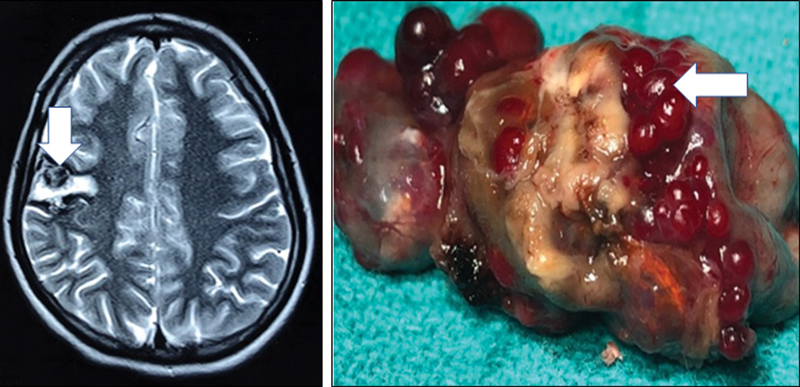
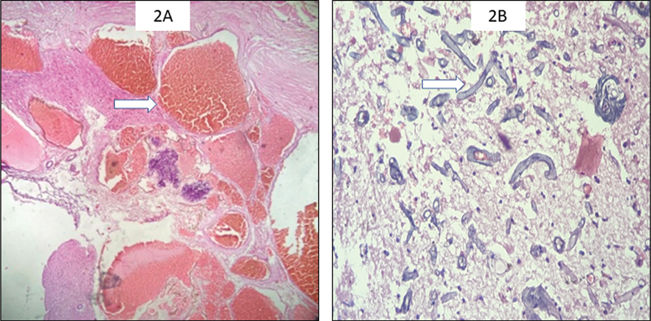
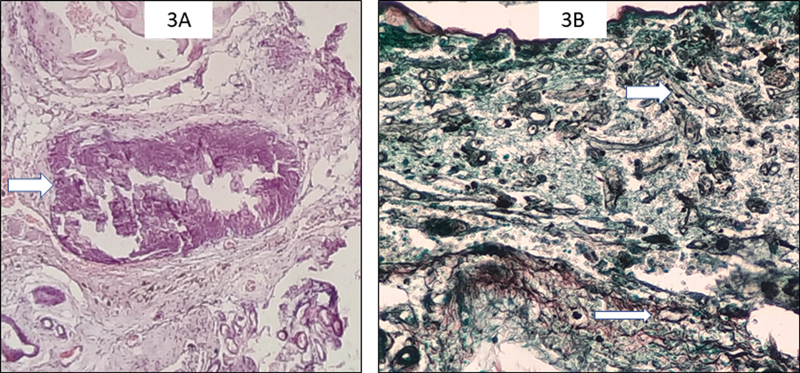
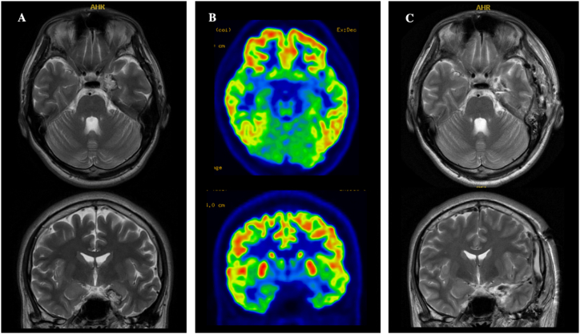
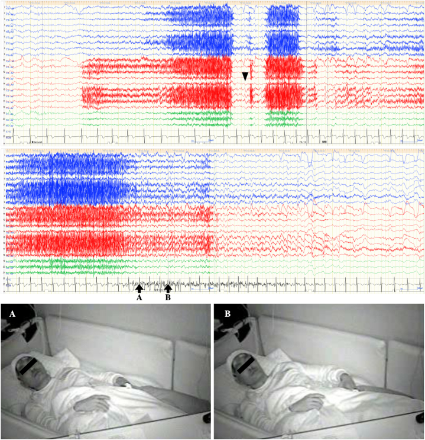
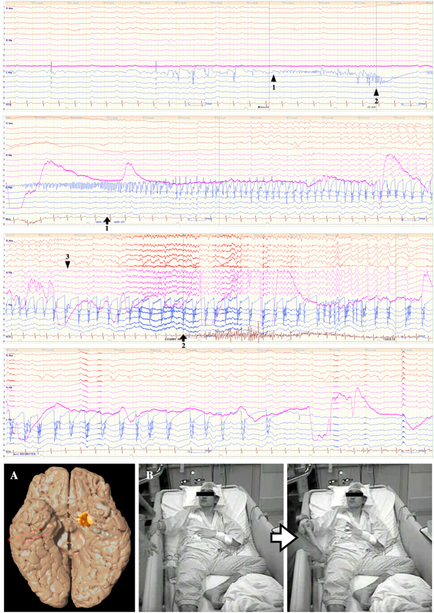
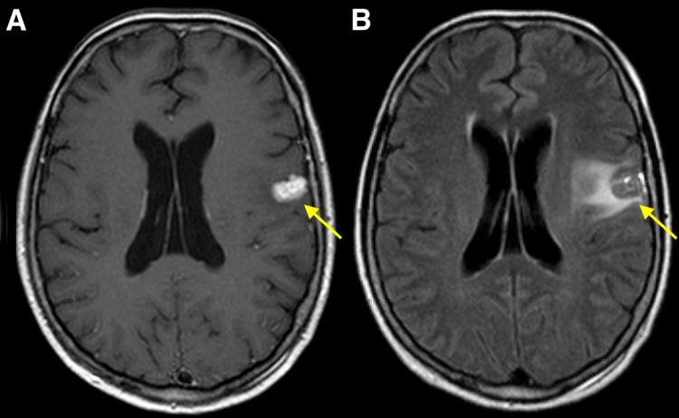
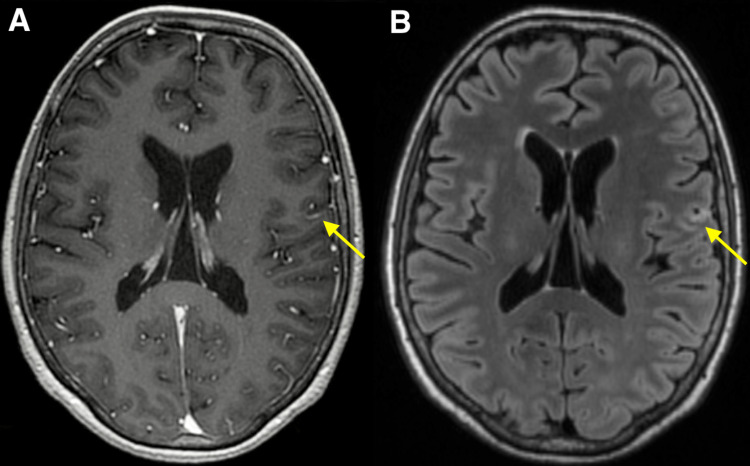
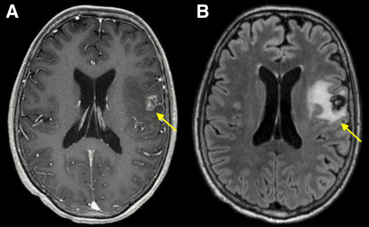
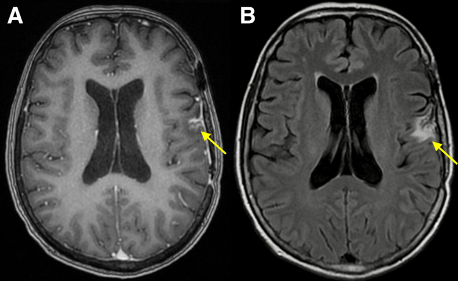

# Case Prep: Cavernous Malformation (Cavernoma) Resection

---

<!-- BEGIN CASE SNAPSHOT -->

## Case / Approach Snapshot

- **Anatomy at risk:** parent vessels, perforators, branch ostia, collateral circulation, venous drainage, cranial nerves, cisterns, and eloquent territories threatened by temporary occlusion or retraction.
- **Operative steps:** plan proximal and distal control, expose the corridor, obtain cerebrospinal fluid/brain relaxation, identify parent vessels before the lesion, treat the lesion/device target, and confirm flow and hemostasis before closure; use the detailed operative sequence and approach notes below as the step-by-step source.
- **Rescue plans:** intraoperative rupture, thromboembolism, branch or perforator compromise, vasospasm, inadequate proximal control, bypass or reconstructive options, anticoagulation/reversal, and postoperative surveillance.
- **Figures:** review [Figures, Imaging & Video](#figures-imaging--video) and the [Curated Image Set](#curated-image-set); embedded local figures should remain open-access, public-domain, or otherwise reusable with attribution.
- **Papers:** review [High-Yield Literature](#high-yield-literature) for seminal sources, modern reviews, and outcome data specific to this page.

<!-- END CASE SNAPSHOT -->

## One-Liner
[Age]yo [M/F] with a [left/right] [supratentorial / brainstem / spinal] cavernous malformation presenting with [seizures / hemorrhage / focal deficit] planned for craniotomy for microsurgical resection.

---

## Figures, Imaging & Video

**🎥 Operative video** — [search operative video on YouTube ▸](https://www.youtube.com/results?search_query=cerebral+cavernous+malformation+surgery) · [The Neurosurgical Atlas ▸](https://www.neurosurgicalatlas.com)

> External sources — operative figures/atlases are copyrighted (linked, not copied). See [media-sources.md](../../resources/media-sources.md).

**Operative technique & approach**
- [The Neurosurgical Atlas](https://www.neurosurgicalatlas.com) — search *"cavernous malformation"* / *"brainstem cavernoma safe entry zones"* (illustrations + HD video)

**Imaging** (classic "popcorn"/hemosiderin-rim appearance)
- [Radiopaedia — cerebral cavernous malformation](https://radiopaedia.org/search?q=cerebral%20cavernous%20malformation&scope=all)

**Open-access figures**
- [PubMed Central](https://www.ncbi.nlm.nih.gov/pmc/?term=cerebral+cavernous+malformation+resection)

---

<!-- BEGIN CURATED LITERATURE -->

## High-Yield Literature

- **Cerebral Cavernous Malformation: From Genetics to Pharmacotherapy** — Zhang Z. Brain and behavior 2025. [PubMed](https://pubmed.ncbi.nlm.nih.gov/39740786/)
- **Cavernous malformation** — Macdonald RL. Journal of neurosurgery 2013. [PubMed](https://pubmed.ncbi.nlm.nih.gov/23039147/)
- **Cerebral Cavernous Malformation Proteins in Barrier Maintenance and Regulation** — Wei S. International journal of molecular sciences 2020. [PubMed](https://pubmed.ncbi.nlm.nih.gov/31968585/)
- **Circulating biomarkers in familial cerebral cavernous malformation** — Lazzaroni F. EBioMedicine 2024. [PubMed](https://pubmed.ncbi.nlm.nih.gov/38113759/)
- **Cerebral cavernous malformation remnants after surgery: a single-center series with long-term bleeding risk analysis** — Fontanella MM. Neurosurgical review 2021. [PubMed](https://pubmed.ncbi.nlm.nih.gov/33211201/)
- **Inflammatory Mechanisms in a Neurovascular Disease: Cerebral Cavernous Malformation** — Li Y. Brain sciences 2023. [PubMed](https://pubmed.ncbi.nlm.nih.gov/37759937/)
- **Intracranial meningioma and concomitant cavernous malformation: A series description and review of the literature** — Missori P. Clinical neurology and neurosurgery 2020. [PubMed](https://pubmed.ncbi.nlm.nih.gov/32861039/)
- **Hemorrhage owing to cerebral cavernous malformation: imaging, clinical, and histopathological considerations** — Kurihara N. Japanese journal of radiology 2020. [PubMed](https://pubmed.ncbi.nlm.nih.gov/32221793/)
- **Surgical treatment of cavernous malformation-related epilepsy in children: case series, systematic review, and meta-analysis** — Bosisio L. Neurosurgical review 2024. [PubMed](https://pubmed.ncbi.nlm.nih.gov/38819574/)
- **Giant Cavernous Malformation Mimicking an Infiltrative Intracranial Neoplasm in Children-Case Report and Systematic Review of the Literature** — González-Gallardo E. World neurosurgery 2023. [PubMed](https://pubmed.ncbi.nlm.nih.gov/36889633/)

<!-- END CURATED LITERATURE -->

---

<!-- BEGIN CURATED IMAGE SET -->

## Curated Image Set

Open-access figures are embedded from PubMed Central articles and kept unique to this guide.

*Fig. 1. Magnetic resonance imaging brain showing right posterior frontal heterogeneously hyperintense cortical lesion with intralesional hematoma and thrombosis ( white arrow ) suggestive of... Source: [Intracranial Cavernous Malformation with Concomitant Isolated Cerebral Mucormycosis Infection: A Case Report](https://pmc.ncbi.nlm.nih.gov/articles/PMC11093628/) — Asian Journal of Neurosurgery 2023; CC BY-NC-ND.*

*Fig. 2. Resected lesion composed of many closely packed anastomosing congested vascular channels having no muscularization. Some of the channels showed presence of fresh thrombus ( white arrow )... Source: [Intracranial Cavernous Malformation with Concomitant Isolated Cerebral Mucormycosis Infection: A Case Report](https://pmc.ncbi.nlm.nih.gov/articles/PMC11093628/) — Asian Journal of Neurosurgery 2023; CC BY-NC-ND.*

*Fig. 3. Few vessels were obliterated with the Mucor colonies and showed calcification ( white arrow ) (400 × , hematoxylin and eosin) ( A ). Gomori methenamine silver (GMS) staining highlights... Source: [Intracranial Cavernous Malformation with Concomitant Isolated Cerebral Mucormycosis Infection: A Case Report](https://pmc.ncbi.nlm.nih.gov/articles/PMC11093628/) — Asian Journal of Neurosurgery 2023; CC BY-NC-ND.*

*Fig. 1. Axial- and coronal-view MRI and FDG-PET. T2-weighted MRI reveals a popcorn lesion with central hyperintensity and a peripheral hypointense rim in the left amygdala (A). This finding is... Source: [False lateralization of scalp EEG and semiology in cavernous malformation-associated temporal lobe epilepsy: A case report](https://pmc.ncbi.nlm.nih.gov/articles/PMC10368837/) — Heliyon 2023; CC BY.*

*Fig. 2. Long-term video scalp EEG during a seizure (amplitude, 10 μV; time constant, 0.1; high frequency filter, 60 Hz; average referential montage). Left, right, and central EEG findings are... Source: [False lateralization of scalp EEG and semiology in cavernous malformation-associated temporal lobe epilepsy: A case report](https://pmc.ncbi.nlm.nih.gov/articles/PMC10368837/) — Heliyon 2023; CC BY.*

*Fig. 3. Intracranial EEG during seizure (amplitude, 75 μV; time constant, 2.0 s; high frequency filter, 120 Hz). SEEG leads were inserted into the right amygdala and bilateral hippocampus (image... Source: [False lateralization of scalp EEG and semiology in cavernous malformation-associated temporal lobe epilepsy: A case report](https://pmc.ncbi.nlm.nih.gov/articles/PMC10368837/) — Heliyon 2023; CC BY.*

*Figure 1. Gamma Knife stereotactic radiosurgery planning MRI.Axial contrast-enhanced T1-weighted (A) and T2-weighted FLAIR brain MRI (B) at the time of Gamma Knife stereotactic radiosurgery... Source: [Recurrent Radiation-Induced Cavernous Malformation After Gamma Knife Stereotactic Radiosurgery for Brain Metastasis](https://pmc.ncbi.nlm.nih.gov/articles/PMC8976526/) — Cureus 2022; CC BY.*

*Figure 2. MRI 3 months after Gamma Knife stereotactic radiosurgery. Axial contrast-enhanced T1-weighted (A) and T2-weighted FLAIR brain MRI (B) obtained 3 months after Gamma Knife stereotactic... Source: [Recurrent Radiation-Induced Cavernous Malformation After Gamma Knife Stereotactic Radiosurgery for Brain Metastasis](https://pmc.ncbi.nlm.nih.gov/articles/PMC8976526/) — Cureus 2022; CC BY.*

*Figure 3. MRI 30 months after Gamma Knife stereotactic radiosurgery.Axial contrast-enhanced T1-weighted (A) and T2-weighted FLAIR brain MRI (B) obtained 30 months after Gamma Knife stereotactic... Source: [Recurrent Radiation-Induced Cavernous Malformation After Gamma Knife Stereotactic Radiosurgery for Brain Metastasis](https://pmc.ncbi.nlm.nih.gov/articles/PMC8976526/) — Cureus 2022; CC BY.*

*Figure 4. MRI 40 months after Gamma Knife stereotactic radiosurgery, 8 months after resection.Axial contrast-enhanced T1-weighted (A) and T2-weighted FLAIR brain MRI (B) obtained eight months... Source: [Recurrent Radiation-Induced Cavernous Malformation After Gamma Knife Stereotactic Radiosurgery for Brain Metastasis](https://pmc.ncbi.nlm.nih.gov/articles/PMC8976526/) — Cureus 2022; CC BY.*

<!-- END CURATED IMAGE SET -->

---

## History of Present Illness
- Chief complaint: Seizures (supratentorial) / focal deficit (brainstem) / hemorrhage
- Number of hemorrhages (rebleed risk increases after first symptomatic bleed):
- Seizure control:
- Familial (multiple cavernomas, CCM gene mutations)?
- Prior radiation (radiation-induced cavernomas)?

---

## Imaging Review
### MRI (T1, T2, GRE/SWI)
- **Classic appearance:** "Popcorn"/"mulberry" lesion, mixed signal core with hemosiderin rim (T2 dark rim)
- **GRE/SWI:** Blooming artifact; detects multiple/familial lesions
- **Location:** Supratentorial (cortical/subcortical), brainstem, deep, spinal
- **Associated developmental venous anomaly (DVA):** Present in many — MUST be preserved (it is the normal venous drainage)
- **Eloquence and depth**
- Recent hemorrhage (acute blood signal)

### DTI / fMRI
- Tractography for brainstem/eloquent lesions (safe entry zones)

### Navigation
- Thin-cut MRI loaded; trajectory planned through safe entry zone

---

## Labs
- CBC, BMP, Coags, Type and screen

---

## Neurological Examination
- Complete exam; brainstem cavernoma → detailed CN and long-tract exam
- Seizure semiology (supratentorial)

---

## Surgical Planning

### Case Logistics, OR Needs & Orders
- **Typical bed:** neuro ICU after aneurysm clipping or cavernoma surgery, especially ruptured aneurysm, vasospasm risk, or brainstem/deep lesion.
- **OR setup:** microscope, clip tray with temporary/permanent clips, ICG/Doppler, vascular instruments, blood available, DSA/CTA images displayed, and bypass/parent-vessel rescue plan for complex aneurysms.
- **Special needs:** arterial line, BP target before and after occlusion, nimodipine/EVD/SAH pathway if ruptured, seizure prophylaxis by lesion/location, dexamethasone only when edema risk warrants, and neuromonitoring for deep/eloquent corridors.
- **Immediate postop orders:** ICU neuro checks, SBP parameters, CTA/DSA or CT timing, EVD/vasospasm surveillance for SAH, antiepileptic plan, DVT timing, and focused motor/language/cranial-nerve exams.

### Diagnosis & Indication
- Working diagnosis: Cavernous malformation
- Indication: Symptomatic hemorrhage, medically refractory seizures, progressive deficit, surgically accessible. Brainstem cavernomas: operate after ≥ 2 symptomatic bleeds or if reaching pial/ependymal surface
- Goals: Complete resection of cavernoma; **preserve associated DVA**; for seizures, consider resecting hemosiderin rim (epileptogenic) if non-eloquent

### Position & Approach
- Based on location — lesion at highest point; navigation-guided minimal corticotomy
- **Brainstem:** Use a recognized **safe entry zone** (e.g., anterolateral midbrain, peritrigeminal/lateral pons, suprafacial/infrafacial triangles in floor of 4th ventricle); choose approach giving shortest path to pial/ependymal presentation
- Approaches: convexity craniotomy, retrosigmoid, suboccipital/telovelar, supracerebellar — per location

### Microsurgical Steps
1. Craniotomy and navigation confirmation
2. Minimal corticotomy / enter via safe entry zone (brainstem)
3. Identify the cavernoma (often presents to surface or just beneath; hemosiderin staining)
4. Enter the lesion, debulk internally
5. Circumferential dissection in the gliotic/hemosiderin plane
6. **Preserve the DVA** — do NOT coagulate (causes venous infarct)
7. Remove cavernoma completely (residual → rebleed)
8. For epilepsy (non-eloquent): consider resecting hemosiderin-stained gliotic rim
9. Hemostasis, inspect cavity

### Critical Anatomy & Structures at Risk
1. **Associated DVA** — preserve at all costs
2. **Brainstem nuclei/tracts** (brainstem lesions) — stay within lesion, use safe entry zones
3. **Eloquent cortex/tracts** (supratentorial)
4. **Cranial nerves** (brainstem/posterior fossa)

### Equipment
- Microscope, navigation, DTI overlay
- Microsurgical instruments, fine bipolar
- Neuromonitoring (brainstem mapping for floor of 4th ventricle)

### Monitoring
- SSEPs, MEPs; CN EMG and brainstem mapping (brainstem lesions); ECoG (epilepsy)

### Anesthesia
- Standard; no paralytic if mapping; arterial line for brainstem cases

### Potential Complications
1. **DVA injury → venous infarction** (avoidable)
2. New neurological deficit (brainstem — often transient, may improve)
3. Incomplete resection → rebleed
4. Hemorrhage

---

## Operative Note Template

**Preoperative Diagnosis:** [Left/Right] [supratentorial/brainstem] cavernous malformation [with prior symptomatic hemorrhage(s)]

**Postoperative Diagnosis:** Same

**Procedure:** [Left/Right] [location/approach] craniotomy for microsurgical resection of cavernous malformation

**Surgeon / Assistant:**
**Anesthesia:** General endotracheal
**EBL / Fluids:**
**Adjuncts:** Neuronavigation [with DTI overlay], ultrasound
**Monitoring:** SSEP / MEP [/ CN EMG / brainstem mapping for floor of 4th ventricle] — stable
**Complications:** None

**Indications:** [Age]yo [M/F] with a symptomatic [location] cavernous malformation and [≥1–2 prior hemorrhages / progressive deficit / refractory seizures]. The lesion [reaches a pial/ependymal surface], making resection feasible. Risks/benefits/alternatives (including observation) discussed.

**Description of Procedure:** After consent and time-out, general anesthesia was induced (no long-acting paralytic to permit mapping) and neuromonitoring established. The head was fixed and positioned per the lesion; a [location/approach] craniotomy was performed and the dura opened.

Under the microscope with navigation, the lesion was approached via [a minimal corticotomy over the presenting surface / a recognized brainstem safe entry zone — specify]. The cavernoma was entered, internally debulked, and dissected circumferentially in the gliotic/hemosiderin plane and removed completely. **The associated developmental venous anomaly was identified and preserved (not coagulated).** [For the epileptogenic supratentorial lesion, the surrounding hemosiderin-stained gliotic rim was also resected as it was non-eloquent.] The cavity was inspected to confirm complete resection, and hemostasis obtained.

The dura was closed, the bone flap replaced, and the scalp closed in layers. Neuromonitoring remained stable. The patient was transferred to the [ICU] in stable condition, [moving all extremities at baseline].

---

## Postoperative Plan
- ICU, neuro checks q1h (q1h and brainstem precautions if brainstem)
- Postop MRI (confirm complete resection)
- Seizure management (supratentorial)
- Brainstem cases: monitor CN function, swallowing, respiratory; expect possible transient worsening with gradual recovery
- Familial: genetics referral, screen family
- Follow-up MRI
