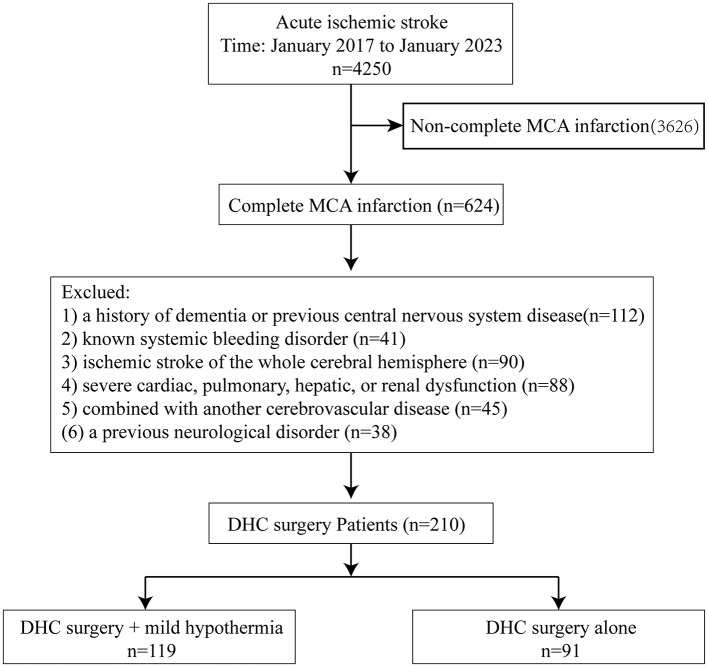
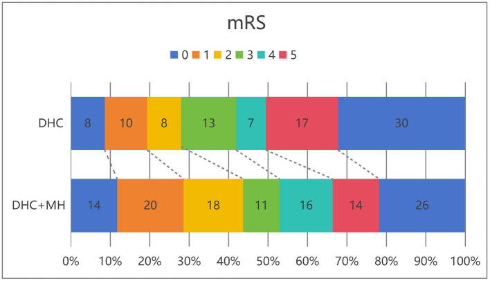
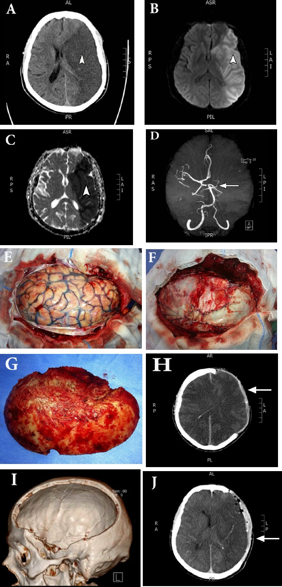
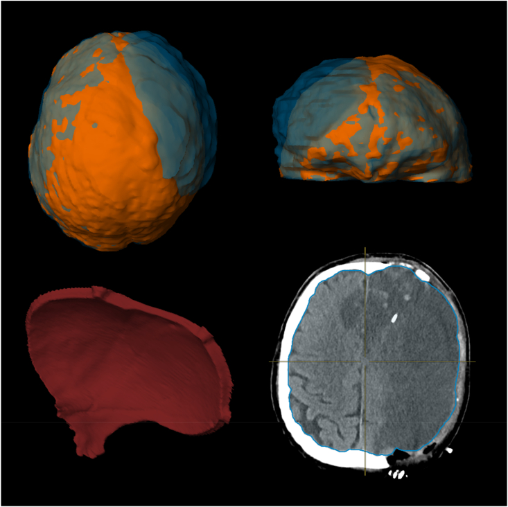
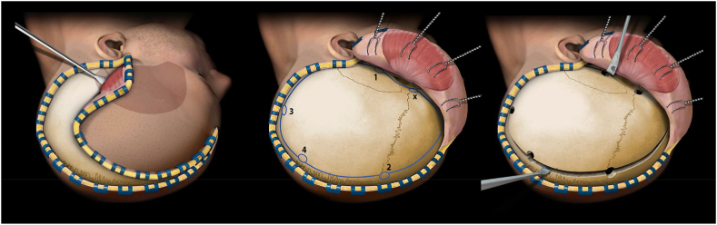
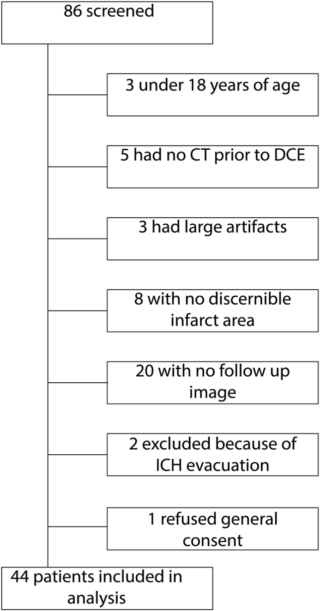
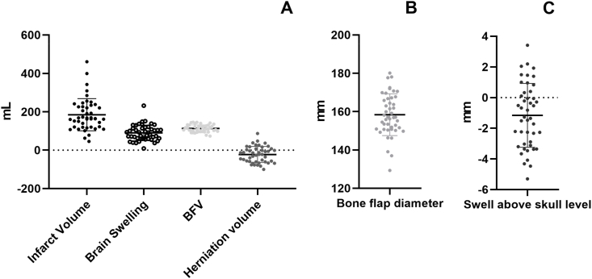
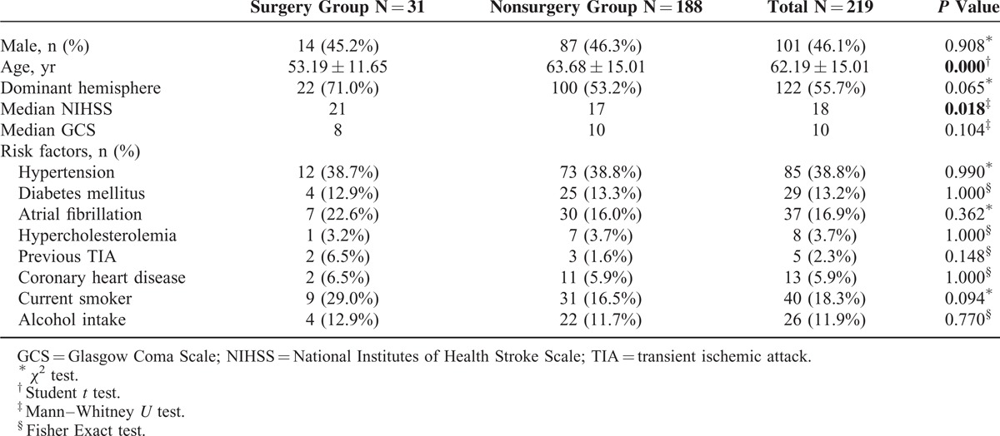
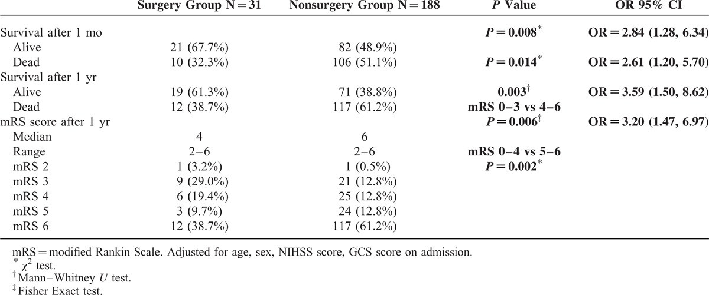
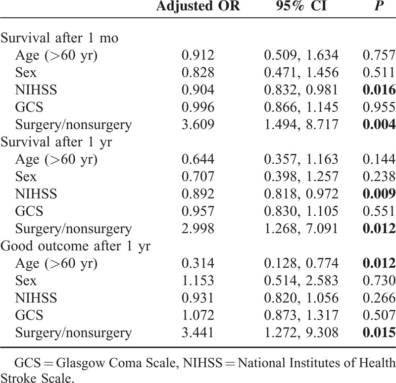

# Case Prep: Decompressive Hemicraniectomy for Malignant MCA Infarction

---

<!-- BEGIN CASE DOSSIER -->

## Case / Approach Dossier

- **Anatomy at risk:** parent vessels, perforators, branch ostia, collateral circulation, venous drainage, cranial nerves, cisterns, and eloquent territories threatened by temporary occlusion or retraction.
- **Operative steps:** plan proximal and distal control, expose the corridor, obtain cerebrospinal fluid/brain relaxation, identify parent vessels before the lesion, treat the lesion/device target, and confirm flow and hemostasis before closure; use the detailed operative sequence and approach notes below as the step-by-step source.
- **Rescue plans:** intraoperative rupture, thromboembolism, branch or perforator compromise, vasospasm, inadequate proximal control, bypass or reconstructive options, anticoagulation/reversal, and postoperative surveillance.
- **Figures:** review [Figures, Imaging & Video](#figures-imaging--video) and the [Curated Image Set](#curated-image-set); embedded local figures should remain open-access, public-domain, or otherwise reusable with attribution.
- **Papers:** review [High-Yield Literature](#high-yield-literature) for seminal sources, modern reviews, and outcome data specific to this page.
- **Textbook cross-checks:** use [Textbook Cross-Checks](#textbook-cross-checks) and the [Source Crosswalk](../../resources/source-crosswalk.md) to cite copyrighted textbooks/atlases while summarizing in original words.

<!-- END CASE DOSSIER -->

## One-Liner
[Age]yo [M/F] with malignant [left/right] MCA territory infarction with [progressive edema / midline shift / declining consciousness] planned for decompressive hemicraniectomy.

---

## Figures, Imaging & Video

**🎥 Operative video** — [search operative video on YouTube ▸](https://www.youtube.com/results?search_query=malignant+MCA+infarction+surgery) · [The Neurosurgical Atlas ▸](https://www.neurosurgicalatlas.com)

> External sources — operative figures/atlases are copyrighted (linked, not copied). See [media-sources.md](../../resources/media-sources.md).

**Operative technique & approach**
- [The Neurosurgical Atlas](https://www.neurosurgicalatlas.com) — search *"decompressive hemicraniectomy"* (technique + flap size)

**Imaging**
- [Radiopaedia — malignant MCA infarction](https://radiopaedia.org/search?q=malignant%20MCA%20infarction&scope=all)

**Open-access figures**
- [PubMed Central](https://www.ncbi.nlm.nih.gov/pmc/?term=decompressive+craniectomy+malignant+MCA+infarction)

---

<!-- BEGIN TEXTBOOK CROSS-CHECKS -->

## Textbook Cross-Checks

- **Vascular anatomy:** Rhoton Cranial Anatomy; Decision Making in Neurovascular Disease; Practical Neuroangiography — confirm parent-vessel anatomy, perforators, venous drainage, collateral pathways, and endovascular access/rescue options.
- **Operative/endovascular strategy:** Youmans and Winn; Schmidek and Sweet; Greenberg — summarize proximal control, exposure/device strategy, temporary-control options, and bailout plans in your own words.
- **Complication rescue:** Greenberg; Decision Making in Neurovascular Disease — review ischemia, hemorrhage, thromboembolism, rupture, vasospasm, and postoperative surveillance algorithms.
- **Copyright-safe use:** cite these sources as private cross-checks, then write the guide content in original words; do not re-host textbook pages, figures, tables, or board-review card material. See [Source Crosswalk & Copyright-Safe Use](../../resources/source-crosswalk.md).

<!-- END TEXTBOOK CROSS-CHECKS -->

<!-- BEGIN CURATED LITERATURE -->

## High-Yield Literature

- **Decompressive Hemicraniectomy in the Treatment of Malignant Middle Cerebral Artery Infarction: A Meta-Analysis** — Das S. World neurosurgery 2019. [PubMed](https://pubmed.ncbi.nlm.nih.gov/30500591/)
- **Decompressive Surgery for the Treatment of Malignant Infarction of the Middle Cerebral Artery (DESTINY): a randomized, controlled trial** — Jüttler E. Stroke 2007. [PubMed](https://pubmed.ncbi.nlm.nih.gov/17690310/)
- **It is all about timing: decompressive hemicraniectomy for malignant middle-cerebral-artery infarction** — Macha K. Arquivos de neuro-psiquiatria 2023. [PubMed](https://pubmed.ncbi.nlm.nih.gov/37160135/)
- **Decompressive hemicraniectomy after malignant middle cerebral artery infarction: does hospital of origin matter?** — Smyth D. Internal medicine journal 2018. [PubMed](https://pubmed.ncbi.nlm.nih.gov/30288900/)
- **Decompressive hemicraniectomy versus medical treatment of malignant middle cerebral artery infarction: a systematic review and meta-analysis** — Wei H. Bioscience reports 2020. [PubMed](https://pubmed.ncbi.nlm.nih.gov/31854446/)
- **Decompressive hemicraniectomy in patients with malignant middle cerebral artery infarction: A real-world study** — Pilato F. Journal of the neurological sciences 2022. [PubMed](https://pubmed.ncbi.nlm.nih.gov/35952455/)
- **Surgical decompression for space-occupying cerebral infarction (the Hemicraniectomy After Middle Cerebral Artery infarction with Life-threatening Edema Trial [HAMLET]): a multicentre, open, randomised trial** — Hofmeijer J. The Lancet. Neurology 2009. [PubMed](https://pubmed.ncbi.nlm.nih.gov/19269254/)
- **Decompressive hemicraniectomy in patients with malignant middle cerebral artery infarction: A systematic review and meta-analysis** — Yang MH. The surgeon : journal of the Royal Colleges of Surgeons of Edinburgh and Ireland 2015. [PubMed](https://pubmed.ncbi.nlm.nih.gov/25661677/)
- **Decompressive hemicraniectomy for malignant middle cerebral artery infarction: an update** — Subramaniam S. The neurologist 2009. [PubMed](https://pubmed.ncbi.nlm.nih.gov/19590377/)
- **Long-term outcome after decompressive hemicraniectomy for malignant middle cerebral artery infarction** — Berger N. Journal of neurology 2023. [PubMed](https://pubmed.ncbi.nlm.nih.gov/37004558/)

<!-- END CURATED LITERATURE -->

---

<!-- BEGIN CURATED IMAGE SET -->

## Curated Image Set

Open-access figures are embedded from PubMed Central articles and kept unique to this guide.

*Figure 1. Trial profile. Source: [Early decompressive hemicraniectomy combined with mild hypothermia treatment for malignant middle cerebral artery infarction](https://pmc.ncbi.nlm.nih.gov/articles/PMC13230002/) — Frontiers in Neurology 2026; CC BY.*

*Figure 2. Distribution of 6-month modified Rankin scale scores in patients receiving DHC alone vs. those receiving DHC combined with mild hypothermia. Source: [Early decompressive hemicraniectomy combined with mild hypothermia treatment for malignant middle cerebral artery infarction](https://pmc.ncbi.nlm.nih.gov/articles/PMC13230002/) — Frontiers in Neurology 2026; CC BY.*

*Figure 1. Case illustration of a 39-year-old male (case 4) who presented with left massive MCA infarction demonstrated on A) plain CT scan which was delineated by MRI diffusion B) and ADC scan C)... Source: [Decompressive hemicraniectomy for malignant middle cerebral artery infarction](https://pmc.ncbi.nlm.nih.gov/articles/PMC5946363/) — Neurosciences 2017; CC BY.*

*Fig. 1. (clockwise from top left) overhead view of a 3D-rendered fully segmented brain before (orange) and after (blue) decompressive hemicraniectomy (DCE); front view of a 3D-rendered fully... Source: [How much space is needed for decompressive surgery in malignant middle cerebral artery infarction: Enabling single-stage surgery](https://pmc.ncbi.nlm.nih.gov/articles/PMC10293220/) — Brain & Spine 2023; CC BY-NC-ND.*

*Fig. 2. Schematic representation of the main surgical steps of a decompressive hemicraniectomy as described by Raabe et al. (Raabe, 2019) Dural incision after bony decompression is not shown.... Source: [How much space is needed for decompressive surgery in malignant middle cerebral artery infarction: Enabling single-stage surgery](https://pmc.ncbi.nlm.nih.gov/articles/PMC10293220/) — Brain & Spine 2023; CC BY-NC-ND.*

*Fig. 3. Flow chart representing all patients screened and the reason for their eventual exclusion from the study population. Source: [How much space is needed for decompressive surgery in malignant middle cerebral artery infarction: Enabling single-stage surgery](https://pmc.ncbi.nlm.nih.gov/articles/PMC10293220/) — Brain & Spine 2023; CC BY-NC-ND.*

*Fig. 4. A.Distribution of the different measured volumes in mL,B.the distribution of bone flap diameters, andC.the modeled swelling above the previous outer skull rim after decompressive... Source: [How much space is needed for decompressive surgery in malignant middle cerebral artery infarction: Enabling single-stage surgery](https://pmc.ncbi.nlm.nih.gov/articles/PMC10293220/) — Brain & Spine 2023; CC BY-NC-ND.*

*Figure 8. Source: [A Cohort Study of Decompressive Craniectomy for Malignant Middle Cerebral Artery Infarction: A Real-World Experience in Clinical Practice](https://pmc.ncbi.nlm.nih.gov/articles/PMC4504625/) — Medicine (Baltimore). 2015 Jun 26;94(25):e1039. doi: 10.1097/MD.0000000000001039; CC BY-NC-ND.*

*Figure 9. Source: [A Cohort Study of Decompressive Craniectomy for Malignant Middle Cerebral Artery Infarction: A Real-World Experience in Clinical Practice](https://pmc.ncbi.nlm.nih.gov/articles/PMC4504625/) — Medicine (Baltimore). 2015 Jun 26;94(25):e1039. doi: 10.1097/MD.0000000000001039; CC BY-NC-ND.*

*Figure 10. Source: [A Cohort Study of Decompressive Craniectomy for Malignant Middle Cerebral Artery Infarction: A Real-World Experience in Clinical Practice](https://pmc.ncbi.nlm.nih.gov/articles/PMC4504625/) — Medicine (Baltimore). 2015 Jun 26;94(25):e1039. doi: 10.1097/MD.0000000000001039; CC BY-NC-ND.*

<!-- END CURATED IMAGE SET -->

---

## History of Present Illness
- Chief complaint: Large MCA stroke with deteriorating consciousness
- Stroke onset time; tPA/thrombectomy given?
- Progression: declining GCS, anisocoria, worsening edema on serial CT
- **Evidence-based:** DESTINY, DECIMAL, HAMLET trials — decompression within 48h reduces mortality in malignant MCA infarction, especially age < 60
- Premorbid functional status, goals of care (decompression survivors often have significant disability — counsel family)

---

## Imaging Review
### CT Head
- MCA territory infarct (> 50% MCA territory, or > 145 cm³ on DWI)
- Cytotoxic edema, sulcal effacement
- **Midline shift, uncal herniation, basal cistern effacement**
- Hemorrhagic transformation
- Involvement of ACA/PCA territory

---

## Labs
- CBC, BMP, Coags (especially if post-tPA/thrombectomy — correct coagulopathy)
- Type and screen

---

## Neurological Examination
- GCS, pupils, motor (dense contralateral hemiplegia expected), gaze deviation
- Decline in consciousness is the key surgical trigger

---

## Surgical Planning

### Diagnosis & Indication
- Working diagnosis: Malignant MCA infarction with mass effect
- Indication: Clinical deterioration (declining GCS), radiographic herniation, age (best outcomes < 60 but individualized), within ~48h of onset, before irreversible brainstem injury
- Goals: Relieve mass effect, prevent fatal herniation (life-saving, not function-restoring)

### Position
- Supine, head turned contralateral, shoulder roll, Mayfield or horseshoe

### Approach: Large Decompressive Hemicraniectomy
### Key Surgical Steps
1. **Large reverse question-mark incision** (frontotemporoparietal)
2. **Large bone flap** — **must be ≥ 12 cm AP diameter (ideally 14-15 cm)** — inadequate size is the most common error and risks venous strangulation at bone edges
3. Extend craniectomy to the floor of the middle fossa (temporal decompression critical — uncal/brainstem)
4. Keep ~2-3 cm from midline (avoid sagittal sinus)
5. **Open dura widely** — stellate or C-shaped
6. **Expansile duraplasty** — dural substitute sewn in loosely to augment volume; do NOT close dura tightly
7. **Do NOT resect infarcted brain** routinely (unless strangulated/necrotic herniating tissue causing closure problems)
8. Bone flap stored (subcutaneous abdominal pocket or bone bank/freezer)
9. Hemostasis, subgaleal drain, scalp closure
10. [± ICP monitor]

### Critical Anatomy & Structures at Risk
1. **Superior sagittal sinus** — keep medial bone edge ~2.5 cm from midline
2. **Bridging veins / cortical veins** — at bone edge if craniectomy too small → venous infarction/strangulation
3. **Middle fossa floor / temporal lobe** — decompress to relieve uncal herniation
4. **Transverse sinus** — posterior-inferior limit

### Equipment
- Craniotome, high-speed drill
- Dural substitute (large graft for duraplasty)
- Bone storage materials
- ICP monitor/EVD

### Anesthesia
- Arterial line, central line, Foley
- Mannitol/hypertonic saline (bridge to OR)
- Correct any coagulopathy
- Cefazolin 2g

### Potential Complications
1. Inadequate decompression (flap too small) → persistent herniation
2. Hemorrhagic transformation of infarct
3. Hydrocephalus
4. Sinking skin flap syndrome (pre-cranioplasty)
5. Infection
6. Survivors with significant disability (counsel family pre-op)

---

## Operative Note Template
**Preoperative Diagnosis:** Malignant [left/right] MCA territory infarction with cerebral edema, mass effect, and [declining consciousness / herniation]

**Postoperative Diagnosis:** Same

**Procedure:** [Left/Right] decompressive hemicraniectomy with expansile duraplasty [and ICP monitor placement]

**Surgeon / Assistant:**
**Anesthesia:** General endotracheal
**EBL / Fluids:**
**Implants:** Dural substitute; bone flap stored [abdominal pocket / bone bank]; [ICP monitor]
**Complications:** None

**Indications:** [Age]yo [M/F] with a malignant [left/right] MCA infarction (>50% territory) and clinical/radiographic deterioration (declining GCS, midline shift, cistern effacement). Decompression was offered as a life-saving measure; the family was counseled that survivors may have significant disability and elected to proceed.

**Description of Procedure:** After consent and time-out, general anesthesia was induced and the patient positioned supine with the head turned contralateral on a shoulder roll. A large reverse-question-mark incision was made and the myocutaneous flap reflected. Burr holes were placed and a large frontotemporoparietal bone flap was elevated with a craniotome; the AP diameter was [__] cm (≥12 cm). The temporal squama was rongeured down to the floor of the middle fossa, and the medial margin kept ~2.5 cm from the midline to protect the superior sagittal sinus and bridging veins.

The dura was opened widely in a stellate fashion, decompressing the swollen, infarcted hemisphere; non-viable infarcted brain was [not resected / debrided only where herniating and necrotic]. An expansile duraplasty was fashioned with a dural substitute sewn in loosely to augment intradural volume. [An ICP monitor was placed.] The bone flap was stored in [a subcutaneous abdominal pocket / the bone bank] for future cranioplasty. Hemostasis was confirmed, a subgaleal drain placed, and the scalp closed loosely in layers. The patient was transferred intubated to the NSICU in critical but stable condition.

---

## Postoperative Plan
- NSICU, neuro checks q1h, ICP management
- HOB 30 degrees, Na 145-155 target if edema
- Serial CT (monitor edema peak days 2-5, hemorrhagic transformation)
- DVT prophylaxis (delayed chemical, esp. post-tPA)
- Seizure prophylaxis per practice
- **Cranioplasty in ~6-12 weeks** once edema resolved
- Early rehab evaluation, goals-of-care discussions
