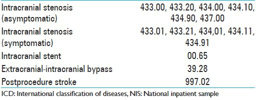
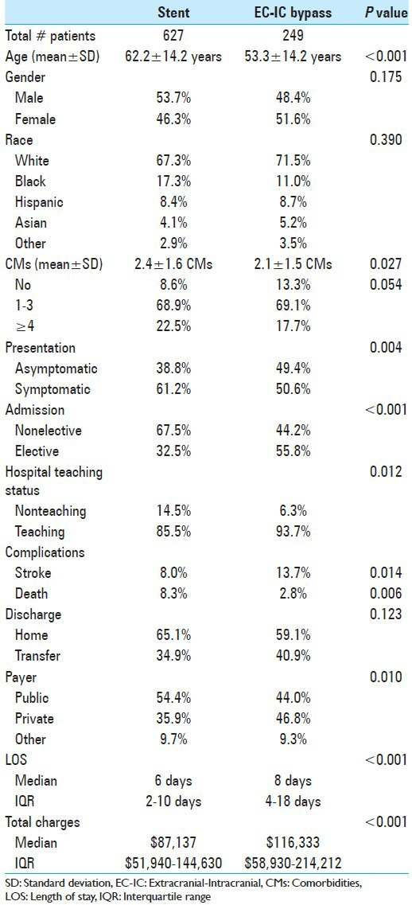
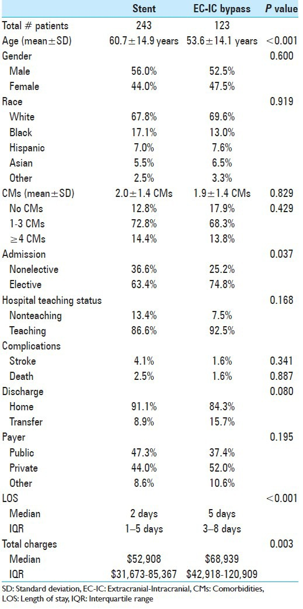
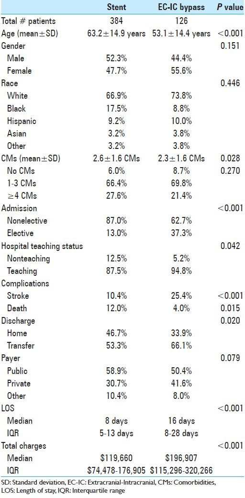
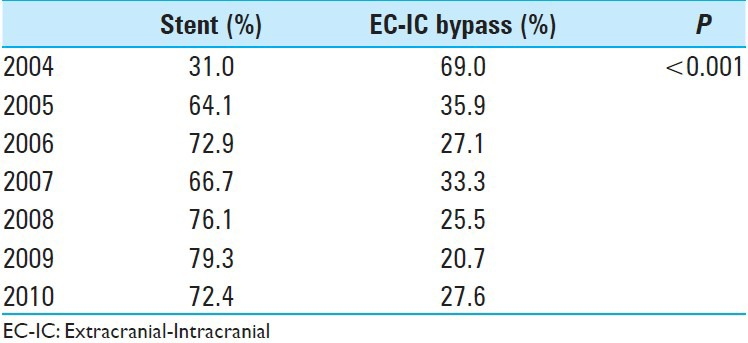
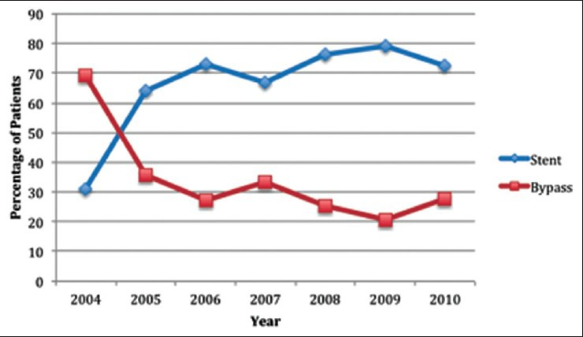
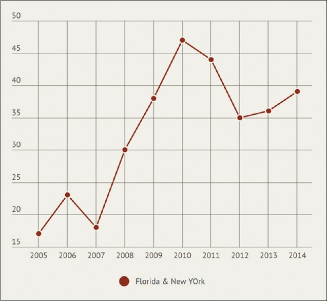
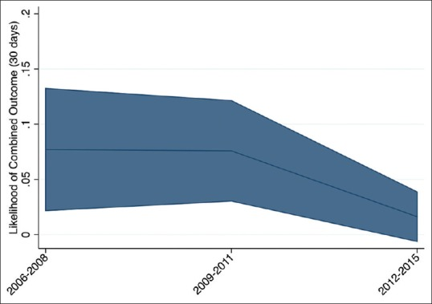
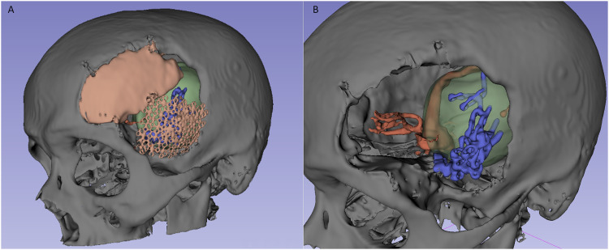
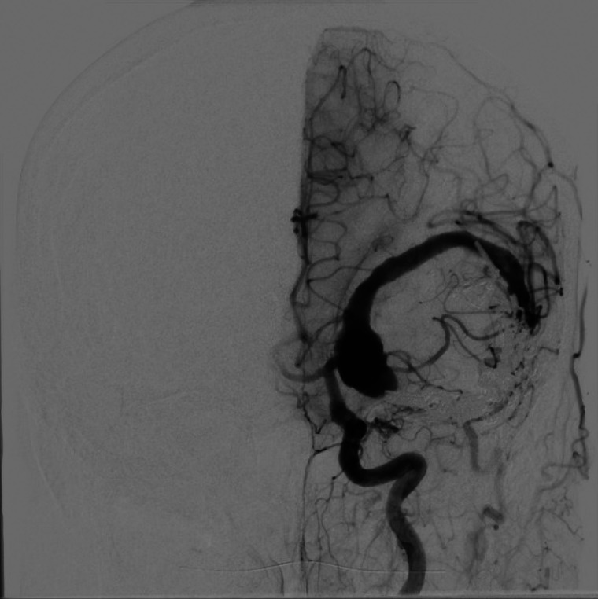

# Case Prep: EC-IC Bypass (STA-MCA)

---

<!-- BEGIN CASE SNAPSHOT -->

## Case / Approach Snapshot

- **Anatomy at risk:** parent vessels, perforators, branch ostia, collateral circulation, venous drainage, cranial nerves, cisterns, and eloquent territories threatened by temporary occlusion or retraction.
- **Operative steps:** plan proximal and distal control, expose the corridor, obtain cerebrospinal fluid/brain relaxation, identify parent vessels before the lesion, treat the lesion/device target, and confirm flow and hemostasis before closure; use the detailed operative sequence and approach notes below as the step-by-step source.
- **Rescue plans:** intraoperative rupture, thromboembolism, branch or perforator compromise, vasospasm, inadequate proximal control, bypass or reconstructive options, anticoagulation/reversal, and postoperative surveillance.
- **Figures:** review [Figures, Imaging & Video](#figures-imaging--video) and the [Curated Image Set](#curated-image-set); embedded local figures should remain open-access, public-domain, or otherwise reusable with attribution.
- **Papers:** review [High-Yield Literature](#high-yield-literature) for seminal sources, modern reviews, and outcome data specific to this page.

<!-- END CASE SNAPSHOT -->

## One-Liner
[Age]yo [M/F] with [moyamoya disease / symptomatic ICA or MCA occlusion / complex aneurysm requiring flow replacement] planned for [left/right] STA-MCA bypass [± indirect revascularization (EDAS/EDAMS)].

---

## Figures, Imaging & Video

**🎥 Operative video** — [search operative video on YouTube ▸](https://www.youtube.com/results?search_query=moyamoya+surgery) · [The Neurosurgical Atlas ▸](https://www.neurosurgicalatlas.com)

> 🧭 **Operative approach:** [Pterional craniotomy](../approaches/pterional-craniotomy.md) — detailed corridor setup, step-by-step technique & figures

> External sources — operative figures/atlases are copyrighted (linked, not copied). See [media-sources.md](../../resources/media-sources.md).

**Operative technique & approach**
- [The Neurosurgical Atlas](https://www.neurosurgicalatlas.com) — search *"STA-MCA bypass"* (illustrations + HD video)
- [neuroangio.org](https://neuroangio.org) — moyamoya & bypass angiography

**Imaging**
- [Radiopaedia — moyamoya disease](https://radiopaedia.org/search?q=moyamoya&scope=all)

**Open-access figures**
- [PubMed Central](https://www.ncbi.nlm.nih.gov/pmc/?term=STA-MCA+bypass)

---

<!-- BEGIN CURATED LITERATURE -->

## High-Yield Literature

- **[EC-IC bypass for occlusion of the internal carotid artery]** — Fischer G. Radiologie (Heidelberg, Germany) 2024. [PubMed](https://pubmed.ncbi.nlm.nih.gov/39009759/)
- **EC/IC Bypass Study** — McDowell F. Stroke 1986. [PubMed](https://pubmed.ncbi.nlm.nih.gov/3511567/)
- **The role of EC-IC bypass in ICA blood blister aneurysms-a systematic review** — Meling TR. Neurosurgical review 2021. [PubMed](https://pubmed.ncbi.nlm.nih.gov/32318921/)
- **EC-IC bypass for cerebral revascularization following skull base tumor resection: Current practices and innovations** — Wolfswinkel EM. Journal of surgical oncology 2018. [PubMed](https://pubmed.ncbi.nlm.nih.gov/30196557/)
- **EC-IC Bypass** — Auer LM. Neurosurgery 1985. [PubMed](https://pubmed.ncbi.nlm.nih.gov/3982630/)
- **Cerebral revascularization by EC-IC bypass--present status** — Mehdorn HM. Acta neurochirurgica. Supplement 2008. [PubMed](https://pubmed.ncbi.nlm.nih.gov/18496948/)
- **Can we identify patients with carotid occlusion who would benefit from EC/IC bypass? Review** — Herzig R. Biomedical papers of the Medical Faculty of the University Palacky, Olomouc, Czechoslovakia 2004. [PubMed](https://pubmed.ncbi.nlm.nih.gov/15744358/)
- **EC-IC Bypass; Our Experience of Cerebral Revascularization with Intraoperative Dual-Image Video Angiography (Diva)** — Joshi G. Asian journal of neurosurgery 2020. [PubMed](https://pubmed.ncbi.nlm.nih.gov/33145198/)
- **Editorial: Moyamoya disease** — Gu Y. Frontiers in neurology 2022. [PubMed](https://pubmed.ncbi.nlm.nih.gov/36530626/)
- **Early Post-operative CT-Angiography Imaging After EC-IC Bypass Surgery in Moyamoya Patients** — Hurth H. Frontiers in neurology 2021. [PubMed](https://pubmed.ncbi.nlm.nih.gov/33868157/)

<!-- END CURATED LITERATURE -->

---

<!-- BEGIN CURATED IMAGE SET -->

## Curated Image Set

Open-access figures are embedded from PubMed Central articles and kept unique to this guide.

*Figure 1. Source: [Comparison of outcomes and utilization of extracranial–intracranial bypass versus intracranial stenting for intracranial stenosis](https://pmc.ncbi.nlm.nih.gov/articles/PMC4287911/) — Surg Neurol Int. 2014 Dec 11;5:178. doi: 10.4103/2152-7806.146831; CC BY-NC-SA.*

*Figure 2. Source: [Comparison of outcomes and utilization of extracranial–intracranial bypass versus intracranial stenting for intracranial stenosis](https://pmc.ncbi.nlm.nih.gov/articles/PMC4287911/) — Surg Neurol Int. 2014 Dec 11;5:178. doi: 10.4103/2152-7806.146831; CC BY-NC-SA.*

*Figure 3. Source: [Comparison of outcomes and utilization of extracranial–intracranial bypass versus intracranial stenting for intracranial stenosis](https://pmc.ncbi.nlm.nih.gov/articles/PMC4287911/) — Surg Neurol Int. 2014 Dec 11;5:178. doi: 10.4103/2152-7806.146831; CC BY-NC-SA.*

*Figure 4. Source: [Comparison of outcomes and utilization of extracranial–intracranial bypass versus intracranial stenting for intracranial stenosis](https://pmc.ncbi.nlm.nih.gov/articles/PMC4287911/) — Surg Neurol Int. 2014 Dec 11;5:178. doi: 10.4103/2152-7806.146831; CC BY-NC-SA.*

*Figure 5. Source: [Comparison of outcomes and utilization of extracranial–intracranial bypass versus intracranial stenting for intracranial stenosis](https://pmc.ncbi.nlm.nih.gov/articles/PMC4287911/) — Surg Neurol Int. 2014 Dec 11;5:178. doi: 10.4103/2152-7806.146831; CC BY-NC-SA.*

*Figure 1. Trends in utilization of intracranial stenting and extracranial–intracranial bypass procedures for revascularization of patients with intracranial stenosis Source: [Comparison of outcomes and utilization of extracranial–intracranial bypass versus intracranial stenting for intracranial stenosis](https://pmc.ncbi.nlm.nih.gov/articles/PMC4287911/) — Surgical Neurology International 2014; CC BY-NC-SA.*

*Figure 1. Extracranial–intracranial bypass surgery utilization trend for cerebrovascular steno-occlusive disorders using Florida and New York State Inpatient Databases Source: [Utilization and safety of extracranial–intracranial bypass surgery in symptomatic steno-occlusive disorders](https://pmc.ncbi.nlm.nih.gov/articles/PMC6458777/) — Brain Circulation 2019; CC BY-NC-SA.*

*Figure 2. Trends in 30-day risk of death, stroke, or hemorrhage following extracranial–intracranial bypass surgery using Florida and New York State Inpatient Databases Source: [Utilization and safety of extracranial–intracranial bypass surgery in symptomatic steno-occlusive disorders](https://pmc.ncbi.nlm.nih.gov/articles/PMC6458777/) — Brain Circulation 2019; CC BY-NC-SA.*

*Figure 1.. Three-dimensional (3D) reconstruction of the patient's previous craniotomy (left) and intracranial vascular system with recurrent aneurysm thrombosis and surgical clips before... Source: [Extracranial-Intracranial Microsurgical Bypass Using a Y-Shaped Vein Graft From the Hand](https://pmc.ncbi.nlm.nih.gov/articles/PMC11561939/) — Plastic Surgery 2024; CC BY-NC.*

*Figure 2.. Preoperative digital subtraction angiogram (left internal carotid injection) of the giant partially thrombosed left MCA aneurysm. Source: [Extracranial-Intracranial Microsurgical Bypass Using a Y-Shaped Vein Graft From the Hand](https://pmc.ncbi.nlm.nih.gov/articles/PMC11561939/) — Plastic Surgery 2024; CC BY-NC.*

<!-- END CURATED IMAGE SET -->

---

## History of Present Illness
- Chief complaint: Recurrent TIAs / ischemic strokes / hemodynamic insufficiency
- **Indications:**
  - Moyamoya disease (progressive ICA terminus stenosis)
  - Symptomatic ICA/MCA occlusion with failed medical therapy + impaired cerebrovascular reserve
  - Flow replacement for giant/complex aneurysm or tumor requiring vessel sacrifice
- Frequency/territory of ischemic events:

---

## Imaging Review
### DSA (gold standard)
- Moyamoya: Suzuki stage, collateral pattern, "puff of smoke"
- Donor vessel: STA frontal and parietal branches (caliber, course)
- Recipient: cortical MCA (M4) branch on the convexity (≥ 1 mm preferred)
- ECA anatomy

### MRI / Perfusion (CT perfusion, MR perfusion, acetazolamide challenge SPECT)
- Infarct burden
- **Cerebrovascular reserve** — impaired reserve supports bypass
- DWI for acute ischemia

### CTA
- Donor and recipient mapping; STA course (mark on scalp with Doppler)

---

## Labs
- CBC, BMP, Coags
- **Continue aspirin perioperatively** (graft patency)
- Type and screen

---

## Neurological Examination
- Complete exam; document baseline deficits, cognitive status

---

## Surgical Planning

### Position
- Supine, head rotated contralateral, Mayfield, target MCA branch at highest point
- Mark STA course with handheld Doppler preoperatively

### Approach: STA-MCA Bypass
### Key Surgical Steps
1. **Harvest STA donor** — Doppler-mapped; dissect STA (frontal or parietal branch) with a cuff of surrounding tissue; preserve adventitia; control side branches with microclips/bipolar; obtain adequate length
2. **Protect the donor** — papaverine-soaked gauze; keep moist
3. **Craniotomy** — small craniotomy centered over the chosen cortical recipient MCA branch
4. **Open dura**, identify a suitable M4 cortical recipient (≥ 1 mm, relatively straight segment)
5. **Prepare recipient** — dissect free, place background, temporary clips proximal and distal, arteriotomy
6. **Prepare donor** — fish-mouth the STA end, flush with heparinized saline
7. **Anastomosis** — end-to-side STA-to-M4 with 10-0 nylon interrupted sutures under high magnification
8. **Release temporary clips** — distal then proximal; confirm flow
9. **Confirm patency** — ICG videoangiography, micro-Doppler, flow probe
10. **Indirect adjunct (moyamoya):** EDAS (encephalo-duro-arterio-synangiosis) — lay STA/galea/dura onto cortex for neovascularization; or EMS (temporalis muscle)
11. **Closure** — ensure bone flap/dura do not kink the graft (bone removal at graft entry, loose dural closure)

### Critical Anatomy & Structures at Risk
1. **STA donor** — avoid intimal/adventitial injury, kinking, twisting
2. **Recipient M4** — atherosclerotic vessels harder to anastomose
3. **Graft entry point** — must not be compressed by bone/dura
4. **Frontalis branch of facial nerve** — during STA harvest (anterior dissection)

### Equipment
- Microscope (high magnification)
- Microvascular instruments, 10-0 nylon, microclips, temporary clips
- Handheld Doppler, ICG, micro-flow probe (Charbel)
- Papaverine, heparinized saline
- Background material

### Monitoring
- EEG, SSEPs, MEPs (ischemia during temporary occlusion)

### Anesthesia
- Arterial line; **maintain normo-to-hypertension** during temporary occlusion; normocapnia (avoid hypocapnia — vasoconstriction); continue aspirin; avoid hypotension; adequate hydration

### Potential Complications
1. Graft thrombosis/occlusion
2. **Hyperperfusion syndrome** (moyamoya) — headache, seizure, hemorrhage; BP control
3. Ischemic stroke during temporary occlusion
4. Wound healing issues (STA was scalp blood supply)
5. Frontalis weakness

---

## Operative Note Template

**Preoperative Diagnosis:** [Moyamoya disease (Suzuki stage __) / symptomatic ICA or MCA occlusion with impaired cerebrovascular reserve / complex aneurysm requiring flow replacement]

**Postoperative Diagnosis:** Same

**Procedure:** [Left/Right] STA-MCA bypass [with indirect revascularization (EDAS)]

**Surgeon / Assistant:**
**Anesthesia:** General endotracheal
**EBL / Fluids:**
**Adjuncts:** Handheld Doppler (STA mapping), microscope, ICG videoangiography, micro-flow probe
**Implants:** 10-0 nylon anastomosis suture
**Monitoring:** EEG / SSEP / MEP — stable [note changes during temporary occlusion]
**Complications:** None

**Indications:** [Age]yo [M/F] with [recurrent TIAs/strokes from moyamoya / symptomatic ICA occlusion with failed medical therapy and impaired reserve] and angiographic candidacy for revascularization. Aspirin was continued perioperatively. Risks/benefits/alternatives discussed.

**Description of Procedure:** After consent and time-out, general anesthesia was induced maintaining normotension and normocapnia, and neuromonitoring established. The STA was mapped with handheld Doppler. The head was fixed and the donor STA ([frontal/parietal] branch) was harvested with a periadventitial cuff, side branches controlled, and the vessel protected with papaverine-soaked gauze.

A craniotomy was performed centered over a suitable cortical M4 recipient (≥1 mm). The dura was opened, the recipient prepared on a background, and temporary clips placed proximally and distally with an arteriotomy made. The STA end was fish-mouthed and flushed with heparinized saline, and an end-to-side STA-to-M4 anastomosis was completed with interrupted 10-0 nylon under high magnification. Temporary clips were released (distal then proximal) and **patency confirmed by ICG videoangiography, micro-Doppler, and flow probe**. [An EDAS was performed by laying the STA/galea onto the cortical surface.]

The bone flap was contoured to avoid graft compression, the dura closed loosely around the graft, and the scalp closed without kinking the pedicle. The patient was transferred to the NSICU in stable condition.

---

## Postoperative Plan
- NSICU, neuro checks q1h
- **Continue aspirin**; avoid hypotension; maintain euvolemia; avoid pressure on graft site (no tight dressings, no lying on graft)
- BP control to prevent hyperperfusion (moyamoya)
- Graft patency check (CTA/DSA or Doppler) per protocol
- Monitor for hyperperfusion (headache, seizure, deficit)
- Follow-up DSA at intervals; assess revascularization
