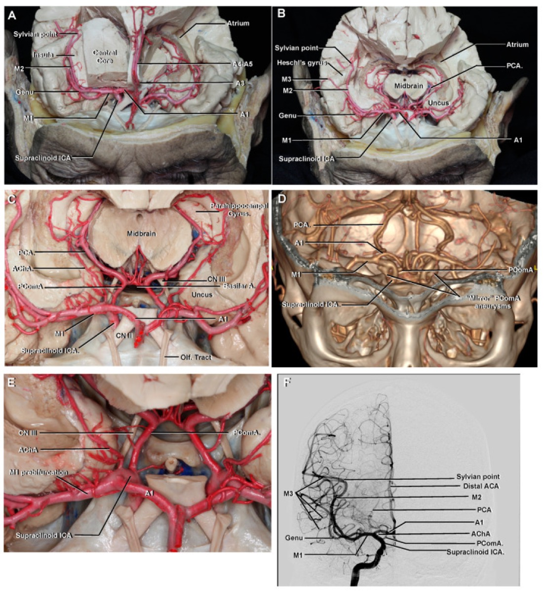

# Case Prep: MCA Aneurysm Clipping

---

## One-Liner
[Age]yo [M/F] with [ruptured/unruptured] middle cerebral artery bifurcation aneurysm presenting with [worst headache of life / incidental finding] planned for left/right pterional craniotomy for microsurgical clipping.

---

## Figures, Imaging & Video

> 🧭 **Operative approach:** [Pterional craniotomy](../approaches/pterional-craniotomy.md) — detailed corridor setup, step-by-step technique & figures

> External sources — operative figures/atlases are copyrighted (linked, not copied). See [media-sources.md](../../resources/media-sources.md) for licensing.

**Operative technique & approach**
- [The Neurosurgical Atlas](https://www.neurosurgicalatlas.com) — search *"middle cerebral artery aneurysm"* (operative illustrations + HD video)
- [neuroangio.org](https://neuroangio.org) — MCA / cerebral vascular anatomy & angioarchitecture

**Imaging**
- [Radiopaedia — MCA aneurysm](https://radiopaedia.org/search?q=middle%20cerebral%20artery%20aneurysm&scope=all)

**Open-access figures**
- [PubMed Central](https://www.ncbi.nlm.nih.gov/pmc/?term=middle+cerebral+artery+aneurysm+clipping)

**Anatomy (public domain)**

*Sobotta 1909 — public domain — via [Wikimedia Commons](https://commons.wikimedia.org/wiki/File:Sobo_1909_3_548.png).*

*Poblete T et al., Microsurgical Anatomy of the Anterior Circulation, Brain Sci 2021;11(4):519 — CC BY 4.0.*

*Poblete T et al., Microsurgical Anatomy of the Anterior Circulation, Brain Sci 2021;11(4):519 — CC BY 4.0.*

---

## History of Present Illness
- Chief complaint: Thunderclap headache (ruptured) / incidental finding on imaging (unruptured)
- Hunt-Hess grade (if SAH): I-V
- Fisher grade (if SAH): 1-4 (modified Fisher 0-4)
- WFNS grade (if SAH): I-V
- Aneurysm size: ___ mm (max diameter)
- Morphology: saccular / multilobed / fusiform
- Prior SAH episodes:
- PHASES score (if unruptured):

---

## Past Medical History
- [ ] Hypertension (most significant modifiable risk factor)
- [ ] Smoking history
- [ ] Family history of aneurysms / SAH
- [ ] Connective tissue disorder (Ehlers-Danlos, Marfan, ADPKD)
- [ ] Prior aneurysm treatment
- [ ] Anticoagulant/antiplatelet use
- [ ] Cocaine/stimulant use
- Allergies:
- Medications:

---

## Imaging Review
### CT Head (non-contrast)
- SAH distribution (perimesencephalic vs aneurysmal pattern)
- Intracerebral hemorrhage (temporal > frontal)
- Intraventricular hemorrhage
- Hydrocephalus
- Modified Fisher grade

### CTA Head
- Aneurysm location: MCA bifurcation / M1 / M2
- Aneurysm size and morphology
- Neck width and dome-to-neck ratio
- Relationship to M1, M2 superior trunk, M2 inferior trunk
- Incorporates branch vessels?
- Perforating arteries from M1
- Contralateral MCA anatomy
- Additional aneurysms (mirror, other locations)

### MRI/MRA (if applicable)
- DWI for acute infarct
- FLAIR for SAH dating
- MRA for flow dynamics

### DSA (Digital Subtraction Angiography)
- Aneurysm projection (superior, inferior, anterior, posterior)
- Dome orientation relative to M2 branches
- M1 length and course
- Lenticulostriate arteries
- Temporal branch origin
- Anterior temporal artery
- Cross-filling via AComA
- Vasospasm (if ruptured)

### Navigation
- [ ] Thin-cut CTA loaded to navigation
- [ ] Sylvian fissure and aneurysm localized
- [ ] Temporal lobe thickness assessed

---

## Labs
- [ ] CBC (Hgb > 8, Plt > 100K)
- [ ] BMP (Na target 135-145, avoid hyponatremia/cerebral salt wasting)
- [ ] Coagulation (PT/INR < 1.4, PTT normal)
- [ ] Type and crossmatch (2 units pRBC)
- [ ] Fibrinogen (> 200)

---

## Neurological Examination
### Mental Status
- GCS (if ruptured):
- Orientation:
- Language (dominant hemisphere MCA):
- Neglect (non-dominant hemisphere MCA):

### Cranial Nerves
- Visual fields (optic tract proximity):
- Pupillary exam:
- All cranial nerves:

### Motor
- Contralateral hemiparesis (if hemorrhage/vasospasm):
- Drift:

### Speech/Language (dominant hemisphere)
- Expressive (Broca — frontal operculum):
- Receptive (Wernicke — posterior temporal):

---

## Surgical Planning

### Diagnosis & Indication
- Working diagnosis: [Ruptured/Unruptured] MCA bifurcation aneurysm
- Surgical indication: [Ruptured SAH / Unruptured > 7mm or symptomatic / Young patient / Morphology (daughter sac, irregular)]
- Goals: Complete aneurysm obliteration with preservation of all branch vessels
- Endovascular alternative considered: MCA bifurcation aneurysms generally favor clipping due to wide necks and branch vessel incorporation. Discuss with endovascular team.

### Position
- **Patient position:** Supine
- **Head position:** Rotated 30-45 degrees contralateral (less rotation for more anterior aneurysms, more for posterior-projecting). Slight extension to allow frontal lobe to fall away from anterior skull base. Vertex tilted slightly toward floor.
- **Skull clamp:** Mayfield 3-pin fixation
  - Single pin: Contralateral frontal (above superior temporal line)
  - Double pins: Ipsilateral, behind the ear (mastoid region), one above and one below the pinna
- **Table:** Slight reverse Trendelenburg for venous drainage
- **Pressure points:** All padded (axillary roll NOT needed in supine)
- **Arms:** Tucked at sides

### Incision
- **Type:** Curvilinear (question-mark) incision
- **Landmarks:** Starts 1 cm anterior to the tragus at the zygomatic root, curves posterosuperiorly behind the hairline, then anteriorly to the midline (or just past midline)
- **Key considerations:**
  - Stay behind the superficial temporal artery (STA) — preserve for potential future bypass
  - Interfascial dissection to protect the frontotemporal branch of CN VII
  - Myocutaneous flap reflected anteroinferiorly

### Approach: Pterional Craniotomy
- **Burr holes:**
  1. Keyhole (McCarty point) — junction of frontal process of zygoma, superior temporal line, and frontozygomatic suture
  2. Posterior temporal (above root of zygoma, posterior to coronal suture)
  3. Optional: Frontal (behind hairline along superior temporal line)
- **Bone flap:** ~4x5 cm, flush with anterior skull base floor
- **Sphenoid wing:** Drill flush with anterior skull base to maximize exposure of sylvian fissure
- **Key anatomical landmarks:** Sphenoid ridge, pterion, sylvian fissure, anterior clinoid

### Microsurgical Steps
1. **Craniotomy and sphenoid wing drilling** — flat to anterior skull base
2. **Dural opening** — curvilinear based on sphenoid ridge/middle fossa
3. **Sylvian fissure split** — inside-out technique preferred
   - Identify sylvian veins — preserve superficial middle cerebral vein
   - Open arachnoid sharply along the fissure
   - Wide split to expose M1, bifurcation, and proximal M2s
4. **CSF drainage** — open carotid and chiasmatic cisterns for brain relaxation (or use lumbar drain)
5. **Identify M1 (proximal control)** — follow M1 distally toward bifurcation
6. **Identify lenticulostriate perforators** — arising from superior surface of M1; must be preserved
7. **Identify M2 branches** — superior and inferior trunks; identify early temporal branches
8. **Expose aneurysm neck** — circumferential dissection of neck
9. **Assess dome projection and adhesions** — if ruptured, dissect dome last
10. **Temporary clip application** — on M1 if needed for final dissection or in case of intraoperative rupture
11. **Permanent clip application:**
    - Select clip (straight, curved, fenestrated, or combination)
    - Clip blades parallel to M1/M2 axis to avoid branch compromise
    - Confirm: no branch vessel stenosis, complete neck obliteration
12. **Confirmation:**
    - Micro-Doppler of M1 and M2 branches
    - ICG videoangiography — aneurysm filling, branch patency
    - Papaverine if vasospasm
13. **Inspection of clip and surrounding anatomy**
14. **Hemostasis and closure**

### Critical Anatomy & Structures at Risk
1. **M2 superior and inferior trunks** — can be kinked or stenosed by clip
2. **Lenticulostriate arteries** — arise from M1, supply internal capsule and basal ganglia; devastating if injured
3. **Anterior temporal artery** — early M1 branch, supplies temporal lobe
4. **Superficial middle cerebral vein** — preserve during sylvian fissure split
5. **Frontotemporal branch of CN VII** — protect during scalp dissection (interfascial technique)
6. **Dominant hemisphere language areas** — Broca (posterior frontal), Wernicke (posterior temporal)
7. **M1 perforators to corona radiata/internal capsule**

### Equipment & Instrumentation
- [ ] Operating microscope
- [ ] Navigation (CTA-based)
- [ ] Micro-Doppler
- [ ] ICG (indocyanine green) — for videoangiography
- [ ] High-speed drill (for sphenoid wing)
- [ ] Microsurgical instrument set
- [ ] Aneurysm clips — multiple types and sizes
  - Straight clips (various lengths)
  - Curved clips
  - Fenestrated clips (in case M2 branch incorporated)
  - Temporary clips (multiple)
  - Clip appliers (straight and bayonet)
- [ ] Bipolar forceps (fine tip)
- [ ] Papaverine (topical for vasospasm)
- [ ] Hemostatic agents (Surgicel, Gelfoam)
- [ ] Cottonoid patties (various sizes)

### Monitoring
- [ ] SSEPs
- [ ] MEPs (transcranial)
- [ ] EEG (for burst suppression if temporary clipping prolonged)
- [ ] Consider: direct cortical stimulation (if near eloquent cortex)

### Anesthesia Considerations
- [ ] Arterial line (pre-induction)
- [ ] Two large-bore IVs
- [ ] Foley catheter
- [ ] Lumbar drain (consider for ruptured cases — brain relaxation)
- [ ] Mannitol 1 g/kg available (or 23.4% saline)
- [ ] Dexamethasone 10 mg IV
- [ ] Anticonvulsant (levetiracetam 1000 mg IV)
- [ ] Cefazolin 2g IV
- [ ] Burst suppression capability (propofol/etomidate) for temporary clipping > 5 min
- [ ] Induced mild hypertension capability
- [ ] Blood products in room (2 units pRBC)
- [ ] Avoid nitrous oxide (increases ICP)
- [ ] Target: SBP 100-140 (ruptured, pre-clipping), allow permissive hypertension post-clipping if needed

### Potential Complications & Contingencies
1. **Intraoperative rupture** — temporary clip on M1, suction, complete neck dissection under proximal control, definitive clipping
2. **Branch vessel occlusion by clip** — ICG/micro-Doppler check, reposition clip, consider fenestrated clip
3. **Vasospasm** (ruptured) — papaverine irrigation, induced hypertension, consider nimodipine
4. **Retraction injury** — minimize retraction, use CSF drainage for relaxation
5. **Incomplete clipping** — intraoperative angiography or ICG confirmation; consider clip revision
6. **Perforator injury** — meticulous dissection; if compromised, may cause contralateral hemiparesis

---

## Operative Note Template

**Preoperative Diagnosis:** [Ruptured/Unruptured] left/right MCA bifurcation aneurysm

**Postoperative Diagnosis:** Same

**Procedure:** Left/Right pterional craniotomy for microsurgical clipping of MCA bifurcation aneurysm

**Surgeon:**
**Assistant:**
**Anesthesia:** General endotracheal anesthesia

**EBL:**
**Fluids:**
**Specimens:** None
**Drains:** [Subgaleal drain / None]
**Complications:** None
**Implants:** [Aneurysm clip type/size], [titanium plates and screws for bone flap fixation]

**Indications:**
The patient is a [age]yo [M/F] who presented with [thunderclap headache and was found to have SAH (Hunt-Hess grade ___, Fisher grade ___) with a ___ mm left/right MCA bifurcation aneurysm on CTA/DSA / an incidentally discovered ___ mm left/right MCA bifurcation aneurysm]. After multidisciplinary discussion and counseling regarding risks, benefits, and alternatives including endovascular treatment and observation, the patient elected to proceed with microsurgical clipping.

**Description of Procedure:**
After informed consent was verified and the surgical site was marked, the patient was brought to the operating room and placed supine on the operating table. General endotracheal anesthesia was induced. Neurophysiological monitoring was established with SSEPs, MEPs, and EEG, and stable baseline signals were obtained. An arterial line, Foley catheter, and [lumbar drain] were placed.

The patient was positioned supine with the head rotated [30-45] degrees to the [contralateral] side, slightly extended, and the vertex tilted toward the floor. The head was secured in a Mayfield skull clamp with the single pin placed in the [contralateral] frontal region and the double pins placed in the [ipsilateral] mastoid/retroauricular region. All pressure points were padded. [Stereotactic navigation was registered with CTA dataset, and accuracy was confirmed to be within ___ mm.] A time-out was performed.

The [left/right] frontotemporal region was prepped and draped in the standard sterile fashion. Preoperative cefazolin [2g] and dexamethasone [10mg] were administered. [Mannitol ___ g was infused.]

**Incision:** A curvilinear skin incision was made beginning 1 cm anterior to the tragus at the zygomatic root, curving posterosuperiorly behind the hairline. The scalp flap was reflected anteroinferiorly. An interfascial dissection was performed to protect the frontotemporal branch of the facial nerve. The temporalis muscle was incised along its superior temporal line insertion and reflected anteroinferiorly, exposing the pterion and surrounding calvarium.

**Craniotomy:** A [keyhole] burr hole was made at the pterion (McCarty point). A [second burr hole] was placed [posteriorly along the superior temporal line]. A craniotomy was performed with the craniotome, and the bone flap was elevated. The sphenoid wing was drilled flush with the anterior skull base floor using a high-speed drill to maximize exposure of the proximal sylvian fissure. Epidural hemostasis was achieved with bipolar cautery and bone wax.

**Dural opening:** The dura was opened in a curvilinear fashion based on the sphenoid ridge and reflected anteriorly. Dural tacking sutures were placed.

**Microsurgical procedure:** Under the operating microscope, the sylvian fissure was identified and split using an inside-out technique. The superficial middle cerebral veins were identified and preserved. The arachnoid was opened sharply, progressively exposing the M1 segment of the MCA. The [carotid and chiasmatic cisterns / opticocarotid cistern] were opened to drain CSF and relax the brain.

The M1 segment was followed distally toward the bifurcation. The lenticulostriate arteries were identified arising from the superior surface of M1 and carefully preserved. The M2 superior and inferior trunks were identified and dissected free. The aneurysm neck was then identified at the MCA bifurcation. [The dome was adherent to ___ and was carefully dissected free.]

Proximal control was established on M1. [A temporary clip was placed on M1 for ___ minutes to facilitate final dissection of the aneurysm neck.] The aneurysm neck was circumferentially dissected. A [straight/curved/fenestrated] ___ mm clip was applied across the aneurysm neck, with the blades oriented parallel to the axis of the M2 branches.

**Confirmation:** Micro-Doppler confirmed flow in both M2 branches and the M1 segment. ICG videoangiography demonstrated complete obliteration of the aneurysm dome with patent flow through all branch vessels including the lenticulostriate arteries. [Papaverine was applied to the vessels to relieve mild vasospasm.]

**Hemostasis:** Meticulous hemostasis was achieved with bipolar cautery and Surgicel. The surgical field was copiously irrigated with warm saline and inspected under the microscope.

**Closure:** The dura was closed in a watertight fashion with 4-0 Nurolon running suture. [A dural sealant (DuraSeal) was applied.] The bone flap was replaced and secured with [titanium plates and screws / cranial fixation system]. The temporalis muscle was reapproximated with 2-0 Vicryl sutures. The galea was closed with 3-0 Vicryl interrupted sutures. The skin was closed with staples. A sterile dressing was applied. [A subgaleal drain was placed prior to closure.]

**Postoperative:** The patient was awakened from anesthesia, extubated, and found to be following commands with [intact motor function / baseline neurological status]. Neuromonitoring signals remained stable throughout the case. The patient was transferred to the neurosurgical ICU in stable condition.

---

## Postoperative Plan
- [ ] Neurosurgical ICU admission
- [ ] Neuro checks q1h x 24h
- [ ] HOB 30 degrees
- [ ] Postop CT head within 6 hours
- [ ] SBP goal: [< 160 if ruptured / normal if unruptured]
- [ ] If SAH: Nimodipine 60 mg PO q4h x 21 days
- [ ] If SAH: Daily TCDs for vasospasm monitoring (days 3-14)
- [ ] DVT prophylaxis: SCDs immediately, heparin SQ starting POD1
- [ ] Dexamethasone taper
- [ ] Levetiracetam 500 mg BID x 7 days (ruptured) or per protocol
- [ ] Pain management: acetaminophen, avoid NSAIDs (first 24h)
- [ ] Diet: advance as tolerated
- [ ] CTA or DSA to confirm clip position (before discharge or at follow-up)
- [ ] Follow-up: Clinic 2-4 weeks, DSA at 6-12 months
