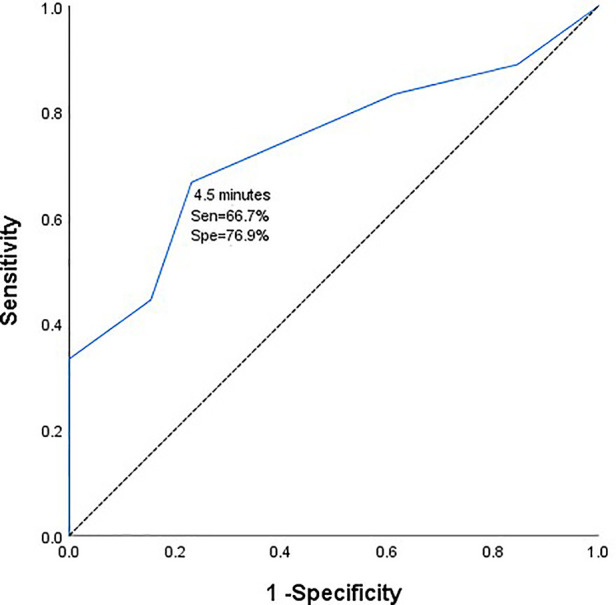
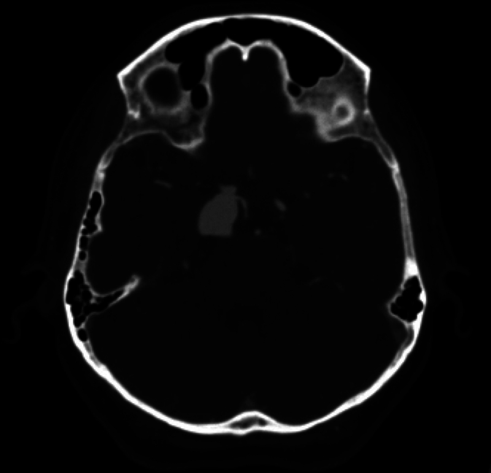
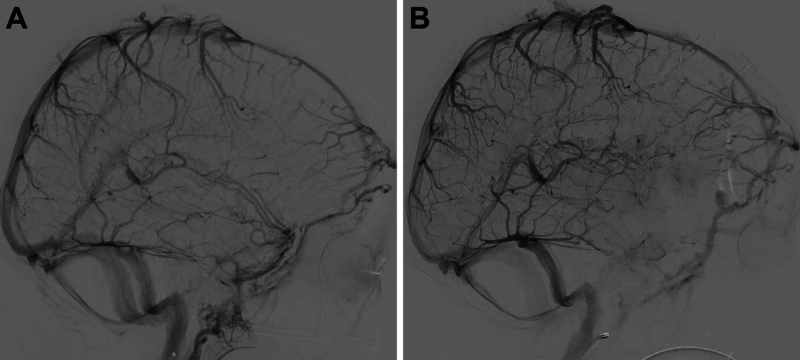
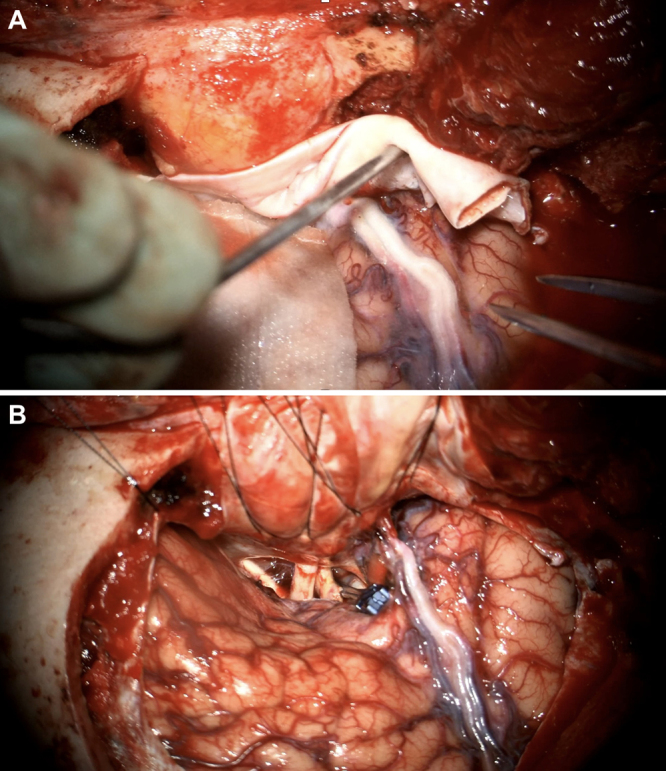
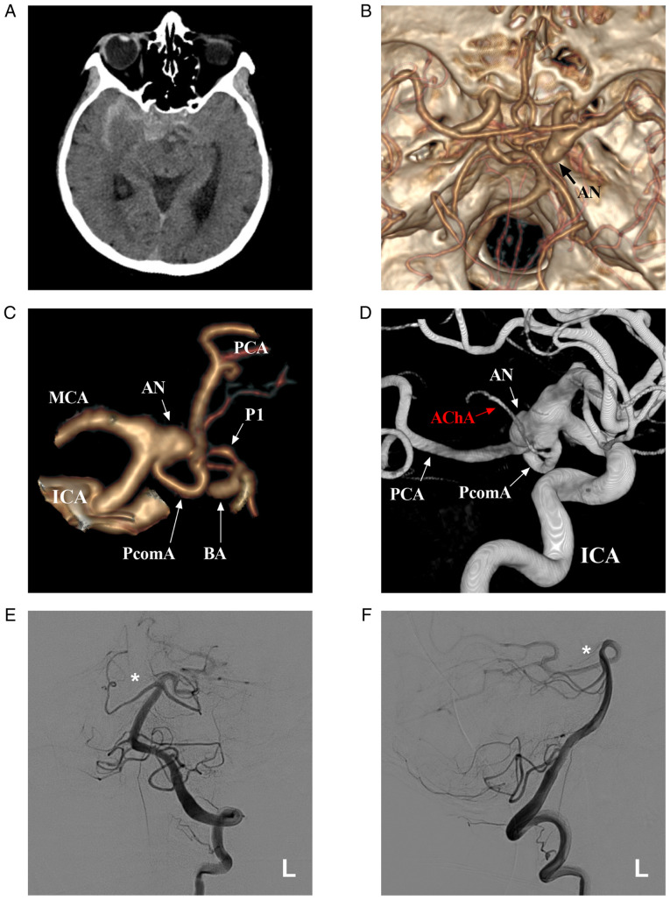
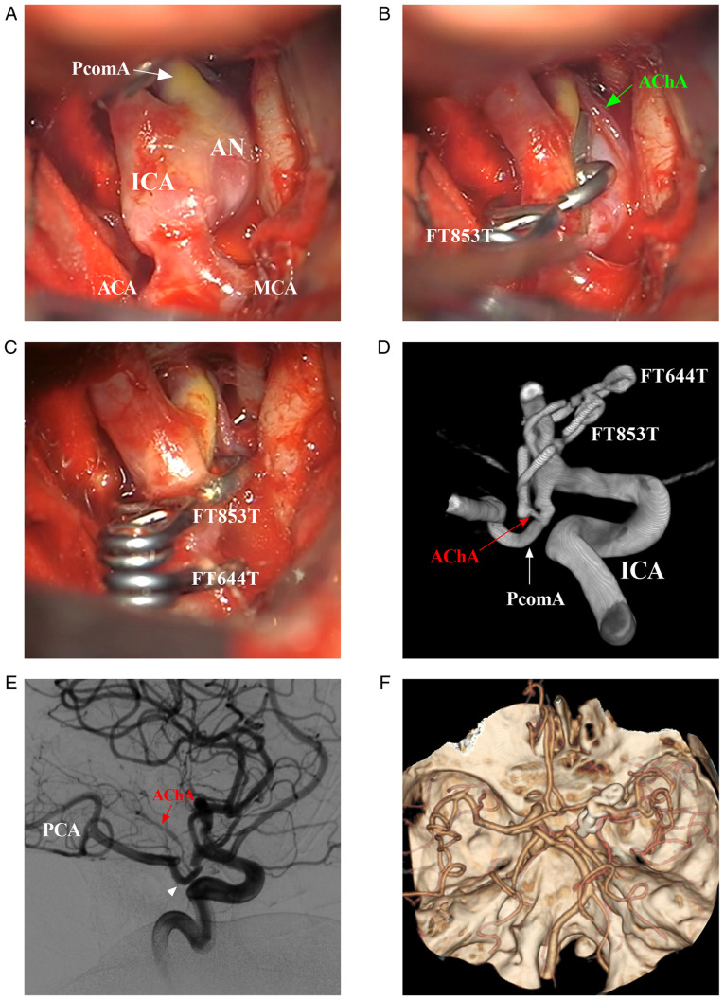
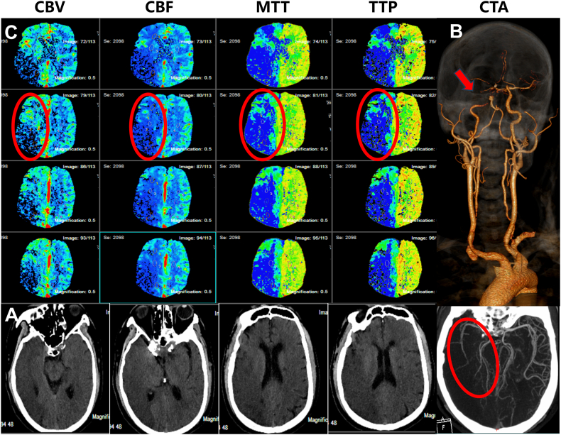
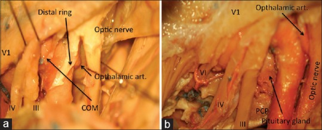
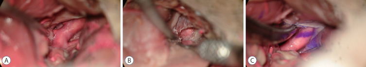
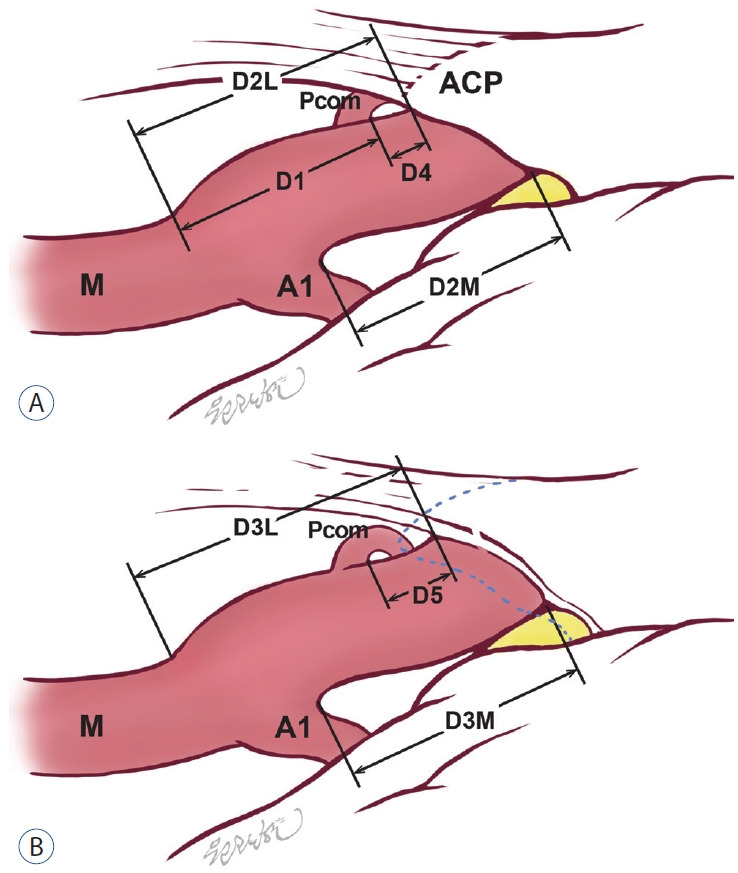

# Case Prep: Posterior Communicating Artery (PComA) Aneurysm Clipping

<!-- BEGIN CASE SNAPSHOT -->

## Case / Approach Snapshot

- **Anatomy at risk:** parent vessels, perforators, branch ostia, collateral circulation, venous drainage, cranial nerves, cisterns, and eloquent territories threatened by temporary occlusion or retraction.
- **Operative steps:** plan proximal and distal control, expose the corridor, obtain cerebrospinal fluid/brain relaxation, identify parent vessels before the lesion, treat the lesion/device target, and confirm flow and hemostasis before closure; use the detailed operative sequence and approach notes below as the step-by-step source.
- **Rescue plans:** intraoperative rupture, thromboembolism, branch or perforator compromise, vasospasm, inadequate proximal control, bypass or reconstructive options, anticoagulation/reversal, and postoperative surveillance.
- **Figures:** review [Figures, Imaging & Video](#figures-imaging--video) and the [Curated Image Set](#curated-image-set); embedded local figures should remain open-access, public-domain, or otherwise reusable with attribution.
- **Papers:** review [High-Yield Literature](#high-yield-literature) for seminal sources, modern reviews, and outcome data specific to this page.

<!-- END CASE SNAPSHOT -->

## One-Liner
[Age]yo [M/F] with [ruptured/unruptured] [left/right] posterior communicating artery aneurysm presenting with [SAH / CN III palsy / incidental] planned for [left/right] pterional craniotomy for microsurgical clipping.

---

## Figures, Imaging & Video

**🎥 Operative videos & resources**
- **Atlas / approach:** [Pterional craniotomy chapter](https://www.neurosurgicalatlas.com/volumes/cranial-approaches/pterional-craniotomy) — sylvian split, opticocarotid triangle, proximal ICA control
- **Video searches:** [PComA aneurysm clipping on YouTube](https://www.youtube.com/results?search_query=posterior+communicating+artery+aneurysm+clipping) · [PComA aneurysm surgery on Neurosurgical Atlas](https://www.neurosurgicalatlas.com)
- **Angio anatomy:** [neuroangio.org](https://neuroangio.org) — ICA/PComA/anterior choroidal relationships and fetal PCA variants

> 🧭 **Operative approach:** [Pterional craniotomy](../approaches/pterional-craniotomy.md) — detailed corridor setup, step-by-step technique & figures

> Copyrighted operative figures/videos are linked, not copied. Embedded figures below are public-domain or CC-BY; see [media-sources.md](../../resources/media-sources.md) and [CREDITS.md](../../figures/CREDITS.md).

---

<!-- BEGIN CURATED LITERATURE -->

## High-Yield Literature

- **Oculomotor nerve palsy due to posterior communicating artery aneurysm: Clipping vs coiling** — Nikova AS. Neuro-Chirurgie 2022. [PubMed](https://pubmed.ncbi.nlm.nih.gov/33845117/)
- **Predictive value of neurophysiological monitoring during posterior communicating artery aneurysm clipping for postoperative neurological deficits** — Tang F. Frontiers in surgery 2022. [PubMed](https://pubmed.ncbi.nlm.nih.gov/36684148/)
- **Preoperative predictive value of the necessity for anterior clinoidectomy in posterior communicating artery aneurysm clipping** — Park SK. Neurosurgery 2009. [PubMed](https://pubmed.ncbi.nlm.nih.gov/19625906/)
- **Anatomic Study of Posterior Communicating Artery in Computed Tomographic Image** — Cheng Y. The Journal of craniofacial surgery 2015. [PubMed](https://pubmed.ncbi.nlm.nih.gov/26594972/)
- **Simultaneous posterior communicating artery aneurysm clipping and selective amygdalohippocampectomy via direct lateral access through the mesial temporal lobe to the basal cisterns** — Abla AA. Journal of clinical neuroscience : official journal of the Neurosurgical Society of Australasia 2011. [PubMed](https://pubmed.ncbi.nlm.nih.gov/21435881/)
- **Transpalpebral Approach "Eyelid Incision" for Surgical Treatment of Intracerebral Aneurysms: Lessons Learned During a 10-Year Experience** — Mao G. Operative neurosurgery (Hagerstown, Md.) 2020. [PubMed](https://pubmed.ncbi.nlm.nih.gov/31414139/)
- **Augmented reality in the surgery of cerebral aneurysms: a technical report** — Cabrilo I. Neurosurgery 2014. [PubMed](https://pubmed.ncbi.nlm.nih.gov/24594927/)
- **Retrograde thrombosis of the superficial sylvian vein following liquid adhesive hemostat use during craniotomy: illustrative case** — Hovis GEA. Journal of neurosurgery. Case lessons 2025. [PubMed](https://pubmed.ncbi.nlm.nih.gov/39832312/)
- **Urgent cerebral revascularization bypass surgery for iatrogenic skull base internal carotid artery injury** — Rangel-Castilla L. Neurosurgery 2014. [PubMed](https://pubmed.ncbi.nlm.nih.gov/25181433/)
- **Treatments for unruptured intracranial aneurysms** — Pontes FGB. The Cochrane database of systematic reviews 2021. [PubMed](https://pubmed.ncbi.nlm.nih.gov/33971026/)

<!-- END CURATED LITERATURE -->

<!-- BEGIN CURATED IMAGE SET -->

## Curated Image Set

Open-access figures are embedded from PubMed Central articles and kept unique to this guide.

*Figure 1. Receiver operating characteristic curve of duration of intraoperative temporary clipping and electrophysiological monitoring and warning. Source: [Predictive value of neurophysiological monitoring during posterior communicating artery aneurysm clipping for postoperative neurological deficits](https://pmc.ncbi.nlm.nih.gov/articles/PMC9852611/) — Frontiers in Surgery 2023; CC BY.*

*FIG. 1.. Preoperative CTA scan demonstrating a 2.0 × 1.5 × 1.5–cm, unruptured, right PComA aneurysm. Source: [Retrograde thrombosis of the superficial sylvian vein following liquid adhesive hemostat use during craniotomy: illustrative case](https://pmc.ncbi.nlm.nih.gov/articles/PMC11744693/) — Journal of Neurosurgery: Case Lessons 2025; CC BY-NC-ND.*

*FIG. 2.. A:Preoperative diagnostic cerebral angiogram demonstrating right PComA aneurysm. B:Postoperative cerebral angiogram demonstrating impeded flow through the sylvian vein into the deep... Source: [Retrograde thrombosis of the superficial sylvian vein following liquid adhesive hemostat use during craniotomy: illustrative case](https://pmc.ncbi.nlm.nih.gov/articles/PMC11744693/) — Journal of Neurosurgery: Case Lessons 2025; CC BY-NC-ND.*

*FIG. 3.. A:An intact, pale cerebral vein is visualized on dural opening. B:A straight, 25-mm permanent aneurysm clip was placed across the right PComA aneurysm. Flow through the parent vessel and... Source: [Retrograde thrombosis of the superficial sylvian vein following liquid adhesive hemostat use during craniotomy: illustrative case](https://pmc.ncbi.nlm.nih.gov/articles/PMC11744693/) — Journal of Neurosurgery: Case Lessons 2025; CC BY-NC-ND.*

*Figure 1. Preoperative images. (A) Brain CT scan illustrating the SAH in the suprasellar cistern and right lateral fissure cistern. (B) CTA illustrating the right PcomA aneurysm (arrow). (C) CTA... Source: [Common origin of the anterior choroidal artery and posterior communicating artery with a concomitant aneurysm at the internal carotid artery-posterior communicating artery junction: A case report](https://pmc.ncbi.nlm.nih.gov/articles/PMC9829080/) — Medicine International 2021; CC BY-NC-ND.*

*Figure 2. Intraoperative and post-operative follow-up images. (A) Intraoperative images showing the main arterial structures around the PcomA aneurysm. (B) First, the aneurysm was clipped using an... Source: [Common origin of the anterior choroidal artery and posterior communicating artery with a concomitant aneurysm at the internal carotid artery-posterior communicating artery junction: A case report](https://pmc.ncbi.nlm.nih.gov/articles/PMC9829080/) — Medicine International 2021; CC BY-NC-ND.*

*Fig. 1. Preoperative one-stop CT examination. A: No hemorrhage was seen in the head CT scan. B: Head and neck CTA shows severe stenosis of the siphon segment of the right ICA (indicated by the... Source: [Endovascular treatment without postoperative decompressive craniectomy in an acute stroke patient with very large ischemic infarct core: A case report and literature review](https://pmc.ncbi.nlm.nih.gov/articles/PMC11176839/) — Heliyon 2024; CC BY.*

*Figure 3. (a) The proximal and distal dural rings, (b) a combination of extradural and subdural dissections showing the approach to sella (PCP = Posterior clinoid process) Source: [Extradural anterior clinoidectomy: Technical nuances from a learner's perspective](https://pmc.ncbi.nlm.nih.gov/articles/PMC5409364/) — Asian Journal of Neurosurgery 2017; CC BY-NC-SA.*

*Fig. 1.. Microscopic view of (A) intradural surgical field before extradural anterior clinoidectomy, (B) extradural surgical field after extradural anterior clinoidectomy, and (C) intradural... Source: [The Usefulness of Extradural Anterior Clinoidectomy for Low-Lying Posterior Communicating Artery Aneurysms : A Cadaveric Study](https://pmc.ncbi.nlm.nih.gov/articles/PMC11220413/) — Journal of Korean Neurosurgical Society 2024; CC BY-NC.*

*Fig. 2.. Comparative illustration of the intradural surgical field (A) before and (B) after the extradural anterior clinoidectomy. The blue dotted line is the margin of the anterior clinoid... Source: [The Usefulness of Extradural Anterior Clinoidectomy for Low-Lying Posterior Communicating Artery Aneurysms : A Cadaveric Study](https://pmc.ncbi.nlm.nih.gov/articles/PMC11220413/) — Journal of Korean Neurosurgical Society 2024; CC BY-NC.*

<!-- END CURATED IMAGE SET -->

---

## History of Present Illness
- Chief complaint: Thunderclap headache / **ptosis and diplopia (CN III palsy)** / incidental
- **CN III palsy is a classic warning sign** — PComA aneurysm compresses the oculomotor nerve (pupil-involving third nerve palsy = surgical emergency even if unruptured)
- Hunt-Hess / Fisher / WFNS grade (if SAH):
- Aneurysm size and projection (posterolateral toward CN III):
- Prior SAH:

---

## Past Medical History
- Hypertension, smoking, family history of aneurysm
- Anticoagulation/antiplatelet
- Allergies / Medications:

---

## Imaging Review
### CTA / DSA
- **Location:** ICA–PComA junction (posterolateral wall of supraclinoid ICA)
- **Dome projection:** Posterolateral/inferolateral (toward CN III and tentorial edge)
- **Neck:** Relationship to PComA origin and anterior choroidal artery
- **PComA:** Fetal PCA configuration? (PComA larger than P1 — PComA MUST be preserved)
- **Anterior choroidal artery:** Origin just distal to PComA — critical to preserve
- **ICA segments:** Clinoidal, ophthalmic, communicating
- **Relationship to anterior clinoid process** (may need clinoidectomy for proximal control)

### CT Head
- SAH pattern, temporal/basal cisterns

### Navigation
- CTA loaded, ICA–PComA–AchA complex mapped

---

## Labs
- CBC, BMP, Coags, Type and crossmatch (2 units)

---

## Neurological Examination
- **CN III:** Ptosis, pupil (dilated, fixed = pupil-involving), EOM (down-and-out)
- GCS, visual fields, motor exam
- Anterior choroidal syndrome screen (contralateral hemiparesis, hemianesthesia, hemianopia)

---

## Surgical Planning

### Case Logistics, OR Needs & Orders
- **OR setup:** microscope, clip tray with temporary/permanent clips, ICG/Doppler, vascular instruments, blood available, DSA/CTA images displayed, and bypass/parent-vessel rescue plan for complex aneurysms.
- **Special needs:** arterial line, BP target before and after occlusion, nimodipine/EVD/SAH pathway if ruptured, seizure prophylaxis by lesion/location, dexamethasone only when edema risk warrants, and neuromonitoring for deep/eloquent corridors.
- **Immediate postop orders:** ICU neuro checks, SBP parameters, CTA/DSA or CT timing, EVD/vasospasm surveillance for SAH, antiepileptic plan, DVT timing, and focused motor/language/cranial-nerve exams.

### Diagnosis & Indication
- Working diagnosis: [Ruptured/Unruptured] PComA aneurysm
- Indication: SAH / CN III palsy (compressive, may recover with clipping) / size / morphology
- Goals: Aneurysm obliteration, preserve PComA and anterior choroidal artery, decompress CN III

### Position
- Supine, head rotated 20-30 degrees contralateral, extended, vertex down
- Mayfield 3-pin (single pin contralateral frontal, double pins ipsilateral retroauricular)

### Approach: Pterional Craniotomy
- Standard pterional, flush sphenoid wing
- **Anterior clinoidectomy** may be needed for proximal control (intradural or extradural) if low-lying or proximal aneurysm
- Proximal control on the supraclinoid ICA (or cervical carotid exposure as backup for very proximal lesions)

### Microsurgical Steps
1. Pterional craniotomy, sphenoid wing drilled flush
2. Dural opening, proximal sylvian fissure split
3. Open carotid and chiasmatic cisterns — CSF drainage
4. Identify ICA, follow to the PComA origin (posterolateral wall)
5. Identify PComA and **anterior choroidal artery** (just distal to PComA)
6. Establish proximal control (clinoidal/cervical ICA)
7. Dissect aneurysm neck — dome usually projects posterolaterally toward CN III
8. **Preserve PComA** (especially if fetal PCA) and **anterior choroidal artery**
9. Clip application parallel to ICA, sparing PComA and AchA origins
10. Confirm: micro-Doppler, ICG — ICA, PComA, AchA patent; aneurysm obliterated

### Critical Anatomy & Structures at Risk
1. **Anterior choroidal artery** — supplies posterior limb internal capsule, optic tract; injury → devastating AchA syndrome (hemiplegia, hemianesthesia, hemianopia)
2. **PComA** — especially fetal configuration; supplies PCA territory
3. **CN III (oculomotor)** — beneath aneurysm dome; decompression goal
4. **Perforators from PComA** (premamillary/anterior thalamoperforating artery)
5. **ICA** — parent vessel

### Equipment
- Microscope, navigation, micro-Doppler, ICG
- Aneurysm clips (straight, curved, fenestrated), temporary clips
- High-speed drill (for clinoidectomy)
- Microsurgical instruments

### Monitoring
- SSEPs, MEPs, EEG (burst suppression for temporary clipping)

### Anesthesia
- Standard aneurysm protocol; burst suppression available; 2 units crossmatched

### Potential Complications
1. Anterior choroidal artery occlusion → AchA syndrome
2. PComA occlusion → PCA territory infarct (esp. fetal)
3. Intraoperative rupture → proximal ICA temporary clip
4. CN III palsy may persist (compressive); decompression improves recovery odds
5. Vasospasm (ruptured)

---

## Operative Note Template
**Preoperative Diagnosis:** [Ruptured/Unruptured] [left/right] PComA aneurysm
**Procedure:** [Left/Right] pterional craniotomy for microsurgical clipping of PComA aneurysm
[Follow MCA aneurysm template; emphasize ICA exposure, PComA and anterior choroidal artery identification/preservation, clinoidectomy if performed, CN III decompression, ICG confirmation of AchA/PComA patency]

---

## Postoperative Plan
- NSICU, neuro checks q1h, postop CT, CTA/DSA to confirm clip
- If SAH: nimodipine, TCDs, Na monitoring
- **CN III recovery tracking** — document pupil and EOM; recovery over weeks-months
- Anterior choroidal syndrome screening
- Standard aneurysm post-op care

<!-- BEGIN COMMON PIMP QUESTIONS -->

## Common Pimp Questions

Use these to pressure-test preparation for **Posterior Communicating Artery (PComA) Aneurysm Clipping**:

1. What is the proximal-control plan before the lesion is manipulated?
2. Which branch, perforator, or venous structure is most likely to be injured in this exposure?
3. What are the intraoperative rupture steps, including temporary clip, suction, BP, and backup clip strategy?
4. What confirms treatment success: ICG, Doppler, puncture/deflation, DSA, or postoperative CTA?
5. What postoperative BP, vasospasm, antiplatelet, or anticoagulation issue changes the orders tonight?

<!-- END COMMON PIMP QUESTIONS -->

<!-- BEGIN ATTENDING PREFERENCE VARIABLES -->

## Attending Preference Variables

Items that commonly vary by surgeon or institution:

- **Preferred approach side, sylvian split style, and cisternal-opening sequence:** [attending-specific]
- **Temporary clip threshold, burst-suppression preference, and BP during occlusion:** [attending-specific]
- **Clip manufacturer/shape sequence and whether Doppler, ICG, puncture, or intraop DSA is routine:** [attending-specific]
- **Antiplatelet/anticoagulation reversal and restart timing:** [attending-specific]

<!-- END ATTENDING PREFERENCE VARIABLES -->
