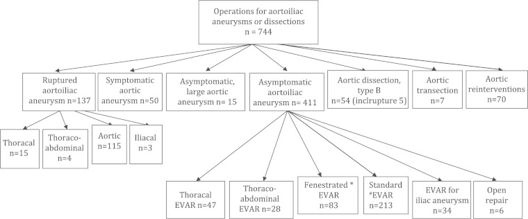
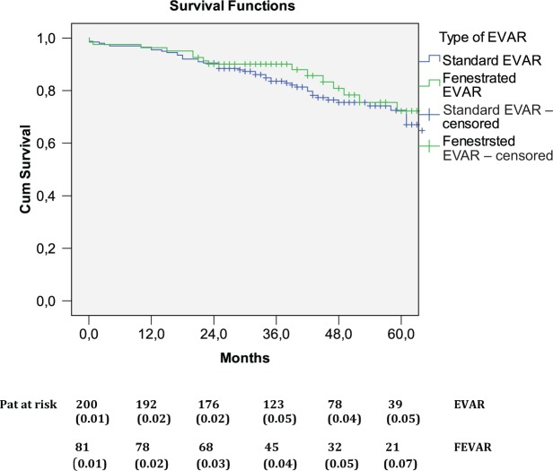
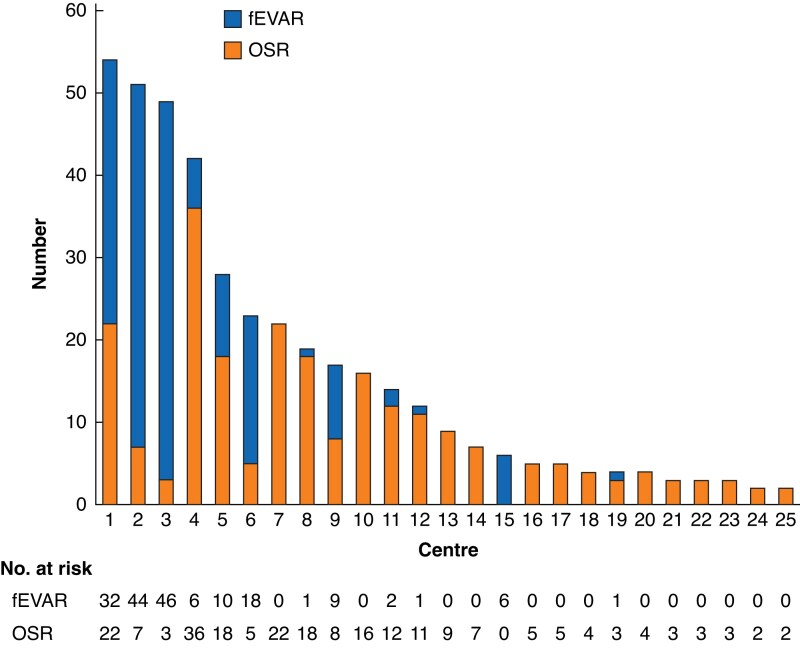
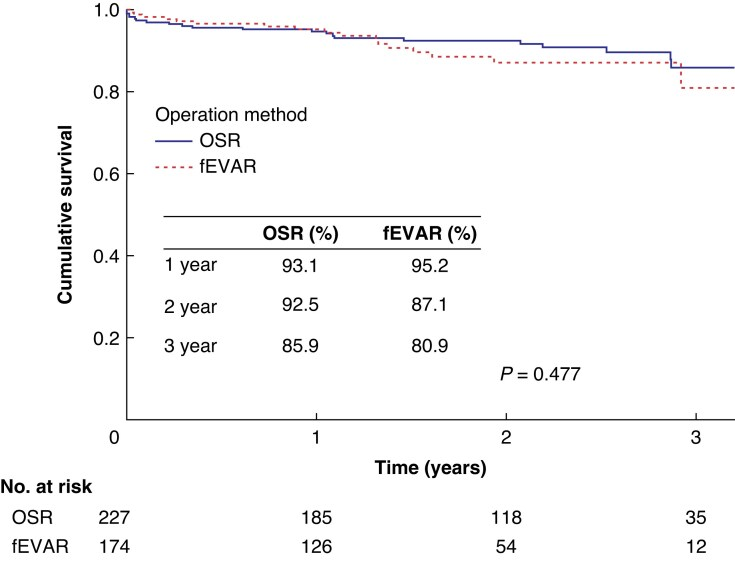
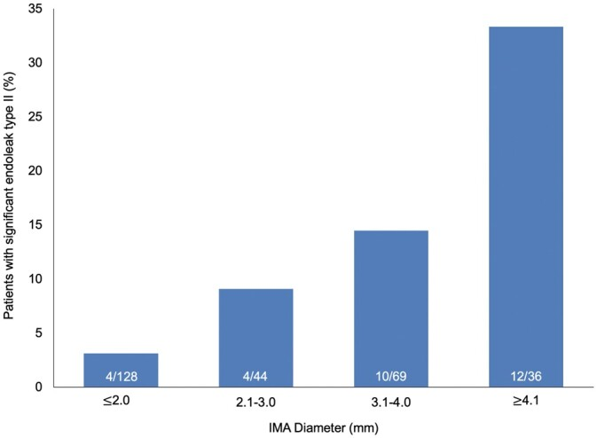
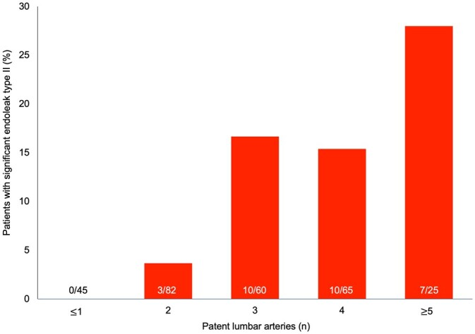
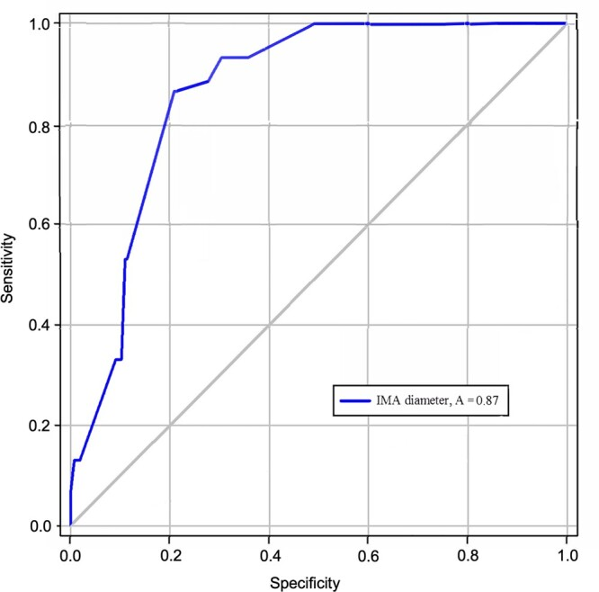
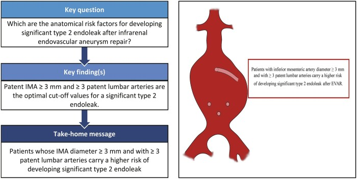
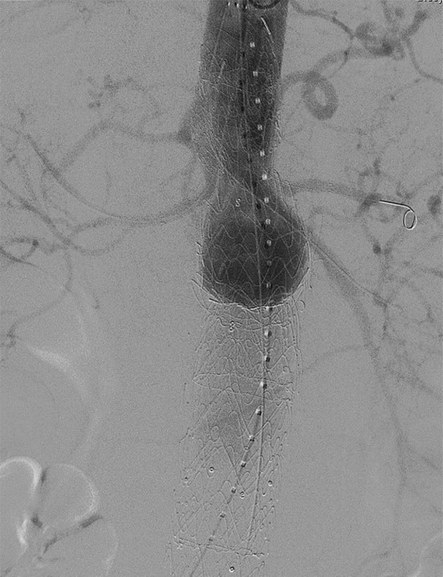
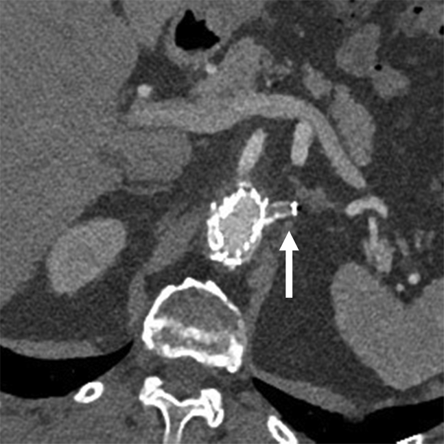

# Case Prep: Endovascular Aneurysm Treatment (Coiling / Stent-Assisted / Flow Diversion)

---

<!-- BEGIN CASE SNAPSHOT -->

## Case / Approach Snapshot

- **Anatomy at risk:** access vessels, arch/cervical anatomy, parent artery branches, perforators, collateral pathways, venous drainage when relevant, and device landing zones.
- **Operative steps:** confirm indication and imaging, obtain access safely, navigate with roadmap control, deploy the planned device or embolic strategy, document final angiography, and define antiplatelet/anticoagulation and postprocedure monitoring; use the detailed operative sequence and approach notes below as the step-by-step source.
- **Rescue plans:** access complication, dissection/perforation, thromboembolism, device malposition or migration, hemorrhage, vasospasm, antiplatelet failure, and conversion to open or staged management.
- **Figures:** review [Figures, Imaging & Video](#figures-imaging--video) and the [Curated Image Set](#curated-image-set); embedded local figures should remain open-access, public-domain, or otherwise reusable with attribution.
- **Papers:** review [High-Yield Literature](#high-yield-literature) for seminal sources, modern reviews, and outcome data specific to this page.
- **Textbook cross-checks:** use [Textbook Cross-Checks](#textbook-cross-checks) and the [Source Crosswalk](../../resources/source-crosswalk.md) to cite copyrighted textbooks/atlases while summarizing in original words.

<!-- END CASE SNAPSHOT -->

## One-Liner
[Age]yo [M/F] with a [ruptured/unruptured] [location] [saccular/wide-neck/fusiform] cerebral aneurysm planned for endovascular [primary coiling / balloon- or stent-assisted coiling / flow diverter].

---

## Figures, Imaging & Video

**🎥 Operative video** — [search operative video on YouTube ▸](https://www.youtube.com/results?search_query=cerebral+aneurysm+coiling+surgery) · [The Neurosurgical Atlas ▸](https://www.neurosurgicalatlas.com)

[Neurosurgical Atlas](https://www.neurosurgicalatlas.com) · [neuroangio.org](https://neuroangio.org) · [Radiopaedia](https://radiopaedia.org/search?q=cerebral%20aneurysm%20coiling&scope=all) · [PubMed Central](https://www.ncbi.nlm.nih.gov/pmc/?term=endovascular+coiling+flow+diversion+aneurysm) — figures © linked; see [media-sources.md](../../resources/media-sources.md)

---

<!-- BEGIN TEXTBOOK CROSS-CHECKS -->

## Textbook Cross-Checks

- **Vascular anatomy:** Rhoton Cranial Anatomy; Decision Making in Neurovascular Disease; Practical Neuroangiography — confirm parent-vessel anatomy, perforators, venous drainage, collateral pathways, and endovascular access/rescue options.
- **Operative/endovascular strategy:** Youmans and Winn; Schmidek and Sweet; Greenberg — summarize proximal control, exposure/device strategy, temporary-control options, and bailout plans in your own words.
- **Complication rescue:** Greenberg; Decision Making in Neurovascular Disease — review ischemia, hemorrhage, thromboembolism, rupture, vasospasm, and postoperative surveillance algorithms.
- **Copyright-safe use:** cite these sources as private cross-checks, then write the guide content in original words; do not re-host textbook pages, figures, tables, or board-review card material. See [Source Crosswalk & Copyright-Safe Use](../../resources/source-crosswalk.md).

<!-- END TEXTBOOK CROSS-CHECKS -->

<!-- BEGIN CURATED LITERATURE -->

## High-Yield Literature

- **Which Endovascular Aneurysm Repair Graft Should I Have?** — Narayanan A. European journal of vascular and endovascular surgery : the official journal of the European Society for Vascular Surgery 2024. [PubMed](https://pubmed.ncbi.nlm.nih.gov/38522568/)
- **The Nellix endovascular aneurysm sealing system: current perspectives** — Choo XY. Medical devices (Auckland, N.Z.) 2019. [PubMed](https://pubmed.ncbi.nlm.nih.gov/30858738/)
- **Percutaneous Endovascular Aneurysm Repair: Current Status and Future Trends** — Watts MM. Seminars in interventional radiology 2020. [PubMed](https://pubmed.ncbi.nlm.nih.gov/33041479/)
- **Laparoscopy versus endovascular aneurysm repair for abdominal aortic aneurysm: A systematic review** — Duric B. Catheterization and cardiovascular interventions : official journal of the Society for Cardiac Angiography & Interventions 2024. [PubMed](https://pubmed.ncbi.nlm.nih.gov/38924318/)
- **Intra-operative computed tomography in endovascular aneurysm repair** — Hansrani V. VASA. Zeitschrift fur Gefasskrankheiten 2020. [PubMed](https://pubmed.ncbi.nlm.nih.gov/31904305/)
- **Surveillance Imaging following Endovascular Aneurysm Repair: State of the Art** — Kim SH. Seminars in interventional radiology 2020. [PubMed](https://pubmed.ncbi.nlm.nih.gov/33041481/)
- **Complications of thoracic endovascular aneurysm repair (TEVAR): A pictorial review** — Awiwi MO. Current problems in diagnostic radiology 2024. [PubMed](https://pubmed.ncbi.nlm.nih.gov/38777715/)
- **A Comparison of Endovascular Aneurysm Repair and Open Repair for Ruptured Aortic Abdominal Aneurysms** — Alnefaie SA. Cureus 2022. [PubMed](https://pubmed.ncbi.nlm.nih.gov/35812617/)
- **A Meta-Analysis of Mid-Term Outcomes of Endovascular Aneurysm Sealing** — Kouvelos G. Journal of endovascular therapy : an official journal of the International Society of Endovascular Specialists 2023. [PubMed](https://pubmed.ncbi.nlm.nih.gov/35674455/)
- **Best Practice Guidelines: Imaging Surveillance After Endovascular Aneurysm Repair** — Smith T. AJR. American journal of roentgenology 2020. [PubMed](https://pubmed.ncbi.nlm.nih.gov/32130043/)

<!-- END CURATED LITERATURE -->

---

<!-- BEGIN CURATED IMAGE SET -->

## Curated Image Set

Open-access figures are embedded from PubMed Central articles and kept unique to this guide.

*Figure 1.. Flow chart over operations for aorto-iliac aneurysms and dissections during the study period.EVAR: endovascular aneurysm repair.*Two emergency cases.#Eight pseudoaneurysms in the... Source: [Comparable mid-term survival in patients undergoing elective fenestrated endovascular aneurysm repair and endovascular aneurysm repair for abdominal aortic aneurysm](https://pmc.ncbi.nlm.nih.gov/articles/PMC4607194/) — SAGE Open Medicine 2014; CC BY-NC.*

*Figure 2.. Long-term survival for patients undergoing EVAR and FEVAR. Survival data are missing in one patient in the EVAR group. Numbers below axis denote the patients at risk at respective time... Source: [Comparable mid-term survival in patients undergoing elective fenestrated endovascular aneurysm repair and endovascular aneurysm repair for abdominal aortic aneurysm](https://pmc.ncbi.nlm.nih.gov/articles/PMC4607194/) — SAGE Open Medicine 2014; CC BY-NC.*

*Fig. 1. Numbers of elective open surgical repairs and fenestrated endovascular aneurysm repairs for juxtarenal abdominal aortic aneurysms by each centre in Sweden over a 3-year interval,... Source: [Outcomes of elective open surgical repair or fenestrated endovascular aneurysm repair for juxtarenal abdominal aortic aneurysms in Sweden](https://pmc.ncbi.nlm.nih.gov/articles/PMC11538729/) — The British Journal of Surgery 2024; CC BY-NC.*

*Fig. 2. Survival (estimated using Kaplan–Meier analysis) after elective open surgical repair or fenestrated endovascular aneurysm repair for juxtarenal abdominal aortic aneurysms in Sweden over... Source: [Outcomes of elective open surgical repair or fenestrated endovascular aneurysm repair for juxtarenal abdominal aortic aneurysms in Sweden](https://pmc.ncbi.nlm.nih.gov/articles/PMC11538729/) — The British Journal of Surgery 2024; CC BY-NC.*

*Figure 1:. Inferior mesenteric artery diameter and number of patent lumbar arteries in patients undergoing EVAR. IMA: inferior mesenteric artery. Source: [Inferior mesenteric artery diameter and number of patent lumbar arteries as factors associated with significant type 2 endoleak after infrarenal endovascular aneurysm repair](https://pmc.ncbi.nlm.nih.gov/articles/PMC9252125/) — Interactive Cardiovascular and Thoracic Surgery 2022; CC BY.*

*Figure 2:. Number of patients presenting significant endoleak type II according to the inferior mesenteric artery diameter. Numbers at the bottom of the columns represent the number of patients... Source: [Inferior mesenteric artery diameter and number of patent lumbar arteries as factors associated with significant type 2 endoleak after infrarenal endovascular aneurysm repair](https://pmc.ncbi.nlm.nih.gov/articles/PMC9252125/) — Interactive Cardiovascular and Thoracic Surgery 2022; CC BY.*

*Figure 3:. Number of patients with significant endoleak type II according to the number of patent lumbar arteries. Numbers at the bottom of the columns illustrate the number of patients with... Source: [Inferior mesenteric artery diameter and number of patent lumbar arteries as factors associated with significant type 2 endoleak after infrarenal endovascular aneurysm repair](https://pmc.ncbi.nlm.nih.gov/articles/PMC9252125/) — Interactive Cardiovascular and Thoracic Surgery 2022; CC BY.*

*Figure. Source: [Inferior mesenteric artery diameter and number of patent lumbar arteries as factors associated with significant type 2 endoleak after infrarenal endovascular aneurysm repair](https://pmc.ncbi.nlm.nih.gov/articles/PMC9252125/) — Interactive Cardiovascular and Thoracic Surgery 2022; CC BY.*

*Fig 1. Completion aortogram after complex endovascular aneurysm repair (EVAR) demonstrating patent bilateral renal artery, superior mesenteric artery, and celiac artery stents with no evidence... Source: [Transradial renal salvage after complex endovascular aneurysm repair complicated by left renal artery thrombosis](https://pmc.ncbi.nlm.nih.gov/articles/PMC6600808/) — Journal of Vascular Surgery Cases and Innovative Techniques 2019; CC BY-NC-ND.*

*Fig 2. Computed tomography angiography (CTA) image 2 weeks after complex endovascular aneurysm repair (EVAR) with four-vessel stenting demonstrating left renal artery thrombosis (the arrow... Source: [Transradial renal salvage after complex endovascular aneurysm repair complicated by left renal artery thrombosis](https://pmc.ncbi.nlm.nih.gov/articles/PMC6600808/) — Journal of Vascular Surgery Cases and Innovative Techniques 2019; CC BY-NC-ND.*

<!-- END CURATED IMAGE SET -->

---

## History of Present Illness
- Chief complaint: SAH (thunderclap headache, Hunt-Hess/WFNS grade) or unruptured (incidental, symptomatic, growth)
- Aneurysm size/morphology, neck width, dome-to-neck ratio, location
- **Endovascular often first-line** (ISAT/BRAT — esp. posterior circulation, elderly, poor-grade SAH); morphology guides technique
- Prior treatment

---

## Past Medical History
- **Antiplatelet tolerance/response** (stent/flow diverter requires dual antiplatelet — clopidogrel responsiveness/VerifyNow), contrast allergy, renal function (contrast), bleeding/clotting disorders
- Vascular access (femoral/radial), prior endovascular treatment
- Standard PMH

---

## Imaging Review
### CTA / MRA / DSA (DSA = gold standard, 3D rotational)
- Aneurysm size, **neck width, dome-to-neck ratio** (narrow neck → primary coiling; wide neck → balloon/stent/flow diverter), branch/perforator incorporation
- Parent vessel, access anatomy (arch, tortuosity), collaterals
- **Ruptured:** secure early; vasospasm
- Flow diverter candidacy (parent artery reconstruction — ICA esp.)

---

## Labs
- CBC, BMP (renal/contrast), Coags, type and screen
- **Platelet function testing** (if stent/flow diverter — confirm antiplatelet efficacy)

---

## Neurological Examination
- GCS, focal exam (mass effect — e.g., PComA/CN III), document baseline

---

## Surgical Planning

### Technique Selection
- **Primary coiling:** narrow-neck saccular aneurysms (detachable platinum coils → thrombosis/occlusion)
- **Balloon-assisted (remodeling):** wide-neck, temporary balloon protects parent vessel during coiling
- **Stent-assisted coiling:** wide-neck (stent scaffolds coils) — requires **dual antiplatelet** (not ideal in acute rupture)
- **Flow diversion (e.g., Pipeline):** large/giant, wide-neck, fusiform, blister — diverts flow, reconstructs parent artery, aneurysm thromboses over time; **dual antiplatelet required**
- **Intrasaccular flow disruptor (WEB):** wide-neck bifurcation (MCA, basilar) — no antiplatelet needed

### Position / Setup
- Supine on angiography table, **femoral (or radial) arterial access**, biplane fluoroscopy/DSA, anticoagulation (heparin) intraprocedure

### Key Procedure Steps
1. Arterial access (femoral/radial sheath), systemic heparinization (unruptured; cautious in ruptured)
2. Guide catheter to the parent vessel (ICA/vertebral); 3D rotational angiography, working projections
3. **Microcatheter navigated into the aneurysm** (coiling) or across the neck (flow diverter/stent)
4. **Coiling:** deploy framing coil, then filling/finishing coils to dense packing; balloon/stent assist for wide neck; check parent vessel patency between coils
5. **Flow diverter:** deploy across the aneurysm neck, ensure wall apposition (parent artery reconstruction); aneurysm occludes over weeks-months
6. **Final angiography:** assess occlusion (Raymond-Roy class), parent vessel/branch patency, no thromboembolism
7. Remove catheters, **access site closure** (closure device/manual)

### Critical Anatomy & Structures at Risk
1. **Parent artery and branches/perforators** — thromboembolism, occlusion, coil/stent compromise
2. **Aneurysm dome** — **intraprocedural rupture** (perforation by wire/coil — catastrophic)
3. Access vessels (dissection, groin hematoma/pseudoaneurysm)

### Equipment / Team
- Neuroangiography suite (biplane), guide/microcatheters, microwires, **coils, balloons, stents, flow diverters/WEB**
- Heparin, antiplatelets, protamine (reversal), contrast
- Neurointerventional team, anesthesia

### Anesthesia
- **General anesthesia** (most; immobility), arterial line, heparinization; **dual antiplatelet pre-load** for stent/flow diverter

### Potential Complications
1. **Intraprocedural rupture/perforation** (reverse heparin with protamine, balloon occlusion, rapid coiling), **thromboembolic stroke** (antiplatelets/heparin, rescue thrombolysis/thrombectomy)
2. Coil migration/herniation, parent vessel/branch occlusion, in-stent thrombosis/stenosis
3. **Recanalization/recurrence** (coiled aneurysms — needs follow-up; higher than clipping), incomplete occlusion
4. Access site (hematoma, pseudoaneurysm, retroperitoneal bleed), contrast nephropathy, delayed flow-diverter complications (perforator occlusion, delayed rupture of large aneurysms)

---

## Procedure Note Template
**Preoperative Diagnosis:** [Ruptured (Hunt-Hess __)/Unruptured] [location] cerebral aneurysm

**Postoperative Diagnosis:** Same

**Procedure:** Endovascular [coiling / balloon-assisted coiling / stent-assisted coiling / flow diverter placement] of [location] aneurysm

**Operator / Assistant:**
**Anesthesia:** General endotracheal
**Access:** [Right femoral / radial] arterial sheath
**Contrast / Fluoro time / EBL:**
**Devices/Implants:** [Coils / balloon / stent / flow diverter — sizes], heparin [± dual antiplatelet]
**Complications:** None

**Indications:** [Age]yo [M/F] with a [ruptured/unruptured] [location] aneurysm ([size], [neck]); endovascular treatment was chosen [given location/morphology/age]. [Dual antiplatelet pre-loaded for stent/flow diverter.] Risks (rupture, thromboembolism, recanalization) discussed.

**Description of Procedure:** After consent and time-out, general anesthesia was induced and [femoral/radial] arterial access obtained; [systemic heparinization was given per rupture status]. A guide catheter was navigated to the [ICA/vertebral] and 3D rotational angiography defined working projections. A microcatheter was navigated **into the aneurysm [/ across the neck]**.

[Coiling: a framing coil then filling/finishing coils achieved dense packing, with balloon/stent assist for the wide neck.] [Flow diverter: deployed across the neck with confirmed wall apposition, reconstructing the parent artery.] **Final angiography demonstrated [Raymond-Roy class __] occlusion with patency of the parent vessel and branches** and no thromboembolism. Catheters were removed and the access site closed [device/manual].

The patient was transferred to the NSICU; [dual antiplatelet continued for the stent/flow diverter]; [SAH care if ruptured].

---

## Post-Procedure Plan
- NSICU/step-down, neuro checks q1h, **access site/distal pulse checks**
- **Antiplatelet management** (continue dual antiplatelet for stent/flow diverter — do NOT interrupt), heparin per protocol
- SAH care if ruptured (nimodipine, vasospasm TCDs, Na, EVD if hydrocephalus)
- Hydration (contrast nephropathy), groin/access monitoring
- **Follow-up angiography (DSA/MRA)** for occlusion durability/recanalization (e.g., 6 months, then surveillance); flow diverters image later (delayed occlusion)
