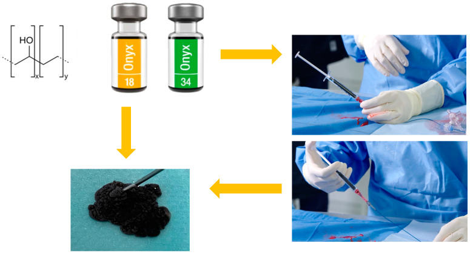
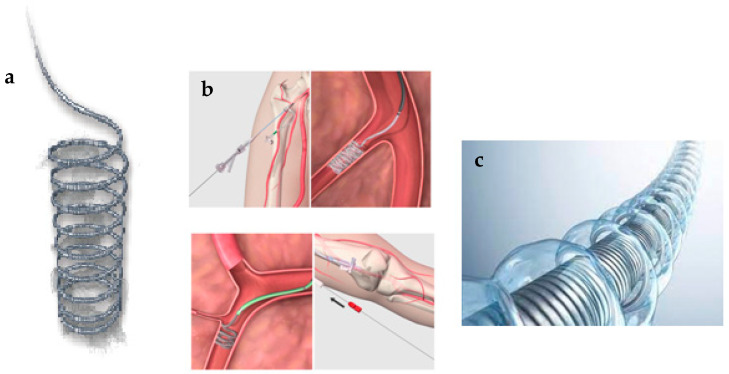
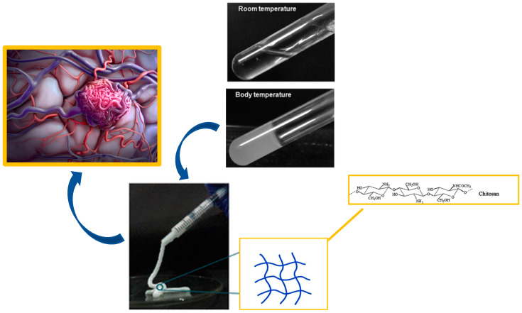
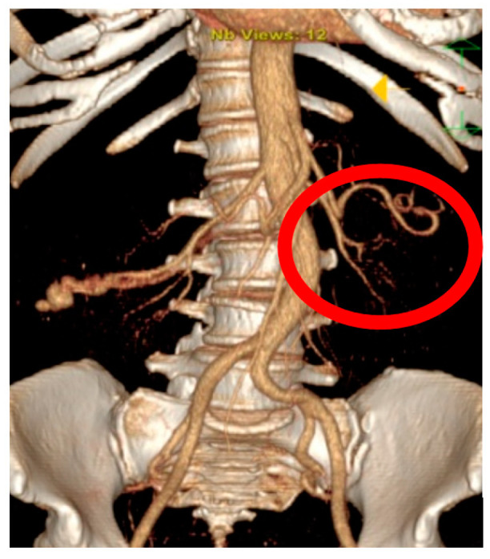
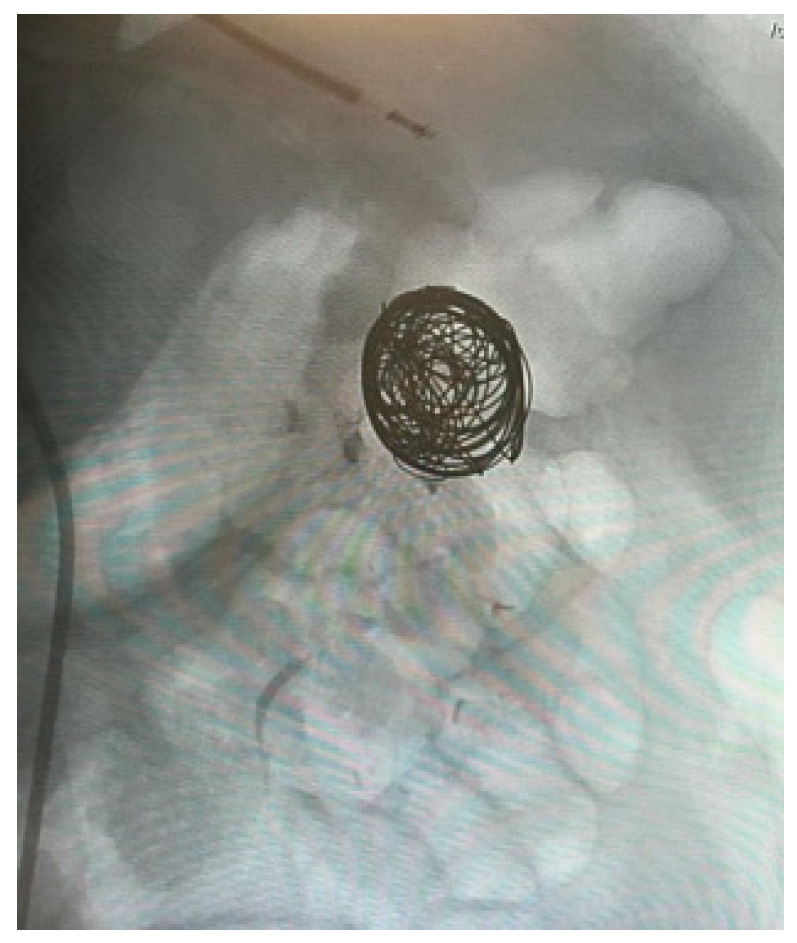
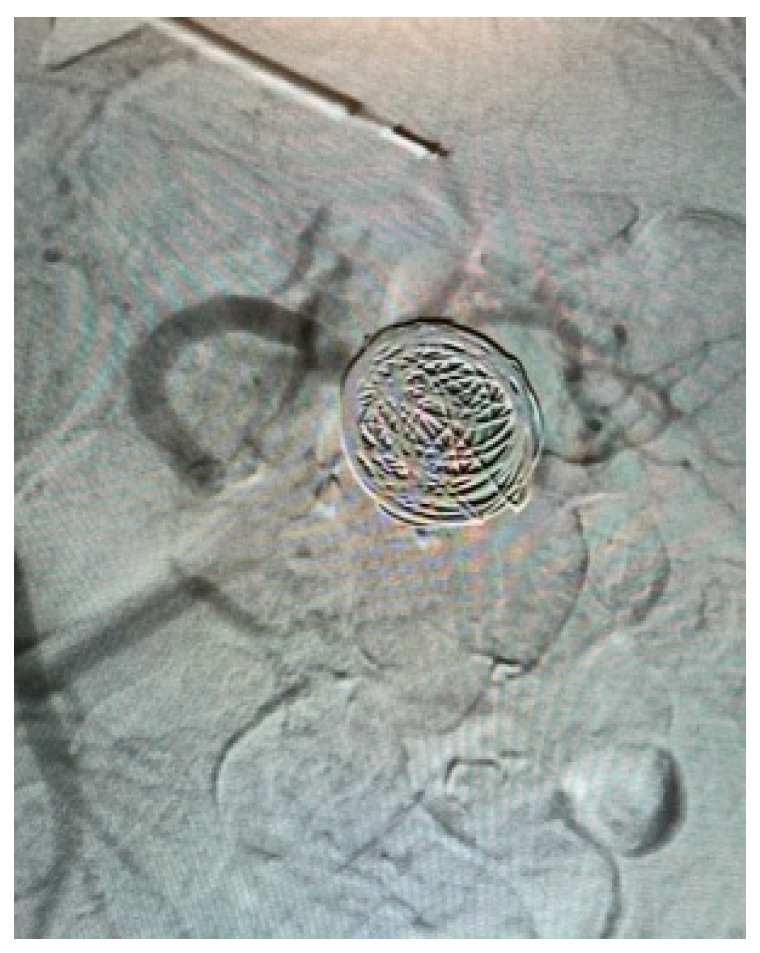
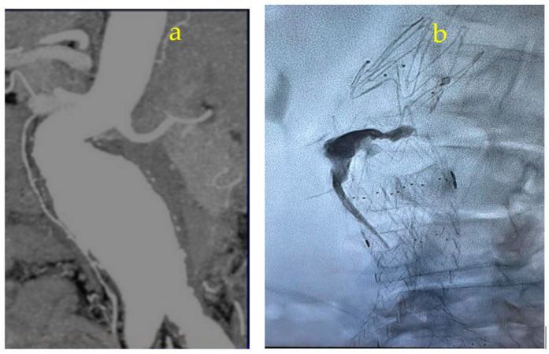
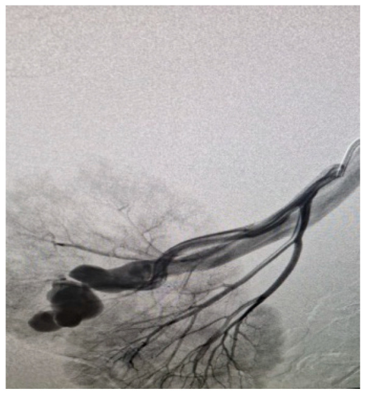
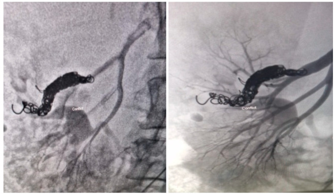
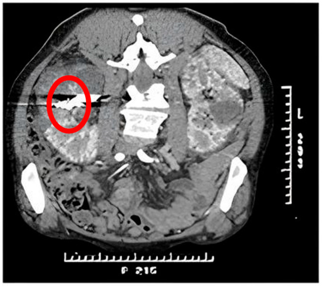

# Case Prep: AVM / dAVF Endovascular Embolization

---

<!-- BEGIN CASE SNAPSHOT -->

## Case / Approach Snapshot

- **Anatomy at risk:** access vessels, arch/cervical anatomy, parent artery branches, perforators, collateral pathways, venous drainage when relevant, and device landing zones.
- **Operative steps:** confirm indication and imaging, obtain access safely, navigate with roadmap control, deploy the planned device or embolic strategy, document final angiography, and define antiplatelet/anticoagulation and postprocedure monitoring; use the detailed operative sequence and approach notes below as the step-by-step source.
- **Rescue plans:** access complication, dissection/perforation, thromboembolism, device malposition or migration, hemorrhage, vasospasm, antiplatelet failure, and conversion to open or staged management.
- **Figures:** review [Figures, Imaging & Video](#figures-imaging--video) and the [Curated Image Set](#curated-image-set); embedded local figures should remain open-access, public-domain, or otherwise reusable with attribution.
- **Papers:** review [High-Yield Literature](#high-yield-literature) for seminal sources, modern reviews, and outcome data specific to this page.
- **Textbook cross-checks:** use [Textbook Cross-Checks](#textbook-cross-checks) and the [Source Crosswalk](../../resources/source-crosswalk.md) to cite copyrighted textbooks/atlases while summarizing in original words.

<!-- END CASE SNAPSHOT -->

## One-Liner
[Age]yo [M/F] with a [brain AVM (Spetzler-Martin grade) / dural AV fistula] planned for endovascular embolization [as preoperative adjunct / pre-radiosurgery / curative / palliative].

---

## Figures, Imaging & Video

**🎥 Operative video** — [search operative video on YouTube ▸](https://www.youtube.com/results?search_query=cerebral+AVM+embolization+surgery) · [The Neurosurgical Atlas ▸](https://www.neurosurgicalatlas.com)

[Neurosurgical Atlas](https://www.neurosurgicalatlas.com) · [neuroangio.org](https://neuroangio.org) · [Radiopaedia](https://radiopaedia.org/search?q=cerebral%20AVM%20embolization&scope=all) · [PubMed Central](https://www.ncbi.nlm.nih.gov/pmc/?term=brain+AVM+dural+fistula+embolization) — figures © linked; see [media-sources.md](../../resources/media-sources.md)

---

<!-- BEGIN TEXTBOOK CROSS-CHECKS -->

## Textbook Cross-Checks

- **Vascular anatomy:** Rhoton Cranial Anatomy; Decision Making in Neurovascular Disease; Practical Neuroangiography — confirm parent-vessel anatomy, perforators, venous drainage, collateral pathways, and endovascular access/rescue options.
- **Operative/endovascular strategy:** Youmans and Winn; Schmidek and Sweet; Greenberg — summarize proximal control, exposure/device strategy, temporary-control options, and bailout plans in your own words.
- **Complication rescue:** Greenberg; Decision Making in Neurovascular Disease — review ischemia, hemorrhage, thromboembolism, rupture, vasospasm, and postoperative surveillance algorithms.
- **Copyright-safe use:** cite these sources as private cross-checks, then write the guide content in original words; do not re-host textbook pages, figures, tables, or board-review card material. See [Source Crosswalk & Copyright-Safe Use](../../resources/source-crosswalk.md).

<!-- END TEXTBOOK CROSS-CHECKS -->

<!-- BEGIN CURATED LITERATURE -->

## High-Yield Literature

- **Transvenous embolization of brain arteriovenous malformations: a review of techniques, indications, and outcomes** — Chen CJ. Neurosurgical focus 2018. [PubMed](https://pubmed.ncbi.nlm.nih.gov/29961383/)
- **Role of endovascular embolization for trigeminal neuralgia related to cerebral vascular malformation** — Ge H. Interventional neuroradiology : journal of peritherapeutic neuroradiology, surgical procedures and related neurosciences 2016. [PubMed](https://pubmed.ncbi.nlm.nih.gov/27402800/)
- **Cerebral abscess after neuro-vascular embolization: Own experience and review of the literature** — Cossu G. Acta neurochirurgica 2017. [PubMed](https://pubmed.ncbi.nlm.nih.gov/28116528/)
- **Pediatric intracranial arteriovenous shunts: Advances in diagnosis and treatment** — Lv X. European journal of paediatric neurology : EJPN : official journal of the European Paediatric Neurology Society 2020. [PubMed](https://pubmed.ncbi.nlm.nih.gov/31996298/)
- **Simulation of superselective catheterization for cerebrovascular lesions using a virtual injection software** — Sundararajan SH. CVIR endovascular 2021. [PubMed](https://pubmed.ncbi.nlm.nih.gov/34125300/)
- **Clinical importance of the occipital artery in vascular lesions: A review of the literature** — Guo Y. The neuroradiology journal 2019. [PubMed](https://pubmed.ncbi.nlm.nih.gov/31188082/)
- **Long-term angiographic results of endovascularly "cured" intracranial dural arteriovenous fistulas** — Ambekar S. Journal of neurosurgery 2016. [PubMed](https://pubmed.ncbi.nlm.nih.gov/26406789/)
- **Radiation exposure in the endovascular therapy of cranial and spinal dural arteriovenous fistula in the last decade: a retrospective, single-center observational study** — Opitz M. Neuroradiology 2022. [PubMed](https://pubmed.ncbi.nlm.nih.gov/34570252/)
- **The impact of software-based metal artifact reduction on the liquid embolic agent Onyx in cone-beam CT: a systematic in vitro and in vivo study** — Schmitt N. Journal of neurointerventional surgery 2022. [PubMed](https://pubmed.ncbi.nlm.nih.gov/34433643/)
- **Treatment Strategy of a Patient With a Brain Arteriovenous Malformation and Cranial Dural Fistula: 2-Dimensional Operative Video** — Sattur MG. Operative neurosurgery (Hagerstown, Md.) 2019. [PubMed](https://pubmed.ncbi.nlm.nih.gov/30202995/)

<!-- END CURATED LITERATURE -->

---

<!-- BEGIN CURATED IMAGE SET -->

## Curated Image Set

Open-access figures are embedded from PubMed Central articles and kept unique to this guide.

*Figure 1. Graphical representation of the chemical formula, macroscopic appearance and material for the injection of OnyxTMgel. Source: [OnyxTMGel or Coil versus Hydrogel as Embolic Agents in Endovascular Applications: Review of the Literature and Case Series](https://pmc.ncbi.nlm.nih.gov/articles/PMC11120993/) — Gels 2024; CC BY.*

*Figure 2. Coil bare (a), coil endovascular application (b), hydrogel-coated coil (c) for embolisation. Source: [OnyxTMGel or Coil versus Hydrogel as Embolic Agents in Endovascular Applications: Review of the Literature and Case Series](https://pmc.ncbi.nlm.nih.gov/articles/PMC11120993/) — Gels 2024; CC BY.*

*Figure 3. Chitosan hydrogel as embolic agent for embolisation process. Source: [OnyxTMGel or Coil versus Hydrogel as Embolic Agents in Endovascular Applications: Review of the Literature and Case Series](https://pmc.ncbi.nlm.nih.gov/articles/PMC11120993/) — Gels 2024; CC BY.*

*Figure A1. Pre-operative 3DMPR CT reconstruction. Source: [OnyxTMGel or Coil versus Hydrogel as Embolic Agents in Endovascular Applications: Review of the Literature and Case Series](https://pmc.ncbi.nlm.nih.gov/articles/PMC11120993/) — Gels 2024; CC BY.*

*Figure A1. Pre-operative 3DMPR CT reconstruction. Source: [OnyxTMGel or Coil versus Hydrogel as Embolic Agents in Endovascular Applications: Review of the Literature and Case Series](https://pmc.ncbi.nlm.nih.gov/articles/PMC11120993/) — Gels 2024; CC BY.*

*Figure A1. Pre-operative 3DMPR CT reconstruction. Source: [OnyxTMGel or Coil versus Hydrogel as Embolic Agents in Endovascular Applications: Review of the Literature and Case Series](https://pmc.ncbi.nlm.nih.gov/articles/PMC11120993/) — Gels 2024; CC BY.*

*Figure A1. Pre-operative 3DMPR CT reconstruction. Source: [OnyxTMGel or Coil versus Hydrogel as Embolic Agents in Endovascular Applications: Review of the Literature and Case Series](https://pmc.ncbi.nlm.nih.gov/articles/PMC11120993/) — Gels 2024; CC BY.*

*Figure A2. Intraoperative diagnostic angiography. Source: [OnyxTMGel or Coil versus Hydrogel as Embolic Agents in Endovascular Applications: Review of the Literature and Case Series](https://pmc.ncbi.nlm.nih.gov/articles/PMC11120993/) — Gels 2024; CC BY.*

*Figure A3. Angiographic control post-coil release. Source: [OnyxTMGel or Coil versus Hydrogel as Embolic Agents in Endovascular Applications: Review of the Literature and Case Series](https://pmc.ncbi.nlm.nih.gov/articles/PMC11120993/) — Gels 2024; CC BY.*

*Figure A4. Control CT scan with contrast medium at 30 days with evidence of coils on release and absence of AVM. Source: [OnyxTMGel or Coil versus Hydrogel as Embolic Agents in Endovascular Applications: Review of the Literature and Case Series](https://pmc.ncbi.nlm.nih.gov/articles/PMC11120993/) — Gels 2024; CC BY.*

<!-- END CURATED IMAGE SET -->

---

## History of Present Illness
- Chief complaint: Hemorrhage, seizures, headache, progressive deficit, or pulsatile tinnitus/bruit (dAVF)
- **Embolization role:** preoperative (reduce flow/deep feeders before resection), pre-SRS (volume reduction — debated), curative (selected small AVMs, many dAVFs), palliative (high-grade, symptom-targeted)
- Prior hemorrhage, prior treatment, planned multimodal strategy

---

## Past Medical History
- Contrast allergy, renal function, bleeding/clotting, vascular access
- Standard PMH

---

## Imaging Review
### DSA (gold standard) + MRI/CTA
- **Angioarchitecture:** feeding arteries, nidus, draining veins, flow, **associated aneurysms (flow-related/intranidal — bleeding risk)**, venous outflow stenosis
- **Spetzler-Martin grade** (AVM); **dAVF:** Borden/Cognard classification (cortical venous reflux = high risk), fistula site
- Identify **en passage** vessels and dangerous anastomoses (e.g., ECA-ICA/vertebral collaterals, supply to cranial nerves) — avoid non-target embolization

---

## Labs
- CBC, BMP (renal), Coags, type and screen

---

## Neurological Examination
- Focal exam per AVM location, cranial nerves (dAVF/skull base), document baseline

---

## Surgical Planning

### Strategy & Agents
- **Liquid embolics:** **Onyx (EVOH)** (controlled, cohesive — workhorse), **n-BCA glue** (cyanoacrylate); **coils** (high-flow fistulas, venous side of dAVF); particles (palliative/preop, temporary)
- **Approach:** transarterial (most) or transvenous (selected dAVF — occlude the recipient venous pouch)
- Staged embolization for large AVMs (avoid normal perfusion pressure breakthrough)

### Position / Setup
- Supine, angiography table, femoral/radial access, biplane DSA, heparinization

### Key Procedure Steps
1. Arterial access, guide catheter to feeding pedicle territory
2. **Microcatheter navigated into the feeding artery/nidus** (or transvenous to the fistula/draining vein for dAVF)
3. **Provocative testing** (selected — e.g., amytal/lidocaine to test for eloquent supply before embolizing) in awake or with monitoring
4. **Inject liquid embolic (Onyx/glue)** under continuous fluoroscopy with controlled reflux, penetrating the nidus/fistula; avoid premature venous occlusion (AVM) or non-target/dangerous-anastomosis embolization
5. **dAVF:** occlude the fistulous point / proximal draining vein (transvenous coiling/Onyx) — eliminate cortical venous reflux
6. Sequential pedicles/stages; final angiography (degree of nidus/fistula obliteration, preserved normal vessels)
7. Access closure

### Critical Anatomy & Structures at Risk
1. **Normal brain arteries / en passage vessels** — non-target embolization → stroke
2. **Draining vein** (AVM) — **premature venous occlusion → nidus rupture/hemorrhage**
3. **Dangerous anastomoses** (ECA-to-ICA/vertebral, cranial nerve supply) — non-target embolization → stroke/cranial neuropathy
4. Catheter retention (glued/retained microcatheter)

### Equipment / Team
- Neuroangiography suite, guide/microcatheters (DMSO-compatible for Onyx), microwires
- **Onyx / n-BCA glue / coils / particles**, DMSO, heparin
- Neurointerventional team, anesthesia

### Anesthesia
- General (or awake for provocative testing in eloquent territory), heparinization, BP control

### Potential Complications
1. **Hemorrhage** (vessel/nidus perforation, premature venous occlusion, post-embolization NPPB) — BP control, reversal
2. **Ischemic stroke / cranial neuropathy** (non-target/reflux embolization, dangerous anastomoses)
3. Retained/glued microcatheter, incomplete obliteration (multimodal plan), access complications, contrast nephropathy

---

## Procedure Note Template
**Preoperative Diagnosis:** [Brain AVM (Spetzler-Martin __) / dural AV fistula (Borden/Cognard __)]

**Postoperative Diagnosis:** Same

**Procedure:** Endovascular embolization of [brain AVM / dAVF] — [transarterial/transvenous], [Onyx/glue/coils], [N] pedicles

**Operator / Assistant:**
**Anesthesia:** General [or awake for provocative testing]
**Access:** [Right femoral/radial] arterial sheath
**Contrast / Fluoro time / EBL:**
**Devices:** [Onyx/n-BCA/coils — volumes], heparin
**Complications:** None

**Indications:** [Age]yo [M/F] with a [brain AVM/dAVF] presenting with [hemorrhage/seizures/tinnitus]; embolization performed as [preoperative adjunct / pre-SRS / curative / palliative]. Risks (hemorrhage, non-target embolization/stroke, cranial neuropathy) discussed.

**Description of Procedure:** After consent and time-out, [general anesthesia] and arterial access with heparinization were established. A guide catheter was positioned and a microcatheter navigated into the [feeding pedicle / fistulous point]. [Provocative testing was performed before embolization in eloquent territory.] **Liquid embolic [Onyx/glue] was injected under continuous fluoroscopy** with controlled reflux, penetrating the [nidus/fistula], avoiding premature venous occlusion and dangerous anastomoses; [the dAVF draining vein/fistulous point was occluded transvenously with coils/Onyx]. [N] pedicles were treated over [N] stages.

**Final angiography showed [__]% obliteration with preserved normal vessels and draining vein** [until the appropriate endpoint]. Catheters were removed and the access closed.

The patient was transferred to the NSICU with strict BP control; [the next stage of the multimodal plan was scheduled].

---

## Post-Procedure Plan
- NSICU, neuro checks q1h, **strict BP control** (post-embolization hemorrhage/NPPB risk), access checks
- **Coordinate next stage of multimodal plan** (surgery — often within days; SRS; further embolization stages)
- Hydration (contrast), CT if neuro change
- Follow-up DSA (obliteration; for definitive embolization confirm cure), surveillance
