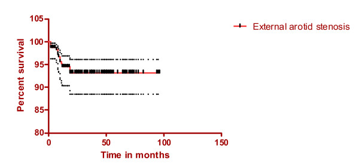
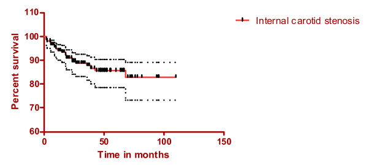
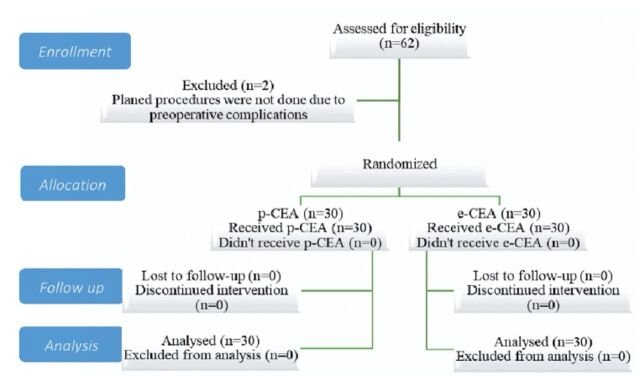
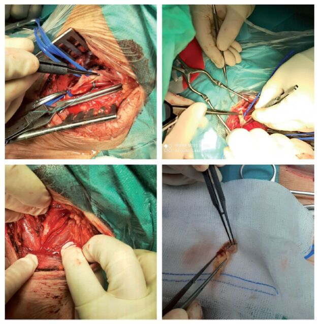
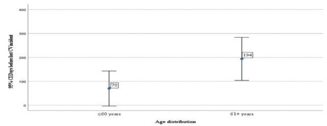
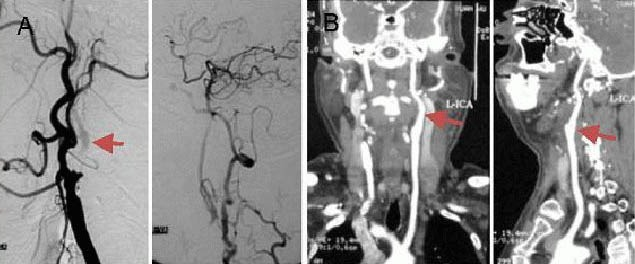
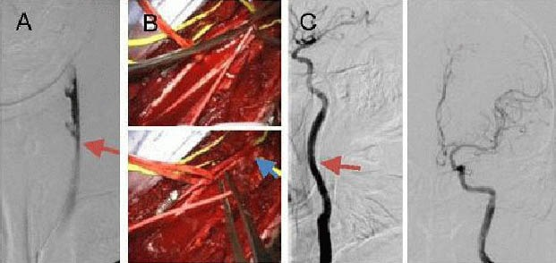
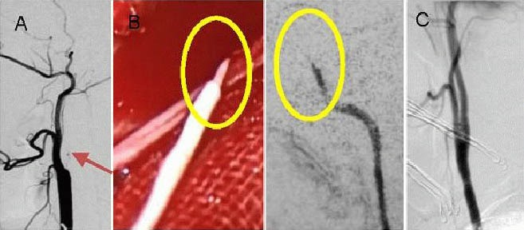
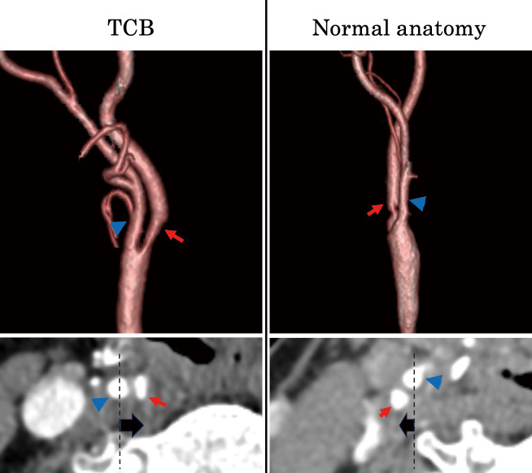
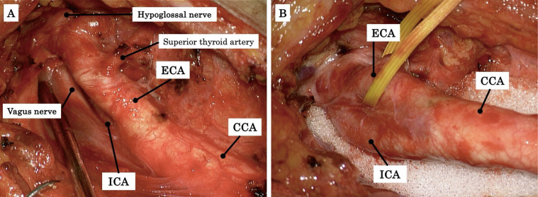

# Case Prep: Carotid Endarterectomy (CEA)

<!-- BEGIN CASE SNAPSHOT -->

## Case / Approach Snapshot

- **Anatomy at risk:** access vessels, arch/cervical anatomy, parent artery branches, perforators, collateral pathways, venous drainage when relevant, and device landing zones.
- **Operative steps:** confirm indication and imaging, obtain access safely, navigate with roadmap control, deploy the planned device or embolic strategy, document final angiography, and define antiplatelet/anticoagulation and postprocedure monitoring; use the detailed operative sequence and approach notes below as the step-by-step source.
- **Rescue plans:** access complication, dissection/perforation, thromboembolism, device malposition or migration, hemorrhage, vasospasm, antiplatelet failure, and conversion to open or staged management.
- **Figures:** review [Figures, Imaging & Video](#figures-imaging--video) and the [Curated Image Set](#curated-image-set); embedded local figures should remain open-access, public-domain, or otherwise reusable with attribution.
- **Papers:** review [High-Yield Literature](#high-yield-literature) for seminal sources, modern reviews, and outcome data specific to this page.

<!-- END CASE SNAPSHOT -->

## One-Liner
[Age]yo [M/F] with [symptomatic / asymptomatic] [left/right] internal carotid artery stenosis ([__]%) planned for carotid endarterectomy.

---

## Figures, Imaging & Video

**🎥 Operative video** — [search operative video on YouTube ▸](https://www.youtube.com/results?search_query=carotid+artery+stenosis+surgery) · [The Neurosurgical Atlas ▸](https://www.neurosurgicalatlas.com)

[Neurosurgical Atlas](https://www.neurosurgicalatlas.com) · [neuroangio.org](https://neuroangio.org) · [Radiopaedia](https://radiopaedia.org/search?q=carotid%20artery%20stenosis&scope=all) · [PubMed Central](https://www.ncbi.nlm.nih.gov/pmc/?term=carotid+endarterectomy) — operative figures © linked; see [media-sources.md](../../resources/media-sources.md)

---

<!-- BEGIN CURATED LITERATURE -->

## High-Yield Literature

- **Monitoring in carotid endarterectomy** — Simon MV. Handbook of clinical neurology 2022. [PubMed](https://pubmed.ncbi.nlm.nih.gov/35772895/)
- **Carotid endarterectomy from the neurosurgeon's perspective** — Přibáň V. Rozhledy v chirurgii : mesicnik Ceskoslovenske chirurgicke spolecnosti 2025. [PubMed](https://pubmed.ncbi.nlm.nih.gov/40662434/)
- **Anesthesia for Carotid Endarterectomy, Angioplasty, and Stent** — Nelson P. Anesthesiology clinics 2021. [PubMed](https://pubmed.ncbi.nlm.nih.gov/33563385/)
- **[Carotid endarterectomy in acute period of ischemic stroke]** — Zakirzhanov NR. Khirurgiia 2020. [PubMed](https://pubmed.ncbi.nlm.nih.gov/32105259/)
- **Carotid endarterectomy-the evidence** — Earnshaw JJ. Journal of the Royal Society of Medicine 2002. [PubMed](https://pubmed.ncbi.nlm.nih.gov/11934904/)
- **[Carotid endarterectomy : General versus local anesthesia, which is the best ?]** — Khaoulani Y. Revue medicale de Liege 2024. [PubMed](https://pubmed.ncbi.nlm.nih.gov/39397552/)
- **Transcarotid Artery Revascularization Versus Carotid Endarterectomy** — Paraskevas KI. Angiology 2025. [PubMed](https://pubmed.ncbi.nlm.nih.gov/38864386/)
- **Carotid artery stenting versus carotid endarterectomy** — Nanna MG. Postgraduate medical journal 2016. [PubMed](https://pubmed.ncbi.nlm.nih.gov/27317752/)
- **Intraoperative management of carotid endarterectomy** — Apinis A. Anesthesiology clinics 2014. [PubMed](https://pubmed.ncbi.nlm.nih.gov/25113727/)
- **Randomizing carotid endarterectomy to carotid stenting?** — Wholey MH. Journal of endovascular surgery : the official journal of the International Society for Endovascular Surgery 1999. [PubMed](https://pubmed.ncbi.nlm.nih.gov/10473329/)

<!-- END CURATED LITERATURE -->

<!-- BEGIN CURATED IMAGE SET -->

## Curated Image Set

Open-access figures are embedded from PubMed Central articles and kept unique to this guide.

*Figure 1. (Stenosis of the external carotid artery, mean and 95% confidence intervals). Source: [What happens to the external carotid artery following carotid endarterectomy?](https://pmc.ncbi.nlm.nih.gov/articles/PMC2596080/) — BMC Surgery 2008; CC BY.*

*Figure 2. (Stenosis of the internal carotid artery, mean and 95% confidence intervals). Source: [What happens to the external carotid artery following carotid endarterectomy?](https://pmc.ncbi.nlm.nih.gov/articles/PMC2596080/) — BMC Surgery 2008; CC BY.*

*Figure 1. - Consort statement on conscription and randomization of patients Source: [Patch angioplasty carotid endarterectomy versus eversion carotid endarterectomy](https://pmc.ncbi.nlm.nih.gov/articles/PMC11237269/) — Saudi Medical Journal 2024; CC BY-NC.*

*Figure 2. - Carotid surgery (carotid shunt, eversion carotid endarterectomy, carotid endarterectomy with patch angioplasty, plaque) Source: [Patch angioplasty carotid endarterectomy versus eversion carotid endarterectomy](https://pmc.ncbi.nlm.nih.gov/articles/PMC11237269/) — Saudi Medical Journal 2024; CC BY-NC.*

*Figure 2. - Days before last verified major cerebrovascular incident( incident/age distribution). Source: [Patch angioplasty carotid endarterectomy versus eversion carotid endarterectomy](https://pmc.ncbi.nlm.nih.gov/articles/PMC11237269/) — Saudi Medical Journal 2024; CC BY-NC.*

*Figure 1. A 50-year-old male with paroxysmal right-sided limb weakness and dysphasia underwent carotid endarterectomy.(A) Preoperative digital subtraction angiography showed left internal carotid... Source: [Recanalization of extracranial internal carotid artery occlusion: A 12-year retrospective study](https://pmc.ncbi.nlm.nih.gov/articles/PMC4146118/) — Neural Regeneration Research 2013; CC BY-NC-SA.*

*Figure 2. A 72-year-old male with right-sided limb weakness and dysphasia underwent carotid endarterectomy combined with Fogarty balloon catheter thrombectomy.(A) Digital subtraction angiography... Source: [Recanalization of extracranial internal carotid artery occlusion: A 12-year retrospective study](https://pmc.ncbi.nlm.nih.gov/articles/PMC4146118/) — Neural Regeneration Research 2013; CC BY-NC-SA.*

*Figure 3. A 46-year-old male with right-sided limb weakness underwent hybrid surgery.(A) Digital subtraction angiography showing occlusion of the left internal carotid artery. The distal... Source: [Recanalization of extracranial internal carotid artery occlusion: A 12-year retrospective study](https://pmc.ncbi.nlm.nih.gov/articles/PMC4146118/) — Neural Regeneration Research 2013; CC BY-NC-SA.*

*Fig. 1. Anatomical differences between the TCB and normal anatomy groups. Both cases have right-sided lesions, and the images were obtained via 3D-CTA. In the TCB case, the ICA (red arrow) runs... Source: [Surgical Outcomes of Carotid Endarterectomy in Patients with Twisted Carotid Bifurcation: Focus on Postoperative Nerve Complications](https://pmc.ncbi.nlm.nih.gov/articles/PMC12061556/) — Neurologia medico-chirurgica 2025; CC BY-NC-ND.*

*Fig. 2. A case of CEA for right-sided ICA stenosis with TCB. In TCB cases, the ICA is located posteromedial to the ECA (A). The ICA is carefully dissected and mobilized to the lateral side of... Source: [Surgical Outcomes of Carotid Endarterectomy in Patients with Twisted Carotid Bifurcation: Focus on Postoperative Nerve Complications](https://pmc.ncbi.nlm.nih.gov/articles/PMC12061556/) — Neurologia medico-chirurgica 2025; CC BY-NC-ND.*

<!-- END CURATED IMAGE SET -->

---

## History of Present Illness
- Chief complaint: **Symptomatic** (ipsilateral TIA, amaurosis fugax, minor stroke) or **asymptomatic** (screening/bruit)
- **Indications (guideline):** symptomatic stenosis **50-99%** (greatest benefit 70-99%, treat within ~2 weeks of event); asymptomatic **≥60-70%** in selected patients with low surgical risk and reasonable life expectancy
- Degree of stenosis, recent symptoms/timing, contralateral status

---

## Past Medical History
- **Cardiac disease** (CAD common — perioperative MI risk; clearance), hypertension, diabetes, smoking, hyperlipidemia
- Contralateral carotid occlusion (affects shunting/risk), prior neck surgery/radiation/CEA (re-do — relative indication for stenting), antiplatelet/anticoagulation
- Standard PMH; **continue aspirin perioperatively**

---

## Imaging Review
### Carotid Duplex Ultrasound + CTA/MRA (± DSA)
- **Degree of stenosis** (NASCET criteria), plaque morphology (ulceration, echolucency), **contralateral carotid**, tandem/intracranial disease
- Bifurcation height (high bifurcation → exposure difficulty), arch anatomy (if considering stenting)
### Brain imaging
- Prior infarcts, exclude large recent infarct (timing of surgery)

---

## Labs
- CBC, BMP, Coags, type and screen; cardiac workup as indicated

---

## Neurological Examination
- Focal exam (prior deficits), document baseline; cranial nerves (baseline for comparison — CN injury risk)

---

## Surgical Planning

### Case Logistics, OR Needs & Orders
- **OR setup:** vascular tray, microscope/loupes per surgeon, patch/shunt options, EEG/SSEP/stump-pressure or cerebral oximetry plan, heparin/protamine plan, and duplex/CTA reviewed for level and plaque morphology.
- **Special needs:** strict perioperative BP targets, aspirin/statin continuation, antiplatelet/anticoagulant plan, airway hematoma response plan, and cranial nerve baseline documented.
- **Immediate postop orders:** neuro checks, neck hematoma/airway watch, BP floor/ceiling, swallow/voice assessment, antiplatelet/statin orders, drain if used, and duplex/clinic follow-up.

### CEA vs CAS
- **CEA** preferred for most (durable); **carotid stenting (CAS)** for high surgical risk, hostile neck (radiation/re-do), high bifurcation (see [carotid-stenting](carotid-stenting.md))

### Position
- Supine, neck extended and turned away from operative side, shoulder roll; **regional (cervical block — awake neuro monitoring) or general anesthesia**

### Key Surgical Steps
1. Longitudinal incision along the anterior border of the SCM (or transverse skin crease)
2. Dissect to the carotid sheath; **identify and protect cranial nerves** (vagus, hypoglossal, marginal mandibular branch of facial, superior laryngeal, ansa cervicalis)
3. Expose common, external, and internal carotid; encircle with vessel loops
4. **Systemic heparin**
5. **Clamp** ICA, CCA, ECA (sequence); **monitor for ischemia** (awake exam, EEG/SSEP/stump pressure) — **place a shunt** if ischemia/low stump pressure/contralateral occlusion
6. **Arteriotomy** along the CCA into the ICA across the plaque
7. **Endarterectomy** — develop the plane, remove the atheromatous plaque, feather the distal endpoint (tack down intimal flap if needed), remove debris
8. Close arteriotomy (**patch angioplasty** — vein/Dacron/bovine pericardium — reduces restenosis, or primary)
9. **De-air, restore flow** (ECA first, then ICA — flush debris to ECA), remove clamps
10. Hemostasis, ± drain, layered closure (platysma, skin)
11. Reverse heparin (protamine) selectively; complete neuro check

### Critical Anatomy & Structures at Risk
1. **Cranial nerves:** **hypoglossal (XII)** (tongue), **vagus/recurrent laryngeal** (hoarseness), **marginal mandibular (VII)** (lip droop), superior laryngeal, glossopharyngeal (high exposure)
2. **Carotid artery** — embolization (manipulation), thrombosis, intimal flap
3. **Cerebral ischemia** during clamping (shunt decision), **reperfusion/hyperperfusion**

### Equipment
- Vascular set, **shunt** (Javid/Pruitt), patch material, vascular sutures, heparin/protamine
- Neuromonitoring (EEG/SSEP) or awake setup, Doppler, loupes

### Monitoring
- **EEG/SSEP / stump pressure / awake neuro exam** (cerebral perfusion during clamp — guides shunting)

### Anesthesia
- Regional (awake monitoring) or general; **strict BP control** (avoid hypo-/hypertension — perfusion and hyperperfusion), continue aspirin, cardiac monitoring

### Potential Complications
1. **Stroke** (embolic/thrombotic — peri-clamp, plaque manipulation), **cranial nerve injury** (XII, vagus/RLN, marginal mandibular)
2. **Neck hematoma → airway compromise** (emergent evacuation), **hyperperfusion syndrome** (headache, seizure, hemorrhage — BP control)
3. Restenosis, MI (cardiac comorbidity), wound issues, bradycardia/hypotension (carotid sinus)

---

## Operative Note Template
**Preoperative Diagnosis:** [Symptomatic/asymptomatic] [left/right] internal carotid artery stenosis ([__]%)

**Postoperative Diagnosis:** Same

**Procedure:** [Left/Right] carotid endarterectomy [with shunt] [with patch angioplasty]

**Surgeon / Assistant:**
**Anesthesia:** [Regional cervical block (awake) / general]
**EBL / Fluids:**
**Adjuncts:** Loupes/microscope, shunt available, heparin/protamine, Doppler; **EEG/SSEP or awake neuro exam, stump pressure**
**Implants:** [Patch — vein/Dacron/bovine pericardium]
**Complications:** None

**Indications:** [Age]yo [M/F] with [symptomatic (ipsilateral TIA/stroke) / asymptomatic] [__]% ICA stenosis meeting guideline criteria for revascularization, with acceptable surgical risk. Aspirin continued. Risks (stroke, cranial nerve injury, neck hematoma/airway, hyperperfusion) discussed.

**Description of Procedure:** After consent and time-out, [regional cervical block / general anesthesia] was provided with strict BP control and neuromonitoring. An incision along the anterior border of the SCM was made and the carotid sheath entered, **identifying and protecting the cranial nerves (hypoglossal, vagus/RLN, marginal mandibular, superior laryngeal)**. The common, external, and internal carotid were exposed and encircled, and **systemic heparin** given.

The ICA/CCA/ECA were clamped (sequenced) with **cerebral monitoring** ([awake exam/EEG/SSEP/stump pressure]) guiding **[shunt placement / no shunt needed]**. An arteriotomy was made across the plaque and the **endarterectomy** performed, removing the atheroma and feathering/tacking the distal endpoint. The arteriotomy was closed with **[patch angioplasty / primarily]**. Flow was restored after **de-airing (ECA first, then ICA)**, and a completion neuro check/Doppler confirmed patency. [Heparin was reversed with protamine.]

Hemostasis was confirmed [± drain] and closure performed in layers. The patient was transferred with strict BP control and neck/airway monitoring.

---

## Postoperative Plan
- Step-down/ICU, neuro checks q1h, **strict BP control** (avoid hyper-/hypotension — stroke/hyperperfusion/hematoma)
- **Monitor neck for expanding hematoma (airway emergency)** — bedside evacuation if airway compromised
- Cranial nerve assessment (tongue, voice, lip), continue **aspirin/statin**
- Watch for hyperperfusion syndrome (severe headache, seizure → BP control, imaging)
- Carotid duplex follow-up (restenosis surveillance), risk factor modification; cardiology follow-up

<!-- BEGIN COMMON PIMP QUESTIONS -->

## Common Pimp Questions

Use these to pressure-test preparation for **Carotid Endarterectomy (CEA)**:

1. What is the proximal-control plan before the lesion is manipulated?
2. Which branch, perforator, or venous structure is most likely to be injured in this exposure?
3. What are the intraoperative rupture steps, including temporary clip, suction, BP, and backup clip strategy?
4. What confirms treatment success: ICG, Doppler, puncture/deflation, DSA, or postoperative CTA?
5. What postoperative BP, vasospasm, antiplatelet, or anticoagulation issue changes the orders tonight?

<!-- END COMMON PIMP QUESTIONS -->

<!-- BEGIN ATTENDING PREFERENCE VARIABLES -->

## Attending Preference Variables

Items that commonly vary by surgeon or institution:

- **Preferred approach side, sylvian split style, and cisternal-opening sequence:** [attending-specific]
- **Temporary clip threshold, burst-suppression preference, and BP during occlusion:** [attending-specific]
- **Clip manufacturer/shape sequence and whether Doppler, ICG, puncture, or intraop DSA is routine:** [attending-specific]
- **Antiplatelet/anticoagulation reversal and restart timing:** [attending-specific]

<!-- END ATTENDING PREFERENCE VARIABLES -->
