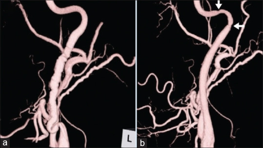
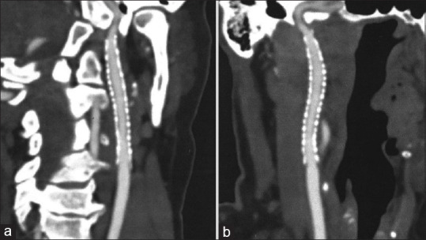
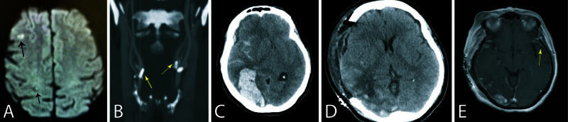
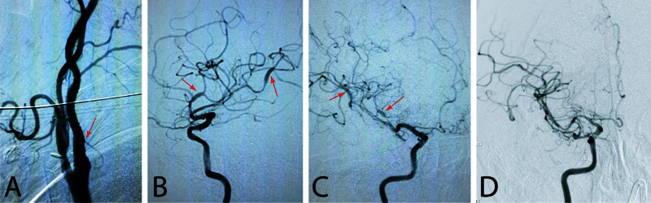
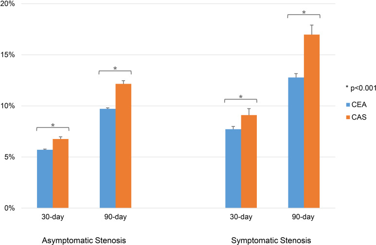
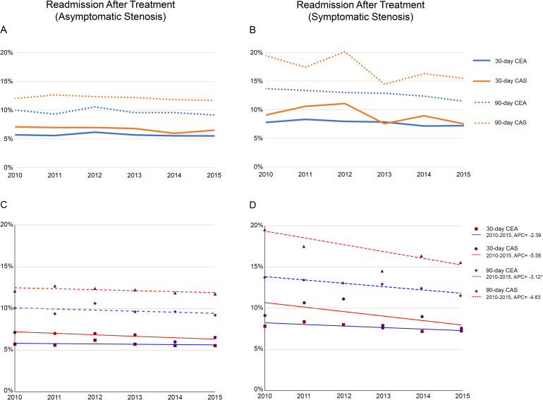
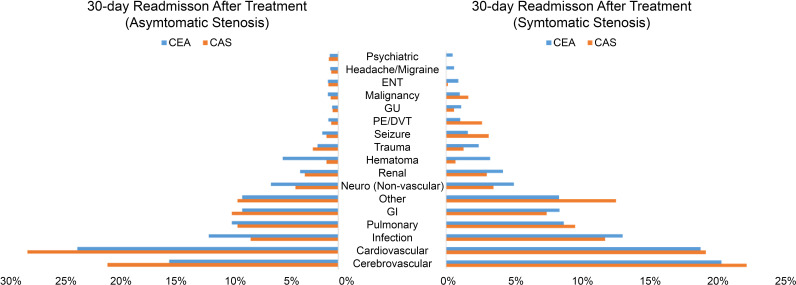
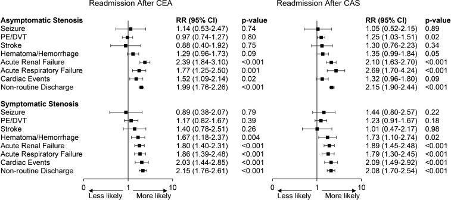
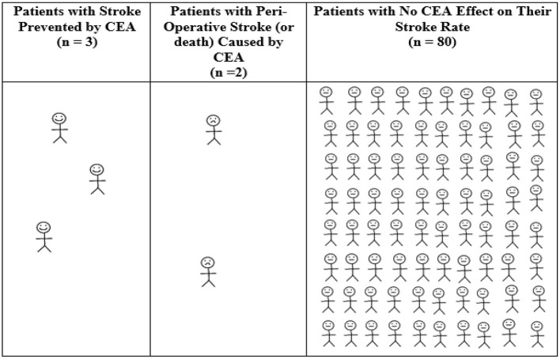
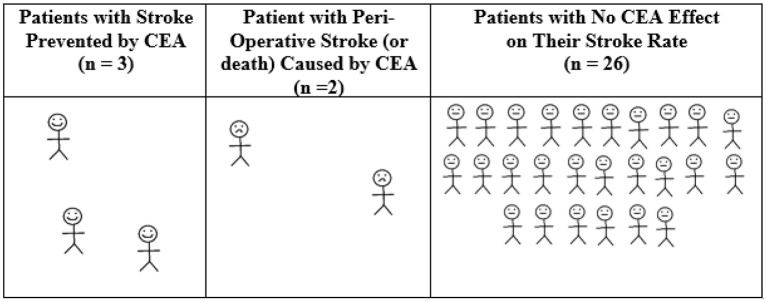

# Case Prep: Carotid Artery Angioplasty and Stenting (CAS)

---

<!-- BEGIN CASE DOSSIER -->

## Case / Approach Dossier

- **Anatomy at risk:** access vessels, arch/cervical anatomy, parent artery branches, perforators, collateral pathways, venous drainage when relevant, and device landing zones.
- **Operative steps:** confirm indication and imaging, obtain access safely, navigate with roadmap control, deploy the planned device or embolic strategy, document final angiography, and define antiplatelet/anticoagulation and postprocedure monitoring; use the detailed operative sequence and approach notes below as the step-by-step source.
- **Rescue plans:** access complication, dissection/perforation, thromboembolism, device malposition or migration, hemorrhage, vasospasm, antiplatelet failure, and conversion to open or staged management.
- **Figures:** review [Figures, Imaging & Video](#figures-imaging--video) and the [Curated Image Set](#curated-image-set); embedded local figures should remain open-access, public-domain, or otherwise reusable with attribution.
- **Papers:** review [High-Yield Literature](#high-yield-literature) for seminal sources, modern reviews, and outcome data specific to this page.
- **Textbook cross-checks:** use [Textbook Cross-Checks](#textbook-cross-checks) and the [Source Crosswalk](../../resources/source-crosswalk.md) to cite copyrighted textbooks/atlases while summarizing in original words.

<!-- END CASE DOSSIER -->

## One-Liner
[Age]yo [M/F] with [symptomatic/asymptomatic] [left/right] internal carotid stenosis ([__]%) and [high surgical risk / hostile neck / re-stenosis after CEA] planned for carotid artery angioplasty and stenting with embolic protection.

---

## Figures, Imaging & Video

**🎥 Operative video** — [search operative video on YouTube ▸](https://www.youtube.com/results?search_query=carotid+artery+stenting+surgery) · [The Neurosurgical Atlas ▸](https://www.neurosurgicalatlas.com)

[Neurosurgical Atlas](https://www.neurosurgicalatlas.com) · [neuroangio.org](https://neuroangio.org) · [Radiopaedia](https://radiopaedia.org/search?q=carotid%20artery%20stenting&scope=all) · [PubMed Central](https://www.ncbi.nlm.nih.gov/pmc/?term=carotid+artery+stenting) — figures © linked; see [media-sources.md](../../resources/media-sources.md)

---

<!-- BEGIN TEXTBOOK CROSS-CHECKS -->

## Textbook Cross-Checks

- **Vascular anatomy:** Rhoton Cranial Anatomy; Decision Making in Neurovascular Disease; Practical Neuroangiography — confirm parent-vessel anatomy, perforators, venous drainage, collateral pathways, and endovascular access/rescue options.
- **Operative/endovascular strategy:** Youmans and Winn; Schmidek and Sweet; Greenberg — summarize proximal control, exposure/device strategy, temporary-control options, and bailout plans in your own words.
- **Complication rescue:** Greenberg; Decision Making in Neurovascular Disease — review ischemia, hemorrhage, thromboembolism, rupture, vasospasm, and postoperative surveillance algorithms.
- **Copyright-safe use:** cite these sources as private cross-checks, then write the guide content in original words; do not re-host textbook pages, figures, tables, or board-review card material. See [Source Crosswalk & Copyright-Safe Use](../../resources/source-crosswalk.md).

<!-- END TEXTBOOK CROSS-CHECKS -->

<!-- BEGIN CURATED LITERATURE -->

## High-Yield Literature

- **Casper vs. Closed-Cell Stent : Carotid Artery Stenting Randomized Trial** — Vanzin JR. Clinical neuroradiology 2021. [PubMed](https://pubmed.ncbi.nlm.nih.gov/32747973/)
- **Early versus late carotid artery stenting for symptomatic carotid stenosis** — de Castro-Afonso LH. Journal of neuroradiology = Journal de neuroradiologie 2015. [PubMed](https://pubmed.ncbi.nlm.nih.gov/25841700/)
- **Is carotid artery stenting equivalent or superior to carotid endarterectomy for treatment of carotid artery stenosis?** — Shrivastava V. Interactive cardiovascular and thoracic surgery 2005. [PubMed](https://pubmed.ncbi.nlm.nih.gov/17670480/)
- **Flow reversal versus filter protection: a pilot carotid artery stenting randomized trial** — Castro-Afonso LH. Circulation. Cardiovascular interventions 2013. [PubMed](https://pubmed.ncbi.nlm.nih.gov/24084627/)
- **Carotid artery revascularization using the Walrus balloon guide catheter: safety and feasibility from a US multicenter experience** — Salem MM. Journal of neurointerventional surgery 2022. [PubMed](https://pubmed.ncbi.nlm.nih.gov/34686574/)
- **Why the United States Center for Medicare and Medicaid Services (CMS) should not extend reimbursement indications for carotid artery angioplasty/stenting** — Brain and behavior 2012. [PubMed](https://pubmed.ncbi.nlm.nih.gov/22574286/)
- **Advances and innovations in revascularization of extracranial vertebral artery** — Brasiliense LB. Neurosurgery 2014. [PubMed](https://pubmed.ncbi.nlm.nih.gov/24402479/)
- **Characteristics from the 100 most influential articles on carotid stenosis** — Hwang JW. Annals of palliative medicine 2022. [PubMed](https://pubmed.ncbi.nlm.nih.gov/35272469/)
- **Why the United States Center for Medicare and Medicaid Services should not extend reimbursement indications for carotid artery angioplasty/stenting** — Abbott AL. Vascular 2012. [PubMed](https://pubmed.ncbi.nlm.nih.gov/22271806/)
- **Periprocedural embolic events related to carotid artery stenting detected by diffusion-weighted MRI: comparison between proximal and distal embolus protection devices** — El-Koussy M. Journal of endovascular therapy : an official journal of the International Society of Endovascular Specialists 2007. [PubMed](https://pubmed.ncbi.nlm.nih.gov/17723007/)

<!-- END CURATED LITERATURE -->

---

<!-- BEGIN CURATED IMAGE SET -->

## Curated Image Set

Open-access figures are embedded from PubMed Central articles and kept unique to this guide.

*Figure 1. (a) Work incidence of pretreatment three-dimensional angiography showing the characteristic string of bead appearance of fibromuscular dysplasia in the right cervical internal carotid... Source: [Casper stent in the treatment of pulsatile tinnitus in fibromuscular dysplasia: Therapeutic review and case report](https://pmc.ncbi.nlm.nih.gov/articles/PMC8757508/) — Brain Circulation 2021; CC BY-NC-SA.*

*Figure 2. (a) Follow-up computed tomography angiogram, 12 months after stenting. The image showing the right cervical internal carotid artery in the sagittal plane. (b) Follow-up computed... Source: [Casper stent in the treatment of pulsatile tinnitus in fibromuscular dysplasia: Therapeutic review and case report](https://pmc.ncbi.nlm.nih.gov/articles/PMC8757508/) — Brain Circulation 2021; CC BY-NC-SA.*

*Figure 1. Pre- and post-operative brain images.A: Pre-operative diffusion weighted brain MRI showing previous punctate infarcts in the right middle cerebral artery territory (arrows). B: Cervical... Source: [Concomitant Reversible Cerebral Vasoconstriction and Hyperperfusion Syndromes Following Carotid Endarterectomy](https://pmc.ncbi.nlm.nih.gov/articles/PMC7357340/) — Cureus 2020; CC BY.*

*Figure 2. Cerebral angiogram.A: Catheter angiogram images showing resolution of right internal carotid artery stenosis after endarterectomy. Arrow points to the internal carotid artery.... Source: [Concomitant Reversible Cerebral Vasoconstriction and Hyperperfusion Syndromes Following Carotid Endarterectomy](https://pmc.ncbi.nlm.nih.gov/articles/PMC7357340/) — Cureus 2020; CC BY.*

*Figure 1. Readmission rates after CEA or CAS in asymptomatic and symptomatic patients. CAS=carotid artery stenting; CEA=carotid endarterectomy. Source: [Unplanned readmission after carotid stenting versus endarterectomy: analysis of the United States Nationwide Readmissions Database](https://pmc.ncbi.nlm.nih.gov/articles/PMC9985736/) — Journal of Neurointerventional Surgery 2023; CC BY-NC.*

*Figure 2. Trends in readmission rates (A, B) and APC (C, D) from 2010 to 2015 in asymptomatic and symptomatic patients. APC=annual percent change; CAS=carotid artery stenting; CEA=carotid... Source: [Unplanned readmission after carotid stenting versus endarterectomy: analysis of the United States Nationwide Readmissions Database](https://pmc.ncbi.nlm.nih.gov/articles/PMC9985736/) — Journal of Neurointerventional Surgery 2023; CC BY-NC.*

*Figure 3. Grouped categories tabulating proportion of causes of readmission for asymptomatic stenosis (left) and symptomatic stenosis (right). CAS=carotid artery stenting; CEA=carotid... Source: [Unplanned readmission after carotid stenting versus endarterectomy: analysis of the United States Nationwide Readmissions Database](https://pmc.ncbi.nlm.nih.gov/articles/PMC9985736/) — Journal of Neurointerventional Surgery 2023; CC BY-NC.*

*Figure 4. Postoperative adverse events or outcome at initial carotid revascularization and risk ratio of 30-day readmission. CAS=carotid artery stenting; CEA=carotid endarterectomy; CI=CI... Source: [Unplanned readmission after carotid stenting versus endarterectomy: analysis of the United States Nationwide Readmissions Database](https://pmc.ncbi.nlm.nih.gov/articles/PMC9985736/) — Journal of Neurointerventional Surgery 2023; CC BY-NC.*

*Figure 1. Average 12-month outcomes for every 85 patients with asymptomatic carotid stenosis randomized to CEA in ACAS (35). Calculated from ACAS data regarding patients with 60–99% asymptomatic... Source: [Extra-Cranial Carotid Artery Stenosis: An Objective Analysis of the Available Evidence](https://pmc.ncbi.nlm.nih.gov/articles/PMC9253595/) — Frontiers in Neurology 2022; CC BY.*

*Figure 2. Average 12-month outcomes for every 31 symptomatic patients randomized to CEA in NASCET, ECST, and VACS. Calculated from pooled randomized trial data regarding symptomatic patients with... Source: [Extra-Cranial Carotid Artery Stenosis: An Objective Analysis of the Available Evidence](https://pmc.ncbi.nlm.nih.gov/articles/PMC9253595/) — Frontiers in Neurology 2022; CC BY.*

<!-- END CURATED IMAGE SET -->

---

## History of Present Illness
- Chief complaint: Symptomatic (TIA/amaurosis/minor stroke) or asymptomatic significant stenosis
- **CAS indications (vs CEA):** high cardiac/surgical risk, **hostile neck** (prior radiation, neck dissection, tracheostomy), **restenosis after prior CEA**, high carotid bifurcation, contralateral laryngeal nerve palsy
- Symptom timing, anatomy considerations

---

## Past Medical History
- **Cardiac disease** (CAS may be favored if very high cardiac risk), **antiplatelet response** (dual antiplatelet required), contrast allergy, renal function
- **Arch/access anatomy** (tortuous/type III arch, heavy calcification → higher CAS risk), prior CEA/radiation
- Standard PMH

---

## Imaging Review
### CTA (arch to vertex) + Duplex (± DSA)
- Stenosis degree/morphology (heavy calcification, **fresh thrombus/ulceration — higher embolic risk**), **aortic arch type and tortuosity** (access feasibility/risk), bifurcation, intracranial circulation/collaterals
- Lesion length, distal landing zone for protection device

---

## Labs
- CBC, BMP (renal), Coags, **platelet function (dual antiplatelet efficacy)**, type and screen

---

## Neurological Examination
- Focal exam, document baseline, NIHSS

---

## Surgical Planning

### Pre-procedure
- **Dual antiplatelet therapy** (aspirin + clopidogrel) started before the procedure (confirm responsiveness)

### Position / Setup
- Supine, angiography table, **femoral (or radial/direct carotid) access**, biplane DSA, heparinization

### Key Procedure Steps
1. Arterial access, heparinization; guide/sheath to the common carotid (navigate the arch carefully — embolic/stroke risk)
2. Cross the stenosis with a wire (atraumatic)
3. **Deploy embolic protection device** (distal filter beyond the lesion, or proximal/flow-reversal protection) — reduce distal embolization
4. **Pre-dilation angioplasty** (if tight/calcified) — watch for **bradycardia/hypotension** (carotid baroreceptor — have atropine/glycopyrrolate, pacing ready)
5. **Deploy self-expanding carotid stent** across the lesion
6. **Post-dilation angioplasty** to appropriate diameter (avoid over-dilation — embolization)
7. Retrieve embolic protection device, final angiography (residual stenosis, intracranial runs to exclude distal emboli)
8. Access closure

### Critical Anatomy & Structures at Risk
1. **Distal cerebral circulation** — **embolic stroke** (arch navigation, lesion crossing, dilation) — protection device mitigates
2. **Carotid baroreceptor** — bradycardia/hypotension/asystole (pre-medicate)
3. Carotid wall (dissection, perforation), access vessels, **hyperperfusion** post-revascularization

### Equipment / Team
- Guide sheath/catheters, wires, **embolic protection device**, balloons, **self-expanding carotid stent**
- **Atropine/glycopyrrolate, vasopressors, pacing** (bradycardia), heparin, contrast
- Neurointervention/vascular team, anesthesia

### Anesthesia
- Usually **conscious sedation** (awake neuro monitoring), arterial line, **manage bradycardia/hypotension** during dilation, BP control (hyperperfusion)

### Potential Complications
1. **Embolic stroke** (procedural — higher periprocedural stroke than CEA in some trials, esp. elderly/tortuous arch), distal embolization
2. **Bradycardia/hypotension/asystole** (baroreceptor), access complications
3. **Hyperperfusion syndrome / hemorrhage**, stent thrombosis (antiplatelet-dependent), restenosis, dissection, contrast nephropathy

---

## Procedure Note Template
**Preoperative Diagnosis:** [Symptomatic/asymptomatic] [left/right] ICA stenosis ([__]%) with [high surgical risk / hostile neck / restenosis after CEA]

**Postoperative Diagnosis:** Same

**Procedure:** [Left/Right] carotid artery angioplasty and stenting with embolic protection

**Operator / Assistant:**
**Anesthesia:** Conscious sedation (awake neuro monitoring)
**Access:** [Right femoral/radial] sheath
**Contrast / Fluoro time:**
**Devices:** Embolic protection device, [balloon], self-expanding carotid stent; dual antiplatelet
**Complications:** None

**Indications:** [Age]yo [M/F] with [symptomatic/asymptomatic] [__]% ICA stenosis and [high cardiac/surgical risk / hostile neck / post-CEA restenosis], favoring CAS over CEA. Dual antiplatelet confirmed. Risks (embolic stroke, bradycardia/hypotension, hyperperfusion) discussed.

**Description of Procedure:** After consent and time-out, conscious sedation with arterial access and heparinization was established. A guide sheath was navigated to the common carotid (careful arch navigation) and the stenosis crossed atraumatically. An **embolic protection device** was deployed distally. **Pre-dilation angioplasty** was performed (with atropine ready for **bradycardia/hypotension**), a **self-expanding carotid stent** deployed across the lesion, and **post-dilation** performed to an appropriate diameter. The protection device was retrieved.

**Final angiography (including intracranial runs) showed satisfactory stent result without distal emboli.** The access was closed.

The patient was transferred with strict BP control (hyperperfusion), telemetry (bradycardia), and **continued dual antiplatelet** (no interruption).

---

## Post-Procedure Plan
- Step-down/ICU, neuro checks q1h, NIHSS, **strict BP control** (hyperperfusion/hemorrhage; also avoid hypotension)
- **Continue dual antiplatelet** (do not interrupt — stent thrombosis), access/pulse checks
- Telemetry (bradycardia), hydration (contrast)
- Watch hyperperfusion syndrome (headache/seizure/deficit), carotid duplex follow-up (restenosis), risk factor modification
