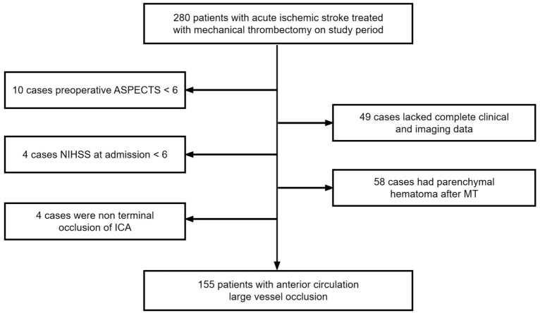
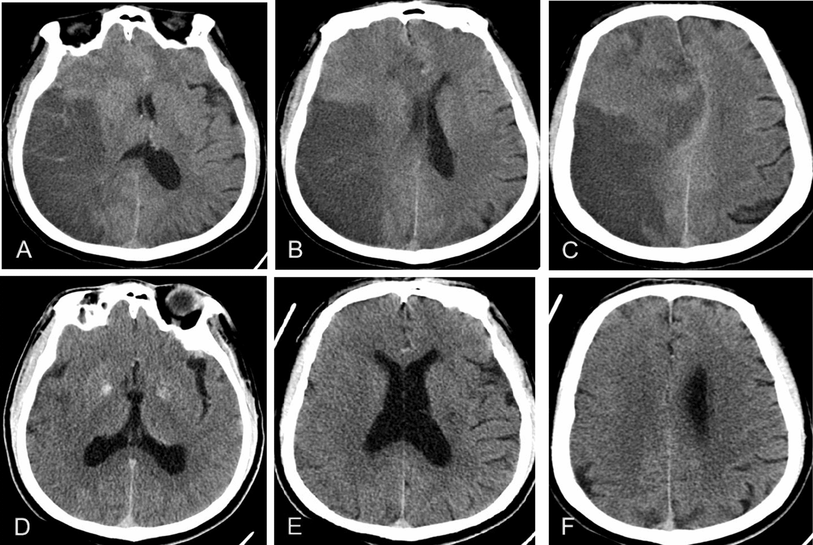
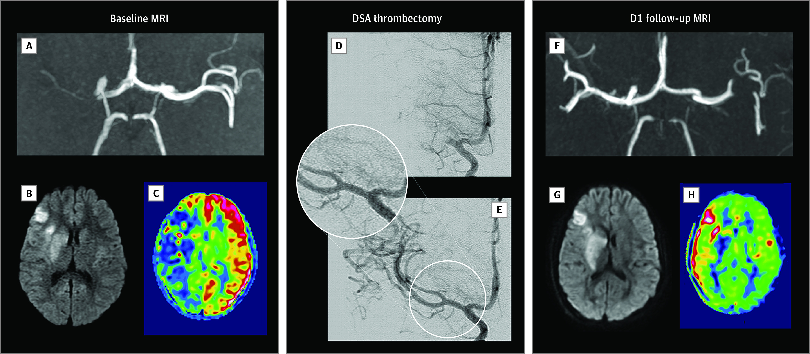
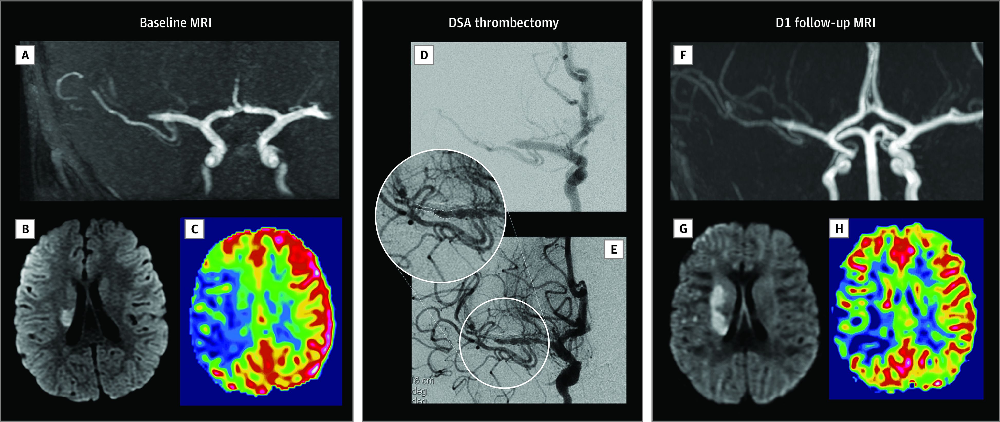
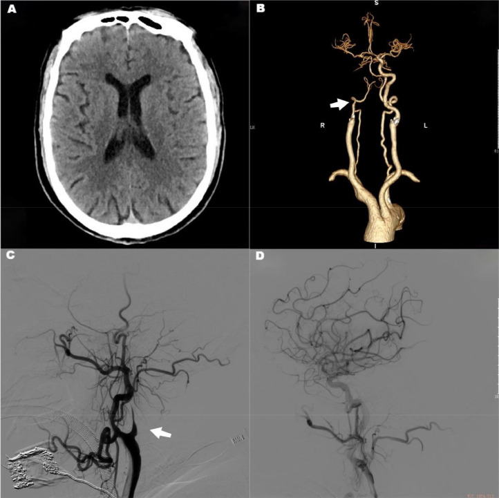
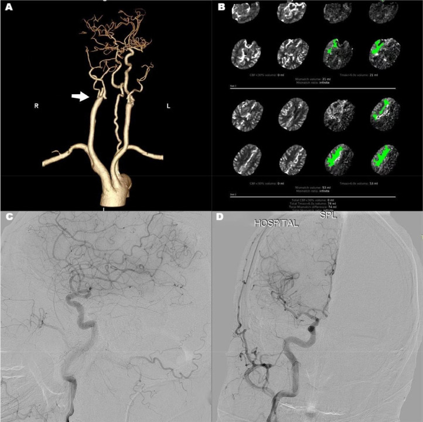
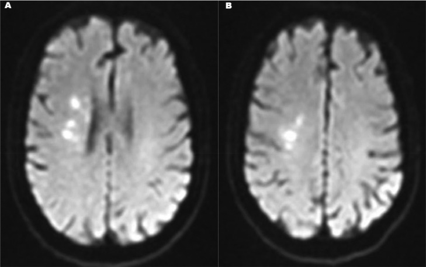
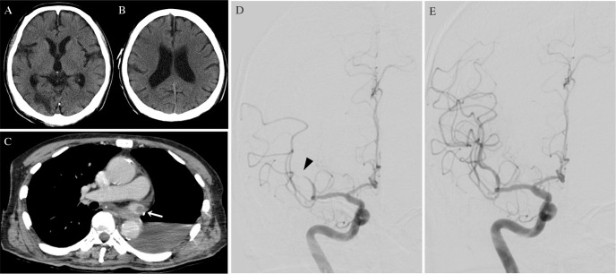
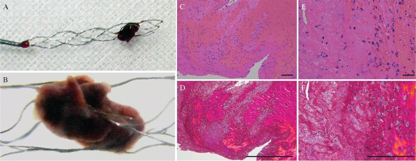
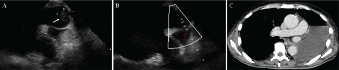

# Case Prep: Mechanical Thrombectomy for Acute Ischemic Stroke (Large Vessel Occlusion)

---

<!-- BEGIN CASE SNAPSHOT -->

## Case / Approach Snapshot

- **Anatomy at risk:** access vessels, arch/cervical anatomy, parent artery branches, perforators, collateral pathways, venous drainage when relevant, and device landing zones.
- **Operative steps:** confirm indication and imaging, obtain access safely, navigate with roadmap control, deploy the planned device or embolic strategy, document final angiography, and define antiplatelet/anticoagulation and postprocedure monitoring; use the detailed operative sequence and approach notes below as the step-by-step source.
- **Rescue plans:** access complication, dissection/perforation, thromboembolism, device malposition or migration, hemorrhage, vasospasm, antiplatelet failure, and conversion to open or staged management.
- **Figures:** review [Figures, Imaging & Video](#figures-imaging--video) and the [Curated Image Set](#curated-image-set); embedded local figures should remain open-access, public-domain, or otherwise reusable with attribution.
- **Papers:** review [High-Yield Literature](#high-yield-literature) for seminal sources, modern reviews, and outcome data specific to this page.

<!-- END CASE SNAPSHOT -->

## One-Liner
[Age]yo [M/F] with acute ischemic stroke from a [left/right] [ICA / M1 / M2 / basilar] large vessel occlusion (NIHSS [__]) planned for emergent mechanical thrombectomy.

---

## Figures, Imaging & Video

**🎥 Operative video** — [search operative video on YouTube ▸](https://www.youtube.com/results?search_query=mechanical+thrombectomy+surgery) · [The Neurosurgical Atlas ▸](https://www.neurosurgicalatlas.com)

[Neurosurgical Atlas](https://www.neurosurgicalatlas.com) · [neuroangio.org](https://neuroangio.org) · [Radiopaedia](https://radiopaedia.org/search?q=mechanical%20thrombectomy&scope=all) · [PubMed Central](https://www.ncbi.nlm.nih.gov/pmc/?term=mechanical+thrombectomy+large+vessel+occlusion) — figures © linked; see [media-sources.md](../../resources/media-sources.md)

---

<!-- BEGIN COMMON PIMP QUESTIONS -->

## Common Pimp Questions

Use these to pressure-test preparation for **Mechanical Thrombectomy for Acute Ischemic Stroke (Large Vessel Occlusion)**:

1. What is the proximal-control plan before the lesion is manipulated?
2. Which branch, perforator, or venous structure is most likely to be injured in this exposure?
3. What are the intraoperative rupture steps, including temporary clip, suction, BP, and backup clip strategy?
4. What confirms treatment success: ICG, Doppler, puncture/deflation, DSA, or postoperative CTA?
5. What postoperative BP, vasospasm, antiplatelet, or anticoagulation issue changes the orders tonight?

<!-- END COMMON PIMP QUESTIONS -->

<!-- BEGIN ATTENDING PREFERENCE VARIABLES -->

## Attending Preference Variables

Items that commonly vary by surgeon or institution:

- **Preferred approach side, sylvian split style, and cisternal-opening sequence:** [attending-specific]
- **Temporary clip threshold, burst-suppression preference, and BP during occlusion:** [attending-specific]
- **Clip manufacturer/shape sequence and whether Doppler, ICG, puncture, or intraop DSA is routine:** [attending-specific]
- **Antiplatelet/anticoagulation reversal and restart timing:** [attending-specific]

<!-- END ATTENDING PREFERENCE VARIABLES -->

<!-- BEGIN CURATED LITERATURE -->

## High-Yield Literature

- **Contemporary Management of Acute Ischemic Stroke** — Ho JP. Annual review of medicine 2025. [PubMed](https://pubmed.ncbi.nlm.nih.gov/39496213/)
- **Acute ischemic stroke: A guideline-based overview of evaluation and management** — Bogenschutz KM. JAAPA : official journal of the American Academy of Physician Assistants 2025. [PubMed](https://pubmed.ncbi.nlm.nih.gov/40197996/)
- **A review of mechanical thrombectomy techniques for acute ischemic stroke** — Munoz A. Interventional neuroradiology : journal of peritherapeutic neuroradiology, surgical procedures and related neurosciences 2023. [PubMed](https://pubmed.ncbi.nlm.nih.gov/35238227/)
- **Indications for Mechanical Thrombectomy for Acute Ischemic Stroke: Current Guidelines and Beyond** — Jadhav AP. Neurology 2021. [PubMed](https://pubmed.ncbi.nlm.nih.gov/34785611/)
- **Management of acute ischemic stroke** — Rigual R. Medicina clinica 2023. [PubMed](https://pubmed.ncbi.nlm.nih.gov/37532617/)
- **Diagnosis and Management of Transient Ischemic Attack and Acute Ischemic Stroke: A Review** — Mendelson SJ. JAMA 2021. [PubMed](https://pubmed.ncbi.nlm.nih.gov/33724327/)
- **Mechanical Thrombectomy for Acute Ischemic Stroke** — Sheth SA. Continuum (Minneapolis, Minn.) 2023. [PubMed](https://pubmed.ncbi.nlm.nih.gov/37039404/)
- **European Stroke Organisation (ESO) - European Society for Minimally Invasive Neurological Therapy (ESMINT) Guidelines on Mechanical Thrombectomy in Acute Ischemic Stroke** — Turc G. Journal of neurointerventional surgery 2023. [PubMed](https://pubmed.ncbi.nlm.nih.gov/30808653/)
- **Thrombus Composition and Efficacy of Thrombolysis and Thrombectomy in Acute Ischemic Stroke** — Jolugbo P. Stroke 2021. [PubMed](https://pubmed.ncbi.nlm.nih.gov/33563020/)
- **Advances in Acute Ischemic Stroke Therapy** — Xiong Y. Circulation research 2022. [PubMed](https://pubmed.ncbi.nlm.nih.gov/35420919/)

<!-- END CURATED LITERATURE -->

---

<!-- BEGIN CURATED IMAGE SET -->

## Curated Image Set

Open-access figures are embedded from PubMed Central articles and kept unique to this guide.

*Fig. 1. Study flow chart of patients and respective exclusion criteria Source: [The risk and outcome of malignant brain edema in post-mechanical thrombectomy: acute ischemic stroke by anterior circulation occlusion](https://pmc.ncbi.nlm.nih.gov/articles/PMC10571427/) — European Journal of Medical Research 2023; CC BY.*

*Fig. 2. Typical images of MBE after MT: 59-year-old man with mTICI score, 2b; and mRS score, 4; A–C post-treatment patient with cerebral edema on CT image; D–F pre-treatment patient without... Source: [The risk and outcome of malignant brain edema in post-mechanical thrombectomy: acute ischemic stroke by anterior circulation occlusion](https://pmc.ncbi.nlm.nih.gov/articles/PMC10571427/) — European Journal of Medical Research 2023; CC BY.*

*Figure 1.. Pediatric Acute Ischemic Stroke of Cardioembolic Origin Treated With Mechanical ThrombectomyAcute ischemic stroke in a child aged 8 years with a clinical history of embolic heart disease... Source: [Recanalization Treatments for Pediatric Acute Ischemic Stroke in France](https://pmc.ncbi.nlm.nih.gov/articles/PMC9478769/) — JAMA Network Open 2022; CC BY.*

*Figure 2.. Pediatric Acute Ischemic Stroke Caused by FCA Treated With Mechanical ThrombectomyAcute ischemic stroke in a child aged 4 years with no medical history, presenting as a sudden left... Source: [Recanalization Treatments for Pediatric Acute Ischemic Stroke in France](https://pmc.ncbi.nlm.nih.gov/articles/PMC9478769/) — JAMA Network Open 2022; CC BY.*

*Fig. 1. The first mechanical thrombectomy, from A–D, showed no low-density lesions on preoperative head CT, occlusion of the right internal carotid artery (arrow), complete recanalization of the... Source: [Two mechanical thrombectomies in acute ischemic stroke within 48 hours: A case report on a patient with atrial fibrillation](https://pmc.ncbi.nlm.nih.gov/articles/PMC10333105/) — Radiology Case Reports 2023; CC BY-NC-ND.*

*Fig. 2. The second mechanical thrombectomy, from A–D, suggested a recurrence of right-side internal carotid artery (arrow) occlusion, a mismatch between CT perfusion ischemia and core infarct... Source: [Two mechanical thrombectomies in acute ischemic stroke within 48 hours: A case report on a patient with atrial fibrillation](https://pmc.ncbi.nlm.nih.gov/articles/PMC10333105/) — Radiology Case Reports 2023; CC BY-NC-ND.*

*Fig. 3. After repeated mechanical thrombectomy, diffusion-weighted imaging (DWI) shows a small infarct area. Source: [Two mechanical thrombectomies in acute ischemic stroke within 48 hours: A case report on a patient with atrial fibrillation](https://pmc.ncbi.nlm.nih.gov/articles/PMC10333105/) — Radiology Case Reports 2023; CC BY-NC-ND.*

*Fig. 1. (A and B) Axial plain computed tomography showing an old infarction in the right occipital lobe and early ischemic change in the right middle frontal gyrus. (C) Axial contrast-enhanced... Source: [Mechanical Thrombectomy for Acute Ischemic Stroke Arising from Thrombus of the Left Superior Pulmonary Vein Stump after Left Pneumonectomy: A Case Report](https://pmc.ncbi.nlm.nih.gov/articles/PMC6350028/) — NMC Case Report Journal 2019; CC BY-NC-ND.*

*Fig. 2. Macroscopic photograph (A and B) and histological findings (C–F) of the retrieved embolus. The retrieved embolus appears as dark-red structure, and considers to be red thrombus (A,... Source: [Mechanical Thrombectomy for Acute Ischemic Stroke Arising from Thrombus of the Left Superior Pulmonary Vein Stump after Left Pneumonectomy: A Case Report](https://pmc.ncbi.nlm.nih.gov/articles/PMC6350028/) — NMC Case Report Journal 2019; CC BY-NC-ND.*

*Fig. 3. Post-operative findings of the imaging studies. Transesophageal echocardiography 6 days after thrombectomy (A) shows thrombus (arrow) in the left superior pulmonary vein stump.... Source: [Mechanical Thrombectomy for Acute Ischemic Stroke Arising from Thrombus of the Left Superior Pulmonary Vein Stump after Left Pneumonectomy: A Case Report](https://pmc.ncbi.nlm.nih.gov/articles/PMC6350028/) — NMC Case Report Journal 2019; CC BY-NC-ND.*

<!-- END CURATED IMAGE SET -->

---

## History of Present Illness
- Chief complaint: Acute focal neurological deficit (hemiparesis, aphasia, gaze deviation, neglect)
- **Last known well (LKW) time** — critical for eligibility; **NIHSS**
- **IV thrombolysis (tPA/TNK) given?** (bridging — thrombectomy still indicated for LVO)
- **Time windows:** early (<6h) by imaging; extended (6-24h) if favorable perfusion/clinical-core mismatch (DAWN/DEFUSE-3)
- Wake-up stroke, contraindications to tPA

---

## Past Medical History
- Atrial fibrillation/cardioembolic source, prior stroke, anticoagulation, vascular risk factors, prior MI
- Renal function (contrast), access anatomy
- Standard PMH; **goals of care / baseline function (mRS)**

---

## Imaging Review
### Non-contrast CT + CTA + (CT perfusion / MRI)
- **NCCT:** exclude hemorrhage, **ASPECTS score** (early ischemic change — low ASPECTS = large established core, less benefit)
- **CTA:** confirm and localize the **LVO** (ICA, M1, M2, basilar, tandem cervical occlusion), collaterals, arch/access
- **CT perfusion / MRI DWI-perfusion:** **core vs penumbra mismatch** (extended window selection — salvageable tissue)

---

## Labs
- POC glucose, **Coags/INR** (if on anticoagulation), CBC, BMP — **do NOT delay thrombectomy** for labs in eligible patients
- Type and screen

---

## Neurological Examination
- **NIHSS**, gaze, language, motor, level of consciousness (basilar — coma); rapid, serial

---

## Surgical Planning

### Case Logistics, OR Needs & Orders
- **Typical bed:** neuro ICU after thrombectomy, with stroke-neurology handoff and reperfusion/BP orders entered before leaving angio.
- **OR setup:** biplane angio suite, thrombectomy catheters/stent retrievers/aspiration, radial/femoral access supplies, anesthesia airway plan, CT/CTA/perfusion images loaded, and bailout stents/balloons available.
- **Special needs:** BP target tied to reperfusion status, anticoagulation/antiplatelet decision, groin/radial closure plan, tPA/tenecteplase history, contrast/renal/allergy plan, and ICU-ready post-recanalization hemorrhage pathway.
- **Immediate postop orders:** NIHSS/neuro checks, puncture-site and distal-pulse checks, BP ceiling per TICI/hemorrhage risk, 24h CT/MRI before antithrombotics when lytic used, swallow screen, statin/secondary prevention, and stroke workup.

### Indication / Time
- **Emergent** — "time is brain"; eligible LVO (ICA/M1, selected M2/basilar) within window with salvageable tissue
- Goal: **reperfusion (TICI 2b-3)** as fast as possible

### Position / Setup
- Supine, angiography table, **femoral (or radial/direct carotid) access**, biplane DSA
- **Anesthesia: conscious sedation vs general** (institutional; avoid BP drops with GA — hypotension worsens penumbra)

### Key Procedure Steps
1. Rapid arterial access (femoral sheath), guide/balloon-guide catheter to the cervical ICA/vertebral
2. Diagnostic run to confirm occlusion and define anatomy
3. Navigate to the clot:
   - **Stent retriever:** cross the clot with microcatheter/wire, deploy stentriever across the thrombus, allow integration, retrieve (often with balloon-guide flow arrest + aspiration)
   - **Aspiration (ADAPT):** large-bore aspiration catheter to the clot face, aspirate
   - Often **combined** (stentriever + aspiration)
4. **Reassess reperfusion** after each pass (TICI grade); repeat passes as needed (balance with futility/complications)
5. Treat **tandem lesions** (cervical ICA stenosis/occlusion — angioplasty/stent) as needed
6. Final angiography (TICI 2b-3 goal), access closure

### Critical Anatomy & Structures at Risk
1. **Occluded artery and distal territory** — reperfusion vs reocclusion/distal embolization to new territory
2. **Vessel wall** — perforation/dissection/SAH (wire/device)
3. **Already-ischemic brain** — **reperfusion hemorrhage** (esp. large core, post-tPA)
4. Access vessels

### Equipment / Team
- Neuroangiography suite, balloon-guide/guide catheters, **stent retrievers, aspiration catheters**, microcatheters/wires
- Angioplasty/stent (tandem), heparin (judicious), contrast
- **Stroke team + neurointervention + anesthesia** (door-to-puncture/recanalization metrics)

### Anesthesia
- Conscious sedation or GA; **strict BP management — avoid hypotension** (penumbra) pre-reperfusion; after reperfusion, **lower BP target** (reduce hemorrhage)

### Potential Complications
1. **Symptomatic intracranial hemorrhage / reperfusion hemorrhage**, vessel perforation/SAH, dissection
2. **Distal/new-territory embolization**, reocclusion, failed reperfusion
3. Access complications, contrast nephropathy, futile recanalization (large core)

---

## Procedure Note Template
**Preoperative Diagnosis:** Acute ischemic stroke from [left/right] [ICA/M1/M2/basilar] large-vessel occlusion (NIHSS [__])

**Postoperative Diagnosis:** Same

**Procedure:** Mechanical thrombectomy of [vessel] occlusion — [stent retriever / aspiration / combined], [N] passes, final [TICI __]

**Operator / Assistant:**
**Anesthesia:** [Conscious sedation / general]
**Access:** [Right femoral/radial] sheath
**Contrast / Fluoro time:**
**Devices:** [Stent retriever / aspiration catheter / balloon-guide]
**Complications:** None

**Indications:** [Age]yo [M/F] with an acute [vessel] LVO (NIHSS [__], ASPECTS [__], LKW [time], [tPA given]) and [favorable core/penumbra] — emergent thrombectomy indicated. Risks (reperfusion hemorrhage, perforation, distal embolization) discussed.

**Description of Procedure:** After time-out (expedited for stroke), [conscious sedation] with strict BP management (avoiding hypotension pre-reperfusion) was provided and rapid arterial access obtained. A [balloon-]guide catheter was advanced to the cervical [ICA/vertebral] and a diagnostic run confirmed the [vessel] occlusion. The clot was crossed and **[a stent retriever deployed and retrieved with flow arrest/aspiration / direct aspiration performed]**; reperfusion was reassessed after each pass ([N] passes). [A tandem cervical lesion was treated with angioplasty/stent.]

**Final angiography demonstrated [TICI __] reperfusion** without distal embolization. Catheters were removed and the access closed.

The patient was transferred to the NSICU/stroke unit with a **lowered BP target post-reperfusion**; a 24h NCCT was planned before antithrombotics.

---

## Post-Procedure Plan
- **NSICU/stroke unit**, neuro checks q15min→hourly, NIHSS
- **BP management** (post-reperfusion target lower, e.g., < 160-180 or per recanalization status; avoid extremes), access/pulse checks
- **NCCT at ~24h** (and for any deterioration) — hemorrhage before starting/restarting antithrombotics; tPA patients delay antithrombotics 24h
- Stroke workup (etiology — echo, telemetry/AF, vessel imaging, labs), start secondary prevention (antiplatelet/anticoagulation per cause and bleed status)
- DVT prophylaxis (after hemorrhage excluded), dysphagia screen, early rehab, goals of care
