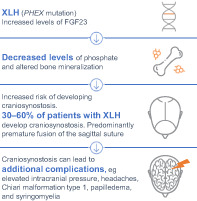
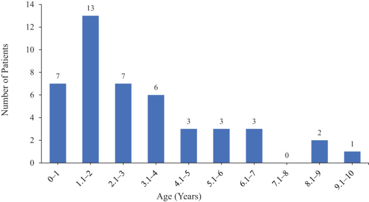
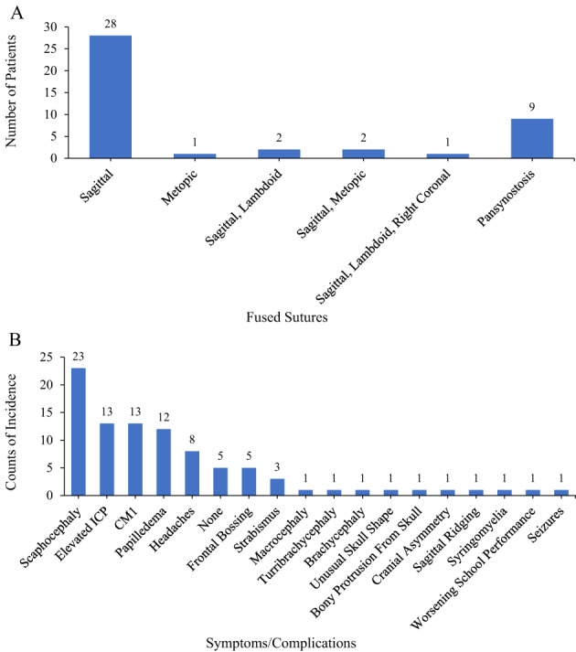
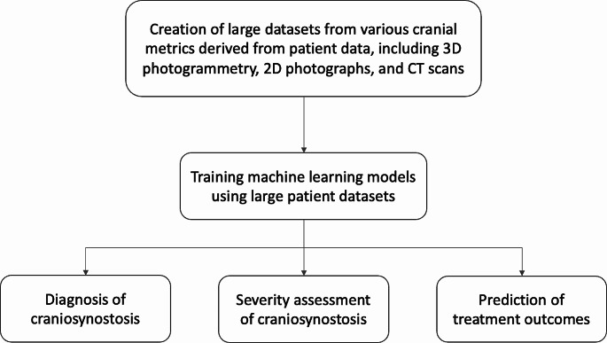
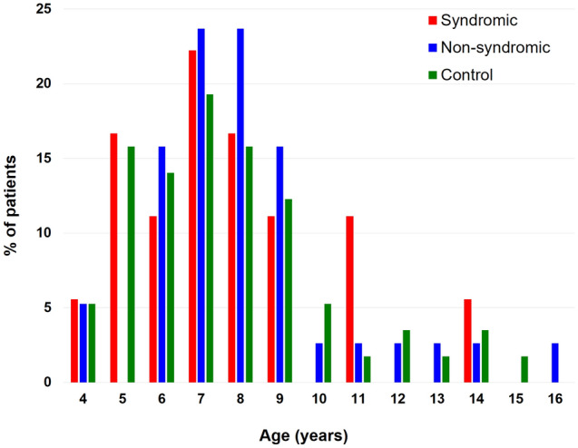
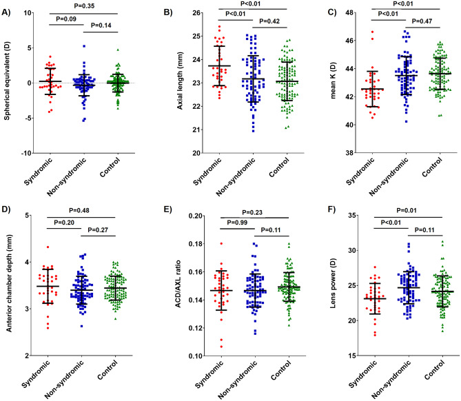
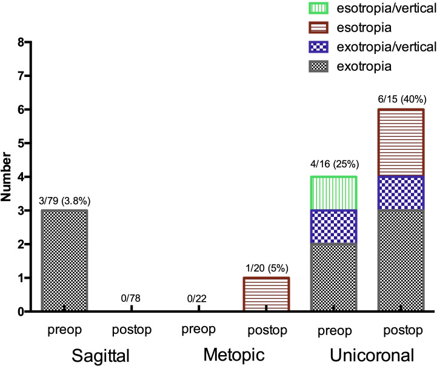
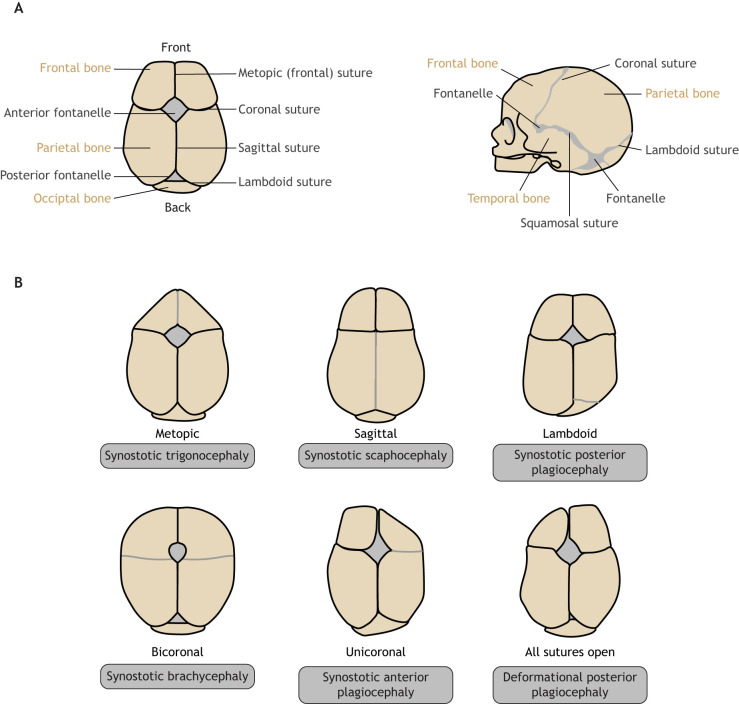

# Case Prep: Craniosynostosis Repair

---

<!-- BEGIN CASE DOSSIER -->

## Case / Approach Dossier

- **Anatomy at risk:** age-specific skull/soft tissue, developing brain and tracts, CSF pathways, brainstem/lower cranial nerves, tumor or congenital lesion relationships, and blood-volume constraints.
- **Operative steps:** adapt positioning/anesthesia to age, confirm imaging and goals with family, expose gently, preserve neurovascular/CSF pathways, reconstruct durably for growth, and plan ICU/endocrine/rehab surveillance; use the detailed operative sequence and approach notes below as the step-by-step source.
- **Rescue plans:** blood loss, hypothermia, swelling, hydrocephalus, airway/swallowing issues, endocrine/electrolyte shifts, infection, and staged therapy with oncology or rehab teams.
- **Figures:** review [Figures, Imaging & Video](#figures-imaging--video) and the [Curated Image Set](#curated-image-set); embedded local figures should remain open-access, public-domain, or otherwise reusable with attribution.
- **Papers:** review [High-Yield Literature](#high-yield-literature) for seminal sources, modern reviews, and outcome data specific to this page.
- **Textbook cross-checks:** use [Textbook Cross-Checks](#textbook-cross-checks) and the [Source Crosswalk](../../resources/source-crosswalk.md) to cite copyrighted textbooks/atlases while summarizing in original words.

<!-- END CASE DOSSIER -->

## One-Liner
[Age — months] [M/F] infant with [sagittal / metopic / unicoronal / bicoronal / lambdoid] craniosynostosis [± syndromic] planned for [endoscopic strip craniectomy + helmet / open cranial vault remodeling].

---

## Figures, Imaging & Video

**🎥 Operative video** — [search operative video on YouTube ▸](https://www.youtube.com/results?search_query=craniosynostosis+surgery) · [The Neurosurgical Atlas ▸](https://www.neurosurgicalatlas.com)

[Neurosurgical Atlas](https://www.neurosurgicalatlas.com) · [Radiopaedia](https://radiopaedia.org/search?q=craniosynostosis&scope=all) · [PubMed Central](https://www.ncbi.nlm.nih.gov/pmc/?term=craniosynostosis+cranial+vault+remodeling) — operative figures © linked; see [media-sources.md](../../resources/media-sources.md)

---

<!-- BEGIN TEXTBOOK CROSS-CHECKS -->

## Textbook Cross-Checks

- **Functional/pediatric anatomy:** Youmans and Winn; Schmidek and Sweet; Greenberg — confirm targets, trajectories, cranial nerve/brainstem/tract relationships, and age-specific anatomy.
- **Technique sequence:** Schmidek and Sweet; Youmans and Winn — review positioning, monitoring/mapping, exposure or stereotactic workflow, and closure/device management.
- **Complication rescue:** Greenberg; specialty literature — summarize neurologic, CSF, hemorrhagic, infectious, airway/swallowing, and hardware-related contingencies in original language.
- **Copyright-safe use:** cite these sources as private cross-checks, then write the guide content in original words; do not re-host textbook pages, figures, tables, or board-review card material. See [Source Crosswalk & Copyright-Safe Use](../../resources/source-crosswalk.md).

<!-- END TEXTBOOK CROSS-CHECKS -->

<!-- BEGIN CURATED LITERATURE -->

## High-Yield Literature

- **Craniosynostosis - Recognition, clinical characteristics, and treatment** — Kajdic N. Bosnian journal of basic medical sciences 2018. [PubMed](https://pubmed.ncbi.nlm.nih.gov/28623672/)
- **The clinical manifestations, molecular mechanisms and treatment of craniosynostosis** — Stanton E. Disease models & mechanisms 2022. [PubMed](https://pubmed.ncbi.nlm.nih.gov/35451466/)
- **Craniosynostosis** — Governale LS. Pediatric neurology 2015. [PubMed](https://pubmed.ncbi.nlm.nih.gov/26371995/)
- **Syndromic Craniosynostosis** — Sawh-Martinez R. Clinics in plastic surgery 2019. [PubMed](https://pubmed.ncbi.nlm.nih.gov/30851747/)
- **Nonsyndromic Craniosynostosis** — Dempsey RF. Clinics in plastic surgery 2019. [PubMed](https://pubmed.ncbi.nlm.nih.gov/30851746/)
- **Craniosynostosis** — Kabbani H. American family physician 2004. [PubMed](https://pubmed.ncbi.nlm.nih.gov/15222651/)
- **Craniosynostosis: A Pediatric Neurologist's Perspective** — Shruthi NM. Journal of pediatric neurosciences 2022. [PubMed](https://pubmed.ncbi.nlm.nih.gov/36388006/)
- **FGFR Craniosynostosis Syndromes Overview** — Adam MP. 1993. [PubMed](https://pubmed.ncbi.nlm.nih.gov/20301628/)
- **Imaging in craniosynostosis: when and what?** — Massimi L. Child's nervous system : ChNS : official journal of the International Society for Pediatric Neurosurgery 2019. [PubMed](https://pubmed.ncbi.nlm.nih.gov/31289853/)
- **Craniosynostosis and oculomotor disorders** — Dalmas F. Neuro-Chirurgie 2020. [PubMed](https://pubmed.ncbi.nlm.nih.gov/31866515/)

<!-- END CURATED LITERATURE -->

---

<!-- BEGIN CURATED IMAGE SET -->

## Curated Image Set

Open-access figures are embedded from PubMed Central articles and kept unique to this guide.

*Figure 1. Source: [Craniosynostosis in Patients With X‐Linked Hypophosphatemia: A Review](https://pmc.ncbi.nlm.nih.gov/articles/PMC10184010/) — JBMR Plus. 2023 Mar 14;7(5):e10728. doi: 10.1002/jbm4.10728; CC BY.*

*Fig. 2. Age distribution of craniosynostosis diagnosis in patients with XLH identified in this review. Note, the age of craniosynostosis diagnosis was not reported for all patients; this... Source: [Craniosynostosis in Patients With X‐Linked Hypophosphatemia: A Review](https://pmc.ncbi.nlm.nih.gov/articles/PMC10184010/) — JBMR Plus 2023; CC BY.*

*Fig. 3. (A) Distribution of fused sutures and (B) distribution of symptoms/complications in craniosynostosis in patients with XLH identified in this review. Note, the sutures fused were not... Source: [Craniosynostosis in Patients With X‐Linked Hypophosphatemia: A Review](https://pmc.ncbi.nlm.nih.gov/articles/PMC10184010/) — JBMR Plus 2023; CC BY.*

*Fig. 2. Flow diagram depicting the method of extracting data, training models, and its use in craniosynostosis Source: [Machine learning applications in craniosynostosis diagnosis and treatment prediction: a systematic review](https://pmc.ncbi.nlm.nih.gov/articles/PMC11269440/) — Child's Nervous System 2024; CC BY.*

*Figure 1. Age distribution of the syndromic craniosynostosis, non-syndromic craniosynostosis, and control groups. Source: [Ocular biometric features of pediatric patients with fibroblast growth factor receptor-related syndromic craniosynostosis](https://pmc.ncbi.nlm.nih.gov/articles/PMC7969619/) — Scientific Reports 2021; CC BY.*

*Figure 2. Comparison of biometric values between the syndromic craniosynostosis, non-syndromic craniosynostosis, and control groups. The distribution of (A) spherical equivalent, (B) axial length,... Source: [Ocular biometric features of pediatric patients with fibroblast growth factor receptor-related syndromic craniosynostosis](https://pmc.ncbi.nlm.nih.gov/articles/PMC7969619/) — Scientific Reports 2021; CC BY.*

*Figure 1. Prevalence of strabismus preoperatively and postoperatively in sagittal, unicoronal and metopic non-syndromic craniosynostosis. Source: [Ophthalmological findings in children with non-syndromic craniosynostosis: preoperatively and postoperatively up to 12 months after surgery](https://pmc.ncbi.nlm.nih.gov/articles/PMC8076926/) — BMJ Open Ophthalmology 2021; CC BY.*

*Figure 8. Source: [Ophthalmological findings in children with non-syndromic craniosynostosis: preoperatively and postoperatively up to 12 months after surgery](https://pmc.ncbi.nlm.nih.gov/articles/PMC8076926/) — BMJ Open Ophthalmol. 2021 Apr 25;6(1):e000677. doi: 10.1136/bmjophth-2020-000677; CC BY.*

*Figure 9. Source: [Ophthalmological findings in children with non-syndromic craniosynostosis: preoperatively and postoperatively up to 12 months after surgery](https://pmc.ncbi.nlm.nih.gov/articles/PMC8076926/) — BMJ Open Ophthalmol. 2021 Apr 25;6(1):e000677. doi: 10.1136/bmjophth-2020-000677; CC BY.*

*Fig. 1.. Cranial sutures and craniosynostosis in humans. (A) A normal human infant skull shown from above (left) and human infant skull shown from the side (right). (B) Skull deformities caused... Source: [The clinical manifestations, molecular mechanisms and treatment of craniosynostosis](https://pmc.ncbi.nlm.nih.gov/articles/PMC9044212/) — Disease Models & Mechanisms 2022; CC BY.*

<!-- END CURATED IMAGE SET -->

---

## History of Present Illness
- Chief complaint: Abnormal head shape since birth, ridging over suture, ± raised ICP (multisuture/syndromic)
- **Suture and head shape:**
  - **Sagittal** → scaphocephaly (long, narrow) — most common
  - **Metopic** → trigonocephaly (triangular forehead, hypotelorism)
  - **Unicoronal** → anterior plagiocephaly (forehead flattening, harlequin orbit)
  - **Bicoronal** → brachycephaly (often syndromic)
  - **Lambdoid** → posterior plagiocephaly (rare; distinguish from positional)
- Syndromic (Apert, Crouzon, Pfeiffer, Saethre-Chotzen, Muenke) — multisuture, raised ICP, midface
- Developmental milestones, signs of raised ICP

---

## Past Medical History
- Syndromic features (limbs, midface, airway — Apert/Crouzon), genetics
- Airway issues (syndromic), feeding, OSA
- Birth/developmental history

---

## Imaging Review
### CT head with 3D reconstruction
- Confirm fused suture(s), head shape, exclude other sutures, ventricles, Chiari (lambdoid/syndromic), raised ICP signs (copper-beaten skull)
### MRI (selective)
- Chiari, hydrocephalus, brain anomalies (syndromic)
### Ophthalmology
- Papilledema (raised ICP)

---

## Labs
- **CBC, type and CROSSMATCH (blood loss can be significant in infants)**, coagulation
- Pre-op anesthesia/age-appropriate

---

## Examination
- Head shape/circumference, suture ridging, fontanelle, neurological/developmental, eyes, syndromic features

---

## Surgical Planning

### Procedure Selection
- **Endoscopic strip craniectomy:** age **< 3-6 months** (younger = better — relies on rapid brain growth + postoperative **molding helmet**); minimal blood loss, short stay; for single-suture (esp. sagittal)
- **Open cranial vault remodeling (CVR) / fronto-orbital advancement (FOA):** older infants (typically 6-12 months), syndromic, multisuture, significant deformity; FOA for coronal/metopic (forehead/orbit); more blood loss, longer surgery
- Spring-assisted / distraction (select centers)

### Position
- Endoscopic sagittal: prone or modified prone/sphinx; Open: supine (FOA) or prone (posterior); careful infant positioning/padding/thermoregulation

### Key Surgical Steps
- **Endoscopic strip craniectomy (sagittal):** small incision(s), subgaleal/subperiosteal dissection, endoscopic dissection of the epidural plane, **remove the fused suture strip** (± lateral barrel-stave osteotomies/wedges), control sagittal sinus/bleeding, closure; **helmet therapy starts ~1-2 weeks post-op for months**
- **Open CVR/FOA:** bicoronal incision, scalp flap, **craniotomies to remove and remodel bone**, fronto-orbital bar advancement (FOA), reshape and refix vault with resorbable plates/sutures, expand the constricted dimension; meticulous hemostasis (blood loss)

### Critical Anatomy & Structures at Risk
1. **Superior sagittal sinus** (sagittal/under the strip) — **major bleeding risk in a small infant**
2. **Dura** (tears, especially syndromic/older), **bridging veins**
3. **Orbit/globe, supraorbital nerves** (FOA), frontal lobes
4. Blood volume — **infants have small total blood volume; significant relative blood loss**

### Equipment
- Endoscope + endoscopic craniectomy set OR open craniotomy/remodeling set
- **Resorbable fixation plates/sutures**, high-speed drill/craniotome
- **Crossmatched blood (have in room), cell saver, tranexamic acid**, hemostatic agents
- Molding helmet plan (endoscopic), thermoregulation

### Monitoring
- Arterial line (open/blood loss), invasive monitoring; precordial Doppler (VAE — sinus exposure)

### Anesthesia
- **Arterial line, large-bore IV/central access, crossmatched blood ready, TXA**, careful infant fluid/thermoregulation, **VAE precautions** (sagittal sinus), blood loss vigilance

### Potential Complications
1. **Hemorrhage / blood loss** (transfusion usually needed in open; lower in endoscopic)
2. **Venous air embolism** (sinus exposure)
3. Dural tear/CSF leak, sagittal sinus injury
4. Under/over-correction, need for revision, raised ICP persistence (syndromic)
5. Infection, hardware issues, helmet compliance (endoscopic)

---

## Operative Note Template
**Preoperative Diagnosis:** [Sagittal/metopic/unicoronal/bicoronal] craniosynostosis [± syndromic]

**Postoperative Diagnosis:** Same

**Procedure:** [Endoscopic-assisted strip craniectomy for sagittal synostosis / Open cranial vault remodeling with fronto-orbital advancement]

**Surgeon / Assistant:** Neurosurgery + craniofacial/plastics
**Anesthesia:** General endotracheal
**EBL / Fluids / Blood products:** [crossmatched in room; TXA; cell saver]
**Adjuncts:** [Endoscope] / craniotome, resorbable fixation; arterial line; VAE precautions (precordial Doppler)
**Implants:** Resorbable plates/sutures
**Complications:** None

**Indications:** [Age — months] infant with [suture] synostosis ([head-shape]); [endoscopic strip chosen given age < 3–6 months with planned helmet / open CVR-FOA given older age/deformity]. Risks (blood loss/transfusion, VAE, dural tear) discussed.

**Description of Procedure:** After consent and time-out, general anesthesia was induced with arterial access, crossmatched blood in the room, and TXA; VAE precautions were observed. [Endoscopic: a small incision, subgaleal/epidural endoscopic dissection, and **removal of the fused sagittal suture strip** (± barrel-stave wedges) with sagittal-sinus/bleeding control.] [Open: a bicoronal incision and scalp flap, craniotomies to **remove and remodel the vault with fronto-orbital bar advancement**, reshaping and refixing with resorbable plates.] Meticulous hemostasis was maintained given the infant blood volume.

Closure was performed. The patient was transferred to the [PICU/floor] with Hgb/transfusion monitoring; [helmet therapy was planned ~1–2 weeks post-op for the endoscopic case].

---

## Postoperative Plan
- PICU (open/blood loss) or floor (endoscopic), neuro checks, **monitor Hgb/transfusion needs**
- Facial/periorbital swelling (FOA — eyes may swell shut, reassure), head dressing
- **Helmet therapy ~1-2 weeks post-op (endoscopic)** for several months; helmet/orthotist referral
- Pain control, feeding, thermoregulation
- Craniofacial team follow-up, genetics (syndromic), ophthalmology, head shape/circumference surveillance
- Long-term: monitor for raised ICP, reossification, need for revision (syndromic)
