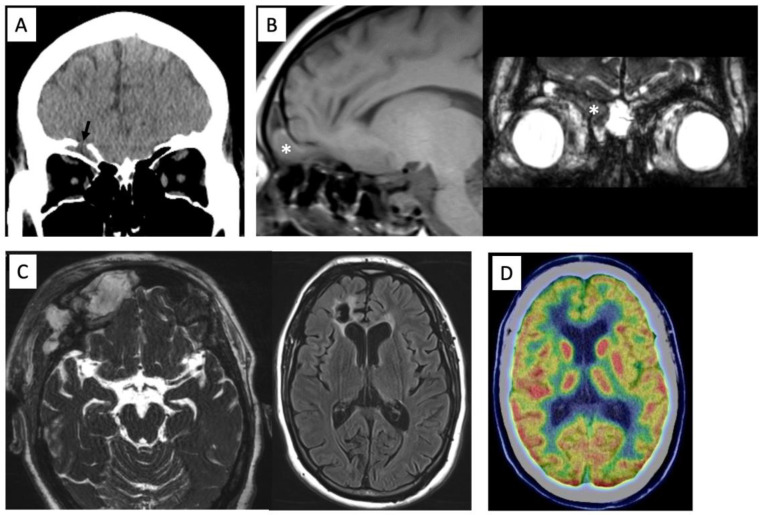
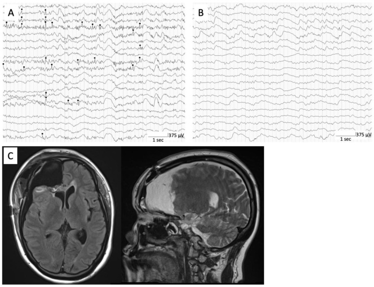
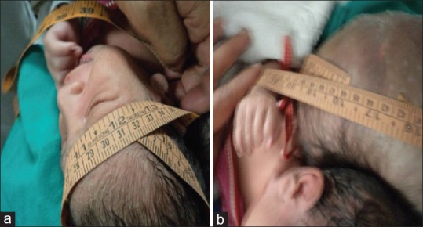

# Case Prep: Encephalocele Repair

<!-- BEGIN CASE SNAPSHOT -->

## Case / Approach Snapshot

- **Anatomy at risk:** age-specific skull/soft tissue, developing brain and tracts, CSF pathways, brainstem/lower cranial nerves, tumor or congenital lesion relationships, and blood-volume constraints.
- **Operative steps:** adapt positioning/anesthesia to age, confirm imaging and goals with family, expose gently, preserve neurovascular/CSF pathways, reconstruct durably for growth, and plan ICU/endocrine/rehab surveillance; use the detailed operative sequence and approach notes below as the step-by-step source.
- **Rescue plans:** blood loss, hypothermia, swelling, hydrocephalus, airway/swallowing issues, endocrine/electrolyte shifts, infection, and staged therapy with oncology or rehab teams.
- **Figures:** review [Figures, Imaging & Video](#figures-imaging--video) and the [Curated Image Set](#curated-image-set); embedded local figures should remain open-access, public-domain, or otherwise reusable with attribution.
- **Papers:** review [High-Yield Literature](#high-yield-literature) for seminal sources, modern reviews, and outcome data specific to this page.

<!-- END CASE SNAPSHOT -->

## One-Liner
[Age — newborn/infant] [M/F] with a [occipital / frontoethmoidal (sincipital) / basal / parietal] encephalocele planned for microsurgical repair and multilayer closure [± skull base reconstruction].

---

## Figures, Imaging & Video

**🎥 Operative video** — [search operative video on YouTube ▸](https://www.youtube.com/results?search_query=encephalocele+surgery) · [The Neurosurgical Atlas ▸](https://www.neurosurgicalatlas.com)

[Neurosurgical Atlas](https://www.neurosurgicalatlas.com) · [Radiopaedia](https://radiopaedia.org/search?q=encephalocele&scope=all) · [PubMed Central](https://www.ncbi.nlm.nih.gov/pmc/?term=encephalocele+repair) — operative figures © linked; see [media-sources.md](../../resources/media-sources.md)

---

<!-- BEGIN CURATED LITERATURE -->

## High-Yield Literature

- **Posterior Encephalocele** — Society for Maternal-Fetal Medicine. American journal of obstetrics and gynecology 2020. [PubMed](https://pubmed.ncbi.nlm.nih.gov/33168216/)
- **Frontoethmoidal encephalocele. Report of a case** — Horcajadas A. Neurocirugia 2019. [PubMed](https://pubmed.ncbi.nlm.nih.gov/29610064/)
- **Occipital Encephalocele: Cause, Incidence, Neuroimaging and Surgical Management** — Markovic I. Current pediatric reviews 2020. [PubMed](https://pubmed.ncbi.nlm.nih.gov/31656152/)
- **Occipital encephalocele associated with Dandy-Walker malformation: a case-based review** — Gutierrez F. Child's nervous system : ChNS : official journal of the International Society for Pediatric Neurosurgery 2022. [PubMed](https://pubmed.ncbi.nlm.nih.gov/35588332/)
- **Hydrocephalus in encephalocele** — Akyol ME. European review for medical and pharmacological sciences 2022. [PubMed](https://pubmed.ncbi.nlm.nih.gov/35993634/)
- **Quadrigeminal arachnoid cyst with perinatal encephalocele** — Akutagawa K. Child's nervous system : ChNS : official journal of the International Society for Pediatric Neurosurgery 2020. [PubMed](https://pubmed.ncbi.nlm.nih.gov/32328704/)
- **Anterior encephalocele** — Rapport RL 2nd. Journal of neurosurgery 1981. [PubMed](https://pubmed.ncbi.nlm.nih.gov/7452336/)
- **Encephalocele** — Jowi JO. East African medical journal 2009. [PubMed](https://pubmed.ncbi.nlm.nih.gov/19894466/)
- **ENCEPHALOCELE** — ACERS TE. Archives of ophthalmology (Chicago, Ill. : 1960) 1965. [PubMed](https://pubmed.ncbi.nlm.nih.gov/14220612/)
- **[Frontoethmoidal encephalocele]** — Parada Vásquez RH. Medicina clinica 2016. [PubMed](https://pubmed.ncbi.nlm.nih.gov/26971979/)

<!-- END CURATED LITERATURE -->

<!-- BEGIN CURATED IMAGE SET -->

## Curated Image Set

Open-access figures are embedded from PubMed Central articles and kept unique to this guide.

*Figure 1. Preoperative computed tomography showing the anterior skull base defect (arrow) (A). MR images showing a prolapsed right rectal gyrus into the frontal sinus on T1-weighted image and... Source: [Frontal Encephalocele Plus Epilepsy: A Case Report and Review of the Literature](https://pmc.ncbi.nlm.nih.gov/articles/PMC9857174/) — Brain Sciences 2023; CC BY.*

*Figure 2. Intraoperative ECoG showing interictal epileptiform discharges (black circle) at right frontal lateral cortex (A). Postoperative intraoperative ECoG showing no obvious interictal... Source: [Frontal Encephalocele Plus Epilepsy: A Case Report and Review of the Literature](https://pmc.ncbi.nlm.nih.gov/articles/PMC9857174/) — Brain Sciences 2023; CC BY.*

*Figure 1. (a) The occipito-frontal circumference was 31 cm and (b) encephalocele circumference was 45 cm Source: [A giant occipital encephalocele with spontaneous hemorrhage into the sac: A rare case report](https://pmc.ncbi.nlm.nih.gov/articles/PMC4323900/) — Asian Journal of Neurosurgery 2014; CC BY-NC-SA.*

<!-- END CURATED IMAGE SET -->

---

## History of Present Illness
- Chief complaint: Congenital midline skull defect with herniation of [meninges (meningocele) / brain + meninges (encephalocele/meningoencephalocele)]
- **Location:**
  - **Occipital** (most common in Western populations) — posterior, may contain brain/venous sinuses
  - **Frontoethmoidal/sincipital** (common in SE Asia) — nasofrontal/nasoethmoidal/naso-orbital, facial deformity
  - **Basal** (transethmoidal/sphenoidal) — intranasal mass, CSF leak, may be occult
- Size, skin coverage (CSF leak/ulceration risk), neurological function, feeding/airway (basal/nasal)
- Associated: hydrocephalus, Chiari, other anomalies (Meckel-Gruber, amniotic band), syndromic

---

## Past Medical History / Birth
- Prenatal diagnosis, mode of delivery, maternal folate, gestational age
- Associated anomalies/syndrome, hydrocephalus, airway/feeding (basal)
- Latex precautions
- Standard neonatal history

---

## Imaging Review
### MRI brain (+ MRV)
- **Contents of the sac** (brain — eloquent/functional? gliotic? — vs CSF only), **venous sinuses within the sac** (occipital — torcula/transverse may herniate; MRV critical), brain malformations, hydrocephalus, Chiari
### CT (bone, 3D)
- **Bony defect** size/location, skull base anatomy (basal/frontoethmoidal — reconstruction planning), orbital/nasal anatomy

---

## Labs
- CBC, BMP, **type and crossmatch** (neonatal blood volume, venous sinus bleeding risk), Coags
- Latex-free

---

## Examination
- Sac (size, skin coverage, transillumination, leak), neuro exam, head circumference/fontanelle, associated anomalies, airway (basal)

---

## Surgical Planning

### Case Logistics, OR Needs & Orders
- **OR setup:** pediatric anesthesia/equipment, warming, weight-based implants/antibiotics, navigation/endoscope/microscope as needed, blood availability for tumor/myelomeningocele cases, and family-centered postop handoff.
- **Special needs:** weight-based fluids/meds, latex allergy precautions for myelomeningocele, steroid/endocrine/DI plan when sellar/posterior fossa risk exists, EVD/CSF diversion plan, and age-appropriate neuro baseline.
- **Immediate postop orders:** PICU/step-down neuro checks, airway/swallow monitoring when relevant, CT/MRI timing, drain/EVD/shunt orders, antibiotics/steroid taper, pain control, wound/skin precautions, and PT/OT/rehab planning.

### Diagnosis & Indication / Timing
- Indication: Repair to protect herniated tissue, prevent CSF leak/meningitis, correct deformity; **urgent if ruptured/leaking/thin skin**; elective otherwise once stable
- **Assess sac contents** — non-functional gliotic tissue can be excised; **functional brain or critical venous sinuses must be preserved/reduced** (not sacrificed)
- Hydrocephalus often coexists → may need CSF diversion (before/after — untreated hydrocephalus → repair breakdown/leak)

### Position
- Per location (prone for occipital; supine for frontoethmoidal/basal — may need craniofacial/ENT/transnasal), neonatal padding/thermoregulation, latex-free

### Key Surgical Steps
1. **Approach the defect** (skin incision around the sac / bicoronal for frontoethmoidal / endoscopic endonasal for selected basal)
2. Open the sac, **inspect contents**: reduce viable/functional neural tissue and venous structures back intracranially; **excise only non-functional gliotic tissue**
3. **Identify and preserve dural venous sinuses** (occipital — torcula/transverse can be in the sac; injury → catastrophic hemorrhage)
4. **Watertight dural closure** (primary or graft) over the reduced contents
5. **Bony/skull base reconstruction** — repair the bony defect (autograft/graft/titanium per age; cartilage/bone for skull base); for frontoethmoidal correct the orbital/nasal deformity (craniofacial)
6. **Multilayer closure** to prevent CSF leak (dura, pericranium/fascia, bone, soft tissue, skin); vascularized pericranial/nasoseptal flap for skull base
7. Address hydrocephalus (EVD/shunt/ETV) per status

### Critical Anatomy & Structures at Risk
1. **Dural venous sinuses** (occipital — torcula/transverse/sagittal) — major hemorrhage
2. **Functional brain tissue** within the sac (preserve/reduce)
3. **Skull base / CSF spaces** (leak), orbit/optic apparatus/nasal structures (frontoethmoidal/basal)
4. Neonatal blood volume

### Equipment
- Microscope (± endoscope for basal), neonatal/micro instruments, fine bipolar
- Dural substitute, pericranial/vascularized flap, bone/skull base reconstruction materials, sealant
- **Crossmatched blood**, thermoregulation, latex-free; craniofacial/ENT team (frontoethmoidal/basal)

### Monitoring
- Neonatal anesthesia monitoring; VAE precautions (venous sinus exposure)

### Anesthesia
- Neonatal general, **crossmatched blood (sinus bleeding)**, thermoregulation/fluid/glucose, latex-free, VAE precautions

### Potential Complications
1. **Hemorrhage** (venous sinus), **CSF leak / meningitis** (closure integrity)
2. **Hydrocephalus** (progressive — many need shunt/ETV; monitor), neurological deficit (functional tissue)
3. Wound breakdown, cosmetic/deformity issues, recurrence; visual/nasal issues (anterior)

---

## Operative Note Template
**Preoperative Diagnosis:** [Occipital/frontoethmoidal/basal/parietal] encephalocele

**Postoperative Diagnosis:** Same

**Procedure:** Repair of [location] encephalocele with multilayer dural and skull base reconstruction [± deformity correction / CSF diversion]

**Surgeon / Assistant:** [± craniofacial/ENT for frontoethmoidal/basal]
**Anesthesia:** Neonatal general endotracheal, latex-free, thermoregulation
**EBL / Fluids / Blood products:** [crossmatched — venous sinus risk]
**Adjuncts:** Microscope [± endoscope], pericranial/vascularized flap, skull base reconstruction materials; VAE precautions
**Complications:** None

**Indications:** [Age] infant with a [location] encephalocele; repair to protect herniated tissue, prevent CSF leak/meningitis, and correct deformity. Risks (venous sinus hemorrhage, CSF leak, hydrocephalus) discussed with family.

**Description of Procedure:** After consent and time-out, neonatal anesthesia was induced (latex-free, warming, crossmatched blood) with VAE precautions. The defect was approached [per location], the sac opened, and the **contents inspected** — viable/functional neural tissue and venous structures were **reduced intracranially** while **non-functional gliotic tissue was excised**; the **dural venous sinuses were identified and preserved**. A **watertight dural closure** was performed over the reduced contents, the **bony/skull base defect reconstructed** [graft/titanium per age; vascularized flap for skull base], and a **multilayer soft-tissue/skin closure** completed. [Hydrocephalus was addressed with EVD/shunt/ETV per status.]

The infant was transferred to the NICU with head-circumference/US monitoring and CSF-leak precautions.

---

## Postoperative Plan
- NICU/PICU, positioning to protect the repair, neuro checks, **head circumference/fontanelle and head US (hydrocephalus)**
- CSF leak/wound monitoring, latex-free
- **CSF diversion (shunt/ETV) if hydrocephalus progresses** (common — can precipitate repair breakdown if untreated)
- MRI postop, craniofacial/ENT follow-up (frontoethmoidal/basal), genetics if syndromic
- Developmental follow-up, multidisciplinary care

<!-- BEGIN CHIEF LEVEL TAKEAWAYS -->

## Chief-Level Case Review

Use these as the senior-level mental model for **Encephalocele Repair**:

- **Decision point:** The setup is age-specific: blood volume, warming, positioning pressure, airway, latex risk, family counseling, and ICU/PICU handoff differ from adults.
- **Technical lever:** Preserve future options: growth, shunt dependence, cranioplasty/bone healing, endocrine/neurocognitive trajectory, and adjuvant therapy influence today’s choices.
- **Bailout:** Have a complication script: blood loss, CSF leak, hydrocephalus, wound breakdown, posterior fossa mutism, infection, and airway/swallow risk should be anticipated.
- **Postop watch:** Postop communication matters: family expectations, neurologic baseline, therapy needs, school/developmental supports, and surveillance imaging/labs should be clear.

<!-- END CHIEF LEVEL TAKEAWAYS -->

<!-- BEGIN COMMON PIMP QUESTIONS -->

## Common Pimp Questions

Use these to pressure-test preparation for **Encephalocele Repair**:

1. What age-specific anatomy, blood volume, temperature, and positioning issue changes the plan?
2. What is the neurologic, developmental, or syndromic baseline?
3. What skin, wound, CSF, or infection risk is highest in this child?
4. What family-facing expectation should be clarified before surgery?
5. What postop bed, feeding, pain, imaging, and activity plan is safest?

<!-- END COMMON PIMP QUESTIONS -->

<!-- BEGIN ATTENDING PREFERENCE VARIABLES -->

## Attending Preference Variables

Items that commonly vary by surgeon or institution:

- **Blood availability threshold, warming strategy, antibiotic dosing, and Foley/drain use:** [attending-specific]
- **Positioning aids, pinning versus horseshoe, and skin-prep preference:** [attending-specific]
- **Family update cadence and expected ICU/floor disposition:** [attending-specific]
- **Postop feeding, pain regimen, wound care, and activity restrictions:** [attending-specific]

<!-- END ATTENDING PREFERENCE VARIABLES -->
