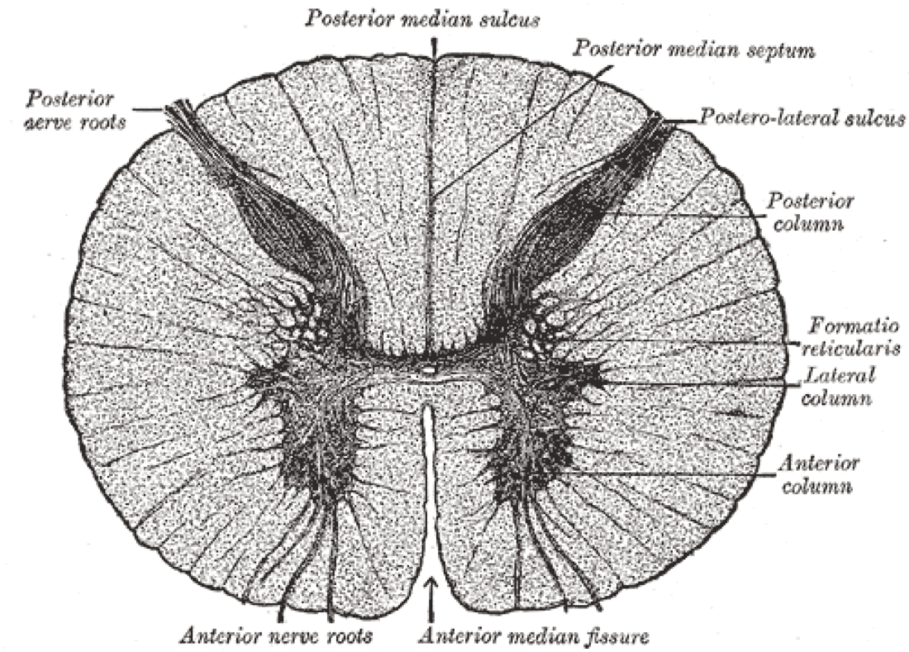

# Case Prep: Myelomeningocele Repair (Open Neural Tube Defect Closure)

---

## One-Liner
[Newborn / __ -day-old] [M/F] neonate with a [lumbar/lumbosacral/thoracic] myelomeningocele planned for [postnatal] microsurgical repair and multilayer closure [within 48-72 hours of birth] [or note prior fetal repair].

---

## Figures, Imaging & Video
[Neurosurgical Atlas](https://www.neurosurgicalatlas.com) · [Radiopaedia](https://radiopaedia.org/search?q=myelomeningocele&scope=all) · [PubMed Central](https://www.ncbi.nlm.nih.gov/pmc/?term=myelomeningocele+repair) — operative figures © linked; see [media-sources.md](../../resources/media-sources.md)

*Gray's Anatomy (1918), public domain — via Wikimedia Commons.*

---

## History of Present Illness
- Open neural tube defect identified [prenatally on ultrasound/MRI and elevated maternal AFP / at birth]
- **Fetal repair** (MOMS trial — in utero closure reduces hydrocephalus/shunt rate and improves motor outcomes) vs postnatal repair
- Level of lesion (predicts motor/functional outcome), leaking CSF, neurological function of legs, anal tone
- Associated: **Chiari II malformation, hydrocephalus**, clubfoot, neurogenic bladder

---

## Past Medical History / Birth
- Prenatal course, mode of delivery (C-section to protect placode)
- Maternal folate, gestational age, other anomalies
- Latex precautions from birth (high latex allergy risk in spina bifida)

---

## Imaging Review
### MRI brain and spine
- **Chiari II** (hindbrain herniation), hydrocephalus, ventricular size, the neural placode, level, associated cord anomalies (syrinx, diastematomyelia)
### Head ultrasound
- Ventricular size (hydrocephalus — many need shunt/ETV, often staged after closure)

---

## Labs
- CBC, BMP, type and screen (neonatal), coagulation
- **Strict latex-free environment**

---

## Neurological Examination
- Spontaneous leg movement, response to stimulation (motor level), anal wink/tone, reflexes, head circumference, fontanelle, document baseline

---

## Surgical Planning

### Goals & Timing
- Goals: Reconstitute the neural tube (untether/reposition placode into the canal), achieve watertight dural closure, multilayer soft tissue coverage to prevent CSF leak/infection/meningitis and preserve function
- Timing: within **48-72 hours** of birth (reduces infection/ventriculitis) if not repaired in utero

### Position
- **Prone**, neonatal padding/thermoregulation (warmer, careful), rolls, protect the exposed placode (keep moist, sterile, no pressure preop), latex-free

### Key Surgical Steps
1. Examine the defect: central **neural placode**, surrounding **arachnoid/dura**, then epithelialized skin junction
2. **Dissect the placode free** circumferentially at the junction of neural tissue and the surrounding membrane/skin (the zona epitheliosa) — release tethering, excise non-neural epithelial tissue (prevents inclusion dermoid)
3. **Reconstitute the placode** — "neurulate" by approximating the pia/placode edges into a tube (pial reapproximation) to reduce retethering
4. Place the neural tube back into the spinal canal
5. **Dural closure** — dissect dura from surrounding fascia, close in a watertight layer over the placode
6. **Fascial/myofascial layer** — mobilize paraspinal fascia, close as additional watertight layer
7. **Skin closure** — undermine skin, close (may need relaxing incisions or plastics flaps for large defects)
8. Avoid tight closure/tension; ensure no CSF leak

### Critical Anatomy & Structures at Risk
1. **Neural placode / functional neural tissue** — preserve all functional tissue (handle gently, stimulate to identify)
2. Nerve roots from the placode
3. **Watertight dura** (CSF leak/meningitis), skin viability (large defects)
4. Avoid leaving epithelial elements (dermoid/retethering)

### Equipment
- Microscope, microsurgical/neonatal instruments, fine bipolar
- Nerve stimulator, dural substitute (if needed), fine suture
- **Latex-free everything**, neonatal warming, plastics backup (large defects)

### Monitoring
- Neonatal anesthesia monitoring; optional EMG

### Anesthesia
- Neonatal general anesthesia, thermoregulation, **latex-free**, careful fluid/glucose, prone neonatal precautions

### Potential Complications
1. **CSF leak / wound breakdown / meningitis** (closure integrity)
2. **Hydrocephalus** (progressive — many need shunt/ETV after closure; monitor head circumference/ventricles)
3. **Symptomatic Chiari II** (stridor, apnea, swallowing — may need decompression)
4. Retethering (later), skin necrosis, infection
5. Neurological function fixed by lesion level (closure preserves, rarely improves)

---

## Operative Note Template
**Preoperative Diagnosis:** [Lumbosacral] myelomeningocele (open neural tube defect)

**Postoperative Diagnosis:** Same

**Procedure:** Microsurgical repair of [lumbosacral] myelomeningocele with neurulation and multilayer (dural, fascial, skin) closure

**Surgeon / Assistant:**
**Anesthesia:** Neonatal general endotracheal, latex-free, thermoregulation
**EBL / Fluids:**
**Adjuncts:** Microscope, nerve stimulator, [plastics for large defects]
**Implants:** [Dural substitute if needed]
**Complications:** None

**Indications:** Newborn with a [lumbosacral] myelomeningocele [not repaired in utero], repaired within 48–72h to prevent infection/ventriculitis and preserve function. Latex precautions from birth. Risks (CSF leak, hydrocephalus, Chiari II) discussed with family.

**Description of Procedure:** After consent and time-out, neonatal general anesthesia was induced (latex-free, warming) and the infant positioned prone with the placode protected. Under the microscope, the **neural placode was dissected circumferentially free at the junction with the surrounding membrane/skin (zona epitheliosa)**, and **non-neural epithelial tissue excised** (to prevent inclusion dermoid). The placode was **reconstituted by pial reapproximation (neurulation)** and returned into the spinal canal.

The dura was dissected and closed in a **watertight layer**, followed by a **myofascial layer**, and the skin closed [with relaxing incisions/flaps for the large defect], avoiding tension. No CSF leak was evident.

The infant was transferred to the NICU prone/side-lying with serial head-circumference/US monitoring (hydrocephalus) and a multidisciplinary spina bifida plan.

---

## Postoperative Plan
- NICU, **prone/side-lying positioning** (protect closure, off the back)
- Monitor wound for CSF leak/breakdown, **serial head circumference and head US (hydrocephalus)**
- Watch for Chiari II symptoms (stridor, apnea, feeding) — may need urgent intervention
- Latex-free, neurogenic bladder management (urology — CIC), orthopedics (feet/hips), multidisciplinary spina bifida team
- **Plan for CSF diversion (VP shunt/ETV) if hydrocephalus progresses** (often ~1-2 weeks)
- Long-term: tethered cord surveillance, developmental follow-up
