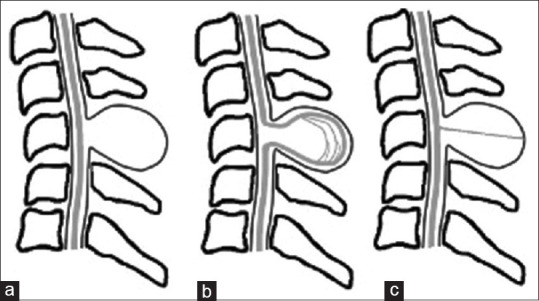
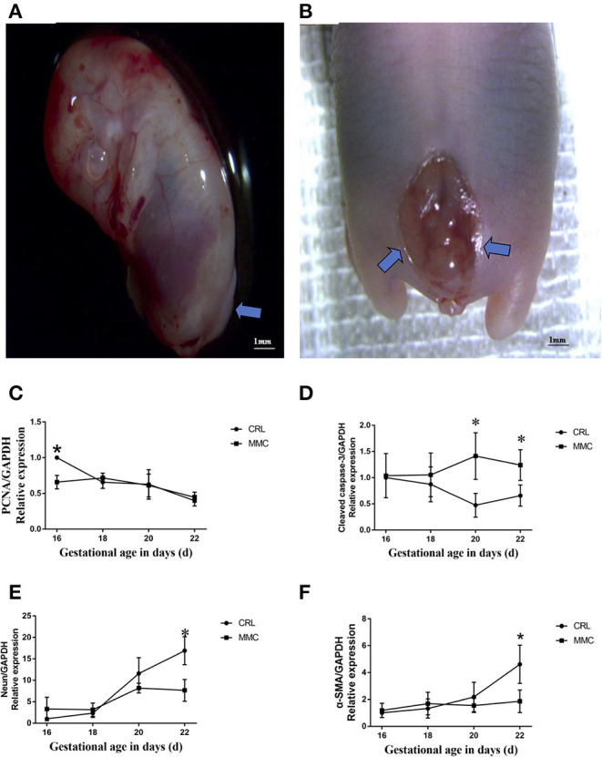
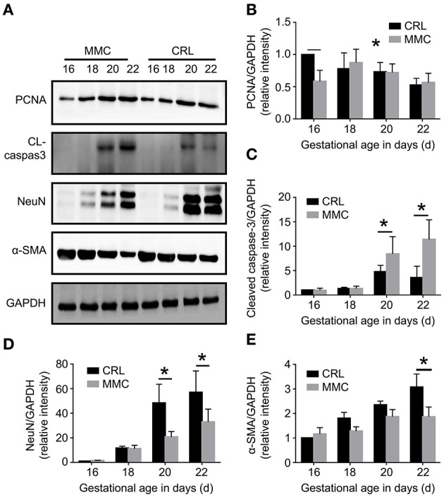
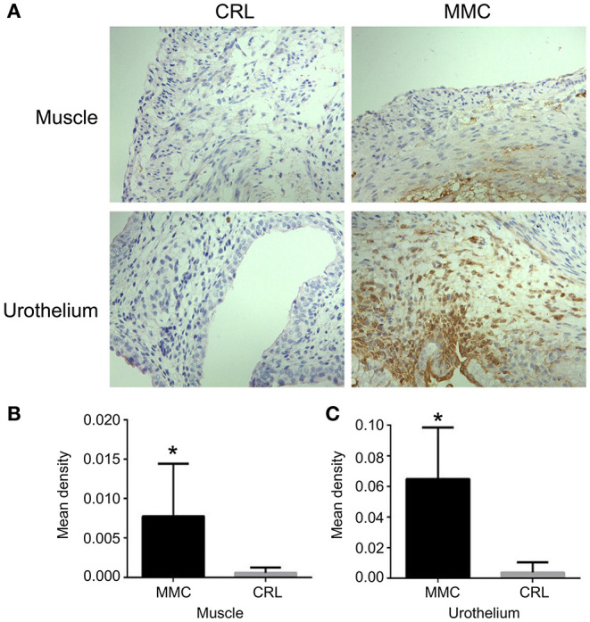
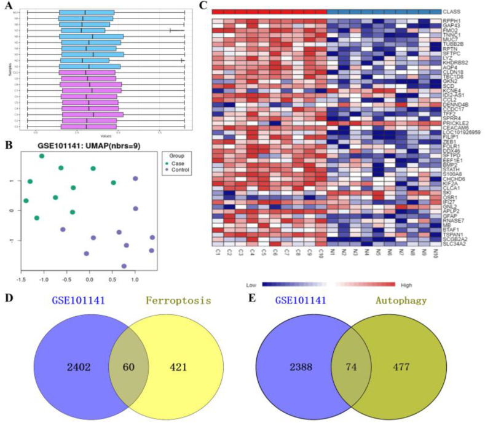
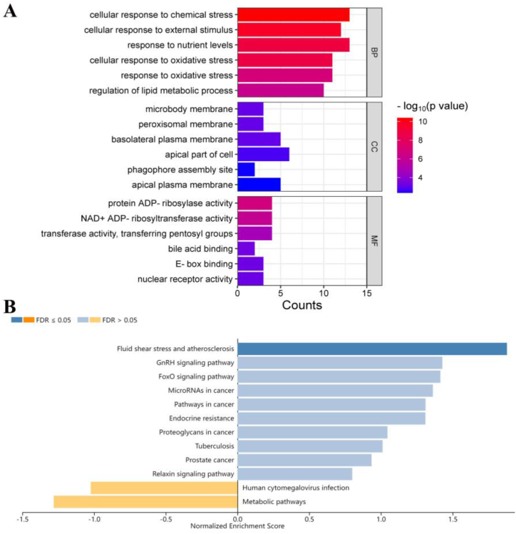
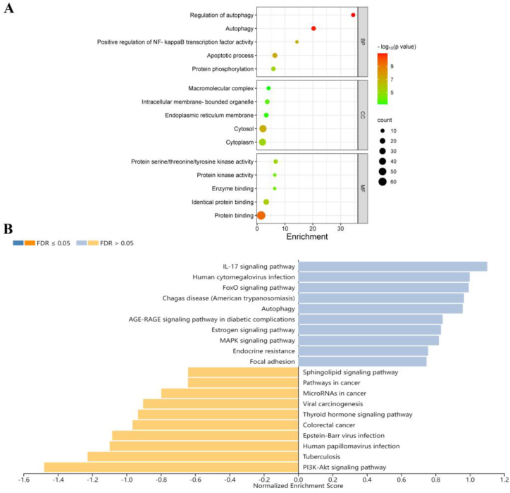
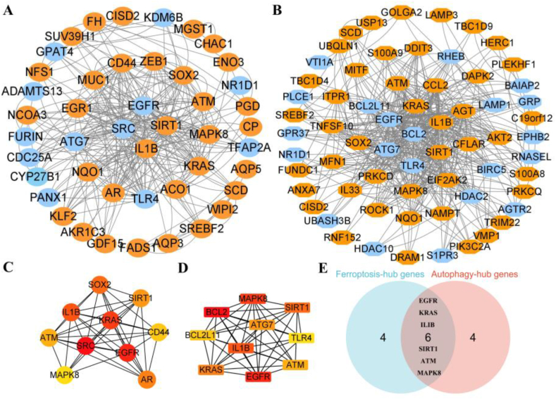
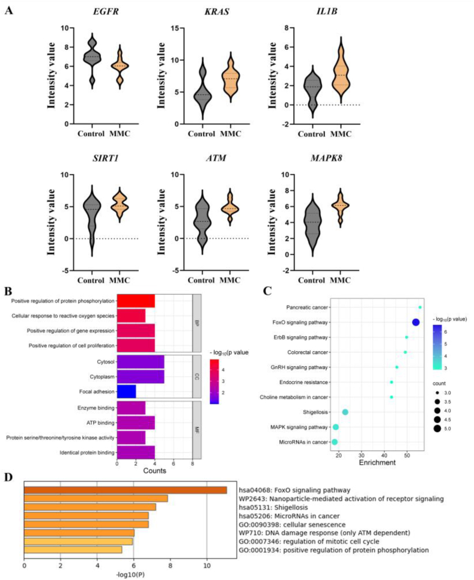
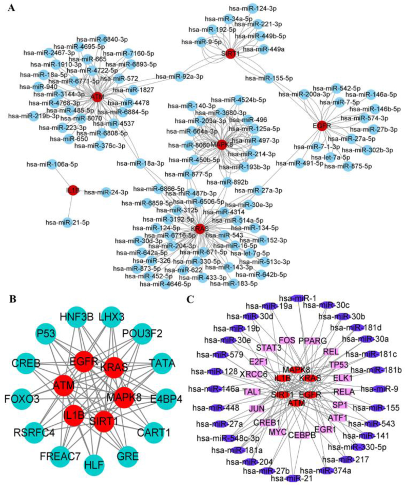

# Case Prep: Myelomeningocele Repair (Open Neural Tube Defect Closure)

---

<!-- BEGIN CASE SNAPSHOT -->

## Case / Approach Snapshot

- **Anatomy at risk:** age-specific skull/soft tissue, developing brain and tracts, CSF pathways, brainstem/lower cranial nerves, tumor or congenital lesion relationships, and blood-volume constraints.
- **Operative steps:** adapt positioning/anesthesia to age, confirm imaging and goals with family, expose gently, preserve neurovascular/CSF pathways, reconstruct durably for growth, and plan ICU/endocrine/rehab surveillance; use the detailed operative sequence and approach notes below as the step-by-step source.
- **Rescue plans:** blood loss, hypothermia, swelling, hydrocephalus, airway/swallowing issues, endocrine/electrolyte shifts, infection, and staged therapy with oncology or rehab teams.
- **Figures:** review [Figures, Imaging & Video](#figures-imaging--video) and the [Curated Image Set](#curated-image-set); embedded local figures should remain open-access, public-domain, or otherwise reusable with attribution.
- **Papers:** review [High-Yield Literature](#high-yield-literature) for seminal sources, modern reviews, and outcome data specific to this page.

<!-- END CASE SNAPSHOT -->

## One-Liner
[Newborn / __ -day-old] [M/F] neonate with a [lumbar/lumbosacral/thoracic] myelomeningocele planned for [postnatal] microsurgical repair and multilayer closure [within 48-72 hours of birth] [or note prior fetal repair].

---

## Figures, Imaging & Video

**🎥 Operative video** — [search operative video on YouTube ▸](https://www.youtube.com/results?search_query=myelomeningocele+surgery) · [The Neurosurgical Atlas ▸](https://www.neurosurgicalatlas.com)

[Neurosurgical Atlas](https://www.neurosurgicalatlas.com) · [Radiopaedia](https://radiopaedia.org/search?q=myelomeningocele&scope=all) · [PubMed Central](https://www.ncbi.nlm.nih.gov/pmc/?term=myelomeningocele+repair) — operative figures © linked; see [media-sources.md](../../resources/media-sources.md)

---

<!-- BEGIN CURATED LITERATURE -->

## High-Yield Literature

- **Myelomeningocele** — Karsonovich T. 2026. [PubMed](https://pubmed.ncbi.nlm.nih.gov/31536302/)
- **Update on prenatal diagnosis and fetal surgery for myelomeningocele** — Meller C. Archivos argentinos de pediatria 2021. [PubMed](https://pubmed.ncbi.nlm.nih.gov/34033426/)
- **The Management of Myelomeningocele Study: full cohort 30-month pediatric outcomes** — Farmer DL. American journal of obstetrics and gynecology 2018. [PubMed](https://pubmed.ncbi.nlm.nih.gov/29246577/)
- **Fetal myelomeningocele repair** — Yamashiro KJ. Seminars in pediatric surgery 2019. [PubMed](https://pubmed.ncbi.nlm.nih.gov/31451171/)
- **Open myelomeningocele** — Hahn YS. Neurosurgery clinics of North America 1995. [PubMed](https://pubmed.ncbi.nlm.nih.gov/7620350/)
- **Myelomeningocele closure: A review and decision-making guidance** — Ghadban E. JPRAS open 2025. [PubMed](https://pubmed.ncbi.nlm.nih.gov/41280468/)
- **Reflections upon the intrauterine repair of myelomeningocele** — Talamonti G. Child's nervous system : ChNS : official journal of the International Society for Pediatric Neurosurgery 2024. [PubMed](https://pubmed.ncbi.nlm.nih.gov/38514517/)
- **Myelomeningocele with Associated Anomalies – Case Report and Literature Review** — Kitov B. Folia medica 2019. [PubMed](https://pubmed.ncbi.nlm.nih.gov/32337935/)
- **Fetal myelomeningocele repair: a narrative review of the history, current controversies and future directions** — Yamashiro KJ. Translational pediatrics 2021. [PubMed](https://pubmed.ncbi.nlm.nih.gov/34189108/)
- **Hydrocephalus in myelomeningocele** — Cavalheiro S. Child's nervous system : ChNS : official journal of the International Society for Pediatric Neurosurgery 2021. [PubMed](https://pubmed.ncbi.nlm.nih.gov/34435215/)

<!-- END CURATED LITERATURE -->

---

<!-- BEGIN CURATED IMAGE SET -->

## Curated Image Set

Open-access figures are embedded from PubMed Central articles and kept unique to this guide.

*Figure 1. Classification of cervical myelomeningocele and meningocele. (a) Fibrovascular or neuroglial tissue protruding from the posterior surface of the spinal cord attached to the sac wall. (b)... Source: [Prenatal Diagnosis and Outcomes of Cervical Meningocele and Myelomeningocele](https://pmc.ncbi.nlm.nih.gov/articles/PMC11040477/) — Journal of Medical Ultrasound 2024; CC BY-NC-SA.*

*Figure 1. Representative photographs of spinal cord in fetuses with lumbosacral myelomeningocele. (A) E16, neural tube closure failed, nerve tissue is exposed dorsally and protrudes above the skin... Source: [The Mechanism of Bladder Injury in Fetal Rats With Myelomeningocele](https://pmc.ncbi.nlm.nih.gov/articles/PMC9218472/) — Frontiers in Neurology 2022; CC BY.*

*Figure 2. Cell proliferation, apoptosis, and neuromuscular development-related protein changes in fetal rat bladder at E16–E22. (A) Expression of PCNA, cleaved caspase-3, NeuN, and a-SMA proteins... Source: [The Mechanism of Bladder Injury in Fetal Rats With Myelomeningocele](https://pmc.ncbi.nlm.nih.gov/articles/PMC9218472/) — Frontiers in Neurology 2022; CC BY.*

*Figure 3. Expression and distribution of bladder cleaved caspase-3 at E22. (A) The distribution of cleaved caspase-3 at E22. (B) The expression of cleaved caspase-3 in the bladder muscle layer was... Source: [The Mechanism of Bladder Injury in Fetal Rats With Myelomeningocele](https://pmc.ncbi.nlm.nih.gov/articles/PMC9218472/) — Frontiers in Neurology 2022; CC BY.*

*Fig. 1. Identification of DEGs in the GSE101141 GEO dataset. A Normalization of the GSE101141 dataset was performed using Log2 transformation: N, Control; C, myelomeningocele; B UMAP plot; C... Source: [Identification of potential key ferroptosis- and autophagy-related genes in myelomeningocele through bioinformatics analysis](https://pmc.ncbi.nlm.nih.gov/articles/PMC11040124/) — Heliyon 2024; CC BY-NC.*

*Fig. 2. Functional enrichment analysis of ferroptosis-related DEGs. A GO enrichment analysis of ferroptosis-related DEGs using SRplot: BP, biological process; CC, cellular component; MF,... Source: [Identification of potential key ferroptosis- and autophagy-related genes in myelomeningocele through bioinformatics analysis](https://pmc.ncbi.nlm.nih.gov/articles/PMC11040124/) — Heliyon 2024; CC BY-NC.*

*Fig. 3. Functional enrichment analysis of autophagy-related DEGs. A GO enrichment analysis of autophagy-related DEGs using DAVID and SRplot: BP, biological process; CC, cellular component; MF,... Source: [Identification of potential key ferroptosis- and autophagy-related genes in myelomeningocele through bioinformatics analysis](https://pmc.ncbi.nlm.nih.gov/articles/PMC11040124/) — Heliyon 2024; CC BY-NC.*

*Fig. 4. PPI analysis of ferroptosis- and autophagy-related DEGs. A and B PPI analysis of ferroptosis- and autophagy-related DEGs: orange, upregulated genes; blue, downregulated genes; C and D... Source: [Identification of potential key ferroptosis- and autophagy-related genes in myelomeningocele through bioinformatics analysis](https://pmc.ncbi.nlm.nih.gov/articles/PMC11040124/) — Heliyon 2024; CC BY-NC.*

*Fig. 5. Expression and function enrichment of candidate genes. A Expression of candidate genes from GSE101141; B and C GO and KEGG enrichment analyses of candidate genes using DAVID and SRplot:... Source: [Identification of potential key ferroptosis- and autophagy-related genes in myelomeningocele through bioinformatics analysis](https://pmc.ncbi.nlm.nih.gov/articles/PMC11040124/) — Heliyon 2024; CC BY-NC.*

*Fig. 6. Interaction network among miRNAs, TFs, and candidate genes. A Interaction network between candidate genes and targeted miRNAs: red, candidate genes; blue, miRNA; B Interaction network of... Source: [Identification of potential key ferroptosis- and autophagy-related genes in myelomeningocele through bioinformatics analysis](https://pmc.ncbi.nlm.nih.gov/articles/PMC11040124/) — Heliyon 2024; CC BY-NC.*

<!-- END CURATED IMAGE SET -->

---

## History of Present Illness
- Open neural tube defect identified [prenatally on ultrasound/MRI and elevated maternal AFP / at birth]
- **Fetal repair** (MOMS trial — in utero closure reduces hydrocephalus/shunt rate and improves motor outcomes) vs postnatal repair
- Level of lesion (predicts motor/functional outcome), leaking CSF, neurological function of legs, anal tone
- Associated: **Chiari II malformation, hydrocephalus**, clubfoot, neurogenic bladder

---

## Past Medical History / Birth
- Prenatal course, mode of delivery (C-section to protect placode)
- Maternal folate, gestational age, other anomalies
- Latex precautions from birth (high latex allergy risk in spina bifida)

---

## Imaging Review
### MRI brain and spine
- **Chiari II** (hindbrain herniation), hydrocephalus, ventricular size, the neural placode, level, associated cord anomalies (syrinx, diastematomyelia)
### Head ultrasound
- Ventricular size (hydrocephalus — many need shunt/ETV, often staged after closure)

---

## Labs
- CBC, BMP, type and screen (neonatal), coagulation
- **Strict latex-free environment**

---

## Neurological Examination
- Spontaneous leg movement, response to stimulation (motor level), anal wink/tone, reflexes, head circumference, fontanelle, document baseline

---

## Surgical Planning

### Goals & Timing
- Goals: Reconstitute the neural tube (untether/reposition placode into the canal), achieve watertight dural closure, multilayer soft tissue coverage to prevent CSF leak/infection/meningitis and preserve function
- Timing: within **48-72 hours** of birth (reduces infection/ventriculitis) if not repaired in utero

### Position
- **Prone**, neonatal padding/thermoregulation (warmer, careful), rolls, protect the exposed placode (keep moist, sterile, no pressure preop), latex-free

### Key Surgical Steps
1. Examine the defect: central **neural placode**, surrounding **arachnoid/dura**, then epithelialized skin junction
2. **Dissect the placode free** circumferentially at the junction of neural tissue and the surrounding membrane/skin (the zona epitheliosa) — release tethering, excise non-neural epithelial tissue (prevents inclusion dermoid)
3. **Reconstitute the placode** — "neurulate" by approximating the pia/placode edges into a tube (pial reapproximation) to reduce retethering
4. Place the neural tube back into the spinal canal
5. **Dural closure** — dissect dura from surrounding fascia, close in a watertight layer over the placode
6. **Fascial/myofascial layer** — mobilize paraspinal fascia, close as additional watertight layer
7. **Skin closure** — undermine skin, close (may need relaxing incisions or plastics flaps for large defects)
8. Avoid tight closure/tension; ensure no CSF leak

### Critical Anatomy & Structures at Risk
1. **Neural placode / functional neural tissue** — preserve all functional tissue (handle gently, stimulate to identify)
2. Nerve roots from the placode
3. **Watertight dura** (CSF leak/meningitis), skin viability (large defects)
4. Avoid leaving epithelial elements (dermoid/retethering)

### Equipment
- Microscope, microsurgical/neonatal instruments, fine bipolar
- Nerve stimulator, dural substitute (if needed), fine suture
- **Latex-free everything**, neonatal warming, plastics backup (large defects)

### Monitoring
- Neonatal anesthesia monitoring; optional EMG

### Anesthesia
- Neonatal general anesthesia, thermoregulation, **latex-free**, careful fluid/glucose, prone neonatal precautions

### Potential Complications
1. **CSF leak / wound breakdown / meningitis** (closure integrity)
2. **Hydrocephalus** (progressive — many need shunt/ETV after closure; monitor head circumference/ventricles)
3. **Symptomatic Chiari II** (stridor, apnea, swallowing — may need decompression)
4. Retethering (later), skin necrosis, infection
5. Neurological function fixed by lesion level (closure preserves, rarely improves)

---

## Operative Note Template
**Preoperative Diagnosis:** [Lumbosacral] myelomeningocele (open neural tube defect)

**Postoperative Diagnosis:** Same

**Procedure:** Microsurgical repair of [lumbosacral] myelomeningocele with neurulation and multilayer (dural, fascial, skin) closure

**Surgeon / Assistant:**
**Anesthesia:** Neonatal general endotracheal, latex-free, thermoregulation
**EBL / Fluids:**
**Adjuncts:** Microscope, nerve stimulator, [plastics for large defects]
**Implants:** [Dural substitute if needed]
**Complications:** None

**Indications:** Newborn with a [lumbosacral] myelomeningocele [not repaired in utero], repaired within 48–72h to prevent infection/ventriculitis and preserve function. Latex precautions from birth. Risks (CSF leak, hydrocephalus, Chiari II) discussed with family.

**Description of Procedure:** After consent and time-out, neonatal general anesthesia was induced (latex-free, warming) and the infant positioned prone with the placode protected. Under the microscope, the **neural placode was dissected circumferentially free at the junction with the surrounding membrane/skin (zona epitheliosa)**, and **non-neural epithelial tissue excised** (to prevent inclusion dermoid). The placode was **reconstituted by pial reapproximation (neurulation)** and returned into the spinal canal.

The dura was dissected and closed in a **watertight layer**, followed by a **myofascial layer**, and the skin closed [with relaxing incisions/flaps for the large defect], avoiding tension. No CSF leak was evident.

The infant was transferred to the NICU prone/side-lying with serial head-circumference/US monitoring (hydrocephalus) and a multidisciplinary spina bifida plan.

---

## Postoperative Plan
- NICU, **prone/side-lying positioning** (protect closure, off the back)
- Monitor wound for CSF leak/breakdown, **serial head circumference and head US (hydrocephalus)**
- Watch for Chiari II symptoms (stridor, apnea, feeding) — may need urgent intervention
- Latex-free, neurogenic bladder management (urology — CIC), orthopedics (feet/hips), multidisciplinary spina bifida team
- **Plan for CSF diversion (VP shunt/ETV) if hydrocephalus progresses** (often ~1-2 weeks)
- Long-term: tethered cord surveillance, developmental follow-up
