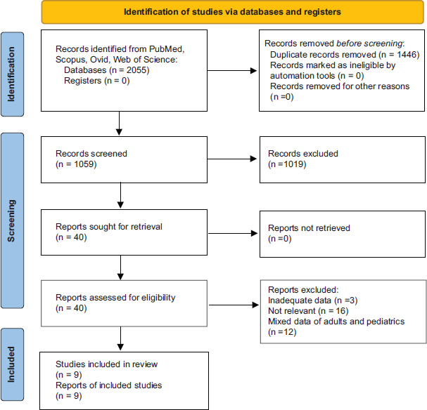
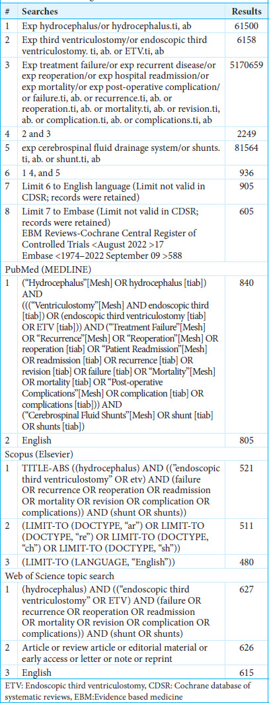
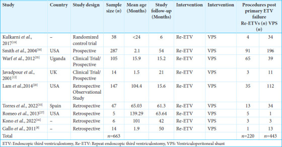
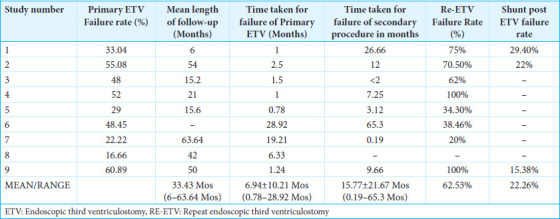
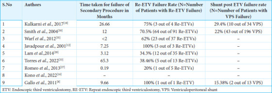
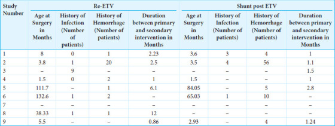
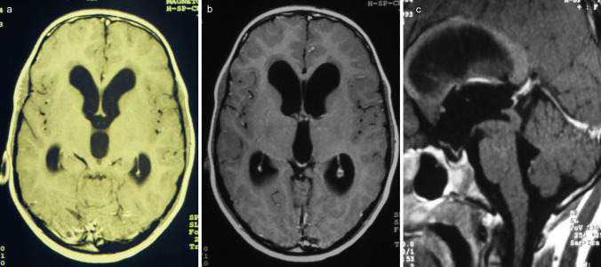
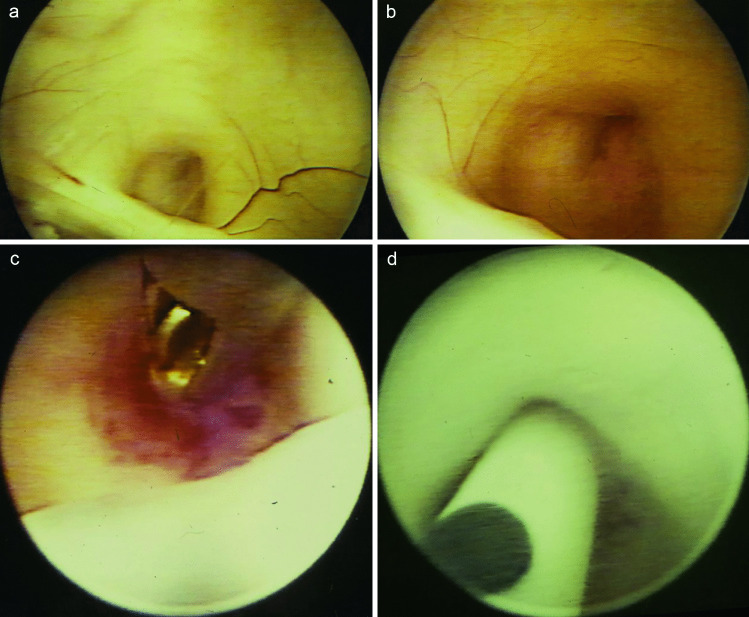
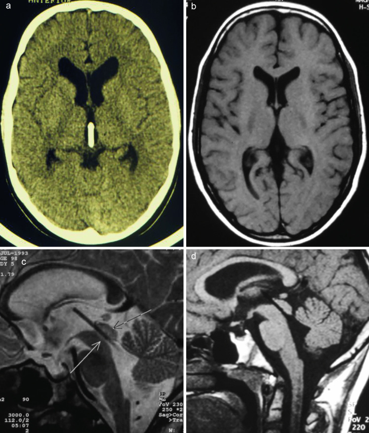

# Case Prep: Pediatric Endoscopic Third Ventriculostomy (± Choroid Plexus Cauterization)

---

<!-- BEGIN CASE SNAPSHOT -->

## Case / Approach Snapshot

- **Anatomy at risk:** age-specific skull/soft tissue, developing brain and tracts, CSF pathways, brainstem/lower cranial nerves, tumor or congenital lesion relationships, and blood-volume constraints.
- **Operative steps:** adapt positioning/anesthesia to age, confirm imaging and goals with family, expose gently, preserve neurovascular/CSF pathways, reconstruct durably for growth, and plan ICU/endocrine/rehab surveillance; use the detailed operative sequence and approach notes below as the step-by-step source.
- **Rescue plans:** blood loss, hypothermia, swelling, hydrocephalus, airway/swallowing issues, endocrine/electrolyte shifts, infection, and staged therapy with oncology or rehab teams.
- **Figures:** review [Figures, Imaging & Video](#figures-imaging--video) and the [Curated Image Set](#curated-image-set); embedded local figures should remain open-access, public-domain, or otherwise reusable with attribution.
- **Papers:** review [High-Yield Literature](#high-yield-literature) for seminal sources, modern reviews, and outcome data specific to this page.

<!-- END CASE SNAPSHOT -->

## One-Liner
[Age — months/years] [M/F] child with obstructive hydrocephalus due to [aqueductal stenosis / posterior fossa tumor / other] planned for endoscopic third ventriculostomy [with choroid plexus cauterization (ETV/CPC)].

---

## Figures, Imaging & Video

**🎥 Operative video** — [search operative video on YouTube ▸](https://www.youtube.com/results?search_query=third+ventriculostomy+surgery) · [The Neurosurgical Atlas ▸](https://www.neurosurgicalatlas.com)

[Neurosurgical Atlas](https://www.neurosurgicalatlas.com) · [Radiopaedia](https://radiopaedia.org/search?q=third%20ventriculostomy&scope=all) · [PubMed Central](https://www.ncbi.nlm.nih.gov/pmc/?term=pediatric+endoscopic+third+ventriculostomy+choroid+plexus) — operative figures © linked; see [media-sources.md](../../resources/media-sources.md)

---

<!-- BEGIN CURATED LITERATURE -->

## High-Yield Literature

- **Paediatric hydrocephalus** — Kahle KT. Nature reviews. Disease primers 2024. [PubMed](https://pubmed.ncbi.nlm.nih.gov/38755194/)
- **Endoscopic third ventriculostomy versus shunt for pediatric hydrocephalus: a systematic literature review and meta-analysis** — Texakalidis P. Child's nervous system : ChNS : official journal of the International Society for Pediatric Neurosurgery 2019. [PubMed](https://pubmed.ncbi.nlm.nih.gov/31129704/)
- **Endoscopic third ventriculostomy for shunt malfunction in the pediatric population: a systematic review, meta-analysis, and meta-regression analysis** — Lee KS. Journal of neurosurgery. Pediatrics 2023. [PubMed](https://pubmed.ncbi.nlm.nih.gov/36787128/)
- **Predicting endoscopic third ventriculostomy success in pediatric shunt dysfunction: a monocentric retrospective case series of 70 consecutive children, systematic review, and meta-analysis** — Guida L. Journal of neurosurgery. Pediatrics 2023. [PubMed](https://pubmed.ncbi.nlm.nih.gov/37877943/)
- **Endoscopic third ventriculostomy versus ventriculoperitoneal shunt in pediatric and adult population: a systematic review and meta-analysis** — Pande A. Neurosurgical review 2021. [PubMed](https://pubmed.ncbi.nlm.nih.gov/32476100/)
- **Endoscopic third ventriculostomy versus ventriculoperitoneal shunt for treating pediatric tuberculous meningitis hydrocephalus: a systematic review and meta-analysis** — Fagundes W. Journal of neurosurgery. Pediatrics 2025. [PubMed](https://pubmed.ncbi.nlm.nih.gov/40479834/)
- **Endoscopic third ventriculostomy for pediatric tumor-associated hydrocephalus** — Sherrod BA. Neurosurgical focus 2020. [PubMed](https://pubmed.ncbi.nlm.nih.gov/31896082/)
- **Infant Hydrocephalus** — Lu VM. Pediatrics in review 2024. [PubMed](https://pubmed.ncbi.nlm.nih.gov/39085190/)
- **The Global Rise of Endoscopic Third Ventriculostomy with Choroid Plexus Cauterization in Pediatric Hydrocephalus** — Dewan MC. Pediatric neurosurgery 2017. [PubMed](https://pubmed.ncbi.nlm.nih.gov/28002814/)
- **Endoscopic third ventriculostomy in the treatment of hydrocephalus in pediatric patients** — Di Rocco C. Advances and technical standards in neurosurgery 2006. [PubMed](https://pubmed.ncbi.nlm.nih.gov/16768305/)

<!-- END CURATED LITERATURE -->

---

<!-- BEGIN CURATED IMAGE SET -->

## Curated Image Set

Open-access figures are embedded from PubMed Central articles and kept unique to this guide.

*Figure 1:. Preferred reporting items for systematic reviews and meta-analyses flow diagram. Source: [Re-endoscopic third ventriculostomy versus ventriculoperitoneal shunting in failed endoscopic third ventriculostomy in pediatric patients with hydrocephalus: A systematic review](https://pmc.ncbi.nlm.nih.gov/articles/PMC12134809/) — Surgical Neurology International 2025; CC BY-NC-SA.*

*Figure 2. Source: [Re-endoscopic third ventriculostomy versus ventriculoperitoneal shunting in failed endoscopic third ventriculostomy in pediatric patients with hydrocephalus: A systematic review](https://pmc.ncbi.nlm.nih.gov/articles/PMC12134809/) — Surg Neurol Int. 2025 May 30;16:205. doi: 10.25259/SNI_1111_2024; CC BY-NC-SA.*

*Figure 3. Source: [Re-endoscopic third ventriculostomy versus ventriculoperitoneal shunting in failed endoscopic third ventriculostomy in pediatric patients with hydrocephalus: A systematic review](https://pmc.ncbi.nlm.nih.gov/articles/PMC12134809/) — Surg Neurol Int. 2025 May 30;16:205. doi: 10.25259/SNI_1111_2024; CC BY-NC-SA.*

*Figure 4. Source: [Re-endoscopic third ventriculostomy versus ventriculoperitoneal shunting in failed endoscopic third ventriculostomy in pediatric patients with hydrocephalus: A systematic review](https://pmc.ncbi.nlm.nih.gov/articles/PMC12134809/) — Surg Neurol Int. 2025 May 30;16:205. doi: 10.25259/SNI_1111_2024; CC BY-NC-SA.*

*Figure 5. Source: [Re-endoscopic third ventriculostomy versus ventriculoperitoneal shunting in failed endoscopic third ventriculostomy in pediatric patients with hydrocephalus: A systematic review](https://pmc.ncbi.nlm.nih.gov/articles/PMC12134809/) — Surg Neurol Int. 2025 May 30;16:205. doi: 10.25259/SNI_1111_2024; CC BY-NC-SA.*

*Figure 6. Source: [Re-endoscopic third ventriculostomy versus ventriculoperitoneal shunting in failed endoscopic third ventriculostomy in pediatric patients with hydrocephalus: A systematic review](https://pmc.ncbi.nlm.nih.gov/articles/PMC12134809/) — Surg Neurol Int. 2025 May 30;16:205. doi: 10.25259/SNI_1111_2024; CC BY-NC-SA.*

*Figure 7. Source: [Re-endoscopic third ventriculostomy versus ventriculoperitoneal shunting in failed endoscopic third ventriculostomy in pediatric patients with hydrocephalus: A systematic review](https://pmc.ncbi.nlm.nih.gov/articles/PMC12134809/) — Surg Neurol Int. 2025 May 30;16:205. doi: 10.25259/SNI_1111_2024; CC BY-NC-SA.*

*Fig. 1. Preoperative axial a, b, and sagittal c MR images showing tri-ventricular occlusive hydrocephalus due to compression of the aqueduct by a tectal lesion, suspected for low-grade tumor Source: [Endoscopic transaqueductal stent placement for tumor-related aqueductal compression in pediatric patients: surgical consideration, technique, and results](https://pmc.ncbi.nlm.nih.gov/articles/PMC10837227/) — Child's Nervous System 2023; CC BY.*

*Fig. 2. Intraoperative endoscopic view on the occluded aqueduct above the posterior commissure a, b. After an endoscopic biopsy c, the transaqueductal stent is inserted via the aqueduct into the... Source: [Endoscopic transaqueductal stent placement for tumor-related aqueductal compression in pediatric patients: surgical consideration, technique, and results](https://pmc.ncbi.nlm.nih.gov/articles/PMC10837227/) — Child's Nervous System 2023; CC BY.*

*Fig. 3. Postoperative obtained axial computed tomogram a axial and sagittal MR images b, c, d showing the optimal positioning of the transaqueductal stents. Additionally, the obvious reduction... Source: [Endoscopic transaqueductal stent placement for tumor-related aqueductal compression in pediatric patients: surgical consideration, technique, and results](https://pmc.ncbi.nlm.nih.gov/articles/PMC10837227/) — Child's Nervous System 2023; CC BY.*

<!-- END CURATED IMAGE SET -->

---

## History of Present Illness
- Chief complaint: Macrocephaly, bulging fontanelle, sunsetting eyes, irritability, vomiting, developmental delay (infants); headache/vomiting (older)
- Etiology: aqueductal stenosis, tumor (tectal/pineal/posterior fossa), post-hemorrhagic, post-infectious
- **ETV Success Score** (age, etiology, prior shunt) — younger infants and post-infectious have lower success; **ETV+CPC** improves success in infants (Warf technique, esp. < 1-2 years)

---

## Past Medical History
- Prematurity, IVH (post-hemorrhagic hydrocephalus), prior infection (post-infectious), prior shunt
- Birth/developmental history

---

## Imaging Review
### MRI (sagittal, T2, CISS, cine flow)
- **Triventricular hydrocephalus** (obstructive pattern), aqueduct (stenosis/tumor)
- **Third ventricle floor** — thinned, bowed; **prepontine cistern space** (adequate between floor and basilar/clivus)
- **Basilar artery** position, anatomy (massa intermedia, infundibular recess, mammillary bodies)
- Etiology (tumor, septations)

---

## Labs
- CBC, BMP, Coags, pediatric pre-op

---

## Examination
- Head circumference (plot), fontanelle, eye movements (sunsetting, CN VI), developmental status

---

## Surgical Planning

### Case Logistics, OR Needs & Orders
- **Typical bed:** PICU or pediatric step-down depending on age, airway risk, hydrocephalus, neurologic deficit, and expected fluid/blood shifts.
- **OR setup:** pediatric anesthesia/equipment, warming, weight-based implants/antibiotics, navigation/endoscope/microscope as needed, blood availability for tumor/myelomeningocele cases, and family-centered postop handoff.
- **Special needs:** weight-based fluids/meds, latex allergy precautions for myelomeningocele, steroid/endocrine/DI plan when sellar/posterior fossa risk exists, EVD/CSF diversion plan, and age-appropriate neuro baseline.
- **Immediate postop orders:** PICU/step-down neuro checks, airway/swallow monitoring when relevant, CT/MRI timing, drain/EVD/shunt orders, antibiotics/steroid taper, pain control, wound/skin precautions, and PT/OT/rehab planning.

### Diagnosis & Indication
- Indication: Obstructive hydrocephalus; ETV avoids shunt dependence; **ETV+CPC** for infants to improve success (cauterize choroid plexus to reduce CSF production)
- Cautions: very young infants (lower ETV success alone → add CPC), prepontine scarring (post-infectious), narrow cistern, distorted anatomy

### ETV Success Read
- Favor ETV when hydrocephalus is obstructive with a defined block (aqueductal stenosis, tectal/pineal/posterior fossa obstruction) and a navigable third-ventricle floor/prepontine cistern.
- Lower success is expected in very young infants, postinfectious/posthemorrhagic hydrocephalus, thick opaque floor, scarred prepontine cistern, small ventricles, or prior failed ETV with closed/scarred stoma.
- ETV+CPC is most relevant in infants and selected shunt-avoidance scenarios; the added value depends on age, etiology, anatomy, and ability to safely reach/cauterize the plexus.
- A shunt is still the safer answer when the anatomy is hostile, the floor landmarks are not trustworthy, or the child cannot tolerate an uncertain ETV failure risk.

### Imaging Checklist
- MRI sagittal CISS/FIESTA or equivalent: third-ventricle floor thickness, basilar position, clival/dorsum relationship, prepontine cistern size, Liliequist membrane, and any interpeduncular scarring.
- Coronal/axial planning: foramen of Monro size, venous anatomy, septations, mass trajectory constraints, and whether a flexible scope is needed for CPC.
- Review prior shunt history, infection/hemorrhage, and whether ventricles are large enough for safe endoscopic working room.

### Position
- Supine, head neutral/slightly flexed, age-appropriate fixation/padding
- Right frontal entry (modified Kocher trajectory to foramen of Monro)

### Key Surgical Steps
1. Right frontal burr hole (or fontanelle-based in infants), trajectory to foramen of Monro
2. Introduce rigid (or flexible) neuroendoscope via peel-away sheath into the lateral ventricle
3. Identify **foramen of Monro** landmarks (choroid plexus, septal/thalamostriate veins, fornix)
4. Enter third ventricle; identify floor landmarks — **mammillary bodies (posterior), infundibular recess (anterior), tuber cinereum (between)**
5. **Fenestrate the floor in the midline** anterior to the mammillary bodies, behind the dorsum sellae (through tuber cinereum) — **blunt perforation** (not cautery near basilar), dilate with Fogarty balloon
6. Open the **membrane of Liliequist**; confirm patency into the prepontine cistern; **visualize and avoid the basilar artery and perforators**
7. **ETV+CPC (if performed):** with flexible scope, cauterize the choroid plexus bilaterally in the lateral ventricles (and septostomy as needed)
8. Confirm flow (floor pulsation), hemostasis, withdraw scope, closure

### Critical Anatomy & Structures at Risk
1. **Basilar artery and perforators** — directly below the floor; injury catastrophic
2. **Fornix** (foramen of Monro) — memory
3. **Hypothalamus** (floor) — endocrine/autonomic
4. **Choroid plexus vessels** (CPC — bleeding), septal/thalamostriate veins

### Equipment
- Rigid neuroendoscope (ETV) ± **flexible scope (for CPC)**, working channel
- Fogarty/ETV balloon, blunt fenestration probe, bipolar/cautery (CPC)
- Warm irrigation (LR), EVD kit (backup), pediatric setup

### Monitoring
- Standard; **watch bradycardia** (floor manipulation)

### Anesthesia
- Pediatric general; warm irrigation (thermoregulation), **watch bradycardia/asystole** during floor manipulation (stop, irrigate), careful fluid balance

### Potential Complications
1. **Basilar artery injury** (rare, catastrophic), bradycardia/arrest (floor)
2. Fornix/hypothalamic injury, CN III palsy
3. **ETV failure** (esp. infants/post-infectious) → may need repeat or shunt; delayed closure possible (counsel re: warning signs)
4. CSF leak, intraventricular hemorrhage (CPC), infection

### Rescue and Failure Logic
- **Bradycardia/asystole during floor work:** stop manipulation, irrigate warm fluid, let anesthesia restore hemodynamics, and resume only if landmarks remain clear and the child is stable.
- **Basilar/perforator seen too close or floor opaque:** do not force the stoma; adjust trajectory only if safe, otherwise abort to shunt/alternate diversion.
- **Bleeding during CPC:** irrigate patiently, lower irrigation pressure once visibility returns, use focal bipolar only on plexus, and avoid chasing blood into the foramen/veins.
- **No visible prepontine flow after fenestration:** open Liliequist membrane, inspect for a second membrane, confirm the basilar/perforator corridor, and consider leaving an EVD or converting if patency remains doubtful.
- **Early clinical failure:** do not rely on ventricular size alone; evaluate symptoms, fontanelle/OFC, wound, infection, cine flow when useful, and have a low threshold for shunt in an unstable infant.
- **Late failure:** treat recurrent headache/vomiting/lethargy/sunsetting as urgent hydrocephalus until proven otherwise, even years after a successful ETV.

---

## Operative Note Template
**Preoperative Diagnosis:** Obstructive hydrocephalus ([aqueductal stenosis / tumor / post-hemorrhagic])

**Postoperative Diagnosis:** Same

**Procedure:** Endoscopic third ventriculostomy [with choroid plexus cauterization (ETV/CPC)]

**Surgeon / Assistant:**
**Anesthesia:** Pediatric general endotracheal
**EBL / Fluids:** Minimal
**Adjuncts:** Rigid [± flexible] neuroendoscope, Fogarty/ETV balloon, [bipolar for CPC], warm irrigation
**Complications:** None
**Note:** Watch for bradycardia during floor manipulation

**Indications:** [Age — months/years] child with obstructive hydrocephalus and favorable floor anatomy; [ETV+CPC chosen to improve success in the infant]. Risks (basilar injury, bradycardia, ETV failure) discussed with family.

**Description of Procedure:** After consent and time-out, pediatric general anesthesia was induced (warm irrigation). A right frontal entry was made along a trajectory to the foramen of Monro and the endoscope introduced. The **foramen of Monro landmarks** were identified and the third ventricle entered; the floor landmarks (**mammillary bodies, infundibular recess, tuber cinereum**) were defined. The floor was **bluntly fenestrated in the midline anterior to the mammillary bodies** and **dilated with a Fogarty balloon**, the **membrane of Liliequist opened**, and patency confirmed with the **basilar artery visualized and avoided**. [With a flexible scope, the **choroid plexus was cauterized bilaterally (CPC)**.] Floor pulsation confirmed flow.

The endoscope was withdrawn and closure performed. The infant/child was transferred with head-circumference/fontanelle monitoring and family education on ETV-failure signs.

---

## Postoperative Plan
- Floor/PICU per age, neuro checks, **head circumference/fontanelle**
- CT/MRI postop (ventricles may not shrink immediately; cine flow shows stoma patency)
- **Monitor for ETV failure** (recurrent hydrocephalus — bulging fontanelle, increasing OFC, vomiting, sunsetting — can be early or delayed → shunt)
- Educate family on warning signs of failure
- Follow-up MRI, developmental surveillance, neurosurgery follow-up
