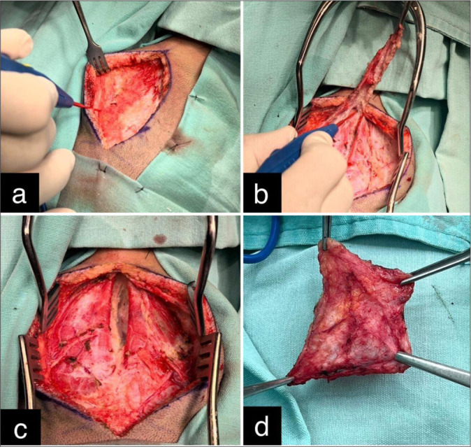
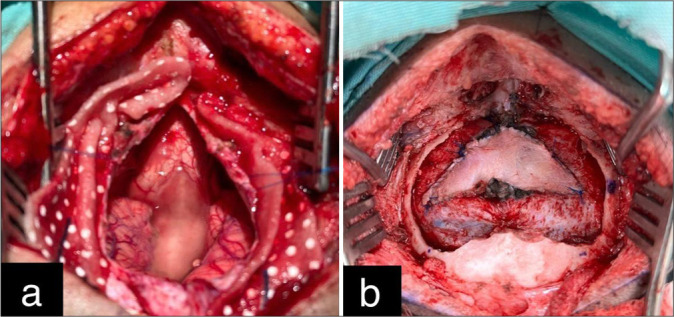
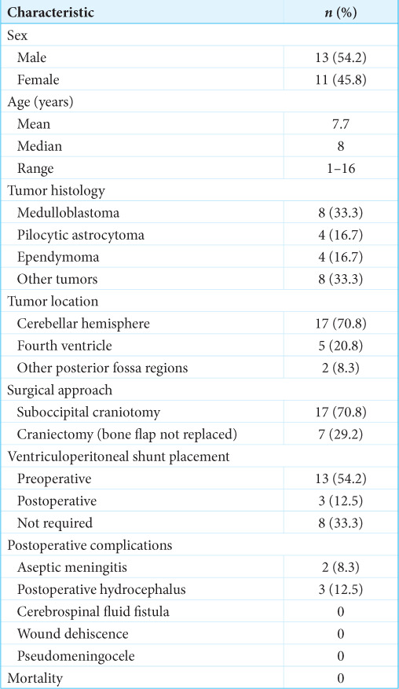
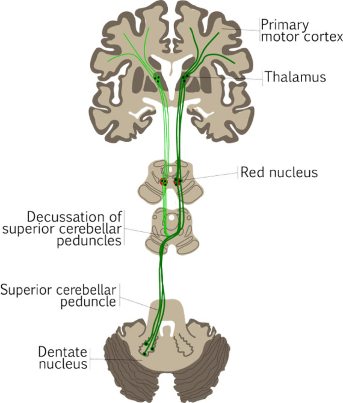
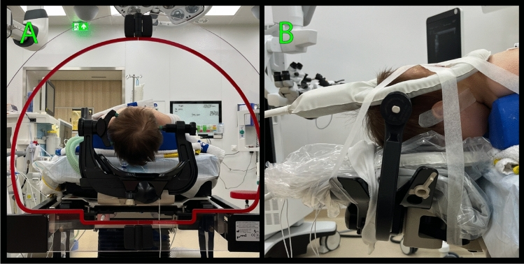
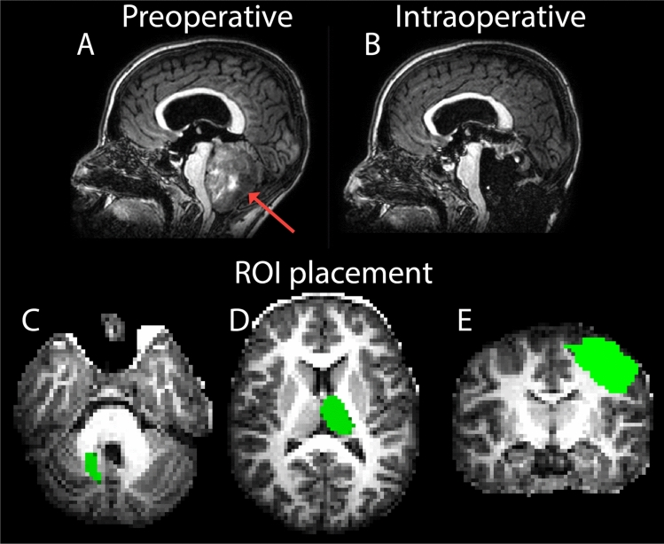
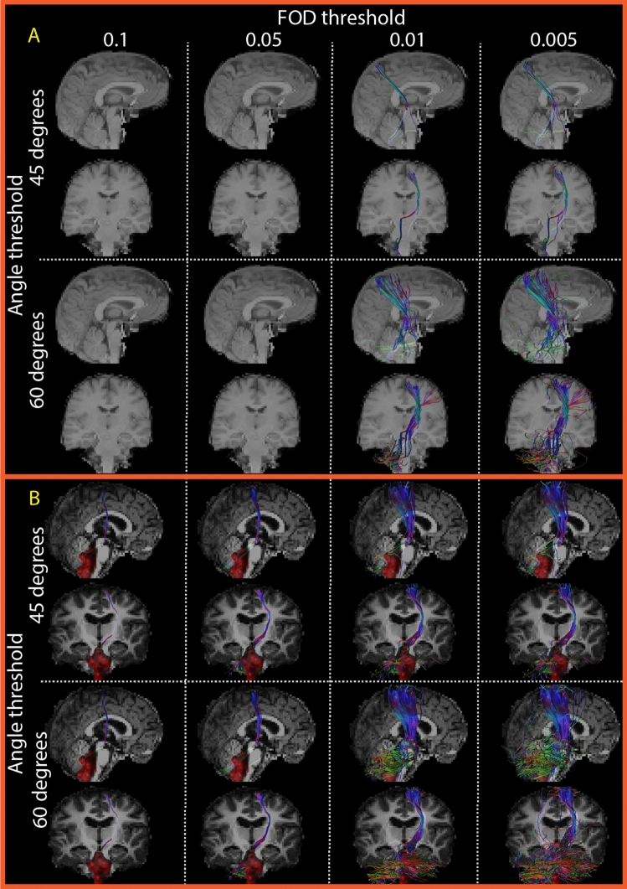
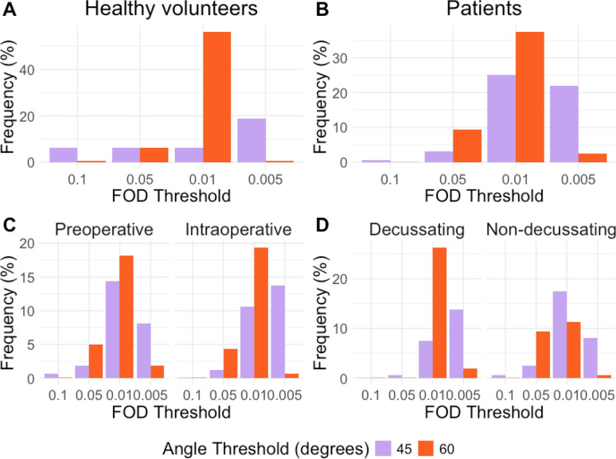
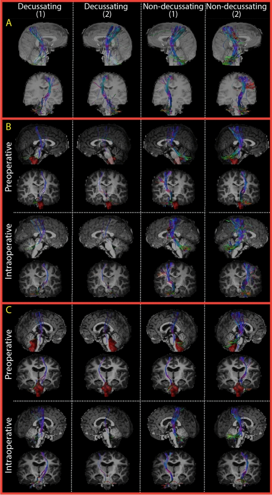

# Case Prep: Pediatric Posterior Fossa Tumor Resection (Medulloblastoma / Pilocytic Astrocytoma / Ependymoma)

---

<!-- BEGIN CASE SNAPSHOT -->

## Case / Approach Snapshot

- **Anatomy at risk:** age-specific skull/soft tissue, developing brain and tracts, CSF pathways, brainstem/lower cranial nerves, tumor or congenital lesion relationships, and blood-volume constraints.
- **Operative steps:** adapt positioning/anesthesia to age, confirm imaging and goals with family, expose gently, preserve neurovascular/CSF pathways, reconstruct durably for growth, and plan ICU/endocrine/rehab surveillance; use the detailed operative sequence and approach notes below as the step-by-step source.
- **Rescue plans:** blood loss, hypothermia, swelling, hydrocephalus, airway/swallowing issues, endocrine/electrolyte shifts, infection, and staged therapy with oncology or rehab teams.
- **Figures:** review [Figures, Imaging & Video](#figures-imaging--video) and the [Curated Image Set](#curated-image-set); embedded local figures should remain open-access, public-domain, or otherwise reusable with attribution.
- **Papers:** review [High-Yield Literature](#high-yield-literature) for seminal sources, modern reviews, and outcome data specific to this page.

<!-- END CASE SNAPSHOT -->

## One-Liner
[Age]yo [M/F] child with a [midline/4th ventricular / cerebellar hemispheric] posterior fossa tumor ([medulloblastoma / pilocytic astrocytoma / ependymoma]) with [obstructive hydrocephalus] planned for suboccipital craniotomy for resection.

---

## Figures, Imaging & Video

**🎥 Operative video** — [search operative video on YouTube ▸](https://www.youtube.com/results?search_query=medulloblastoma+surgery) · [The Neurosurgical Atlas ▸](https://www.neurosurgicalatlas.com)

[Neurosurgical Atlas](https://www.neurosurgicalatlas.com) · [Radiopaedia](https://radiopaedia.org/search?q=medulloblastoma&scope=all) · [PubMed Central](https://www.ncbi.nlm.nih.gov/pmc/?term=pediatric+posterior+fossa+tumor+telovelar) — operative figures © linked; see [media-sources.md](../../resources/media-sources.md)

---

<!-- BEGIN CURATED LITERATURE -->

## High-Yield Literature

- **Postoperative facial palsy after pediatric posterior fossa tumor resection** — Chu JK. Journal of neurosurgery. Pediatrics 2021. [PubMed](https://pubmed.ncbi.nlm.nih.gov/33711807/)
- **A review of long-term deficits in memory systems following radiotherapy for pediatric posterior fossa tumor** — Baudou E. Radiotherapy and oncology : journal of the European Society for Therapeutic Radiology and Oncology 2022. [PubMed](https://pubmed.ncbi.nlm.nih.gov/35640769/)
- **Deep Learning for Pediatric Posterior Fossa Tumor Detection and Classification: A Multi-Institutional Study** — Quon JL. AJNR. American journal of neuroradiology 2020. [PubMed](https://pubmed.ncbi.nlm.nih.gov/32816765/)
- **An Analysis of Temporal Trend of Incidence of Post-Resection Cerebrospinal Fluid Diversion in Pediatric Posterior Fossa Tumor Patients and the Predictive Factors** — Kumar A. Neurology India 2023. [PubMed](https://pubmed.ncbi.nlm.nih.gov/36861578/)
- **Volumetric predictors for shunt-dependency in pediatric posterior fossa tumors** — Wilhelmy F. Scientific reports 2025. [PubMed](https://pubmed.ncbi.nlm.nih.gov/40542153/)
- **Machine Assist for Pediatric Posterior Fossa Tumor Diagnosis: A Multinational Study** — Zhang M. Neurosurgery 2021. [PubMed](https://pubmed.ncbi.nlm.nih.gov/34392363/)
- **Impact of a pediatric posterior fossa tumor and its treatments on motor procedural learning** — Baudou E. European journal of paediatric neurology : EJPN : official journal of the European Paediatric Neurology Society 2023. [PubMed](https://pubmed.ncbi.nlm.nih.gov/37060708/)
- **Executive and social functioning in pediatric posterior fossa tumor survivors and healthy controls** — Ramjan S. Neuro-oncology practice 2023. [PubMed](https://pubmed.ncbi.nlm.nih.gov/36970175/)
- **Intraoperative neurophysiology in posterior fossa tumor surgery in children** — Sala F. Child's nervous system : ChNS : official journal of the International Society for Pediatric Neurosurgery 2015. [PubMed](https://pubmed.ncbi.nlm.nih.gov/26351231/)
- **Arterial Spin-Labeling Perfusion Metrics in Pediatric Posterior Fossa Tumor Surgery** — Toescu SM. AJNR. American journal of neuroradiology 2022. [PubMed](https://pubmed.ncbi.nlm.nih.gov/36137658/)

<!-- END CURATED LITERATURE -->

---

<!-- BEGIN CURATED IMAGE SET -->

## Curated Image Set

Open-access figures are embedded from PubMed Central articles and kept unique to this guide.

*Figure 1:. Intraoperative steps of autologous cervical fascia graft for watertight duroplasty in pediatric posterior fossa surgery: (a) lateral dissection, (b) graft detachment, (c) muscular plane... Source: [Autologous cervical fascia duraplasty in pediatric posterior fossa tumor surgery: A low-cost and viable alternative](https://pmc.ncbi.nlm.nih.gov/articles/PMC12954250/) — Surgical Neurology International 2026; CC BY-NC-SA.*

*Figure 2:. Intraoperative images of posterior fossa exposure and dural repair using an autologous cervical fascia graft: (a) cerebellum and brainstem with dura opened. (b) Final view showing... Source: [Autologous cervical fascia duraplasty in pediatric posterior fossa tumor surgery: A low-cost and viable alternative](https://pmc.ncbi.nlm.nih.gov/articles/PMC12954250/) — Surgical Neurology International 2026; CC BY-NC-SA.*

*Figure 3. Source: [Autologous cervical fascia duraplasty in pediatric posterior fossa tumor surgery: A low-cost and viable alternative](https://pmc.ncbi.nlm.nih.gov/articles/PMC12954250/) — Surg Neurol Int. 2026 Feb 6;17:68. doi: 10.25259/SNI_1177_2025; CC BY-NC-SA.*

*Figure 4. Source: [Autologous cervical fascia duraplasty in pediatric posterior fossa tumor surgery: A low-cost and viable alternative](https://pmc.ncbi.nlm.nih.gov/articles/PMC12954250/) — Surg Neurol Int. 2026 Feb 6;17:68. doi: 10.25259/SNI_1177_2025; CC BY-NC-SA.*

*Fig. 1. Anatomical illustration of the dentato-rubro-thalamic tract (DRTT). The dark green tract represents the decussating DRTT, the classic component that decussates from the dentate nucleus... Source: [Evaluation of tractography parameters for dentato-rubro-thalamic tract reconstruction during pediatric posterior fossa tumor surgery](https://pmc.ncbi.nlm.nih.gov/articles/PMC13124821/) — Magma (New York, N.y.) 2025; CC BY.*

*Fig. 2. Example of patient preparation for MR acquisition before surgery. A After positioning the patient in the surgical prone position (i.e., laying on their stomach with their chest lifted... Source: [Evaluation of tractography parameters for dentato-rubro-thalamic tract reconstruction during pediatric posterior fossa tumor surgery](https://pmc.ncbi.nlm.nih.gov/articles/PMC13124821/) — Magma (New York, N.y.) 2025; CC BY.*

*Fig. 3. Example of T1-weighted images before and during surgery and placement of the regions of interest used for fiber tractography. T1-weighted (T1w) images of a 14-year-old girl with a 4th... Source: [Evaluation of tractography parameters for dentato-rubro-thalamic tract reconstruction during pediatric posterior fossa tumor surgery](https://pmc.ncbi.nlm.nih.gov/articles/PMC13124821/) — Magma (New York, N.y.) 2025; CC BY.*

*Fig. 4. Example of eight fiber tractography parameter combinations for one side dentato-rubro-thalamic tract. All panels show the dentato-rubro-thalamic tract (DRTT) crossing from the dentate... Source: [Evaluation of tractography parameters for dentato-rubro-thalamic tract reconstruction during pediatric posterior fossa tumor surgery](https://pmc.ncbi.nlm.nih.gov/articles/PMC13124821/) — Magma (New York, N.y.) 2025; CC BY.*

*Fig. 5. Qualitative results fiber tractography parameter combinations. In healthy volunteers (A) and pediatric posterior fossa tumor patients (B), an FOD threshold of 0.01 and an angle threshold... Source: [Evaluation of tractography parameters for dentato-rubro-thalamic tract reconstruction during pediatric posterior fossa tumor surgery](https://pmc.ncbi.nlm.nih.gov/articles/PMC13124821/) — Magma (New York, N.y.) 2025; CC BY.*

*Fig. 6. Dentato-rubro-thalamic tracts (DRTT) reconstructed with the best parameter combination of our dataset. The first two columns show both DRTTs (1 and 2) crossing from the dentate nucleus... Source: [Evaluation of tractography parameters for dentato-rubro-thalamic tract reconstruction during pediatric posterior fossa tumor surgery](https://pmc.ncbi.nlm.nih.gov/articles/PMC13124821/) — Magma (New York, N.y.) 2025; CC BY.*

<!-- END CURATED IMAGE SET -->

---

## History of Present Illness
- Chief complaint: Morning headache, **vomiting**, ataxia, lethargy, head tilt, diplopia (raised ICP from 4th ventricle obstruction)
- Duration (often weeks), gait/balance, cranial nerve symptoms
- **Common pediatric posterior fossa tumors:**
  - **Medulloblastoma** (midline/vermian, 4th ventricle, malignant, drop mets — stage neuraxis)
  - **Pilocytic astrocytoma** (cerebellar hemisphere, cystic + mural nodule, benign, excellent prognosis with GTR)
  - **Ependymoma** (4th ventricle floor, extends through foramina, adherent to floor)
  - **ATRT** (young, aggressive)

---

## Past Medical History
- Developmental history, prior illness, syndromic associations (Gorlin → medulloblastoma; NF1 → astrocytoma)

---

## Imaging Review
### MRI brain + **entire neuraxis** (T1±Gad, T2, DWI)
- Location (midline vs hemispheric vs 4th ventricle floor), enhancement, cyst+nodule (pilocytic), restricted diffusion (medulloblastoma/ATRT — hypercellular)
- **4th ventricle / brainstem floor relationship, extension through foramina** (Luschka/Magendie — ependymoma)
- **Hydrocephalus**, tonsillar herniation
- **Spine MRI for drop metastases** (medulloblastoma, ependymoma — before or ~2 weeks after surgery to avoid postop artifact)

---

## Labs
- CBC, BMP, Coags, **type and crossmatch** (pediatric blood volume), pre-op anesthesia

---

## Neurological Examination
- Cerebellar (truncal + appendicular), CN exam, gait, fundoscopy (papilledema), head tilt, mental status

---

## Surgical Planning

### Hydrocephalus Management
- Preop **EVD or ETV** if significant hydrocephalus (many pediatric posterior fossa tumors present with hydrocephalus); some resolve after resection; avoid rapid overdrainage (upward herniation)

### Position
- **Prone** (Concorde) — preferred in children (avoid sitting/VAE in small children generally); Mayfield (age-appropriate pin pressures; in very young children use horseshoe/skull clamp caution — thin skull) or padded headrest; neck flexed, shoulders down

### Approach: Midline Suboccipital Craniotomy ± C1 laminectomy
### Key Surgical Steps
1. Midline incision (inion to C2), avascular midline raphe
2. Suboccipital craniotomy (craniotomy preferred over craniectomy in children — replace bone); C1 laminectomy if tonsillar/4th ventricular extension
3. Open dura (Y-shaped), manage occipital sinus bleeding
4. **Telovelar approach** (through cerebellomedullary fissure) to the 4th ventricle — avoids splitting the vermis (reduces cerebellar mutism)
5. **Tumor resection:**
   - **Pilocytic:** drain cyst, resect mural nodule + tumor (GTR usually curative)
   - **Medulloblastoma:** internal debulking, circumferential dissection, **avoid pursuing tumor adherent to 4th ventricle floor/brainstem** (leave residual rather than injure floor)
   - **Ependymoma:** often adherent to floor and extends through foramina — meticulous dissection, accept small residual on floor over deficit
6. Preserve PICA, brainstem, dentate nuclei/peduncles
7. Restore CSF pathways, watertight dural closure (CSF leak/pseudomeningocele common in children)

### Critical Anatomy & Structures at Risk
1. **Brainstem / floor of 4th ventricle** (CN nuclei — facial colliculus, vagal/hypoglossal trigones) — **cerebellar mutism syndrome**, CN palsies, cardiorespiratory
2. **Dentate nuclei / cerebellar peduncles / vermis** — mutism, ataxia
3. **PICA**, occipital/transverse sinuses
4. Pediatric blood volume (transfusion)

### Equipment
- Microscope, navigation, CUSA, ultrasonic aspirator (pediatric settings)
- EVD kit, bipolar, hemostatic agents, dural substitute, **crossmatched blood**

### Monitoring
- SSEPs, MEPs, CN EMG (VII, IX-XII), BAER; pediatric IONM

### Anesthesia
- **Arterial line, crossmatched blood, pediatric fluid/thermoregulation**, antiemetics, VAE precautions, careful pediatric dosing

### Potential Complications
1. **Posterior fossa syndrome / cerebellar mutism** (up to ~25% with midline/vermian/dentate involvement — transient mutism, emotional lability, ataxia; recovery over weeks-months, often incomplete)
2. CN deficits, swallowing/airway compromise (floor)
3. Hydrocephalus persistence → shunt, CSF leak/pseudomeningocele
4. Blood loss, aseptic meningitis

---

## Operative Note Template
**Preoperative Diagnosis:** [Midline/4th-ventricular] pediatric posterior fossa tumor ([medulloblastoma/pilocytic astrocytoma/ependymoma]) with obstructive hydrocephalus

**Postoperative Diagnosis:** Same (pending pathology)

**Procedure:** Suboccipital craniotomy [with C1 laminectomy] for resection of pediatric posterior fossa tumor [with EVD]

**Surgeon / Assistant:**
**Anesthesia:** Pediatric general endotracheal
**EBL / Fluids / Blood products:** [crossmatched]
**Adjuncts:** Microscope, navigation, CUSA, [ICG]; SSEP/MEP/CN EMG/BAER; EVD
**Implants:** Dural substitute; [EVD]
**Complications:** None

**Indications:** [Age] child with a [location] posterior fossa tumor and hydrocephalus. [Preop EVD/ETV managed hydrocephalus.] Risks (cerebellar mutism, CN/floor injury, hydrocephalus, CSF leak) discussed with family.

**Description of Procedure:** After consent and time-out, pediatric general anesthesia was induced and neuromonitoring established. The patient was positioned prone (Concorde) with [age-appropriate head fixation]. [An EVD was placed.] A midline suboccipital craniotomy [with C1 laminectomy] was performed (bone replaced — craniotomy preferred in children) and the dura opened, managing the occipital sinus.

The 4th ventricle was accessed via a **vermis-sparing telovelar approach**. The tumor was resected [pilocytic: cyst + nodule; medulloblastoma/ependymoma: debulked and dissected **without pursuing tumor adherent to the 4th-ventricle floor/brainstem**], **preserving PICA, the brainstem, and the floor**. A **watertight dural closure** was performed and the bone replaced.

The patient was transferred to the PICU with posterior-fossa precautions and **vigilance for cerebellar mutism**; neuraxis staging MRI/CSF cytology were planned (embryonal/ependymal tumors).

---

## Postoperative Plan
- PICU, neuro checks q1h, **posterior fossa precautions** (consciousness, breathing, CN, swallowing)
- **Watch for cerebellar mutism** (may be delayed 1-2 days), swallow eval before PO, airway/eye protection
- CT 6h, MRI postop < 48h (EOR); EVD/hydrocephalus management
- Antiemetics, steroid taper, DVT prophylaxis (age-appropriate)
- **Neuraxis staging MRI + LP CSF cytology** (medulloblastoma/ependymoma — for staging, ~2 weeks post-op)
- Pediatric neuro-oncology/tumor board: medulloblastoma → risk-stratified craniospinal RT (age > 3) + chemo; ependymoma → RT ± second-look surgery; pilocytic → observation if GTR
- Molecular subgrouping (medulloblastoma: WNT/SHH/Group 3/4), rehab, long-term follow-up
