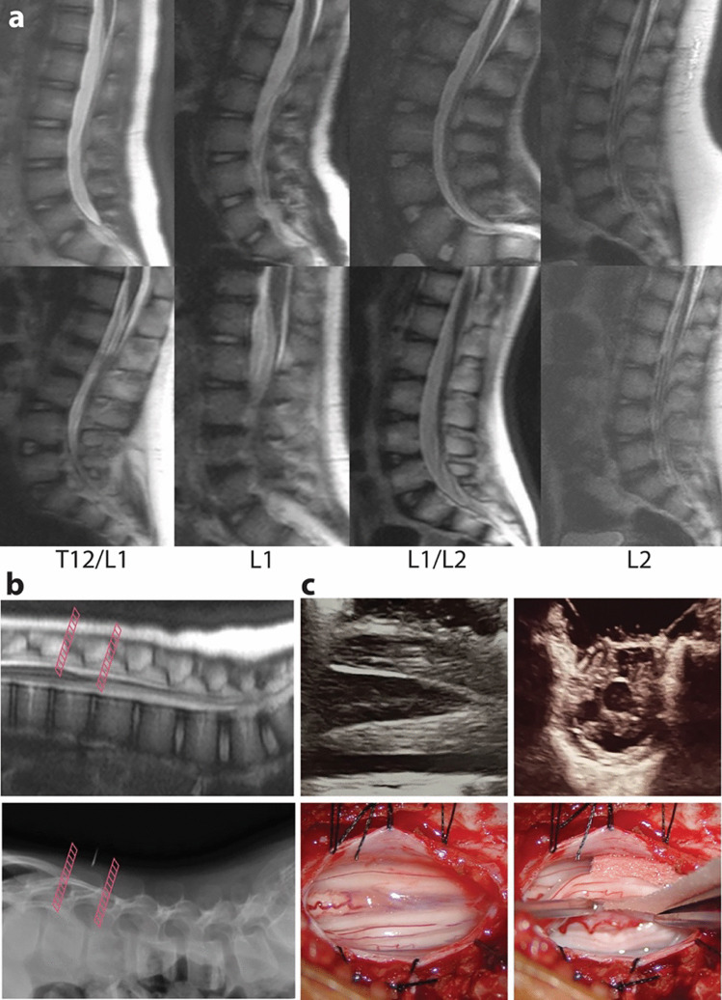
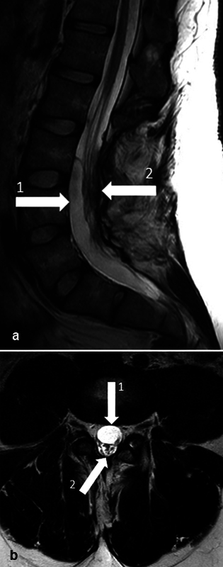
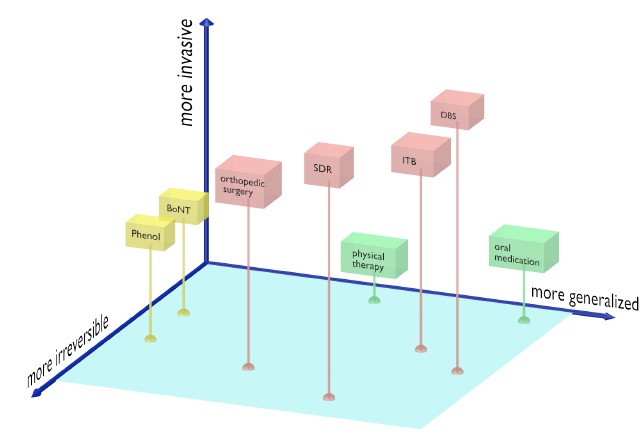
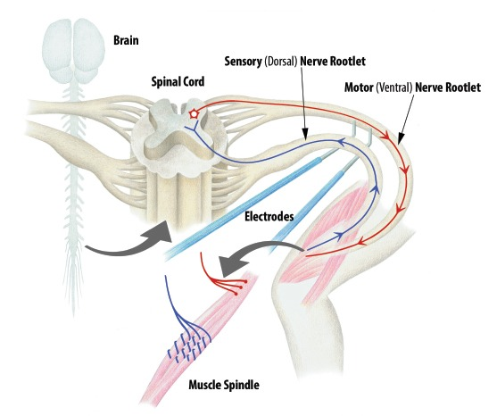
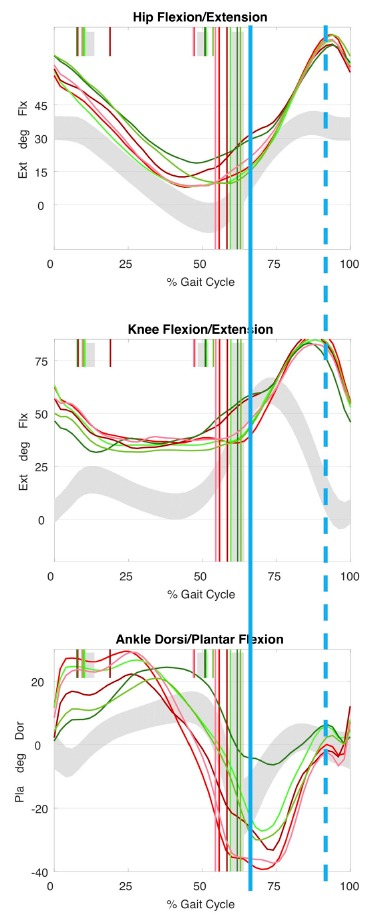
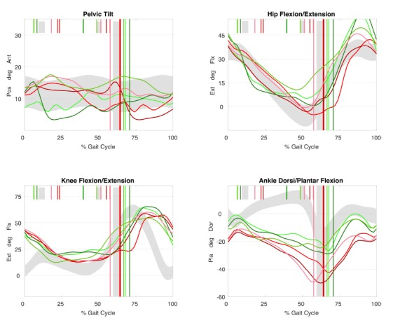
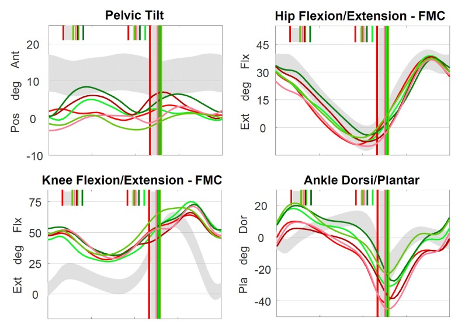
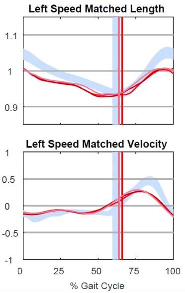
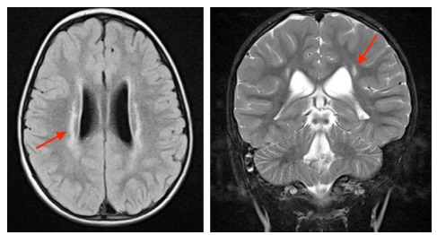
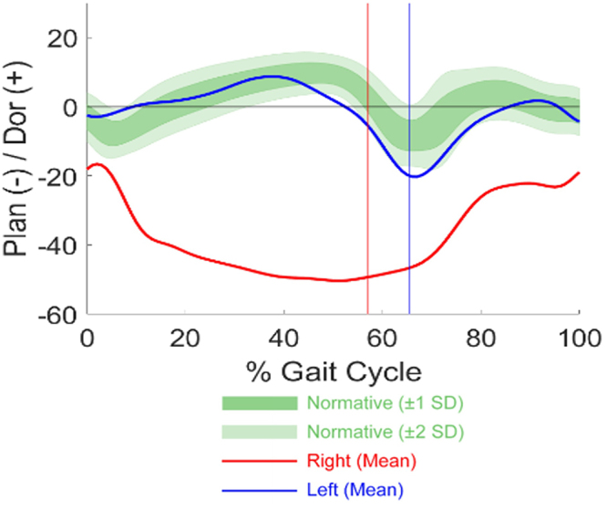

# Case Prep: Selective Dorsal Rhizotomy (SDR)

---

<!-- BEGIN CASE SNAPSHOT -->

## Case / Approach Snapshot

- **Anatomy at risk:** age-specific skull/soft tissue, developing brain and tracts, CSF pathways, brainstem/lower cranial nerves, tumor or congenital lesion relationships, and blood-volume constraints.
- **Operative steps:** adapt positioning/anesthesia to age, confirm imaging and goals with family, expose gently, preserve neurovascular/CSF pathways, reconstruct durably for growth, and plan ICU/endocrine/rehab surveillance; use the detailed operative sequence and approach notes below as the step-by-step source.
- **Rescue plans:** blood loss, hypothermia, swelling, hydrocephalus, airway/swallowing issues, endocrine/electrolyte shifts, infection, and staged therapy with oncology or rehab teams.
- **Figures:** review [Figures, Imaging & Video](#figures-imaging--video) and the [Curated Image Set](#curated-image-set); embedded local figures should remain open-access, public-domain, or otherwise reusable with attribution.
- **Papers:** review [High-Yield Literature](#high-yield-literature) for seminal sources, modern reviews, and outcome data specific to this page.

<!-- END CASE SNAPSHOT -->

## One-Liner
[Age]yo child with spastic [diplegic/quadriplegic] cerebral palsy (GMFCS [I-III]) and lower-extremity spasticity impairing function planned for selective dorsal rhizotomy via [single-level conus / L1 limited] laminoplasty.

---

## Figures, Imaging & Video

**🎥 Operative video** — [search operative video on YouTube ▸](https://www.youtube.com/results?search_query=cerebral+palsy+surgery) · [The Neurosurgical Atlas ▸](https://www.neurosurgicalatlas.com)

[Neurosurgical Atlas](https://www.neurosurgicalatlas.com) · [Radiopaedia](https://radiopaedia.org/search?q=cerebral%20palsy&scope=all) · [PubMed Central](https://www.ncbi.nlm.nih.gov/pmc/?term=selective+dorsal+rhizotomy) — operative figures © linked; see [media-sources.md](../../resources/media-sources.md)

---

<!-- BEGIN CURATED LITERATURE -->

## High-Yield Literature

- **SELECTIVE DORSAL RHIZOTOMY IN CEREBRAL PALSY: SELECTION CRITERIA AND POSTOPERATIVE PHYSICAL THERAPY PROTOCOLS** — Nicolini-Panisson RD. Revista paulista de pediatria : orgao oficial da Sociedade de Pediatria de Sao Paulo 2018. [PubMed](https://pubmed.ncbi.nlm.nih.gov/29412426/)
- **Selective dorsal rhizotomy for spasticity of genetic etiology** — Lohkamp LN. Child's nervous system : ChNS : official journal of the International Society for Pediatric Neurosurgery 2020. [PubMed](https://pubmed.ncbi.nlm.nih.gov/32300873/)
- **Selective dorsal rhizotomy: an illustrated review of operative techniques** — Warsi NM. Journal of neurosurgery. Pediatrics 2020. [PubMed](https://pubmed.ncbi.nlm.nih.gov/32032949/)
- **State of the Evidence Traffic Lights 2019: Systematic Review of Interventions for Preventing and Treating Children with Cerebral Palsy** — Novak I. Current neurology and neuroscience reports 2020. [PubMed](https://pubmed.ncbi.nlm.nih.gov/32086598/)
- **Cerebral Palsy: An Overview** — Vitrikas K. American family physician 2020. [PubMed](https://pubmed.ncbi.nlm.nih.gov/32053326/)
- **Cauda Equina-Level Selective Dorsal Rhizotomy** — Enslin JMN. Advances and technical standards in neurosurgery 2025. [PubMed](https://pubmed.ncbi.nlm.nih.gov/40445344/)
- **Selective dorsal rhizotomy** — Engsberg JR. Journal of neurosurgery. Pediatrics 2008. [PubMed](https://pubmed.ncbi.nlm.nih.gov/18352759/)
- **The selective dorsal rhizotomy technique for spasticity in 2020: a review** — Abbott R. Child's nervous system : ChNS : official journal of the International Society for Pediatric Neurosurgery 2020. [PubMed](https://pubmed.ncbi.nlm.nih.gov/32642977/)
- **The Evolution of Selective Dorsal Rhizotomy for the Management of Spasticity** — Enslin JMN. Neurotherapeutics : the journal of the American Society for Experimental NeuroTherapeutics 2019. [PubMed](https://pubmed.ncbi.nlm.nih.gov/30460456/)
- **Selective dorsal rhizotomy: current state of practice and the role of imaging** — Graham D. Quantitative imaging in medicine and surgery 2018. [PubMed](https://pubmed.ncbi.nlm.nih.gov/29675362/)

<!-- END CURATED LITERATURE -->

---

<!-- BEGIN CURATED IMAGE SET -->

## Curated Image Set

Open-access figures are embedded from PubMed Central articles and kept unique to this guide.

*Fig. 1. Rapid MRI of the lumbar spine. a Representative examples of rapid MRI of the lumbar spine for conus localization. Sagittal SSH T2 images were chosen from 8 individual patients with conus... Source: [Single-level laminoplasty approach to selective dorsal rhizotomy with conus localization by rapid spine MRI](https://pmc.ncbi.nlm.nih.gov/articles/PMC11269339/) — Child's Nervous System 2024; CC BY.*

*Fig. 1. Preoperative magnetic resonance imaging (MRI) of lumbosacral spine. ( a ) Sagittal view. 1, arachnoid cyst; 2, cauda equina. ( b ) Axial view. 1, arachnoid cyst; 2, cauda equina. Source: [Arachnoid Cyst as a Late Complication of Selective Dorsal Rhizotomy: A Case Report](https://pmc.ncbi.nlm.nih.gov/articles/PMC11666321/) — Journal of Neurological Surgery Reports 2024; CC BY.*

*Fig. 1. Tone management options in cerebral palsy. Tone management is only one aspect of the musculoskeletal care needs of children with spastic cerebral palsy: lever arm dysfunction and joint... Source: [Selective dorsal rhizotomy in ambulant children with cerebral palsy](https://pmc.ncbi.nlm.nih.gov/articles/PMC6169562/) — Journal of Children's Orthopaedics 2018; CC BY-NC.*

*Fig. 2. Spasticity reflex arc schematic diagram. Muscle stretch stimulates dorsal (afferent) sensory nerve rootlets, which in turn has a net excitatory effect on alpha motor neurons within the... Source: [Selective dorsal rhizotomy in ambulant children with cerebral palsy](https://pmc.ncbi.nlm.nih.gov/articles/PMC6169562/) — Journal of Children's Orthopaedics 2018; CC BY-NC.*

*Fig. 3. Kinematic traces of ‘mass flexion (Flx)/extension (Ext)’. Mass flexion-extension is a primitive movement pattern suggesting reduced selective motor control. This can be seen typically... Source: [Selective dorsal rhizotomy in ambulant children with cerebral palsy](https://pmc.ncbi.nlm.nih.gov/articles/PMC6169562/) — Journal of Children's Orthopaedics 2018; CC BY-NC.*

*Fig. 4. Kinematic traces in dystonia. Uncontrollable movements in dystonia results in large cycle to cycle variations between individual cycles. This individual also walks with plantarflexed... Source: [Selective dorsal rhizotomy in ambulant children with cerebral palsy](https://pmc.ncbi.nlm.nih.gov/articles/PMC6169562/) — Journal of Children's Orthopaedics 2018; CC BY-NC.*

*Fig. 5. Kinematic pattern of predominantly underlying spasticity affecting gait. ‘Double bump’ pelvis, slow and delayed knee flexion in early swing, reduced knee extension in late swing and... Source: [Selective dorsal rhizotomy in ambulant children with cerebral palsy](https://pmc.ncbi.nlm.nih.gov/articles/PMC6169562/) — Journal of Children's Orthopaedics 2018; CC BY-NC.*

*Fig. 6. Hamstring length. Musculotendinous length modelling can be performed given known muscle insertions and joint positions. Spasticity is associated with short hamstring length and slow... Source: [Selective dorsal rhizotomy in ambulant children with cerebral palsy](https://pmc.ncbi.nlm.nih.gov/articles/PMC6169562/) — Journal of Children's Orthopaedics 2018; CC BY-NC.*

*Fig. 7. Brain MRI in periventricular leukomalacia (PVL). The ‘ideal’ candidate for selective dorsal rhizotomy will have isolated PVL (red arrows). Source: [Selective dorsal rhizotomy in ambulant children with cerebral palsy](https://pmc.ncbi.nlm.nih.gov/articles/PMC6169562/) — Journal of Children's Orthopaedics 2018; CC BY-NC.*

*FIG. 1.. Preoperative ankle kinematics demonstrate excessive dynamic right plantar (Plan) flexion during stance and swing. Dor = dorsal. Source: [Repeat selective dorsal rhizotomy for residual spasticity: illustrative case](https://pmc.ncbi.nlm.nih.gov/articles/PMC12455223/) — Journal of Neurosurgery: Case Lessons 2025; CC BY-NC-ND.*

<!-- END CURATED IMAGE SET -->

---

## History of Present Illness
- Chief complaint: Lower-extremity **spasticity** (scissoring, toe-walking, crouch) impairing gait/function/care
- **Ideal candidate:** spastic diplegia from prematurity, **good underlying strength and selective motor control**, spasticity (not dystonia) as the dominant problem, age ~3-10, GMFCS II-III, motivated for intensive postop rehab
- Prior treatments (botulinum toxin, baclofen, orthopedic), gait analysis
- Multidisciplinary selection (neurosurgery, PT, physiatry, ortho)

---

## Past Medical History
- Prematurity/PVL, prior orthopedic surgery, baclofen pump, dystonia component (relative contraindication), fixed contractures (ortho first), scoliosis
- Hip status (subluxation — caution; spasticity may be "holding" hips)
- Standard pediatric history

---

## Imaging Review
### MRI brain + spine
- PVL (typical), exclude other cause; spinal anatomy, conus level, exclude tethered cord/syrinx
### Gait analysis / functional assessment
- Formal gait lab, spasticity (Ashworth), ROM, strength, selective motor control — baseline

---

## Labs
- CBC, BMP, Coags, type and screen; pediatric pre-op

---

## Neurological Examination
- Spasticity (Modified Ashworth) each muscle group, strength, selective motor control, ROM/contractures, gait, document baseline; distinguish spasticity vs dystonia

---

## Surgical Planning

### Case Logistics, OR Needs & Orders
- **Typical bed:** PICU or pediatric step-down depending on age, airway risk, hydrocephalus, neurologic deficit, and expected fluid/blood shifts.
- **OR setup:** pediatric anesthesia/equipment, warming, weight-based implants/antibiotics, navigation/endoscope/microscope as needed, blood availability for tumor/myelomeningocele cases, and family-centered postop handoff.
- **Special needs:** weight-based fluids/meds, latex allergy precautions for myelomeningocele, steroid/endocrine/DI plan when sellar/posterior fossa risk exists, EVD/CSF diversion plan, and age-appropriate neuro baseline.
- **Immediate postop orders:** PICU/step-down neuro checks, airway/swallow monitoring when relevant, CT/MRI timing, drain/EVD/shunt orders, antibiotics/steroid taper, pain control, wound/skin precautions, and PT/OT/rehab planning.

### Diagnosis & Indication
- Indication: Spastic diplegia with functional impairment, good strength/selective control, suitable for permanent spasticity reduction (SDR is permanent — vs reversible baclofen pump)
- Goal: **Reduce spasticity by selectively cutting abnormal dorsal (sensory) rootlets** that drive the spastic reflex arc, preserving strength and sensation

### Candidate Selection
- Best candidates usually have spastic diplegia, meaningful antigravity strength, selective motor control, family commitment to intensive rehabilitation, and gait potential limited by spasticity rather than fixed deformity alone.
- Less favorable candidates include predominant dystonia/athetosis, severe weakness masked by tone, major contractures requiring orthopedic correction first, uncontrolled epilepsy/medical fragility, or unclear rehabilitation support.
- Clarify goals preoperatively: improved gait efficiency, easier care/hygiene, pain/spasm reduction, brace tolerance, or prevention of secondary deformity are different endpoints.
- Compare SDR against intrathecal baclofen when tone is generalized, mixed dystonia-spasticity is prominent, goals are care/comfort, or reversibility/adjustability matters.

### Rootlet-Selection Strategy
- Build a level-by-level plan with physiatry, PT, and IONM before incision; intraoperative EMG refines the plan but should not replace the preoperative functional hypothesis.
- Preserve motor roots absolutely and treat sacral rootlets conservatively; bladder, bowel, and sexual function are not acceptable tradeoffs for marginal tone reduction.
- Avoid overcutting in a child who uses spasticity for stance; early postoperative weakness is expected, but excessive denervation can erase functional reserve.
- Document percent cut by level and side so later tone, weakness, sensory symptoms, or orthopedic planning can be interpreted correctly.

### Position
- Prone, careful pediatric padding, IONM setup (EMG of multiple lower-extremity myotomes bilaterally, anal sphincter)

### Key Surgical Steps (Single-Level / Conus technique)
1. Localize the conus (fluoroscopy/ultrasound); **limited laminoplasty** (often single level over the conus, e.g., L1) — laminoplasty (replace lamina) preserves stability in children
2. Midline durotomy, identify the conus and cauda equina
3. **Separate dorsal (sensory) from ventral (motor) roots** — dorsal roots dorsolateral; confirm with stimulation (ventral roots = low-threshold motor; dorsal = sensory)
4. Identify each dorsal root level (L1/L2-S1/S2) — use anatomic and stimulation mapping
5. **Divide each dorsal root into rootlets**; **stimulate each rootlet (EMG)** and grade the response — **abnormal/sustained/spreading (diffuse multisegmental) EMG responses = "abnormal" rootlets → transect**; normal responses preserved
6. **Selectively cut ~25-50% of dorsal rootlets** at targeted levels based on EMG abnormality (preserve sensory and all motor; **preserve S2 and below carefully — bladder/sexual function**)
7. Confirm sphincter/sacral function preservation (monitor)
8. Watertight dural closure, laminoplasty reconstruction, closure

### Critical Anatomy & Structures at Risk
1. **Ventral (motor) roots** — must preserve (only cut dorsal/sensory)
2. **S2-S4 (bladder/bowel/sexual function)** — limit/avoid sacral sensory cutting; sphincter EMG
3. **Conus/cauda**, dorsal columns (sensory — selective cutting preserves protective sensation)
4. Dura (CSF leak), spinal stability (laminoplasty mitigates)

### Equipment
- Microscope, **intraoperative EMG (multichannel lower extremity + anal sphincter), nerve stimulator**
- Micro-instruments, fine bipolar, ultrasound/fluoroscopy, dural substitute, laminoplasty fixation

### Monitoring
- **EMG-guided rootlet selection (the core of the procedure), sphincter EMG, SSEP** — IONM is essential

### Anesthesia
- **No paralytic** (EMG-dependent), TIVA (anesthesia that preserves EMG responses), pediatric, prone precautions

### Potential Complications
1. **Transient sensory changes / dysesthesia** (usually resolve), **bladder dysfunction** (sacral — avoid over-cutting)
2. **Weakness** (if too aggressive / motor roots) — spasticity may have been providing functional support; transient post-op weakness common
3. CSF leak, spinal deformity (long-term — scoliosis/lordosis surveillance), back pain
4. Inadequate spasticity reduction / recurrence

### Rescue and Postoperative Problem Solving
- **Ventral/motor-root uncertainty:** stop cutting until stimulation confirms anatomy; if separation is ambiguous, preserve the questionable rootlet.
- **Sphincter EMG change or sacral concern:** stop sacral sectioning, reassess stimulation thresholds, and accept a higher residual tone burden rather than risking bladder/bowel dysfunction.
- **CSF leak/pseudomeningocele:** flat protocol, wound pressure precautions, imaging if symptomatic, and early repair for persistent leak or wound compromise.
- **Unexpected weakness:** distinguish expected tone-unmasking from motor injury; protect joints, intensify rehab, check sensory/bladder status, and image if a compressive collection is possible.
- **Residual spasticity:** correlate with percent cut, untreated levels, dystonia, contracture, pain, and therapy adherence before labeling the rhizotomy a failure.
- **Long-term deformity risk:** continue spine/hip surveillance because reduced tone does not eliminate orthopedic progression in cerebral palsy.

---

## Operative Note Template
**Preoperative Diagnosis:** Spastic [diplegic] cerebral palsy (GMFCS [__]) with disabling lower-extremity spasticity

**Postoperative Diagnosis:** Same

**Procedure:** Selective dorsal rhizotomy via [L1] limited laminoplasty with intraoperative EMG-guided rootlet selection

**Surgeon / Assistant:**
**Anesthesia:** Total IV anesthesia (EMG-preserving), no paralytic
**EBL / Fluids:**
**Adjuncts:** Microscope, ultrasound/fluoroscopy, **multichannel lower-extremity + anal sphincter EMG, nerve stimulator**
**Implants:** Dural substitute, laminoplasty fixation
**Complications:** None

**Indications:** [Age] child with spastic diplegia, good underlying strength/selective control, suitable for permanent spasticity reduction; selected by the multidisciplinary team. Risks (sensory change, bladder dysfunction, weakness) discussed.

**Description of Procedure:** After consent and time-out, TIVA was induced (no paralytic) and **multichannel EMG including anal sphincter** established. The conus was localized and a **limited laminoplasty (single-level over the conus)** performed; the dura was opened. **Dorsal (sensory) rootlets were separated from ventral (motor) roots** (confirmed by stimulation), and each dorsal root divided into rootlets. **Each rootlet was stimulated and graded by its EMG response**, and **abnormal (sustained/spreading) rootlets selectively transected** (~25–50% per level), **preserving sacral (S2–4) sensory and all motor function** (sphincter EMG monitored).

A **watertight dural closure** and laminoplasty reconstruction were performed. The child was kept flat per protocol and transferred with neuro/bladder monitoring and a planned intensive rehabilitation course.

---

## Postoperative Plan
- Floor/PICU, **flat bed rest** per protocol (CSF leak/dural healing), neuro checks (motor/sensory/**bladder**)
- Pain/spasm management, bladder function monitoring, wound/CSF leak watch
- **Intensive PT/rehab is essential** (months — strengthening, gait retraining; outcomes depend heavily on rehab)
- MRI if concern; long-term: monitor for spinal deformity, functional gains
- Multidisciplinary follow-up (neurosurgery, PT, physiatry, ortho); counsel re: permanent spasticity reduction and rehab commitment
