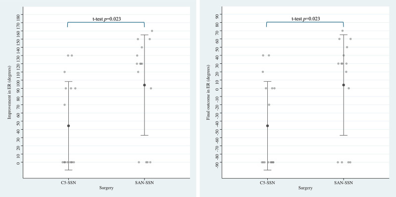
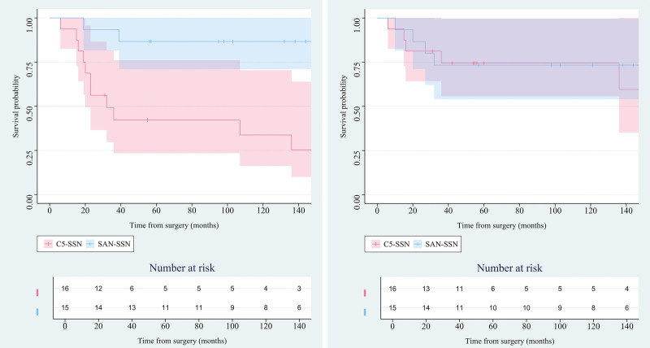
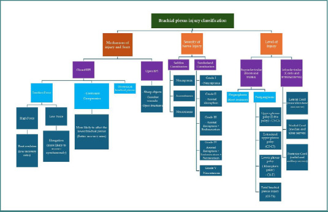
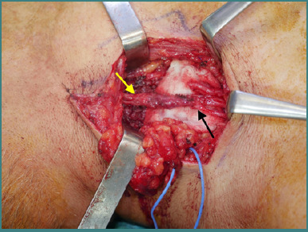
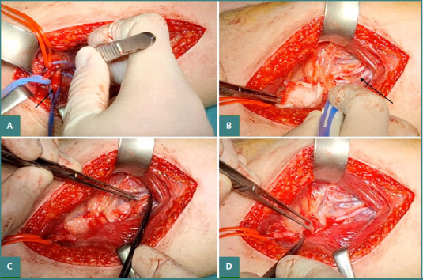
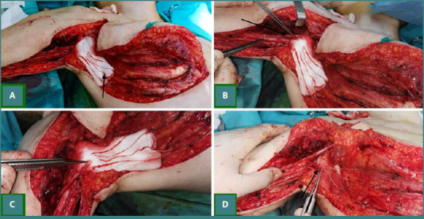
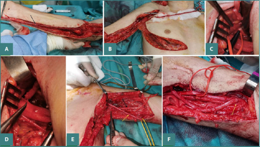
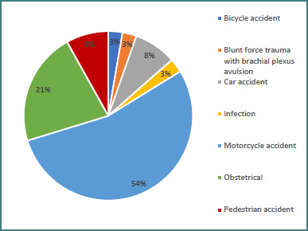
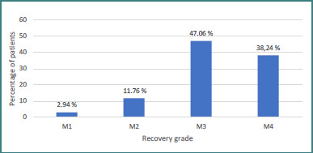
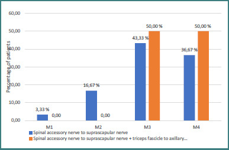

# Case Prep: Brachial Plexus Injury — Exploration, Repair, Grafting, and Nerve Transfer

---

<!-- BEGIN CASE DOSSIER -->

## Case / Approach Dossier

- **Anatomy at risk:** nerve course, fascicles, compression points, motor and sensory branches, adjacent vessels, scar planes, and distal targets for repair or transfer.
- **Operative steps:** mark landmarks, expose normal nerve proximally/distally, decompress or mobilize gently, resect/repair/graft/transfer as indicated, verify tension-free alignment, and close to protect gliding tissue; use the detailed operative sequence and approach notes below as the step-by-step source.
- **Rescue plans:** iatrogenic nerve injury, neuroma or neuropathic pain, vascular injury, incomplete decompression, recurrence, wound problems, and therapy/splinting or revision plan.
- **Figures:** review [Figures, Imaging & Video](#figures-imaging--video) and the [Curated Image Set](#curated-image-set); embedded local figures should remain open-access, public-domain, or otherwise reusable with attribution.
- **Papers:** review [High-Yield Literature](#high-yield-literature) for seminal sources, modern reviews, and outcome data specific to this page.
- **Textbook cross-checks:** use [Textbook Cross-Checks](#textbook-cross-checks) and the [Source Crosswalk](../../resources/source-crosswalk.md) to cite copyrighted textbooks/atlases while summarizing in original words.

<!-- END CASE DOSSIER -->

## One-Liner
[Age]yo [M/F] with a [traumatic / obstetric / tumor] [left/right] brachial plexus injury ([upper trunk / pan-plexus / preganglionic vs postganglionic]) planned for brachial plexus exploration with [neurolysis / direct repair / nerve grafting / nerve transfer (neurotization)].

---

## Figures, Imaging & Video

**🎥 Operative video** — [search operative video on YouTube ▸](https://www.youtube.com/results?search_query=brachial+plexus+injury+surgery) · [The Neurosurgical Atlas ▸](https://www.neurosurgicalatlas.com)

[Neurosurgical Atlas](https://www.neurosurgicalatlas.com) · [Radiopaedia](https://radiopaedia.org/search?q=brachial%20plexus%20injury&scope=all) · [PubMed Central](https://www.ncbi.nlm.nih.gov/pmc/?term=brachial+plexus+injury+nerve+transfer) — operative figures © linked; see [media-sources.md](../../resources/media-sources.md)

---

<!-- BEGIN TEXTBOOK CROSS-CHECKS -->

## Textbook Cross-Checks

- **Peripheral nerve anatomy:** Youmans and Winn; Greenberg; peripheral nerve surgery texts — confirm nerve course, fascicular anatomy, compression points, vascular supply, and nearby structures.
- **Technique sequence:** Youmans and Winn; specialty operative references — review incision, exposure, neurolysis/decompression/resection strategy, graft/repair options, and closure.
- **Complication rescue:** Greenberg; specialty literature — summarize neuropathic pain, motor deficit, wound issues, recurrence, and rehabilitation expectations.
- **Copyright-safe use:** cite these sources as private cross-checks, then write the guide content in original words; do not re-host textbook pages, figures, tables, or board-review card material. See [Source Crosswalk & Copyright-Safe Use](../../resources/source-crosswalk.md).

<!-- END TEXTBOOK CROSS-CHECKS -->

<!-- BEGIN CURATED LITERATURE -->

## High-Yield Literature

- **Spinal accessory nerve transfer for shoulder abduction has no benefit over supraclavicular exploration and nerve grafting in brachial plexus birth injury: a systematic review** — Mendiratta D. Frontiers in pediatrics 2024. [PubMed](https://pubmed.ncbi.nlm.nih.gov/39748811/)
- **Treatment of brachial plexus injury** — Nagano A. Journal of orthopaedic science : official journal of the Japanese Orthopaedic Association 1998. [PubMed](https://pubmed.ncbi.nlm.nih.gov/9654558/)
- **Management of Adult Traumatic Brachial Plexus Injury** — Datta NK. Mymensingh medical journal : MMJ 2023. [PubMed](https://pubmed.ncbi.nlm.nih.gov/37002755/)
- **Management of Adult Brachial Plexus Injuries** — Hill JR. The Journal of hand surgery 2021. [PubMed](https://pubmed.ncbi.nlm.nih.gov/34158206/)
- **High radial nerve palsy** — Laulan J. Hand surgery & rehabilitation 2019. [PubMed](https://pubmed.ncbi.nlm.nih.gov/30528552/)
- **Traumatic upper plexus palsy: Is the exploration of brachial plexus necessary?** — Gkiatas I. European journal of orthopaedic surgery & traumatology : orthopedie traumatologie 2019. [PubMed](https://pubmed.ncbi.nlm.nih.gov/30483967/)
- **Combined injury of the accessory nerve and brachial plexus** — Bertelli JA. Neurosurgery 2011. [PubMed](https://pubmed.ncbi.nlm.nih.gov/21135731/)
- **Adjunctive Dorsal Scapular Nerve Transfer to Suprascapular Nerve for Brachial Plexus Birth Injuries: Case Series** — Augustine HFM. The Journal of hand surgery 2019. [PubMed](https://pubmed.ncbi.nlm.nih.gov/30737063/)
- **Proximal and Distal Nerve Transfers in the Management of Brachial Plexus Injuries** — Woo SJ. Clinics in plastic surgery 2024. [PubMed](https://pubmed.ncbi.nlm.nih.gov/39216935/)
- **A systematic review of nerve transfer and nerve repair for the treatment of adult upper brachial plexus injury** — Yang LJ. Neurosurgery 2012. [PubMed](https://pubmed.ncbi.nlm.nih.gov/22811085/)

<!-- END CURATED LITERATURE -->

---

<!-- BEGIN CURATED IMAGE SET -->

## Curated Image Set

Open-access figures are embedded from PubMed Central articles and kept unique to this guide.

*Fig. 2.. (Left) Improvement and (right) final outcome in active shoulder ER range of motion in degrees after brachial plexus reconstruction surgery with C5–SSN or SAN–SSN. Gray dots represent... Source: [Comparison of Spinal Accessory Nerve Transfer versus C5 Grafting for Suprascapular Nerve Reinnervation in Brachial Plexus Birth Injury](https://pmc.ncbi.nlm.nih.gov/articles/PMC13290028/) — Plastic and Reconstructive Surgery 2025; CC BY.*

*Fig. 3.. (Left) Survival probability without secondary surgery for shoulder ER after brachial plexus reconstruction surgery with C5–SSN or SAN–SSN, with 95% confidence intervals. Secondary... Source: [Comparison of Spinal Accessory Nerve Transfer versus C5 Grafting for Suprascapular Nerve Reinnervation in Brachial Plexus Birth Injury](https://pmc.ncbi.nlm.nih.gov/articles/PMC13290028/) — Plastic and Reconstructive Surgery 2025; CC BY.*

*Figure 1. Classification of brachial plexus injuries [3,7,21,22] Source: [Functional outcomes following nerve transfers for shoulder and elbow reanimation in brachial plexus injuries: a 10-year retrospective study](https://pmc.ncbi.nlm.nih.gov/articles/PMC12094303/) — Journal of Medicine and Life 2025; CC BY.*

*Figure 2. Spinal accessory to suprascapular nerve transfer. The yellow arrow points towards the spinal accessory nerve, and the black arrow points towards the suprascapular nerve. Source: [Functional outcomes following nerve transfers for shoulder and elbow reanimation in brachial plexus injuries: a 10-year retrospective study](https://pmc.ncbi.nlm.nih.gov/articles/PMC12094303/) — Journal of Medicine and Life 2025; CC BY.*

*Figure 3. Radial nerve fascicle to axillary nerve transfer. A, Axillary nerve identification (black arrow); B, Radial nerve fascicle identification with nerve stimulator (black arrow pointing... Source: [Functional outcomes following nerve transfers for shoulder and elbow reanimation in brachial plexus injuries: a 10-year retrospective study](https://pmc.ncbi.nlm.nih.gov/articles/PMC12094303/) — Journal of Medicine and Life 2025; CC BY.*

*Figure 4. Intercostal nerves to the musculocutaneous nerve transfer. A, Intercostal nerve harvested for transfer (black arrow); B, Musculocutaneous nerve identification (black arrow); C,... Source: [Functional outcomes following nerve transfers for shoulder and elbow reanimation in brachial plexus injuries: a 10-year retrospective study](https://pmc.ncbi.nlm.nih.gov/articles/PMC12094303/) — Journal of Medicine and Life 2025; CC BY.*

*Figure 5. Contralateral C7 to median nerve transfer A, Ulnar nerve harvested for transfer (black arrow); B, Ulnar nerve reflected towards contralateral C7 through a subcutaneous tunnel C; C, C7... Source: [Functional outcomes following nerve transfers for shoulder and elbow reanimation in brachial plexus injuries: a 10-year retrospective study](https://pmc.ncbi.nlm.nih.gov/articles/PMC12094303/) — Journal of Medicine and Life 2025; CC BY.*

*Figure 6. Mechanism of injury to the brachial plexus Source: [Functional outcomes following nerve transfers for shoulder and elbow reanimation in brachial plexus injuries: a 10-year retrospective study](https://pmc.ncbi.nlm.nih.gov/articles/PMC12094303/) — Journal of Medicine and Life 2025; CC BY.*

*Figure 7. Global shoulder function recovery grade Source: [Functional outcomes following nerve transfers for shoulder and elbow reanimation in brachial plexus injuries: a 10-year retrospective study](https://pmc.ncbi.nlm.nih.gov/articles/PMC12094303/) — Journal of Medicine and Life 2025; CC BY.*

*Figure 8. Global shoulder function recovery in relation to the surgical procedure used Source: [Functional outcomes following nerve transfers for shoulder and elbow reanimation in brachial plexus injuries: a 10-year retrospective study](https://pmc.ncbi.nlm.nih.gov/articles/PMC12094303/) — Journal of Medicine and Life 2025; CC BY.*

<!-- END CURATED IMAGE SET -->

---

## History of Present Illness
- Chief complaint: Flail/weak arm, sensory loss, neuropathic pain after [traction injury (MVC/motorcycle), penetrating, obstetric, gunshot, traction]
- **Timing is critical** — mechanism, date of injury (window for repair before irreversible motor endplate loss, ~6-12 months; nerve transfers time-sensitive)
- Pattern: **upper trunk (C5-6 ± C7, Erb)** vs **lower (C8-T1, Klumpke)** vs **pan-plexus**; supraclavicular vs infraclavicular
- **Preganglionic (root avulsion — non-repairable directly)** vs **postganglionic (graftable)** — distinguishing features below
- Pain, prior recovery/plateau, associated vascular/orthopedic injury

---

## Past Medical History
- Associated injuries (subclavian/axillary vessels, clavicle/scapula fractures, head/chest), prior surgery
- Standard PMH; smoking (affects nerve healing)

---

## Imaging Review
### MRI brachial plexus / CT myelogram
- **Pseudomeningocele / root avulsion** (preganglionic — CT myelogram/MRI shows nerve root avulsion, empty root sleeve) → poor prognosis, favors nerve transfer
- Continuity vs discontinuity of trunks/cords, neuroma, tumor
### EMG/NCS (timed — usually ~3-4 weeks+ and serial)
- Localize lesion(s), preganglionic vs postganglionic clues, **SNAPs preserved with absent motor = preganglionic** (avulsion — cell body intact, root avulsed), denervation, reinnervation
- Identify viable donors for transfer
### CTA (if vascular injury)

---

## Labs
- CBC, BMP, Coags, type and screen

---

## Neurological Examination
- **Detailed motor (each muscle/myotome) and sensory mapping**, Horner syndrome (**preganglionic C8-T1 — ptosis/miosis/anhidrosis = poor prognosis**), Tinel along plexus (advancing = regeneration), winging (long thoracic), rhomboids/serratus (very proximal = preganglionic)
- Document baseline meticulously, MRC grades

---

## Surgical Planning

### Timing & Strategy
- **Sharp/penetrating transection:** early (acute) repair
- **Closed traction injuries:** observe with serial exam/EMG ~3 months; operate if no recovery (~3-6 months) before motor endplates degenerate (~12-18 months limit)
- **Root avulsion (preganglionic):** not directly repairable → **nerve transfer (neurotization)** prioritized
- Goals (prioritized): **elbow flexion, shoulder abduction/stability**, then hand if feasible

### Position
- Supine, head turned away, arm/shoulder and both legs (sural nerve graft donor) prepped; possible interscalene/supraclavicular + infraclavicular exposure

### Key Surgical Steps
1. **Exposure** — supraclavicular (roots/trunks; protect phrenic nerve on anterior scalene, spinal accessory, EJV, subclavian vessels, thoracic duct on left) ± infraclavicular extension (cords/branches)
2. Identify and trace plexus elements; **intraoperative nerve stimulation and NAP (nerve action potential) recording** across lesions (NAP across a neuroma-in-continuity → neurolysis; no NAP → resect and graft)
3. **Neurolysis** (lesion in continuity conducting) — external/internal
4. **Direct repair** (sharp transection, tension-free) — rare; or
5. **Nerve grafting** (postganglionic rupture) — resect neuroma to healthy fascicles, **interpositional sural nerve grafts** bridge the gap
6. **Nerve transfers (neurotization)** for avulsions/unrepairable proximal injury — examples:
   - **Oberlin transfer** (ulnar nerve fascicle → biceps motor branch of musculocutaneous) for elbow flexion
   - **Spinal accessory → suprascapular** nerve (shoulder)
   - Double fascicular (median+ulnar → biceps/brachialis), triceps branch → axillary, intercostals → musculocutaneous, contralateral C7 (select)
7. Tension-free coaptation under microscope (microsuture ± fibrin glue), tag/document
8. Closure; protect repairs (positioning/immobilization)

### Critical Anatomy & Structures at Risk
1. **Phrenic nerve** (anterior scalene — diaphragm), **spinal accessory** (donor/at risk), **long thoracic**
2. **Subclavian/axillary vessels** (exposure)
3. **Thoracic duct** (left supraclavicular — chyle leak)
4. **Donor nerve function** (transfers trade minor donor deficit for major recipient gain)
5. Plexus elements (preserve conducting fascicles — NAP-guided)

### Equipment
- Microscope, microsurgical instruments, **nerve stimulator + NAP recording**, microsuture, fibrin glue
- **Sural nerve graft harvest set**, loupes, bipolar
- Vessel loops, possible vascular backup

### Monitoring
- Intraoperative nerve stimulation / NAP / SSEP (preganglionic localization)

### Anesthesia
- **No long-acting paralytic** (stimulation/NAP), general; positioning for multiple donor sites

### Potential Complications
1. Incomplete/failed reinnervation (timing/avulsion-dependent), donor-site deficit
2. Phrenic/accessory/vascular/thoracic duct injury (chylothorax), pneumothorax
3. Neuropathic pain (avulsion — may need DREZ later), neuroma, CSF leak (avulsion repairs)

---

## Operative Note Template
**Preoperative Diagnosis:** [Left/Right] [traumatic/obstetric] brachial plexus injury ([upper trunk/pan-plexus]; [pre-/postganglionic])

**Postoperative Diagnosis:** Same

**Procedure:** [Left/Right] brachial plexus exploration with [neurolysis / sural nerve grafting / nerve transfer(s) — e.g., Oberlin, SAN→SSN]

**Surgeon / Assistant:**
**Anesthesia:** General, no long-acting paralytic
**EBL / Fluids:**
**Adjuncts:** Microscope, **nerve stimulator + NAP recording**, microsuture/fibrin glue, sural nerve graft harvest
**Complications:** None

**Indications:** [Age]yo [M/F] with a [traumatic] brachial plexus injury and [no recovery at ~3–6 months / sharp transection], within the window for reconstruction. Goals prioritized: elbow flexion, shoulder stability. Risks (incomplete recovery, donor deficit, phrenic/vascular/thoracic-duct injury) discussed.

**Description of Procedure:** After consent and time-out, general anesthesia (no paralytic) was induced and both legs prepped for sural graft. A **[supraclavicular ± infraclavicular] exposure** was performed, protecting the phrenic and spinal accessory nerves, subclavian vessels, and thoracic duct. Plexus elements were traced and **intraoperative stimulation/NAP recording** assessed lesions across neuromas.

Lesions were addressed: **[neurolysis for conducting lesions-in-continuity / interpositional sural nerve grafting after resecting non-conducting neuromas to healthy fascicles / nerve transfer(s) for avulsions — e.g., Oberlin (ulnar fascicle→biceps), spinal accessory→suprascapular]**. Coaptations were performed tension-free under the microscope with microsuture [± fibrin glue], and the donor/recipient and graft source/length documented.

Hemostasis was obtained and closure performed; the repairs were protected with [positioning/immobilization]. A CXR excluded pneumothorax. The patient was counseled on the prolonged reinnervation timeline.

---

## Postoperative Plan
- Floor, neurovascular checks, **CXR (pneumothorax — supraclavicular)**, monitor for chyle leak (left)
- **Immobilize/protect repairs** per surgeon (limit tension across coaptations for weeks)
- Donor site (sural — sensory loss lateral foot) care
- **Reinnervation is slow (~1 mm/day; months to years)** — Tinel advancement, serial EMG, intensive OT/PT, motor re-education (esp. transfers)
- Pain management (neuropathic), counsel realistic timeline/expectations; long-term follow-up
