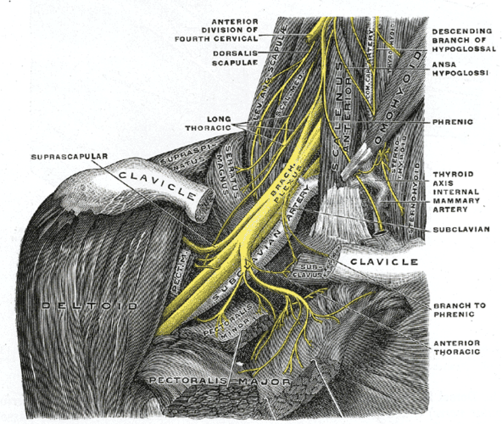

# Case Prep: Carpal Tunnel Release

---

## One-Liner
[Age]yo [M/F] with [left/right] carpal tunnel syndrome refractory to conservative management planned for [open / endoscopic] carpal tunnel release (median nerve decompression at the wrist).

---

## Figures, Imaging & Video

**🎥 Operative video** — [search operative video on YouTube ▸](https://www.youtube.com/results?search_query=carpal+tunnel+syndrome+surgery) · [The Neurosurgical Atlas ▸](https://www.neurosurgicalatlas.com)

**📑 Key evidence — landmark trials & guidelines**

- **CTS guideline** — AAOS Clinical Practice Guideline 2016 — management of carpal tunnel syndrome. [🔗 PubMed](https://pubmed.ncbi.nlm.nih.gov/?term=AAOS+clinical+practice+guideline+carpal+tunnel+syndrome+2016)
- **Open vs endoscopic CTR** — Sayegh ET, Strauch RJ. *Clin Orthop Relat Res* 2015 — meta-analysis of release techniques. [🔗 PubMed](https://pubmed.ncbi.nlm.nih.gov/?term=Sayegh+Strauch+open+endoscopic+carpal+tunnel+release+meta-analysis+2015)
- **Cubital tunnel** — Bartels RHMA et al. *Neurosurgery* 2005 — simple decompression vs anterior transposition. [🔗 PubMed](https://pubmed.ncbi.nlm.nih.gov/?term=Bartels+simple+decompression+anterior+transposition+ulnar+nerve+cubital+tunnel+2005)
- **Guidelines:** [AAOS Clinical Practice Guidelines](https://www.aaos.org/quality/quality-programs/)
[Neurosurgical Atlas](https://www.neurosurgicalatlas.com) · [Radiopaedia](https://radiopaedia.org/search?q=carpal%20tunnel%20syndrome&scope=all) · [PubMed Central](https://www.ncbi.nlm.nih.gov/pmc/?term=carpal+tunnel+release) — operative figures © linked; see [media-sources.md](../../resources/media-sources.md)

*Gray's Anatomy (1918), public domain — via Wikimedia Commons.*

---

## History of Present Illness
- Chief complaint: Numbness/tingling in median distribution (thumb, index, middle, radial ring), worse at night, shaking relieves (flick sign), dropping objects, thenar weakness
- Provocative: driving, phone, repetitive use
- Failed conservative: night splinting, NSAIDs, steroid injection, activity modification
- Thenar atrophy/weakness (advanced)

---

## Past Medical History
- Diabetes, hypothyroidism, RA, pregnancy, obesity, amyloidosis, prior wrist trauma/fracture
- Bilateral symptoms, prior CTR
- Standard PMH

---

## Imaging / Studies
### EMG/NCS
- **Median neuropathy at the wrist** — prolonged distal motor/sensory latencies, confirms diagnosis and severity, excludes proximal/cervical cause
### Ultrasound/MRI (selective)
- Median nerve cross-sectional area, masses, anatomy

---

## Labs
- Per comorbidity (glucose, TSH); routine pre-op as needed

---

## Neurological Examination
- Median sensory (2-point, monofilament), **thenar strength (APB)**, atrophy, Tinel (wrist), Phalen, Durkan compression test; exclude cervical/proximal

---

## Surgical Planning

### Procedure Selection
- **Open CTR:** direct visualization of transverse carpal ligament and nerve; gold standard, low complication
- **Endoscopic CTR:** smaller incision, faster recovery, but less direct visualization (nerve injury risk if anatomy unclear)

### Position & Anesthesia
- Supine, arm on hand table, **tourniquet**, **local/WALANT (wide-awake local anesthesia no tourniquet) or local + sedation / regional**

### Key Surgical Steps (Open)
1. Tourniquet, exsanguinate, local anesthesia
2. **Longitudinal incision** in line with the radial border of the ring finger, in the palm, ulnar to the thenar crease (avoid recurrent motor branch and palmar cutaneous branch — stay ulnar to midline), not crossing the wrist flexion crease at 90 degrees (or curve it)
3. Divide skin, palmar fascia
4. Identify the **transverse carpal ligament (flexor retinaculum)**
5. **Incise the TCL completely** along its ulnar aspect under direct vision, from distal to proximal, protecting the median nerve beneath
6. Confirm complete release proximally (antebrachial fascia) and distally (palmar fat) — nerve fully decompressed
7. Inspect nerve, ensure no mass/anomaly; do NOT routinely neurolyse
8. Release tourniquet, hemostasis, skin closure (nylon), soft dressing/splint

### Critical Anatomy & Structures at Risk
1. **Median nerve** (deep to TCL)
2. **Recurrent motor (thenar) branch** — variable (extraligamentous/transligamentous/subligamentous); stay ulnar to avoid
3. **Palmar cutaneous branch** of median (proximal, radial — incision placement)
4. **Superficial palmar arch** (distal — don't plunge), common digital nerves
5. Ulnar nerve/artery (Guyon canal — ulnar; stay controlled)

### Equipment
- Minor hand set, tourniquet, loupes, bipolar
- Endoscopic CTR system (if endoscopic)

### Anesthesia
- Local/WALANT/regional ± sedation; antibiotics typically not required for clean soft-tissue (per practice)

### Potential Complications
1. **Nerve injury** (median/recurrent motor/palmar cutaneous — painful neuroma, thenar weakness)
2. Incomplete release (persistent symptoms), pillar pain, scar tenderness
3. Vascular injury (superficial arch), bowstringing (rare), CRPS, infection, stiffness

---

## Operative Note Template
**Preoperative Diagnosis:** [Left/Right] carpal tunnel syndrome (median neuropathy at the wrist)

**Postoperative Diagnosis:** Same

**Procedure:** [Open/Endoscopic] [left/right] carpal tunnel release

**Surgeon / Assistant:**
**Anesthesia:** [Local/WALANT / regional ± sedation]
**Tourniquet / EBL:** [Tourniquet] / minimal
**Adjuncts:** Loupes [endoscopic CTR system if endoscopic]
**Complications:** None

**Indications:** [Age]yo [M/F] with [left/right] carpal tunnel syndrome (EMG-confirmed) refractory to splinting/injection [± thenar weakness/atrophy]. Risks (nerve injury, incomplete release, pillar pain) discussed.

**Description of Procedure:** After consent and time-out, [local/WALANT] anesthesia was given and the [tourniquet] inflated. A **longitudinal palmar incision in line with the radial border of the ring finger, ulnar to the thenar crease** (avoiding the recurrent motor and palmar cutaneous branches) was made through skin and palmar fascia, exposing the **transverse carpal ligament**. The **TCL was completely divided along its ulnar aspect under direct vision**, distal to proximal, protecting the median nerve beneath. **Complete release was confirmed proximally (antebrachial fascia) and distally (palmar fat)**, with the nerve decompressed and no anomaly/mass.

The tourniquet was released, hemostasis obtained, and the skin closed. A soft dressing was applied. The patient was discharged with early finger ROM.

---

## Postoperative Plan
- Outpatient; soft dressing/volar splint briefly, elevate, finger ROM immediately
- Suture removal ~10-14 days; expect night symptoms to improve quickly, strength/atrophy slower
- Activity progression, scar massage, pillar pain counseling
- Follow-up 2 weeks; therapy if needed
