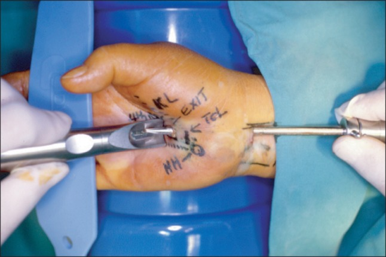
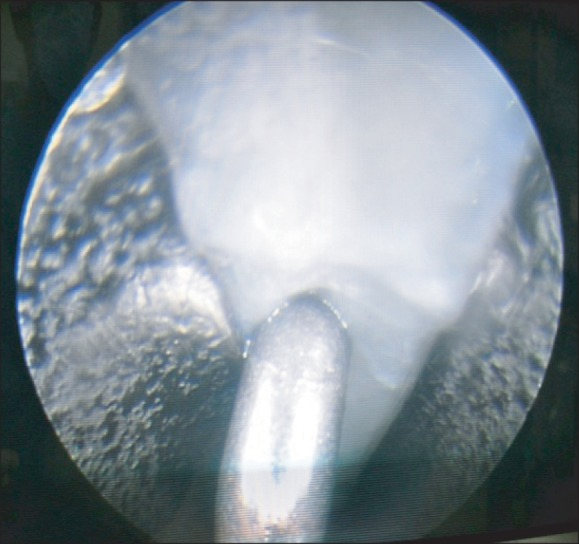
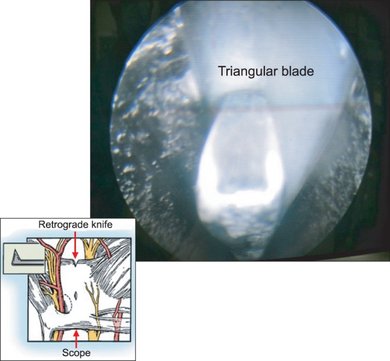
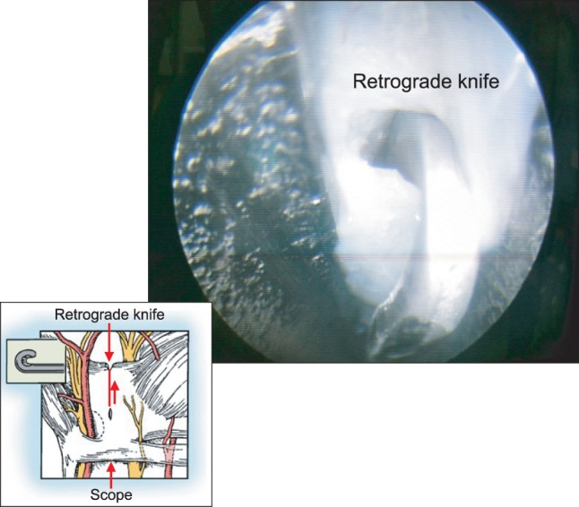
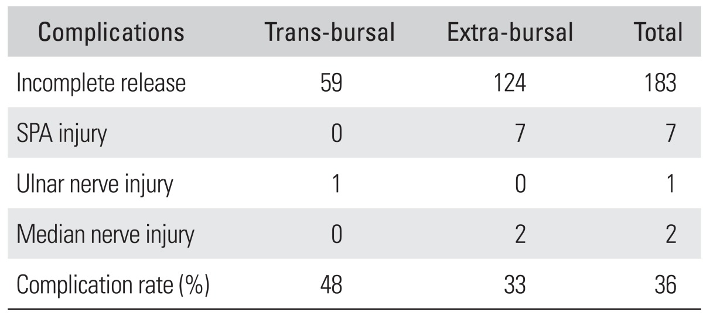
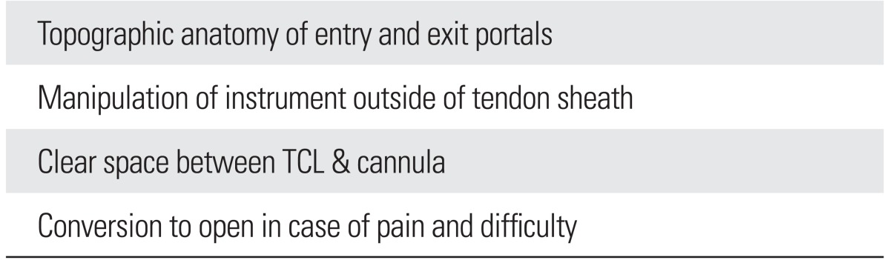
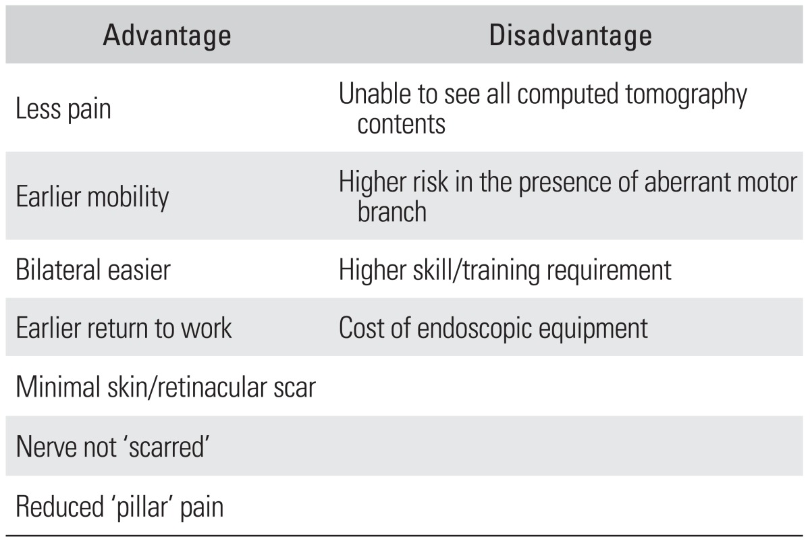
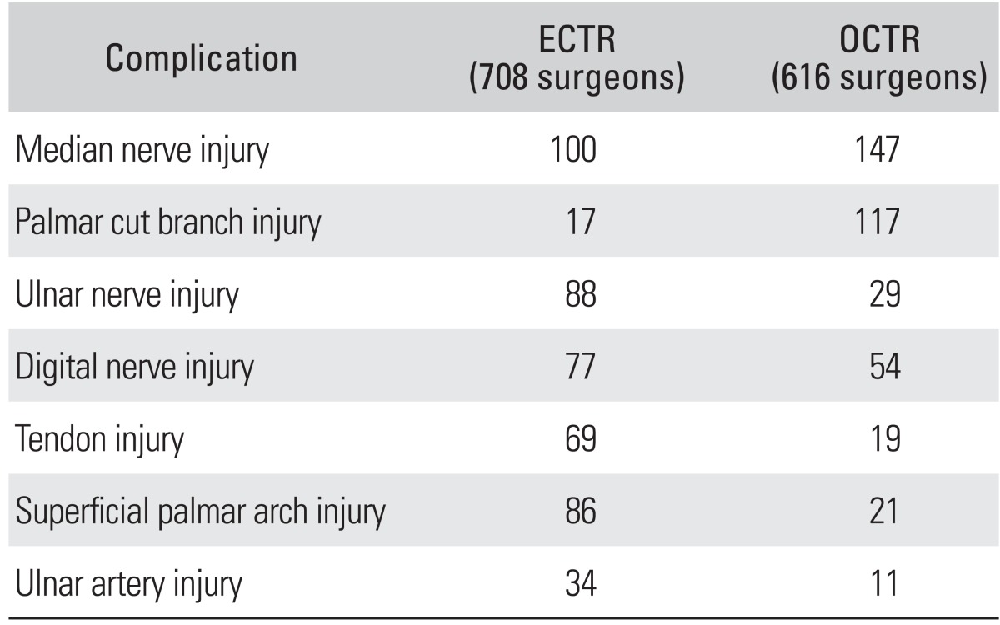
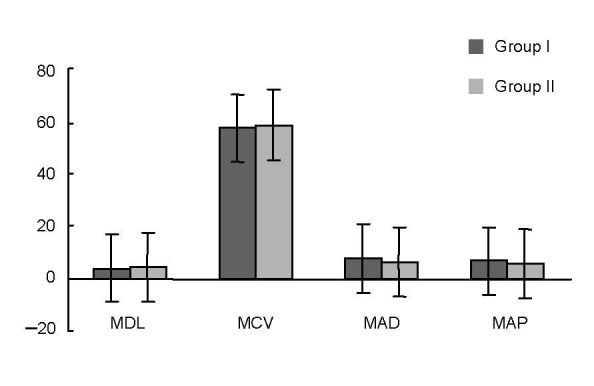
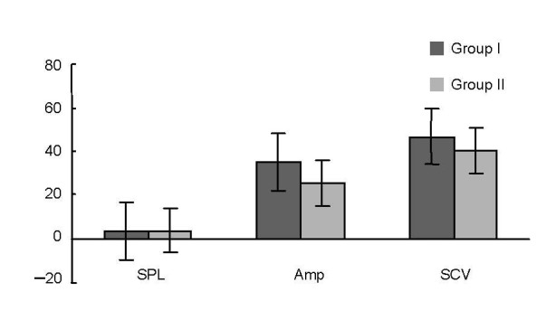

# Case Prep: Carpal Tunnel Release

---

<!-- BEGIN CASE SNAPSHOT -->

## Case / Approach Snapshot

- **Anatomy at risk:** nerve course, fascicles, compression points, motor and sensory branches, adjacent vessels, scar planes, and distal targets for repair or transfer.
- **Operative steps:** mark landmarks, expose normal nerve proximally/distally, decompress or mobilize gently, resect/repair/graft/transfer as indicated, verify tension-free alignment, and close to protect gliding tissue; use the detailed operative sequence and approach notes below as the step-by-step source.
- **Rescue plans:** iatrogenic nerve injury, neuroma or neuropathic pain, vascular injury, incomplete decompression, recurrence, wound problems, and therapy/splinting or revision plan.
- **Figures:** review [Figures, Imaging & Video](#figures-imaging--video) and the [Curated Image Set](#curated-image-set); embedded local figures should remain open-access, public-domain, or otherwise reusable with attribution.
- **Papers:** review [High-Yield Literature](#high-yield-literature) for seminal sources, modern reviews, and outcome data specific to this page.

<!-- END CASE SNAPSHOT -->

## One-Liner
[Age]yo [M/F] with [left/right] carpal tunnel syndrome refractory to conservative management planned for [open / endoscopic] carpal tunnel release (median nerve decompression at the wrist).

---

## Figures, Imaging & Video

**🎥 Operative video** — [search operative video on YouTube ▸](https://www.youtube.com/results?search_query=carpal+tunnel+syndrome+surgery) · [The Neurosurgical Atlas ▸](https://www.neurosurgicalatlas.com)

**CNS Video Library**

<iframe src="https://www.youtube-nocookie.com/embed/EGLyeVvhq6I" title="CNS Neurosurgery 100: Peripheral Nerve: Entrapment" loading="lazy" allow="accelerometer; clipboard-write; encrypted-media; picture-in-picture; web-share" allowfullscreen></iframe>

[Neurosurgical Atlas](https://www.neurosurgicalatlas.com) · [Radiopaedia](https://radiopaedia.org/search?q=carpal%20tunnel%20syndrome&scope=all) · [PubMed Central](https://www.ncbi.nlm.nih.gov/pmc/?term=carpal+tunnel+release) — operative figures © linked; see [media-sources.md](../../resources/media-sources.md)

---

<!-- BEGIN CURATED LITERATURE -->

## High-Yield Literature

- **Carpal Tunnel Syndrome** — Rotem G. The Israel Medical Association journal : IMAJ 2023. [PubMed](https://pubmed.ncbi.nlm.nih.gov/37461179/)
- **[Carpal tunnel syndrome]** — Koehl P. MMW Fortschritte der Medizin 2022. [PubMed](https://pubmed.ncbi.nlm.nih.gov/35391696/)
- **Carpal tunnel syndrome** — Middleton SD. BMJ (Clinical research ed.) 2014. [PubMed](https://pubmed.ncbi.nlm.nih.gov/25378457/)
- **Carpal Tunnel Syndrome** — Alvarez CA. American family physician 2024. [PubMed](https://pubmed.ncbi.nlm.nih.gov/38905558/)
- **Carpal Tunnel Syndrome and Distal Radius Fractures** — Pope D. Hand clinics 2018. [PubMed](https://pubmed.ncbi.nlm.nih.gov/29169594/)
- **Acute Carpal Tunnel Syndrome and Median Nerve Neurapraxia: A Review** — Holbrook HS. The Orthopedic clinics of North America 2022. [PubMed](https://pubmed.ncbi.nlm.nih.gov/35365264/)
- **Carpal Tunnel Syndrome: Making Evidence-Based Treatment Decisions** — Calandruccio JH. The Orthopedic clinics of North America 2018. [PubMed](https://pubmed.ncbi.nlm.nih.gov/29499823/)
- **[Carpal Tunnel Syndrome]** — Erni S. Praxis 2023. [PubMed](https://pubmed.ncbi.nlm.nih.gov/36597686/)
- **Recurrent carpal tunnel syndrome** — Mosier BA. Hand clinics 2013. [PubMed](https://pubmed.ncbi.nlm.nih.gov/23895723/)
- **Carpal tunnel syndrome** — Belmonte K. Journal of the American Academy of Nurse Practitioners 1996. [PubMed](https://pubmed.ncbi.nlm.nih.gov/9305052/)

<!-- END CURATED LITERATURE -->

---

<!-- BEGIN CURATED IMAGE SET -->

## Curated Image Set

Open-access figures are embedded from PubMed Central articles and kept unique to this guide.

*Fig. 1. Introducing the cannula to the exit portal. HH: hook of hamate, KL: Kaplan line, TCL: transverse carpal ligament. Source: [Current Approaches for Carpal Tunnel Syndrome](https://pmc.ncbi.nlm.nih.gov/articles/PMC4143510/) — Clinics in Orthopedic Surgery 2014; CC BY-NC.*

*Fig. 2. Undersurface of transverse carpal ligament with washboard appearance. Source: [Current Approaches for Carpal Tunnel Syndrome](https://pmc.ncbi.nlm.nih.gov/articles/PMC4143510/) — Clinics in Orthopedic Surgery 2014; CC BY-NC.*

*Fig. 3. Triangular blade cutting the middle of the transverse carpal ligament in retrograde fashion. Source: [Current Approaches for Carpal Tunnel Syndrome](https://pmc.ncbi.nlm.nih.gov/articles/PMC4143510/) — Clinics in Orthopedic Surgery 2014; CC BY-NC.*

*Fig. 4. Transection of the transverse carpal ligament by using a retrograde knife. Source: [Current Approaches for Carpal Tunnel Syndrome](https://pmc.ncbi.nlm.nih.gov/articles/PMC4143510/) — Clinics in Orthopedic Surgery 2014; CC BY-NC.*

*Figure 5. Source: [Current Approaches for Carpal Tunnel Syndrome](https://pmc.ncbi.nlm.nih.gov/articles/PMC4143510/) — Clin Orthop Surg. 2014 Aug 5;6(3):253–7. doi: 10.4055/cios.2014.6.3.253; CC BY-NC.*

*Figure 6. Source: [Current Approaches for Carpal Tunnel Syndrome](https://pmc.ncbi.nlm.nih.gov/articles/PMC4143510/) — Clin Orthop Surg. 2014 Aug 5;6(3):253–7. doi: 10.4055/cios.2014.6.3.253; CC BY-NC.*

*Figure 7. Source: [Current Approaches for Carpal Tunnel Syndrome](https://pmc.ncbi.nlm.nih.gov/articles/PMC4143510/) — Clin Orthop Surg. 2014 Aug 5;6(3):253–7. doi: 10.4055/cios.2014.6.3.253; CC BY-NC.*

*Figure 8. Source: [Current Approaches for Carpal Tunnel Syndrome](https://pmc.ncbi.nlm.nih.gov/articles/PMC4143510/) — Clin Orthop Surg. 2014 Aug 5;6(3):253–7. doi: 10.4055/cios.2014.6.3.253; CC BY-NC.*

*Figure 1. Results of median motor nerve studies in patients with carpal tunnel syndrome.Data are expressed as mean ± SD. Group I had minimal carpal tunnel syndrome, and group II had mild or... Source: [Axonal degeneration of the ulnar nerve secondary to carpal tunnel syndrome: fact or fiction?☆](https://pmc.ncbi.nlm.nih.gov/articles/PMC4107769/) — Neural Regeneration Research 2013; CC BY-NC-SA.*

*Figure 2. Results of median sensory nerve studies in patients with carpal tunnel syndrome.Data are expressed as mean ± SD. Group I had minimal carpal tunnel syndrome, and group II had mild or... Source: [Axonal degeneration of the ulnar nerve secondary to carpal tunnel syndrome: fact or fiction?☆](https://pmc.ncbi.nlm.nih.gov/articles/PMC4107769/) — Neural Regeneration Research 2013; CC BY-NC-SA.*

<!-- END CURATED IMAGE SET -->

---

## History of Present Illness
- Chief complaint: Numbness/tingling in median distribution (thumb, index, middle, radial ring), worse at night, shaking relieves (flick sign), dropping objects, thenar weakness
- Provocative: driving, phone, repetitive use
- Failed conservative: night splinting, NSAIDs, steroid injection, activity modification
- Thenar atrophy/weakness (advanced)

---

## Past Medical History
- Diabetes, hypothyroidism, RA, pregnancy, obesity, amyloidosis, prior wrist trauma/fracture
- Bilateral symptoms, prior CTR
- Standard PMH

---

## Imaging / Studies
### EMG/NCS
- **Median neuropathy at the wrist** — prolonged distal motor/sensory latencies, confirms diagnosis and severity, excludes proximal/cervical cause
### Ultrasound/MRI (selective)
- Median nerve cross-sectional area, masses, anatomy

---

## Labs
- Per comorbidity (glucose, TSH); routine pre-op as needed

---

## Neurological Examination
- Median sensory (2-point, monofilament), **thenar strength (APB)**, atrophy, Tinel (wrist), Phalen, Durkan compression test; exclude cervical/proximal

---

## Surgical Planning

### Case Logistics, OR Needs & Orders
- **Typical bed:** outpatient or short PACU stay; admit only for major plexus reconstruction, medical frailty, pain-control needs, or extensive tumor resection.
- **OR setup:** hand table or radiolucent arm board, tourniquet when used, loupes/microscope available for nerve repair/tumor work, bipolar, microsuture/nerve-wrap options, and nerve stimulator for plexus or motor-branch cases.
- **Special needs:** regional/local/WALANT versus general anesthesia plan, antibiotic decision for implants/long exposure, anticoagulation plan, and clear laterality/site marking with preop motor/sensory baseline documented.
- **Immediate postop orders:** elevation, soft dressing or splint duration, early finger/limb ROM unless repair restricts it, oral analgesia, wound check/suture removal timing, therapy referral, and return precautions for hematoma or new motor deficit.

### Procedure Selection
- **Open CTR:** direct visualization of transverse carpal ligament and nerve; gold standard, low complication
- **Endoscopic CTR:** smaller incision, faster recovery, but less direct visualization (nerve injury risk if anatomy unclear)

### Operate vs Continue Nonoperative Care
- **Proceed to surgery:** persistent symptoms despite splinting/injection, EMG/NCS moderate-severe CTS, thenar weakness/atrophy, denervation, recurrent nighttime symptoms affecting function, or acute CTS.
- **Consider injection/splinting first:** mild intermittent symptoms, pregnancy-associated CTS, short duration without weakness, or high medical/wound risk.
- **Urgent release:** acute CTS after distal radius fracture, burn/compartment swelling, hemorrhage, infection, or rapidly progressive median nerve deficit.
- **Revision workup:** persistent symptoms suggest incomplete release or wrong diagnosis; recurrent symptoms after relief suggest scar/fibrosis, tenosynovitis, amyloid, mass, or systemic disease.

### Anatomy Variants to Expect
- Recurrent motor branch can be extraligamentous, subligamentous, or transligamentous; the transligamentous branch is the trap during TCL division.
- Palmar cutaneous branch travels radial/proximal and is vulnerable to incisions crossing the wrist crease or radial dissection.
- Berrettini communicating branch between median and ulnar digital nerves can cross the distal field.
- Persistent median artery, bifid median nerve, synovial hypertrophy, ganglion, and anomalous muscle belly can explain atypical symptoms or intraoperative findings.

### Position & Anesthesia
- Supine, arm on hand table, **tourniquet**, **local/WALANT (wide-awake local anesthesia no tourniquet) or local + sedation / regional**

### Key Surgical Steps (Open)
1. Tourniquet, exsanguinate, local anesthesia
2. **Longitudinal incision** in line with the radial border of the ring finger, in the palm, ulnar to the thenar crease (avoid recurrent motor branch and palmar cutaneous branch — stay ulnar to midline), not crossing the wrist flexion crease at 90 degrees (or curve it)
3. Divide skin, palmar fascia
4. Identify the **transverse carpal ligament (flexor retinaculum)**
5. **Incise the TCL completely** along its ulnar aspect under direct vision, from distal to proximal, protecting the median nerve beneath
6. Confirm complete release proximally (antebrachial fascia) and distally (palmar fat) — nerve fully decompressed
7. Inspect nerve, ensure no mass/anomaly; do NOT routinely neurolyse
8. Release tourniquet, hemostasis, skin closure (nylon), soft dressing/splint

### Completeness Check
- Distal release ends when palmar fat is seen and no distal band remains over the median nerve/common digital branches.
- Proximal release includes the distal antebrachial fascia enough to remove the proximal constriction without injuring the palmar cutaneous branch.
- The median nerve should be decompressed without routine internal neurolysis; external neurolysis is reserved for scarred revision or clear constricting tissue.
- If symptoms were atypical or severe, inspect for mass, synovitis, anomalous muscle, persistent median artery, or bifid nerve.
- Before closure, range the wrist/fingers gently and ensure no sharp fascial edge or hematoma compresses the nerve.

### Critical Anatomy & Structures at Risk
1. **Median nerve** (deep to TCL)
2. **Recurrent motor (thenar) branch** — variable (extraligamentous/transligamentous/subligamentous); stay ulnar to avoid
3. **Palmar cutaneous branch** of median (proximal, radial — incision placement)
4. **Superficial palmar arch** (distal — don't plunge), common digital nerves
5. Ulnar nerve/artery (Guyon canal — ulnar; stay controlled)

### Equipment
- Minor hand set, tourniquet, loupes, bipolar
- Endoscopic CTR system (if endoscopic)

### Anesthesia
- Local/WALANT/regional ± sedation; antibiotics typically not required for clean soft-tissue (per practice)

### Potential Complications
1. **Nerve injury** (median/recurrent motor/palmar cutaneous — painful neuroma, thenar weakness)
2. Incomplete release (persistent symptoms), pillar pain, scar tenderness
3. Vascular injury (superficial arch), bowstringing (rare), CRPS, infection, stiffness

### Rescue and Revision Logic
- **Immediate thenar weakness after release:** suspect recurrent motor branch injury or severe pre-existing denervation; examine early and consider exploration if an iatrogenic injury is plausible.
- **Persistent numbness without improvement:** review pre-op severity, confirm complete release, and reassess cervical radiculopathy, pronator syndrome, polyneuropathy, diabetes, or amyloid.
- **Recurrent symptoms after a symptom-free interval:** suspect scar tethering, recurrent synovitis, incomplete distal/proximal release, or new systemic driver; ultrasound/MRI and repeat EMG help.
- **Pillar pain:** reassure and treat with time, scar massage, desensitization, therapy, and activity progression; avoid premature revision for isolated pillar pain.
- **CRPS concern:** early recognition, hand therapy, pain management, edema control, and avoid prolonged immobilization.

---

## Operative Note Template
**Preoperative Diagnosis:** [Left/Right] carpal tunnel syndrome (median neuropathy at the wrist)

**Postoperative Diagnosis:** Same

**Procedure:** [Open/Endoscopic] [left/right] carpal tunnel release

**Surgeon / Assistant:**
**Anesthesia:** [Local/WALANT / regional ± sedation]
**Tourniquet / EBL:** [Tourniquet] / minimal
**Adjuncts:** Loupes [endoscopic CTR system if endoscopic]
**Complications:** None

**Indications:** [Age]yo [M/F] with [left/right] carpal tunnel syndrome (EMG-confirmed) refractory to splinting/injection [± thenar weakness/atrophy]. Risks (nerve injury, incomplete release, pillar pain) discussed.

**Description of Procedure:** After consent and time-out, [local/WALANT] anesthesia was given and the [tourniquet] inflated. A **longitudinal palmar incision in line with the radial border of the ring finger, ulnar to the thenar crease** (avoiding the recurrent motor and palmar cutaneous branches) was made through skin and palmar fascia, exposing the **transverse carpal ligament**. The **TCL was completely divided along its ulnar aspect under direct vision**, distal to proximal, protecting the median nerve beneath. **Complete release was confirmed proximally (antebrachial fascia) and distally (palmar fat)**, with the nerve decompressed and no anomaly/mass.

The tourniquet was released, hemostasis obtained, and the skin closed. A soft dressing was applied. The patient was discharged with early finger ROM.

---

## Postoperative Plan
- Outpatient; soft dressing/volar splint briefly, elevate, finger ROM immediately
- Suture removal ~10-14 days; expect night symptoms to improve quickly, strength/atrophy slower
- Activity progression, scar massage, pillar pain counseling
- Follow-up 2 weeks; therapy if needed
