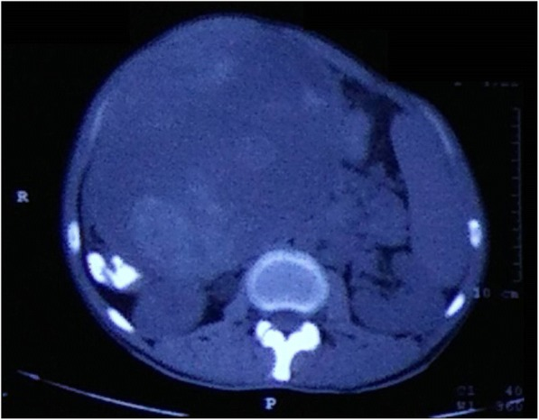
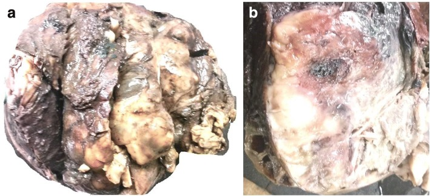
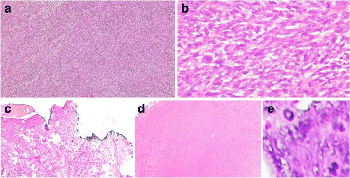
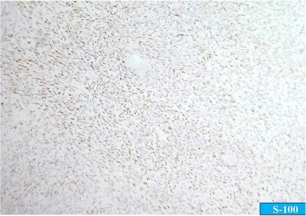
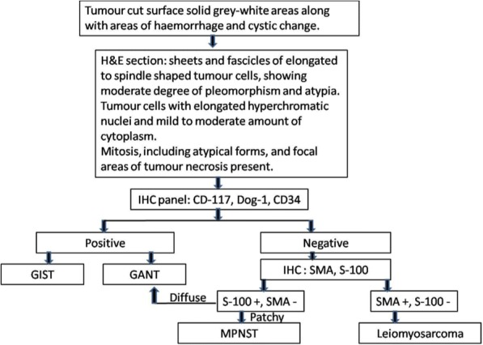
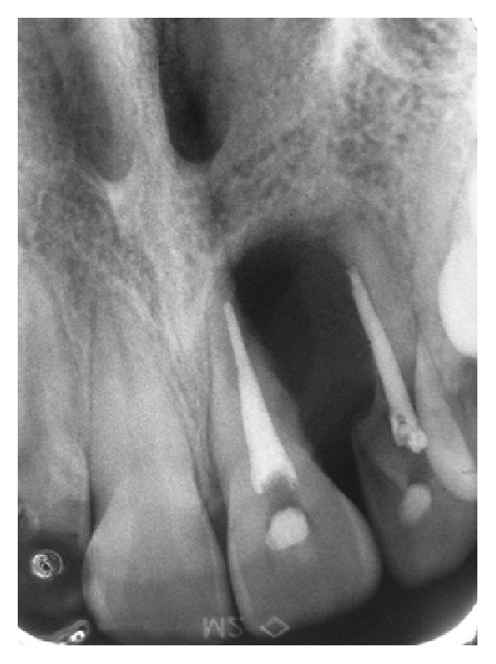
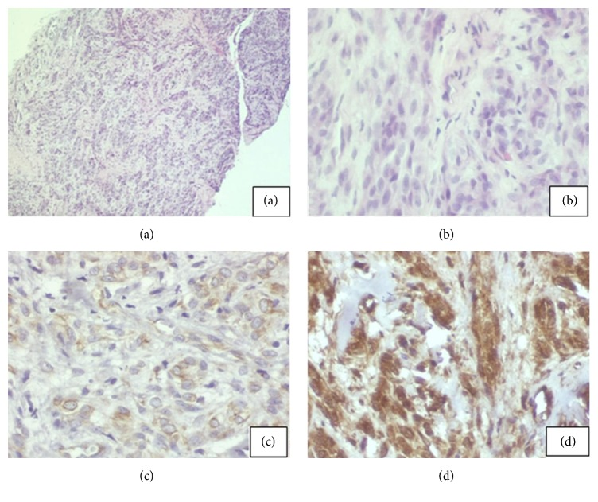
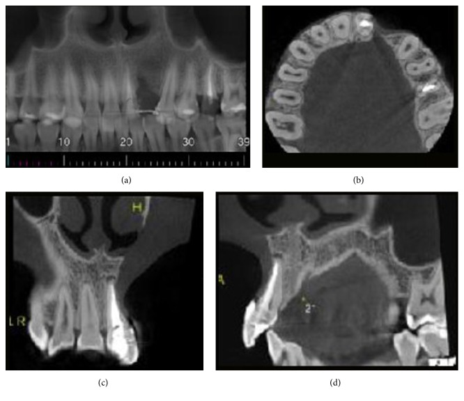
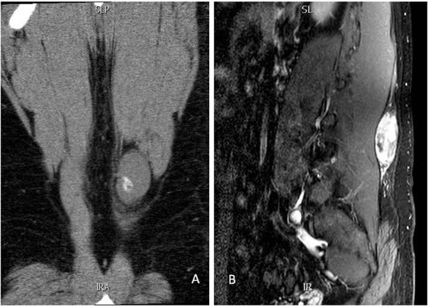
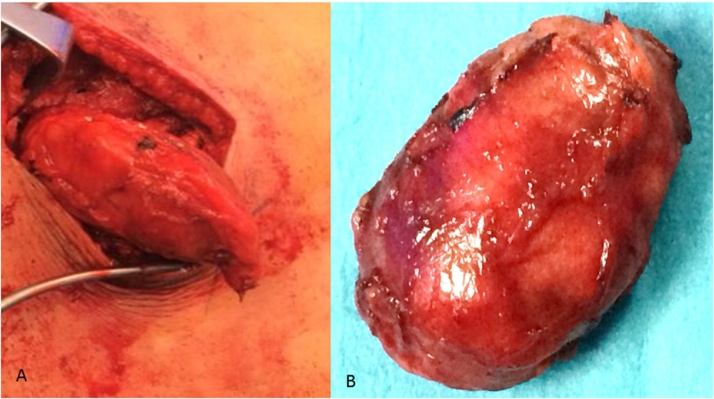

# Case Prep: Peripheral Nerve Sheath Tumor Resection (Schwannoma / Neurofibroma)

---

<!-- BEGIN CASE SNAPSHOT -->

## Case / Approach Snapshot

- **Anatomy at risk:** nerve course, fascicles, compression points, motor and sensory branches, adjacent vessels, scar planes, and distal targets for repair or transfer.
- **Operative steps:** mark landmarks, expose normal nerve proximally/distally, decompress or mobilize gently, resect/repair/graft/transfer as indicated, verify tension-free alignment, and close to protect gliding tissue; use the detailed operative sequence and approach notes below as the step-by-step source.
- **Rescue plans:** iatrogenic nerve injury, neuroma or neuropathic pain, vascular injury, incomplete decompression, recurrence, wound problems, and therapy/splinting or revision plan.
- **Figures:** review [Figures, Imaging & Video](#figures-imaging--video) and the [Curated Image Set](#curated-image-set); embedded local figures should remain open-access, public-domain, or otherwise reusable with attribution.
- **Papers:** review [High-Yield Literature](#high-yield-literature) for seminal sources, modern reviews, and outcome data specific to this page.

<!-- END CASE SNAPSHOT -->

## One-Liner
[Age]yo [M/F] with a [location] peripheral nerve sheath tumor ([schwannoma / neurofibroma]) of the [named nerve] presenting with [palpable mass / Tinel / pain / deficit] planned for microsurgical resection with nerve preservation.

---

## Figures, Imaging & Video

**🎥 Operative video** — [search operative video on YouTube ▸](https://www.youtube.com/results?search_query=peripheral+nerve+sheath+tumour+surgery) · [The Neurosurgical Atlas ▸](https://www.neurosurgicalatlas.com)

[Neurosurgical Atlas](https://www.neurosurgicalatlas.com) · [Radiopaedia](https://radiopaedia.org/search?q=peripheral%20nerve%20sheath%20tumour&scope=all) · [PubMed Central](https://www.ncbi.nlm.nih.gov/pmc/?term=peripheral+nerve+sheath+tumor+schwannoma+resection) — operative figures © linked; see [media-sources.md](../../resources/media-sources.md)

---

<!-- BEGIN COMMON PIMP QUESTIONS -->

## Common Pimp Questions

Use these to pressure-test preparation for **Peripheral Nerve Sheath Tumor Resection (Schwannoma / Neurofibroma)**:

1. Which nerve fascicles or branches must be identified before releasing or resecting tissue?
2. What exam finding localizes the lesion and what alternative diagnosis could mimic it?
3. What stimulation, ultrasound, microscope, tourniquet, or graft option should be ready?
4. What motor/sensory function is at highest risk and how is it checked in PACU?
5. What splint, therapy, wound, and neuropathic-pain plan should be written?

<!-- END COMMON PIMP QUESTIONS -->

<!-- BEGIN ATTENDING PREFERENCE VARIABLES -->

## Attending Preference Variables

Items that commonly vary by surgeon or institution:

- **Tourniquet use, loupe versus microscope, stimulator settings, and incision length:** [attending-specific]
- **External neurolysis versus transposition/reconstruction threshold:** [attending-specific]
- **Graft/conduit/allograft availability and pathology handling:** [attending-specific]
- **Splinting position, therapy referral, and activity restrictions:** [attending-specific]

<!-- END ATTENDING PREFERENCE VARIABLES -->

<!-- BEGIN CURATED LITERATURE -->

## High-Yield Literature

- **Malignant Peripheral Nerve Sheath Tumor** — James AW. Surgical oncology clinics of North America 2016. [PubMed](https://pubmed.ncbi.nlm.nih.gov/27591499/)
- **Malignant peripheral nerve sheath tumor: pathology and genetics** — Thway K. Annals of diagnostic pathology 2014. [PubMed](https://pubmed.ncbi.nlm.nih.gov/24418643/)
- **Malignant peripheral nerve sheath tumor of tongue: a case report** — Liu Y. Hua xi kou qiang yi xue za zhi = Huaxi kouqiang yixue zazhi = West China journal of stomatology 2023. [PubMed](https://pubmed.ncbi.nlm.nih.gov/37277804/)
- **Malignant peripheral nerve sheath tumor of the transverse colon with peritoneal metastasis: a case report** — Rawal G. Journal of medical case reports 2019. [PubMed](https://pubmed.ncbi.nlm.nih.gov/30654838/)
- **Malignant Peripheral Nerve Sheath Tumor Arising from Small Bowel Mesentery: an Extremely Rare Case with Review of Literature** — Zaheer S. Journal of gastrointestinal cancer 2023. [PubMed](https://pubmed.ncbi.nlm.nih.gov/34796455/)
- **Giant Retroperitoneal Malignant Peripheral Nerve Sheath Tumor Treated with Multiorgan Resection: a Case Report and Review of the Literature** — Acehan T. Indian journal of surgical oncology 2022. [PubMed](https://pubmed.ncbi.nlm.nih.gov/35782801/)
- **Cutaneous Malignant Peripheral Nerve Sheath Tumor** — Luzar B. Surgical pathology clinics 2017. [PubMed](https://pubmed.ncbi.nlm.nih.gov/28477884/)
- **Primary Malignant Peripheral Nerve Sheath Tumor of the Stomach: A Rare Case Report and Review of Literature** — Cui W. International journal of surgical pathology 2023. [PubMed](https://pubmed.ncbi.nlm.nih.gov/35491655/)
- **Toward Understanding the Mechanisms of Malignant Peripheral Nerve Sheath Tumor Development** — Mohamad T. International journal of molecular sciences 2021. [PubMed](https://pubmed.ncbi.nlm.nih.gov/34445326/)
- **Intraosseous Malignant Peripheral Nerve Sheath Tumor of 2 Consecutive Lumbar Vertebrae: A Case Report and Literature Review** — Liu W. World neurosurgery 2019. [PubMed](https://pubmed.ncbi.nlm.nih.gov/31349078/)

<!-- END CURATED LITERATURE -->

---

<!-- BEGIN CURATED IMAGE SET -->

## Curated Image Set

Open-access figures are embedded from PubMed Central articles and kept unique to this guide.

*Fig. 1. Computed tomography scan showing a large, well-circumscribed, heterogenous mass arising from the transverse colon Source: [Malignant peripheral nerve sheath tumor of the transverse colon with peritoneal metastasis: a case report](https://pmc.ncbi.nlm.nih.gov/articles/PMC6337829/) — Journal of Medical Case Reports 2019; CC BY.*

*Fig. 2. a Gross specimen showing a large, globular tumor. b Cut surface showing the presence of solid gray-white areas along with areas of hemorrhage and cystic change Source: [Malignant peripheral nerve sheath tumor of the transverse colon with peritoneal metastasis: a case report](https://pmc.ncbi.nlm.nih.gov/articles/PMC6337829/) — Journal of Medical Case Reports 2019; CC BY.*

*Fig. 3. a Hematoxylin and eosin sections showing sheets and fascicles of elongated to spindle-shaped tumor cells (× 4). b Tumor cells having elongated hyperchromatic nuclei and mild to moderate... Source: [Malignant peripheral nerve sheath tumor of the transverse colon with peritoneal metastasis: a case report](https://pmc.ncbi.nlm.nih.gov/articles/PMC6337829/) — Journal of Medical Case Reports 2019; CC BY.*

*Fig. 4. Immunohistochemistry showing patchy positivity for S-100 Source: [Malignant peripheral nerve sheath tumor of the transverse colon with peritoneal metastasis: a case report](https://pmc.ncbi.nlm.nih.gov/articles/PMC6337829/) — Journal of Medical Case Reports 2019; CC BY.*

*Fig. 5. Diagnostic approach to malignant peripheral nerve sheath tumor of the colon. GANT gastrointestinal autonomic tumor, GIST gastrointestinal stromal tumor, H&E hematoxylin and eosin, IHC... Source: [Malignant peripheral nerve sheath tumor of the transverse colon with peritoneal metastasis: a case report](https://pmc.ncbi.nlm.nih.gov/articles/PMC6337829/) — Journal of Medical Case Reports 2019; CC BY.*

*Figure 1. Periapical radiograph showing radiopaque image of the roots of teeth 21 and 22, which are compatible with root canal filling material, obtained from a radiolucent image of the blurred... Source: [A Rare Malignant Peripheral Nerve Sheath Tumor of the Maxilla Mimicking a Periapical Lesion](https://pmc.ncbi.nlm.nih.gov/articles/PMC5141330/) — Case Reports in Dentistry 2016; CC BY.*

*Figure 2. (a) Cell bundle arrangements with rounded, large nuclei that sometimes contain palisades, strands, and/or hyalinized islands. Hematoxylin and eosin (HE) staining, 40x. (b) Spindle cells... Source: [A Rare Malignant Peripheral Nerve Sheath Tumor of the Maxilla Mimicking a Periapical Lesion](https://pmc.ncbi.nlm.nih.gov/articles/PMC5141330/) — Case Reports in Dentistry 2016; CC BY.*

*Figure 3. (a) CT panoramic reconstruction of maxilla. (b) CT axial reconstruction of the jaw. (c) CT coronal reconstruction of anterior region of maxilla. (d) CT sagittal reconstruction of tooth... Source: [A Rare Malignant Peripheral Nerve Sheath Tumor of the Maxilla Mimicking a Periapical Lesion](https://pmc.ncbi.nlm.nih.gov/articles/PMC5141330/) — Case Reports in Dentistry 2016; CC BY.*

*Fig. 1. Magnetic resonance imaging coronal view (panel A) and sagittal view (panel B) showing clearly the lesion with some calcification. Source: [Malignant peripheral nerve sheath tumor with extensive osteosarcomatous and chondrosarcomatous differentiation: A case report](https://pmc.ncbi.nlm.nih.gov/articles/PMC4936498/) — International Journal of Surgery Case Reports 2016; CC BY-NC-ND.*

*Fig. 2. An operative view showing the lesion as it was dissected from the surrounding structure (Panel A). Panel B showing the excised mass which looked well encapsulated with a smooth surface. Source: [Malignant peripheral nerve sheath tumor with extensive osteosarcomatous and chondrosarcomatous differentiation: A case report](https://pmc.ncbi.nlm.nih.gov/articles/PMC4936498/) — International Journal of Surgery Case Reports 2016; CC BY-NC-ND.*

<!-- END CURATED IMAGE SET -->

---

## History of Present Illness
- Chief complaint: Palpable mass (mobile transversely, not longitudinally), **Tinel sign / shooting pain** on percussion, paresthesias, ± motor/sensory deficit
- Growth, pain pattern, neurological symptoms in the nerve distribution
- **NF1** (neurofibromas, plexiform, malignant transformation risk), **NF2/schwannomatosis** (multiple schwannomas)
- Rapid growth/new pain/deficit → concern for **malignant peripheral nerve sheath tumor (MPNST)**

---

## Past Medical History
- NF1/NF2/schwannomatosis, prior radiation, family history
- Standard PMH

---

## Imaging Review
### MRI with contrast
- Fusiform lesion along nerve, **"split fat sign," target sign** (neurofibroma), "tail sign" (entering/exiting nerve), enhancement, cystic change
- Relationship to parent nerve, size
- **Features concerning for MPNST:** large (> 5 cm), heterogeneous, rapid growth, ill-defined margins, invasion → consider PET, biopsy
### Ultrasound / EMG (selective)
- Nerve continuity, function

---

## Labs
- CBC, BMP, Coags, Type and screen

---

## Neurological Examination
- Detailed motor/sensory of the involved nerve, Tinel, mass characteristics; **document baseline deficit**

---

## Surgical Planning

### Case Logistics, OR Needs & Orders
- **Typical bed:** outpatient or short PACU stay; admit only for major plexus reconstruction, medical frailty, pain-control needs, or extensive tumor resection.
- **OR setup:** hand table or radiolucent arm board, tourniquet when used, loupes/microscope available for nerve repair/tumor work, bipolar, microsuture/nerve-wrap options, and nerve stimulator for plexus or motor-branch cases.
- **Special needs:** regional/local/WALANT versus general anesthesia plan, antibiotic decision for implants/long exposure, anticoagulation plan, and clear laterality/site marking with preop motor/sensory baseline documented.
- **Immediate postop orders:** elevation, soft dressing or splint duration, early finger/limb ROM unless repair restricts it, oral analgesia, wound check/suture removal timing, therapy referral, and return precautions for hematoma or new motor deficit.

### Diagnosis & Indication
- Indication: Symptomatic (pain, deficit, growth), diagnostic uncertainty, cosmesis; **schwannoma** usually enucleable with nerve preservation; **neurofibroma** more intimately involves fascicles (resection may sacrifice some function); **MPNST** → wide resection + oncology (different operation)
- Goals: Complete tumor removal with maximal nerve preservation

### Position & Anesthesia
- Per location (extremity on hand/arm table, tourniquet for limbs); regional/general; **no long-acting paralytic** (nerve stimulation)

### Key Surgical Steps (Schwannoma — Enucleation)
1. Tourniquet (limb), incision over the lesion along the nerve
2. Expose the parent nerve proximal and distal to the tumor (control/identify normal nerve)
3. Identify the tumor displacing fascicles to the periphery (schwannoma arises eccentrically from one fascicle)
4. **Epineurotomy** over the tumor (longitudinal, away from majority of fascicles)
5. **Nerve stimulation** to map functional fascicles on the capsule (avoid the conducting fascicles)
6. Identify the **entering/exiting (non-functional) fascicle** of origin; dissect the tumor free in the plane between capsule and surrounding fascicles
7. **Enucleate** the schwannoma, sacrificing only the single involved (usually non-functional) fascicle
8. Preserve all other fascicles
9. Hemostasis, closure
10. **Neurofibroma:** if fascicles run through tumor, may require resection of a nerve segment ± grafting (counsel re: deficit); intraneural dissection to preserve function where possible

### Critical Anatomy & Structures at Risk
1. **Parent nerve fascicles** — functional fascicles must be preserved (stimulation mapping)
2. Adjacent vessels (e.g., brachial, sciatic neurovascular bundles)
3. **MPNST** — if malignant, en bloc oncologic resection (different goals)

### Equipment
- Microscope/loupes, microsurgical instruments, **nerve stimulator**, bipolar
- Tourniquet (limb), nerve graft set (if resection/repair anticipated)

### Monitoring
- Intraoperative nerve stimulation/mapping; NAP (nerve action potential) recording for complex cases

### Anesthesia
- **No paralytic** (stimulation), regional/general, tourniquet

### Potential Complications
1. **New neurological deficit** (fascicle injury — more likely neurofibroma)
2. Incomplete resection/recurrence, neuroma/neuropathic pain
3. Missed malignancy (MPNST), vascular injury, infection

---

## Operative Note Template
**Preoperative Diagnosis:** [Named nerve] peripheral nerve sheath tumor ([schwannoma/neurofibroma])

**Postoperative Diagnosis:** Same (pending pathology)

**Procedure:** Microsurgical resection of [named nerve] peripheral nerve sheath tumor with nerve preservation

**Surgeon / Assistant:**
**Anesthesia:** [Regional / general], no long-acting paralytic (stimulation)
**Tourniquet / EBL:** [Tourniquet for limb]
**Adjuncts:** Microscope/loupes, **nerve stimulator**, [NAP recording], nerve graft set available
**Complications:** None

**Indications:** [Age]yo [M/F] with a [symptomatic/growing] [named nerve] nerve sheath tumor (MRI: fusiform, split-fat/target/tail signs). Risks (deficit, neuroma, recurrence, missed malignancy) discussed.

**Description of Procedure:** After consent and time-out, [regional/general] anesthesia (no paralytic) was given and the [tourniquet] inflated. An incision over the lesion exposed the **parent nerve proximal and distal** to the tumor. The tumor was identified displacing fascicles peripherally; an **epineurotomy** was made over the tumor away from the bulk of fascicles, and the capsule **mapped with nerve stimulation** to identify and avoid conducting fascicles.

[Schwannoma: the **non-functional fascicle of origin** was identified, the tumor dissected in the capsule–fascicle plane, and **enucleated, sacrificing only that single fascicle** while preserving all functional fascicles.] [Neurofibroma: intraneural dissection preserved function where possible; (if a nerve segment required resection, graft repair was performed).] [Frozen section was sent for malignancy concern.]

The tourniquet was released, hemostasis obtained, and closure performed. The patient was assessed for nerve function vs baseline.

---

## Postoperative Plan
- Outpatient/short stay; soft dressing, limb elevation
- Neuro checks (nerve function vs baseline)
- Pathology (confirm benign; if MPNST → oncology, staging, wide resection/radiation)
- Therapy if deficit; follow-up 2 weeks; NF surveillance if syndromic
