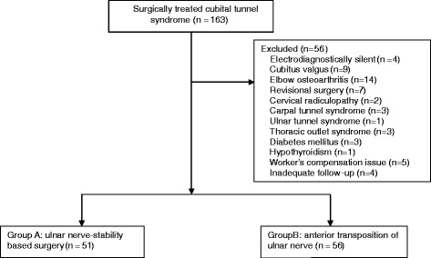
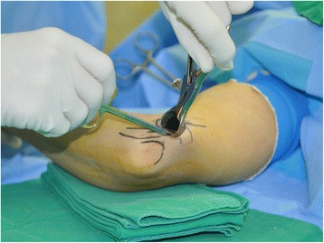
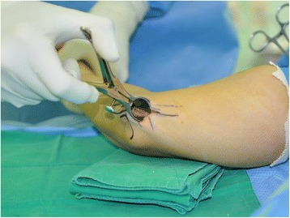
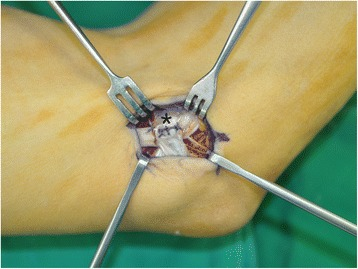
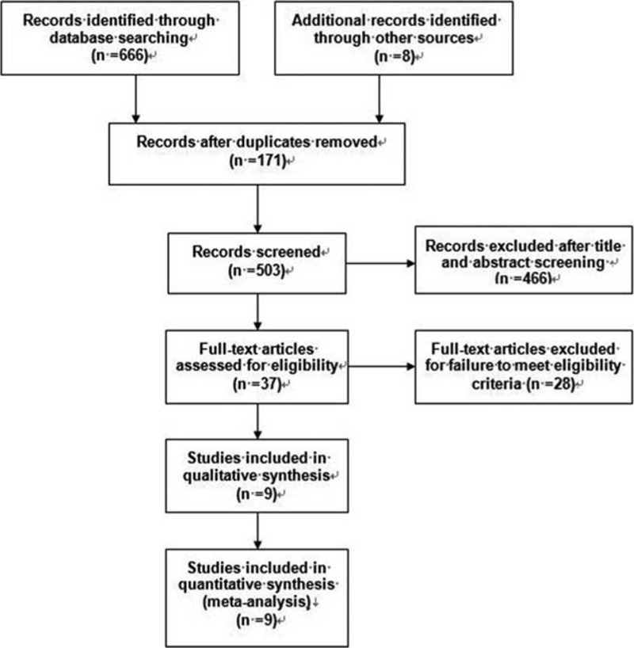
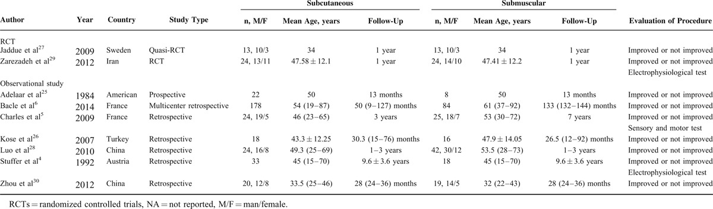
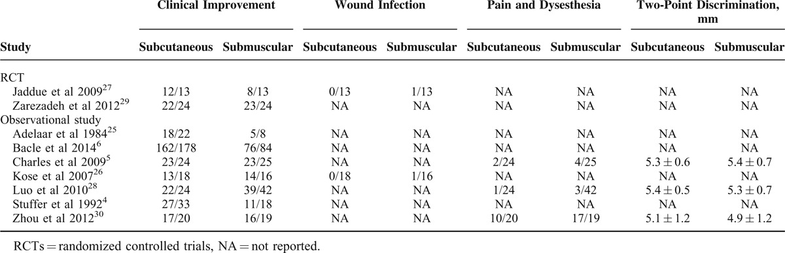
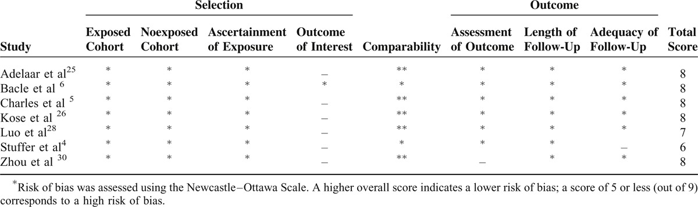
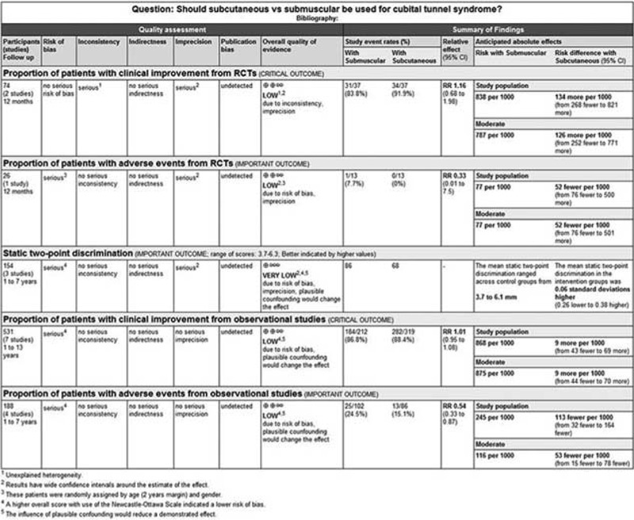
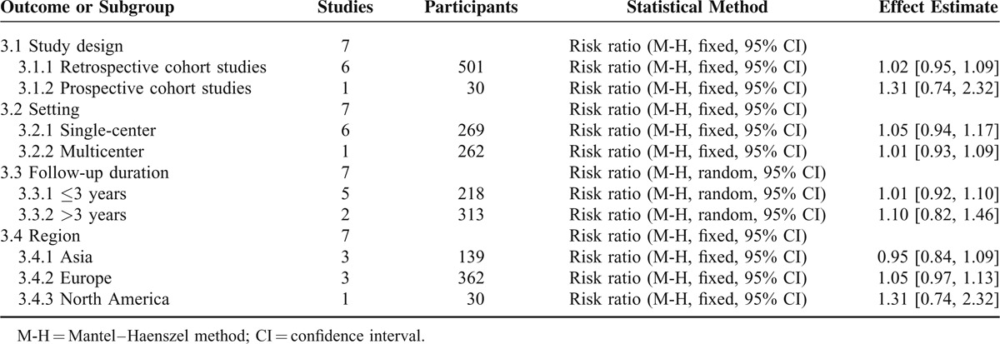

# Case Prep: Cubital Tunnel Release / Ulnar Nerve Transposition

<!-- BEGIN CASE SNAPSHOT -->

## Case / Approach Snapshot

- **Anatomy at risk:** nerve course, fascicles, compression points, motor and sensory branches, adjacent vessels, scar planes, and distal targets for repair or transfer.
- **Operative steps:** mark landmarks, expose normal nerve proximally/distally, decompress or mobilize gently, resect/repair/graft/transfer as indicated, verify tension-free alignment, and close to protect gliding tissue; use the detailed operative sequence and approach notes below as the step-by-step source.
- **Rescue plans:** iatrogenic nerve injury, neuroma or neuropathic pain, vascular injury, incomplete decompression, recurrence, wound problems, and therapy/splinting or revision plan.
- **Figures:** review [Figures, Imaging & Video](#figures-imaging--video) and the [Curated Image Set](#curated-image-set); embedded local figures should remain open-access, public-domain, or otherwise reusable with attribution.
- **Papers:** review [High-Yield Literature](#high-yield-literature) for seminal sources, modern reviews, and outcome data specific to this page.

<!-- END CASE SNAPSHOT -->

## One-Liner
[Age]yo [M/F] with [left/right] cubital tunnel syndrome (ulnar neuropathy at the elbow) refractory to conservative management planned for [in situ decompression / anterior (subcutaneous/submuscular) transposition] of the ulnar nerve.

---

## Figures, Imaging & Video

**🎥 Operative video** — [search operative video on YouTube ▸](https://www.youtube.com/results?search_query=cubital+tunnel+syndrome+surgery) · [The Neurosurgical Atlas ▸](https://www.neurosurgicalatlas.com)

**CNS Video Library**

<iframe src="https://www.youtube-nocookie.com/embed/EGLyeVvhq6I" title="CNS Neurosurgery 100: Peripheral Nerve: Entrapment" loading="lazy" allow="accelerometer; clipboard-write; encrypted-media; picture-in-picture; web-share" allowfullscreen></iframe>

[Neurosurgical Atlas](https://www.neurosurgicalatlas.com) · [Radiopaedia](https://radiopaedia.org/search?q=cubital%20tunnel%20syndrome&scope=all) · [PubMed Central](https://www.ncbi.nlm.nih.gov/pmc/?term=ulnar+nerve+transposition+cubital+tunnel) — operative figures © linked; see [media-sources.md](../../resources/media-sources.md)

---

<!-- BEGIN CURATED LITERATURE -->

## High-Yield Literature

- **Cubital Tunnel Syndrome: Current Concepts** — Staples JR. The Journal of the American Academy of Orthopaedic Surgeons 2017. [PubMed](https://pubmed.ncbi.nlm.nih.gov/28953087/)
- **Ulnar neuropathy at the elbow** — Cambon-Binder A. Orthopaedics & traumatology, surgery & research : OTSR 2021. [PubMed](https://pubmed.ncbi.nlm.nih.gov/33321238/)
- **Modern Treatment of Cubital Tunnel Syndrome: Evidence and Controversy** — Graf A. Journal of hand surgery global online 2023. [PubMed](https://pubmed.ncbi.nlm.nih.gov/37521554/)
- **A Comprehensive Review of Cubital Tunnel Syndrome** — Anderson D. Orthopedic reviews 2022. [PubMed](https://pubmed.ncbi.nlm.nih.gov/36128335/)
- **Higher Revision Rates With In Situ Decompression as Compared to Ulnar Nerve Transposition for Cubital Tunnel Syndrome: A Meta-Regression Analysis** — Reichenbach R. Cureus 2024. [PubMed](https://pubmed.ncbi.nlm.nih.gov/39347368/)
- **Challenging the dogma: anterior transposition of the ulnar nerve is indicated in recurrent cubital tunnel syndrome** — Ruettermann M. The Journal of hand surgery, European volume 2021. [PubMed](https://pubmed.ncbi.nlm.nih.gov/33153381/)
- **Novel Technique for Ulnar Nerve Transposition at the Elbow: The Neocubital Tunnel** — Bakhach J. Plastic and reconstructive surgery. Global open 2024. [PubMed](https://pubmed.ncbi.nlm.nih.gov/39206214/)
- **Decision-Making Factors for Ulnar Nerve Transposition in Cubital Tunnel Surgery** — DeGeorge BR Jr. Journal of wrist surgery 2019. [PubMed](https://pubmed.ncbi.nlm.nih.gov/30941260/)
- **Subcutaneous Versus Submuscular Anterior Transposition of the Ulnar Nerve for Cubital Tunnel Syndrome: A Systematic Review and Meta-Analysis of Randomized Controlled Trials and Observational Studies** — Liu CH. Medicine 2015. [PubMed](https://pubmed.ncbi.nlm.nih.gov/26200640/)
- **Ulnar Nerve Decompression With Subcutaneous Transposition** — Jurgensmeier K. Video journal of sports medicine 2024. [PubMed](https://pubmed.ncbi.nlm.nih.gov/40308843/)

<!-- END CURATED LITERATURE -->

<!-- BEGIN CURATED IMAGE SET -->

## Curated Image Set

Open-access figures are embedded from PubMed Central articles and kept unique to this guide.

*Fig. 1. The CONSORT diagram of enrollment and analysis in this study Source: [Ulnar nerve stability-based surgery for cubital tunnel syndrome via a small incision: a comparison with classic anterior nerve transposition](https://pmc.ncbi.nlm.nih.gov/articles/PMC4526197/) — Journal of Orthopaedic Surgery and Research 2015; CC BY.*

*Fig. 2. While introducing and opening a long nasal speculum over the brachial fascia, the proximal nerve compression structures including the arcade of Struthers were completely released Source: [Ulnar nerve stability-based surgery for cubital tunnel syndrome via a small incision: a comparison with classic anterior nerve transposition](https://pmc.ncbi.nlm.nih.gov/articles/PMC4526197/) — Journal of Orthopaedic Surgery and Research 2015; CC BY.*

*Fig. 3. After releasing the proximal nerve compression structures, Osborne’s ligament, Osborne’s fascia, and the deep flexor-pronator aponeurosis were sequentially released Source: [Ulnar nerve stability-based surgery for cubital tunnel syndrome via a small incision: a comparison with classic anterior nerve transposition](https://pmc.ncbi.nlm.nih.gov/articles/PMC4526197/) — Journal of Orthopaedic Surgery and Research 2015; CC BY.*

*Fig. 4. In patients with an unstable ulnar nerve, the nerve was anteriorly transposed, and a fascial sling (*) was created Source: [Ulnar nerve stability-based surgery for cubital tunnel syndrome via a small incision: a comparison with classic anterior nerve transposition](https://pmc.ncbi.nlm.nih.gov/articles/PMC4526197/) — Journal of Orthopaedic Surgery and Research 2015; CC BY.*

*FIGURE 1. Review flow diagram. Source: [Subcutaneous Versus Submuscular Anterior Transposition of the Ulnar Nerve for Cubital Tunnel Syndrome](https://pmc.ncbi.nlm.nih.gov/articles/PMC4602994/) — Medicine 2015; CC BY.*

*Figure 6. Source: [Subcutaneous Versus Submuscular Anterior Transposition of the Ulnar Nerve for Cubital Tunnel Syndrome: A Systematic Review and Meta-Analysis of Randomized Controlled Trials and Observational Studies](https://pmc.ncbi.nlm.nih.gov/articles/PMC4602994/) — Medicine (Baltimore). 2015 Jul 24;94(29):e1207. doi: 10.1097/MD.0000000000001207; CC BY.*

*Figure 7. Source: [Subcutaneous Versus Submuscular Anterior Transposition of the Ulnar Nerve for Cubital Tunnel Syndrome: A Systematic Review and Meta-Analysis of Randomized Controlled Trials and Observational Studies](https://pmc.ncbi.nlm.nih.gov/articles/PMC4602994/) — Medicine (Baltimore). 2015 Jul 24;94(29):e1207. doi: 10.1097/MD.0000000000001207; CC BY.*

*Figure 8. Source: [Subcutaneous Versus Submuscular Anterior Transposition of the Ulnar Nerve for Cubital Tunnel Syndrome: A Systematic Review and Meta-Analysis of Randomized Controlled Trials and Observational Studies](https://pmc.ncbi.nlm.nih.gov/articles/PMC4602994/) — Medicine (Baltimore). 2015 Jul 24;94(29):e1207. doi: 10.1097/MD.0000000000001207; CC BY.*

*FIGURE 4. The quality of the evidences for each outcome. Source: [Subcutaneous Versus Submuscular Anterior Transposition of the Ulnar Nerve for Cubital Tunnel Syndrome](https://pmc.ncbi.nlm.nih.gov/articles/PMC4602994/) — Medicine 2015; CC BY.*

*Figure 10. Source: [Subcutaneous Versus Submuscular Anterior Transposition of the Ulnar Nerve for Cubital Tunnel Syndrome: A Systematic Review and Meta-Analysis of Randomized Controlled Trials and Observational Studies](https://pmc.ncbi.nlm.nih.gov/articles/PMC4602994/) — Medicine (Baltimore). 2015 Jul 24;94(29):e1207. doi: 10.1097/MD.0000000000001207; CC BY.*

<!-- END CURATED IMAGE SET -->

---

## History of Present Illness
- Chief complaint: Numbness/tingling in ulnar distribution (small + ulnar ring finger), medial elbow pain, hand weakness/clumsiness, worse with elbow flexion (phone, sleeping)
- Intrinsic hand weakness, grip/pinch weakness; advanced: clawing, Wartenberg/Froment signs, intrinsic atrophy
- Failed conservative: night extension splinting, activity modification, padding
- Prior elbow trauma/fracture (tardy ulnar palsy), arthritis

---

## Past Medical History
- Diabetes, prior elbow trauma/fracture/arthritis, prior surgery, occupational/positional factors
- Standard PMH

---

## Imaging / Studies
### EMG/NCS
- **Ulnar neuropathy at the elbow** — conduction slowing/block across the elbow, localizes lesion, severity, excludes C8-T1 radiculopathy/Guyon canal
### X-ray / Ultrasound (selective)
- Elbow bony anatomy (cubitus valgus, osteophytes), nerve subluxation, mass

---

## Labs
- Per comorbidity; routine pre-op

---

## Neurological Examination
- Ulnar sensory (small/ulnar ring, dorsal ulnar hand), **intrinsics (interossei, FDI, hypothenar, FDP to small/ring), Froment, Wartenberg, clawing**, Tinel at elbow, elbow flexion test, nerve subluxation with flexion

---

## Surgical Planning

### Case Logistics, OR Needs & Orders
- **OR setup:** hand table or radiolucent arm board, tourniquet when used, loupes/microscope available for nerve repair/tumor work, bipolar, microsuture/nerve-wrap options, and nerve stimulator for plexus or motor-branch cases.
- **Special needs:** regional/local/WALANT versus general anesthesia plan, antibiotic decision for implants/long exposure, anticoagulation plan, and clear laterality/site marking with preop motor/sensory baseline documented.
- **Immediate postop orders:** elevation, soft dressing or splint duration, early finger/limb ROM unless repair restricts it, oral analgesia, wound check/suture removal timing, therapy referral, and return precautions for hematoma or new motor deficit.

### Procedure Selection
- **In situ decompression** (simple cubital tunnel release): release Osborne ligament/cubital tunnel retinaculum, FCU aponeurosis; for nerve that does NOT subluxate; less dissection, preserves blood supply
- **Anterior transposition (subcutaneous or submuscular):** for nerve subluxation/dislocation, recurrent cases, significant valgus, bony deformity — moves nerve anterior to flexion axis (relieves traction)
- **Medial epicondylectomy:** alternative
- Endoscopic in situ release: option

### Decision Points Before Incision
- Match the operation to the failure mode: static compression alone often fits in situ release; dynamic subluxation, traction over a valgus elbow, post-traumatic deformity, scarring, or failed release pushes toward transposition.
- Document severity: sensory-only disease, intrinsic weakness, clawing, denervation on EMG, and chronic atrophy have different recovery expectations.
- Examine for double-crush or mimics: cervical radiculopathy, brachial plexopathy, Guyon canal compression, diabetic neuropathy, and medial epicondylitis can all cloud the outcome.
- Plan the postoperative immobilization and therapy around technique; submuscular transposition pays for its deeper bed with more soft-tissue morbidity and stiffness risk.

### Position & Anesthesia
- Supine, arm on hand table, shoulder abducted/externally rotated, elbow flexed, **tourniquet**; regional/general

### Key Surgical Steps (Transposition)
1. Tourniquet, curvilinear incision posterior/medial elbow between medial epicondyle and olecranon
2. **Protect medial antebrachial cutaneous nerve (MABC) branches** (cross the field — neuroma if injured)
3. Identify ulnar nerve proximal to the cubital tunnel
4. **Decompress:** release the cubital tunnel retinaculum (Osborne), arcade of Struthers proximally, and the FCU aponeurosis (two heads) distally — release all compression points
5. **Mobilize the nerve**, preserving its segmental blood supply; ligate/divide tethering articular branches (preserve motor branches to FCU)
6. **Transpose anterior** to the medial epicondyle:
   - **Subcutaneous:** place anterior to epicondyle, secure with fascial sling (prevent subluxation back)
   - **Submuscular:** under the flexor-pronator mass (release and reattach origin)
7. Ensure no kinking/new compression along new course; check through full ROM
8. Release tourniquet, hemostasis, closure, soft dressing ± splint

### Critical Anatomy & Structures at Risk
1. **Ulnar nerve** and its **motor branches to FCU** (preserve), articular branches (sacrifice)
2. **Medial antebrachial cutaneous nerve (MABC)** — painful neuroma
3. New compression/kinking at transposition site, devascularization (preserve vessels)
4. Medial epicondyle, flexor-pronator origin (submuscular)

### Equipment
- Minor/peripheral nerve set, tourniquet, loupes, bipolar, nerve stimulator
- Endoscopic system (if endoscopic in situ)

### Anesthesia
- Regional/general; tourniquet

### Potential Complications
1. Persistent/recurrent symptoms (incomplete release, perineural scar)
2. **MABC neuroma**, ulnar nerve injury/devascularization
3. New compression at transposition, elbow stiffness/flexion contracture, instability of nerve
4. Hematoma, infection

### Failure and Revision Logic
- **Persistent early symptoms:** verify complete proximal/distal release, hematoma, excessive tension, and whether preoperative axonal loss makes recovery slow rather than failed.
- **New medial forearm pain:** suspect MABC branch injury/neuroma or scar tethering; document sensory territory and avoid assuming recurrent cubital tunnel.
- **Recurrent compression after in situ release:** look for scarring, missed FCU/aponeurotic band, nerve subluxation, or valgus traction; revision often requires transposition with careful vascular preservation.
- **Symptoms after transposition:** check for kinking at the fascial sling, compression at the new tunnel edges, devascularization, or instability back over the epicondyle through elbow ROM.
- **Severe intrinsic atrophy:** counsel that decompression protects remaining function and may improve sensation/pain, but motor recovery can take months and may be incomplete.

---

## Operative Note Template
**Preoperative Diagnosis:** [Left/Right] cubital tunnel syndrome (ulnar neuropathy at the elbow)

**Postoperative Diagnosis:** Same

**Procedure:** [Left/Right] [in situ cubital tunnel release / anterior subcutaneous (or submuscular) ulnar nerve transposition]

**Surgeon / Assistant:**
**Anesthesia:** [Regional / general]
**Tourniquet / EBL:** [Tourniquet] / minimal
**Adjuncts:** Loupes, nerve stimulator
**Complications:** None

**Indications:** [Age]yo [M/F] with [left/right] cubital tunnel syndrome (EMG-confirmed) refractory to conservative care [± nerve subluxation/intrinsic weakness]. [Transposition chosen for subluxation/valgus.] Risks (MABC neuroma, persistent symptoms, new compression) discussed.

**Description of Procedure:** After consent and time-out, [regional] anesthesia was given and the [tourniquet] inflated. A curvilinear medial elbow incision was made between the medial epicondyle and olecranon, **protecting the medial antebrachial cutaneous nerve branches**. The ulnar nerve was identified and **all compression points released — the arcade of Struthers, the cubital tunnel retinaculum (Osborne), and the FCU aponeurosis**. 

[In situ: the release was confirmed adequate.] [Transposition: the nerve was **mobilized preserving its segmental blood supply** (dividing tethering articular branches, sparing FCU motor branches) and **transposed anterior to the epicondyle (subcutaneous with a fascial sling / submuscular under the flexor-pronator origin)**, with a **full-ROM check confirming no kinking/new compression**.]

The tourniquet was released, hemostasis obtained, and closure performed [± splint]. The patient was discharged with early ROM.

---

## Postoperative Plan
- Outpatient; soft dressing ± elbow splint (submuscular longer immobilization), elevate
- Early hand/finger ROM; elbow ROM progression per technique
- Suture removal ~10-14 days; therapy
- Counsel: sensory recovery before motor; atrophy/weakness slow to recover
- Follow-up 2 weeks

<!-- BEGIN COMMON PIMP QUESTIONS -->

## Common Pimp Questions

Use these to pressure-test preparation for **Cubital Tunnel Release / Ulnar Nerve Transposition**:

1. Which nerve fascicles or branches must be identified before releasing or resecting tissue?
2. What exam finding localizes the lesion and what alternative diagnosis could mimic it?
3. What stimulation, ultrasound, microscope, tourniquet, or graft option should be ready?
4. What motor/sensory function is at highest risk and how is it checked in PACU?
5. What splint, therapy, wound, and neuropathic-pain plan should be written?

<!-- END COMMON PIMP QUESTIONS -->

<!-- BEGIN ATTENDING PREFERENCE VARIABLES -->

## Attending Preference Variables

Items that commonly vary by surgeon or institution:

- **Tourniquet use, loupe versus microscope, stimulator settings, and incision length:** [attending-specific]
- **External neurolysis versus transposition/reconstruction threshold:** [attending-specific]
- **Graft/conduit/allograft availability and pathology handling:** [attending-specific]
- **Splinting position, therapy referral, and activity restrictions:** [attending-specific]

<!-- END ATTENDING PREFERENCE VARIABLES -->
