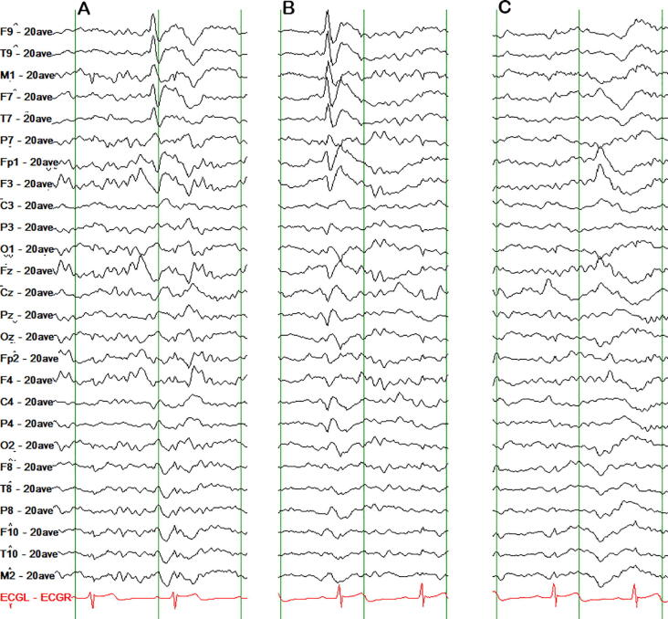
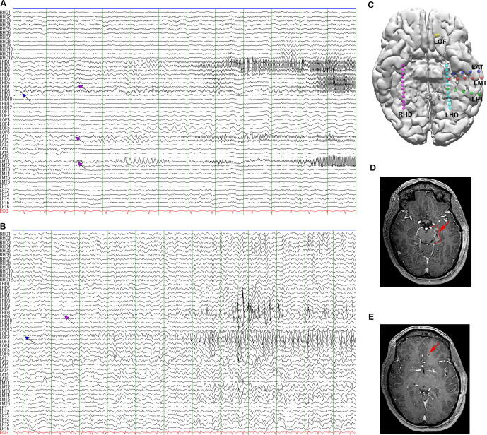
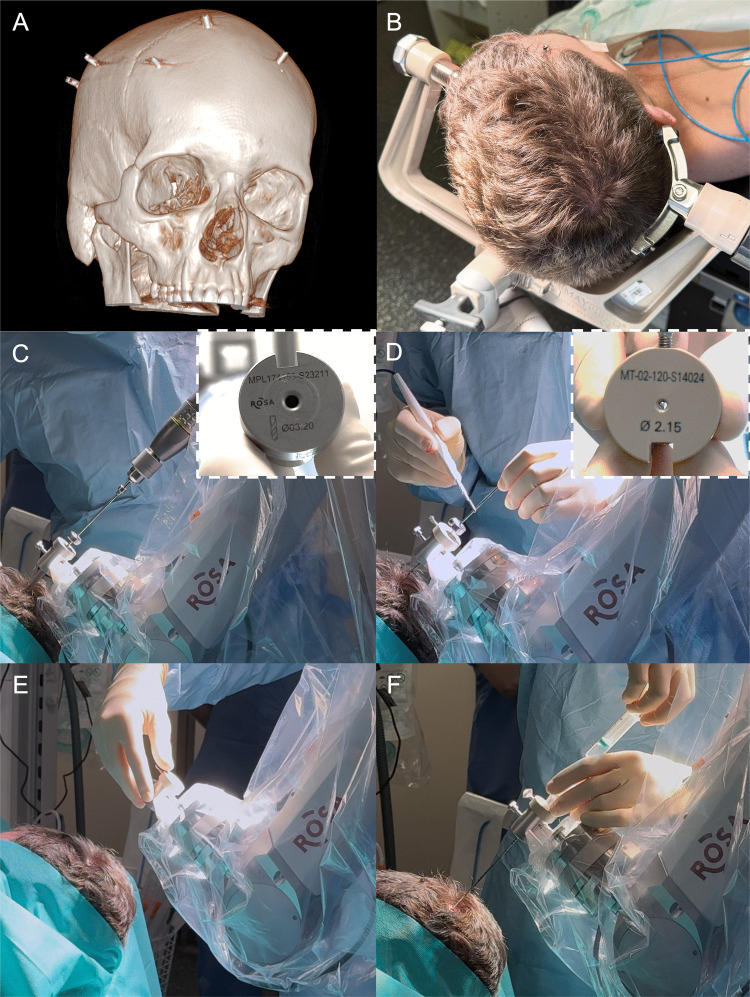
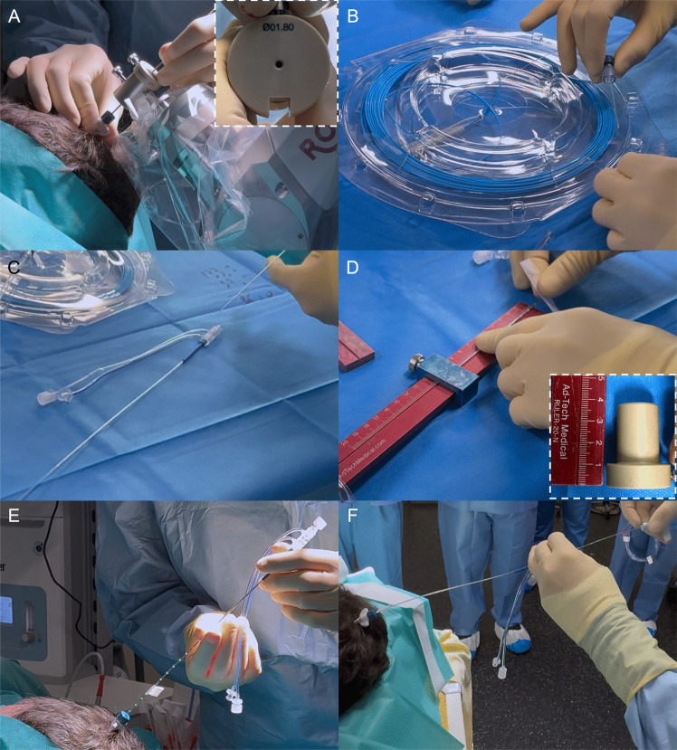
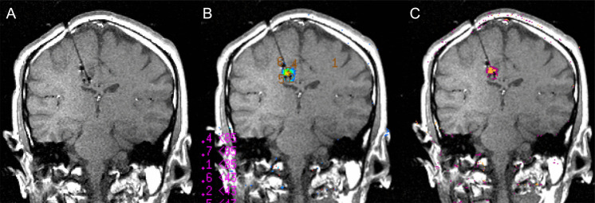
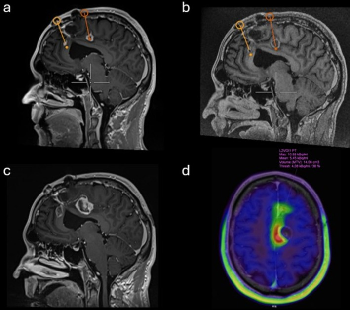
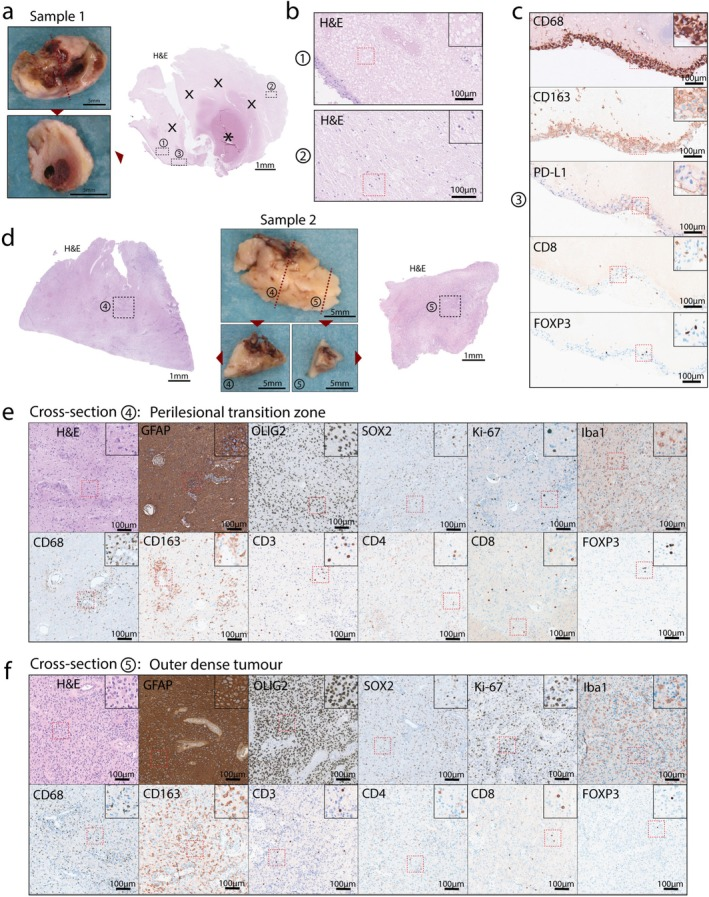
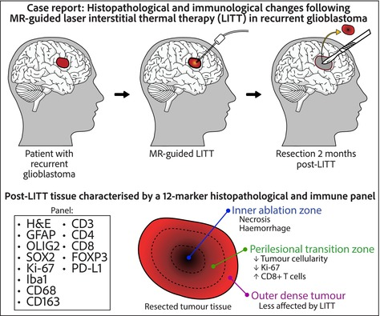
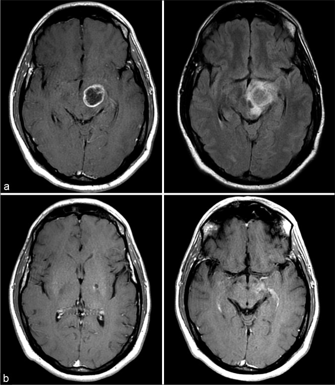
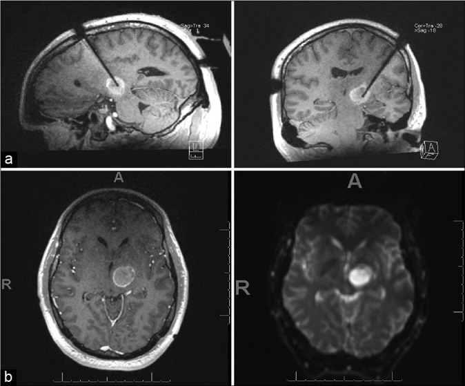

# Case Prep: Laser Interstitial Thermal Therapy (LITT)

---

<!-- BEGIN CASE DOSSIER -->

## Case / Approach Dossier

- **Anatomy at risk:** target volume, organs at risk, cranial nerves, optic apparatus/brainstem/cord tolerance, vascular structures, and prior-treatment fields.
- **Operative steps:** define indication, fuse imaging, contour target and organs at risk, choose dose/fractionation, check constraints and conformity, deliver treatment, and plan imaging follow-up; use the detailed operative sequence and approach notes below as the step-by-step source.
- **Rescue plans:** edema, radionecrosis, cranial neuropathy, optic/brainstem tolerance issue, hemorrhage, progression versus treatment effect, steroids/bevacizumab, surgery, or repeat radiation strategy.
- **Figures:** review [Figures, Imaging & Video](#figures-imaging--video) and the [Curated Image Set](#curated-image-set); embedded local figures should remain open-access, public-domain, or otherwise reusable with attribution.
- **Papers:** review [High-Yield Literature](#high-yield-literature) for seminal sources, modern reviews, and outcome data specific to this page.
- **Textbook cross-checks:** use [Textbook Cross-Checks](#textbook-cross-checks) and the [Source Crosswalk](../../resources/source-crosswalk.md) to cite copyrighted textbooks/atlases while summarizing in original words.

<!-- END CASE DOSSIER -->

## One-Liner
[Age]yo [M/F] with [deep/eloquent glioma or metastasis / radiation necrosis / mesial temporal epilepsy / hypothalamic hamartoma] planned for MRI-guided stereotactic laser interstitial thermal therapy (LITT).

---

## Figures, Imaging & Video

**🎥 Operative video** — [search operative video on YouTube ▸](https://www.youtube.com/results?search_query=laser+interstitial+thermal+therapy+surgery) · [The Neurosurgical Atlas ▸](https://www.neurosurgicalatlas.com)

[Neurosurgical Atlas](https://www.neurosurgicalatlas.com) · [Radiopaedia](https://radiopaedia.org/search?q=laser%20interstitial%20thermal%20therapy&scope=all) · [PubMed Central](https://www.ncbi.nlm.nih.gov/pmc/?term=laser+interstitial+thermal+therapy+brain) — figures © linked; see [media-sources.md](../../resources/media-sources.md)

---

<!-- BEGIN TEXTBOOK CROSS-CHECKS -->

## Textbook Cross-Checks

- **Tumor and skull-base anatomy:** Youmans and Winn; Schmidek and Sweet; Rhoton Cranial Anatomy; Brain Anatomy and Neurosurgical Approaches — confirm compartment, dural/vascular supply, cranial nerves, venous sinuses, white-matter tracts, and safe surgical corridors.
- **Oncologic strategy:** CNS Radiation Oncology Principles and Practice; Youmans and Winn; Greenberg — summarize goals of resection, adjuvant-therapy context, surveillance, and when subtotal resection is safer.
- **Complication rescue:** Schmidek and Sweet; Greenberg — review edema, seizure, venous injury, endocrinopathy/CSF leak, neurologic deficit, and reconstruction issues.
- **Copyright-safe use:** cite these sources as private cross-checks, then write the guide content in original words; do not re-host textbook pages, figures, tables, or board-review card material. See [Source Crosswalk & Copyright-Safe Use](../../resources/source-crosswalk.md).

<!-- END TEXTBOOK CROSS-CHECKS -->

<!-- BEGIN CURATED LITERATURE -->

## High-Yield Literature

- **Laser interstitial thermal therapy** — Holste KG. Neuro-oncology advances 2020. [PubMed](https://pubmed.ncbi.nlm.nih.gov/32793888/)
- **Laser Interstitial Thermal Therapy for Epilepsy** — Van Gompel JJ. Neurosurgery clinics of North America 2023. [PubMed](https://pubmed.ncbi.nlm.nih.gov/36906331/)
- **Laser interstitial thermal therapy in gliomas** — Bozinov O. Cancer letters 2020. [PubMed](https://pubmed.ncbi.nlm.nih.gov/31991153/)
- **Laser Interstitial Thermal Therapy for Radionecrosis** — Terrapon APR. Neurosurgery clinics of North America 2023. [PubMed](https://pubmed.ncbi.nlm.nih.gov/36906328/)
- **Laser Interstitial Thermal Therapy for Cavernous Malformations: A Systematic Review** — Yousefi O. Frontiers in surgery 2022. [PubMed](https://pubmed.ncbi.nlm.nih.gov/35647010/)
- **Laser interstitial thermal therapy in neuro-oncology applications** — Hong CS. Surgical neurology international 2020. [PubMed](https://pubmed.ncbi.nlm.nih.gov/32874734/)
- **Laser Interstitial Thermal Therapy** — Patel B. Missouri medicine 2020. [PubMed](https://pubmed.ncbi.nlm.nih.gov/32158050/)
- **Laser interstitial thermal therapy in drug-resistant epilepsy** — Shimamoto S. Current opinion in neurology 2019. [PubMed](https://pubmed.ncbi.nlm.nih.gov/30694919/)
- **Laser interstitial thermal therapy for treatment of cerebral radiation necrosis** — Hong CS. International journal of hyperthermia : the official journal of European Society for Hyperthermic Oncology, North American Hyperthermia Group 2020. [PubMed](https://pubmed.ncbi.nlm.nih.gov/32672119/)
- **Posterior Fossa Laser Interstitial Thermal Therapy in Children** — Mirone G. Neurosurgery clinics of North America 2023. [PubMed](https://pubmed.ncbi.nlm.nih.gov/36906329/)

<!-- END CURATED LITERATURE -->

---

<!-- BEGIN CURATED IMAGE SET -->

## Curated Image Set

Open-access figures are embedded from PubMed Central articles and kept unique to this guide.

*Fig. 1. Heterogeneous interictal epileptiform discharges. A: Left temporal sharp wave. B: Left frontotemporal sharp wave. C: Left orbitofrontal sharp wave. High pass filter: 1 Hz. Low pass... Source: [Laser interstitial thermal therapy for NPRL3-related epilepsy with multiple seizure foci: A case report](https://pmc.ncbi.nlm.nih.gov/articles/PMC8249776/) — Epilepsy & Behavior Reports 2021; CC BY-NC-ND.*

*Fig. 2. Illustrations of two independent ictal onsets, depth electrode localization and post-ablation lesions. A: left hippocampal ictal onset (LHD7, 8) with propagation to the left anterior... Source: [Laser interstitial thermal therapy for NPRL3-related epilepsy with multiple seizure foci: A case report](https://pmc.ncbi.nlm.nih.gov/articles/PMC8249776/) — Epilepsy & Behavior Reports 2021; CC BY-NC-ND.*

*Fig. 1. Step 1: Robot-assisted stereotactic biopsy. A CT scan exhibiting five skull-implanted fiducials used for registration, B Skull immobilization and connection to the ROSA system using a... Source: [How I do it: sequential robot-assisted stereotactic biopsy and laser interstitial thermal therapy for epilepsy associated with brain tumors](https://pmc.ncbi.nlm.nih.gov/articles/PMC12678548/) — Acta Neurochirurgica 2025; CC BY-NC-ND.*

*Fig. 2. Step 2: Robot-assisted laser interstitial thermal therapy. A Placement of the guidance bold using a 1.8 mm wide reducer, B Transitory insertion of the flexible optic fiber in the cooling... Source: [How I do it: sequential robot-assisted stereotactic biopsy and laser interstitial thermal therapy for epilepsy associated with brain tumors](https://pmc.ncbi.nlm.nih.gov/articles/PMC12678548/) — Acta Neurochirurgica 2025; CC BY-NC-ND.*

*Fig. 3. Intraoperative installation and brain magnetic resonance imaging (MRI) of laser interstitial thermal therapy. A T1-weighted coronal view showing the position of the optical fiber and the... Source: [How I do it: sequential robot-assisted stereotactic biopsy and laser interstitial thermal therapy for epilepsy associated with brain tumors](https://pmc.ncbi.nlm.nih.gov/articles/PMC12678548/) — Acta Neurochirurgica 2025; CC BY-NC-ND.*

*FIGURE 1. Pre‐ and post‐LITT neuroimaging. Pre‐operative (A) and post‐operative (B) T1‐weighted MRI obtained with half‐dose gadolinium show the trajectories of the laser fibres positioned anterior... Source: [MR‐Guided Laser Interstitial Thermal Therapy for Recurrent Glioblastoma: A Case Report With Novel Insights Into Histopathological Changes and Immunological Responses](https://pmc.ncbi.nlm.nih.gov/articles/PMC13035459/) — Neuropathology and Applied Neurobiology 2026; CC BY-NC.*

*FIGURE 2. Histological analysis of the two lesions following thermal laser ablation. (A) Macroscopic photographs of the first sample taken before and after sectioning, along with an H&E overview... Source: [MR‐Guided Laser Interstitial Thermal Therapy for Recurrent Glioblastoma: A Case Report With Novel Insights Into Histopathological Changes and Immunological Responses](https://pmc.ncbi.nlm.nih.gov/articles/PMC13035459/) — Neuropathology and Applied Neurobiology 2026; CC BY-NC.*

*Figure 8. Source: [MR‐Guided Laser Interstitial Thermal Therapy for Recurrent Glioblastoma: A Case Report With Novel Insights Into Histopathological Changes and Immunological Responses](https://pmc.ncbi.nlm.nih.gov/articles/PMC13035459/) — Neuropathol Appl Neurobiol. 2026 Mar 30;52(2):e70071. doi: 10.1111/nan.70071; CC BY-NC.*

*Figure 1:. Pre and postoperative MRI. (a) Representative preoperative T1 contrast enhanced (left) and FLAIR (right) images. (b) Representative 46.9-month post-LITT T1 contrast enhanced (left) and... Source: [Prolonged survival after laser interstitial thermal therapy in glioblastoma](https://pmc.ncbi.nlm.nih.gov/articles/PMC8248111/) — Surgical Neurology International 2021; CC BY-NC-SA.*

*Figure 2:. Intraoperative and immediate postoperative MRI. (a) Intraoperative MRI demonstrating laser probe position. (b) Immediate postoperative T1-weighterd post-contrast and diffusion-weighted... Source: [Prolonged survival after laser interstitial thermal therapy in glioblastoma](https://pmc.ncbi.nlm.nih.gov/articles/PMC8248111/) — Surgical Neurology International 2021; CC BY-NC-SA.*

<!-- END CURATED IMAGE SET -->

---

## History of Present Illness
- Chief complaint / indication:
  - **Deep/eloquent or surgically inaccessible tumor** (glioma, metastasis) — minimally invasive cytoreduction
  - **Radiation necrosis** (post-SRS) refractory to steroids
  - **Mesial temporal lobe epilepsy** (laser amygdalohippocampotomy — alternative to open ATL)
  - **Hypothalamic hamartoma** (gelastic seizures), other epileptic foci (focal cortical dysplasia, periventricular nodular heterotopia)
- Prior treatments (surgery, SRS, chemo/RT), epilepsy workup (if epilepsy indication)

---

## Past Medical History
- Coagulopathy/anticoagulation (correct — catheter hemorrhage), MRI compatibility, prior radiation/surgery
- Standard PMH; epilepsy workup if applicable (video-EEG, MRI, ± SEEG)

---

## Imaging Review
### MRI (target delineation) + planning
- **Target** (tumor/necrosis/epileptogenic focus) size and shape (LITT best for **smaller, roughly ellipsoid lesions, ~≤3 cm**), proximity to critical structures
- **Trajectory planning** — avascular path avoiding sulci/vessels/ventricles to the target long axis
- Proximity to heat-sensitive structures (large vessels = heat-sink; near optic apparatus/brainstem — caution)
### Intraoperative MRI thermometry
- Real-time temperature mapping during ablation (the defining feature of LITT)

---

## Labs
- CBC, **Coags**, BMP, type and screen

---

## Neurological Examination
- Baseline focal exam (deficits near target), document; epilepsy baseline if applicable

---

## Surgical Planning

### Workflow / Platform
- Stereotactic placement of a **cooled laser fiber catheter** along the planned trajectory, then **MRI-guided thermal ablation with real-time MR thermometry**
- Platforms: **Visualase (Medtronic), NeuroBlate (Monteris)**
- Stereotaxy: frame-based, frameless, or **robotic (ROSA/Mazor)**; bone anchor; often done in or transferred to an **MRI suite (iMRI or diagnostic MRI)**

### Position
- Per trajectory; head fixed (frame/robot reference); MRI-compatible setup

### Key Surgical Steps
1. Plan trajectory (target long axis, avascular path), register stereotactic system
2. Small stab incision, **twist-drill** at entry, place a **bone anchor** along the trajectory
3. Insert the **laser fiber catheter** to the planned depth at the target
4. Confirm catheter position on MRI
5. **MRI-guided ablation:** deliver laser energy while monitoring **real-time MR thermometry**; software predicts the thermal damage estimate; ablate the target while **monitoring temperature at the margins to protect adjacent critical structures** (automatic shutoff if OAR thresholds approached)
6. Reposition/pull-back along the trajectory to ablate the lesion length as needed
7. Confirm ablation coverage (thermal damage map / post-ablation MRI), remove catheter
8. Single suture closure

### Critical Anatomy & Structures at Risk
1. **Adjacent eloquent brain / tracts / cranial nerves / optic apparatus / brainstem** — thermal spread (thermometry protects)
2. **Vessels** along trajectory (hemorrhage) and large vessels near target (heat-sink → incomplete ablation)
3. **Ependyma/ventricle** (trajectory)

### Equipment
- LITT system (Visualase/NeuroBlate — laser, cooled catheter, thermometry software)
- Stereotactic platform (frame/frameless/robot), bone anchor, twist drill
- **MRI suite (intraoperative or diagnostic) with thermometry**, MRI-compatible instruments

### Anesthesia
- General (MRI environment), BP control (hemorrhage), MRI-safe setup

### Potential Complications
1. **Hemorrhage** (catheter placement), **thermal injury to adjacent structures** (deficit), edema (post-ablation — often transient, steroids)
2. Incomplete ablation (large/irregular lesions, heat-sink near vessels), catheter malposition
3. Seizure, infection, transient neurological worsening (peri-ablation edema)
4. For epilepsy: visual field deficit (mesial temporal — optic radiation), memory effects

---

## Procedure Note Template
**Preoperative Diagnosis:** [Deep/eloquent tumor / radiation necrosis / mesial temporal epilepsy / hypothalamic hamartoma]

**Postoperative Diagnosis:** Same

**Procedure:** MRI-guided stereotactic laser interstitial thermal therapy (LITT) of [target] via [frame/frameless/robotic] stereotaxy

**Surgeon / Assistant:**
**Anesthesia:** General endotracheal (MRI environment)
**EBL / Fluids:** Minimal
**Adjuncts:** LITT system [Visualase/NeuroBlate] with cooled laser catheter + real-time MR thermometry, stereotactic platform, bone anchor; intraoperative MRI
**Complications:** None

**Indications:** [Age]yo [M/F] with a [deep/eloquent/small] [target] amenable to minimally invasive ablation. Risks (hemorrhage, thermal injury to adjacent structures, edema, incomplete ablation) discussed. [Biopsy obtained at the same setting as LITT yields no tissue.]

**Description of Procedure:** After consent and time-out, general anesthesia was induced and the patient registered to the [frame/robot] with an avascular trajectory planned along the target long axis. A stab incision and **twist-drill** were made, a **bone anchor** placed, and the **cooled laser catheter** inserted to the planned depth, with position confirmed on MRI.

**MRI-guided ablation was performed with real-time MR thermometry**, delivering laser energy to the target while **monitoring margin temperatures to protect adjacent critical structures** (automatic shutoff thresholds set); the catheter was repositioned along the trajectory to cover the lesion length. The **thermal damage estimate / post-ablation MRI confirmed coverage**, and the catheter was removed and the incision closed with a single suture.

The patient was transferred [to the ICU overnight] with a short steroid course for peri-ablation edema; a postoperative MRI was reviewed.

---

## Post-Treatment Plan
- ICU/step-down overnight, neuro checks; **short steroid course** (peri-ablation edema)
- **Postop MRI** (ablation coverage, hemorrhage), watch for transient edema-related deficit
- DVT prophylaxis, seizure management (epilepsy/tumor)
- Pathology note: **LITT does not provide tissue** — biopsy at same setting if diagnosis needed
- Tumor: oncology follow-up, surveillance MRI (ablation cavity evolves); Epilepsy: seizure-outcome tracking, AED management; Radiation necrosis: symptom/steroid follow-up
