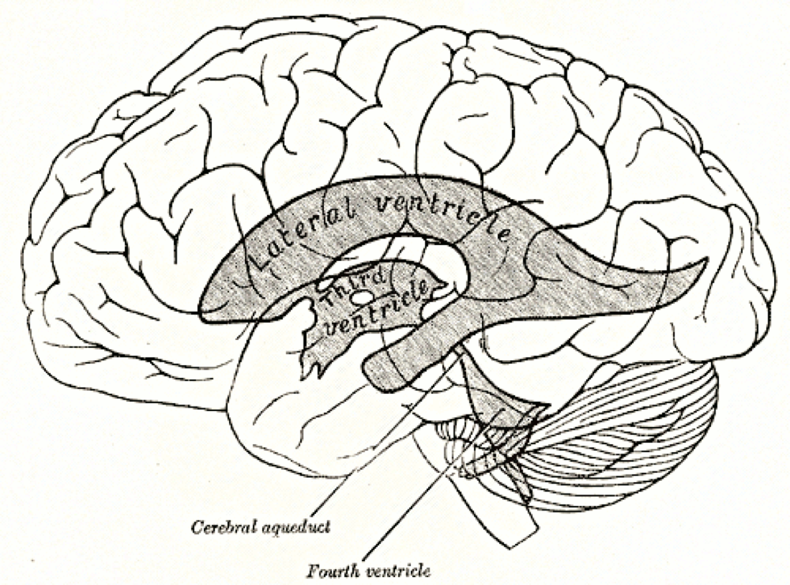

# Case Prep: Laser Interstitial Thermal Therapy (LITT)

---

## One-Liner
[Age]yo [M/F] with [deep/eloquent glioma or metastasis / radiation necrosis / mesial temporal epilepsy / hypothalamic hamartoma] planned for MRI-guided stereotactic laser interstitial thermal therapy (LITT).

---

## Figures, Imaging & Video

**🎥 Operative videos:** [YouTube](https://www.youtube.com/results?search_query=laser+interstitial+thermal+therapy+surgery) · [Neurosurgical Atlas](https://www.google.com/search?q=laser+interstitial+thermal+therapy+site:neurosurgicalatlas.com) · [JNS Neurosurgical Focus: Video](https://www.google.com/search?q=laser+interstitial+thermal+therapy+%22neurosurgical+focus%22+video)

**📑 Key evidence — landmark trials & guidelines**

- **Brain mets (N0574)** — Brown PD et al. *JAMA* 2016 — SRS alone vs SRS + WBRT. [🔗 PubMed](https://pubmed.ncbi.nlm.nih.gov/?term=Brown+N0574+stereotactic+radiosurgery+whole+brain+metastases+2016+JAMA)
- **Trigeminal SRS** — Kondziolka D et al. *NEJM* 1996 — Gamma Knife radiosurgery for trigeminal neuralgia. [🔗 PubMed](https://pubmed.ncbi.nlm.nih.gov/?term=Kondziolka+stereotactic+radiosurgery+trigeminal+neuralgia+1996)
- **AVM/VS SRS** — Pollock BE et al. — long-term radiosurgery outcomes (AVM, vestibular schwannoma). [🔗 PubMed](https://pubmed.ncbi.nlm.nih.gov/?term=Pollock+stereotactic+radiosurgery+arteriovenous+malformation+vestibular+schwannoma+outcome)
- **Guidelines:** [ASTRO guidelines](https://www.astro.org/Patient-Care-and-Practice/Clinical-Practice-Statements) · [CNS](https://www.cns.org/guidelines)

*Gray's Anatomy (1918), public domain — via Wikimedia Commons.*

[Neurosurgical Atlas](https://www.neurosurgicalatlas.com) · [Radiopaedia](https://radiopaedia.org/search?q=laser%20interstitial%20thermal%20therapy&scope=all) · [PubMed Central](https://www.ncbi.nlm.nih.gov/pmc/?term=laser+interstitial+thermal+therapy+brain) — figures © linked; see [media-sources.md](../../resources/media-sources.md)

---

## History of Present Illness
- Chief complaint / indication:
  - **Deep/eloquent or surgically inaccessible tumor** (glioma, metastasis) — minimally invasive cytoreduction
  - **Radiation necrosis** (post-SRS) refractory to steroids
  - **Mesial temporal lobe epilepsy** (laser amygdalohippocampotomy — alternative to open ATL)
  - **Hypothalamic hamartoma** (gelastic seizures), other epileptic foci (focal cortical dysplasia, periventricular nodular heterotopia)
- Prior treatments (surgery, SRS, chemo/RT), epilepsy workup (if epilepsy indication)

---

## Past Medical History
- Coagulopathy/anticoagulation (correct — catheter hemorrhage), MRI compatibility, prior radiation/surgery
- Standard PMH; epilepsy workup if applicable (video-EEG, MRI, ± SEEG)

---

## Imaging Review
### MRI (target delineation) + planning
- **Target** (tumor/necrosis/epileptogenic focus) size and shape (LITT best for **smaller, roughly ellipsoid lesions, ~≤3 cm**), proximity to critical structures
- **Trajectory planning** — avascular path avoiding sulci/vessels/ventricles to the target long axis
- Proximity to heat-sensitive structures (large vessels = heat-sink; near optic apparatus/brainstem — caution)
### Intraoperative MRI thermometry
- Real-time temperature mapping during ablation (the defining feature of LITT)

---

## Labs
- CBC, **Coags**, BMP, type and screen

---

## Neurological Examination
- Baseline focal exam (deficits near target), document; epilepsy baseline if applicable

---

## Surgical Planning

### Workflow / Platform
- Stereotactic placement of a **cooled laser fiber catheter** along the planned trajectory, then **MRI-guided thermal ablation with real-time MR thermometry**
- Platforms: **Visualase (Medtronic), NeuroBlate (Monteris)**
- Stereotaxy: frame-based, frameless, or **robotic (ROSA/Mazor)**; bone anchor; often done in or transferred to an **MRI suite (iMRI or diagnostic MRI)**

### Position
- Per trajectory; head fixed (frame/robot reference); MRI-compatible setup

### Key Surgical Steps
1. Plan trajectory (target long axis, avascular path), register stereotactic system
2. Small stab incision, **twist-drill** at entry, place a **bone anchor** along the trajectory
3. Insert the **laser fiber catheter** to the planned depth at the target
4. Confirm catheter position on MRI
5. **MRI-guided ablation:** deliver laser energy while monitoring **real-time MR thermometry**; software predicts the thermal damage estimate; ablate the target while **monitoring temperature at the margins to protect adjacent critical structures** (automatic shutoff if OAR thresholds approached)
6. Reposition/pull-back along the trajectory to ablate the lesion length as needed
7. Confirm ablation coverage (thermal damage map / post-ablation MRI), remove catheter
8. Single suture closure

### Critical Anatomy & Structures at Risk
1. **Adjacent eloquent brain / tracts / cranial nerves / optic apparatus / brainstem** — thermal spread (thermometry protects)
2. **Vessels** along trajectory (hemorrhage) and large vessels near target (heat-sink → incomplete ablation)
3. **Ependyma/ventricle** (trajectory)

### Equipment
- LITT system (Visualase/NeuroBlate — laser, cooled catheter, thermometry software)
- Stereotactic platform (frame/frameless/robot), bone anchor, twist drill
- **MRI suite (intraoperative or diagnostic) with thermometry**, MRI-compatible instruments

### Anesthesia
- General (MRI environment), BP control (hemorrhage), MRI-safe setup

### Potential Complications
1. **Hemorrhage** (catheter placement), **thermal injury to adjacent structures** (deficit), edema (post-ablation — often transient, steroids)
2. Incomplete ablation (large/irregular lesions, heat-sink near vessels), catheter malposition
3. Seizure, infection, transient neurological worsening (peri-ablation edema)
4. For epilepsy: visual field deficit (mesial temporal — optic radiation), memory effects

---

## Procedure Note Template
**Preoperative Diagnosis:** [Deep/eloquent tumor / radiation necrosis / mesial temporal epilepsy / hypothalamic hamartoma]

**Postoperative Diagnosis:** Same

**Procedure:** MRI-guided stereotactic laser interstitial thermal therapy (LITT) of [target] via [frame/frameless/robotic] stereotaxy

**Surgeon / Assistant:**
**Anesthesia:** General endotracheal (MRI environment)
**EBL / Fluids:** Minimal
**Adjuncts:** LITT system [Visualase/NeuroBlate] with cooled laser catheter + real-time MR thermometry, stereotactic platform, bone anchor; intraoperative MRI
**Complications:** None

**Indications:** [Age]yo [M/F] with a [deep/eloquent/small] [target] amenable to minimally invasive ablation. Risks (hemorrhage, thermal injury to adjacent structures, edema, incomplete ablation) discussed. [Biopsy obtained at the same setting as LITT yields no tissue.]

**Description of Procedure:** After consent and time-out, general anesthesia was induced and the patient registered to the [frame/robot] with an avascular trajectory planned along the target long axis. A stab incision and **twist-drill** were made, a **bone anchor** placed, and the **cooled laser catheter** inserted to the planned depth, with position confirmed on MRI.

**MRI-guided ablation was performed with real-time MR thermometry**, delivering laser energy to the target while **monitoring margin temperatures to protect adjacent critical structures** (automatic shutoff thresholds set); the catheter was repositioned along the trajectory to cover the lesion length. The **thermal damage estimate / post-ablation MRI confirmed coverage**, and the catheter was removed and the incision closed with a single suture.

The patient was transferred [to the ICU overnight] with a short steroid course for peri-ablation edema; a postoperative MRI was reviewed.

---

## Post-Treatment Plan
- ICU/step-down overnight, neuro checks; **short steroid course** (peri-ablation edema)
- **Postop MRI** (ablation coverage, hemorrhage), watch for transient edema-related deficit
- DVT prophylaxis, seizure management (epilepsy/tumor)
- Pathology note: **LITT does not provide tissue** — biopsy at same setting if diagnosis needed
- Tumor: oncology follow-up, surveillance MRI (ablation cavity evolves); Epilepsy: seizure-outcome tracking, AED management; Radiation necrosis: symptom/steroid follow-up
